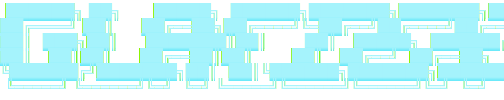

<!--
  Banner ASCII is the canonical art from specs/0001-brand-identity.md.
  Source of truth: assets/logo/banner.txt. Do not edit here in isolation : 
  any change is a brand-identity spec change.
-->

 

[](https://goreportcard.com/report/github.com/nathanbrophy/glacier) [](https://nathanbrophy.github.io/glacier/) [](https://pkg.go.dev/github.com/nathanbrophy/glacier)


Glacier is a Go framework that handles the plumbing so you can focus on what's yours. Like a glacier that shapes the landscape beneath the surface, Glacier is stable, deep, and predictable about the messy parts: argument parsing, configuration layering, lifecycle and signal handling, mock-driven testing, and HTTP transport faking. You write the logic. Glacier handles the rest.

## Status

Glacier is in early design. The repo currently holds the development lifecycle and the brand identity. Code lands as component specs are accepted.

- [`specs/`](specs/) :  the source of truth. Every change is a spec first.
- [`specs/0000-spec-process.md`](specs/0000-spec-process.md) :  how Glacier is built.
- [`specs/0001-brand-identity.md`](specs/0001-brand-identity.md) :  what Glacier looks and feels like.
- [`CLAUDE.md`](CLAUDE.md) :  the rules.

## Glacier SDK

The Glacier SDK is a CLI binary, `glacier`, built on every Glacier framework package. It is the framework's longest-running integration test and the fastest way to start a new Glacier project.

### Install

```sh
go install github.com/nathanbrophy/glacier/cmd/glacier@latest
```

Requires Go 1.25 or later. Confirm the binary is on your PATH:

```sh
glacier version
```

### Commands

| Command | Group | Description |
|---|---|---|
| `glacier init` | CREATE | Scaffold a new Glacier project |
| `glacier new` | CREATE | Add a package, command, or option to an existing project |
| `glacier generate` | DEVELOP | Run code generators (cli, mock, httpmock) |
| `glacier lint` | DEVELOP | gofmt, vet, staticcheck, and Glacier-specific lints |
| `glacier test` | DEVELOP | Live status panel and aggregated summary |
| `glacier version` | INSPECT | Print version; `--check` compares against latest |
| `glacier explain` | INSPECT | Explain a marker, exit code, or config key |
| `glacier vibe` | UTILITY | Glacier vibes animation |
| `glacier completions` | UTILITY | Shell completions (bash, zsh, fish, pwsh) |

### Color and logging

Color is on by default. Pass `--no-color` or set `NO_COLOR` to disable. Pass `--force-color` to keep color when piping to `less -R`. The default log level is Warn; use `-V` for Debug or `--very-verbose` for Trace.

### Why dogfood

Every Glacier framework package is exercised by at least one SDK command. A Lynx-owned coverage row fails CI if any package falls out of use.

[Read the SDK docs](https://nathanbrophy.github.io/glacier/sdk/)

## The Promise

When you use Glacier, you should be able to say each of these truthfully:

1. *"I'm only writing what's mine."*
2. *"I trust the defaults."*
3. *"The error tells me what to do next."*
4. *"Tests are easy because the framework helps."*

Every component spec is reviewed against these four statements. If a design doesn't deliver them, the design is wrong.

## License

License will be selected when the first code spec lands.
