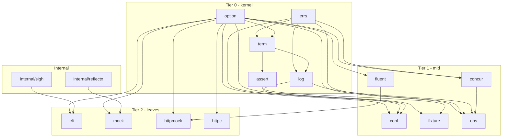

# Concepts

Glacier is 14 packages organized into three tiers. The tiers aren't a metaphor - they're a testable import constraint enforced by a layering test on every PR. Understanding the tiers tells you what you can depend on and what you can't.

## The three tiers

The DAG has no cycles. Forbidden edges are testable invariants - a Lynx-owned test rejects any import that violates them on every PR.

## Tier 0: Kernel {#tier-kernel}

Universal packages. Every consumer of any Glacier package transitively depends on these five. They are small, allocation-light, and stable by design.

- **option** - The `Option[T]` / `OptionFunc[T]` protocol that every package's constructor speaks. Zero deps on other Glacier packages.
- **errs** - Error wrapping, joining, classification, stack traces, and the `Sentinel` constructor that enforces the library register format at construction time.
- **log** - `log/slog` conventions with `Trace` and `Notice` levels, context-attribute attachment (`log.With`), TTY color, and `Redact`.
- **assert** - Test assertions (`Equal[T]`, `NoError`, `Match`, `Len`) with smart deep-compare and the `require/` halt-on-failure mirror.
- **term** - Terminal capability detection, 24-bit ANSI styling, glyph registry, beauty-writer column layout, prompts, animation.

## Tier 1: Mid {#tier-mid}

Mid-tier packages are independent of each other. Each depends only on the kernel. You can import any one of them without pulling in the other four.

- **concur** - Context-aware sync primitives: `Mutex.LockCtx`, `Group` with panic recovery, `Semaphore`, `Pool[T]`, `Once[T]`.
- **fluent** - Lazy `iter.Seq` pipeline operators: `Map`, `Filter`, `Take`, `Window`, `GroupBy`, joins, set ops. Generics-first; zero deps outside kernel.
- **conf** - Layered configuration with atomic snapshots. Defaults, JSON file, env, flags. `Register[T]` returns a typed accessor.
- **fixture** - Test resources: golden files, typed snapshots, deterministic fake clocks, in-memory filesystems, goroutine and FD leak guards.
- **obs** - Opt-in OpenTelemetry via OTLP gRPC. `MeterProvider` and `TracerProvider` with hooks for `httpc`, `cli`, and `conf`. Zero overhead when off.

## Tier 2: Leaves {#tier-leaf}

Leaf packages are large enough to justify isolation. They depend on kernel and mid-tier packages only and never import each other. A consumer who needs only `httpmock` for tests does not pull in `cli`.

- **cli** - CLI builder: struct tags for flags, `glaciergen` codegen for wiring, banner via `//go:embed`, signal handling through `internal/sigh`.
- **mock** - Interface mocks: `mock.Of[T]` reflect-based or `+glacier:mock` codegen typed wrappers. Fluent expectation builder, automatic `Verify` on cleanup.
- **httpmock** - Programmable `http.RoundTripper` for tests. Stub builder, `JSON[T]` response helpers, strict-by-default.
- **httpc** - Typed HTTP client: `Get[T]`, `Post[T]`, `Put[T]` auto-unmarshal. Retry with backoff, dry-run via context.

## Cross-cutting conventions

Seven rules inherited by every package. They are the framework's coherence story.

1. **Functional options.** Every package configurable at construction uses `option.Option[T]`. Unexported `config` struct, `With<Knob>(value)` constructors, `option.Apply` in the package constructor. Boolean knobs use the no-arg form (`Strict()`, not `WithStrict(true)`).

2. **Error contract.** Library errors are lowercase, no trailing period, in the format `package: action: cause`. Per-package sentinels are `Err<Cause>` via `errs.Sentinel`. Typed errors are `<Cause>Error` with `Unwrap`. Multi-error returns use `errs.Join`. `errors.Is`/`errors.As` are the only composition operators - no string matching of `Error()` output.

3. **Context propagation.** `ctx context.Context` is the first parameter of every function that performs I/O, takes time, or is observable from another goroutine. Synchronous constructors do not take ctx. Cancellation surfaces as `ctx.Err()` wrapped in a package-specific sentinel.

4. **Lifecycle.** Constructors are `New(opts ...option.Option[T]) (*T, error)`. Types with async resources add `Start(ctx)`. Types with resources add `Close() error`. `Close` is idempotent. Multi-resource types return `errs.Join` from `Close`.

5. **Logging.** Loggers are injected via `WithLogger(*slog.Logger)`. The default is `slog.Default()`. Context carries attributes via `log.With(ctx, ...slog.Attr)`. `log.From(ctx)` reads the injected logger.

6. **Naming.** Short lowercase package names, no stutter on exported types, `Err<Cause>` sentinels, `<Cause>Error` typed errors, `<Verb>er` for single-method interfaces. Full reference in spec 0001.

7. **Path safety.** Every file-touching package routes path operations through `internal/safefile`: `filepath.Clean`, reject `..` components, reject absolute paths unless explicitly allowed, open-then-fstat (never stat-then-open). Every JSON decode passes through `internal/safejson.Decode[T]` for size cap, depth cap, and UTF-8 validation.
