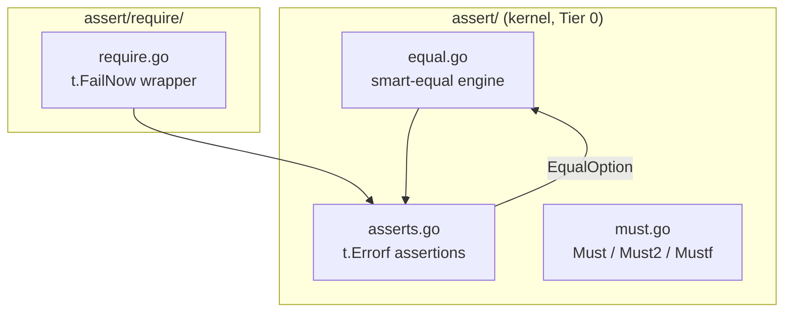

# assert

<TierBadge tier="kernel" />

<UsedInTasksBadges package-name="assert" />

[View source spec &rarr;](https://github.com/nathanbrophy/glacier/blob/main/specs/0006-assert.md)

## Public summary
<!-- magpie:extract source=specs/0006-assert.md section=public-summary source-checksum=PENDING -->

`assert` is Glacier's test-assertion and runtime-invariant package: two distinct faces in one kernel package, separated by file. The test face provides assertion functions that report failures via `t.Errorf` and return `bool`, so a test can stack multiple assertions and see every failure in a single run. The runtime face provides `Must`, `Must2`, and `Mustf` helpers that panic at initialization time when an invariant is violated, for `init()` setup and program startup, never for library hot paths. The companion sub-package `assert/require` mirrors every test assertion with `t.FailNow` semantics: import `assert` for "continue on failure," import `require` for "halt on failure." At the heart of both is a smart deep-equality comparator that goes well beyond `reflect.DeepEqual`: pointer-aware, map-order-insensitive, optionally slice-order-insensitive, case-fold-capable, field-selective, float-tolerant, cycle-safe, giving every test a single coherent equality primitive it can trust.

<!-- /magpie:extract -->

## Mental model
<!-- magpie:extract source=specs/0006-assert.md section=mental-model source-checksum=PENDING -->

The package has three conceptually distinct residents that share an import path:

```
assert/
+-- asserts.go      -- test assertions  (t.Errorf, return bool, never halt)
+-- equal.go        -- smart-equal engine (fast path + slow path)
+-- match.go        -- glob / regex matching
+-- ordering.go     -- Greater, Less, GreaterOrEqual, LessOrEqual, InDelta
+-- jsoneq.go       -- JSONEq, BytesEq, Subset
+-- diff.go         -- struct-walking diff for failure messages
+-- must.go         -- runtime Must helpers (panic on violation)

assert/require/
+-- require.go      -- thin t.FailNow wrapper around every assert.X
```

**Test assertions** accept a `TB` interface compatible with `*testing.T`, `*testing.B`, and `*testing.F`. Every assertion calls `t.Helper()`, calls `t.Errorf` on failure, and returns `bool`. Returning `bool` is the key design: a test function can stack ten assertions and see all ten failures rather than stopping at the first.

**Smart equality** is the engine that powers `Equal`, `NotEqual`, `Contains`, `JSONEq`, `Subset`, and the diff renderer. It operates in two tiers:

- Primitive fast path: when `T` is `comparable` and `got == want` by the `==` operator, equality is confirmed in <=50 ns/op with zero allocations.
- Smart-equal slow path: for all other cases, the engine walks the value graph via `reflect`. It dereferences pointers, folds map iteration order, optionally treats slices as multisets, applies case folding, tolerates float deltas, skips named fields, invokes custom `Equal(any) bool` methods, and detects pointer cycles.

**`EqualOption`** values configure the slow path, constructed by five functions (`IgnoreOrder`, `IgnoreCase`, `IgnoreWhitespace`, `WithDelta`, `IgnoreFields`), passed as trailing variadic arguments to `Equal`, `NotEqual`, `JSONEq`, `Contains`, and `Subset`.

**Runtime Must helpers** do not interact with `testing.TB` at all. They panic on violation. Use them at initialization time only, never in library hot paths.



<!-- /magpie:extract -->

## API
<!-- magpie:extract source=specs/0006-assert.md section=api source-checksum=PENDING -->

### `TB` interface

```go
// TB is the testing-target interface satisfied by *testing.T, *testing.B,
// and *testing.F. All assertion functions accept TB, never a concrete type.
type TB interface {
    Helper()
    Errorf(format string, args ...any)
    Fatalf(format string, args ...any)
    FailNow()
    Cleanup(fn func())
    Name() string
}
```

### `EqualOption` constructors

```go
// IgnoreOrder returns an EqualOption that compares slices and arrays as
// multisets: every element in want must appear in got with the same count,
// regardless of position. Maps are always order-insensitive.
func IgnoreOrder() EqualOption

// IgnoreCase returns an EqualOption that compares strings using
// strings.EqualFold (Unicode-aware case folding).
func IgnoreCase() EqualOption

// IgnoreWhitespace returns an EqualOption that normalizes strings before
// comparison: leading and trailing whitespace trimmed, internal runs collapsed
// to a single space.
func IgnoreWhitespace() EqualOption

// WithDelta returns an EqualOption that compares float32 and float64 values
// using absolute tolerance: |got - want| <= d. NaN values are never equal.
//
// Preconditions: d >= 0.
func WithDelta(d float64) EqualOption

// IgnoreFields returns an EqualOption that skips the named struct fields
// during comparison. Applied recursively at every nesting level.
func IgnoreFields(names ...string) EqualOption
```

### `MatchOption` constructors

```go
// MatchRegex returns a MatchOption that switches Match from glob to regexp syntax.
func MatchRegex() MatchOption

// MatchIgnoreCase returns a MatchOption that makes the pattern match
// case-insensitively.
func MatchIgnoreCase() MatchOption
```

### Core assertions

```go
// Equal reports whether got equals want using Glacier's smart-equal algorithm.
// T is constrained to any, providing compile-time type match.
//
// Returns false on failure; calls t.Errorf with a structured diff.
// Concurrency: goroutine-safe.
func Equal[T any](t TB, got, want T, opts ...EqualOption) bool

// NotEqual reports whether got does not equal want.
func NotEqual[T any](t TB, got, want T, opts ...EqualOption) bool

// True reports whether cond is true.
func True(t TB, cond bool, msg ...any) bool

// False reports whether cond is false.
func False(t TB, cond bool, msg ...any) bool

// Nil reports whether v is nil, including typed-nil pointers and interfaces.
func Nil(t TB, v any, msg ...any) bool

// NotNil reports whether v is non-nil. Typed-nil-aware.
func NotNil(t TB, v any, msg ...any) bool

// NoError reports whether err is nil.
func NoError(t TB, err error, msg ...any) bool

// Error reports whether err is non-nil.
func Error(t TB, err error, msg ...any) bool

// ErrorIs reports whether errors.Is(err, target) is true.
func ErrorIs(t TB, err, target error, msg ...any) bool

// ErrorAs reports whether errors.As(err, target) is true.
func ErrorAs(t TB, err error, target any, msg ...any) bool

// Contains reports whether haystack contains needle.
// haystack may be a string, []T, or map[K]V.
func Contains(t TB, haystack, needle any, opts ...EqualOption) bool

// Len reports whether the length of container equals want.
// container may be a slice, array, map, string, or channel.
func Len(t TB, container any, want int, msg ...any) bool

// Eventually polls fn at interval until it returns true or timeout elapses.
func Eventually(t TB, fn func() bool, timeout, interval time.Duration, msg ...any) bool
```

### Pattern matching

```go
// Match reports whether got matches pattern. Default mode is glob: * matches
// any run of characters, ? matches a single character, pattern is anchored
// at both ends. MatchRegex() switches to regexp semantics.
func Match(t TB, got, pattern string, opts ...MatchOption) bool
```

### Ordering and tolerance

```go
func Greater[T cmp.Ordered](t TB, got, threshold T, msg ...any) bool
func Less[T cmp.Ordered](t TB, got, threshold T, msg ...any) bool
func GreaterOrEqual[T cmp.Ordered](t TB, got, threshold T, msg ...any) bool
func LessOrEqual[T cmp.Ordered](t TB, got, threshold T, msg ...any) bool

// InDelta reports whether |got - want| <= delta. T is constrained to
// ~float32 | ~float64.
func InDelta[T ~float32 | ~float64](t TB, got, want, delta T, msg ...any) bool
```

### Specialized equality

```go
// JSONEq parses got and want as JSON and reports deep equality.
// JSON object key order is always ignored. IgnoreOrder() also ignores array element order.
func JSONEq(t TB, got, want []byte, opts ...EqualOption) bool

// BytesEq reports whether got and want are byte-for-byte equal via bytes.Equal.
// nil and empty slices are considered equal.
func BytesEq(t TB, got, want []byte, msg ...any) bool

// Subset reports whether every element of want appears in got.
func Subset[T any](t TB, got, want []T, opts ...EqualOption) bool
```

### Halt helper

```go
// Halt calls t.FailNow, halting the current test goroutine immediately.
//
//   if !assert.Equal(t, got, want) {
//       assert.Halt(t)  // stop here; next assertion would panic on nil
//   }
func Halt(t TB)
```

### Runtime Must helpers

```go
// Must returns v if err is nil. If err is non-nil, Must panics.
// Use only for initialization-time invariants: package init, main() setup.
// Never use in library hot paths.
//
//   var rePhone = assert.Must(regexp.Compile(`^\+?[0-9 -]+$`))
func Must[T any](v T, err error) T

// Must2 is Must for two-value-plus-error returns. Returns (a, b) if err
// is nil; panics with err otherwise.
func Must2[A, B any](a A, b B, err error) (A, B)

// Mustf panics with a formatted message if cond is false.
// Same usage rules as Must: initialization-time invariants only.
func Mustf(cond bool, format string, args ...any)
```

### Package `assert/require`

Every assertion in `assert` is mirrored in `require` with an identical signature. On failure, `require.X` calls `t.Errorf` (via `assert.X`) then `t.FailNow`. The runtime Must helpers are not mirrored.

```go
func Equal[T any](t assert.TB, got, want T, opts ...assert.EqualOption) bool
func NoError(t assert.TB, err error, msg ...any) bool
func ErrorIs(t assert.TB, err, target error, msg ...any) bool
// ... and so on for every assert.X
```

<!-- /magpie:extract -->

## Examples
<!-- magpie:extract source=specs/0006-assert.md section=examples source-checksum=PENDING -->

### Smart equality: slice ordering

```go
func ExampleEqual_ignoreOrder() {
    var t *testing.T

    got := []int{3, 1, 2}
    want := []int{1, 2, 3}

    assert.Equal(t, got, want)                       // false: order matters by default
    assert.Equal(t, got, want, assert.IgnoreOrder()) // true: multiset comparison
}
```

### Smart equality: struct field exclusion

```go
func ExampleEqual_ignoreFields() {
    var t *testing.T

    type User struct {
        ID      string
        Name    string
        Created time.Time
    }
    got := User{ID: "u-42", Name: "Ada", Created: time.Now()}
    want := User{ID: "u-42", Name: "Ada"} // Created is zero

    // Without IgnoreFields: false, because Created differs.
    // With IgnoreFields: true, because Created is excluded.
    assert.Equal(t, got, want, assert.IgnoreFields("Created")) // true
}
```

### Stacking assertions: see all failures in one run

```go
func ExampleEqual_stacked() {
    var t *testing.T

    u, err := loadUser("u-42") // hypothetical
    assert.NoError(t, err)
    assert.NotNil(t, u)
    assert.Equal(t, u.ID, "u-42")
    assert.Greater(t, u.LastSeen.Unix(), int64(0))
    assert.Match(t, u.Email, `^[^@]+@[^@]+\.[^@]+$`, assert.MatchRegex())
    // All five are evaluated; all failures reported in one test run.
}
```

### Halt-on-failure with require

```go
func ExampleRequire() {
    var t *testing.T

    pipeline, err := newPipeline() // hypothetical
    require.NoError(t, err) // halt here if construction failed; next line would panic

    out, err := pipeline.Run(context.Background(), []byte("input"))
    assert.NoError(t, err)
    assert.NotNil(t, out)
    assert.Equal(t, out.Status, "ok")
}
```

### Runtime Must at initialization time

```go
func ExampleMust() {
    // In a package init or main():
    var rePhone *regexp.Regexp
    rePhone = assert.Must(regexp.Compile(`^\+?[0-9 -]+$`))
    // If Compile returns an error, Must panics with it.
    _ = rePhone
}
```

<!-- /magpie:extract -->

## FAQ
<!-- magpie:extract source=specs/0006-assert.md section=faq source-checksum=PENDING -->

<div class="glacier-faq">

**Why two faces in one package?**

Test assertions and runtime `Must` helpers express the same idea, "this invariant must hold," but with different failure semantics. Keeping them in one package means a developer imports one path (`glacier/assert`) and gets both. The separation by file (`asserts.go` vs `must.go`) keeps the doc surface clean without requiring a second import.

**Why is `Equal` generic but `Len` is not?**

`Equal[T any]` carries a compile-time type constraint: `Equal(t, 5, "5")` is a compile error. `Len`, by contrast, must work on slices, maps, strings, and channels, which have no common constraint in the Go type system short of `any`. Making `Len` generic would require the caller to spell a type parameter for every invocation.

**Why both `assert` and `assert/require`?**

They serve different test-authoring intentions. `assert` is for "report and continue." `require` is for "report and stop," necessary when a nil or invalid value from a prior assertion would cause a nil-pointer dereference or misleading cascading failures in the next line.

**How does smart-equal handle cycles?**

Smart-equal maintains a `map[[2]uintptr]bool` per top-level call, keyed by the ordered pair of pointer addresses. When the engine encounters a pair it has seen before, it returns `true`. The visited-set is freed when `Equal` returns; there is no global state.

**Why is slice ordering opt-in rather than the default?**

Unordered equality is a surprising default for sequences. `IgnoreOrder()` is an explicit declaration: "I know the order is non-deterministic and I only care about membership." Making it opt-in keeps `Equal` predictable and avoids silent test passes on order-dependent bugs.

**Why does `Must` panic instead of returning an error?**

`Must` is for initialization-time invariants in non-test code. In those contexts there is no caller to return an error to, and a failed invariant is unrecoverable. The doc comment states: never use `Must` in library hot paths, per CLAUDE.md directive 4 (library code must not panic).

</div>

<!-- /magpie:extract -->
