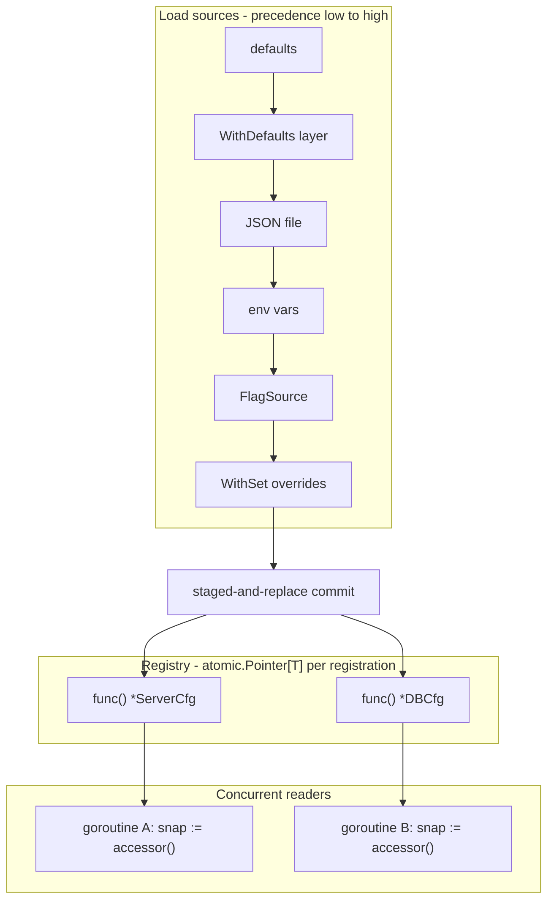

# conf

<TierBadge tier="mid" />

<UsedInTasksBadges package-name="conf" />

[View source spec &rarr;](https://github.com/nathanbrophy/glacier/blob/main/specs/0009-conf.md)

## Public summary
<!-- magpie:extract source=specs/0009-conf.md section=public-summary source-checksum=PENDING -->

`conf` is Glacier's layered-configuration package. Packages declare their configuration needs once with `conf.Register[T]("section", defaults)` and receive a snapshot accessor, `func() *T`, that always returns the latest fully-loaded struct. At startup, `conf.Load(ctx, opts...)` reads sources in precedence order -- defaults, optional JSON file, environment variables, flag values, and explicit overrides -- and atomically replaces every registered struct in a single staged-and-replace commit. Any concurrent reader always sees either the pre-load or the post-load whole struct; torn reads are impossible. One-shot consumers that do not need the registry can call `conf.Decode[T]` directly. `conf` uses only the Glacier kernel and internal helpers; it introduces no external dependencies.

<!-- /magpie:extract -->

## Mental model
<!-- magpie:extract source=specs/0009-conf.md section=mental-model source-checksum=PENDING -->

`conf` has two distinct usage modes:

**Registry mode** (the normal case). Packages call `Register[T]` at init time to declare their configuration section. `Register` returns a snapshot accessor, a `func() *T`, that always reflects the most recently committed Load. Under the hood each registration is an `atomic.Pointer[T]`; Load builds all new structs from scratch, then swaps every pointer in a single pass. Readers hold no lock; they call the accessor and get an immutable snapshot.

**One-shot mode**. A consumer that doesn't want a long-lived registry, such as an integration test, a migration script, or a CLI command, calls `Decode[T]` with options inline. No `Loader`, no registration, no state.

The precedence stack is fixed and applied left-to-right, each layer overwriting only the keys it supplies:

```
defaults -> WithDefaults layer -> JSON file -> environment variables -> flag source -> explicit Set overrides
  (lowest)                                                                              (highest)
```

Field-name resolution uses the `json` struct tag when present, falling back to the upper-snake-case of the Go field name. Environment-variable names are derived as:

```
<EnvPrefix>__<UPPER_SNAKE_SECTION_PATH>__<UPPER_SNAKE_FIELD>
```

For example, section `"server"`, field with tag `json:"port"`, prefix `"APP"` yields `APP__SERVER__PORT`.



Validation is intentionally not part of `Load`. After `Load` succeeds, call `option.Validate` (or any validation logic) against the snapshot. Keeping decode and validate separate means `conf` stays composable: each package applies its own invariants without coupling them to the load mechanism.

<!-- /magpie:extract -->

## API
<!-- magpie:extract source=specs/0009-conf.md section=api source-checksum=PENDING -->

### Register[T]

```go
// Register declares a configuration section of type T at the given dot-separated
// path and returns a snapshot accessor. The accessor returns the most recently
// committed *T from the last successful Load, or the defaults if Load has never
// been called. The returned func is goroutine-safe and lock-free.
//
// Panics if path has already been registered. Panic message:
//   conf: register: path "<path>" already registered
func Register[T any](path string, defaults T) func() *T
```

### Load

```go
// Load applies configuration sources to all registered sections and atomically
// replaces every registered struct with its newly decoded value.
//
// Sources are applied in precedence order (lowest to highest):
//   defaults -> WithDefaults layer -> JSON file -> env vars -> flag source -> WithSet overrides
//
// Load is atomic with respect to errors: if any source fails to decode, NO
// registered struct is mutated and Load returns the first DecodeError encountered.
//
// Concurrency: goroutine-safe; serializes concurrent calls. Blocking.
func Load(ctx context.Context, opts ...LoadOption) error
```

### MustLoad

```go
// MustLoad calls Load and panics if Load returns a non-nil error.
// Intended for program startup where configuration errors are fatal.
func MustLoad(ctx context.Context, opts ...LoadOption)
```

### Decode[T]

```go
// Decode applies configuration sources to a single struct of type T without
// using or modifying the global registry. One-shot alternative to Register + Load.
// T must be a struct type. Returns a fully populated *T on success.
func Decode[T any](ctx context.Context, opts ...LoadOption) (*T, error)
```

### Loader

```go
// NewLoader creates a Loader with the given options pre-applied as defaults.
// Most callers use the package-level Load, MustLoad, and Decode functions.
func NewLoader(opts ...LoadOption) *Loader

func (l *Loader) Load(ctx context.Context, opts ...LoadOption) error
func (l *Loader) MustLoad(ctx context.Context, opts ...LoadOption)

// Close releases internal state held by the Loader. Idempotent.
// After Close, Load returns ErrLoaderClosed.
// In v0, Close is a no-op; it is provided to satisfy the lifecycle contract
// and allow future hot-reload additions without breaking callers.
func (l *Loader) Close() error
```

### Load options

```go
// WithFile instructs Load to parse the given path as a JSON configuration file.
// The path is canonicalized via internal/safefile before opening (rejects ..,
// symlinks, UNC paths, and non-regular files). File size capped at 1 MiB.
// JSON nesting depth capped at 32. Unknown fields cause a DecodeError.
func WithFile(path string) LoadOption

// WithEnvPrefix instructs Load to read environment variables of the form:
//   <prefix>__<UPPER_SNAKE_SECTION>__<UPPER_SNAKE_FIELD>
// Without WithEnvPrefix, no environment variables are read.
func WithEnvPrefix(prefix string) LoadOption

// WithEnvSliceSep sets the separator used to split a single environment variable
// value into a []string slice. Default is ",".
func WithEnvSliceSep(sep string) LoadOption

// WithFlagSource registers a FlagSource queried after environment variables.
func WithFlagSource(fs FlagSource) LoadOption

// WithSet sets a single configuration key to a value at the highest precedence
// layer, overriding all sources. path is dot-separated (e.g., "server.port").
func WithSet(path string, value any) LoadOption

// WithDefaults registers an additional defaults layer applied after Register-level
// defaults but before the JSON file.
func WithDefaults(fn func() map[string]any) LoadOption

// WithLogger sets the slog.Logger for per-layer debug events during Load.
func WithLogger(l *slog.Logger) LoadOption
```

### FlagSource interface

```go
// FlagSource is implemented by callers that want to feed flag values into Load.
// Implementations must be goroutine-safe.
type FlagSource interface {
    // Lookup returns the string value for the given dot-path key and true
    // if the flag was explicitly set, or ("", false) if not.
    Lookup(path string) (value string, ok bool)
}
```

### Errors

```go
// DecodeError is returned by Load, MustLoad, and Decode for all configuration
// decode failures. Error() formats as "conf: decode <path>: <cause>".
type DecodeError struct {
    Path  string // dot-separated field path; "" for top-level failures
    Cause error  // always non-nil
    Layer string // source layer that failed; informational
}

func (e *DecodeError) Error() string
func (e *DecodeError) Unwrap() error

var ErrLayerConflict = errs.Sentinel("conf: layer conflict: incompatible types for field")
var ErrFileTooLarge  = errs.Sentinel("conf: file too large: maximum size is 1 MiB")
var ErrDepthExceeded = errs.Sentinel("conf: depth exceeded: maximum nesting depth is 32")
var ErrLoaderClosed  = errs.Sentinel("conf: loader closed")
```

<!-- /magpie:extract -->

## Examples
<!-- magpie:extract source=specs/0009-conf.md section=examples source-checksum=PENDING -->

Two independent packages register their config sections at init time; the main package calls `conf.Load` once at startup:

```go
// Package server registers its own configuration section.
package server

import "github.com/glacierframework/glacier/conf"

type Config struct {
    Host string `json:"host"`
    Port int    `json:"port"`
}

var cfg = conf.Register[Config]("server", Config{
    Host: "localhost",
    Port: 8080,
})

// Cfg returns the most recently loaded server configuration snapshot.
func Cfg() *Config { return cfg() }
```

```go
// main.go -- load configuration from a JSON file and environment variables.
package main

import (
    "context"
    "log"

    "github.com/glacierframework/glacier/conf"

    _ "myapp/db"
    _ "myapp/server"
)

func main() {
    if err := conf.Load(
        context.Background(),
        conf.WithFile("config.json"),
        conf.WithEnvPrefix("APP"),
    ); err != nil {
        log.Fatal(err)
    }
    // server.Cfg() and db.Cfg() now return populated snapshots.
}
```

One-shot decode without a registry:

```go
func ExampleDecode() {
    type AppConfig struct {
        Debug bool   `json:"debug"`
        Addr  string `json:"addr"`
    }

    cfg, err := conf.Decode[AppConfig](
        context.Background(),
        conf.WithFile("config.json"),
        conf.WithEnvPrefix("APP"),
    )
    if err != nil {
        log.Fatal(err)
    }
    fmt.Println(cfg.Addr)
}
```

Highest-precedence override with `WithSet`:

```go
func ExampleLoad_withSet() {
    if err := conf.Load(
        context.Background(),
        conf.WithFile("config.json"),
        conf.WithSet("server.port", 9999),
    ); err != nil {
        log.Fatal(err)
    }
    // server.Cfg().Port == 9999 regardless of file or env value
}
```

<!-- /magpie:extract -->

## FAQ
<!-- magpie:extract source=specs/0009-conf.md section=faq source-checksum=PENDING -->

<div class="glacier-faq">

**Why does `Register[T]` return a `func() *T` instead of a plain `*T`?**

Because `Load` replaces the struct atomically -- a stable pointer would become stale. The accessor always calls `atomic.Pointer[T].Load()` internally, so the caller is guaranteed to get the struct written by the most recent successful `Load`. Callers that need a stable copy for a single request handler can snapshot it: `cfg := myCfg()`.

**Can I call `Register` after `Load` has already run?**

Yes. The new registration is populated with defaults immediately and will be populated from sources on the next `Load` call. There is no restriction on when `Register` is called relative to `Load`, though the idiomatic pattern is to call all `Register` functions during package init.

**What happens if I call `Load` concurrently from two goroutines?**

The second call blocks until the first completes. `Load` is serialized by an internal `sync.Mutex`. Snapshot accessors (the `func() *T` values) remain lock-free and never block.

**Why is validation separate from `Load`?**

Keeping decode and validate separate makes both halves composable. `conf` knows how to turn raw sources into typed structs; it does not know the semantic rules for your struct's fields. Each package applies its own invariants after `Load` using `option.Validate` or any validation logic it chooses. This also means Load errors are always `DecodeError` (structural), not validation errors (semantic).

**Why is only JSON supported in v0?**

JSON is universally available in Go's standard library, is unambiguous, and covers the needs of most production services. YAML and TOML require external dependencies, which conflicts with Glacier's supply-chain minimalism principle. Format support will be added in a future spec when the dependency justification is complete.

**Does `conf` support hot-reload or watching the config file for changes?**

Not in v0. `Loader.Close` is the lifecycle hook reserved for cleanup when file watching arrives. In v0, `Close` is an idempotent no-op.

</div>

<!-- /magpie:extract -->
