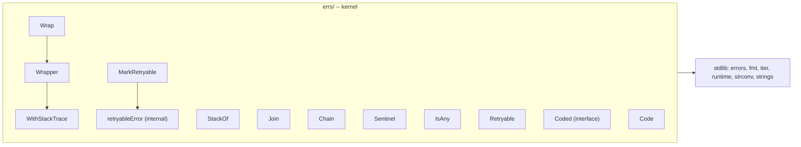

# errs

<TierBadge tier="kernel" />

<UsedInTasksBadges package-name="errs" />

[View source spec &rarr;](https://github.com/nathanbrophy/glacier/blob/main/specs/0004-errs.md)

## Public summary
<!-- magpie:extract source=specs/0004-errs.md section=public-summary source-checksum=PENDING -->

The `errs` package is Glacier's error-story foundation. It gives every other package a consistent vocabulary for wrapping errors (with optional stack-trace capture), composing errors without information loss, walking the full error tree as a lazy iterator, declaring format-validated sentinels, checking errors against multiple targets at once, classifying errors as retryable, and attaching machine-readable codes to errors for programmatic branching. `errs` declares no sentinels of its own; each package owns its sentinels and uses `errs` helpers to construct and manipulate them. Import `errs`, write less error-handling boilerplate, and get `errors.Is` / `errors.As` compatibility for free.

<!-- /magpie:extract -->

## Mental model
<!-- magpie:extract source=specs/0004-errs.md section=mental-model source-checksum=PENDING -->

Think of `errs` as a toolkit with four axes.

**Chain preservation.** `Wrap` prepends a `"package: action: "` prefix while keeping the original error available via `errors.Is` and `errors.As`. By default, `Wrap` captures no stack trace; opt in via `.WithStackTrace()` only where the call site is ambiguous. `StackOf` retrieves the captured frames from wherever they appear in the chain.

**Composition.** `Join` collapses nil entries, returns a lone survivor unwrapped, and delegates to `errors.Join` only when two or more non-nil errors remain. The result: `Close()` implementations that fan out to sub-resources stay simple.

**Tree walking.** `Chain` is a lazy `iter.Seq[error]` that visits every node in the error tree (linear `Unwrap()` chains and fan-out `Unwrap() []error` joins alike) in depth-first order. It composes naturally with the `fluent` package without creating an import edge.

**Metadata.** `Sentinel` validates library-register format at construction time (panics if misformatted, never at runtime). `IsAny` is a multi-target `errors.Is`. `MarkRetryable` / `Retryable` classify transient errors without coupling the caller to the error's origin. `Coded` / `Code` surface a stable machine-readable string for programmatic branching and internationalisation.



<!-- /magpie:extract -->

## API
<!-- magpie:extract source=specs/0004-errs.md section=api source-checksum=PENDING -->

### `Wrapper`, `Wrap`, and stack traces

```go
// Wrapper is the concrete error type returned by Wrap. It supports an
// optional fluent stack-trace capture via WithStackTrace and preserves
// the unwrap chain so errors.Is and errors.As traverse through it.
type Wrapper struct { /* unexported fields */ }

// Error implements error. The format is "<prefix>: <err.Error()>".
// Returns "" on a nil receiver.
func (w *Wrapper) Error() string

// Unwrap returns the wrapped error, supporting errors.Is and errors.As.
// Returns nil on a nil receiver.
func (w *Wrapper) Unwrap() error

// WithStackTrace captures the call stack at the call site (up to 32 frames)
// and attaches it to w. Returns w for chaining; nil-receiver-safe.
//
// Use sparingly: stack capture allocates and adds latency.
func (w *Wrapper) WithStackTrace() *Wrapper

// Wrap returns a Wrapper that prepends prefix and preserves err's unwrap
// chain. Returns nil if err is nil. The default Wrap captures no stack
// trace; opt in via .WithStackTrace().
//
// prefix should follow Glacier's library register: lowercase, no trailing
// period, "package: action" shape. Example:
//
//   return errs.Wrap(err, "cli: parse")                        // chain-only
//   return errs.Wrap(err, "sandbox: spawn").WithStackTrace()   // chain + stack
func Wrap(err error, prefix string) *Wrapper

// StackOf returns the stack frames captured by WithStackTrace anywhere in
// err's unwrap chain, or nil if none were captured.
func StackOf(err error) []runtime.Frame
```

**Concurrency:** `Wrap` and `StackOf` are goroutine-safe. `WithStackTrace` must not be called concurrently on the same `*Wrapper`.

### `Join`

```go
// Join composes multiple errors. Nil entries are dropped silently; if exactly
// one non-nil entry remains, it is returned directly without wrapping. Returns
// nil when every input is nil or the input is empty.
func Join(errs ...error) error
```

**Allocation:** zero when all inputs are nil; zero for single non-nil (returned directly); one `[]error` allocation for the multi-error case.

### `Chain`

```go
// Chain returns an iterator that yields every error in err's tree, walking
// both single Unwrap() and Unwrap() []error edges in depth-first order.
// The first yielded error is err itself.
//
//   for e := range errs.Chain(err) {
//       if myErr := (*MyError)(nil); errors.As(e, &myErr) {
//           // handle myErr
//       }
//   }
//
// Safe to truncate via fluent.Take(errs.Chain(err), n).
func Chain(err error) iter.Seq[error]
```

**Preconditions:** safe to call with nil err (yields nothing). **Concurrency:** goroutine-safe; the returned iterator operates on the (immutable) error chain.

### `Sentinel`

```go
// Sentinel constructs an errors.New-equivalent sentinel with stable text. The
// text MUST match Glacier's library register: lowercase, no trailing period,
// and contain at least one ":" separator.
// Misformatted text panics at construction so misuse never reaches production.
//
// Sentinels are declared at package level:
//
//   var ErrCancelled   = errs.Sentinel("cli: cancelled")
//   var ErrUnknownFlag = errs.Sentinel("cli: unknown flag")
func Sentinel(text string) error
```

**Panic contract:** panics only at construction (package init) with an explanatory message mentioning the register rule.

### `IsAny`, `MarkRetryable`, `Retryable`

```go
// IsAny reports whether errors.Is(err, t) is true for any t in targets.
//
//   if errs.IsAny(err, cli.ErrCancelled, context.Canceled) {
//       return cleanShutdown()
//   }
func IsAny(err error, targets ...error) bool

// MarkRetryable wraps err with a marker indicating the operation is safe to
// retry. Consumers check via Retryable. Returns nil if err is nil.
func MarkRetryable(err error) error

// Retryable reports whether err (or any error in its chain) is marked
// retryable.
func Retryable(err error) bool
```

### `Coded` interface and `Code`

```go
// Coded is the optional interface for errors that carry a stable,
// machine-readable code in addition to a human-readable message.
// Conventionally formatted ^[A-Z][A-Z0-9_]*$ (e.g., "E_TIMEOUT").
type Coded interface {
    error
    Code() string
}

// Code returns the code of the first error in err's chain that implements
// Coded, or the empty string if none does.
func Code(err error) string
```

<!-- /magpie:extract -->

## Examples
<!-- magpie:extract source=specs/0004-errs.md section=examples source-checksum=PENDING -->

### Per-package sentinel and typed error

```go
package cli

import (
    "strconv"

    "github.com/nathanbrophy/glacier/errs"
)

// Sentinel declarations at package level -- validated at init time.
var (
    ErrCancelled   = errs.Sentinel("cli: cancelled")
    ErrUnknownFlag = errs.Sentinel("cli: unknown flag")
)

// ParseError is a typed error carrying the offending argument and a stable code.
type ParseError struct {
    Arg string
    Err error
}

func (e *ParseError) Error() string {
    return "cli: parse " + strconv.Quote(e.Arg) + ": " + e.Err.Error()
}
func (e *ParseError) Unwrap() error { return e.Err }
func (e *ParseError) Code() string  { return "E_CLI_PARSE" } // implements errs.Coded
```

### Stack-trace opt-in

```go
package errs_test

import (
    "log"

    "github.com/nathanbrophy/glacier/errs"
)

func ExampleWrapper_WithStackTrace() {
    err := errs.Wrap(someDeepError(), "sandbox: spawn").WithStackTrace()
    for _, f := range errs.StackOf(err) {
        log.Printf("  at %s (%s:%d)", f.Function, f.File, f.Line)
    }
}
```

### Retry classification

```go
package errs_test

import (
    "github.com/nathanbrophy/glacier/errs"
)

func ExampleMarkRetryable() {
    err := mayFail()
    if isTransient(err) {
        err = errs.MarkRetryable(errs.Wrap(err, "client: do"))
    }

    if errs.Retryable(err) {
        // safe to retry
    }
}
```

### Walking the error tree

```go
package errs_test

import (
    "errors"
    "log"

    "github.com/nathanbrophy/glacier/errs"
)

func ExampleChain() {
    // err may be a Join of several sub-errors; Chain walks all of them.
    for e := range errs.Chain(err) {
        var pe *ParseError
        if errors.As(e, &pe) {
            log.Println("offending arg:", pe.Arg)
        }
    }
}
```

<!-- /magpie:extract -->

## FAQ
<!-- magpie:extract source=specs/0004-errs.md section=faq source-checksum=PENDING -->

<div class="glacier-faq">

**Why does `errs` declare no package-level sentinels of its own?**

`errs` is a helper library, not a domain package. Declaring sentinels like `errs.ErrNotFound` would couple every consuming package to `errs` for error comparison. Each package owns its sentinels and uses `errs.Sentinel` to construct them in a format-validated way. The result: `errors.Is(err, cli.ErrCancelled)` reads clearly, and `cli` is the single source of truth for CLI-domain error identities.

**Why is stack-trace capture opt-in?**

`runtime.Callers` allocates and adds latency on every call. Most error paths in a server or CLI are short enough that the wrapped message text fully identifies the call site. Stack capture becomes valuable when the same error surface is reachable from many call paths and the message text alone is ambiguous. Making it opt-in (`.WithStackTrace()`) means the zero-cost default is right for 95% of cases.

**How does `Chain` interact with `errors.Join`?**

`errors.Join` returns an error that implements `Unwrap() []error`. `Chain` detects this interface and fans out depth-first across the children. Walking `Chain(errs.Join(a, b, c))` yields the join root first, then `a`, `b`, `c` in order. Nested joins are handled recursively.

**What is the `Coded` interface for?**

Some errors carry meaning that callers need to act on programmatically. The `Coded` interface is a stable, machine-readable companion to the human-readable `Error()` string. Code format (`^[A-Z][A-Z0-9_]*$`) is a convention that individual packages enforce on their own types; `errs.Code` retrieves the first code found in the chain.

**Why does `Sentinel` panic instead of returning an error?**

Because misformatted sentinels are programming errors, not runtime errors. A sentinel text with uppercase letters or a trailing period is a typo in source code, not a condition a running program can recover from. Panicking at package initialisation time surfaces the mistake immediately in any test that imports the package.

**Why does `Join` collapse a single non-nil error to the original value?**

`errs.Join` is used heavily in `Close` implementations that fan out to multiple sub-resources. When only one sub-resource returns an error, wrapping it in a join adds an allocating indirection and changes the error's identity under `errors.Is`. Returning the original error directly preserves identity and avoids the allocation.

</div>

<!-- /magpie:extract -->
