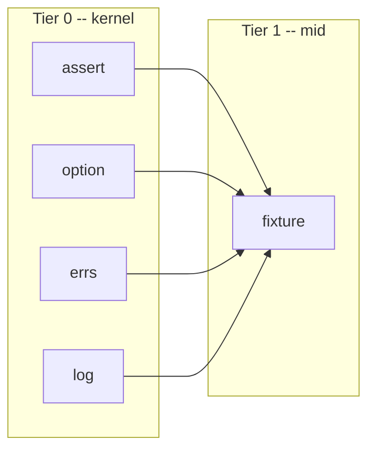

# fixture

<TierBadge tier="mid" />

<UsedInTasksBadges package-name="fixture" />

[View source spec &rarr;](https://github.com/nathanbrophy/glacier/blob/main/specs/0010-fixture.md)

## Public summary
<!-- magpie:extract source=specs/0010-fixture.md section=public-summary source-checksum=PENDING -->

`fixture` is Glacier's test-resource management package. It gives your tests golden-file assertions with auto-update support, typed snapshot comparisons that survive struct refactors, in-memory filesystem stubs, deterministic fake clocks with timer delivery, process-level output capture, and a lifecycle guard that fails any test that leaks goroutines, temp directories, environment variables, or file descriptors. Every helper registers its cleanup with `t.Cleanup`; your tests stay linear and readable. `fixture` sits at Tier 1 (mid) and is intentionally distinct from `assert`: `assert` checks values; `fixture` manages test resources and test environment.

<!-- /magpie:extract -->

## Mental model
<!-- magpie:extract source=specs/0010-fixture.md section=mental-model source-checksum=PENDING -->

`fixture` organizes into three responsibility groups:

```
+---------------------------------------------------------------------------+
|  Persistent test data                                                      |
|  -----------------                                                         |
|  Golden     -- compare raw bytes against a file in testdata/;             |
|               auto-update via GLACIER_GOLDEN_UPDATE=1                     |
|  Snapshot[T] -- pretty-print a typed value, compare against stored        |
|                 snapshot; delegates equality to assert.Equal[T]           |
|  Load       -- read arbitrary bytes from testdata/ into memory            |
|  LoadJSON[T] -- read + unmarshal JSON from testdata/                      |
+---------------------------------------------------------------------------+
+---------------------------------------------------------------------------+
|  Test environment                                                          |
|  ----------------                                                          |
|  Clock / FakeClock -- injectable clock interface; FakeClock.Advance       |
|                       drives timers deterministically without sleeping     |
|  NewFS  -- in-memory fs.FS from a map[string][]byte; read-only            |
|  Capture -- redirect os.Stdout and os.Stderr to string buffers for a call |
+---------------------------------------------------------------------------+
+---------------------------------------------------------------------------+
|  Lifecycle invariants                                                      |
|  --------------------                                                      |
|  GuardLeaks -- registers a t.Cleanup that diffs state before/after        |
|                the test for goroutines, temp dirs, env vars, and FDs      |
+---------------------------------------------------------------------------+
```



`fixture` may not import any other mid-tier package (`concur`, `fluent`, `conf`, `obs`).

<!-- /magpie:extract -->

## API
<!-- magpie:extract source=specs/0010-fixture.md section=api source-checksum=PENDING -->

### Persistent test data

```go
// Golden compares got against the golden file at testdata/<name> (or the root
// set by WithRoot). If the file is missing and GLACIER_GOLDEN_UPDATE=1, the
// file is created and true is returned. If missing without the env var,
// t.Errorf is called with a "re-run with GLACIER_GOLDEN_UPDATE=1" hint.
// On content mismatch, t.Errorf is called with a line-by-line diff (text)
// or hex header (binary). Returns true on match.
func Golden(t assert.TB, name string, got []byte, opts ...GoldenOption) bool

// Snapshot[T] serializes got to a deterministic human-readable text
// representation and compares it against the snapshot file at
// testdata/snapshots/<name>.snap. Delegates comparison to assert.Equal[T]
// via re-deserialization, honoring opts (IgnoreFields, IgnoreOrder, etc.).
// GLACIER_GOLDEN_UPDATE=1 creates or updates the snapshot file.
func Snapshot[T any](t assert.TB, name string, got T, opts ...assert.EqualOption) bool

// Load reads testdata/<name> and returns its bytes. Calls t.Fatal on any error.
func Load(t assert.TB, name string) []byte

// LoadJSON[T] reads testdata/<name> and unmarshals it as JSON into T.
// Calls t.Fatal on read or unmarshal error.
func LoadJSON[T any](t assert.TB, name string) T

// WithRoot redirects golden/snapshot file resolution to path instead of the
// default testdata/ directory. path must be relative.
func WithRoot(path string) GoldenOption
```

### Test environment

```go
// Clock is the injectable time interface for production code.
// Implementations must be goroutine-safe.
type Clock interface {
    Now() time.Time
    Sleep(d time.Duration)
    After(d time.Duration) <-chan time.Time
}

// FakeClock extends Clock with deterministic control methods.
type FakeClock interface {
    Clock
    // Advance moves the fake clock forward by d, firing all timers whose
    // deadline falls within [now, now+d] in chronological order.
    Advance(d time.Duration)
    // SetTime moves the fake clock to t. Timers whose deadline has passed fire immediately.
    SetTime(t time.Time)
}

// Real returns a Clock backed by the real wall clock.
func Real() Clock

// NewClock returns a FakeClock frozen at start. The clock only advances when
// Advance or SetTime is called. Timer channels created via After fire on the
// next Advance that crosses their deadline. Registers a t.Cleanup that asserts
// no pending timer channels remain at the end of the test.
func NewClock(t assert.TB, start time.Time) FakeClock

// NewFS constructs a read-only in-memory fs.FS from files.
// Keys are path strings (forward-slash separated); values are file contents.
// Panics at construction if any two paths conflict.
// The returned FS satisfies fs.ReadFileFS and fs.ReadDirFS.
func NewFS(files map[string][]byte) fs.FS

// Capture calls fn while redirecting os.Stdout and os.Stderr to in-memory
// buffers, then returns (stdout, stderr string). os.Stdout and os.Stderr are
// restored before Capture returns, even if fn panics. Capture holds a
// process-wide mutex for the duration of fn. Tests using Capture must NOT
// call t.Parallel.
func Capture(t assert.TB, fn func()) (stdout, stderr string)
```

### Lifecycle invariants

```go
// GuardLeaks records baseline state for each enabled watcher and registers a
// t.Cleanup that reports any new leaks detected after the test completes.
// With no options, GuardLeaks is a no-op (all watchers disabled by default).
// Use WatchAll() or specific Watch* options to enable detection.
func GuardLeaks(t assert.TB, opts ...LeakOption)

// WatchTempDirs enables monitoring for directories matching the "glacier-"
// prefix created in os.TempDir() during the test.
func WatchTempDirs() LeakOption

// WatchGoroutines enables goroutine-count monitoring. Goroutines present after
// the test that were not present before (excluding well-known runtime goroutines)
// are reported with their stack traces.
func WatchGoroutines() LeakOption

// WatchEnv enables environment-variable monitoring. Any env var added or changed
// during the test (after GuardLeaks is called) is reported.
func WatchEnv() LeakOption

// WatchFDs enables file-descriptor monitoring on Linux and macOS.
// On Windows, WatchFDs is a no-op that emits a debug log message.
func WatchFDs() LeakOption

// WatchAll enables all four watchers: WatchTempDirs, WatchGoroutines,
// WatchEnv, and WatchFDs.
func WatchAll() LeakOption

// StrictLeaks causes GuardLeaks to call t.Fatalf instead of t.Errorf when
// a leak is detected. Default is t.Errorf (non-halt).
func StrictLeaks() LeakOption

// WithDrainTimeout sets the window that WatchGoroutines waits for transient
// goroutines to terminate before declaring a leak. Default is 100 ms.
func WithDrainTimeout(d time.Duration) LeakOption
```

<!-- /magpie:extract -->

## Examples
<!-- magpie:extract source=specs/0010-fixture.md section=examples source-checksum=PENDING -->

Compare an HTTP response body against a committed golden file:

```go
package fixture_test

import (
    "net/http"
    "net/http/httptest"
    "testing"

    "github.com/nathanbrophy/glacier/fixture"
)

func TestHTTPResponseGolden(t *testing.T) {
    handler := http.HandlerFunc(func(w http.ResponseWriter, r *http.Request) {
        w.Header().Set("Content-Type", "application/json")
        w.WriteHeader(http.StatusOK)
        w.Write([]byte(`{"status":"ok","version":"1.2.3"}`))
    })
    rec := httptest.NewRecorder()
    req := httptest.NewRequest(http.MethodGet, "/health", nil)

    handler.ServeHTTP(rec, req)

    // Run with GLACIER_GOLDEN_UPDATE=1 to create the file on the first run.
    fixture.Golden(t, "health_response.json", rec.Body.Bytes())
}
```

Use a `FakeClock` to test deadline-aware logic without wall-clock sleeping:

```go
package fixture_test

import (
    "context"
    "testing"
    "time"

    "github.com/nathanbrophy/glacier/assert"
    "github.com/nathanbrophy/glacier/fixture"
)

func retryUntil(clk fixture.Clock, deadline time.Time, fn func() bool) bool {
    for clk.Now().Before(deadline) {
        if fn() {
            return true
        }
        clk.Sleep(100 * time.Millisecond)
    }
    return false
}

func TestRetryUntilSucceedsBeforeDeadline(t *testing.T) {
    start := time.Date(2026, 1, 1, 0, 0, 0, 0, time.UTC)
    clk := fixture.NewClock(t, start)
    deadline := start.Add(5 * time.Second)

    calls := 0
    result := retryUntil(clk, deadline, func() bool {
        calls++
        clk.Advance(100 * time.Millisecond)
        return calls >= 3
    })

    assert.True(t, result)
    assert.Equal(t, calls, 3)
}
```

Guard against goroutine and env-var leaks in any test:

```go
func ExampleGuardLeaks() {
    var t *testing.T // placeholder

    fixture.GuardLeaks(t,
        fixture.WatchGoroutines(),
        fixture.WatchTempDirs(),
        fixture.WatchEnv(),
        fixture.StrictLeaks(),
        fixture.WithDrainTimeout(200*time.Millisecond),
    )
}
```

<!-- /magpie:extract -->

## FAQ
<!-- magpie:extract source=specs/0010-fixture.md section=faq source-checksum=PENDING -->

<div class="glacier-faq">

**When should I use `Snapshot[T]` instead of `assert.Equal[T]`?**

Use `assert.Equal[T]` when the expected value is small and readable inline. Use `Snapshot[T]` when the expected value is large, struct-shaped, or should survive future refactors without the test author manually updating expected values. The snapshot file becomes self-documenting test data. Both use the same equality semantics under the hood.

**Can I run `Capture` in a parallel subtest?**

No. `Capture` holds a process-wide mutex that serializes all `Capture` calls in the same process. Calling `t.Parallel()` in a test that uses `Capture` will cause that test to block until the `-timeout` fires. If you need parallel isolation of output, structure your code to accept an `io.Writer` and test via that interface instead.

**How do I update golden files after an intentional output change?**

Re-run your test suite with `GLACIER_GOLDEN_UPDATE=1`. All golden and snapshot files whose content differs from the current output will be overwritten. Review the diff in version control before committing. Only `GLACIER_GOLDEN_UPDATE` is recognized.

**Does `GuardLeaks` catch leaks introduced by the test framework itself?**

No. `WatchGoroutines` filters well-known runtime goroutines including the test cleanup goroutine, GC worker, finalizer, signal handler, and `runtime/cgo` goroutines. False positives from the test infrastructure are aggressively filtered.

**What is the difference between `StrictLeaks()` and the default GuardLeaks behavior?**

By default (`t.Errorf`), a leak is reported but the test continues. With `StrictLeaks()` (which calls `t.Fatalf`), the test halts immediately when a leak is found, which is useful for integration tests where a leaked goroutine would pollute the next test's baseline.

</div>

<!-- /magpie:extract -->
