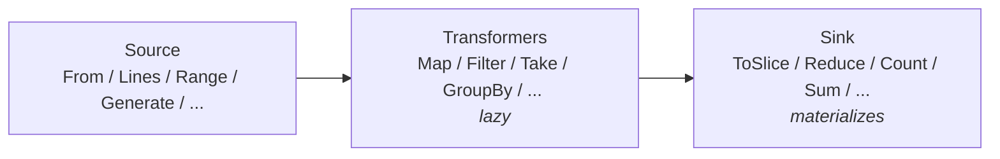

# fluent

<TierBadge tier="mid" />

<UsedInTasksBadges package-name="fluent" />

[View source spec &rarr;](https://github.com/nathanbrophy/glacier/blob/main/specs/0008-fluent.md)

## Public summary
<!-- magpie:extract source=specs/0008-fluent.md section=public-summary source-checksum=PENDING -->

`fluent` is Glacier's answer to LINQ: a suite of chainable, lazy, composable operators over Go 1.23+ iterators (`iter.Seq[T]` and `iter.Seq2[K, V]`). Write your logic as top-level function calls, source builders like `From`, `Lines`, and `Generate`; transformers like `Map`, `Filter`, `Take`, `Window`, and `GroupBy`; set operations like `Union`, `Intersect`, and `Except`; joins, sorting, fallible mapping, and a full set of aggregation sinks. Glacier's pipeline evaluates lazily, allocating only what the terminal sink requires. No method-chaining wrappers, no generated code, no external dependencies. Pure idiomatic Go with generics.

<!-- /magpie:extract -->

## Mental model
<!-- magpie:extract source=specs/0008-fluent.md section=mental-model source-checksum=PENDING -->

A `fluent` pipeline has three stages:

```
Source -> Transformers -> Sink
```

**Sources** produce an `iter.Seq[T]` or `iter.Seq2[K, V]`. They do no work until iterated. Examples: `From(slice)`, `Lines(reader)`, `Range(0, 100, 1)`, `Generate(fn)`.

**Transformers** wrap a source and return a new sequence. They are lazy: no element passes through until the sink pulls. Examples: `Map`, `Filter`, `Take`, `Drop`, `Window`, `Chunk`, `Distinct`, `GroupBy`, `Join`, `LeftJoin`, `Union`, `Intersect`, `Except`, `Zip`. Seq2 transformers: `Map2`, `Filter2`, `KeysOf`, `ValuesOf`, `Entries`. Sorting transformers (`Sort`, `SortBy`, `SortStable`, `SortDesc`) are eager -- they materialize the sequence into a slice once, sort it, then yield lazily.

**Sinks** consume the sequence and return a concrete value. They trigger all upstream work. Examples: `ToSlice`, `ToMap`, `Reduce`, `Count`, `First`, `Last`, `Any`, `All`, `Sum`, `Avg`, `Min`, `Max`, `MinBy`, `MaxBy`.



Key invariants:

- Pipelines built from transformers do no work before iteration.
- Each element flows through the pipeline exactly once (single-pass).
- The sort family is the only eager transformer family; it materializes its input once.
- Stateful operators (`Distinct`, `GroupBy`, `Join`, `Union`, `Intersect`, `Except`) allocate a hash set or map on first iteration; their allocation profile is O(unique elements).
- `MapErr` / `FilterErr` surface per-element errors as `iter.Seq2[U, error]`; the caller decides whether to short-circuit or collect all errors.
- Every source, transformer, and sink is a top-level function. Go generics do not compose method chains cleanly across `T -> U` transitions, and top-level functions survive `go doc` without ceremony.

<!-- /magpie:extract -->

## API
<!-- magpie:extract source=specs/0008-fluent.md section=api source-checksum=PENDING -->

All functions are goroutine-safe by value: each call returns a new closure. No function panics in library code except for documented programming-error cases (`Range` step=0, `Window`/`Chunk` size<=0, `Split` empty separator).

### Types

```go
// KV is a key/value pair used by Pairs and Entries to bridge between
// Seq[KV[K, V]] and Seq2[K, V].
type KV[K, V any] struct {
    K K
    V V
}

// Number is the type constraint for numeric types supported by Sum and Avg.
// Exported so callers can declare their own Number-constrained generic functions
// that compose naturally with Sum and Avg.
type Number interface {
    ~int | ~int8 | ~int16 | ~int32 | ~int64 |
        ~uint | ~uint8 | ~uint16 | ~uint32 | ~uint64 |
        ~float32 | ~float64
}
```

### Sources

```go
// From returns an iterator that yields the elements of s in order.
func From[T any](s []T) iter.Seq[T]

// FromMap returns an iterator that yields every key/value pair in m.
// Iteration order is undefined (Go map semantics).
func FromMap[K comparable, V any](m map[K]V) iter.Seq2[K, V]

// FromChan returns an iterator that yields values received from ch until ch
// is closed. The iterating goroutine blocks on each receive.
func FromChan[T any](ch <-chan T) iter.Seq[T]

// Range returns a lazy half-open arithmetic sequence [start, stop) with the
// given step. Panics with "fluent: Range: step must be non-zero" if step == 0.
func Range(start, stop, step int) iter.Seq[int]

// Repeat returns an iterator that yields v exactly n times.
func Repeat[T any](v T, n int) iter.Seq[T]

// Generate returns a lazy iterator driven by fn. If fn returns (v, true), v is
// yielded. If fn returns (_, false), iteration ends. Can produce infinite sequences.
func Generate[T any](fn func() (T, bool)) iter.Seq[T]

// Lines returns a lazy iterator yielding newline-delimited lines from r (newline stripped).
// Callers reading from untrusted sources must wrap r with io.LimitReader.
func Lines(r io.Reader) iter.Seq[string]

// Words returns a lazy iterator yielding whitespace-separated tokens from r.
// Same size-cap note as Lines.
func Words(r io.Reader) iter.Seq[string]

// Split returns a lazy iterator yielding the parts of s split on sep.
// Panics with "fluent: Split: separator must not be empty" if sep == "".
func Split(s, sep string) iter.Seq[string]

// Pairs converts a Seq[KV[K, V]] into a Seq2[K, V].
func Pairs[K, V any](s iter.Seq[KV[K, V]]) iter.Seq2[K, V]
```

### Transformers

```go
func Map[T, U any](src iter.Seq[T], f func(T) U) iter.Seq[U]
func Filter[T any](src iter.Seq[T], pred func(T) bool) iter.Seq[T]
func Take[T any](src iter.Seq[T], n int) iter.Seq[T]
func Drop[T any](src iter.Seq[T], n int) iter.Seq[T]

// Window yields sliding sub-slices of length size. Each yielded slice is a fresh copy.
// Panics with "fluent: Window: size must be positive" if size <= 0.
func Window[T any](src iter.Seq[T], size int) iter.Seq[[]T]

// Chunk yields non-overlapping sub-slices of at most size elements.
// Panics with "fluent: Chunk: size must be positive" if size <= 0.
func Chunk[T any](src iter.Seq[T], size int) iter.Seq[[]T]

// Distinct yields each element at most once, in first-occurrence order.
func Distinct[T comparable](src iter.Seq[T]) iter.Seq[T]

// Zip pairs elements from a and b by position; stops at the shorter source.
func Zip[A, B any](a iter.Seq[A], b iter.Seq[B]) iter.Seq2[A, B]

// GroupBy yields (key, []T) pairs in encounter order. Internally eager.
func GroupBy[T any, K comparable](src iter.Seq[T], key func(T) K) iter.Seq2[K, []T]

// Join yields inner-join (A, B) pairs; b is materialized to a map[K][]B.
func Join[A, B any, K comparable](
    a iter.Seq[A], b iter.Seq[B],
    keyA func(A) K, keyB func(B) K,
) iter.Seq2[A, B]

// LeftJoin is like Join but every element of a is yielded; unmatched b is zero value.
func LeftJoin[A, B any, K comparable](
    a iter.Seq[A], b iter.Seq[B],
    keyA func(A) K, keyB func(B) K,
) iter.Seq2[A, B]

func Union[T comparable](a, b iter.Seq[T]) iter.Seq[T]
func Intersect[T comparable](a, b iter.Seq[T]) iter.Seq[T]
func Except[T comparable](a, b iter.Seq[T]) iter.Seq[T]
```

### Seq2 transformers

```go
func Map2[K, V, K2, V2 any](src iter.Seq2[K, V], f func(K, V) (K2, V2)) iter.Seq2[K2, V2]
func Filter2[K, V any](src iter.Seq2[K, V], pred func(K, V) bool) iter.Seq2[K, V]
func KeysOf[K, V any](src iter.Seq2[K, V]) iter.Seq[K]
func ValuesOf[K, V any](src iter.Seq2[K, V]) iter.Seq[V]
func Entries[K, V any](src iter.Seq2[K, V]) iter.Seq[KV[K, V]]
```

### Sort family (eager)

The sort family materializes the sequence into a slice (one O(n) allocation), sorts it, then returns a lazy `iter.Seq` over the sorted slice.

```go
func Sort[T cmp.Ordered](src iter.Seq[T]) iter.Seq[T]
func SortBy[T any, K cmp.Ordered](src iter.Seq[T], key func(T) K) iter.Seq[T]
func SortStable[T any](src iter.Seq[T], less func(a, b T) int) iter.Seq[T]
func SortDesc[T cmp.Ordered](src iter.Seq[T]) iter.Seq[T]
```

### Fallible operators

```go
// MapErr applies f to each element; yields (value, nil) on success and (zero, err) on failure.
func MapErr[T, U any](src iter.Seq[T], f func(T) (U, error)) iter.Seq2[U, error]

// FilterErr applies pred to each element; yields (element, err) when pred fails.
func FilterErr[T any](src iter.Seq[T], pred func(T) (bool, error)) iter.Seq2[T, error]
```

### Sinks

```go
func Reduce[T, R any](src iter.Seq[T], zero R, f func(R, T) R) R
func ToSlice[T any](src iter.Seq[T]) []T
func ToMap[K comparable, V any](src iter.Seq2[K, V]) map[K]V
func Count[T any](src iter.Seq[T]) int
func First[T any](src iter.Seq[T]) (T, bool)
func Last[T any](src iter.Seq[T]) (T, bool)
func Any[T any](src iter.Seq[T], pred func(T) bool) bool
func All[T any](src iter.Seq[T], pred func(T) bool) bool
func Sum[T Number](src iter.Seq[T]) T
func Avg[T Number](src iter.Seq[T]) float64  // returns math.NaN() for empty
func Min[T cmp.Ordered](src iter.Seq[T]) (T, bool)
func Max[T cmp.Ordered](src iter.Seq[T]) (T, bool)
func MinBy[T any, K cmp.Ordered](src iter.Seq[T], key func(T) K) (T, bool)
func MaxBy[T any, K cmp.Ordered](src iter.Seq[T], key func(T) K) (T, bool)
```

<!-- /magpie:extract -->

## Examples
<!-- magpie:extract source=specs/0008-fluent.md section=examples source-checksum=PENDING -->

Group active users by department and take the top 3 scorers per group:

```go
func ExampleGroupBy_top3PerDept() {
    type User struct {
        Name  string
        Dept  string
        Score int
        Active bool
    }
    users := []User{
        {"Alice", "eng", 90, true},
        {"Bob",   "eng", 70, true},
        {"Carol", "eng", 85, true},
        {"Dave",  "mkt", 60, true},
        {"Eve",   "mkt", 95, true},
        {"Frank", "eng", 50, false},
    }

    active  := fluent.Filter(fluent.From(users), func(u User) bool { return u.Active })
    byDept  := fluent.GroupBy(active, func(u User) string { return u.Dept })
    top3    := fluent.Map2(byDept, func(dept string, members []User) (string, []User) {
        sorted := fluent.ToSlice(
            fluent.Take(
                fluent.SortBy(fluent.From(members), func(u User) int { return -u.Score }),
                3,
            ),
        )
        return dept, sorted
    })
    result := fluent.ToMap(top3)

    fmt.Println(len(result["eng"]))    // 3
    fmt.Println(result["eng"][0].Name) // Alice (score 90)
    // Output:
    // 3
    // Alice
}
```

Handle per-element parse errors without short-circuiting:

```go
func ExampleMapErr() {
    raw := []string{"1", "two", "3"}
    parsed := fluent.MapErr(fluent.From(raw), func(s string) (int, error) {
        return strconv.Atoi(s)
    })
    for v, err := range parsed {
        if err != nil {
            fmt.Printf("skip bad value: %v\n", err)
            continue
        }
        fmt.Println(v)
    }
    // Output:
    // 1
    // skip bad value: strconv.Atoi: parsing "two": invalid syntax
    // 3
}
```

Set operations over sequences of comparable values:

```go
func ExampleIntersect() {
    a := fluent.From([]int{1, 2, 3, 4})
    b := fluent.From([]int{2, 4, 6})
    result := fluent.ToSlice(fluent.Intersect(a, b))
    fmt.Println(result)
    // Output:
    // [2 4]
}

func ExampleExcept() {
    a := fluent.From([]int{1, 2, 3, 4})
    b := fluent.From([]int{2, 4})
    result := fluent.ToSlice(fluent.Except(a, b))
    fmt.Println(result)
    // Output:
    // [1 3]
}
```

<!-- /magpie:extract -->

## FAQ
<!-- magpie:extract source=specs/0008-fluent.md section=faq source-checksum=PENDING -->

<div class="glacier-faq">

**Why no method-chaining DSL? Every other language's LINQ equivalent does `seq.Filter(...).Map(...).ToSlice()`.**

Go generics do not compose method chains cleanly across `T -> U` transitions. A method `Filter` on a `Seq[T]` can return `Seq[T]`, but a method `Map` that changes the element type would need to return `Seq[U]` -- and Go does not allow methods to introduce new type parameters beyond those on the receiver. Top-level functions are honest: they show the full signature, compose naturally, and survive `go doc` without ceremony. The named-step pattern is readable and explicit about data flow.

**Why is `Number` exported? Isn't it an implementation detail?**

`Number` is exported because it is a reusable contract. Consumers who write their own numeric aggregation functions over `iter.Seq[T]` can declare `func MyAgg[T fluent.Number](src iter.Seq[T]) T` without duplicating the constraint. Exporting it once is less code and more composition.

**Why does `MapErr` return `iter.Seq2[U, error]` instead of `(iter.Seq[U], error)`?**

Returning `(iter.Seq[U], error)` would force a design choice: either surface the first error immediately (before iteration begins, which is wrong for a lazy stream) or buffer the entire sequence and return the first error only after materializing everything (which defeats laziness). `iter.Seq2[U, error]` lets the caller see each error at the point where it occurs and decide, short-circuit, log-and-continue, or collect-all, at the range site.

**What is the allocation profile of a `Map(Filter(From(s)), f)` pipeline?**

The pipeline is constructed with two closure allocations (one per transformer call). Once constructed, iterating through the pipeline in a `for v := range` loop has zero per-element allocations, provided the predicate and mapping functions do not escape variables to the heap. If your functions close over loop variables or allocate internally, those allocations are yours, not `fluent`'s.

**Why does `Sort` have to be eager? Can't it be lazy?**

No. Sorting requires seeing all elements before yielding any. The sort family materializes the sequence into a `[]T`, sorts it in place, and returns a lazy Seq over the sorted slice. The O(n) allocation is unavoidable and documented. If you only want the smallest or largest element without sorting everything, use `Min`, `Max`, `MinBy`, or `MaxBy` instead.

</div>

<!-- /magpie:extract -->
