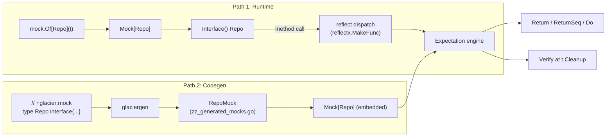

# mock

<TierBadge tier="leaf" />

<UsedInTasksBadges package-name="mock" />

[View source spec &rarr;](https://github.com/nathanbrophy/glacier/blob/main/specs/0012-mock.md)

## Public summary
<!-- magpie:extract source=specs/0012-mock.md section=public-summary source-checksum=PENDING -->

`mock` is Glacier's interface-mocking package. Pass any interface type parameter to `mock.Of[T]` and get back a fully-functional mock whose expectations you set with a fluent builder: record which method should be called, how many times, with what arguments, and what to return. All argument matching is type-safe: `Eq[string]("alice")` will not compile against an `int` parameter. When the test ends, the mock's `Verify` runs automatically (via `t.Cleanup`) and reports every unmet expectation in one structured message. For teams that want richer IDE support, the `+glacier:mock` source marker triggers `glaciergen` to emit a typed wrapper in `zz_generated_mocks.go` with the same semantics and zero reflection at call time.

<!-- /magpie:extract -->

## Mental model
<!-- magpie:extract source=specs/0012-mock.md section=mental-model source-checksum=PENDING -->

There are two paths through the `mock` package. Both deliver the same programming model; they differ only in where the type machinery lives.

**Path 1: Runtime reflect (no codegen required)**

`mock.Of[Repo](t)` uses `reflect.MakeFunc` to synthesize a value that satisfies `Repo` at runtime. When one of its methods is called, the dispatch engine matches the arguments against registered expectations in order, invokes any `Do` function, then returns the configured values. The synthetic value lives only in memory; nothing is written to disk.

**Path 2: Codegen typed wrappers (optional, richer IDE support)**

Add `// +glacier:mock` above an interface declaration. Running `glaciergen` emits a `RepoMock` struct in `zz_generated_mocks.go`. That struct wraps a `Mock[Repo]` internally and exposes `OnGet(...)`, `OnCreate(...)`, etc. Argument matchers are checked at compile time; there is no reflection on the hot path.

Both paths share the same `Matcher[T]`, `Expectation`, and `Call` types. A test may freely mix runtime and codegen mocks.



**Expectation lifecycle:**

1. `OnCall("Method").With(matchers...).Return(vals...)` registers an expectation.
2. Each inbound call locks the mock, scans expectations top-to-bottom, and finds the first whose matchers all pass and whose call count is not yet exhausted.
3. Within the same critical section: the call counter increments and return values are captured. This prevents a race when `Times(1)` is set and multiple goroutines race to be the one match.
4. `Verify` (called automatically at cleanup, or manually) checks that every expectation's call count falls within its stated bounds.

**Strict vs. lenient:** The default mode is strict: any call with no matching expectation immediately calls `t.Errorf` and returns zero values. `mock.StrictFatal` upgrades to `t.Fatalf`. `mock.LenientMode` silently records unmatched calls in `UnmatchedCalls()` for the test to inspect later.

<!-- /magpie:extract -->

## API
<!-- magpie:extract source=specs/0012-mock.md section=api source-checksum=PENDING -->

### Constructor

```go
// Of returns a new Mock[T] for the interface type T and registers a
// t.Cleanup hook that calls Verify when the test ends.
//
// T must be an interface type. Of panics if T is a concrete type or if T is
// the predeclared any type (which is not satisfiably mockable).
//
// Preconditions:
//   - T is an interface type with at least one exported method.
//   - t is non-nil.
//
// Postconditions:
//   - The returned Mock[T].Interface() value satisfies T.
//   - t.Cleanup is registered; Verify runs automatically when t ends.
//
// Panics if T is not an interface type.
func Of[T any](t assert.TB, opts ...Option) Mock[T]
```

### Mock[T] methods

```go
// Interface returns the synthesized value that satisfies T.
// Calls on the returned value route through the expectation engine.
// Concurrency: safe to call from multiple goroutines.
func (m *Mock[T]) Interface() T

// OnCall starts building an expectation for the named method.
// Panics if method is not a valid exported identifier or is not in interface T.
// Concurrency: setup call; call before the code under test runs.
func (m *Mock[T]) OnCall(method string) *Expectation

// CallsTo returns all recorded calls to the named method in arrival order.
func (m *Mock[T]) CallsTo(method string) []*Call

// UnmatchedCalls returns all calls for which no expectation matched, in arrival order.
// Always empty in strict modes.
func (m *Mock[T]) UnmatchedCalls() []*Call

// Verify checks that every registered expectation's call count falls within
// its stated bounds. Idempotent: subsequent calls after the first are no-ops.
func (m *Mock[T]) Verify()

// Close is an alias for Verify that satisfies the io.Closer contract.
// Idempotent. Always returns nil.
func (m *Mock[T]) Close() error
```

### Expectation builder

All builder methods return `*Expectation` for chaining. Precondition violations panic in library-register format at registration time.

```go
func (e *Expectation) With(matchers ...anyMatcher) *Expectation
func (e *Expectation) Return(vals ...any) *Expectation
func (e *Expectation) ReturnSeq(vals [][]any, mode ...seqExhaustion) *Expectation
func (e *Expectation) Do(fn any) *Expectation
func (e *Expectation) Times(n int) *Expectation
func (e *Expectation) AtLeast(n int) *Expectation
func (e *Expectation) AtMost(n int) *Expectation
func (e *Expectation) AnyTimes() *Expectation
func (e *Expectation) Never() *Expectation
```

`Return`, `ReturnSeq`, and `Do` are mutually exclusive; calling more than one panics.

Sequence exhaustion modes:

```go
const (
    SeqCycle   seqExhaustion = iota // default; wraps back to first set after exhaustion
    SeqExhaust                      // calls t.Errorf and returns zero values after exhaustion
)
```

### Matcher constructors

All constructors return `Matcher[T]`. The type parameter T must correspond to the method parameter type at the matching position, enforcing argument-type safety at compile time.

```go
func Eq[T any](want T) Matcher[T]          // passes only when argument == want (reflect.DeepEqual)
func Any[T any]() Matcher[T]               // passes for any value of type T
func Pred[T any](fn func(T) bool) Matcher[T] // custom predicate; fn must be non-nil
func Ref[T any](want T, opts ...assert.EqualOption) Matcher[T] // smart-equal with IgnoreFields etc.
func Nil() Matcher[any]                    // passes when argument is nil
func NotNil() Matcher[any]                 // passes when argument is non-nil
func MatchFn(fn func(any) bool) Matcher[any] // untyped escape hatch; fn must be non-nil
```

### Option constructors

```go
func StrictDefault() Option  // strict mode (default); t.Errorf on unmatched calls
func StrictFatal() Option    // upgrades unmatched calls to t.Fatalf
func LenientMode() Option    // records unmatched calls in UnmatchedCalls(); no test failure
```

<!-- /magpie:extract -->

## Examples
<!-- magpie:extract source=specs/0012-mock.md section=examples source-checksum=PENDING -->

### Runtime mock: basic usage

`mock.Of[Repo](t)` requires no codegen. Expectations are verified automatically at `t.Cleanup`.

```go
// ExampleOf_Repo demonstrates creating a runtime mock for Repo and
// verifying expectations at test cleanup.
func ExampleOf_Repo() {
    // In a real test, t comes from testing.T.
    // Here we use a no-op stand-in for the godoc example.
    t := &testing.T{}

    type Repo interface {
        FindUser(ctx context.Context, id string) (User, error)
        SaveUser(ctx context.Context, u User) error
    }

    m := mock.Of[Repo](t)

    // Expect FindUser("u-42") to be called once and return a user.
    m.OnCall("FindUser").
        With(mock.Any[context.Context](), mock.Eq[string]("u-42")).
        Return(User{ID: "u-42", Name: "Alice"}, nil).
        Times(1)

    // Expect SaveUser to never be called.
    m.OnCall("SaveUser").Never()

    // Pass the mock to code under test.
    repo := m.Interface()
    got, err := repo.FindUser(context.Background(), "u-42")
    fmt.Println(got.Name, err)
    // Output: Alice <nil>
}
```

### Typed matchers with compile-time safety

`Eq[string]` is verified at compile time. Passing the wrong type parameter produces a compile error, not a runtime failure.

```go
func ExampleEq_typed() {
    t := &testing.T{}

    type Greeter interface {
        Greet(name string) string
    }

    m := mock.Of[Greeter](t)

    // Eq[string] is checked at compile time; Eq[int] here would not compile.
    m.OnCall("Greet").
        With(mock.Eq[string]("world")).
        Return("hello, world").
        AnyTimes()

    g := m.Interface()
    fmt.Println(g.Greet("world"))
    // Output: hello, world
}
```

### ReturnSeq with SeqExhaust

`ReturnSeq` serves values in order. `SeqExhaust` fails the test if the sequence runs dry.

```go
func ExampleExpectation_ReturnSeq() {
    t := &testing.T{}

    type Queue interface {
        Pop() (int, bool)
    }

    m := mock.Of[Queue](t)

    // Return 1, then 2, then fail if called a third time.
    m.OnCall("Pop").
        ReturnSeq([][]any{
            {1, true},
            {2, true},
        }, mock.SeqExhaust).
        AnyTimes()

    q := m.Interface()
    v, ok := q.Pop()
    fmt.Println(v, ok) // 1 true
    v, ok = q.Pop()
    fmt.Println(v, ok) // 2 true
    // Output:
    // 1 true
    // 2 true
}
```

### Codegen path with `+glacier:mock`

Add the marker to your interface and run `go generate ./...` to get a typed wrapper with per-method expectation builders.

```go
// +glacier:mock
type Repo interface {
    FindUser(ctx context.Context, id string) (User, error)
    SaveUser(ctx context.Context, u User) error
}

// After running `go generate ./...`, a RepoMock struct is emitted in
// zz_generated_mocks.go. Use it in tests like this:

func TestServiceFindsUser(t *testing.T) {
    rm := &RepoMock{Mock: mock.Of[Repo](t)}

    rm.OnFindUser(mock.Any[context.Context](), mock.Eq[string]("u-42")).
        Return(User{ID: "u-42", Name: "Alice"}, nil).
        Times(1)

    svc := NewUserService(rm.Interface())
    got, err := svc.GetUser(context.Background(), "u-42")
    if err != nil {
        t.Fatal(err)
    }
    if got.Name != "Alice" {
        t.Errorf("got %q, want %q", got.Name, "Alice")
    }
    // Verify is called automatically at t.Cleanup.
}
```

<!-- /magpie:extract -->

## FAQ
<!-- magpie:extract source=specs/0012-mock.md section=faq source-checksum=PENDING -->

<div class="glacier-faq">

**Do I need to run `go generate` before my tests work?**

No. The reflect-based runtime mock (`mock.Of[T]`) requires no codegen. You get a fully functional mock immediately. Codegen (`+glacier:mock`) is optional and adds typed `OnFoo(...)` builder methods for better IDE autocomplete. Your tests pass either way.

**What happens if I forget to call `Verify`?**

Nothing bad. `Of[T]` registers a `t.Cleanup` hook that calls `Verify` automatically when the test ends. If you want a mid-test checkpoint, call `Verify()` manually; it is safe to call multiple times and only the first invocation performs the check.

**Can I mock interfaces from third-party packages I don't own?**

Yes, for the runtime path. `mock.Of[io.Reader](t)` works fine. For the codegen path, you cannot add `+glacier:mock` to a type you don't own, but you can wrap it with your own interface and mark that.

**My test has a secret token in a method argument. Will it appear in failure output?**

Not if you wrap it with `log.Redact`. The mock failure formatter is `slog.LogValuer`-aware: any argument that implements `slog.LogValuer` is rendered via its `LogValue()` result, so `log.Redact(token)` prints `[REDACTED]`.

**Is the mock safe for use in parallel tests?**

Yes. All `Mock[T]` state is protected by a `sync.RWMutex`. Calls through `Interface()` are goroutine-safe. The `Times(1)` critical section ensures that under concurrent load, exactly one call matches a single-use expectation. `OnCall` is a setup call and must not be called concurrently with method dispatch.

</div>

<!-- /magpie:extract -->
