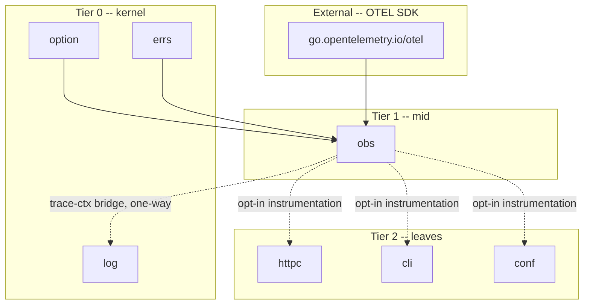

# obs

<TierBadge tier="mid" />

<UsedInTasksBadges package-name="obs" />

[View source spec &rarr;](https://github.com/nathanbrophy/glacier/blob/main/specs/0017-obs.md)

## Public summary
<!-- magpie:extract source=specs/0017-obs.md section=public-summary source-checksum=PENDING -->

`obs` is Glacier's OpenTelemetry-based observability package: metrics and traces for your Go service, with none of the ceremony. Call `obs.Init` once at startup to configure a `MeterProvider` and `TracerProvider` backed by an OTLP gRPC exporter, then instrument the rest of your stack one package at a time via opt-in options (`httpc.WithTracing()`, `httpc.WithMetrics()`, `cli.WithMetrics()`, `conf.WithMetrics()`). Add your own spans and counters in exactly three lines. When a span is active, `log.With(ctx, ...)` automatically appends `trace_id` and `span_id` to every log record with no manual correlation. When instrumentation is disabled, overhead is exactly zero: no allocation, no latency. Structured logs stay in `log/`; `obs/` handles the signals and the traces.

<!-- /magpie:extract -->

## Mental model
<!-- magpie:extract source=specs/0017-obs.md section=mental-model source-checksum=PENDING -->

`obs` has three responsibilities: provider lifecycle, typed instruments, and span management.

```
+--------------------------------------------------------------------------+
|  Provider lifecycle                                                       |
|  ------------------                                                       |
|  Init(opts...)   -- build MeterProvider + TracerProvider, set Default,  |
|                     wire OTLP gRPC exporter (or no-op if env unset)      |
|  Provider.Shutdown(ctx) error -- flush pending spans/metrics; idempotent |
|  obs.Default     -- package-level shared provider; convenience entry     |
+--------------------------------------------------------------------------+
+--------------------------------------------------------------------------+
|  Typed instruments (generic over NumericType == ~int64 | ~float64)      |
|  ------------------------------------------------------------------      |
|  Counter[T]    -- monotonically increasing count; .Add(ctx, v, attrs...) |
|  Histogram[T]  -- distribution of values; .Record(ctx, v, attrs...)     |
|  Gauge[T]      -- point-in-time measurement; .Set(ctx, v, attrs...)     |
+--------------------------------------------------------------------------+
+--------------------------------------------------------------------------+
|  Span management                                                          |
|  ---------------                                                          |
|  StartSpan(ctx, name, opts...) -- begin a span; returns derived ctx+Span |
|  *Span methods  -- End, RecordError, SetStatus, AddEvent, SetAttribute   |
|  SpanFromContext / TraceIDFromContext / SpanIDFromContext                 |
+--------------------------------------------------------------------------+
```

The integration between `obs/` and `log/` is one-directional: `log/` optionally imports `obs/` to read trace context from the active span in ctx (rule F3d), then appends `trace_id` and `span_id` slog attributes to every log record. `obs/` never imports `log/`.



Per-package instrumentation follows the zero-overhead opt-in pattern: each consuming package stores a nil interface reference for its tracer/meter by default. When the corresponding `With*` option is applied at construction time, the live provider is captured into that reference. Hot-path code checks the interface reference; a nil check costs a single pointer comparison and no allocation.

<!-- /magpie:extract -->

## API
<!-- magpie:extract source=specs/0017-obs.md section=api source-checksum=PENDING -->

### Init and Provider

```go
// Init initializes the Glacier observability stack. Builds a MeterProvider
// and a TracerProvider, sets obs.Default, and starts the background OTLP gRPC
// exporter (or a no-op exporter when OTEL_EXPORTER_OTLP_ENDPOINT is unset and
// no WithExporter option is supplied).
//
// Init may only be called once per process. A second call returns
// ErrAlreadyInitialized; Default remains unchanged.
//
// Concurrency: goroutine-safe. Init does NOT block waiting for the exporter
// to connect; export is async.
func Init(opts ...option.Option[initConfig]) (*Provider, error)

var ErrAlreadyInitialized = errs.Sentinel("obs: init: already initialized")

// InitError is the typed error returned when Init cannot build a provider.
type InitError struct {
    Cause error
}
func (e *InitError) Error() string
func (e *InitError) Unwrap() error

var ErrCancelled = errs.Sentinel("obs: cancelled")

// Shutdown flushes all pending spans and metric data points and releases
// exporter resources. Idempotent: second and subsequent calls return nil.
// Returns ErrCancelled wrapping ctx.Err() on cancellation.
// Errors from MeterProvider and TracerProvider are joined via errs.Join.
func (p *Provider) Shutdown(ctx context.Context) error

// Default is the package-level shared Provider set by a successful Init call.
// nil before Init is called.
var Default *Provider
```

### Init options

```go
// WithExporter supplies a custom exporter. When supplied, the env-based OTLP
// gRPC exporter is not constructed.
func WithExporter(e Exporter) option.Option[initConfig]

// WithSampler supplies a custom trace sampler.
// Default: ParentBased(TraceIDRatioBased(0.1)).
func WithSampler(s Sampler) option.Option[initConfig]

// WithResourceAttribute appends a string resource attribute to every emitted
// span and metric data point (e.g., "service.name", "service.version").
func WithResourceAttribute(k, v string) option.Option[initConfig]

// WithMetricsInterval sets the periodic-reader flush interval. Default: 60 s.
func WithMetricsInterval(d time.Duration) option.Option[initConfig]

// WithLogger injects a *slog.Logger for obs/ internal operational events.
func WithLogger(l *slog.Logger) option.Option[initConfig]
```

### Sampler constructors

```go
func ParentBased(root Sampler) Sampler
func TraceIDRatioBased(fraction float64) Sampler
var AlwaysSample Sampler
var NeverSample  Sampler
```

### Typed metric instruments

```go
// NumericType constrains the type parameter for metric instruments.
type NumericType interface{ ~int64 | ~float64 }

// Counter constructs a typed counter bound to Default. No-op when Default is nil.
func Counter[T NumericType](name string, opts ...MetricOption) *CounterImpl[T]

// Histogram constructs a typed histogram bound to Default.
func Histogram[T NumericType](name string, opts ...MetricOption) *HistogramImpl[T]

// Gauge constructs a typed gauge (last-value) bound to Default.
func Gauge[T NumericType](name string, opts ...MetricOption) *GaugeImpl[T]

// Add records a delta on the counter. Goroutine-safe. <= 200 ns/op.
func (c *CounterImpl[T]) Add(ctx context.Context, v T, attrs ...Attribute)

// Record observes v on the histogram. Goroutine-safe. Non-blocking.
func (h *HistogramImpl[T]) Record(ctx context.Context, v T, attrs ...Attribute)

// Set records a point-in-time measurement on the gauge. Goroutine-safe.
func (g *GaugeImpl[T]) Set(ctx context.Context, v T, attrs ...Attribute)

// WithDescription sets the instrument description in OTLP metadata.
func WithDescription(s string) MetricOption

// WithUnit sets the instrument unit string (e.g., "ms", "bytes", "req").
func WithUnit(s string) MetricOption
```

### Span management

```go
// StartSpan starts a new span as a child of any span already in ctx.
// Returns a derived context carrying the new span, and a *Span handle.
// The caller MUST call span.End() when the work unit is complete.
// name must be non-empty and <= 256 bytes with no NUL or control characters.
// An empty name is replaced with "<unnamed>" and logged at warn.
// Goroutine-safe. <= 1 us/op.
func StartSpan(ctx context.Context, name string, opts ...SpanOption) (context.Context, *Span)

func (s *Span) End()
func (s *Span) RecordError(err error)   // nil err is a no-op
func (s *Span) SetStatus(status Status, description string)
func (s *Span) AddEvent(name string, attrs ...Attribute)
func (s *Span) SetAttribute(k string, v any)

// SpanFromContext retrieves the *Span in ctx. Returns a non-nil no-op Span when
// no active span is present.
func SpanFromContext(ctx context.Context) *Span

// TraceIDFromContext extracts the TraceID of the active span. Returns (zero, false)
// when no recording span is present.
func TraceIDFromContext(ctx context.Context) (TraceID, bool)

// SpanIDFromContext extracts the SpanID of the active span.
func SpanIDFromContext(ctx context.Context) (SpanID, bool)

// WithSpanKind sets the span kind. Default: SpanKindInternal.
func WithSpanKind(k SpanKind) SpanOption

// WithAttributes attaches initial attributes to the span at start time.
func WithAttributes(attrs ...Attribute) SpanOption
```

### SpanKind and Status

```go
type SpanKind int

const (
    SpanKindInternal SpanKind = iota
    SpanKindServer
    SpanKindClient
    SpanKindProducer
    SpanKindConsumer
)

type Status int

const (
    StatusUnset Status = iota
    StatusOk
    StatusError
)
```

### Attribute constructors

```go
// Attribute is a typed key-value pair for span and metric attributes.
// Key must be non-empty, <= 256 bytes, no NUL or control characters.
type Attribute struct{ /* ... */ }

func String(k, v string) Attribute
func Int(k string, v int64) Attribute
func Float(k string, v float64) Attribute
func Bool(k string, v bool) Attribute
func StringSlice(k string, v []string) Attribute
```

### Standard attribute key constants

```go
const (
    KeyHTTPMethod       = "http.method"
    KeyHTTPStatusCode   = "http.status_code"
    KeyHTTPURL          = "http.url"
    KeyHTTPResponseSize = "http.response.size"
)

const (
    KeyCLICommand   = "glacier.cli.command"
    KeyCLIExitCode  = "glacier.cli.exit_code"
    KeyConfPath     = "glacier.conf.path"
    KeyRetryAttempt = "glacier.retry_attempt"
)
```

### Log-bridge helper

```go
// TraceAttrsFromContext extracts slog.Attr values for trace_id and span_id
// from the active span in ctx. Returns (nil, false) when no recording span
// is active. Consumed by log/ to implement trace-correlated logging;
// user code should use log.With(ctx, ...) instead.
// Zero allocations on the false path.
func TraceAttrsFromContext(ctx context.Context) ([]slog.Attr, bool)
```

<!-- /magpie:extract -->

## Examples
<!-- magpie:extract source=specs/0017-obs.md section=examples source-checksum=PENDING -->

Initialize obs at program start and shut it down on exit:

```go
func ExampleInit() {
    ctx := context.Background()

    prov, err := obs.Init(
        obs.WithResourceAttribute("service.name", "my-service"),
        obs.WithResourceAttribute("service.version", "v1.2.3"),
        obs.WithSampler(obs.ParentBased(obs.TraceIDRatioBased(0.1))),
    )
    if err != nil {
        log.Fatal(err)
    }
    defer prov.Shutdown(ctx)

    // obs.Default is now set; use package-level helpers throughout the program.
}
```

Manually instrument a handler function with a span:

```go
func ExampleStartSpan() {
    ctx := context.Background()

    ctx, span := obs.StartSpan(ctx, "handle.request",
        obs.WithSpanKind(obs.SpanKindServer),
        obs.WithAttributes(obs.String("user.id", "u-123")),
    )
    defer span.End()

    if err := doWork(ctx); err != nil {
        span.RecordError(err)
        span.SetStatus(obs.StatusError, err.Error())
        return
    }
    span.SetStatus(obs.StatusOk, "")
}

func doWork(_ context.Context) error { return nil }
```

Declare and increment a typed counter:

```go
func ExampleCounter() {
    var requestCount = obs.Counter[int64]("http.requests",
        obs.WithDescription("Total HTTP requests served"),
        obs.WithUnit("req"),
    )

    ctx := context.Background()

    requestCount.Add(ctx, 1,
        obs.String(obs.KeyHTTPMethod, "GET"),
        obs.Int(obs.KeyHTTPStatusCode, 200),
    )
}
```

Enable per-package opt-in instrumentation on an httpc.Client:

```go
func ExampleWithTracing() {
    ctx := context.Background()

    prov, _ := obs.Init(obs.WithResourceAttribute("service.name", "svc"))
    defer prov.Shutdown(ctx)

    client, _ := httpc.New(
        httpc.WithTracing(),  // emits a span per request
        httpc.WithMetrics(),  // emits counter + histogram per request
    )
    _ = client
    // Every client.Get/Post/Put now automatically emits OTEL spans and metrics.
}
```

<!-- /magpie:extract -->

## FAQ
<!-- magpie:extract source=specs/0017-obs.md section=faq source-checksum=PENDING -->

<div class="glacier-faq">

**Why is obs/ built on the OpenTelemetry SDK instead of a lighter custom implementation?**

The OpenTelemetry data model (TraceID, SpanContext, W3C Trace Context propagation, OTLP wire format) is a specification, not just a convention. A custom implementation that deviates from the spec is not observable by standard backends (Jaeger, Tempo, Datadog, etc.). The OTEL Go SDK is Apache-2.0, multi-org maintained, and is the only wire-compatible reference implementation.

**Why is obs/ a mid-tier package and not a kernel or leaf package?**

`obs/` sits at Tier 1 (mid) because it imports kernel packages (`option`, `errs`) and the external OTEL SDK, but it does not import any Glacier leaf package. Placing `obs/` at kernel tier would drag the OTEL dep set into every Glacier consumer, even those with no observability requirement. Placing it at leaf tier would make the per-package instrumentation contracts circular.

**Why are `WithTracing()` and `WithMetrics()` options opt-in per package instead of automatic?**

Automatic instrumentation would mean every `httpc.Client` always imports `obs/` and always allocates tracer/meter resources, even in binaries that never call `obs.Init`. The opt-in model keeps the zero-overhead guarantee: when you do not pass `WithTracing()` to your `httpc.New(...)` call, the hot path does exactly one nil pointer check and nothing else.

**How does log/ know about trace IDs without importing obs/?**

The integration is one-directional. `obs/` exports `TraceAttrsFromContext(ctx)` -- a single, zero-allocation helper that reads the OTEL span context from the context value and returns slog attrs. `log/` optionally imports `obs/` to call this helper inside `log.With(ctx, ...)`. `obs/` never imports `log/`.

**When does `obs.Init` need to be called relative to everything else?**

`obs.Init` must be called before any component that uses `WithTracing()` or `WithMetrics()` is constructed. The standard pattern is to call `Init` at the beginning of `main`, before constructing any `httpc.Client`, `cli.App`, or `conf.Loader` that has instrumentation options. `Counter`, `Histogram`, and `Gauge` instruments may be declared at package-level before `Init`; their `Add`/`Record`/`Set` methods are safe no-ops until `Init` has run.

</div>

<!-- /magpie:extract -->
