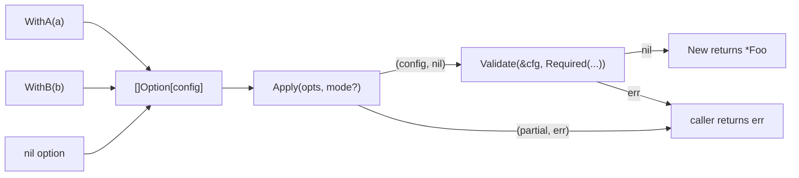

# option

<TierBadge tier="kernel" />

<UsedInTasksBadges package-name="option" />

[View source spec &rarr;](https://github.com/nathanbrophy/glacier/blob/main/specs/0003-option.md)

## Public summary
<!-- magpie:extract source=specs/0003-option.md section=public-summary source-checksum=PENDING -->

`option` is Glacier's universal functional-options kernel. Every Glacier package configurable at construction returns `Option[T]` values from its `With*` constructors and accepts them in its `New` function. `Apply` folds a slice of options into a zero-valued config struct; by default it short-circuits on the first failure, but `Strict()` mode accumulates every error so callers see all problems in one pass. `Validate` and `Required` provide a lightweight post-Apply validation layer for required-field and cross-field invariants. The package imports only `errors` and `fmt`; it has no Glacier dependencies and no external dependencies.

<!-- /magpie:extract -->

## Mental model
<!-- magpie:extract source=specs/0003-option.md section=mental-model source-checksum=PENDING -->

Options compose a config struct. A package author writes `With*` constructors that each return an `Option[config]`, then calls `Apply` in `New` to fold them in order. After `Apply` succeeds, `Validate` checks invariants that span multiple fields or require a fully-applied state.



Key invariants:

- Options are stateless functions (`OptionFunc[T]` is `func(*T) error`). Concurrent calls to `Apply` over the same `[]Option[T]` slice are safe without any locking.
- `nil` options in the slice are skipped silently, so conditional option patterns require no special handling.
- Duplicate `With*` calls follow last-wins semantics by virtue of in-order application.
- `Apply` never panics on a nil `Option[T]` interface value; it panics only if the underlying `OptionFunc` is nil (a misuse the caller owns).

<!-- /magpie:extract -->

## API
<!-- magpie:extract source=specs/0003-option.md section=api source-checksum=PENDING -->

The package surface is closed at v0: exactly eight exports.

### `Option[T]` and `OptionFunc[T]`

```go
// Option configures a value of type T. The unexported apply method
// forbids out-of-module implementations; consumers compose options
// via OptionFunc.
type Option[T any] interface {
    apply(*T) error
}

// OptionFunc is the function adapter that satisfies Option.
//
// Per-package WithX constructors return OptionFunc-wrapped functions:
//
//	func WithLogger(l *slog.Logger) option.Option[config] {
//	    return option.OptionFunc[config](func(c *config) error {
//	        if l == nil {
//	            return errors.New("pkg: WithLogger: logger is nil")
//	        }
//	        c.logger = l
//	        return nil
//	    })
//	}
type OptionFunc[T any] func(*T) error
```

### `Apply[T]`

```go
// Apply applies opts to a zero-valued T and returns the configured T
// plus any error.
//
// Default behavior: Apply returns at the first option that errors,
// with T reflecting the partial state accumulated up to that point.
// With Strict() mode: Apply applies every option and returns
// errors.Join over all collected failures.
//
// Nil options in opts are skipped silently. Duplicate options follow
// last-wins semantics. An empty opts slice returns the zero value of T
// and nil.
//
// Panics propagate: Apply does not recover from options that panic.
//
// Preconditions: none. opts may be nil or empty.
// Allocations: zero on the happy path (no errors, no Strict mode).
// Concurrency: goroutine-safe.
func Apply[T any](opts []Option[T], mode ...Mode) (T, error)
```

**Error contract:** returns the first option error (default mode) or `errors.Join` of all failures (Strict mode).

### `Mode` and `Strict`

```go
// Mode configures Apply's error-handling semantics.
// Construct via Strict(). The zero value is the default (short-circuit
// on first option error).
type Mode struct { /* unexported */ }

// Strict returns a Mode that causes Apply to apply every option even
// when some fail, returning errors.Join over every collected failure.
//
// Concurrency: Strict() is a pure function; its return value is safe
// to share across goroutines.
func Strict() Mode
```

### `Validator[T]`, `Validate[T]`, and `Required[T]`

```go
// Validator validates a fully-applied T. Validators run after Apply
// has populated T from options; they check correctness invariants
// that span multiple fields or depend on a fully-applied state.
//
// Concurrency: Validator[T] is a function type; goroutine-safe by design.
type Validator[T any] func(*T) error

// Validate runs validators against t and returns errors.Join over
// every validator that fails. Nil validators are skipped silently.
//
// Preconditions: t must not be nil.
// Postconditions: nil returned when all validators pass or validators is empty.
// Error contract: "option: validate: target is nil" when t is nil.
// Concurrency: goroutine-safe when called with independent t values.
func Validate[T any](t *T, validators ...Validator[T]) error

// Required returns a Validator that fails if getter returns nil.
// The error message is:
//
//	option: required: field "<name>" not set
//
// The getter receives a *T so it can navigate the config struct.
// Return the field value as any; Required checks whether it is nil.
//
//	option.Required[config]("logger", func(c *config) any { return c.logger })
//
// Concurrency: the returned Validator[T] is goroutine-safe.
func Required[T any](name string, getter func(*T) any) Validator[T]
```

<!-- /magpie:extract -->

## Examples
<!-- magpie:extract source=specs/0003-option.md section=examples source-checksum=PENDING -->

### Per-package usage: writing `With*` constructors and calling `Apply`

```go
package httpmock

import (
	"errors"
	"fmt"
	"log/slog"

	"github.com/nathanbrophy/glacier/option"
)

type config struct {
	logger        *slog.Logger
	defaultStatus int
}

func WithLogger(l *slog.Logger) option.Option[config] {
	return option.OptionFunc[config](func(c *config) error {
		if l == nil {
			return errors.New("httpmock: WithLogger: logger is nil")
		}
		c.logger = l
		return nil
	})
}

func WithDefaultStatus(code int) option.Option[config] {
	return option.OptionFunc[config](func(c *config) error {
		if code < 100 || code > 599 {
			return fmt.Errorf("httpmock: WithDefaultStatus: invalid code %d", code)
		}
		c.defaultStatus = code
		return nil
	})
}

func New(opts ...option.Option[config]) (*Transport, error) {
	cfg, err := option.Apply(opts)
	if err != nil {
		return nil, err
	}
	if err := option.Validate(&cfg,
		option.Required[config]("logger", func(c *config) any { return c.logger }),
	); err != nil {
		return nil, err
	}
	return &Transport{cfg: cfg}, nil
}
```

### Strict mode: collect all option errors in one pass

```go
cfg, err := option.Apply(opts, option.Strict())
if err != nil {
	// err is errors.Join of every option that failed.
	// Each failure carries its own package-prefixed message.
	for e := range errs.Chain(err) {
		log.Println(e)
	}
}
```

### Conditional option using nil-skip

```go
var debugOpt option.Option[config]   // remains nil if !debug
if debug {
	debugOpt = WithDebug()
}
opts := []option.Option[config]{WithLogger(l), debugOpt, WithDefaultStatus(200)}
cfg, _ := option.Apply(opts)   // nil debugOpt is skipped silently
```

### Preset + override (last-wins on duplicates)

```go
var DevPreset = []option.Option[config]{
	WithLogger(devLogger),
	WithDefaultStatus(200),
}

cfg, _ := option.Apply(append(DevPreset, WithDefaultStatus(500)))
// cfg.defaultStatus == 500 -- the override wins
```

<!-- /magpie:extract -->

## FAQ
<!-- magpie:extract source=specs/0003-option.md section=faq source-checksum=PENDING -->

<div class="glacier-faq">

**Why does Apply return an error instead of panicking?**

Options can fail for legitimate reasons: a nil logger, an out-of-range port number, a missing required value. Returning an error lets constructors surface the problem cleanly and lets callers decide how to handle it (log and exit, accumulate, retry with different options).

**Why is there a separate Mode type instead of a boolean parameter?**

`Apply(opts, true)` and `Apply(opts, false)` are opaque. `Apply(opts, option.Strict())` is self-documenting. The variadic `mode ...Mode` form lets callers omit the mode entirely for the common case, keeps the zero value meaningful (default semantics), and makes it easy to pass a computed mode from a variable.

**Why not method chaining (a builder API)?**

Go's idiomatic pattern for construction is `New(opts ...Option[T])` with a function call, not `builder.WithA(a).WithB(b).Build()`. The functional-options pattern composes naturally with `append`, spread, and preset slices. Builders require an extra type per package and obscure the zero value.

**Why does option.Option[T] stutter at the call site?**

`option.Option[config]` is idiomatic. Go has many precedents: `errors.New` returns an `error`, `time.Time` is a `time.Time`, `context.Context` is a `context.Context`. The stutter communicates "this is the canonical thing from the option package."

**Why does Required use `getter func(*T) any` instead of `check func(*T) bool`?**

The `any` getter form makes T load-bearing: the getter is typed to `*T`, giving compile-time safety that the getter navigates the correct config type. The nil check on the returned `any` covers pointer fields and interface fields. For value-type fields with no natural nil representation, write a custom `Validator[T]` instead.

**What happens when an option mutates the config and then returns an error?**

The mutation is visible in the returned partial T. `Apply` does not attempt transactional rollback; that is the option author's responsibility. In practice, most `With*` constructors validate before mutating, making them naturally transactional.

</div>

<!-- /magpie:extract -->
