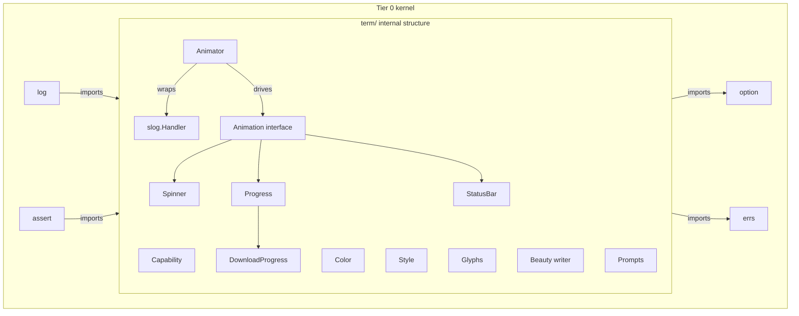

# term

<TierBadge tier="kernel" />

<UsedInTasksBadges package-name="term" />

[View source spec &rarr;](https://github.com/nathanbrophy/glacier/blob/main/specs/0016-term.md)

## Public summary
<!-- magpie:extract source=specs/0016-term.md section=public-summary source-checksum=PENDING -->

`term` is Glacier's terminal-as-first-class-output toolkit. It turns the TTY into a beautiful, well-behaved reporting pane without any bespoke coordination code in user programs. The package spans six facilities: capability detection (color depth, UTF-8 support, terminal dimensions, `NO_COLOR` / `GLACIER_NO_COLOR` environment conventions); 24-bit ANSI color and immutable style chaining; a glyph/icon registry with automatic ASCII fallback for non-UTF-8 terminals; beauty-writer layout primitives (boxes, center, justify, padding, truncation, word-wrap, multi-column, banners); interactive prompts (text input, password, confirm, generic-typed select and multi-select) with raw-mode discipline and panic-safe terminal restore; and the animation coordinator (`Animator`) that owns a `*slog.Logger`, intercepts every log record emitted while animations are running, buffers the records between frames, and flushes them above the animation area so log lines and progress bars never collide on screen. `term` is Tier 0 kernel: `log` depends on it for color rendering and TTY detection, and `assert` depends on it for failure-message color.

<!-- /magpie:extract -->

## Mental model
<!-- magpie:extract source=specs/0016-term.md section=mental-model source-checksum=PENDING -->

Think of `term` as three concentric layers.

**Outer layer (the Animator).** When a program needs animated output, the `Animator` is the single orchestrating object. Hand it a `*slog.Logger` at construction time. The Animator wraps the logger's handler with an interception handler. During `Run`, every `slog.Info` / `slog.Error` / etc. call goes into a bounded ring buffer rather than to the writer directly. Each tick (default 100 ms) the Animator erases the previous animation frame, flushes all buffered log records as plain formatted lines, and re-renders every active animation. Logs and animations never interleave; they are strictly sequenced.

**Middle layer (animations, prompts, and beauty).** Concrete animations (`Spinner`, `Progress`, `StatusBar`, `DownloadProgress`) implement the `Animation` interface (`Render() ([]string, bool)`) and are registered with the Animator via `Add`. Prompts are blocking, ctx-cancellable calls that take ownership of the terminal's raw mode for the duration of the interaction and restore cooked mode unconditionally on completion, cancellation, or panic. Beauty functions (`Box`, `Center`, `Justify`, `Pad`, `Truncate`, `Wrap`, `Columns`, `Banner`) accept plain strings and return styled strings; they are pure functions.

**Inner layer (color, style, glyphs, and capability).** `Capability(w)` probes any `io.Writer` and returns a `Capabilities` struct. `Style` is an immutable value type; every method returns a new `Style`. Color escapes are pre-computed and cached at first use. Glyphs are keyed by name; the registry returns the UTF-8 form on capable terminals and the ASCII fallback otherwise.



The DAG is strictly acyclic: `term` imports only `option` and `errs` from the Glacier module. It does NOT import `log` or `assert`.

<!-- /magpie:extract -->

## API
<!-- magpie:extract source=specs/0016-term.md section=api source-checksum=PENDING -->

### Capability detection

```go
// Capabilities reports terminal-rendering capabilities for a given writer.
type Capabilities struct {
    IsTTY         bool
    SupportsColor ColorSupport
    SupportsUTF8  bool
    Width, Height int
    NoColorEnv    bool // true when NO_COLOR or GLACIER_NO_COLOR is present
}

// ColorSupport is the enum of color depth levels a terminal can render.
type ColorSupport int

const (
    ColorNone   ColorSupport = iota // no color; plain text only
    Color16                         // 16-color ANSI
    Color256                        // 256-color
    Color24Bit                      // 24-bit true color
)

// Capability probes w for terminal capabilities. Results are cached per writer
// so repeated calls are zero-allocation after the first.
//
// Preconditions: w must not be nil.
// Concurrency: goroutine-safe; cache uses sync.Map.
func Capability(w io.Writer) Capabilities
```

### Color and Style

```go
// RGB constructs a 24-bit Color from its component channels.
func RGB(r, g, b uint8) Color

// Hex parses a CSS-style hex color string (with or without leading '#').
// Accepts 3-digit (#RGB) and 6-digit (#RRGGBB) forms.
// Returns HexParseError on invalid input.
func Hex(s string) (Color, error)

// Spec-0001 palette tokens.
var (
    Cyan, Teal, Bg, Surface, Surface2             Color
    Text, TextMuted, TextFaint                    Color
    Success, Warning, Error, Info, Border         Color
    Cyan100, Cyan300, Cyan500, Cyan700            Color
    Teal500, Teal700                              Color
)

// New returns a zero Style with no decorations. Render on a zero Style returns
// the input text unchanged.
func New() Style

// Style methods (each returns a new Style; the receiver is unchanged):
func (s Style) Foreground(c Color) Style
func (s Style) Background(c Color) Style
func (s Style) Bold() Style
func (s Style) Italic() Style
func (s Style) Underline() Style
func (s Style) Dim() Style
func (s Style) Strike() Style

// Render returns text wrapped in ANSI escape sequences for this style.
// ANSI sequences are pre-computed at first use and cached.
// Target: <=100 ns/op + 1 alloc per spec.
// Concurrency: goroutine-safe.
func (s Style) Render(text string) string

// Sprint is a convenience wrapper equivalent to s.Render(text).
func Sprint(s Style, text string) string

// Fprint writes s.Render(text) to w. Capability is detected from w.
func Fprint(w io.Writer, s Style, text string)
```

### Glyphs

```go
// Glyph returns the registered glyph's UTF-8 form if the active output writer
// supports UTF-8, otherwise its ASCII fallback.
// If name is not in the registry, Glyph returns "" and emits a debug-level warning.
func Glyph(name string) string

// RegisterGlyph adds a custom glyph to the registry.
// name must match ^[a-z][a-z0-9_]*$ and be <= 64 bytes.
// Returns GlyphError on any violation.
func RegisterGlyph(name, utf8, ascii string) error

// Glyphs returns a snapshot of all registered glyphs (built-in + custom).
func Glyphs() []GlyphInfo
```

Built-in glyphs include `check` (✓/[OK]), `cross` (✗/[X]), `warn` (⚠/[!]), `info` (ℹ/[i]), `bullet` (•/*), `arrow_right` (->/->), `ellipsis` (.../...), `spinner_braille_0` through `spinner_braille_7`, and `spinner_dots_0` through `spinner_dots_7`, among others.

### Beauty writer

```go
// Box renders text inside a Unicode box border.
func Box(text string, opts ...BoxOption) string

// Box configuration options:
func WithRoundedCorners() BoxOption  // default
func WithSharpCorners() BoxOption
func WithDoubleBorders() BoxOption
func WithBorderStyle(s Style) BoxOption
func WithPadding(top, right, bottom, left int) BoxOption
func WithTitle(s string) BoxOption
func WithTitleStyle(s Style) BoxOption

// Layout functions (all pure, goroutine-safe):
func Center(text string, width int) string
func Justify(text string, width int) string
func Pad(text string, leftN, rightN int) string
func Truncate(text string, width int, ellipsis string) string
func Wrap(text string, width int) string
func Columns(rows [][]string, opts ...ColumnOption) string
func Banner(s Style, lines ...string) string
```

### Prompts

```go
// Prompt displays question, reads a single line of input, and returns it.
// Input lines are capped at 4 KiB; NUL bytes and non-printable control characters
// (except backspace and arrow-key escape sequences) are rejected.
//
// Error contract:
//   - ErrCancelled if ctx is cancelled or the user sends EOF/Ctrl-C.
//   - ErrTimeout if WithTimeout is set and expires.
//   - ErrTooManyAttempts if WithMaxAttempts is set and exhausted.
//
// Terminal restore: raw mode is released unconditionally via defer; panic-safe.
func Prompt(ctx context.Context, question string, opts ...PromptOption) (string, error)

// Password displays question and reads input with echo disabled.
func Password(ctx context.Context, question string) (string, error)

// Confirm displays question with a Y/N prompt and returns the boolean answer.
// Default is No unless WithDefaultYes() is set.
func Confirm(ctx context.Context, question string, opts ...ConfirmOption) (bool, error)

// Select displays a numbered or arrow-navigable list and returns the one selected.
// T is the element type; render converts T to a display string.
// Returns ErrCancelled if ctx is cancelled or EOF/Ctrl-C received.
func Select[T any](ctx context.Context, question string, options []T, render func(T) string, opts ...SelectOption) (T, error)

// MultiSelect displays a checkable list of options and returns all selected.
// Space toggles selection; Enter confirms.
func MultiSelect[T any](ctx context.Context, question string, options []T, render func(T) string, opts ...SelectOption) ([]T, error)

// Prompt option constructors:
func WithDefault(s string) PromptOption
func WithValidator(fn func(string) error) PromptOption
func WithMaxAttempts(n int) PromptOption
func WithTimeout(d time.Duration) PromptOption
func WithDefaultYes() ConfirmOption
```

### Animation coordinator

```go
// Animator coordinates animated terminal output and slog log buffering.
type Animator struct{ /* unexported fields */ }

// NewAnimator constructs an Animator bound to logger.
// Preconditions: logger must not be nil.
func NewAnimator(logger *slog.Logger, opts ...AnimatorOption) *Animator

// Add registers a into the active animation set. Returns a Handle whose
// Cancel removes this specific registration.
// Concurrency: goroutine-safe.
func (a *Animator) Add(anim Animation) Handle

// Run starts the frame loop. Blocks until ctx is cancelled or all animations
// report done. The original logger handler is restored on return (panic-safe).
func (a *Animator) Run(ctx context.Context) error

// Pause suspends frame rendering (log records continue to be buffered).
func (a *Animator) Pause()

// Resume restarts frame rendering after Pause.
func (a *Animator) Resume()

// Close stops the frame loop, restores the logger handler, and flushes
// remaining buffered records. Idempotent. Implements io.Closer.
func (a *Animator) Close() error

// AnimatorOption constructors:
func WithRefreshRate(d time.Duration) AnimatorOption  // default 100ms
func WithWriter(w io.Writer) AnimatorOption           // default os.Stderr
func WithMaxBufferedRecords(n int) AnimatorOption     // default 1000

// Animation is the interface implemented by all animated elements.
type Animation interface {
    Render() (lines []string, done bool)
}

// Handle is the cancellation token returned by Animator.Add.
func (h Handle) Cancel()
```

### Built-in animations

```go
// Spinner returns an Animation that cycles through spinner glyphs.
// Default frames: spinner_braille_0 through spinner_braille_7.
func Spinner(label string, opts ...SpinnerOption) Animation

// Progress is a progress-bar animation. total == -1 for indeterminate mode.
type Progress struct{ /* unexported fields */ }
func NewProgress(total int64, opts ...ProgressOption) *Progress
func (p *Progress) Set(n int64)
func (p *Progress) Increment(n int64)
func (p *Progress) Done()
func (p *Progress) Render() ([]string, bool)

// StatusBar is a multi-section status display.
type StatusBar struct{ /* unexported fields */ }
func NewStatusBar(opts ...StatusBarOption) *StatusBar
func (s *StatusBar) SetSection(name, content string)
func (s *StatusBar) Remove(name string)
func (s *StatusBar) Render() ([]string, bool)
func (s *StatusBar) Close() error

// DownloadProgress wraps an io.Reader, updating an embedded *Progress as bytes
// are read. Intended for use with httpc.WithProgress.
type DownloadProgress struct {
    *Progress
    Source io.Reader
}
func NewDownloadProgress(r io.Reader, contentLength int64, label string, opts ...ProgressOption) *DownloadProgress
func (d *DownloadProgress) Read(p []byte) (int, error)
```

<!-- /magpie:extract -->

## Examples
<!-- magpie:extract source=specs/0016-term.md section=examples source-checksum=PENDING -->

### Spec-0001 palette in action

```go
package term_test

import (
    "fmt"

    "github.com/nathanbrophy/glacier/term"
)

func ExampleStyle() {
    warn := term.New().Foreground(term.Warning).Bold()
    info := term.New().Foreground(term.Cyan)

    fmt.Println(warn.Render("config file missing"))
    fmt.Println(info.Render("using defaults"))

    // One-liner convenience form:
    fmt.Println(term.Sprint(warn, "config file missing"))
    // Output:
    // (ANSI-escaped output; exact bytes depend on terminal support)
}
```

### Boxed warning

```go
package term_test

import (
    "fmt"

    "github.com/nathanbrophy/glacier/term"
)

func ExampleBox() {
    box := term.Box(
        "Configuration validation failed.\nPort 8080 already in use.",
        term.WithTitle("WARNING"),
        term.WithTitleStyle(term.New().Foreground(term.Warning).Bold()),
        term.WithBorderStyle(term.New().Foreground(term.Warning)),
        term.WithRoundedCorners(),
        term.WithPadding(1, 2, 1, 2),
    )
    fmt.Println(box)
    // Output:
    // +- WARNING ----------------------------------------+
    // |                                                  |
    // |  Configuration validation failed.               |
    // |  Port 8080 already in use.                      |
    // |                                                  |
    // +--------------------------------------------------+
}
```

### Prompt and Confirm

```go
package term_test

import (
    "context"
    "errors"
    "fmt"

    "github.com/nathanbrophy/glacier/term"
)

func ExamplePrompt() {
    ctx := context.Background()

    name, err := term.Prompt(ctx, "Project name?",
        term.WithDefault("my-glacier-app"),
        term.WithValidator(func(s string) error {
            if len(s) == 0 {
                return errors.New("name must not be empty")
            }
            return nil
        }),
    )
    if err != nil {
        fmt.Println("cancelled:", err)
        return
    }

    ok, err := term.Confirm(ctx, "Apply changes?")
    if err != nil {
        fmt.Println("cancelled:", err)
        return
    }

    if ok {
        fmt.Println("creating project:", name)
    }
}
```

### Animator with log coordination and Progress

```go
package term_test

import (
    "context"
    "log/slog"

    "github.com/nathanbrophy/glacier/log"
    "github.com/nathanbrophy/glacier/term"
)

func ExampleAnimator() {
    ctx, cancel := context.WithCancel(context.Background())
    defer cancel()

    // Animator wraps the logger. Log writes during Run are buffered and
    // flushed above the animation area between frames.
    a := term.NewAnimator(log.Default(),
        term.WithRefreshRate(80*1_000_000), // 80ms
    )

    prog := term.NewProgress(1024*1024*100,
        term.WithProgressLabel("Downloading corpus"),
        term.WithProgressShowSpeed(),
        term.WithProgressShowETA(),
        term.WithProgressShowBytes(),
    )
    a.Add(prog)

    go func() {
        for i := 0; i < 10; i++ {
            prog.Increment(1024 * 1024 * 10)
            slog.Info("chunk received", "chunk", i+1)
        }
        prog.Done()
    }()

    // Run blocks until all animations are done or ctx is cancelled.
    if err := a.Run(ctx); err != nil {
        slog.Error("animation error", "err", err)
    }
}
```

<!-- /magpie:extract -->

## FAQ
<!-- magpie:extract source=specs/0016-term.md section=faq source-checksum=PENDING -->

<div class="glacier-faq">

**Why is `term` a Tier 0 kernel package rather than a leaf or mid-tier package?**

`log` needs color rendering and TTY detection for its colored output handler, and `assert` needs it for failure-message color in structured diffs. Both are kernel packages. If `term` were mid-tier or leaf, `log` and `assert` could not import it without breaking the layering invariant. Rather than duplicate capability detection in `log` and `assert`, the framework promotes `term` to kernel so all three packages can share the same primitives cleanly.

**Why does `Animator` own the `*slog.Logger` rather than managing its own writer directly?**

The design goal is zero coordination code at the call site. A program that uses `slog.Info(...)` anywhere in its codebase should not need to know whether an animation is currently running. By wrapping the logger's handler at `Run` time, every `slog` call, no matter where it originates, is automatically intercepted and buffered.

**How does `Animator` coordinate with `httpc.WithProgress`?**

`term` provides the primitive (`NewDownloadProgress`, which wraps an `io.Reader` and updates a `*Progress`). `httpc` provides the integration option (`httpc.WithProgress`). When called, the httpc client wraps the response body with `term.NewDownloadProgress`, registers the download progress animation with an `Animator`, and starts the frame loop. When the response body is fully read, `Done()` is called, the animation exits, and the animator stops.

**Why does `Glyph` return an empty string on unknown names instead of panicking or returning an error?**

Glyphs are typically used in format strings and log calls where returning an error would force awkward error-or-ignore patterns. An empty string is a safe degradation: the surrounding text remains readable. The debug-level log warning gives developers a clear signal during development without disrupting production behavior.

**Why does `Style` use value semantics (not a pointer)?**

Immutable value types make the chaining idiom (`term.New().Foreground(Cyan).Bold()`) correct by construction; there is no risk of shared mutable state between style objects held by different goroutines. The struct is small (<=40 bytes on any target platform) and fits in registers.

**What is the ASCII fallback behavior for the beauty writer when the terminal is not UTF-8?**

`Box` substitutes ASCII corner and edge characters (`+`, `-`, `|`). `Truncate` uses `...` instead of `...`. Spinner and animation glyphs use their registered ASCII forms. Layout functions (`Center`, `Justify`, `Pad`, `Wrap`, `Columns`) are ASCII-transparent. The `Capability(w).SupportsUTF8` field gates this behavior everywhere; callers do not need to check it themselves.

</div>

<!-- /magpie:extract -->
