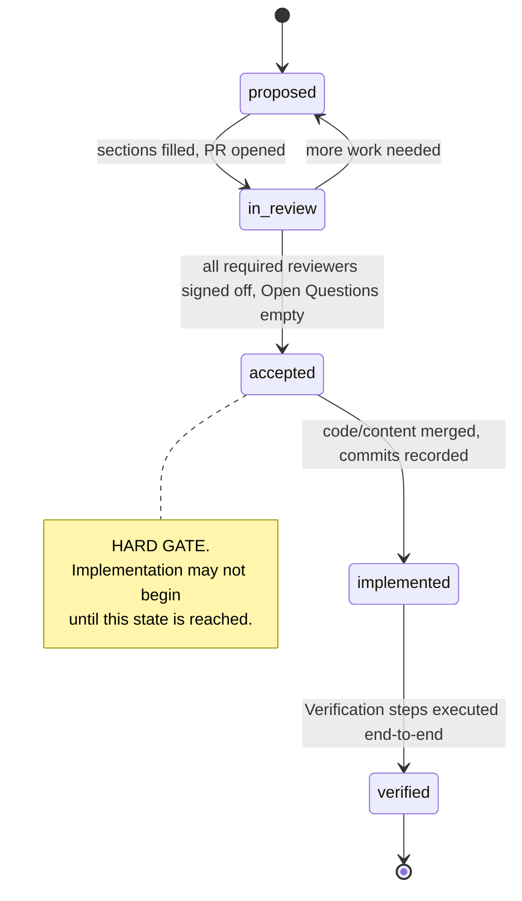

# Spec Process

## Public Summary

Mongoose is built spec-first. Every change to mongoose — code, identity, or process — begins as a spec in `/specs/`. A spec moves through five statuses: `proposed`, `in-review`, `accepted`, `implemented`, `verified`. Implementation may not begin until the spec reaches `accepted`. Specs are also the single source of truth for mongoose's public documentation: the Docs & Identity agent generates site content by extraction from accepted specs, so engineering and docs cannot drift.

## Mental Model

A spec is a contract. The author and reviewers negotiate it during `proposed` and `in-review`. Once it reaches `accepted`, implementation is execution against a fixed contract — not redesign. Open questions are not deferred; they are resolved before acceptance.



## Goals

- Codify the spec lifecycle so every contributor follows the same path.
- Make specs implementable: every accepted spec is unambiguous, complete, and matched by a runnable test matrix.
- Make specs the single source of truth for both engineering and public docs (no drift, one input feeds two outputs).
- Keep ceremony low: one document per change, no parallel ADR system, sign-offs recorded in the spec's own front matter.
- Force resolution before code: open questions block acceptance.

## Non-Goals

- Tooling automation. Reviewer signoff and status transitions are human-driven for now; tooling can be added later under its own spec.
- Per-component process variations. The process is uniform across all spec types; only the required-reviewer set differs.
- A separate documentation system. Docs are generated from specs.

## Architecture

### Directory layout

```
specs/
├── README.md                authoring guide (entry point for contributors)
├── _template.md             canonical template; do not edit casually
├── 0000-spec-process.md     this spec
├── NNNN-<slug>.md           subsequent specs, in order
├── research/                ungated research artifacts (e.g. UX surveys)
└── superseded/              retired specs, preserved by ID with `superseded-by` populated
```

### Lifecycle

| Status | Meaning | Entry condition |
|---|---|---|
| `proposed` | Draft. Sections may be incomplete. | Author creates the file from `_template.md`. |
| `in-review` | All required sections filled. Reviewers reviewing. Open Questions being resolved. | Owner sets status, opens PR. |
| `accepted` | All required reviewers have signed off. Open Questions empty. | Owner sets status after final required signoff. |
| `implemented` | Code/content has merged. | Owner sets status, populates `implementing-commits`. |
| `verified` | `## Verification` executed end-to-end with matching outcome. | Owner sets status, populates `verified-at`. |

### Sign-off matrix

A spec moves to `accepted` only when every required reviewer for its type has been added to `reviewers:` with a `signed-off-at` timestamp. Optional reviewers are added when their domain is touched.

| Spec type | Required reviewers | Optional reviewers (touched-when) |
|---|---|---|
| Identity / brand / voice | Magpie (owner), Otter | Octopus (if user research informs it) |
| SDK architecture / cross-cutting | Otter (owner), Lynx, Falcon | Magpie (if naming or voice changes), Octopus |
| Component (CLI, mock, httpmock, sandbox, primitives) | Otter (owner), Lynx, Falcon | Magpie (if exported names or user-facing strings change), Octopus (if UX-shaped) |
| Testing infrastructure (mocks, transport, sandbox harness) | Lynx (owner), Otter, Falcon | — |
| Process / governance change (this category) | Otter (owner), Magpie | All other agents on request |
| Research artifact (lives in `research/`) | Owner only — no gate | Anyone |

### Open-questions rule

A spec's `## Open Questions` section must be empty before the spec moves to `accepted`. Reviewers explicitly check this. If a question cannot be resolved, the spec is split: the resolvable portion proceeds; the open portion becomes a new spec or is deferred with an explicit reason recorded in `## Decisions & Rationale`.

### Doc-extraction contract

Magpie generates public-facing documentation by extraction from accepted specs. The contract:

- Magpie reads only sections marked **Public** in `_template.md` plus any section listed in the front-matter `docs-extract`.
- Section headings are stable anchors. Renaming or reordering them is itself a process change requiring a spec.
- API signatures and doc comments are extracted verbatim — Magpie does not paraphrase.
- Fenced ```go blocks in `## Examples` are transcluded verbatim — Magpie may add surrounding prose but does not edit the code.
- If Magpie cannot produce a quality public page from a spec, the fix is to update the spec, not to write docs creatively. Otter's review explicitly checks this question.

## Schema

The canonical YAML front-matter schema, formalized:

```yaml
id: <integer, zero-padded to 4 digits in filename, e.g. 0042>
title: <string>
slug: <kebab-case-string, must match the filename>
status: <enum: proposed | in-review | accepted | implemented | verified>
owner-agent: <enum: otter | magpie | lynx | gopher | octopus | falcon>
created: <ISO date YYYY-MM-DD>
last-updated: <ISO date YYYY-MM-DD>
supersedes: <list of integer spec IDs, may be empty>
superseded-by: <integer spec ID or null>
reviewers:
  - agent: <agent name>
    required: <bool>
    signed-off-at: <ISO datetime, or null until signoff>
implementing-commits: <list of commit hashes, may be empty>
verified-at: <ISO datetime, or null until verified>
docs-extract:
  - <section slug from the body, e.g. public-summary, mental-model, api, examples, faq>
```

Invariants:
- `status: accepted` ⇒ every reviewer with `required: true` has a non-null `signed-off-at`.
- `status: accepted` ⇒ the `## Open Questions` section in the body is empty.
- `status: implemented` ⇒ `implementing-commits` is non-empty.
- `status: verified` ⇒ `verified-at` is non-null.
- A spec listed in another spec's `supersedes:` must have `superseded-by:` set to the superseding spec's ID and live under `specs/superseded/`.

## API

N/A. This spec produces no Go API.

## Examples

### Authoring a stub spec

```sh
# From the repo root, find the next free ID.
ls specs/ | grep -E '^[0-9]{4}-' | sort | tail -1
# Suppose this prints `0002-sdk-shape.md`. Next ID is 0003.

# Copy the template.
cp specs/_template.md specs/0003-config-layering.md

# Edit the front matter and body in your editor of choice.
# When ready, set status: in-review, open a PR.
```

### Reviewer signoff

A reviewer satisfied with the spec edits the front matter:

```yaml
reviewers:
  - agent: otter
    required: true
    signed-off-at: 2026-05-15T14:22:00Z   # was null
  - agent: lynx
    required: true
    signed-off-at: null
  - agent: falcon
    required: true
    signed-off-at: null
```

When the last required `signed-off-at` is non-null **and** `## Open Questions` is empty, the owner moves the spec to `accepted`.

## Test Matrix

The "tests" for this spec are conformance checks on every spec we author. Tooling for these may come later under its own spec; for now they are reviewer responsibilities.

| Scenario | Input | Expected | Covered by |
|---|---|---|---|
| Spec missing required section | Spec at `in-review` lacks `## Test Matrix` | Reviewer rejects, returns to `proposed` | Reviewer checklist |
| Open Questions non-empty at acceptance | Spec at `in-review` has non-empty `## Open Questions` | Owner cannot move to `accepted`; spec stays in review or is split | Reviewer checklist |
| Required reviewer missing signoff | Spec at `in-review` has a required reviewer with `signed-off-at: null` | Owner cannot move to `accepted` | Reviewer checklist |
| Section header renamed | Spec uses `## Summary` instead of `## Public Summary` | Reviewer rejects: section anchors are stable; rename requires its own process spec | Reviewer checklist |
| Code added before spec accepted | PR opens code changes referencing a spec at `in-review` | Reviewer blocks merge until spec reaches `accepted` | Reviewer checklist |
| Docs authored detached from spec | PR adds public site content with no source spec section | Reviewer rejects: docs must be derived from a spec | Magpie review |

## Dependency Justification

Empty. This spec adds no Go dependencies.

| Module | Version | License | Last release | Maintainers | Alternatives considered | Why we can't roll our own |
|---|---|---|---|---|---|---|
|  |  |  |  |  |  |  |

## Security & Supply-Chain Notes

Confidential information must not be placed in spec files. Specs feed the public site, so anything written here is public by intent. If confidential discussion is required during the design of a spec, it lives in a private channel and is summarized non-confidentially in `## Decisions & Rationale`.

No untrusted input is handled by this spec.

## FAQ

**Why no separate ADR system?**
Decisions that don't justify a full spec are folded into the most relevant spec's `## Decisions & Rationale` section. Lower ceremony. If the practice proves cumbersome, splitting into a parallel ADR system is itself a process spec away.

**Why isn't research gated?**
Research is exploratory by nature. Gating it would slow the inputs that improve gated specs. Research artifacts in `specs/research/` may be cited by gated specs, but they do not themselves require sign-off.

**What if I disagree with a sign-off (or lack of one)?**
Disagreement is recorded in the spec's `## Decisions & Rationale` section with the disagreeing reviewer's reasoning. If the owner and reviewers cannot reach consensus, the spec stays in `in-review` until they do, or it is withdrawn. There is no override mechanism.

**Can a spec be authored and accepted in a single PR?**
Yes — for trivial cases. The spec, all required reviewer sign-offs, and the implementation may all land in one PR, provided every required reviewer signs off in the front matter and every other rule is honored. The lifecycle is conceptual, not necessarily commit-by-commit.

**What if the implementation reveals a flaw in the spec?**
Stop coding. Open a PR that updates the spec (returning it to `in-review` for the affected sections), get the required reviewers' new sign-off, then resume. Implementation may not deviate from an `accepted` spec.

**How do I supersede an accepted spec?**
Author a new spec that lists the old spec ID in `supersedes:`. When the new spec reaches `accepted`, move the old spec file to `specs/superseded/` and set its `superseded-by:` to the new spec's ID. The old ID is never reused.

## Decisions & Rationale

The decisions codified here trace to mongoose's lifecycle bootstrap (committed alongside this spec). Each is recorded with its rationale.

- **Spec-first hard gate.** Specs are the design contract; code is execution. Without the gate, the contract drifts and post-hoc design decisions accrete.
- **Specs as source of truth for docs.** Eliminates engineering/docs drift. Docs become a derived artifact, with the spec as the single authoritative source.
- **Markdown + YAML front matter format.** Markdown is friendly to PR review and GitHub rendering. YAML front matter is machine-parseable for doc extraction and review tooling, without requiring custom format support up front.
- **Reviewer signoff in front matter, not in a parallel log.** Lightweight; the audit trail lives in git history alongside the spec; no synchronization between systems.
- **No separate ADR system.** Lower ceremony. Decisions fold into specs. Splitting later is reversible; starting with two systems and merging later is not.
- **Plans (the meta-artifact above specs) must be exhaustive and fully resolved.** Per the project rule: plans are executable contracts, not discussion documents. Open questions in plans propagate ambiguity into specs.
- **Open Questions block acceptance.** Same rationale, applied to specs.
- **Stable section anchors.** Doc extraction by Magpie depends on header stability. Reordering or renaming headers is a governance change requiring its own spec.
- **Zero-padded four-digit IDs, never reused.** Stable identifiers; the historical record is preserved instead of overwritten. Four digits gives 10,000 slots — enough that running out is not a near-term concern.
- **Research artifacts ungated.** Surveys, comparisons, and exploratory writing improve gated specs and should not themselves block on architecture review.

## Open Questions

None. Every question raised during this spec's design has been resolved and folded into the sections above.

## Verification

The spec process is verified by the bootstrap commit and ongoing operation:

1. **Layout:** `tree mongoose/` shows `CLAUDE.md`, `.claude/agents/{otter,magpie,lynx,gopher,octopus,falcon}.md`, `specs/{README.md,_template.md,0000-spec-process.md,research/,superseded/}`.
2. **Front matter:** This spec's front matter parses as valid YAML; both required reviewers have non-null `signed-off-at`; `## Open Questions` is empty.
3. **Authoring walkthrough:** A new contributor follows `specs/README.md` and produces a stub spec from `_template.md` without further guidance.
4. **CLAUDE.md coherence:** A fresh Claude Code session opened in the repo and asked "what are the rules here?" returns a coherent answer derived from `CLAUDE.md`.
5. **Doc extraction sanity:** The sections marked **Public** in this spec (`Public Summary`, `Mental Model`, `FAQ`) read as user-facing prose suitable for the public site without further editing.
