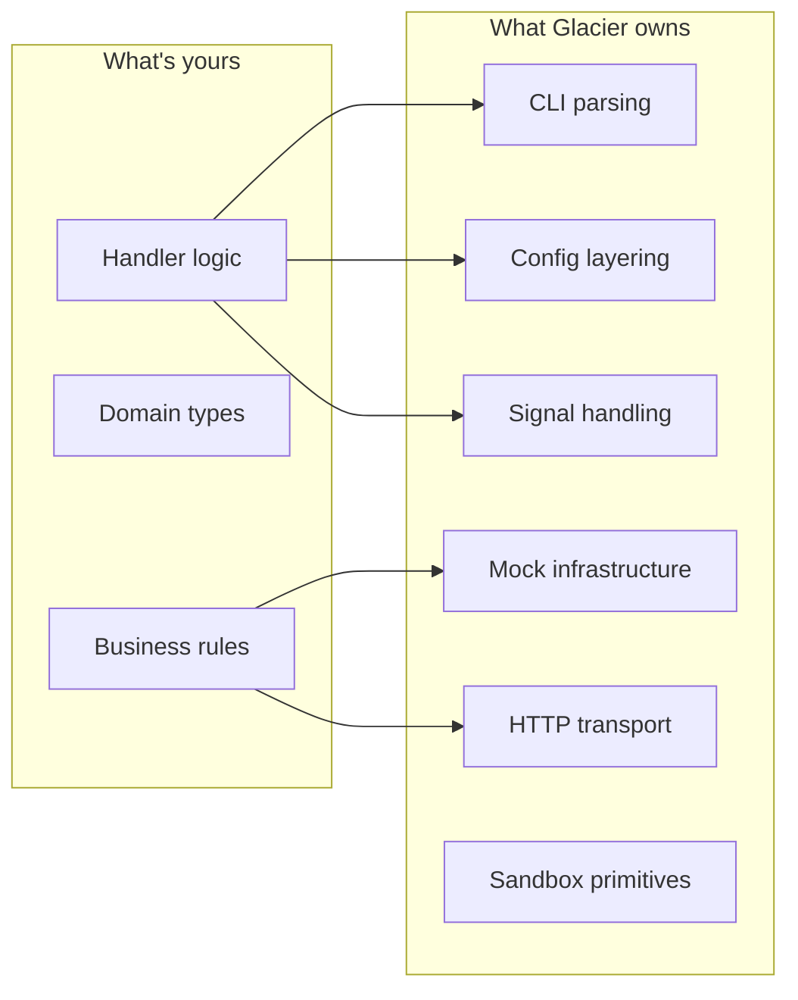

# Brand Identity

## Public Summary

Glacier is a Go framework that handles the plumbing so you can focus on what's yours. Like a glacier that shapes the landscape beneath the surface, Glacier is stable, deep, and predictable about the messy parts: argument parsing, configuration layering, lifecycle and signal handling, mock-driven testing, and HTTP transport faking. You write the logic. Glacier handles the rest.

## Mental Model

The mental model is a single sharp line: code unique to your problem stays on your side; everything generic stays on Glacier's side. You never write your own flag parser. You never invent your own config-layering rules. You never hand-roll a mock for an interface you control. When the boundary feels wrong :  when something that *feels* generic is on your side, or something that *feels* unique is on Glacier's side :  that's a spec to file.



## Goals

- Define the canonical name story, voice, and tone of Glacier.
- Lock the ASCII logo (banner + wordmark) as committed bytes in `assets/logo/`.
- Lock the color palette as a semantic token system grounded in meaningful color theory.
- Lock the typography pairing for the public site.
- Codify Go and CLI naming conventions referenced by every later spec.
- Codify error-message conventions across the library and CLI registers.
- Articulate the Promise :  the four user-facing feel-statements every component spec is tested against.

## Non-Goals

- The public site implementation. That gets its own spec when the site is built.
- Light-mode color tokens. Derived from the dark tokens at site-spec time.
- Localization or translation policy. Deferred to a future spec.
- Branded merchandise, social-media cards, or external assets beyond the repo. Out of scope.
- The CLI module's actual API. That lives in spec 0002 (framework shape) and the CLI component spec that follows.

## Architecture

Identity is a taxonomy and a surface map, not a code architecture.

**Taxonomy** :  five identity layers, each owned by a specific artifact in the repo:

| Layer                    | Owned by                            | Surface                                                          |
| ------------------------ | ----------------------------------- | ---------------------------------------------------------------- |
| Voice & tone             | This spec                           | All prose: README, site, doc-comments, error messages, help text |
| Visual identity          | This spec; art under `assets/logo/` | ASCII logo, palette tokens, typography                           |
| Naming conventions (Go)  | This spec                           | Every package, type, function, error, interface in the framework |
| Naming conventions (CLI) | This spec                           | Every CLI verb, flag, subcommand emitted by the CLI module       |
| The Promise              | This spec                           | Acceptance criterion for every component spec                    |
| User-mascot library      | This spec; art under `cmd/glacier/internal/mascots/` | Six mascots (`polar_bear`, `penguin`, `owl`, `fox`, `otter`, `raccoon`), each in two forms (kaomoji + 5-line block-character banner). User-facing scaffold library only; distinct from Glacier's own polar-bear identity. Added by spec 0032 (Amendment B). |

**Surface map** :  where each identity element appears:

```
README.md                  → banner ASCII + tagline + Public Summary (extracted by Magpie)
public site (future)       → all five identity layers
specs/_template.md         → none (template is structural; identity applies inside spec content)
.claude/agents/*.md        → voice & tone (so agents speak in Glacier's register)
glacier --version          → wordmark + tagline (rendered via the CLI module's banner feature, per dogfooding)
glacier --help (CLI mod)   → CLI naming + help-text style
package godoc              → Go naming + voice
error.Error() throughout   → library error-message style
CLI error output           → CLI error-message style
```

## Schema

This spec introduces no Go types. The "schema" of the identity is the semantic-token table for color, the typography table, and the naming-convention tables :  all under `## Examples` below, since they are also the most useful didactic content.

## API

N/A :  this spec introduces no Go API. The CLI module spec (later) will introduce APIs governed by the naming conventions defined here.

## Examples

### Banner ASCII (canonical)

The banner pairs a small block-character polar bear mascot ("Glacier the Bear") with the GLACIER wordmark. Committed verbatim to `assets/logo/banner.txt` and reproduced here:

```text
                           ██████╗ ██╗      █████╗  ██████╗███████╗███████╗██████╗
    ▟▀▙   ▟▀▙          ██╔════╝ ██║     ██╔══██╗██╔════╝╚═██╔══╝██╔════╝██╔══██╗
   ▟███████████▙        ██║  ███╗██║     ███████║██║       ██║   █████╗  ██████╔╝
   █   ●     ●  █        ██║   ██║██║     ██╔══██║██║       ██║   ██╔══╝  ██╔══██╗
   █      ▼     █        ╚██████╔╝███████╗██║  ██║╚██████╗███████╗███████╗██║  ██║
    ▀▀▀▀▀▀▀▀▀▀▀▀          ╚═════╝ ╚══════╝╚═╝  ╚═╝ ╚═════╝╚══════╝╚══════╝╚═╝  ╚═╝
                                    Less plumbing. More Go.
```

The mascot is "Glacier the Bear" (D44): Variant A wide-and-friendly polar bear, 5 lines × ~14 cols, drawn in block characters (`▟ ▀ ▙ █ ● ▼`). Block characters render cleanly in any monospace terminal; the 5-line form aligns with the wordmark's 6-line height (one line of leading at top). The wordmark uses ANSI Shadow style with Unicode box-drawing characters; the I letterform uses a serif variant (8 chars wide) for legibility between adjacent letters. The tagline sits centered beneath the wordmark.

Mascot tiny form (D43): `ʕ•ᴥ•ʔ` :  single-line kaomoji used for prompt prefixes, status bars, and inline references in docs and CLI output.

### Compact wordmark (canonical)

The compact wordmark is wordmark + tagline only :  no mascot. It's the form rendered by `glacier --version`. Committed verbatim to `assets/logo/wordmark.txt`:

```text
 ██████╗ ██╗      █████╗  ██████╗███████╗███████╗██████╗
██╔════╝ ██║     ██╔══██╗██╔════╝╚═██╔══╝██╔════╝██╔══██╗
██║  ███╗██║     ███████║██║       ██║   █████╗  ██████╔╝
██║   ██║██║     ██╔══██║██║       ██║   ██╔══╝  ██╔══██╗
╚██████╔╝███████╗██║  ██║╚██████╗███████╗███████╗██║  ██║
 ╚═════╝ ╚══════╝╚═╝  ╚═╝ ╚═════╝╚══════╝╚══════╝╚═╝  ╚═╝
                Less plumbing. More Go.
```

**Wordmark gradient (D41).** When rendered on a TTY, the wordmark is emitted with a vertical 6-stop ice gradient via 24-bit ANSI SGR escapes (`\x1b[38;2;R;G;Bm`):

| Line | Color              | Token           | Hex       |
| ---- | ------------------ | --------------- | --------- |
| 1    | Sun-bleached frost | `--mg-cyan-100` | `#A5F3FC` |
| 2    | Light cyan         | `--mg-info`     | `#67E8F9` |
| 3    | Primary cyan       | `--mg-cyan`     | `#22D3EE` |
| 4    | Deeper cyan        | `--mg-cyan-700` | `#0891B2` |
| 5    | Teal               | `--mg-teal`     | `#2DD4BF` |
| 6    | Deep glacial teal  | `--mg-teal-700` | `#0D9488` |

The raw `assets/logo/wordmark.txt` file remains plain ASCII/Unicode box-drawing so non-color contexts (CI logs, GitHub README previews, dumb terminals) render legibly. The gradient is applied at render time by the CLI's banner-render feature.

### Color palette (canonical hex, with role)

The palette is dark-first. Each token is bound to a role; colors are never used decoratively.

| Token             | Hex       | Role                        | When used                                                                                |
| ----------------- | --------- | --------------------------- | ---------------------------------------------------------------------------------------- |
| `--mg-bg`         | `#0E1116` | Page background             | Default canvas                                                                           |
| `--mg-surface`    | `#161B22` | Elevated surface            | Cards, code blocks, panels                                                               |
| `--mg-surface-2`  | `#1F262E` | Hovered or focused surface  | Hover, focus, active state                                                               |
| `--mg-text`       | `#E6EDF3` | Primary text                | Body copy, headings                                                                      |
| `--mg-text-muted` | `#8B949E` | Secondary text              | Captions, metadata, secondary labels                                                     |
| `--mg-text-faint` | `#6E7681` | Tertiary text               | Disabled, deemphasized                                                                   |
| `--mg-cyan`       | `#22D3EE` | Primary accent              | Links, primary CTAs, brand emphasis; wordmark gradient line 3                            |
| `--mg-teal`       | `#2DD4BF` | Secondary accent            | Hover states, secondary CTAs; wordmark gradient line 5                                   |
| `--mg-success`    | `#4ADE80` | Success state               | Pass, confirm, ready                                                                     |
| `--mg-warning`    | `#FBBF24` | Caution state               | Pending, deprecation, soft alert                                                         |
| `--mg-error`      | `#F87171` | Failure state               | Fail, destructive, error output                                                          |
| `--mg-info`       | `#7DD3FC` | Neutral info; gradient stop | Notes, hints, tooltips; wordmark gradient line 2                                         |
| `--mg-border`     | `#30363D` | Hairlines                   | Dividers, table borders                                                                  |
| `--mg-cyan-100`   | `#A5F3FC` | Gradient stop (lightest)    | Top of the GLACIER wordmark gradient; sun-bleached frost. Reserved outside the wordmark. |
| `--mg-cyan-700`   | `#0891B2` | Gradient stop (mid-deep)    | Wordmark gradient line 4; reserved for deeper cyan needs.                                |
| `--mg-teal-700`   | `#0D9488` | Gradient stop (deepest)     | Wordmark gradient line 6; reserved for deep teal accents.                                |

**Color theory.** The palette is cool-on-cool: cyan and teal accents on a near-black background. To prevent the cold, sterile look of pure cyan-on-black, the primary text token is a *warm* off-white (`#E6EDF3`, with slight pink-yellow lift). State colors (success, warning, error, info) are deliberately desaturated relative to the brand accents so they don't compete when shown alongside. Cyan (`#22D3EE`) and teal (`#2DD4BF`) are split-complementary within the cool spectrum :  enough variation to distinguish primary from secondary without fighting each other. Contrast: `--mg-text` on `--mg-bg` is 15.9:1 (AAA, well above 7:1); `--mg-cyan` on `--mg-bg` is 9.6:1 (AAA). Every token meets WCAG AA at minimum.

The three gradient tokens (`--mg-cyan-100`, `--mg-cyan-700`, `--mg-teal-700`) are bound to their gradient-stop role. Use outside the wordmark gradient requires future-spec justification.

### Typography pairing (canonical)

| Use                | Family         | Weights       | Source                      |
| ------------------ | -------------- | ------------- | --------------------------- |
| Display / headings | Space Grotesk  | 500, 700      | rsms.me, SIL OFL            |
| Body / UI          | Inter          | 400, 500, 600 | rsms.me, SIL OFL            |
| Code               | JetBrains Mono | 400, 700      | jetbrains.com/mono, SIL OFL |

All three are vendored when the public site lands :  never CDN-loaded. The site spec will commit the actual font files.

### Sample Go following the conventions

```go
// Package cli builds production-ready command-line interfaces from idiomatic handler functions.
package cli

import (
	"context"
	"errors"
)

// ErrCancelled is returned when a command is interrupted by a signal before completion.
var ErrCancelled = errors.New("cli: command cancelled")

// ParseError is returned when an argument or flag fails to parse. It wraps the original
// parser error and identifies the offending argument by name.
type ParseError struct {
	Arg string
	Err error
}

// Error implements error. The format is "cli: parse <arg>: <cause>": lowercase, no
// trailing punctuation, per Glacier library-error conventions.
func (e *ParseError) Error() string { return "cli: parse " + e.Arg + ": " + e.Err.Error() }

// Unwrap supports errors.Is and errors.As traversal.
func (e *ParseError) Unwrap() error { return e.Err }

// Runner runs a parsed command tree to completion. Implementations must respect ctx
// cancellation: when ctx is done, Run returns ctx.Err() wrapped in ErrCancelled.
type Runner interface {
	Run(ctx context.Context) error
}
```

This block demonstrates: package-name idiom (single short word, lowercase, no underscores); no-stutter exported type names; `Err<Cause>` sentinel; `<Cause>Error` typed error; canonical error-message format; `Unwrap` for `errors.Is`/`As`; single-method `Runner` interface with `<Verb>er` naming; `ctx context.Context` first parameter on a cancellable function; doc comments starting with the symbol name.

### Sample CLI invocations following the conventions

```text
$ glacier serve --port 8080 --enable-metrics --quiet
$ glacier build --output ./dist
$ glacier init my-project
$ glacier --help
```

Verbs are imperative and lowercase. Flags use `--long-kebab-case`. Boolean flags use the `--enable-x` / `--disable-x` form, never `--x=true`. Short flags exist only for the most common operations.

A CLI error follows the user-facing register :  capitalized, problem + cause + actionable next step, ends with a period:

```text
Error: Cannot bind to port 8080: address already in use.
       Try a different port with --port, or stop the process holding 8080.
```

The same condition surfaced as a *library* error to a Go caller follows the library register :  lowercase, no trailing punctuation, `package: action: cause`:

```go
err := server.Listen(ctx, ":8080")
// err.Error() == "cli: serve: bind tcp :8080: address already in use"
```

Two registers, two audiences, one underlying condition.

### Naming convention reference (Go)

| Element                 | Convention                                                                             | Example                                        |
| ----------------------- | -------------------------------------------------------------------------------------- | ---------------------------------------------- |
| Package name            | short, lowercase, single word, no underscores; no plural unless genuinely a collection | `cli`, `mock`, `httpmock`, `sandbox`, `config` |
| Exported type           | PascalCase, no stutter (`cli.Command`, never `cli.CLICommand`)                         | `Command`, `Builder`, `Mock`                   |
| Function                | PascalCase; verb-first for actions; noun-only for accessors (no `Get` prefix)          | `Run(ctx)`, `Build()`, `Name()`                |
| Sentinel error          | `Err<Cause>`                                                                           | `ErrCancelled`, `ErrInvalidConfig`             |
| Typed error             | `<Cause>Error`, with `Unwrap`                                                          | `ParseError`, `ValidationError`                |
| Single-method interface | `<Verb>er`                                                                             | `Reader`, `Builder`, `Closer`                  |
| Multi-method interface  | descriptive noun                                                                       | `Command`, `Transport`                         |
| Doc comment             | full sentences, start with the symbol name                                             | `// Command represents a parsed command tree.` |
| Cancellable function    | `ctx context.Context` first parameter                                                  | `func Run(ctx context.Context) error`          |

### Naming convention reference (CLI)

| Element            | Convention                                                 | Example                                                        |
| ------------------ | ---------------------------------------------------------- | -------------------------------------------------------------- |
| Verb               | imperative mood, lowercase, single word preferred          | `build`, `run`, `init`, `serve`                                |
| Subcommand nesting | flat preferred; two-level max                              | `glacier mock generate`, not `glacier tools mock generate new` |
| Long flag          | `--long-kebab-case`                                        | `--enable-metrics`, `--output-dir`                             |
| Short flag         | only for the most common operations                        | `-h` (`--help`), `-v` (`--version`), `-q` (`--quiet`)          |
| Boolean flag       | `--enable-x` / `--disable-x`                               | `--enable-metrics`, never `--metrics=true`                     |
| Help summary       | starts capitalized, ends with period, max 80 cols          | `Build a project for production.`                              |
| Error output       | capitalized, problem + cause + next step, ends with period | (see CLI error example above)                                  |

### The Promise

When a developer uses Glacier, they should be able to say each of these truthfully:

1. *"I'm only writing what's mine."*
2. *"I trust the defaults."*
3. *"The error tells me what to do next."*
4. *"Tests are easy because the framework helps."*

Every component spec :  CLI, mocks, HTTP transport, sandbox, primitives :  is reviewed against these four statements. If the design doesn't deliver them, the design is wrong.

## Test Matrix

| Scenario                        | Input                                                                              | Expected                                                                                  | Covered by                                                                                  |
| ------------------------------- | ---------------------------------------------------------------------------------- | ----------------------------------------------------------------------------------------- | ------------------------------------------------------------------------------------------- |
| Banner ASCII rendering          | `cat assets/logo/banner.txt` in any modern monospace terminal                      | Renders identically to the canonical bytes above                                          | Visual review during spec verification                                                      |
| Wordmark ASCII rendering        | `cat assets/logo/wordmark.txt` in any modern monospace terminal                    | Renders identically to the canonical bytes above                                          | Visual review during spec verification                                                      |
| Mascot block-character purity   | Inspect mascot region (lines 1–6, cols 1–18 of `banner.txt`) for unexpected chars  | Only block characters (`▟ ▀ ▙ █ ● ▼`) and spaces appear in the mascot region              | Visual review during spec verification                                                      |
| Color contrast (AA)             | Each text token vs `--mg-bg` and `--mg-surface`                                    | ≥ 4.5:1 for text, ≥ 3:1 for non-text                                                      | Manual computation captured in §Examples; re-verified by site spec                          |
| Go naming convention adherence  | Any package introduced by any later spec                                           | Conventions in the Go reference table apply                                               | Reviewer checklist on every component-spec PR                                               |
| CLI naming convention adherence | Any CLI verb or flag introduced by any later spec                                  | Conventions in the CLI reference table apply                                              | Reviewer checklist on the CLI module spec and downstream                                    |
| Error-message register          | Every `error.Error()` and CLI error output in the codebase                         | Library register lowercase no-trailing-period; CLI register capitalized period actionable | Reviewer checklist; example assertions added to CLI module test suite when the module ships |
| Voice / no-superlatives         | Any committed prose under `README.md`, `specs/`, `.claude/agents/`, future `site/` | Zero occurrences of "blazing", "revolutionary", "best-in-class", "amazing", "seamless"    | grep audit run during this spec's verification; later: optional CI lint                     |
| Promise satisfaction            | Every component spec                                                               | The component lets a developer say each of the four Promise statements truthfully         | Reviewer checklist (Magpie + Otter on every component spec)                                 |
| Dogfooding                      | Any new public feature in the CLI module (when the module ships)                   | The feature is exercised by at least one glacier CLI command                              | Reviewer checklist; Lynx test matrix on the CLI module spec                                 |

## Dependency Justification

Empty.

| Module | Version | License | Last release | Maintainers | Alternatives | Why we can't roll our own |
| ------ | ------- | ------- | ------------ | ----------- | ------------ | ------------------------- |
|        |         |         |              |             |              |                           |

Fonts on the eventual public site are vendored, not Go dependencies; their justification lives in the site spec.

## Security & Supply-Chain Notes

- No untrusted input is handled by the artifacts of this spec.
- The ASCII-art logo files contain no secrets and are safe to commit publicly.
- When the public site is built, the typography vendoring decision (vendored vs. CDN) lands under the site spec's security review. The decision is pre-committed in this spec's Decisions & Rationale: vendored only.

## Migration & Compatibility

N/A. This is the first identity spec; nothing to migrate from.

### Amendment log: inbound from spec 0032 (SDK)

Spec 0032 (Glacier SDK CLI binary; accepted 2026-05-03) admits a new asset class to this spec: a curated **user-mascot library** scoped to user projects scaffolded by `glacier init`. The library is recorded as a sixth row in the taxonomy table under `## Architecture`. Key constraints:

- The Glacier identity remains the polar bear. Every framework asset (`banner.txt`, README, public site hero) continues to use the polar bear (D5, D44). The non-polar-bear mascots in this library do not appear on Glacier-branded surfaces.
- The library lives at `cmd/glacier/internal/mascots/` and ships six mascots: `polar_bear`, `penguin`, `owl`, `fox`, `otter`, `raccoon`. It exists to let user projects pick a mascot for their own scaffold.
- Each non-polar-bear mascot ships in two forms: a kaomoji single-line and a 5-line block-character banner form. Both authored by Magpie under this spec's brand discipline (block-character purity per the verification table; kaomoji styling per D43 / D45).
- Magpie signs off on each mascot's render under the existing voice / visual rules.
- Any extension of the library (new mascots, new forms, new placements outside scaffolded user projects) is itself a spec amendment requiring Magpie + Otter sign-off.

The amendment narrows, rather than broadens, the `## Non-Goals` exclusion of "external assets beyond the repo" by carving out a single tooling-asset class confined to the scaffold path. Tracked in spec 0032 §Migration & Compatibility (Amendment B) and D-S38.

## FAQ

**Why is the project named "Glacier"?**
Because a glacier is a keeper of geological time :  stable, deep, and shaped by forces that move slowly and surely. That maps directly to all four Promises: the stable foundation you trust the defaults on; the iceberg-principle depth that keeps only what's yours visible at the surface; the frozen determinism that makes tests easy; the predictable flow that tells you what to do next. The marketing abbreviation **GDK** doubles as Glacier Development Kit *and* Go Development Kit.

**Why dark-first?**
Glacier is a developer tool. Most developers live in dark terminals and dark IDEs. A dark-first identity is native to the environment the framework runs in. Light mode will be defined by the site spec when the site is built; dark is the source of truth.

**Why these specific naming conventions?**
They're not bespoke :  they're Effective Go and the Go standard library, codified in one place so contributors and agents have a single canonical reference. Glacier has zero novel naming conventions.

**Can I theme the CLI output?**
Yes :  when the CLI module spec lands, the palette tokens will be exposed as terminal-color overrides. Default behavior uses the dark-first cyan/teal palette; users can set `GLACIER_NO_COLOR=1` to disable, or override individual tokens via env vars.

**Why ban superlatives?**
Because "blazing fast" doesn't tell a developer anything. "Parses 50,000 flags per second on an M2 Air" does. The ban forces specifics. Specifics are what make documentation useful.

**Why two ASCII-logo variants instead of one?**
Because `--version` output is a tight context (one or two terminal screens) and a full banner with a mascot would dominate it. The compact wordmark fits gracefully there. The full banner has room to breathe in the README header and the site hero.

**Does Glacier's own CLI use the Glacier CLI module?**
Yes :  it must. Glacier ships a `glacier` CLI binary built entirely with its own CLI module. Anywhere the banner is rendered at runtime :  `glacier --version`, welcome screens, error contexts :  that rendering goes through the CLI module's banner feature, never via bespoke code. If the CLI module can't render the banner correctly, that's a bug in the CLI module, surfaced immediately by Glacier's own tooling. Dogfooding is the project's strongest credibility signal.

## Decisions & Rationale

This spec was authored from a fully-resolved plan. Each decision is recorded with its rationale.

- **D1 :  Name angle: the keeper.** The Glacier-as-keeper framing maps cleanly to the framework's promise and avoids competitor framing (which is forbidden by the bootstrap).
- **D2 :  Tagline: "Less plumbing. More Go."** Two short noun phrases, strong rhythm, says exactly what the framework does.
- **D3 :  Two ASCII logo variants.** Banner for spacious contexts (README, site hero), compact wordmark for tight contexts (`--version`).
- **D4 :  Wordmark style: ANSI Shadow.** High visual weight; renders identically in any modern monospace terminal.
- **D5 :  Mascot: "Glacier the Bear."** Variant A wide-and-friendly polar bear in block characters (`▟ ▀ ▙ █ ● ▼`); 5 lines × ~14 cols. Block characters render cleanly in any monospace terminal; the 5-line form aligns with the wordmark's 6-line height.
- **D6 :  Palette: dark-first cyan/teal accents, encoded as semantic tokens.** Each token bound to a role, never used decoratively. Light-mode tokens deferred to the site spec.
- **D7 :  Typography: Inter, Space Grotesk, JetBrains Mono.** Open-source, performant, dev-tool-native, complementary personalities.
- **D8 :  Go naming conventions.** Effective Go and the standard library, codified here as the single canonical reference.
- **D9 :  CLI naming conventions.** Patterns developers expect from `git`, `kubectl`, `cargo`. POSIX/GNU long-option compatible.
- **D10 :  Error-message conventions, two registers.** Library errors and CLI errors serve different audiences; consistent style within each.
- **D11 :  Voice & tone.** Direct, second person, examples-first, honest about tradeoffs, no superlatives. The ban on superlatives forces specifics.
- **D12 :  The Promise.** Four developer-feel statements that every component spec is reviewed against. The user-facing translation of the mission.
- **D13 :  Logo art committed as plaintext under `assets/logo/`.** Single source of truth; no regeneration at build time. Future CLI module embeds via `//go:embed`.
- **D14 :  Identity adds zero Go dependencies.** Fonts are vendored when the site is built, not loaded from a third-party CDN.
- **D15 :  Dogfooding is a project commitment.** Glacier ships a `glacier` CLI binary built with its own CLI module. The brand-identity assets are consumed by that binary via the CLI module's banner feature; bespoke rendering is forbidden.
- **D37 :  Project name: Glacier.** Capital G in prose; lowercase in import paths (`github.com/nathanbrophy/glacier`) and identifiers. The "mongoose" name and original mascot are retired.
- **D40 :  Wordmark: "GLACIER" in ANSI Shadow style.** 6 lines × ~52 cols. The I letterform uses a serif variant (8 chars wide) for legibility between adjacent letters.
- **D41 :  Wordmark vertical 6-stop ice gradient.** Applied at render time via 24-bit ANSI SGR escapes; raw file remains plain ASCII for universal compatibility.
- **D42 :  Three new palette tokens.** `--mg-cyan-100`, `--mg-cyan-700`, `--mg-teal-700` added as gradient stops; each bound to a role per spec-0001 color rules.
- **D43 :  Mascot tiny form: `ʕ•ᴥ•ʔ` kaomoji.** Single-line; used for prompt prefixes, status bars, inline references.
- **D44 :  Mascot banner form: "Glacier the Bear."** Variant A wide-and-friendly polar bear, 5 lines × ~14 cols, block characters.
- **D45 :  Expression-shifting mascot for state cues.** Calm `ʕ•ᴥ•ʔ` (INFO/DEBUG); Confident `ʕ⌐■-■ʔ` (NOTICE); Thinking `ʕ•_•ʔ`; Alarmed `ʕ◉_◉ʔ` (WARN); Error `ʕ× ×ʔ`.

## Open Questions

None. Every question raised during the design conversation is resolved in Decisions & Rationale above.

## Verification

Run, in order:

1. Open `assets/logo/banner.txt` and `assets/logo/wordmark.txt` in a modern monospace terminal (Windows Terminal, iTerm2, Alacritty, gnome-terminal, etc.). Confirm rendering matches the bytes in `## Examples` byte-for-byte.
2. Confirm the mascot region of `banner.txt` renders as the polar bear in block characters (`▟ ▀ ▙ █ ● ▼`).
3. Confirm WCAG contrast: `--mg-text` on `--mg-bg` ≥ 7:1 (AAA), `--mg-cyan` on `--mg-bg` ≥ 4.5:1 (AAA), every other text token on `--mg-bg` ≥ 4.5:1 (AA).
4. Confirm `README.md` opens with the banner ASCII, followed by the tagline, followed by the Public Summary.
5. Search the repo for forbidden superlatives:
   ```sh
   grep -rEi 'blazing|revolutionary|best-in-class|amazing|seamless' --include='*.md' --include='*.txt' .
   ```
   Expect zero matches in committed prose.
6. Confirm Magpie's and Otter's `signed-off-at` fields in the front matter are non-null and `## Open Questions` is empty.

If any check fails, the spec returns to `in-review` and the issue is fixed before re-acceptance.
