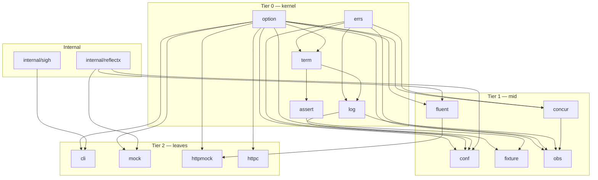

# Framework Shape

<!--
  Section headers below are STABLE ANCHORS. Magpie extracts content by header,
  so do not rename or reorder them. Doing so is a process change requiring its
  own spec.

  Sections marked **Public** are extracted by Magpie for the public site.
  Sections marked **Internal** are engineering-only and never appear in published docs.
-->

## Public Summary

<!-- **Public.** One paragraph in end-user voice. The canonical description for the site and README. -->

Glacier is a Go framework — a curated suite of consumable packages that make Go development easy and just work. A developer pulls in Glacier, writes idiomatic handler code, and gets the messy generic problems handled for them: argument parsing, configuration layering, lifecycle and signal handling, mock-driven testing, HTTP transport faking, typed HTTP client with retries, terminal-as-first-class-output, observability, structured logging, error wrapping, options propagation, concurrency primitives, sequence operators, assertions, and test fixtures. Each package stands alone. Together they are Glacier. The framework's primary artifact is the packages; the dogfooded Glacier SDK CLI binary is a demonstration shipped separately.

## Mental Model

<!-- **Public.** The conceptual frame a developer should hold while using this. Mermaid diagrams welcome. Source for the "Concepts" page on the site. -->

Glacier's coherence comes from its layering. Kernel packages are universal: every consumer of any Glacier package transitively depends on `option`, `errs`, `log`, `assert`, and `term`. Mid-tier packages are independent of each other. Leaf packages are large enough to deserve isolation: `cli`, `mock`, `httpmock`, and `httpc` may not import each other, only kernel and mid-tier. The result: any consumer can pick exactly the packages they need without dragging in unrelated leaves. The dogfooded Glacier SDK, when it ships, composes leaves at the binary level — never inside a package.



The DAG has no cycles. Forbidden edges are testable invariants enforced by a Lynx-owned layering test on every PR. Every package configurable at construction uses `option.Option[T]`; every package that emits errors uses the library error register enforced by a cross-cutting Lynx test.

## Goals

<!-- **Internal.** Bulleted list. -->

- Lock the v0 package layout: 14 packages + 2 internal helpers + 0 binaries.
- Lock the three-tier DAG and the forbidden edges (F1–F7 plus F3a/F3b/F3c).
- Lock the six cross-cutting conventions (functional options, error contract, context propagation, lifecycle, logging, naming) plus the seventh (path safety).
- Commit to zero direct application-code dependencies in v0; approve the three build-time and standards-layer deps (golang.org/x/tools, golang.org/x/sys, go.opentelemetry.io/otel set).
- Pin Go version (1.25 minimum, toolchain 1.26).
- Pin license (Apache-2.0).
- Establish the CI gate set (fmt, vet, staticcheck, vuln-scan, license-scan, test with -race, fuzz, benchstat, codegen-drift, mod-hygiene, toolchain-pin-check, sbom-generate).
- Establish the untrusted-input register (30 rows) as a living contract.
- Forward the sandbox threat-model phrasing to the eventual sandbox spec.
- Amend spec 0001 from "SDK" framing to "framework" framing.
- Commit to performance as a first-class requirement (D35) and generics-first ergonomics (D36) for every package.

## Non-Goals

<!-- **Internal.** Bulleted list. What this spec deliberately excludes. -->

- Ratifying any individual leaf package's full API. That belongs in component specs 0011 (cli), 0012 (mock), 0013 (httpmock), 0015 (httpc), 0016 (term), 0017 (obs), and the mid-tier component specs.
- Shipping the Glacier SDK CLI binary. Deferred per D6 to spec 0032.
- Sandboxing. Dropped from v0 per D38 / §23.1; deferred to spec 0018.
- Selecting YAML/TOML/HCL config formats. Deferred to spec 0023.
- Defining the release/signing pipeline. Deferred to a release spec.
- Light-mode color tokens. Deferred to the public-site spec (0031).

## Architecture

<!-- **Internal.** Mermaid diagram + prose. Package layout, data flow, lifecycle. -->

### Package tree

```
github.com/nathanbrophy/glacier/
├── go.mod                   module declaration; go 1.25.0; toolchain go1.26.0
├── go.sum                   committed; three approved direct deps + transitives
├── doc.go                   top-level package doc; the framework at-a-glance
├── LICENSE                  Apache-2.0
├── CLAUDE.md                project rules
├── README.md                public-facing entrypoint
├── assets/                  brand-identity assets
│   └── logo/
│       ├── banner.txt
│       └── wordmark.txt
├── specs/                   source-of-truth specs
│   ├── _template.md
│   ├── 0000-spec-process.md
│   ├── 0001-brand-identity.md
│   └── 0002-framework-shape.md           ← this spec
├── option/                  Option[T] + OptionFunc[T] + Apply + Validate   [Tier 0 kernel]
│   ├── option.go
│   ├── option_test.go
│   └── doc.go
├── errs/                    Wrap, Join, Chain, Sentinel, IsAny, Retryable, Coded  [Tier 0 kernel]
│   ├── errs.go
│   ├── errs_test.go
│   └── doc.go
├── log/                     slog conventions, ctx attr attachment, custom levels  [Tier 0 kernel]
│   ├── log.go
│   ├── log_test.go
│   └── doc.go
├── assert/                  test asserts + runtime Must                     [Tier 0 kernel]
│   ├── asserts.go
│   ├── must.go
│   ├── diff.go
│   ├── asserts_test.go
│   ├── must_test.go
│   └── doc.go
│   └── require/             halt-on-failure mirror of assert/
│       ├── require.go
│       └── require_test.go
├── term/                    terminal: color, glyphs, layout, prompts, animation  [Tier 0 kernel]
│   ├── term.go
│   ├── term_test.go
│   └── doc.go
├── concur/                  Mutex/RWMutex, Group, Semaphore, Pool, Once, WaitGroup  [Tier 1 mid]
│   ├── mutex.go
│   ├── mutex_debug.go       build tag glacier_debug
│   ├── group.go
│   ├── semaphore.go
│   ├── pool.go
│   ├── once.go
│   ├── waitgroup.go
│   ├── concur_test.go
│   └── doc.go
├── fluent/                  iter.Seq operators (Map/Filter/Reduce/Sort/...)  [Tier 1 mid]
│   ├── source.go
│   ├── transform.go
│   ├── sink.go
│   ├── fluent_test.go
│   └── doc.go
├── conf/                    layered config: defaults + file + env + flags    [Tier 1 mid]
│   ├── conf.go
│   ├── source_file.go       JSON-only at v0
│   ├── source_env.go
│   ├── source_flag.go
│   ├── conf_test.go
│   ├── conf_fuzz_test.go
│   └── doc.go
├── fixture/                 golden files, snapshots, clock, mockfs, capture, guardleaks  [Tier 1 mid]
│   ├── golden.go
│   ├── snapshot.go
│   ├── load.go
│   ├── clock.go
│   ├── mockfs.go
│   ├── capture.go
│   ├── guardleaks.go
│   ├── fixture_test.go
│   └── doc.go
├── obs/                     OpenTelemetry metrics + traces                    [Tier 1 mid]
│   ├── obs.go
│   ├── obs_test.go
│   └── doc.go
├── cli/                     gold-standard CLI builder + marker codegen        [Tier 2 leaf]
│   ├── doc.go               full API in spec 0011
│   └── gen/                 codegen library (marker parser + interface discovery + emitter)
├── cmd/cligen/              codegen binary (go run or installed)
│   └── main.go
├── mock/                    reflect-based mocks + codegen typed wrappers      [Tier 2 leaf]
│   └── doc.go               full API in spec 0012
├── httpmock/                programmable http.RoundTripper for tests          [Tier 2 leaf]
│   └── doc.go               full API in spec 0013
├── httpc/                   typed HTTP client with retries + dry-run          [Tier 2 leaf]
│   └── doc.go               full API in spec 0015
├── internal/
│   ├── sigh/                signal-to-ctx wiring (SIGINT/SIGTERM)
│   │   ├── sigh.go
│   │   └── sigh_test.go
│   └── reflectx/            reflection helpers shared by mock/fluent/conf
│       ├── reflectx.go
│       └── reflectx_test.go
└── .github/
    └── workflows/
        └── ci.yml           required PR gates per D31 + §23.12
```

The `cli`, `mock`, `httpmock`, `httpc` packages exist at v0 only as package directories with a `doc.go` declaring the package name and one-paragraph charter. Their actual code lands in component specs 0011–0015. The `cmd/mongoose/` directory does not exist at v0. It will be created by the Glacier SDK spec (0032).

### Three-tier DAG and forbidden edges

The full DAG diagram appears in the Mental Model section. The forbidden edges below are testable invariants. A Lynx-owned test, `internal/laytest/layering_test.go`, parses every `.go` file's import block on every PR and asserts each rule.

| #   | Invariant                                                                                           | Failure mode if broken                                                                                                                        |
| --- | --------------------------------------------------------------------------------------------------- | --------------------------------------------------------------------------------------------------------------------------------------------- |
| F1  | `option/` imports nothing from `github.com/nathanbrophy/glacier/...`.                               | Universal kernel becomes coupled; consumers cannot depend on `option` without dragging in unrelated packages.                                 |
| F2  | `errs/` does not import `log/`.                                                                     | Cycle.                                                                                                                                        |
| F3  | `log/` may import `errs/`. (One-way edge, an allowance.)                                            | (No failure mode — it is an allowance, not a prohibition.)                                                                                    |
| F3a | `log/` may import `term/` for color and TTY detection. `term/` does NOT import `log/`.              | `term/` importing `log/` creates a cycle.                                                                                                     |
| F3b | `assert/` may import `term/` for failure-message color in structured diffs.                         | `term/` importing `assert/` creates a cycle.                                                                                                  |
| F3c | `term/` imports only `option` and `errs` from the kernel.                                           | Any other kernel import would create a cycle.                                                                                                 |
| F4  | No tier-1 package imports another tier-1 package.                                                   | Mid-tier becomes a tangled web; reasoning about one mid package requires understanding all five.                                              |
| F5  | No tier-2 package imports another tier-2 package.                                                   | Composition belongs in `cmd/<binary>/`, not in any leaf. Breaking F5 makes any leaf package unusable for consumers who don't want the others. |
| F6  | `internal/sigh/` does not import `cli/`.                                                            | Inversion of layer: signals are below cli, not above.                                                                                         |
| F7  | Nothing imports `cmd/<binary>/`. (Go forbids importing `main` packages anyway; stated for clarity.) | Compiler enforces.                                                                                                                            |

### Cross-cutting conventions

The seven rules every component spec inherits from this spec. They are the framework's coherence story.

#### 7.1 Functional options (D14)

Every package configurable at construction uses `option.Option[T]` from the kernel `option` package. The pattern: unexported `config` struct, `WithKnob(value)` constructors that return `option.Option[config]`, package constructor accepts `opts ...option.Option[config]` and calls `option.Apply`. Boolean knobs use the no-arg constructor form (`Strict()`, not `WithStrict(true)`) when the off-state is the default.

```go
package httpmock

type config struct {
    logger        *slog.Logger
    defaultStatus int
    strict        bool
}

func WithLogger(l *slog.Logger) option.Option[config] {
    return option.OptionFunc[config](func(c *config) error {
        if l == nil { return errors.New("httpmock: WithLogger: logger is nil") }
        c.logger = l
        return nil
    })
}

func Strict() option.Option[config] {
    return option.OptionFunc[config](func(c *config) error { c.strict = true; return nil })
}

func New(opts ...option.Option[config]) (*Transport, error) {
    cfg, err := option.Apply(opts)
    if err != nil { return nil, err }
    return &Transport{cfg: cfg}, nil
}
```

#### 7.2 Error contract (D15)

- `errs` package: helpers only (`Wrap`, `Join`, `Chain`, `Sentinel`, `IsAny`, `MarkRetryable`, `Retryable`, `Coded`, `Code`). No package-level sentinels in `errs` itself.
- Per-package sentinels: `Err<Cause>` constructed via `errs.Sentinel` (e.g., `cli.ErrCancelled`, `mock.ErrUnexpectedCall`, `httpmock.ErrNoRouteMatch`, `conf.ErrLayerConflict`, `concur.ErrCancelled`).
- Per-package typed errors: `<Cause>Error{Field1, Field2, Cause}` with `Unwrap`. Examples: `cli.FlagParseError`, `httpc.BodyParseError`, `conf.DecodeError`.
- Composition across package boundaries: `errors.Is` and `errors.As` only. No string matching of `Error()` output.
- Multi-error returns (e.g., `Close` of a multi-resource type): `errs.Join`.
- Library register enforced by `errfmt_test.go` (Lynx-owned): every exported `*Error` type's `Error()` matches `^[a-z][^.]*$` (lowercase first char, no trailing period).

#### 7.3 Context propagation (D16)

- `ctx context.Context` is the first parameter of every function or method that performs I/O, takes time, or is observable from a goroutine other than the caller's.
- Synchronous constructors do NOT take ctx. A constructor that doesn't block has no business holding a ctx.
- Cancellation surfaces as `ctx.Err()` wrapped in a package-specific sentinel.
- `concur.Mutex.LockCtx(ctx) error` is the ctx-aware acquire. Plain `Lock()` exists for the common case.
- `internal/sigh.Notify(ctx) context.Context` returns a derived ctx that cancels on SIGINT/SIGTERM.

#### 7.4 Lifecycle (D17)

```go
func New(opts ...option.Option[fooConfig]) (*Foo, error)
func (*Foo) Start(ctx context.Context) error  // optional; for resources that need async init
func (*Foo) <Use>(ctx context.Context, ...) (..., error)
func (*Foo) Close() error                     // io.Closer; idempotent
```

- `Close` is idempotent: second call returns nil.
- Multi-resource types: `Close` returns `errs.Join` of sub-resource closures.

Lifecycle audit for types with `Close` at v0:

| Type                 | Has Close?                | Idempotent? | errs.Join?                   |
| -------------------- | ------------------------- | ----------- | ---------------------------- |
| `cli.App`            | Yes                       | Yes         | Yes                          |
| `httpmock.Transport` | Yes                       | Yes         | Yes                          |
| `mock.Mock[T]`       | Yes (alias for Verify)    | Yes         | n/a                          |
| `conf.Loader`        | Yes                       | Yes         | Yes                          |
| `term.Animator`      | Yes                       | Yes         | Yes                          |
| `httpc.Client`       | Yes                       | Yes         | Yes (closes owned transport) |
| `obs.Provider`       | Yes (via `Shutdown(ctx)`) | Yes         | Yes                          |

#### 7.5 Logging (D18)

- Loggers are **injected** via `WithLogger(*slog.Logger)`. Default: `slog.Default()`.
- Context carries **attributes** (via `log.With(ctx, ...slog.Attr) context.Context`), never handlers.
- `log.From(ctx) *slog.Logger` is provided for code that needs to read the injected logger from ctx.
- `log.Redact(v any)` is the opt-in helper for explicit secret marking; renders as `[REDACTED]` regardless of formatter. Handlers that bypass `slog.LogValuer` and reflectively format the underlying value will leak; documented.

#### 7.6 Naming (spec 0001)

Every package, type, function, error, and interface follows the conventions in spec 0001 §11. Restated for spec 0002 acceptance: short lowercase package names, no stutter, `Err<Cause>` sentinels, `<Cause>Error` typed errors, `<Verb>er` single-method interfaces, ctx-first parameters.

#### 7.7 Path safety convention (§23.10)

Every file-touching package routes path operations through `internal/safefile`, which applies:

- `filepath.Clean` canonicalization.
- Reject any post-clean path component equal to `..`.
- Reject `filepath.IsAbs` paths unless the caller passes an explicit `safefile.AllowAbsolute()` option.
- Reject Windows UNC paths (`strings.HasPrefix(p, "\\\\")` or `\\?\`).
- Open-then-fstat (never stat-then-open) for reads.
- `Lstat`-and-reject non-regular files for reads.
- For writes: ensure the parent directory resolves under the configured root; use `O_EXCL`-or-rename-into-place (never overwrite in place).

Similarly, every JSON decode passes through `internal/safejson.Decode[T](r io.Reader, maxBytes int64) (T, error)`, which applies size cap, depth cap (32), `DisallowUnknownFields`, and UTF-8 validation in one place. Every per-package NFR cites §7.7.

### Binary deferral

v0 ships no binary. Three forward-pointers apply:

1. The `mongoose` CLI binary (now the Glacier SDK) lands in spec 0032 once the `cli` package matures.
2. When the SDK ships, it must be built entirely with the `cli` package. No third-party CLI framework allowed. The brand banner is rendered via `//go:embed` of `assets/logo/wordmark.txt` from `cli`'s banner support.
3. The `cmd/mongoose/` directory does not exist at v0. The CI `build` job runs `go build ./...`; it succeeds now (no `main` packages) and will exercise the binary build naturally once `cmd/mongoose/main.go` lands.

## Schema

<!-- **Internal.** Go types with invariants stated as `// invariant: ...` comments on each field. -->

Per-package surface listings. These are the exact public surfaces committed for v0. Leaf packages (`cli`, `mock`, `httpmock`, `httpc`) receive shape-only entries; their full APIs land in component specs.

### `option/` (Tier 0 kernel)

Eight exported symbols. Closed at v0.

```go
// Option configures a value of type T. The unexported apply method
// forbids out-of-module implementations; consumers compose via OptionFunc.
type Option[T any] interface{ apply(*T) error }

// OptionFunc is the function adapter satisfying Option.
type OptionFunc[T any] func(*T) error

// Mode configures Apply's error-handling semantics. Construct via Strict().
type Mode struct{ strict bool }

// Strict returns a Mode that causes Apply to apply every option even when
// some fail, returning errors.Join over all collected failures.
func Strict() Mode

// Apply applies opts to a zero-valued T and returns (T, error).
// Default: short-circuit at first error. With Strict(): apply all, join errors.
// Nil options are skipped silently. Duplicate options follow last-wins semantics.
func Apply[T any](opts []Option[T], mode ...Mode) (T, error)

// Validator validates a fully-applied T.
type Validator[T any] func(*T) error

// Validate runs validators against t; returns errors.Join of failures.
// Nil validators are skipped. Returns typed error if t is nil.
func Validate[T any](t *T, validators ...Validator[T]) error

// Required returns a Validator that fails if check returns false.
func Required[T any](name string, check func(*T) bool) Validator[T]
```

Invariants: `Apply` with zero opts returns zero T, nil. Panics in options propagate; Apply does not recover. Concurrent Apply calls on the same `[]Option[T]` are safe (stateless function types).

### `errs/` (Tier 0 kernel)

Twelve exported symbols. Closed at v0.

```go
// Wrapper is the concrete error type returned by Wrap.
type Wrapper struct{ prefix string; err error; stack []runtime.Frame }
func (w *Wrapper) Error() string      // "<prefix>: <err.Error()>"; nil-receiver-safe
func (w *Wrapper) Unwrap() error      // nil-receiver-safe
func (w *Wrapper) WithStackTrace() *Wrapper // fluent; captures ≤32 frames; nil-receiver-safe

func Wrap(err error, prefix string) *Wrapper  // nil if err is nil
func StackOf(err error) []runtime.Frame       // first Wrapper in chain with stack, or nil
func Join(errs ...error) error                // drops nils; collapses single non-nil
func Chain(err error) iter.Seq[error]         // depth-first tree walk; stops on early break
func Sentinel(text string) error              // panics if text not library-register-conformant
func IsAny(err error, targets ...error) bool
func MarkRetryable(err error) error           // nil if err is nil
func Retryable(err error) bool

// Coded is the optional interface for errors with stable machine-readable codes.
type Coded interface { error; Code() string }
func Code(err error) string                   // first Coded in chain, or ""
```

### `log/` (Tier 0 kernel)

Fourteen exported symbols plus six level constants. Closed at v0.

```go
const (
    LevelTrace  slog.Level = -8
    LevelDebug  slog.Level = slog.LevelDebug   // -4
    LevelInfo   slog.Level = slog.LevelInfo    //  0
    LevelNotice slog.Level = 2
    LevelWarn   slog.Level = slog.LevelWarn    //  4
    LevelError  slog.Level = slog.LevelError   //  8
)

func Default() *slog.Logger
func SetDefault(l *slog.Logger)
func From(ctx context.Context) *slog.Logger    // never nil; falls back to slog.Default()
func Inject(ctx context.Context, l *slog.Logger) context.Context
func With(ctx context.Context, attrs ...slog.Attr) context.Context

type ColorMode int
const (
    ColorAuto   ColorMode = iota // TTY + no NO_COLOR/GLACIER_NO_COLOR → on
    ColorAlways                  // forced on; suppressed by GLACIER_NO_COLOR
    ColorNever
)

func NewHandler(w io.Writer, opts ...option.Option[handlerConfig]) slog.Handler
func NewJSONHandler(w io.Writer, opts ...option.Option[handlerConfig]) slog.Handler
func WithLevel(l slog.Leveler) option.Option[handlerConfig]
func WithSource() option.Option[handlerConfig]
func WithColor(m ColorMode) option.Option[handlerConfig]
func Redact(v any) slog.LogValuer   // renders as [REDACTED] for any handler honoring LogValuer
```

Attribute order: level, msg, package, op, error, then user attrs. `GLACIER_NO_COLOR` takes precedence over `NO_COLOR` and over `ColorAlways`.

### `assert/` (Tier 0 kernel)

Three families: test assertions (asserts.go), runtime Must helpers (must.go), and the `assert/require/` sub-package.

```go
type TB interface {
    Helper(); Errorf(format string, args ...any); Fatalf(format string, args ...any)
    FailNow(); Cleanup(fn func()); Name() string
}

type EqualOption interface{ applyEqual(*equalConfig) error }
func IgnoreOrder() EqualOption
func IgnoreCase() EqualOption
func IgnoreWhitespace() EqualOption
func WithDelta(d float64) EqualOption
func IgnoreFields(names ...string) EqualOption

type MatchOption interface{ applyMatch(*matchConfig) error }
func MatchRegex() MatchOption
func MatchIgnoreCase() MatchOption

// Core assertions (t.Errorf semantics; return bool)
func Equal[T any](t TB, got, want T, opts ...EqualOption) bool
func NotEqual[T any](t TB, got, want T, opts ...EqualOption) bool
func True(t TB, cond bool, msg ...any) bool
func False(t TB, cond bool, msg ...any) bool
func Nil(t TB, v any, msg ...any) bool
func NotNil(t TB, v any, msg ...any) bool
func NoError(t TB, err error, msg ...any) bool
func Error(t TB, err error, msg ...any) bool
func ErrorIs(t TB, err, target error, msg ...any) bool
func ErrorAs(t TB, err error, target any, msg ...any) bool
func Contains(t TB, haystack, needle any, opts ...EqualOption) bool
func Len(t TB, container any, want int, msg ...any) bool
func Eventually(t TB, fn func() bool, timeout, interval time.Duration, msg ...any) bool
func Match(t TB, got, pattern string, opts ...MatchOption) bool
func Greater[T cmp.Ordered](t TB, got, threshold T, msg ...any) bool
func Less[T cmp.Ordered](t TB, got, threshold T, msg ...any) bool
func GreaterOrEqual[T cmp.Ordered](t TB, got, threshold T, msg ...any) bool
func LessOrEqual[T cmp.Ordered](t TB, got, threshold T, msg ...any) bool
func InDelta[T ~float32 | ~float64](t TB, got, want, delta T, msg ...any) bool
func JSONEq(t TB, got, want []byte, opts ...EqualOption) bool
func BytesEq(t TB, got, want []byte, msg ...any) bool
func Subset[T any](t TB, got, want []T, opts ...EqualOption) bool
func Halt(t TB)

// Runtime Must helpers (must.go) — init-time invariants only; never library hot paths
func Must[T any](v T, err error) T
func Must2[A, B any](a A, b B, err error) (A, B)
func Mustf(cond bool, format string, args ...any)
```

`Equal[T any]` uses smart-equal: pointer-deref, map-order-insensitive, interface-unwrap, custom `Equal(any) bool` method, cycle detection via per-call `map[[2]uintptr]bool`. Primitive fast-path: when T is comparable and values match by `==`, bypasses smart-equal (≤ 50 ns/op, zero allocs).

`assert/require/` mirrors every test assertion with `t.FailNow` semantics.

### `term/` (Tier 0 kernel)

Five facility groups: capability detection, color/style, glyphs, beauty writer, prompts, and the animation coordinator.

```go
// Capability detection
type Capabilities struct { IsTTY bool; SupportsColor ColorSupport; SupportsUTF8 bool; Width, Height int; NoColorEnv bool }
type ColorSupport int
const ( ColorNone ColorSupport = iota; Color16; Color256; Color24Bit )
func Capability(w io.Writer) Capabilities

// Color and style
type Color struct{ R, G, B uint8 }
func RGB(r, g, b uint8) Color
func Hex(s string) (Color, error)
// Named palette tokens: Cyan, Teal, Bg, Surface, Text, TextMuted, TextFaint,
// Success, Warning, Error, Info, Border, Cyan100, Cyan700, Teal700

type Style struct{ /* immutable */ }
func New() Style   // zero Style, no decorations
func (s Style) Foreground(c Color) Style
func (s Style) Background(c Color) Style
func (s Style) Bold() Style; func (s Style) Italic() Style; func (s Style) Underline() Style
func (s Style) Dim() Style; func (s Style) Strike() Style
func (s Style) Render(text string) string
func Sprint(s Style, text string) string
func Fprint(w io.Writer, s Style, text string)

// Glyphs (~30 built-in with UTF-8 + ASCII fallback)
type GlyphInfo struct{ Name, UTF8, ASCII string }
func Glyph(name string) string
func RegisterGlyph(name, utf8, ascii string) error
func Glyphs() []GlyphInfo

// Beauty writer
func Box(text string, opts ...BoxOption) string
func Center(text string, width int) string
func Justify(text string, width int) string
func Pad(text string, leftN, rightN int) string
func Truncate(text string, width int, ellipsis string) string
func Wrap(text string, width int) string
func Columns(rows [][]string, opts ...ColumnOption) string
func Banner(s Style, lines ...string) string

// Prompts (ctx-cancellable; raw-mode discipline with panic-safe restore)
func Prompt(ctx context.Context, question string, opts ...PromptOption) (string, error)
func Password(ctx context.Context, question string) (string, error)
func Confirm(ctx context.Context, question string, opts ...ConfirmOption) (bool, error)
func Select[T any](ctx context.Context, question string, options []T, render func(T) string, opts ...SelectOption) (T, error)
func MultiSelect[T any](ctx context.Context, question string, options []T, render func(T) string, opts ...SelectOption) ([]T, error)

// Animation coordinator
type Animator struct{ /* ... */ }
type Handle struct{ /* ... */ }
type Animation interface { Render() (lines []string, done bool) }
func NewAnimator(logger *slog.Logger, opts ...AnimatorOption) *Animator
func (*Animator) Add(a Animation) Handle
func (*Animator) Run(ctx context.Context) error
func (*Animator) Pause(); func (*Animator) Resume()
func (*Animator) Close() error
func (h Handle) Cancel()

// Built-in animations
func Spinner(label string, opts ...SpinnerOption) Animation
type Progress struct{ /* ... */ }
func NewProgress(total int64, opts ...ProgressOption) *Progress
func (p *Progress) Set(n int64); func (p *Progress) Increment(n int64); func (p *Progress) Done()
type StatusBar struct{ /* ... */ }
func NewStatusBar(opts ...StatusBarOption) *StatusBar
func (s *StatusBar) SetSection(name, content string); func (s *StatusBar) Remove(name string)
type DownloadProgress struct{ *Progress; Source io.Reader }
func NewDownloadProgress(r io.Reader, contentLength int64, label string, opts ...ProgressOption) *DownloadProgress
func (d *DownloadProgress) Read(p []byte) (int, error)

// Sentinels
var ErrCancelled    = errs.Sentinel("term: cancelled")
var ErrNotInteractive = errs.Sentinel("term: not interactive")
var ErrTimeout      = errs.Sentinel("term: timeout")
```

### `concur/` (Tier 1 mid) — shape summary

Full surface in component spec 0007.

```go
var ErrCancelled    = errs.Sentinel("concur: cancelled")
var ErrInvalidPermits = errs.Sentinel("concur: invalid permits")
type PanicError struct{ Value any }

type Mutex struct{ /* stdlib-equivalent in prod; debug fields under glacier_debug */ }
func (*Mutex) Lock(); func (*Mutex) Unlock(); func (*Mutex) LockCtx(ctx context.Context) error

type RWMutex struct{ /* analogous */ }

type Group struct{ /* errgroup-equivalent with concurrency cap, panic recovery */ }
func NewGroup(opts ...option.Option[groupConfig]) *Group
func WithLimit(n int) option.Option[groupConfig]  // default: runtime.NumCPU() * 64
func WithUnlimited() option.Option[groupConfig]
func (*Group) Go(fn func() error)
func (*Group) TryGo(fn func() error) bool
func (*Group) WaitDone(ctx context.Context) error // errs.Join over all errors

type Semaphore struct{ /* atomic-counter-backed; CAS fast path */ }
func NewSemaphore(capacity int64) *Semaphore
func (*Semaphore) Acquire(ctx context.Context, n int64) error
func (*Semaphore) TryAcquire(n int64) bool
func (*Semaphore) Release(n int64)

type Pool[T any] struct{ /* typed sync.Pool */ }
func NewPool[T any](newFn func() T) *Pool[T]
func (*Pool[T]) Get() T; func (*Pool[T]) Put(v T)

type Once[T any] struct{ /* ctx-aware memoized once */ }
func (*Once[T]) Do(ctx context.Context, fn func(context.Context) (T, error)) (T, error)

type WaitGroup struct{ sync.WaitGroup }
func (*WaitGroup) WaitCtx(ctx context.Context) error
```

### `fluent/` (Tier 1 mid) — shape summary

Full surface in component spec 0008. Top-level functions over `iter.Seq[T]` and `iter.Seq2[K, V]`. Lazy by default; sinks terminate.

Source builders: `From`, `FromMap`, `FromChan`, `Range`, `Repeat`, `Generate`, `Lines`, `Words`, `Split`, `Pairs`.
Lazy transformers (Seq): `Map`, `Filter`, `Take`, `Drop`, `Window`, `Chunk`, `Distinct`, `Zip`, `GroupBy`, `Join`, `LeftJoin`, `Union`, `Intersect`, `Except`.
Lazy transformers (Seq2): `Map2`, `Filter2`, `KeysOf`, `ValuesOf`, `Entries`.
Sort (eager): `Sort`, `SortBy`, `SortStable`, `SortDesc`.
Fallible: `MapErr`, `FilterErr` (yield `iter.Seq2[U, error]`).
Sinks: `Reduce`, `ToSlice`, `ToMap`, `Count`, `First`, `Last`, `Any`, `All`, `Sum`, `Avg`, `Min`, `Max`, `MinBy`, `MaxBy`.
Helper types: `KV[K, V any]`, `Number` constraint.

### `conf/` (Tier 1 mid) — shape summary

Full surface in component spec 0009.

```go
func Register[T any](namespace string, defaults T) func() *T  // returns Snapshot accessor
func Load(ctx context.Context, opts ...option.Option[loaderConfig]) error
func MustLoad(ctx context.Context, opts ...option.Option[loaderConfig])
func Decode[T any](ctx context.Context, opts ...option.Option[loaderConfig]) (T, error)

func WithFile(path string) option.Option[loaderConfig]    // JSON only at v0
func WithEnvPrefix(prefix string) option.Option[loaderConfig]
func WithEnvSliceSep(sep string) option.Option[loaderConfig]
func WithFlagSource(src FlagSource) option.Option[loaderConfig]
func WithSet(path string, value any) option.Option[loaderConfig]
func WithDefaults(d any) option.Option[loaderConfig]
func WithLogger(l *slog.Logger) option.Option[loaderConfig]

type FlagSource interface { Lookup(name string) (string, bool) }

var ErrLayerConflict = errs.Sentinel("conf: layer conflict")
var ErrFileTooLarge  = errs.Sentinel("conf: file too large")
var ErrDepthExceeded = errs.Sentinel("conf: depth exceeded")
type DecodeError struct { Key string; Cause error }
```

Precedence (highest wins): `WithSet` > flag source > env > file > defaults. Internal config storage uses `atomic.Pointer[T]` indirection; `Register[T]` returns a snapshot accessor (`func() *T`) rather than a stable pointer.

### `fixture/` (Tier 1 mid) — shape summary

Full surface in component spec 0010.

```go
func Golden(t assert.TB, name string, got []byte, opts ...GoldenOption) bool
func Snapshot[T any](t assert.TB, name string, got T, opts ...assert.EqualOption) bool
func Load(t assert.TB, name string) []byte
func LoadJSON[T any](t assert.TB, name string) T
func WithRoot(path string) GoldenOption

type Clock interface { Now() time.Time; Sleep(d time.Duration); After(d time.Duration) <-chan time.Time }
type FakeClock interface { Clock; Advance(d time.Duration); SetTime(t time.Time) }
func Real() Clock
func NewClock(t assert.TB, start time.Time) FakeClock
func NewFS(files map[string][]byte) fs.FS
func Capture(t assert.TB, fn func()) (stdout, stderr string)

type LeakOption interface{ applyLeak(*leakConfig) error }
func GuardLeaks(t assert.TB, opts ...LeakOption)
func WatchTempDirs() LeakOption; func WatchGoroutines() LeakOption
func WatchEnv() LeakOption; func WatchFDs() LeakOption; func WatchAll() LeakOption
func StrictLeaks() LeakOption; func WithDrainTimeout(d time.Duration) LeakOption
```

### `obs/` (Tier 1 mid) — shape summary

Full surface in component spec 0017.

```go
type Provider struct{ /* MeterProvider + TracerProvider */ }
func Init(opts ...option.Option[initConfig]) (*Provider, error)
func (p *Provider) Shutdown(ctx context.Context) error
var Default *Provider  // set by Init

type NumericType interface{ ~int64 | ~float64 }
func Counter[T NumericType](name string, opts ...MetricOption) *CounterImpl[T]
func Histogram[T NumericType](name string, opts ...MetricOption) *HistogramImpl[T]
func Gauge[T NumericType](name string, opts ...MetricOption) *GaugeImpl[T]

func StartSpan(ctx context.Context, name string, opts ...SpanOption) (context.Context, *Span)
func SpanFromContext(ctx context.Context) *Span
func TraceIDFromContext(ctx context.Context) (TraceID, bool)
func SpanIDFromContext(ctx context.Context) (SpanID, bool)

// Per-package instrumentation options live in their packages:
// httpc.WithTracing(), httpc.WithMetrics(), cli.WithMetrics(), conf.WithMetrics()
```

The `log/` package automatically appends `trace_id` and `span_id` slog attrs when an active span exists in ctx (F3a allowance: `log` may import `obs`).

### Leaf packages — shape and dependency posture

| Package     | Tier | Imports allowed (Glacier-internal)                       | One-paragraph charter                                                                                                                                                                                                                                                                             |
| ----------- | ---- | -------------------------------------------------------- | ------------------------------------------------------------------------------------------------------------------------------------------------------------------------------------------------------------------------------------------------------------------------------------------------- |
| `cli/`      | leaf | `option`, `errs`, `log`, `conf`, `term`, `internal/sigh` | Builds production-ready CLIs from idiomatic handler structs. Generates flag parsing and help text from struct field tags plus `+glacier:command` / `+glacier:default` / `+glacier:short` markers. Renders the brand banner via `//go:embed` of `assets/logo/wordmark.txt`. Full API in spec 0011. |
| `mock/`     | leaf | `option`, `errs`, `log`, `assert`, `internal/reflectx`   | Reflect-based runtime mock generator for any Go interface, with per-call request tracking and typed/generic matchers. Opt-in `+glacier:mock` marker generates typed expectation builders via `glaciergen`. No `unsafe`. Full API in spec 0012.                                                    |
| `httpmock/` | leaf | `option`, `errs`, `log`, `assert`, `fluent`              | Programmable `http.RoundTripper` that never makes real network calls. Stubs declared via chained builder; generic `JSON[T]` responses; strict-by-default. Full API in spec 0013.                                                                                                                  |
| `httpc/`    | leaf | `option`, `errs`, `log`, `concur`, `term`                | Typed HTTP client: `Get[T]`, `Post[T]`, `Put[T]`, etc. with retry (exponential/linear backoff, jitter), closure-based retry-safe bodies, dry-run mode via ctx, response body cap (32 MiB default), progress integration with `term.Animator`. Full API in spec 0015.                              |

Each leaf at v0 has only `doc.go` declaring the package and its charter.

## API

<!-- **Public.** Every exported symbol introduced by this spec. -->

This spec ratifies the framework shape, not specific component APIs. The full component APIs live in component specs 0011–0017. The canonical public surface for each package is given in the Schema section above.

The cross-cutting API that every consuming program sees:

- **`option.Apply[T]`**: fold options; single call in every `New` constructor.
- **`option.Validate[T]`**: post-Apply invariant check; single call after Apply.
- **`errs.Wrap` / `errs.Join` / `errs.Sentinel`**: the three error primitives every package uses.
- **`log.With(ctx, attrs...)` / `log.From(ctx)`**: the logging contract every package honors.
- **`log.NewHandler` / `log.NewJSONHandler`**: the two handlers Glacier programs configure once in `main`.
- **`term.Capability`**: TTY detection used by both `log` and `assert` for color decisions.
- **`assert.Equal[T]` / `require.Equal`**: the two assertion entry points that dominate test code.
- **`fixture.GuardLeaks` / `fixture.Golden` / `fixture.Snapshot[T]`**: the test-resource trio.

## Examples

<!-- **Public.** Runnable Go examples in fenced code blocks. -->

### Functional options pattern

```go
// This example shows the canonical per-package options pattern using httpmock.
package httpmock_test

import (
    "errors"
    "net/http"

    "github.com/nathanbrophy/glacier/option"
)

type config struct {
    defaultStatus int
    strict        bool
}

func WithDefaultStatus(code int) option.Option[config] {
    return option.OptionFunc[config](func(c *config) error {
        if code < 100 || code > 599 {
            return errors.New("httpmock: WithDefaultStatus: invalid status code")
        }
        c.defaultStatus = code
        return nil
    })
}

func Strict() option.Option[config] {
    return option.OptionFunc[config](func(c *config) error { c.strict = true; return nil })
}

func New(opts ...option.Option[config]) (*Transport, error) {
    cfg, err := option.Apply(opts)
    if err != nil {
        return nil, err
    }
    if cfg.defaultStatus == 0 {
        cfg.defaultStatus = http.StatusOK
    }
    return &Transport{cfg: cfg}, nil
}

type Transport struct{ cfg config }
func (t *Transport) RoundTrip(*http.Request) (*http.Response, error) { return nil, nil }
```

### Error wrapping and sentinel usage

```go
package cli_test

import (
    "errors"

    "github.com/nathanbrophy/glacier/errs"
)

var (
    ErrCancelled   = errs.Sentinel("cli: cancelled")
    ErrUnknownFlag = errs.Sentinel("cli: unknown flag")
)

type FlagParseError struct {
    Arg   string
    Cause error
}

func (e *FlagParseError) Error() string { return "cli: parse " + e.Arg + ": " + e.Cause.Error() }
func (e *FlagParseError) Unwrap() error { return e.Cause }

func parseArgs(args []string) error {
    if err := doParse(args); err != nil {
        return errs.Wrap(err, "cli: parse args")
    }
    return nil
}

func doParse([]string) error { return nil }
```

### Lifecycle of a stateful type

```go
package concur_test

import (
    "context"
    "fmt"

    "github.com/nathanbrophy/glacier/concur"
    "github.com/nathanbrophy/glacier/errs"
)

func ExampleGroup() {
    g := concur.NewGroup(concur.WithLimit(4))
    items := []int{1, 2, 3, 4, 5, 6, 7, 8}

    for _, item := range items {
        item := item
        g.Go(func() error {
            // process item
            _ = item
            return nil
        })
    }

    if err := g.WaitDone(context.Background()); err != nil {
        fmt.Println(errs.Wrap(err, "pipeline: process"))
    }
}
```

### fluent pipeline over iter.Seq

```go
package fluent_test

import (
    "fmt"

    "github.com/nathanbrophy/glacier/fluent"
)

func ExampleMapFilterReduce() {
    nums := fluent.From([]int{1, 2, 3, 4, 5, 6, 7, 8, 9, 10})
    evens := fluent.Filter(nums, func(n int) bool { return n%2 == 0 })
    doubled := fluent.Map(evens, func(n int) int { return n * 2 })
    sum := fluent.Reduce(doubled, 0, func(acc, n int) int { return acc + n })
    fmt.Println(sum) // Output: 60
}
```

### Cross-package composition (mock + httpmock + assert + fixture)

```go
package server_test

import (
    "context"
    "net/http"
    "testing"

    "github.com/nathanbrophy/glacier/assert"
    "github.com/nathanbrophy/glacier/fixture"
    "github.com/nathanbrophy/glacier/httpmock"
    "github.com/nathanbrophy/glacier/mock"
)

// Repo is a data access interface.
// +glacier:mock
type Repo interface {
    GetUser(ctx context.Context, id string) (User, error)
}

type User struct{ ID, Name string }

func TestHandler(t *testing.T) {
    fixture.GuardLeaks(t, fixture.WatchAll())

    // Mock the database layer (no cross-leaf import — composition in test, not in package).
    repo := mock.Of[Repo](t)
    repo.OnCall("GetUser").
        With(mock.Any[context.Context](), mock.Eq[string]("u-42")).
        Return(User{ID: "u-42", Name: "Ada"}, nil).
        Times(1)

    // Mock the HTTP transport layer.
    rt := httpmock.NewWithT(t)
    rt.OnRequest().Method("GET").Path("/profile").
        Respond(httpmock.JSON(http.StatusOK, map[string]string{"status": "ok"}))

    // Exercise the handler.
    h := NewHandler(repo.Interface(), &http.Client{Transport: rt})
    resp, err := h.GetProfile(context.Background(), "u-42")
    assert.NoError(t, err)
    assert.Equal(t, resp.Name, "Ada")
}

type Handler struct{ repo Repo; client *http.Client }

func NewHandler(r Repo, c *http.Client) *Handler { return &Handler{repo: r, client: c} }
func (h *Handler) GetProfile(ctx context.Context, id string) (User, error) {
    return h.repo.GetUser(ctx, id)
}
```

### Program startup with log + conf + obs

```go
package main

import (
    "context"
    "log/slog"
    "os"

    "github.com/nathanbrophy/glacier/conf"
    "github.com/nathanbrophy/glacier/log"
    "github.com/nathanbrophy/glacier/obs"
    "github.com/nathanbrophy/glacier/option"
)

type ServerConfig struct {
    Port    int    `json:"port"`
    Address string `json:"address"`
}

var serverCfg = conf.Register("server", ServerConfig{Port: 8080, Address: "0.0.0.0"})

func main() {
    log.SetDefault(slog.New(log.NewHandler(os.Stderr, log.WithLevel(log.LevelInfo))))

    ctx := context.Background()

    if err := conf.Load(ctx, conf.WithFile("config.json"), conf.WithEnvPrefix("APP")); err != nil {
        log.Default().Error("config load failed", slog.Any("error", err))
        os.Exit(1)
    }

    if err := option.Validate(serverCfg(),
        option.Required[ServerConfig]("address", func(c *ServerConfig) bool { return c.Address != "" }),
    ); err != nil {
        log.Default().Error("config invalid", slog.Any("error", err))
        os.Exit(1)
    }

    provider, err := obs.Init()
    if err != nil {
        log.Default().Error("obs init failed", slog.Any("error", err))
        os.Exit(1)
    }
    defer provider.Shutdown(ctx)

    slog.Info("server starting", "port", serverCfg().Port, "address", serverCfg().Address)
}
```

## Test Matrix

<!-- **Internal.** Owned by Lynx. -->

Spec 0002's test matrix consists of three layers:

1. **Per-package matrices**: Exhaustive matrices for all 14 v0 packages are maintained by Lynx in `specs/test-matrices/`. See the README there for scope, file layout, and mutability rules.
2. **Cross-cutting framework-level tests**: The rows in the table below are framework-shape-specific — they verify invariants that no single package can verify alone.
3. **Cross-package integration tests**: See §25.9 of the plan; 8 scenarios exercising the full composition story.

### Per-package test count summary

| Package                | Tier   | Test files | Test rows (approx) |
| ---------------------- | ------ | ---------- | ------------------ |
| `option/`              | kernel | 6          | ~50                |
| `errs/`                | kernel | 7          | ~70                |
| `log/`                 | kernel | 8          | ~80                |
| `assert/` + `require/` | kernel | 13         | ~180               |
| `term/`                | kernel | 16         | ~180               |
| `concur/`              | mid    | 16         | ~120               |
| `fluent/`              | mid    | 14         | ~100               |
| `conf/`                | mid    | 10         | ~100               |
| `fixture/`             | mid    | 11         | ~110               |
| `obs/`                 | mid    | 9          | ~80                |
| `cli/` + `cli/gen/`    | leaf   | 25         | ~150               |
| `mock/`                | leaf   | 11         | ~80                |
| `httpmock/`            | leaf   | 13         | ~80                |
| `httpc/`               | leaf   | 12         | ~100               |
| **Total**              |        | **~171**   | **~1480+**         |

Source: `specs/test-matrices/README.md`.

### Framework-shape-level test matrix

| Scenario                          | Input                                                         | Expected                                                                      | Covered by                                   |
| --------------------------------- | ------------------------------------------------------------- | ----------------------------------------------------------------------------- | -------------------------------------------- |
| Layering enforcement F1           | Import graph of every `.go` file in the module                | `option/` imports zero Glacier packages                                       | `internal/laytest/layering_test.go`          |
| Layering enforcement F2           | Import graph                                                  | `errs/` does not import `log/`                                                | `internal/laytest/layering_test.go`          |
| Layering enforcement F3a          | Import graph                                                  | `log/` may import `term/`; `term/` does not import `log/`                     | `internal/laytest/layering_test.go`          |
| Layering enforcement F3b          | Import graph                                                  | `assert/` may import `term/`; `term/` does not import `assert/`               | `internal/laytest/layering_test.go`          |
| Layering enforcement F3c          | Import graph                                                  | `term/` imports only `option`, `errs` from kernel                             | `internal/laytest/layering_test.go`          |
| Layering enforcement F4           | Import graph                                                  | No tier-1 imports another tier-1                                              | `internal/laytest/layering_test.go`          |
| Layering enforcement F5           | Import graph                                                  | No tier-2 imports another tier-2                                              | `internal/laytest/layering_test.go`          |
| Layering enforcement F6           | Import graph                                                  | `internal/sigh` does not import `cli/`                                        | `internal/laytest/layering_test.go`          |
| Library error register            | Every exported `*Error` type and sentinel in every package    | `Error()` matches `^[a-z][^.]*$`                                              | `errfmt_test.go` (Lynx-owned)                |
| Every package has doc.go          | Module file tree                                              | Each of 14 packages has exactly one `doc.go`                                  | `internal/laytest/doccheck_test.go`          |
| Zero direct application-code deps | `go.mod`                                                      | Only `golang.org/x/tools`, `golang.org/x/sys`, `go.opentelemetry.io/otel` set | `mod_hygiene_test.go` + CI `mod-hygiene` job |
| Toolchain pin                     | `go.mod` toolchain directive                                  | Matches `go1.26.0`                                                            | CI `toolchain-pin-check` job                 |
| `cmd/mongoose/` absent            | Module file tree                                              | Directory does not exist                                                      | `internal/laytest/layout_test.go`            |
| `go mod tidy` no diff             | Computed diff                                                 | Empty                                                                         | CI `mod-hygiene` job                         |
| Fuzz conf parser                  | `FuzzLoad`: malformed JSON, oversize, bad UTF-8, deep nesting | No panic; error returned                                                      | `conf/conf_fuzz_test.go`                     |
| Fuzz httpmock fixture             | `FuzzFixture`: malformed fixture JSON                         | No panic; error returned                                                      | `httpmock/httpmock_fuzz_test.go`             |
| Fuzz argv parser                  | `FuzzArgvParse`: NUL bytes, oversize, control chars           | No panic; error returned                                                      | `cli/cli_fuzz_test.go`                       |
| Fuzz marker parser                | `FuzzMarkerParse`: malformed marker payloads                  | No panic; error returned                                                      | `cli/gen/gen_fuzz_test.go`                   |
| Cross-pkg integration 1           | HTTP server with layered config + traced retries              | End-to-end pass                                                               | `tests/integration/http_server_test.go`      |
| Cross-pkg integration 2           | CLI with progress-bar download                                | End-to-end pass                                                               | `tests/integration/cli_download_test.go`     |
| Cross-pkg integration 3           | Mock-driven handler test                                      | End-to-end pass                                                               | `tests/integration/mock_handler_test.go`     |
| Cross-pkg integration 4           | Codegen end-to-end                                            | Generated code compiles and behaves correctly                                 | `tests/integration/codegen_test.go`          |
| Cross-pkg integration 5           | Marker drift detection                                        | `glaciergen --check` returns non-zero on drift                                | `tests/integration/drift_test.go`            |
| Cross-pkg integration 6           | Concurrent conf load with Snapshot                            | No race; correct values                                                       | `tests/integration/conf_concurrent_test.go`  |
| Cross-pkg integration 7           | Animator + log + httpc together                               | Logs buffered cleanly above animation                                         | `tests/integration/animator_httpc_test.go`   |
| Cross-pkg integration 8           | OTEL trace round-trip via httpmock OTLP                       | Span and counter emitted correctly                                            | `tests/integration/otel_roundtrip_test.go`   |

## Dependency Justification

<!-- **Internal.** Owned by Falcon. -->

Three direct dependencies are pre-approved by Falcon. All others are forbidden.

| Module                                                                                | Version                 | License      | Last release          | Maintainers         | Alternatives considered      | Why we can't roll our own                                                                                                                                                                                                                                                                             |
| ------------------------------------------------------------------------------------- | ----------------------- | ------------ | --------------------- | ------------------- | ---------------------------- | ----------------------------------------------------------------------------------------------------------------------------------------------------------------------------------------------------------------------------------------------------------------------------------------------------- |
| `golang.org/x/tools` (specifically `go/packages`)                                     | pinned (latest at impl) | BSD-3-Clause | Active (Go team)      | Go team (Google)    | None viable                  | Replicating `go/packages` is ~3,000 lines of stdlib-quality type-checked source-file loading. Go-team-maintained; pinned to a named version. Used only by `cli/gen` at build time.                                                                                                                    |
| `golang.org/x/sys`                                                                    | pinned (latest at impl) | BSD-3-Clause | Active (Go team)      | Go team (Google)    | syscall package (incomplete) | Platform-specific syscall constants for terminal raw-mode and Windows console capability probing required by `term/`. Replicating this would mean maintaining per-OS syscall tables — Go team already does it.                                                                                        |
| `go.opentelemetry.io/otel` (+ `sdk`, `sdk/metric`, `sdk/trace`, `exporters/otlp/...`) | pinned (1.x at impl)    | Apache-2.0   | Active (CNCF project) | CNCF multi-org pool | None (OTEL is the standard)  | Implementing the OpenTelemetry data model and SDK (metric pipelines, trace context propagation, OTLP export) is a substantial multi-thousand-line undertaking defining a CNCF standard. The transitive close (`google.golang.org/grpc`, `google.golang.org/protobuf`) is user-approved at this scope. |

All direct deps: license compatible (BSD-3-Clause, Apache-2.0), active (released within 18 months), multi-maintainer, vulnerability-scan clean, version-pinned. No `replace` directives. No pseudo-versions.

## Security & Supply-Chain Notes

<!-- **Internal.** Untrusted-input handling, sandboxing implications, secrets handling, vuln-scan considerations. -->

### Untrusted-input register

Every input that flows across a trust boundary is listed below. Future specs amend the register by adding rows. Entries are never removed — only superseded by a spec amendment with rationale.

| #   | Input source                               | Component | Parser / decoder                                                     | Size cap                                                | Validation rule                                                                                                                                                                                             |
| --- | ------------------------------------------ | --------- | -------------------------------------------------------------------- | ------------------------------------------------------- | ----------------------------------------------------------------------------------------------------------------------------------------------------------------------------------------------------------- |
| 1   | `os.Args` (argv)                           | cli       | stdlib `flag` or equivalent                                          | argv total ≤ 1 KiB; each arg ≤ 256 B                    | reject NUL bytes; flag names match `^[a-z][a-z0-9-]{0,31}$`; honor `--`                                                                                                                                     |
| 2   | `os.Environ()`                             | cli, conf | hand-rolled allowlist scan                                           | only `GLACIER_*` and explicit user allowlist            | per-var typed parse (Duration, int, bool, enum); typed-range check                                                                                                                                          |
| 3   | Configuration file bytes                   | conf      | `encoding/json` with `DisallowUnknownFields` via `internal/safejson` | 1 MiB hard cap                                          | depth ≤ 32; numbers via `json.Number` then range-checked; UTF-8 valid                                                                                                                                       |
| 4   | Configuration file path                    | conf      | `internal/safefile`                                                  | path string ≤ 4 KiB                                     | reject `..` after canonicalization; `Lstat` reject non-regular files                                                                                                                                        |
| 5   | HTTP fixture file bytes                    | httpmock  | `encoding/json` with `DisallowUnknownFields` via `internal/safejson` | 16 MiB cap                                              | schema-validated against fixture schema                                                                                                                                                                     |
| 6   | HTTP fixture file path                     | httpmock  | `internal/safefile`                                                  | ≤ 4 KiB                                                 | as row 4 + resolved path under `testdata/httpmock/`                                                                                                                                                         |
| 7   | Recorded HTTP request bodies               | httpmock  | byte-for-byte; not parsed                                            | 16 MiB cap                                              | scrubber runs before persist; allowlist-based (recording mode deferred)                                                                                                                                     |
| 8   | Reflect type info                          | mock      | `reflect.Type` from generic param                                    | n/a (compile-time)                                      | reject anonymous types; reject empty `Name()`; reject disallowed identifier patterns                                                                                                                        |
| 9   | httpc response body                        | httpc     | `internal/safejson` (limit-reader + depth + UTF-8)                   | 32 MiB default; configurable via `WithMaxResponseBytes` | content-type-aware; gzip pre-cap and post-cap                                                                                                                                                               |
| 10  | httpc response headers                     | httpc     | header iteration                                                     | 8 KiB total                                             | reject NUL; CRLF injection check                                                                                                                                                                            |
| 11  | httpc request URL after `WithBaseURL` join | httpc     | `net/url.Parse`                                                      | 8 KiB                                                   | reject userinfo with embedded credentials                                                                                                                                                                   |
| 12  | slog attribute values                      | log       | not parsed; rendered via stdlib handlers                             | n/a                                                     | text handler escapes newlines/control chars; Redact-wrapped values render `[REDACTED]`                                                                                                                      |
| 13  | Test fixture file paths (golden)           | fixture   | `internal/safefile`                                                  | ≤ 4 KiB                                                 | resolved path under `testdata/`; reject Windows UNC and absolute paths                                                                                                                                      |
| 14  | Test fixture file content                  | fixture   | byte-for-byte; not parsed                                            | 16 MiB cap                                              | none (developer-committed)                                                                                                                                                                                  |
| 15  | Marker payload                             | cli/gen   | strict per-marker regex (§23.8)                                      | per-marker (≤ 256 B total)                              | per §23.8 character allowlist                                                                                                                                                                               |
| 16  | Codegen output path                        | cli/gen   | `internal/safefile`                                                  | 4 KiB                                                   | resolved under module root only                                                                                                                                                                             |
| 17  | Go package source via go/packages          | cli/gen   | `go/packages` (Go-team-maintained)                                   | platform-bounded                                        | LoadMode restricted to LoadFiles+LoadImports+LoadTypes; module-prefix enforced                                                                                                                              |
| 18  | `mock.OnCall` method-name string           | mock      | identifier regex                                                     | 64 bytes                                                | matches `^[A-Z][A-Za-z0-9_]*$`                                                                                                                                                                              |
| 19  | `fluent.Lines` / `fluent.Words` io.Reader  | fluent    | `bufio.Scanner`                                                      | configurable per-call cap                               | `WithMaxLineBytes(n)`, `WithMaxLines(n)`                                                                                                                                                                    |
| 20  | `conf.WithSet` value                       | conf      | type-coerced via reflect                                             | 1 MiB value, 4 KiB path, depth ≤ 32                     | per §21.7 interview                                                                                                                                                                                         |
| 21  | `fixture.Capture` redirected stdout/stderr | fixture   | byte stream                                                          | 64 MiB per stream default                               | configurable cap; truncation flagged                                                                                                                                                                        |
| 22  | `fixture.NewFS` file content               | fixture   | byte stream                                                          | 256 MiB total across files                              | panic-on-overflow at construction                                                                                                                                                                           |
| 23  | term prompt input (raw-mode line)          | term      | bufio.Scanner with line cap                                          | 4 KiB per line                                          | reject NUL, control chars except backspace/arrow                                                                                                                                                            |
| 24  | term glyph custom registration name        | term      | identifier regex                                                     | 64 bytes                                                | matches `^[a-z][a-z0-9_]*$`                                                                                                                                                                                 |
| 25  | obs span name                              | obs       | length cap                                                           | 256 bytes                                               | reject NUL, control chars                                                                                                                                                                                   |
| 26  | obs attribute key                          | obs       | OTEL-conformant key                                                  | 256 bytes                                               | matches OTEL key regex                                                                                                                                                                                      |
| 27  | OTLP exporter endpoint URL                 | obs       | `net/url.Parse`                                                      | 4 KiB                                                   | scheme allowlist (grpc, https)                                                                                                                                                                              |
| 28  | OTLP response from collector               | obs       | gRPC + protobuf (OTEL SDK-managed)                                   | bounded by gRPC deadline                                | OTEL SDK handles; Glacier adds no custom parser                                                                                                                                                             |
| 29  | httpc `RequestPlan` header rendering       | httpc     | header allowlist scrubber                                            | n/a                                                     | redacts `Authorization`, `Cookie`, `Set-Cookie`, `X-Api-Key`, `X-Auth-Token`, `Proxy-Authorization`, and headers matching `(?i)auth\|key\|token\|cookie\|secret`; opt-in raw via `WithPlanIncludeSecrets()` |
| 30  | httpc `StatusError` and `BodyParseError`   | httpc     | error formatting                                                     | n/a                                                     | body bytes excluded from `Error()`; accessible via struct field for explicit inclusion                                                                                                                      |

### Sandbox forward-pointer

The sandbox component's threat model is **best-effort process isolation, downgraded by platform**, codified in the future sandbox spec (provisional `0018-sandbox.md`). It is a **containment boundary, not a security boundary**: it protects against accidental damage and low-effort malicious handlers, not against attackers with kernel exploits, side-channel capability, or co-resident control of the host. Sandbox was dropped from v0 (§23.1); consumers use `mock`, `fixture.NewClock`, and `fixture.NewFS` for DI-based test isolation in the interim.

### CI security gates

Required PR gates (configured via GitHub branch protection):

- **`vuln-scan`**: `govulncheck -mode=source ./...`; fail on severity > LOW. Exceptions: `security/exceptions.md` (format: OSV-ID / reachability / 90-day expiry / Falcon signoff; file created on first need; directory `security/` is reserved).
- **`license-scan`**: `go-licenses check ./... --allowed_licenses=MIT,BSD-2-Clause,BSD-3-Clause,Apache-2.0,ISC`.
- **`mod-hygiene`**: `go mod verify` + grep for `^replace ` in go.mod (fail) + match direct requires against pseudo-version pattern (fail).
- **`sbom-generate`**: `cyclonedx-gomod` produces `security/sbom.json`.
- **`codegen-drift`**: `go run ./cmd/cligen --check ./...`; fail on drift.

### Information-disclosure defaults

- `httpc.RequestPlan` rendering scrubs sensitive headers by default (row 29).
- `httpc.StatusError.Error()` and `BodyParseError.Error()` exclude body bytes from the error message.
- `mock` failure-message rendering honors `slog.LogValuer` on args; `log.Redact`-wrapped values display as `[REDACTED]`.
- `errs.Wrap` prefix is capped at 256 B; lint flags dynamic-format prefixes that may include sensitive runtime data.

### Reproducible builds

Glacier commits to byte-for-byte reproducibility for tagged releases under: `CGO_ENABLED=0`, `-trimpath`, `-buildvcs=true`, `-ldflags='-buildid= -s -w'`. v0 has no release pipeline yet; no dep that requires `cgo` is permitted.

## Migration & Compatibility

<!-- N/A — no prior accepted spec is being changed by this spec's implementation commit. -->

The repo-wide "SDK → framework" prose sweep (§10 of the plan) that touches `CLAUDE.md`, `README.md`, `specs/0001-brand-identity.md`, `specs/0000-spec-process.md`, `specs/README.md`, and `.claude/agents/otter.md` is a casual prose edit riding in the same implementation commit as this spec. It is not a tracked migration because the "SDK" phrasing was informal; the packages-first reframe is the *new* contract, not a change to an old one.

## FAQ

<!-- **Public.** Anticipated user questions with answers. Magpie extracts to the public docs FAQ. -->

**Why zero direct application-code dependencies?**
Supply-chain minimalism is a posture, not a cost-cutting exercise. Every dependency we don't have is a CVE we don't own, a license we don't track, and a transitive closure we don't audit. When the Falcon six-question checklist (100-lines-ourselves? license? age? maintainer count? vuln-scan? pinned?) is applied honestly, the candidates for v0 fail: testify (we built a better assert), cobra (we built a better cli), viper/koanf (we built a better conf), linq libs (we built fluent on iter.Seq). The three approved deps (golang.org/x/tools for codegen, golang.org/x/sys for terminal raw-mode, go.opentelemetry.io/otel for observability standards) each clear all six questions and cannot be replicated at the quality level required.

**Why three tiers?**
Kernel/mid/leaf is the smallest layering that captures the natural dependency structure without becoming arbitrary. The alternative — a flat package graph — makes it impossible to depend on `option` without reasoning about whether `mock` somehow imports it; it does, but cleanly (option → mock is allowed; mock → option is what happens). The two-tier alternative (kernel vs. everything else) gives no isolation between the mid packages that have no legitimate reason to import each other (`conf` and `fluent` have nothing to say to each other) and the leaf packages that absolutely must not import each other (`cli` and `mock` would create a combinatorial nightmare for consumers who want one but not the other).

**Why is `cli` a leaf, not the headline?**
The packages-first reframe (D1). Glacier is libraries. The `cli` package is one leaf alongside `mock`, `httpmock`, and `httpc`. Consumers who want `conf` + `log` + `fluent` + `assert` for a pure library project should never have to think about `cli`. The Glacier SDK binary (which happens to use `cli`) is a separate artifact deferred to spec 0032.

**Why is `term` a kernel package and not a leaf?**
`log` needs TTY detection and color for its text handler. `assert` needs color for structured failure diffs. Both are kernel packages. Putting TTY detection and color in a leaf would force `log` to import a leaf — a DAG cycle. Promoting `term` to kernel is the clean resolution: `term` depends only on `option` and `errs` (already kernel), `log` may import `term`, `assert` may import `term`.

**When does the Glacier SDK binary ship?**
A follow-up spec (0032), after the `cli` package matures in component spec 0011. v0 is libraries. The SDK binary is icing on the cake.

**Why is sandboxing not in v0?**
Two reasons. First, consumers using `mock` + `fixture.NewClock` + `fixture.NewFS` achieve the same semantic isolation goals for tests — the primary use case for sandboxing at v0. Second, the sandbox design (a `cli`↔`sandbox` dispatcher coupling) violated the DAG's F5 invariant (leaves may not import leaves), and platform fragility (`sandbox-exec` deprecation on macOS) made the v0 threat model misleading. The design space needs more maturity. See deferred spec 0018.

**Why JSON-only config in v0?**
Falcon's ruling: every YAML and TOML parser in the Go ecosystem has had CVEs. Glacier ships JSON via `encoding/json` at v0 — stdlib, no dep, no CVE surface. Additional formats land in spec 0023 where each dep gets fully justified. JSON is also the strictest parser to get right (no ambiguous multi-document, no merge keys, no executable values) and the most widely understood for configuration.

**Why no method-chaining DSL in fluent?**
Go generics do not compose method-chained pipelines across `T → U` type transitions cleanly without forced wrapper types. `fluent.Map(fluent.Filter(seq, pred), f)` is honest Go that survives `go doc`, composes with range-for, and is refactorable. The chaining aesthetic from LINQ loses out to the honesty requirement. If generics evolve to support clean chaining, the design can be revisited in a v0.x spec.

**Why is the assert package "dual-face"?**
Test assertions (`t.Errorf`, return bool) and runtime Must helpers (`panic` on failure) are semantically distinct — one fails a test, one crashes the program — but conceptually both express invariants. The same package, separated by file (`asserts.go` vs. `must.go`), keeps the concept together without coupling the two uses. The `assert/require/` sub-package mirrors the test assertions with `t.FailNow` semantics, giving consumers the testify-familiar assert/require split.

**How does the cli/conf split work?**
`conf` declares a `FlagSource` interface (`Lookup(name string) (string, bool)`). `cli` implements it. This means `conf` can read flag values without importing `cli`. The dependency runs one way: `cli` may import `conf` (to wire flag parsing into the config loader); `conf` never imports `cli`. Consumers who use only `conf` without `cli` get full configuration layering without any CLI overhead.

**What is the "kernel-kernel import allowance"?**
All five kernel packages are Tier 0, but `option` is the universal config kernel below the others. `errs`, `log`, `assert`, and `term` are allowed to import `option` (and do so). `log` is allowed to import `errs` and `term`. `assert` is allowed to import `term`. `term` is allowed to import `option` and `errs`. These one-way allowances are stated explicitly as F3, F3a, F3b, F3c in the forbidden-edge table and tested on every PR. What is forbidden is cycles: `option` never imports back; `term` never imports `log` or `assert`.

## Decisions & Rationale

<!-- **Internal.** Why-this-and-not-that for non-obvious choices. Folded-in ADR. -->

The decisions below are ordered by their plan reference. D1–D36 are locked from the initial plan; D37–D49 are the post-review decisions from §23. All are final.

| #   | Decision                                                                                                                                                                                                                                                                                     | Rationale                                                                                                                                                                                                                                                   |
| --- | -------------------------------------------------------------------------------------------------------------------------------------------------------------------------------------------------------------------------------------------------------------------------------------------- | ----------------------------------------------------------------------------------------------------------------------------------------------------------------------------------------------------------------------------------------------------------- |
| D1  | Glacier is a framework / library suite. Packages are the primary artifact. The Glacier SDK binary (when it ships) is a self-validation dogfood demo.                                                                                                                                         | User-stated reframe 2026-05-01. Prevents CLI-first framing creep.                                                                                                                                                                                           |
| D2  | Module path: `github.com/nathanbrophy/glacier`.                                                                                                                                                                                                                                              | User-locked. Matches GitHub handle for direct discoverability.                                                                                                                                                                                              |
| D3  | Minimum Go 1.25. Toolchain directive `go1.26.0`. CI sets `GOTOOLCHAIN=go1.26.0` explicitly.                                                                                                                                                                                                  | Latest-two-majors policy as of 2026-05-01. Enables `iter.Seq` (1.23+), `slog` (1.21+), `range over int` (1.22+), `range over func` (1.23+), `cmp`/`slices`/`maps` (1.21+) without conditional compilation. Explicit CI pin prevents silent toolchain drift. |
| D4  | Zero direct application-code deps in v0. Three build-time/standards deps pre-approved: `golang.org/x/tools`, `golang.org/x/sys`, `go.opentelemetry.io/otel` set.                                                                                                                             | Falcon's ruling. Every other candidate dep (testify, cobra, viper/koanf, linq libs) fails the six-question checklist against the build-it-in-tree test.                                                                                                     |
| D5  | License: Apache-2.0. One-line SPDX header `// SPDX-License-Identifier: Apache-2.0` in every Go source file.                                                                                                                                                                                  | Apache-2.0 includes an explicit patent grant (MIT/BSD lack it), is enterprise-friendly, and is used by major Go projects (Kubernetes, Prometheus, OpenTelemetry, Hashicorp open source).                                                                    |
| D6  | v0 ships the framework (libraries) only. Glacier SDK (CLI binary) has its own follow-up spec (0032).                                                                                                                                                                                         | User-locked 2026-05-01. The `cli/` package is a first-class gold-standard CLI builder for any consumer; the SDK is one consumer of `cli`. Reducing v0 to libraries lets the framework reach excellence on its own terms.                                    |
| D7  | Spec title "Framework Shape"; filename `specs/0002-framework-shape.md`.                                                                                                                                                                                                                      | Reflects the packages-first reframe in the slug. Pre-existing references to `0002-sdk-shape.md` in `CLAUDE.md` and `otter.md` are updated in spec 0002's implementation.                                                                                    |
| D8  | Spec 0001 updated in place (no supersession ceremony) to swap "SDK" for "framework" in user-facing prose.                                                                                                                                                                                    | User-locked. The framing word is small; supersession would be over-engineering.                                                                                                                                                                             |
| D9  | Repo-wide "SDK → framework" sweep: `CLAUDE.md`, `README.md`, `specs/0001-brand-identity.md`, `specs/README.md`, `specs/0000-spec-process.md`, `.claude/agents/otter.md`. The "SDK frameworks" phrase in `octopus.md` (referring to *external* SDK frameworks across languages) is unchanged. | Per D8 + packages-first reframe.                                                                                                                                                                                                                            |
| D10 | Thirteen user-stated components map to 11 packages (plus `httpc` = 12 initially, then `term` and `obs` added = 14) plus 2 internal helpers. "Shared primitives" dissolves into `errs` + `concur` + `internal/sigh`.                                                                          | A grab-bag package is an anti-pattern. Signals belong inside `internal/sigh`. Errors deserve a kernel package. Sync deserves a mid-tier package.                                                                                                            |
| D11 | 14 v0 packages: `option`, `errs`, `log`, `assert`, `term`, `concur`, `fluent`, `conf`, `fixture`, `obs`, `cli`, `mock`, `httpmock`, `httpc`. 2 internal helpers: `internal/sigh`, `internal/reflectx`. `internal/ttyx` subsumed into `term/`.                                                | `term` kernel-promotion (§23.2) absorbed `ttyx`. `obs` (§23.2) and `sandbox` drop (§23.1) complete the count.                                                                                                                                               |
| D12 | Three-tier DAG with explicit forbidden edges. Tier 0 (kernel): option, errs, log, assert, term. Tier 1 (mid): concur, fluent, conf, fixture, obs. Tier 2 (leaves): cli, mock, httpmock, httpc.                                                                                               | "Leaves never import leaves" is the most important rule and the most inconvenient to hold — it keeps every leaf independently usable.                                                                                                                       |
| D13 | Forbidden edges F1–F7 plus F3a/F3b/F3c. See §Architecture.                                                                                                                                                                                                                                   | See tabular rationale in the Architecture section.                                                                                                                                                                                                          |
| D14 | Functional options pattern: `option.Apply[T](opts []Option[T], mode ...Mode) (T, error)`. Boolean knobs as no-arg constructors.                                                                                                                                                              | One pattern across the framework so consumers learn it once.                                                                                                                                                                                                |
| D15 | Error contract: `errs` is helpers only; per-package sentinels via `errs.Sentinel`; typed errors with `Unwrap`; `errors.Is`/`errors.As` composition only.                                                                                                                                     | Stable API; no string matching; cross-package errors compose safely.                                                                                                                                                                                        |
| D16 | Context rule: `ctx` first parameter for I/O / time / goroutine-observable functions; constructors do not take ctx.                                                                                                                                                                           | Prevents the Java-style anti-pattern of threading ctx through every call.                                                                                                                                                                                   |
| D17 | Lifecycle rule: `New → (Start?) → Use → Close`. `Close` is idempotent; multi-resource `Close` uses `errs.Join`.                                                                                                                                                                              | Consistent, testable lifecycle across all stateful types.                                                                                                                                                                                                   |
| D18 | Logging rule: inject via `WithLogger(*slog.Logger)`; ctx carries attributes, never handlers; `log.With` accumulates.                                                                                                                                                                         | Aligns with `log/slog`'s own design; ctx-based handler fetching defeats testing.                                                                                                                                                                            |
| D19 | `option/` exact surface: 8 symbols — `Option[T]`, `OptionFunc[T]`, `Mode`, `Strict`, `Apply`, `Validator[T]`, `Validate`, `Required`.                                                                                                                                                        | Tiny, generic, universal. `apply` method unexported to forbid out-of-module implementations.                                                                                                                                                                |
| D20 | `errs/` exact surface: `Wrapper`, `Wrap`, `StackOf`, `Join`, `Chain`, `Sentinel`, `IsAny`, `MarkRetryable`, `Retryable`, `Coded`, `Code`.                                                                                                                                                    | More than the original sketch (D20 in the plan) because the per-package interviews revealed the need for `IsAny`, retryable markers, and coded errors.                                                                                                      |
| D21 | `log/` exact surface: 6 levels, `Default`/`SetDefault`/`From`/`Inject`/`With`, `ColorMode`, `NewHandler`/`NewJSONHandler`, `WithLevel`/`WithSource`/`WithColor`, `Redact`.                                                                                                                   | Thin slog wrapper. `Redact` is Falcon's addition for explicit secret marking.                                                                                                                                                                               |
| D22 | `assert/` dual-face: test assertions (`asserts.go`) + runtime Must helpers (`must.go`) + `assert/require/` sub-package. Smart-equal with 5 options.                                                                                                                                          | Testify-familiar split. Smart-equal avoids requiring a third-party dep.                                                                                                                                                                                     |
| D23 | `concur/` surface: `Mutex`/`RWMutex`, `Group`, `Semaphore`, `Pool[T]`, `Once[T]`, `WaitGroup`. Default `WithLimit(runtime.NumCPU()*64)`. `Group.Go` after `WaitDone` panics (matches `sync.WaitGroup` semantics).                                                                            | Comprehensive but not kitchen-sink. Excluded: actor frameworks, typed channels, rate limiters (spec amendments).                                                                                                                                            |
| D24 | `fluent/` surface: 51 exported symbols across source builders, lazy transformers (Seq and Seq2), sort, fallible, and sinks. No method-chaining DSL; no parallel operators; no JSON-aware lazy decoders.                                                                                      | Go generics don't compose method chains across `T → U` cleanly. JSON decoders (Falcon: adds untrusted-input boundary by accident). Parallel operators deferred to v0.1.                                                                                     |
| D25 | `conf/` surface: `Register[T]` (returns snapshot accessor `func() *T`), `Load`, `MustLoad`, `Decode[T]`. JSON-only at v0. No include directives, no command-to-run fields. Internal storage uses `atomic.Pointer[T]`.                                                                        | Falcon's JSON-only ruling. `atomic.Pointer[T]` for atomic reader-friendly snapshot access (§23.14).                                                                                                                                                         |
| D26 | `fixture/` surface: `Golden`, `Snapshot[T]`, `Load`, `LoadJSON[T]`; `Clock`/`FakeClock`/`Real`/`NewClock`, `NewFS`, `Capture`; `GuardLeaks` + watch options.                                                                                                                                 | Extended beyond original sketch to include `Clock`, `NewFS`, `Capture`, `GuardLeaks` (per §21.8 deep dive).                                                                                                                                                 |
| D27 | `cli/` shape and dependency posture only at v0. Full API in spec 0011.                                                                                                                                                                                                                       | Component specs carry full APIs; this spec ratifies framework shape.                                                                                                                                                                                        |
| D28 | `mock/` shape and dependency posture only at v0. No `unsafe`. Full API in spec 0012.                                                                                                                                                                                                         | Falcon hard-rule: no `unsafe.Pointer` in mock.                                                                                                                                                                                                              |
| D29 | `httpmock/` shape and dependency posture only at v0. Full API in spec 0013.                                                                                                                                                                                                                  | Scrubbing rules (no recording mode at v0) and strict-default committed here.                                                                                                                                                                                |
| D30 | `sandbox/` threat model phrasing: "containment boundary, not a security boundary." Deferred to spec 0018.                                                                                                                                                                                    | See D38 (§23.1).                                                                                                                                                                                                                                            |
| D31 | CI gates: fmt, vet, staticcheck, vuln-scan, license-scan, test (-race, multi-OS, multi-Go), fuzz (30s/PR, 10min/nightly).                                                                                                                                                                    | Falcon §3.                                                                                                                                                                                                                                                  |
| D32 | Reproducible build flags committed as a forward-pointer. No cgo allowed.                                                                                                                                                                                                                     | Falcon §7.                                                                                                                                                                                                                                                  |
| D33 | Untrusted-input register: 30 rows.                                                                                                                                                                                                                                                           | Falcon §6 + §23.9 expansion.                                                                                                                                                                                                                                |
| D34 | `security/` directory reserved. `security/exceptions.md` format: OSV-ID / reachability / 90-day expiry / Falcon signoff. Directory created on first need.                                                                                                                                    | Falcon §3.1.                                                                                                                                                                                                                                                |
| D35 | Performance first-class for every package. Hot paths target zero allocations. CI benchstat compares against main; >5% regression fails.                                                                                                                                                      | Framework reputation depends on speed. Lynx owns benchmark enforcement.                                                                                                                                                                                     |
| D36 | Generics-first ergonomics. Consumer-facing patterns use type parameters by default. `any` is a fallback, not a default. Type inference is the consumer-side magic.                                                                                                                           | Framework reputation as ergonomic depends on eliminating marshal/decode/cast boilerplate.                                                                                                                                                                   |
| D37 | `option.Apply` canonical signature: `Apply[T any](opts []Option[T], mode ...Mode) (T, error)`.                                                                                                                                                                                               | Resolves critical blocker #4 from §23. The variadic `mode ...Mode` allows optional Strict without overloading.                                                                                                                                              |
| D38 | Sandbox dropped from v0.                                                                                                                                                                                                                                                                     | §23.1. DI via mock + fixture covers the primary use case. Architectural cost (cli↔sandbox coupling, F5 violation) and platform fragility (sandbox-exec deprecation) make it a v0.x target.                                                                  |
| D39 | New v0 packages: `term/` (Tier 0 kernel) and `obs/` (Tier 1 mid).                                                                                                                                                                                                                            | §23.2. `term` needed for log color + TTY; `obs` needed for OTEL-standard observability.                                                                                                                                                                     |
| D40 | `assert.Equal[T any]` with smart-equal internals and primitive fast-path.                                                                                                                                                                                                                    | §23.5. Fast-path: ≤ 50 ns/op zero allocs for comparable T with equal-by-`==` values.                                                                                                                                                                        |
| D41 | `cli/` surface additions: `WithFlagShort`, `WithFlagEnv`, `WithFlagHelp`, `WithRoot`.                                                                                                                                                                                                        | §23.6. Resolves critical blocker #6 (incomplete flag configuration surface).                                                                                                                                                                                |
| D42 | `httpc` response body cap: 32 MiB default; `httpc.WithUnboundedResponse()` opt-out. JSON depth cap 32.                                                                                                                                                                                       | §23.7. Resolves critical blocker #7.                                                                                                                                                                                                                        |
| D43 | Codegen safety contract: per-marker character allowlists, identifier validation, `strconv.Quote` invariant, output path canonicalization. `+glacier:command` gains `app=<name>` modifier. CI `codegen-drift` gate.                                                                           | §23.8. Resolves critical blocker #11.                                                                                                                                                                                                                       |
| D44 | Untrusted-input register expanded to 30 rows (sandbox-related rows removed with D38).                                                                                                                                                                                                        | §23.9. Resolves critical blocker #12.                                                                                                                                                                                                                       |
| D45 | New cross-cutting §7.7 path-safety convention: `internal/safefile` and `internal/safejson` as single routing points for all file and JSON operations.                                                                                                                                        | §23.10. Resolves Major H.                                                                                                                                                                                                                                   |
| D46 | Information-disclosure defaults: header scrubbing in httpc RequestPlan rendering; body bytes excluded from error messages; mock failure messages honor LogValuer.                                                                                                                            | §23.11. Resolves Major I.                                                                                                                                                                                                                                   |
| D47 | CI gate additions: `codegen-drift`, `mod-hygiene`, `toolchain-pin-check`, `sbom-generate`, marker-parser fuzz. Benchstat flake mitigation: median of 10 runs, per-OS baselines, one auto-retry.                                                                                              | §23.12. Resolves Major K.                                                                                                                                                                                                                                   |
| D48 | Performance target recalibration: `log.NewHandler` ≤ 3 allocs (was 1); `mock` reflective dispatch ≤ 6 allocs (was 2); `httpc` typed Get ≤ 50 µs (qualified).                                                                                                                                 | §23.13. Resolves Major A (unrealistic targets).                                                                                                                                                                                                             |
| D49 | Concurrency-correctness lock-ins: Semaphore cancel-watcher cleanup, `Group.Go`-after-`WaitDone` panics, mock/httpmock `Times(1)` race under mutex, conf `atomic.Pointer[T]`, `Mutex.LockCtx` best-effort with documented caveat.                                                             | §23.14. Resolves Major B.                                                                                                                                                                                                                                   |

Additional amendments (§23.15–§23.18):

- **D50 (§23.15)**: Naming disambiguation: `mock.StrictDefault`/`LenientMode`, `fixture.StrictLeaks`, `cli.FlagParseError`, `httpc.BodyParseError`, `WithoutBanner()` (drop `WithBanner()`). All byte-count types standardized to `int64`. Constructor naming: `New` / `NewWithT` / `Of[T]`.
- **D51 (§23.16)**: Lifecycle Close audit: `cli.App`, `httpmock.Transport`, `mock.Mock[T]`, `conf.Loader`, `term.Animator`, `httpc.Client`, `obs.Provider` all have idempotent `Close`/`Shutdown` returning `errs.Join`.
- **D52 (§23.17)**: Generics discipline fixes: `mock.Matcher[T any]` is generic; `httpc.JSONBody[T any]` is typed; `assert/require` mirrors `assert` exactly with generic signatures; `option.Required[T]` has load-bearing T in the predicate.
- **D53 (§23.18)**: Glacier rebrand applied: module path `github.com/nathanbrophy/glacier`, build tag `glacier_debug`, env vars `GLACIER_NO_COLOR` / `GLACIER_GOLDEN_UPDATE`.

## Open Questions

<!-- **Internal.** MUST be empty before this spec moves to `accepted`. -->

None. Every question raised during this spec's design has been resolved and folded into the sections above.

## Verification

<!-- **Internal.** Concrete steps to prove the change works end-to-end. -->

The spec is verified when all of the following hold:

1. `go mod tidy` produces no diff. `go.sum` contains only the three approved direct dep groups plus their transitives.
2. `go build ./...` succeeds; every `doc.go` declares a valid package.
3. `go vet ./...`, `gofmt -l .`, `staticcheck ./...` all clean.
4. Layering test `internal/laytest/layering_test.go` passes (F1–F7 + F3a/F3b/F3c).
5. Every one of the 14 package directories contains exactly one `doc.go`.
6. `govulncheck -mode=source ./...` clean.
7. `go-licenses check ./...` clean.
8. CI workflow file (`.github/workflows/ci.yml`) parses with `actionlint`.
9. `README.md`, `CLAUDE.md`, and `specs/0001-brand-identity.md` use "framework," not "SDK," in user-facing prose.
10. `grep -rEi '\bSDK\b' . --include='*.md' --exclude-dir=.git` returns only `.claude/agents/octopus.md`'s external-systems reference and no other matches.
11. `cmd/mongoose/` directory does not exist.
12. No file under the module imports a non-stdlib, non-`internal`, non-allowlisted-third-party package (`golang.org/x/tools`, `golang.org/x/sys`, `go.opentelemetry.io/otel` set).
13. Spec 0001's `last-updated` is `2026-05-01`; the spec-0002 implementing commit appears in 0001's `implementing-commits`.
14. `go test ./...` exits 0 (all doc.go packages compile; layering tests pass; no code yet for the leaf stubs).
