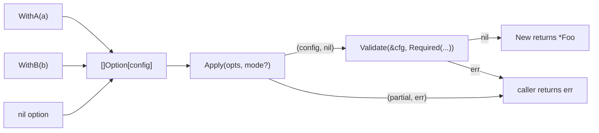

# Option

<!--
  Section headers below are STABLE ANCHORS. Magpie extracts content by header,
  so do not rename or reorder them. Doing so is a process change requiring its
  own spec.

  Sections marked **Public** are extracted by Magpie for the public site.
  Sections marked **Internal** are engineering-only and never appear in published docs.
-->

## Public Summary

<!-- **Public.** One paragraph in end-user voice. The canonical description for the site and README. -->

`option` is Glacier's universal functional-options kernel. Every Glacier package configurable at construction returns `Option[T]` values from its `With*` constructors and accepts them in its `New` function. `Apply` folds a slice of options into a zero-valued config struct; by default it short-circuits on the first failure, but `Strict()` mode accumulates every error so callers see all problems in one pass. `Validate` and `Required` provide a lightweight post-Apply validation layer for required-field and cross-field invariants. The package imports only `errors` and `fmt`; it has no Glacier dependencies and no external dependencies.

## Mental Model

<!-- **Public.** The conceptual frame a developer should hold while using this. Mermaid diagrams welcome. Source for the "Concepts" page on the site. -->

Options compose a config struct. A package author writes `With*` constructors that each return an `Option[config]`, then calls `Apply` in `New` to fold them in order. After `Apply` succeeds, `Validate` checks invariants that span multiple fields or require a fully-applied state.



Key invariants:

- Options are **stateless functions** (`OptionFunc[T]` is `func(*T) error`). Concurrent calls to `Apply` over the same `[]Option[T]` slice are safe without any locking.
- `nil` options in the slice are skipped silently — so conditional option patterns require no special handling.
- Duplicate `With*` calls follow **last-wins** semantics by virtue of in-order application.
- `Apply` never panics on a nil `Option[T]` interface value; it panics only if the underlying `OptionFunc` is nil (a misuse the caller owns).

## Goals

<!-- **Internal.** Bulleted list. -->

- Provide the single canonical options framework used by every Glacier package configurable at construction.
- Support fallible options: every `With*` constructor can return an error, and `Apply` surfaces it.
- Support strict all-errors-at-once mode (`Strict()`) and default short-circuit mode.
- Provide a lightweight post-Apply validation layer (`Validate`, `Required`, `Validator[T]`).
- Achieve zero allocations on the `Apply` happy path (no errors, no Strict mode).
- Keep the package at ≤ 200 production LOC with zero non-stdlib dependencies.
- Close the exported surface at v0: exactly eight symbols.

## Non-Goals

<!-- **Internal.** Bulleted list. What this spec deliberately excludes. -->

- Transaction / rollback semantics for options that mutate then error. Callers own transactional correctness in their `With*` implementations.
- Option merging or deep-copy helpers. Callers compose slices with `append`.
- Runtime reflection over applied config. Consumers who need this reach for `conf/`.
- Named or keyed options (map-based option registries). Out of scope for v0.
- A builder/fluent API around `Apply`. The function form is idiomatic Go.

## Architecture

<!-- **Internal.** Mermaid diagram + prose. Package layout, data flow, lifecycle. -->

`option` is a Tier-0 kernel package (spec 0002 §Architecture — Three-tier DAG). It has no Glacier dependencies: F1 of spec 0002 forbids any import of `github.com/nathanbrophy/glacier/...` from this package. It imports only `errors` and `fmt` from the stdlib.

The package's role in the broader framework is established in spec 0002 §7.1 (Functional options). This spec is the canonical reference for the `option` package itself; spec 0002 §7.1 defines the call convention every consuming package follows.

### Package layout

```
option/
├── option.go         all production code (~150 LOC)
├── option_test.go    unit tests
├── option_bench_test.go
├── option_fuzz_test.go
├── option_property_test.go
├── option_concurrent_test.go
├── example_test.go
└── doc.go
```

### Data flow

`Apply` allocates nothing on the happy path. The `errs []error` slice inside `Apply` is declared but never initialized when no option fails. In Strict mode, the slice is allocated only on the first failure. Validate always allocates its `errs []error` lazily on the first failing validator.

### Lifecycle

`Option`, `OptionFunc`, and `Validator` are function types with no lifecycle. There is no `Close` method on any type in this package (confirmed by spec 0002 §23.16 audit table: `option` types are stateless; no Close is needed or appropriate).

## Schema

<!-- **Internal.** Go types with invariants stated as `// invariant: ...` comments on each field. -->

```go
// Option configures a value of type T.
//
// invariant: the unexported apply method forbids out-of-module implementations.
// invariant: Option[T] values are stateless and safe for concurrent use.
type Option[T any] interface {
    apply(*T) error
}

// OptionFunc is the function adapter that satisfies Option[T].
//
// invariant: an OptionFunc whose underlying func is nil will panic when Apply invokes it.
//            Nil OptionFunc is a caller error; document it in the With* constructor.
// invariant: OptionFunc values are stateless; safe to call from multiple goroutines.
type OptionFunc[T any] func(*T) error

// Mode configures Apply's error-handling semantics.
//
// invariant: zero value of Mode is the default (short-circuit) semantics.
// invariant: Mode is constructed only via Strict(); direct struct literal use is valid
//            but yields the same zero-value default behavior.
type Mode struct {
    strict bool // invariant: true only when returned by Strict()
}

// Validator validates a fully-applied T.
//
// invariant: Validator[T] is a function type; stateless and safe for concurrent use.
// invariant: a nil Validator passed to Validate is skipped silently.
type Validator[T any] func(*T) error
```

## API

<!--
  **Public.** Every exported symbol introduced by this spec.
  For each: signature, doc comment (which becomes godoc), preconditions, postconditions,
  error contract, concurrency notes (goroutine-safe? blocking?), lifecycle hooks.
  Magpie extracts signatures + doc comments verbatim to the API reference page.
-->

```go
// Package option provides the canonical functional-options framework
// used by every Glacier package configurable at construction.
//
// The package centers on a single generic interface, Option[T], which
// every per-package WithX constructor returns. A package's New
// constructor calls Apply to fold options into a zero-valued config
// struct, then optionally calls Validate to check invariants.
//
// Options may fail: Option's apply method returns an error. By default,
// Apply short-circuits at the first failing option; pass Strict() to
// apply every option and join all collected errors.
package option

import (
	"errors"
	"fmt"
)

// Option configures a value of type T. The unexported apply method
// forbids out-of-module implementations; consumers compose options
// via OptionFunc.
type Option[T any] interface {
	apply(*T) error
}

// OptionFunc is the function adapter that satisfies Option.
//
// Per-package WithX constructors return OptionFunc-wrapped functions:
//
//	func WithLogger(l *slog.Logger) option.Option[config] {
//	    return option.OptionFunc[config](func(c *config) error {
//	        if l == nil {
//	            return errors.New("pkg: WithLogger: logger is nil")
//	        }
//	        c.logger = l
//	        return nil
//	    })
//	}
type OptionFunc[T any] func(*T) error

// apply implements Option.
func (f OptionFunc[T]) apply(t *T) error { return f(t) }

// Mode configures Apply's error-handling semantics.
//
// Construct via Strict(). The zero value of Mode is the default
// (short-circuit on first option error).
type Mode struct {
	strict bool
}

// Strict returns a Mode that causes Apply to apply every option even
// when some fail, returning errors.Join over every collected failure.
//
// Use Strict when the caller wants to see every option problem in one
// pass (e.g., displaying configuration errors to a user) rather than
// fixing them one at a time.
//
// Concurrency: Strict() is a pure function; its return value is safe
// to share across goroutines.
func Strict() Mode { return Mode{strict: true} }

// Apply applies opts to a zero-valued T and returns the configured T
// plus any error.
//
// Default behavior: Apply returns at the first option that errors,
// with T reflecting the partial state accumulated up to that point.
// With Strict() mode: Apply applies every option and returns
// errors.Join over all collected failures; T reflects every
// successful option applied.
//
// Nil options in opts are skipped silently. Duplicate options follow
// last-wins semantics by virtue of in-order application. When multiple
// modes are supplied, the last one wins. An empty opts slice returns
// the zero value of T and nil.
//
// Panics propagate: Apply does not recover from options that panic.
//
// Preconditions: none. opts may be nil or empty.
// Postconditions: returned T is always valid (zero-valued or partially/fully
//   configured). error is nil when all options succeed.
// Error contract: returns the first option's error (default mode) or
//   errors.Join of all failures (Strict mode). Error strings from
//   individual options follow each package's own library register.
// Concurrency: goroutine-safe. Apply reads opts and each Option value
//   but does not mutate them. Multiple goroutines may call Apply over
//   the same []Option[T] concurrently.
// Allocations: zero on the happy path (no errors, no Strict mode).
func Apply[T any](opts []Option[T], mode ...Mode) (T, error) {
	var m Mode
	if n := len(mode); n > 0 {
		m = mode[n-1]
	}
	var t T
	var errs []error
	for _, o := range opts {
		if o == nil {
			continue
		}
		if err := o.apply(&t); err != nil {
			if m.strict {
				errs = append(errs, err)
				continue
			}
			return t, err
		}
	}
	if len(errs) > 0 {
		return t, errors.Join(errs...)
	}
	return t, nil
}

// Validator validates a fully-applied T. Validators run after Apply
// has populated T from options; they check correctness invariants
// that span multiple fields or that depend on a fully-applied state.
//
// Concurrency: Validator[T] is a function type; goroutine-safe by design.
type Validator[T any] func(*T) error

// Validate runs validators against t and returns errors.Join over
// every validator that fails. Nil validators are skipped silently.
//
// Validate is intended to be called by package constructors after
// Apply, like:
//
//	cfg, err := option.Apply(opts)
//	if err != nil {
//	    return nil, err
//	}
//	if err := option.Validate(&cfg, requiredValidators...); err != nil {
//	    return nil, err
//	}
//
// Preconditions: t must not be nil.
// Postconditions: nil returned when all validators pass or validators is empty.
// Error contract: "option: validate: target is nil" when t is nil.
//   Otherwise, errors.Join of every failing validator's error.
// Panics propagate: Validate does not recover from validators that panic.
// Concurrency: goroutine-safe when called with independent t values.
func Validate[T any](t *T, validators ...Validator[T]) error {
	if t == nil {
		return errors.New("option: validate: target is nil")
	}
	var errs []error
	for _, v := range validators {
		if v == nil {
			continue
		}
		if err := v(t); err != nil {
			errs = append(errs, err)
		}
	}
	return errors.Join(errs...)
}

// Required returns a Validator that fails if getter returns nil (for
// pointer and interface types) or the zero value of any (for value
// types where nil signals absence). The error message is:
//
//	option: required: field "<name>" not set
//
// Required is the most common validator and ships in the kernel for
// convenience; package authors may write their own Validator functions
// for more complex checks (range checks, mutual exclusion, format
// validation).
//
// The getter receives a *T so it can navigate the config struct.
// Return the field value as any; Required checks whether it is nil.
// For non-pointer fields, return nil explicitly to signal absence:
//
//	option.Required[config]("logger", func(c *config) any { return c.logger })
//
// T is load-bearing in Required: the getter is typed to *T, giving
// compile-time safety that the getter navigates the correct config type.
//
// Preconditions: name may be empty; produces field "" not set (allowed, tested).
// Concurrency: the returned Validator[T] is a closure; goroutine-safe as long
//   as the getter does not mutate t.
func Required[T any](name string, getter func(*T) any) Validator[T] {
	return func(t *T) error {
		if getter(t) == nil {
			return fmt.Errorf("option: required: field %q not set", name)
		}
		return nil
	}
}
```

### Exported surface inventory

The package surface is **closed at v0**: exactly eight exports. Adding any new export is a spec amendment requiring Otter + Lynx + Falcon sign-off.

| Symbol | Kind | Description |
|--------|------|-------------|
| `Option[T]` | interface | The option type returned by all `With*` constructors |
| `OptionFunc[T]` | type (func) | Adapter to satisfy `Option[T]` from a plain function |
| `Apply[T]` | function | Fold options into a zero-valued T |
| `Mode` | struct | Error-handling mode token for Apply |
| `Strict` | function | Construct Strict mode (all-errors) |
| `Validator[T]` | type (func) | Post-apply validation function |
| `Validate[T]` | function | Run validators and join errors |
| `Required[T]` | function | Build a Validator for required-field checks |

## Examples

<!--
  **Public.** Runnable Go examples in fenced ```go blocks.
  Each example is self-contained and `go test ./...`-compatible (valid Example functions).
  Magpie transcludes verbatim into tutorials.
-->

### Per-package usage (httpmock)

```go
package httpmock

import (
	"errors"
	"fmt"
	"log/slog"
	"net/http"

	"github.com/nathanbrophy/glacier/option"
)

type config struct {
	logger        *slog.Logger
	defaultStatus int
	strict        bool
}

func WithLogger(l *slog.Logger) option.Option[config] {
	return option.OptionFunc[config](func(c *config) error {
		if l == nil {
			return errors.New("httpmock: WithLogger: logger is nil")
		}
		c.logger = l
		return nil
	})
}

func WithDefaultStatus(code int) option.Option[config] {
	return option.OptionFunc[config](func(c *config) error {
		if code < 100 || code > 599 {
			return fmt.Errorf("httpmock: WithDefaultStatus: invalid code %d", code)
		}
		c.defaultStatus = code
		return nil
	})
}

func New(opts ...option.Option[config]) (*Transport, error) {
	cfg, err := option.Apply(opts)
	if err != nil {
		return nil, err
	}
	if err := option.Validate(&cfg,
		option.Required[config]("logger", func(c *config) any { return c.logger }),
	); err != nil {
		return nil, err
	}
	return &Transport{cfg: cfg}, nil
}
```

### Strict-apply (caller sees all errors at once)

```go
cfg, err := option.Apply(opts, option.Strict())
if err != nil {
	// err is errors.Join of every option that failed.
	// Each failure carries its own package-prefixed message.
	for e := range errs.Chain(err) {
		log.Println(e)
	}
}
```

### Conditional option using nil-skip

```go
var debugOpt option.Option[config]   // remains nil if !debug
if debug {
	debugOpt = WithDebug()
}
opts := []option.Option[config]{WithLogger(l), debugOpt, WithDefaultStatus(200)}
cfg, _ := option.Apply(opts)   // nil debugOpt is skipped silently
```

### Preset + override (last-wins on duplicates)

```go
var DevPreset = []option.Option[config]{
	WithLogger(devLogger),
	WithDefaultStatus(200),
}

cfg, _ := option.Apply(append(DevPreset, WithDefaultStatus(500)))
// cfg.defaultStatus == 500 — the override wins
```

## Test Matrix

<!--
  **Internal.** Owned by Lynx.
  Pulled verbatim from specs/test-matrices/kernel.md ## Package: option/ section.
-->

### Test files

- `option/option_test.go` — unit tests (Apply, Validate, Required, OptionFunc, Mode/Strict)
- `option/option_bench_test.go` — benchmarks for the recalibrated D35 targets and the NF1 zero-alloc claim
- `option/option_fuzz_test.go` — fuzz `Required`'s `name` argument round-trip in error formatting
- `option/option_property_test.go` — algebraic-property tests (idempotency, last-wins, nil-skip)
- `option/option_concurrent_test.go` — race-detector tests for stateless concurrency claim (NF2)
- `option/example_test.go` — runnable `Example*` functions per NF7

### Test matrix

| #  | Name | Spec ref | Type | Description | Test helpers used |
|----|------|----------|------|-------------|-------------------|
| 1  | TestApplyEmpty | §21.1 F3, E2; §23.4 | unit | `Apply([]Option[T]{})` returns zero T, nil. | `assert.Equal`, `assert.NoError` |
| 2  | TestApplyOneOption | §21.1 F3 | unit | Single non-nil option mutates T as expected. | `assert.Equal`, `assert.NoError` |
| 3  | TestApplyMultipleOptions | §21.1 F3 | unit | Three options compose; final T has all three fields set. | `assert.Equal` |
| 4  | TestApplyDefaultShortCircuit | §21.1 F4, E7 | unit | First option errors → returns at first error; later options not applied; partial T documented. | `assert.ErrorIs`, `assert.Equal` |
| 5  | TestApplyDefaultSecondErrors | §21.1 F4 | unit | First option succeeds, second errors → first applied, third never run. | `assert.Equal`, `assert.ErrorIs` |
| 6  | TestApplyStrictMultipleErrors | §21.1 F5, E8 | unit | `Strict()` accumulates 2+ failures via `errors.Join`; partial T returned. | `assert.ErrorIs` (twice over `errors.Unwrap`-walked join) |
| 7  | TestApplyStrictNoErrors | §21.1 F5 | unit | All options succeed under Strict → returns configured T, nil. | `assert.NoError` |
| 8  | TestApplyNilOptionSkipped | §21.1 F9, E1 | unit | `[]Option[T]{nil, WithA, nil}` → only WithA applied; no panic. | `assert.NoError`, `assert.Equal` |
| 9  | TestApplyAllNilOptionsReturnsZero | §21.1 F9, E1 | unit | All-nil slice yields zero T, nil err. | `assert.Equal`, `assert.NoError` |
| 10 | TestApplyDuplicateLastWins | §21.1 F11, E3 | unit | Same field set twice → last value wins. | `assert.Equal` |
| 11 | TestApplyMultipleModesLastWins | §21.1 F12, E4 | unit | `Apply(opts, Mode{}, Strict())` → strict semantics active. | `assert.Equal` |
| 12 | TestApplyZeroModesIsDefault | §21.1 F12 | unit | No mode arg → default (short-circuit) semantics. | `assert.ErrorIs` |
| 13 | TestApplyOnPrimitiveT | §21.1 E12 | unit | `Apply[int]([]Option[int]{...})` compiles and produces configured int. | `assert.Equal` |
| 14 | TestApplyOnNonStructT | §21.1 E12 | unit | T is a `[]string` slice; option appends. | `assert.Equal` |
| 15 | TestApplyOptionPanicsPropagates | §21.1 E10 | unit | An option that calls `panic("x")` → Apply does not recover; panic visible. | `assert.Panics` (via runtime helper, see Bootstrap subset note below) |
| 16 | TestApplyOptionMutateThenError | §21.1 E9 | unit | Documented behavior: option mutates state then errors → partial state visible (transactional violation accepted). | `assert.NotEqual` (T != zero) |
| 17 | TestOptionFuncSatisfiesOption | §21.1 F2 | unit | `var _ Option[T] = OptionFunc[T](nil)` — interface conformance. | bare type assertion |
| 18 | TestOptionFuncTypedNilApplyPanics | §21.1 F2 | unit | Calling `apply` on a `OptionFunc` whose underlying func is nil panics. (Edge — added by Lynx.) | `assert.Panics` |
| 19 | TestStrictReturnsStrictMode | §21.1 F5 | unit | `Strict().strict == true` (verified indirectly via Apply behavior since field unexported). | composition with TestApplyStrictMultipleErrors |
| 20 | TestValidateNoValidators | §21.1 F7 | unit | `Validate(&t)` with empty validators → nil. | `assert.NoError` |
| 21 | TestValidateAllPass | §21.1 F7 | unit | Three validators all return nil → nil. | `assert.NoError` |
| 22 | TestValidateMultipleFail | §21.1 F7 | unit | Two of three fail → `errors.Join` of both; can `errors.Is`-detect both. | `assert.ErrorIs` (over join) |
| 23 | TestValidateNilTarget | §21.1 F13, E6 | unit | `Validate[T](nil, v)` → exact text `option: validate: target is nil`. | `assert.ErrorIs`, `assert.Equal` on `.Error()` |
| 24 | TestValidateNilValidatorSkipped | §21.1 F10, E5 | unit | `Validate(&t, nil, v)` runs only v. | `assert.NoError` (when v passes) |
| 25 | TestValidateAllNilValidators | §21.1 F10 | unit | All-nil validators → nil. | `assert.NoError` |
| 26 | TestValidateValidatorPanicsPropagates | §21.1 E11 | unit | Validator panics → Validate does not recover. | `assert.Panics` |
| 27 | TestRequiredPass | §21.1 F8 | unit | `Required("x", check-true)` returns Validator that yields nil. | `assert.NoError` |
| 28 | TestRequiredFail | §21.1 F8 | unit | `Required("x", check-false)` yields `option: required: field "x" not set`. | `assert.ErrorContains`, register-format check |
| 29 | TestRequiredQuotesFieldName | §21.1 F8 | unit | Field name with embedded quote/space rendered via `%q`. | `assert.Equal` on `.Error()` |
| 30 | TestRequiredGenericTLoadBearing | §23.17 | unit | Verifies the §23.17 fix: `Required[T]` getter form properly routes through *T. | `assert.NoError`, `assert.ErrorContains` |
| 31 | TestErrorRegisterConformanceOption | §21.1 NF3 | unit | Every `Error()` string from this package matches `^option: [a-z][^A-Z.]*$`. | regex check via `assert.Match` with `MatchRegex()` |
| 32 | BenchmarkApplyZeroAlloc_Happy | §21.1 NF1 | bench | 10 options, no errors, no Strict → `testing.AllocsPerRun` reports 0. | `testing.AllocsPerRun`, `assert.Equal` (in companion `TestApplyZeroAlloc`) |
| 33 | BenchmarkApplyOneOption | §21.1 NF1 | bench | Single-option happy path; per-op ns. | `testing.B` |
| 34 | BenchmarkApplyTenOptions | §21.1 NF1 | bench | 10 options happy path; per-op ns. | `testing.B` |
| 35 | BenchmarkApplyStrictTenOptions | §21.1 F5 | bench | Strict 10 options, all pass; allocs ≤ 1 (the `errs` slice never grows because no errors). | `testing.B` |
| 36 | BenchmarkApplyStrictWithFailures | §21.1 F5 | bench | Strict 10 options, 5 fail; allocates the join + errs slice. Documented expected number. | `testing.B` |
| 37 | BenchmarkValidate | §21.1 F7 | bench | 5 validators, all pass; per-op ns. | `testing.B` |
| 38 | BenchmarkRequired | §21.1 F8 | bench | Required validator hot path. | `testing.B` |
| 39 | TestApplyConcurrent | §21.1 NF2 | race | 100 goroutines call `Apply(samepts)` against local T each; runs under `-race`. | `concur.WaitGroup` is leaf-tier — use stdlib `sync.WaitGroup`; `assert.NoError` |
| 40 | TestValidateConcurrent | §21.1 NF2 | race | 100 goroutines call `Validate(&t, vs...)` on independent t. | stdlib `sync.WaitGroup`, `assert.NoError` |
| 41 | PropertyApplyIdempotent | §21.1 F11 | property | For any list of pure idempotent options, `Apply(opts).Apply(opts)` == `Apply(opts)`. (Generative table-driven.) | `fixture/random` (kernel-allowed seedable rand), `assert.Equal` |
| 42 | PropertyApplyNilSkipPermutation | §21.1 F9 | property | Inserting nils anywhere in opts produces same result as opts without nils. | `assert.Equal` over permutations |
| 43 | PropertyApplyLastWins | §21.1 F11 | property | Setting same field N times → final value == last setter. | `assert.Equal` |
| 44 | PropertyValidateOrderInvariance | §21.1 F7 | property | `errors.Join`-result is set-equivalent regardless of validator order (under `errs.Chain`). | `assert.Subset` over `errs.Chain(err)` |
| 45 | ExampleApply | §21.1 NF7 | example | Runnable godoc example. | output-comment match |
| 46 | ExampleStrict | §21.1 NF7, F5 | example | Runnable Strict example. | output-comment match |
| 47 | ExampleValidate | §21.1 NF7 | example | Runnable Validate + Required example. | output-comment match |
| 48 | TestSurfaceClosed_OptionPackage | §21.1 NF8 | unit | `reflect`-based check that the package exports exactly 8 symbols (Option, OptionFunc, Apply, Mode, Strict, Validator, Validate, Required). Uses `go/types` to snapshot. | `fixture/golden` of the API snapshot |

### Bootstrap subset

`option` does not depend on `assert`, but its tests will use `assert`. Since `assert` (in turn) imports `option` for its `EqualOption` types, **we have a circular `_test` problem**: `assert`'s tests should not depend on `option`-with-assert-tests being green. The resolution:

- `option`'s tests use `assert` freely. The cycle is broken at the **`_test.go` boundary**: `assert/equal_test.go` does NOT import `option/` for setup of its own correctness; it uses bare `if` for the bootstrap.
- For `TestApplyOptionPanicsPropagates` (T#15) and similar panic checks, `assert.Panics` is itself in the bootstrap subset — but those tests can be written with bare `defer func() { if r := recover(); r == nil { t.Fatal("expected panic") } }()`.

### Coverage target

- **Line coverage:** 100% (the package is ~200 LOC; everything is reachable)
- **Branch coverage:** 100%
- **Public-API coverage:** 100% (all 8 exports exercised)
- All untested branches in the implementation are an automatic CI failure.

### Edge cases not in the spec but worth testing (Lynx additions)

- **L-add-1:** A `OptionFunc[T]` whose underlying function is `nil` and is invoked → currently would panic with a nil-pointer dereference. Spec is silent; spec the behavior in the doc and test it (T#18).
- **L-add-2:** `Apply` with options that close over a goroutine-shared variable, racing under `-race` → covered by T#39, but with a write-then-read variant inside the option to catch any unintended sharing in the implementation.
- **L-add-3:** `Validate` on a target whose pointer changes mid-validation (validator that swaps `*t` to a new value) → documented as "validator should not mutate t"; assert it does not crash even if violated.
- **L-add-4:** `Required` with `name == ""` → produces `option: required: field "" not set`. Allowed; documented; tested.
- **L-add-5:** `Apply` with 10,000 nil-only options — should remain O(n) and not allocate (NF1).
- **L-add-6:** Memory: `Apply`'s `errs` slice in default mode should remain `nil` (never allocated) when no error occurs — verified by `AllocsPerRun == 0`.

## Dependency Justification

<!--
  **Internal.** Owned by Falcon.
  No external dependencies. The empty table row is the goal state.
-->

| Module | Version | License | Last release | Maintainers | Alternatives considered | Why we can't roll our own |
|--------|---------|---------|--------------|-------------|------------------------|--------------------------|
| _(none)_ | — | — | — | — | — | — |

`option` imports only `errors` and `fmt` from the Go standard library. No external or third-party dependencies. NF6 (spec ref §21.1) hard-requires this.

## Security & Supply-Chain Notes

<!-- **Internal.** Untrusted-input handling, sandboxing implications, secrets handling, vuln-scan considerations. -->

`option` handles no untrusted input. All values flowing through `Option[T]` are programmer-controlled: `With*` constructors are authored by Glacier package maintainers or downstream consumers in their own code. There is no network I/O, file I/O, or parsing of external data.

Cross-cutting supply-chain policy from spec 0002 §Security & Supply-Chain Notes applies without modification. The zero-dependency posture means there is no transitive vulnerability surface for this package.

The unexported `apply` method on `Option[T]` prevents out-of-module interface implementations. This is a design boundary, not a security boundary; the package does not guard against malicious `OptionFunc` values passed by the same module.

## Migration & Compatibility

<!-- **Internal.** N/A — first release. -->

Not applicable. This is the first release of the `option` package. There is no prior public API to migrate from.

## FAQ

<!-- **Public.** Anticipated user questions with answers. Magpie extracts to the public docs FAQ. -->

**Why does Apply return an error instead of panicking?**

Options can fail for legitimate reasons: a nil logger, an out-of-range port number, a missing required value. Panicking on bad input is appropriate for programming errors (wrong type, nil receiver on unexported method). Option errors are runtime conditions — the caller's configuration is wrong, not the program itself. Returning an error lets constructors surface the problem cleanly and lets callers decide how to handle it (log and exit, accumulate, retry with different options).

**Why is there a separate Mode type instead of a boolean parameter?**

`Apply(opts, true)` and `Apply(opts, false)` are opaque. `Apply(opts, option.Strict())` is self-documenting. The variadic `mode ...Mode` form lets callers omit the mode entirely for the common case, keeps the zero value meaningful (default semantics), and makes it easy to pass a computed mode from a variable. A boolean parameter would require a `WithStrict(bool)` wrapper or a mandatory fourth arg that is `false` 95% of the time.

**Why not method chaining (a builder API)?**

Go's idiomatic pattern for construction is `New(opts ...Option[T])` with a function call, not `builder.WithA(a).WithB(b).Build()`. The functional-options pattern composes naturally with append, spread, and preset slices. Builders require an extra type per package and obscure the zero value. `option` provides the minimum kernel; package authors build `With*` constructors in their own packages without any builder ceremony.

**Why does option.Option[T] stutter at the call site?**

`option.Option[config]` is idiomatic. Go has many precedents: `errors.New` returns an `error`, `time.Time` is a `time.Time`, `context.Context` is a `context.Context`. The stutter communicates "this is the canonical thing from the option package" — which is exactly right. Renaming it `option.Type[T]` or `option.Opt[T]` would be non-standard and confusing. Magpie reviewed this decision and signed off (spec 0001 naming conventions, §21.1 Naming and conventions).

**Why does Required use `getter func(*T) any` instead of `check func(*T) bool`?**

The `bool` predicate form (original §21.1 design) makes T ceremonial — the compiler cannot verify that the check function actually navigates `*T`. The `any` getter form (§23.17 amendment) makes T load-bearing: the getter is typed to `*T`, giving compile-time safety that the getter navigates the correct config type. The nil check on the returned `any` covers pointer fields (`c.logger`) and interface fields. For value-type fields that have no natural nil representation, authors should write a custom `Validator[T]` instead of using `Required`.

**What happens when an option mutates the config and then returns an error?**

The mutation is visible in the returned partial T. `Apply` does not attempt transactional rollback — that is the option author's responsibility. The spec documents this explicitly (E9): "Caller's bug. Spec recommends but does not enforce that options be transactional." In practice, most `With*` constructors validate before mutating: check the incoming value, then set the field. This makes them naturally transactional.

## Decisions & Rationale

<!-- **Internal.** Why-this-and-not-that for non-obvious choices. Folded-in ADR. -->

### D1 — Unexported `apply` method on `Option[T]`

Prevents out-of-module interface implementation. Consumers must use `OptionFunc[T]`, which is the right constraint: it forces every option to be a plain function, which makes the type stateless by construction and guarantees the concurrency safety claim (NF2). If `apply` were exported, a consumer could implement `Option[T]` as a struct with mutable state, breaking the goroutine-safety guarantee without the package being able to detect it.

### D2 — `Apply[T]` signature: `(opts []Option[T], mode ...Mode) (T, error)` (§23.4 canonical form)

The variadic `mode ...Mode` form allows callers to omit mode entirely for the common case. The last-wins rule for multiple modes keeps the contract simple. This signature was locked in §23.4 of the framework-shape plan. The earlier sketch in spec 0002 §7.1 used `opts ...Option[T]`; §23.4 changed `opts` to `[]Option[T]` to force explicit slice construction at call sites, which makes preset + override patterns natural (`append(DevPreset, overrides...)`).

### D3 — Zero allocation on the happy path (NF1)

The `errs []error` slice inside `Apply` is declared as a nil slice and is only initialized on the first error. This is a standard Go pattern: `var errs []error` is zero bytes; `append(nil, err)` allocates. The happy path (no errors) never reaches the append and never allocates. Strict mode with no errors is also zero-alloc: no errors means the append never fires. This is verified by `BenchmarkApplyZeroAlloc_Happy` (T#32) and its companion unit test.

### D4 — `Strict()` as a constructor, not a boolean flag

See FAQ "Why is there a separate Mode type". Additionally: the `Mode` struct is extensible — future modes (if any) can be added as new exported constructors without changing the `Apply` signature. No such modes are planned for v0; the surface is closed (NF8), so any new mode is a spec amendment.

### D5 — `Required[T any](name string, getter func(*T) any) Validator[T]` (§23.17 amendment)

Original design (§21.1) used `check func(*T) bool`. The §23.17 amendment changes the predicate to `getter func(*T) any` to make T load-bearing. With the bool form, `Required[config]("logger", func(_ *config) bool { return true })` compiles even if the getter navigates a different type by accident — the type parameter is not in the predicate signature in any meaningful way. With the `any` getter form, the type parameter flows into the getter argument: `func(c *config) any` — if the caller passes a function with the wrong receiver type, the compiler rejects it. The nil check on the returned `any` handles the common pointer/interface field case. For value-type required fields (e.g., a string that must be non-empty), callers write a custom `Validator[T]`.

### D6 — Eight exports, surface closed at v0 (NF8)

Fewer exports is more. Each new export is API surface the framework must maintain forever. The eight exports cover every need identified in the v0 package roster. The closed surface is verified by `TestSurfaceClosed_OptionPackage` (T#48) using `go/types` to snapshot the export list and a golden file to detect unintended additions.

### D7 — `Validate` always joins all validator errors

Unlike `Apply`'s configurable short-circuit vs. Strict behavior, `Validate` always runs every validator and joins all errors. The rationale: validators run post-Apply on a fully-constructed T; they are cheap checks (field-not-nil, range check). Stopping at the first validator error means the user fixes one required field, re-runs, discovers another. Showing all validation failures at once is always the better UX for construction-time validation. `Apply`'s short-circuit default exists because options may have side effects and short-circuiting avoids applying undefined state; validators are pure reads with no side effects.

## Open Questions

<!--
  **Internal.** Unresolved items.
  MUST be empty before this spec moves to `accepted` (per CLAUDE.md core directive 1 / D11).
-->

_(none)_

## Verification

<!-- **Internal.** Concrete steps to prove the change works end-to-end. Run when the spec moves to `verified`. -->

1. `gofmt -l option/` — exits 0, no output.
2. `go vet ./option/...` — exits 0, no diagnostics.
3. `staticcheck ./option/...` — exits 0, no diagnostics.
4. `go test -race ./option/...` — exits 0; all 48 test cases pass; race detector reports no violations.
5. `go test -run TestApplyZeroAlloc ./option/...` — passes; `testing.AllocsPerRun` returns 0.
6. `go test -bench=BenchmarkApplyZeroAlloc_Happy -benchmem ./option/...` — reports `0 allocs/op`.
7. `go test -fuzz=FuzzRequired -fuzztime=30s ./option/...` — no failures.
8. `go test -run TestSurfaceClosed_OptionPackage ./option/...` — golden file matches exactly 8 exports.
9. `go test -run TestErrorRegisterConformanceOption ./option/...` — all error strings match `^option: [a-z][^A-Z.]*$`.
10. Confirm `go mod graph | grep option` shows no outbound edges to any non-stdlib module.
