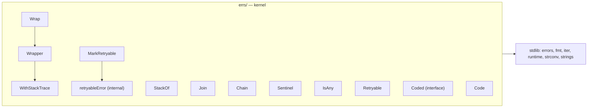

# Errs

<!--
  Section headers below are STABLE ANCHORS. Magpie extracts content by header,
  so do not rename or reorder them. Doing so is a process change requiring its
  own spec.

  Sections marked **Public** are extracted by Magpie for the public site.
  Sections marked **Internal** are engineering-only and never appear in published docs.
-->

## Public Summary

<!-- **Public.** One paragraph in end-user voice. The canonical description for the site and README. -->

The `errs` package is Glacier's error-story foundation. It gives every other package a consistent vocabulary for wrapping errors (with optional stack-trace capture), composing errors without information loss, walking the full error tree as a lazy iterator, declaring format-validated sentinels, checking errors against multiple targets at once, classifying errors as retryable, and attaching machine-readable codes to errors for programmatic branching. `errs` declares no sentinels of its own — each package owns its sentinels and uses `errs` helpers to construct and manipulate them. Import `errs`, write less error-handling boilerplate, and get `errors.Is` / `errors.As` compatibility for free.

## Mental Model

<!-- **Public.** The conceptual frame a developer should hold while using this. Mermaid diagrams welcome. Source for the "Concepts" page on the site. -->

Think of `errs` as a toolkit with four axes:

**Chain preservation.** `Wrap` prepends a `"package: action: "` prefix while keeping the original error available via `errors.Is` and `errors.As`. By default, Wrap captures no stack trace — opt in via `.WithStackTrace()` only where the call site is ambiguous. `StackOf` retrieves the captured frames from wherever they appear in the chain.

**Composition.** `Join` collapses nil entries, returns a lone survivor unwrapped, and delegates to `errors.Join` only when two or more non-nil errors remain. The result: `Close()` implementations that fan out to sub-resources stay simple.

**Tree walking.** `Chain` is a lazy `iter.Seq[error]` that visits every node in the error tree — linear `Unwrap()` chains and fan-out `Unwrap() []error` joins alike — in depth-first order. It composes naturally with the `fluent` package without creating an import edge.

**Metadata.** `Sentinel` validates library-register format at construction time (panics if misformatted, never at runtime). `IsAny` is a multi-target `errors.Is`. `MarkRetryable` / `Retryable` classify transient errors without coupling the caller to the error's origin. `Coded` / `Code` surface a stable machine-readable string for programmatic branching and internationalisation.



## Goals

<!-- **Internal.** Bulleted list. -->

- Provide chain-preserving error wrapping with opt-in stack-trace capture.
- Expose a lazy depth-first iterator over the full error tree.
- Validate sentinel format at construction time so misformatted sentinels never reach production.
- Supply nil-collapsing, single-survivor-shortcutting error joining.
- Add retry-classification and machine-code metadata to errors without coupling error origin to consumer.
- Keep the total production footprint at or below 250 lines of Go.
- Import only the standard library.

## Non-Goals

<!-- **Internal.** Bulleted list. What this spec deliberately excludes. -->

- Declaring package-level sentinels. Each consuming package owns its sentinels (`Err<Cause>`).
- Providing a `log`-integrated error reporter. `log` imports `errs`; `errs` never imports `log` (forbidden edge F2).
- Implementing structured error types beyond `Wrapper` and `retryableError`. Per-package `<Cause>Error` structs live in their own packages.
- Recovering from panics inside library code. `errs` functions do not call `recover`.
- Validating the `Code()` string format. Code format (`^[A-Z][A-Z0-9_]*$`) is a convention; `Code` itself does not enforce it.
- Providing async or context-aware variants. `errs` is stateless and fully synchronous.

## Architecture

<!-- **Internal.** Mermaid diagram + prose. Package layout, data flow, lifecycle. -->

`errs` is a Tier 0 kernel package (see spec 0002 §6). It sits at the bottom of the import graph: it imports nothing from `github.com/nathanbrophy/mongoose/...`, only the six stdlib packages it uses directly (`errors`, `fmt`, `iter`, `runtime`, `strconv`, `strings`).

**Relationship with `errors.Is` / `errors.As`.** `Wrapper` implements `Unwrap() error`, making it transparent to both predicates. `retryableError` likewise implements `Unwrap() error`. Neither type breaks traversal. `Coded` is detected by `Code` via `errors.As`, which traverses the full chain automatically.

**Chain semantics.** `Wrap` creates a *single* wrapper node — no recursive re-wrapping. The chain is a singly-linked list of wrappers terminated by the original error. `WithStackTrace` attaches frames to the wrapper in place; it does not create a second wrapper. `StackOf` walks the chain via `errors.Unwrap` until it finds a `*Wrapper` with a non-nil stack slice.

**`Chain` DFS.** The iterator dispatches on interface satisfaction at each node: if a node implements `Unwrap() error`, it follows the single child; if it implements `Unwrap() []error`, it fans out depth-first. Nodes implementing neither are leaves. The iterator is a bare closure over a recursive `walk` function — no heap allocation beyond the closure itself.

**`Sentinel` validation.** Format checking happens inside the `Sentinel` call, which is always a package-level `var` initialisation. A panic during package init surfaces immediately in any test that imports the offending package — misformatted sentinels cannot reach a shipping binary.

**Lifecycle.** `errs` is stateless. There are no types requiring `Close` (per spec 0002 §23.16 lifecycle audit: `errs` is stateless functions only; no entry in the Close discipline table). All public functions are safe to call from multiple goroutines concurrently without synchronisation.

**File layout.**

```
errs/
├── doc.go              package-level doc comment
├── errs.go             Wrapper, Wrap, StackOf, Join, Chain, Sentinel,
│                       IsAny, MarkRetryable, Retryable, Coded, Code,
│                       retryableError (unexported), validRegister (unexported)
├── wrap_test.go        Wrap, WithStackTrace, StackOf, *Wrapper
├── join_test.go        Join semantics
├── chain_test.go       Chain iterator over the error tree
├── sentinel_test.go    Sentinel + register validator (incl. fuzz seed corpus)
├── isany_test.go       IsAny
├── retryable_test.go   MarkRetryable, Retryable
├── coded_test.go       Coded, Code
├── fuzz_test.go        FuzzSentinelRegister
├── property_test.go    Chain DFS correctness, Wrap idempotency, Join idempotency
├── bench_test.go       Wrap allocations, Chain throughput, Sentinel, Join, Retryable, Code
└── example_test.go     ExampleWrap, ExampleSentinel, ExampleChain, ExampleRetryable
```

## Schema

<!-- **Internal.** Go types with invariants stated as `// invariant: ...` comments on each field. -->

```go
// Wrapper is the concrete error type returned by Wrap.
type Wrapper struct {
    prefix string         // invariant: never empty in practice (documented but not enforced)
    err    error          // invariant: non-nil; Wrap returns nil when err is nil
    stack  []runtime.Frame // invariant: nil when WithStackTrace was not called; length ≤ 32 after
}

// retryableError is an unexported marker type used by MarkRetryable.
type retryableError struct {
    err error // invariant: non-nil; MarkRetryable returns nil when err is nil
}
```

**Invariants on `Wrapper`:**
- `w.err != nil` for any `*Wrapper` returned by `Wrap`.
- `w.stack == nil` iff `WithStackTrace` was never called on this `*Wrapper`.
- `len(w.stack) <= 32` when `w.stack != nil`.
- `w.Error()` returns `w.prefix + ": " + w.err.Error()`.
- `w.Unwrap()` returns `w.err`, enabling `errors.Is` / `errors.As` traversal.

**Invariants on `retryableError`:**
- `r.err != nil` for any `*retryableError` returned by `MarkRetryable`.
- `r.Retryable()` always returns `true`.
- `r.Unwrap()` returns `r.err`, preserving chain traversal.

## API

<!--
  **Public.** Every exported symbol introduced by this spec.
  For each: signature, doc comment (which becomes godoc), preconditions, postconditions,
  error contract, concurrency notes (goroutine-safe? blocking?), lifecycle hooks.
  Magpie extracts signatures + doc comments verbatim to the API reference page.
-->

```go
// Package errs provides the helpers underlying Glacier's error story:
// chain-preserving wrapping with optional stack capture, nil-aware joining,
// tree-walking iteration, library-register-validating sentinels, multi-target
// matching, retry markers, and stable error codes.
//
// errs declares no sentinels of its own; per-package sentinels (Err<Cause>)
// live in their own packages and use Sentinel for construction.
package errs
```

### Wrapper

```go
// Wrapper is the concrete error type returned by Wrap. It supports an
// optional fluent stack-trace capture via WithStackTrace and preserves
// the unwrap chain so errors.Is and errors.As traverse through it.
type Wrapper struct { /* unexported fields */ }
```

**Preconditions:** none; a zero-value `*Wrapper` is nil-safe.
**Concurrency:** goroutine-safe for reads after construction; `WithStackTrace` must not be called concurrently on the same `*Wrapper`.

---

```go
// Error implements error. The format is "<prefix>: <err.Error()>" — matching
// Glacier's library register when prefix is "package: action".
// Returns "" on a nil receiver.
func (w *Wrapper) Error() string
```

---

```go
// Unwrap returns the wrapped error, supporting errors.Is and errors.As.
// Returns nil on a nil receiver.
func (w *Wrapper) Unwrap() error
```

---

```go
// WithStackTrace captures the call stack at the call site (up to 32 frames)
// and attaches it to w. Subsequent calls to StackOf will return the captured
// frames. Returns w for chaining; nil-receiver-safe.
//
// Use sparingly: stack capture allocates and adds latency. Reach for it when
// debugging a call site that needs more context than the wrap chain provides.
func (w *Wrapper) WithStackTrace() *Wrapper
```

**Preconditions:** none; safe to call on nil receiver.
**Postconditions:** `StackOf(w)` returns the captured frames (len ≥ 1, len ≤ 32).
**Allocation:** one `[]runtime.Frame` slice; length bounded at 32.

### Wrap

```go
// Wrap returns a Wrapper that prepends prefix and preserves err's unwrap
// chain. Returns nil if err is nil. The default Wrap captures no stack
// trace; opt in via .WithStackTrace().
//
// prefix should follow Glacier's library register: lowercase, no trailing
// period, "package: action" shape. Example:
//
//   return errs.Wrap(err, "cli: parse")               // chain-only
//   return errs.Wrap(err, "sandbox: spawn").WithStackTrace() // chain + stack
func Wrap(err error, prefix string) *Wrapper
```

**Preconditions:** none.
**Postconditions:** returns nil iff `err == nil`; otherwise returns a non-nil `*Wrapper` where `errors.Is(result, err) == true`.
**Allocation:** one struct allocation (`*Wrapper`) when `err != nil`.
**Concurrency:** goroutine-safe.

### StackOf

```go
// StackOf returns the stack frames captured by WithStackTrace anywhere in
// err's unwrap chain, or nil if none were captured.
func StackOf(err error) []runtime.Frame
```

**Preconditions:** none; safe to call with nil err.
**Postconditions:** returns nil if no `*Wrapper` in the chain has a captured stack.
**Concurrency:** goroutine-safe; walks via `errors.Unwrap` without mutation.

### Join

```go
// Join composes multiple errors. Equivalent to stdlib errors.Join with two
// niceties: nil entries are dropped silently; if exactly one non-nil entry
// remains, it is returned directly without wrapping (so single-error cases
// stay simple).
//
// Returns nil when every input is nil or the input is empty.
func Join(errs ...error) error
```

**Preconditions:** none.
**Postconditions:** returns nil iff all inputs are nil or no inputs are given. Returns the single non-nil input directly (pointer identity) when exactly one non-nil input remains after nil-dropping. Otherwise returns the result of `errors.Join` with the non-nil subset.
**Allocation:** zero when all inputs are nil; zero when exactly one non-nil input (no wrapping); one `[]error` allocation for the multi-error case.
**Concurrency:** goroutine-safe.

### Chain

```go
// Chain returns an iterator that yields every error in err's tree, walking
// both single Unwrap() (the linear unwrap chain) and Unwrap() []error (the
// joined-errors fan-out) in depth-first order. The first yielded error is
// err itself.
//
// Composes naturally with the fluent package without taking a fluent
// dependency:
//
//   for e := range errs.Chain(err) {
//       if myErr := (*MyError)(nil); errors.As(e, &myErr) {
//           // handle myErr
//       }
//   }
//
// Yielding stops if the receiver returns false; safe to truncate via
// fluent.Take(errs.Chain(err), n).
func Chain(err error) iter.Seq[error]
```

**Preconditions:** none; safe to call with nil err (yields nothing).
**Postconditions:** the first yielded value (if any) is err itself. Every error reachable from err via `Unwrap() error` or `Unwrap() []error` is eventually yielded unless the receiver returns false.
**Allocation:** one closure allocation; no heap allocation per yielded element for the common linear case.
**Concurrency:** goroutine-safe; the returned iterator operates on the (immutable) error chain.

### Sentinel

```go
// Sentinel constructs an errors.New-equivalent sentinel with stable text. The
// text MUST match Glacier's library register: lowercase, no trailing period,
// and contain at least one ":" separator (the "package: action" shape).
// Misformatted text panics at construction so misuse never reaches production.
//
// Sentinels are declared at package level:
//
//   var ErrCancelled  = errs.Sentinel("cli: cancelled")
//   var ErrUnknownFlag = errs.Sentinel("cli: unknown flag")
func Sentinel(text string) error
```

**Preconditions:** `text` must be non-empty, contain at least one `:`, have no trailing `.`, and contain no ASCII uppercase letters (`A`–`Z`). Violation panics with a message that includes `"Glacier library register"`.
**Postconditions:** returns an `error` whose `.Error()` returns `text` exactly. The returned value is suitable as an `errors.Is` target.
**Concurrency:** goroutine-safe; intended for package-level `var` initialisations.
**Panic contract:** panics only at construction (package init). The panic message is explanatory and mentions the register rule.

### IsAny

```go
// IsAny reports whether errors.Is(err, t) is true for any t in targets. More
// readable than chained errors.Is calls when checking against multiple
// sentinels.
//
//   if errs.IsAny(err, cli.ErrCancelled, context.Canceled, context.DeadlineExceeded) {
//       return cleanShutdown()
//   }
func IsAny(err error, targets ...error) bool
```

**Preconditions:** none.
**Postconditions:** returns false when `targets` is empty or when `err` is nil.
**Concurrency:** goroutine-safe.

### MarkRetryable

```go
// MarkRetryable wraps err with a marker indicating that the operation that
// produced err is safe to retry. Consumers check via Retryable. Returns nil
// if err is nil.
//
//   if isTransient(err) {
//       return errs.MarkRetryable(errs.Wrap(err, "client: do"))
//   }
//
// Custom error types may implement `Retryable() bool` directly to participate
// in Retryable detection without MarkRetryable wrapping.
func MarkRetryable(err error) error
```

**Preconditions:** none.
**Postconditions:** returns nil iff `err == nil`; otherwise returns a non-nil error where `errors.Is(result, err) == true` and `Retryable(result) == true`.
**Concurrency:** goroutine-safe.

### Retryable

```go
// Retryable reports whether err (or any error in its chain) is marked
// retryable. An error is retryable if it implements `Retryable() bool` and
// the method returns true.
func Retryable(err error) bool
```

**Preconditions:** none.
**Postconditions:** returns false for nil err.
**Concurrency:** goroutine-safe; walks via `errors.Unwrap` without mutation.

### Coded

```go
// Coded is the optional interface for errors that carry a stable,
// machine-readable code in addition to a human-readable message. Codes are
// intended for programmatic branching and i18n; they are conventionally
// formatted `^[A-Z][A-Z0-9_]*$` (e.g. "E_TIMEOUT", "E_INVALID_CONFIG") but
// Code itself does not validate the format.
type Coded interface {
    error
    Code() string
}
```

**Usage:** declare on per-package error types to participate in `Code` detection. `errs` does not validate code format; that is the declaring package's responsibility.

### Code

```go
// Code returns the code of the first error in err's chain that implements
// Coded, or the empty string if none does.
func Code(err error) string
```

**Preconditions:** none.
**Postconditions:** returns `""` for nil err and for chains with no `Coded` implementation.
**Concurrency:** goroutine-safe; uses `errors.As` internally.

## Examples

<!--
  **Public.** Runnable Go examples in fenced ```go blocks.
  Each example is self-contained and `go test ./...`-compatible (valid Example functions).
  Magpie transcludes verbatim into tutorials.
-->

### Per-package sentinel and typed error (the library-register story)

```go
package cli

import (
    "strconv"

    "github.com/nathanbrophy/mongoose/errs"
)

// Sentinel declarations at package level — validated at init time.
var (
    ErrCancelled   = errs.Sentinel("cli: cancelled")
    ErrUnknownFlag = errs.Sentinel("cli: unknown flag")
)

// ParseError is a typed error carrying the offending argument and a stable code.
type ParseError struct {
    Arg string
    Err error
}

func (e *ParseError) Error() string {
    return "cli: parse " + strconv.Quote(e.Arg) + ": " + e.Err.Error()
}
func (e *ParseError) Unwrap() error { return e.Err }
func (e *ParseError) Code() string  { return "E_CLI_PARSE" } // implements errs.Coded

func parse(args []string) error {
    if err := doParse(args); err != nil {
        return errs.Wrap(err, "cli: parse")
    }
    return nil
}
```

### Stack-trace opt-in

```go
package errs_test

import (
    "log"

    "github.com/nathanbrophy/mongoose/errs"
)

func ExampleWrapper_WithStackTrace() {
    err := errs.Wrap(someDeepError(), "sandbox: spawn").WithStackTrace()
    for _, f := range errs.StackOf(err) {
        log.Printf("  at %s (%s:%d)", f.Function, f.File, f.Line)
    }
}
```

### Retry classification

```go
package errs_test

import (
    "github.com/nathanbrophy/mongoose/errs"
)

func ExampleMarkRetryable() {
    err := mayFail()
    if isTransient(err) {
        err = errs.MarkRetryable(errs.Wrap(err, "client: do"))
    }

    if errs.Retryable(err) {
        // safe to retry
    }
}
```

### Multi-target match

```go
package errs_test

import (
    "context"

    "github.com/nathanbrophy/mongoose/errs"
)

func ExampleIsAny() {
    err := doWork(context.Background())
    if errs.IsAny(err, context.Canceled, context.DeadlineExceeded) {
        return // clean shutdown, not an error
    }
}
```

### Walking the error tree

```go
package errs_test

import (
    "errors"
    "log"

    "github.com/nathanbrophy/mongoose/errs"
)

func ExampleChain() {
    // err may be a Join of several sub-errors; Chain walks all of them.
    for e := range errs.Chain(err) {
        var pe *ParseError
        if errors.As(e, &pe) {
            log.Println("offending arg:", pe.Arg)
        }
    }
}
```

### Join for multi-resource Close

```go
package errs_test

import (
    "github.com/nathanbrophy/mongoose/errs"
)

func ExampleJoin() {
    // errs.Join drops nils and collapses single-error cases automatically.
    func (s *Sandbox) Close() error {
        return errs.Join(s.fs.Close(), s.proc.Close(), s.net.Close())
    }
}
```

## Test Matrix

<!--
  **Internal.** Owned by Lynx.
  Pulled verbatim from specs/test-matrices/kernel.md ## Package: errs/ section.
-->

| #  | Name | Spec ref | Type | Description | Test helpers used |
|----|------|----------|------|-------------|-------------------|
| 1  | TestWrapPreservesUnwrapChain | §21.2 F1 | unit | `errors.Is(Wrap(e, "x"), e) == true`. | `assert.True`, `assert.ErrorIs` |
| 2  | TestWrapNilReturnsNil | §21.2 F1, E1 | unit | `Wrap(nil, "x") == nil` (typed nil); calling further methods is safe. | `assert.Nil` |
| 3  | TestWrapErrorFormat | §21.2 F1 | unit | `Wrap(io.EOF, "pkg: act").Error() == "pkg: act: EOF"`. | `assert.Equal` |
| 4  | TestWrapEmptyPrefix | §21.2 E2 | unit | `Wrap(e, "").Error() == ": <e.Error()>"`. Documented permitted. | `assert.Equal` |
| 5  | TestWrapErrorsAs | §21.2 F1 | unit | `errors.As(Wrap(custom, "x"), &target)` finds target. | `assert.True`, `assert.ErrorAs` |
| 6  | TestWrapperUnwrapReturnsInner | §21.2 F3 | unit | `(*Wrapper).Unwrap() == innerErr`. | `assert.Equal` |
| 7  | TestWrapperErrorOnTypedNil | §21.2 F3, E4 | unit | `var w *Wrapper; w.Error() == ""`. | `assert.Equal` |
| 8  | TestWrapperUnwrapOnTypedNil | §21.2 F3, E5 | unit | `var w *Wrapper; w.Unwrap() == nil`. | `assert.Nil` |
| 9  | TestWithStackTraceCapturesFrames | §21.2 F2, F4 | unit | After `WithStackTrace()`, `StackOf(w)` returns ≥1 frame and the first frame's Function contains the test function name. | `assert.Greater(len, 0)`, `assert.Contains` |
| 10 | TestWithStackTraceFrameLimit | §21.2 NF2 | unit | Stack capture caps at 32 frames even with deeper recursion. | `assert.LessOrEqual(len, 32)` |
| 11 | TestWithStackTraceNilSafe | §21.2 F2, E3 | unit | `(*Wrapper)(nil).WithStackTrace() == nil`. | `assert.Nil` |
| 12 | TestWithStackTraceChainable | §21.2 F2 | unit | `Wrap(e, "x").WithStackTrace().WithStackTrace()` does not double-allocate or break. | `assert.NotNil`, `assert.Equal(len(StackOf), expected)` |
| 13 | TestStackOfNilErr | §21.2 E6 | unit | `StackOf(nil) == nil`. | `assert.Nil` |
| 14 | TestStackOfNoStackInChain | §21.2 E7 | unit | Chain with no `WithStackTrace` anywhere → `StackOf` returns nil. | `assert.Nil` |
| 15 | TestStackOfWalksChain | §21.2 F4 | unit | Inner `Wrap(...).WithStackTrace()`, outer plain `Wrap` → `StackOf` finds inner stack. | `assert.NotNil`, `assert.Greater(len, 0)` |
| 16 | TestJoinAllNil | §21.2 F5, E9 | unit | `Join(nil, nil) == nil`. | `assert.Nil` |
| 17 | TestJoinZeroArgs | §21.2 E8 | unit | `Join() == nil`. | `assert.Nil` |
| 18 | TestJoinSingleNonNilCollapses | §21.2 F5, E10 | unit | `Join(nil, e, nil) == e` (identity-equal). | `assert.True(err == e)` (pointer identity) |
| 19 | TestJoinMultipleNonNilUsesStdlib | §21.2 F5 | unit | `errors.Is` works for each input; type implements `Unwrap() []error`. | `assert.ErrorIs` for each input |
| 20 | TestJoinDropsNilsBeforeStdlibCall | §21.2 F5 | unit | `Join(e1, nil, e2)` produces a 2-error join, not 3. | reflection on `Unwrap() []error` len, `assert.Len` |
| 21 | TestChainNilErrYieldsNothing | §21.2 F6, E11 | unit | `range Chain(nil)` produces zero iterations. | counter + `assert.Equal(0)` |
| 22 | TestChainSingleErrorYieldsOne | §21.2 F6 | unit | `Chain(io.EOF)` yields exactly `[io.EOF]`. | slice collect + `assert.Equal` |
| 23 | TestChainLinearWrap | §21.2 F6 | unit | `Chain(Wrap(Wrap(e, "a"), "b"))` yields 3 errors in walk order. | slice collect, `assert.Equal(len, 3)` + first-yielded-is-self |
| 24 | TestChainOverErrorsJoin | §21.2 F6, E12 | unit | `Chain(errors.Join(a, b, c))` yields the join, then a, b, c (DFS). | `assert.Equal` over slice |
| 25 | TestChainNestedJoinDFS | §21.2 F6 | unit | `errors.Join(a, errors.Join(b, c))` → DFS yields `[join, a, innerJoin, b, c]`. | `assert.Equal` |
| 26 | TestChainEarlyTermination | §21.2 F6, NF3, E13 | unit | Receiver returns false after 2 yields → exactly 2 yields seen. | counter + `assert.Equal(2)` |
| 27 | TestChainComposesWithFluentTake | §21.2 NF3 | unit | Bound iteration via a hand-rolled early-break loop (fluent is leaf-tier; no cross-import in kernel test). | counter + `assert.Equal` |
| 28 | TestSentinelValid | §21.2 F7, E16 | unit | `Sentinel("pkg: cause")` constructs without panic; `.Error() == "pkg: cause"`. | `assert.NotPanics`, `assert.Equal` |
| 29 | TestSentinelTrailingEmptyAction | §21.2 E16 | unit | `Sentinel("pkg:")` valid (lowercase, has colon, no period). | `assert.NotPanics` |
| 30 | TestSentinelUppercasePanics | §21.2 E14, F7 | unit | `Sentinel("Pkg: cause")` → panics with explanatory text including `"Glacier library register"`. | `assert.PanicsWithMessage(contains "register")` |
| 31 | TestSentinelTrailingPeriodPanics | §21.2 E15 | unit | `Sentinel("pkg: cause.")` panics. | `assert.Panics` |
| 32 | TestSentinelNoColonPanics | §21.2 E15 | unit | `Sentinel("nocolon")` panics. | `assert.Panics` |
| 33 | TestSentinelEmptyPanics | §21.2 F7 | unit | `Sentinel("")` panics. | `assert.Panics` |
| 34 | TestSentinelNonAsciiUppercase | §21.2 F7 | unit | `Sentinel("pkg: Ünicode")` — Ü is not ASCII A–Z; implementation uses ASCII-only check; should NOT panic. | `assert.NotPanics` |
| 35 | FuzzSentinelRegister | §21.2 F7 | fuzz | Fuzz `validRegister` invariants: never accepts ASCII uppercase; never accepts trailing period; accepts iff pattern satisfied. | `testing.F`, seed corpus from spec examples |
| 36 | TestIsAnyMatches | §21.2 F8 | unit | `IsAny(io.EOF, fs.ErrNotExist, io.EOF) == true`. | `assert.True` |
| 37 | TestIsAnyNoMatch | §21.2 F8, E18 | unit | `IsAny(io.EOF, fs.ErrNotExist) == false`. | `assert.False` |
| 38 | TestIsAnyZeroTargets | §21.2 E17 | unit | `IsAny(err) == false`. | `assert.False` |
| 39 | TestIsAnyNilErr | §21.2 E18 | unit | `IsAny(nil, t1, t2) == false`. | `assert.False` |
| 40 | TestIsAnyTraversesWrappedChain | §21.2 F8 | unit | `IsAny(Wrap(io.EOF, "x"), io.EOF) == true`. | `assert.True` |
| 41 | TestMarkRetryableNil | §21.2 F9, E19 | unit | `MarkRetryable(nil) == nil`. | `assert.Nil` |
| 42 | TestRetryableMarkRoundTrip | §21.2 F9, F10 | unit | `Retryable(MarkRetryable(e)) == true`. | `assert.True` |
| 43 | TestRetryableNoMarker | §21.2 F10 | unit | Plain error → `Retryable == false`. | `assert.False` |
| 44 | TestRetryableNilErr | §21.2 E20 | unit | `Retryable(nil) == false`. | `assert.False` |
| 45 | TestRetryableCustomImplementation | §21.2 F10, E21 | unit | A custom type with `Retryable() bool` returning true → detected without `MarkRetryable`. | `assert.True` |
| 46 | TestRetryableImplReturnsFalse | §21.2 F10 | unit | A custom type where `Retryable()` returns false → walks past it; no other markers → false. | `assert.False` |
| 47 | TestRetryableTraversesUnwrapChain | §21.2 F10 | unit | `Retryable(fmt.Errorf("x: %w", MarkRetryable(io.EOF))) == true`. | `assert.True` |
| 48 | TestRetryableMarkPreservesUnwrap | §21.2 F9 | unit | `errors.Is(MarkRetryable(io.EOF), io.EOF) == true`. | `assert.ErrorIs` |
| 49 | TestCodedDetectViaErrorsAs | §21.2 F11, F12 | unit | A custom error implementing `Coded` → `Code(err) == code`. | `assert.Equal` |
| 50 | TestCodeEmptyForNonCoded | §21.2 F12, E22 | unit | Error not implementing Coded → `Code(err) == ""`. | `assert.Equal` |
| 51 | TestCodeNilErr | §21.2 F12 | unit | `Code(nil) == ""`. | `assert.Equal` |
| 52 | TestCodeFirstInChain | §21.2 F12 | unit | Inner Coded with one code, outer Coded with another → returns first found by `errors.As` (outermost in stdlib semantics). Documented and tested. | `assert.Equal` |
| 53 | TestErrorRegisterConformance_errs | §21.2 NF4 | unit | All `errors.New`-equivalents and panic strings emitted by errs match `^errs:` register or are construction-time panics with explanatory text. | regex via `assert.Match` |
| 54 | BenchmarkWrapNoStack | §21.2 NF1 | bench | `Wrap(io.EOF, "x")` ≤ 1 alloc/op (the wrapper struct). | `testing.AllocsPerRun` |
| 55 | BenchmarkWrapWithStackTrace | §21.2 NF2 | bench | Records ns/op and allocs; documents the cost. | `testing.B`, `-benchmem` |
| 56 | BenchmarkChainLinear | §21.2 F6 | bench | Walk a 10-deep linear chain. | `testing.B` |
| 57 | BenchmarkChainOverJoin | §21.2 F6 | bench | Walk a 1-level join with 10 children. | `testing.B` |
| 58 | BenchmarkSentinel | §21.2 F7 | bench | One-time construction cost (panic check + errors.New). | `testing.B` |
| 59 | BenchmarkJoinSingleCollapse | §21.2 F5 | bench | `Join(nil, e, nil)` → 0 alloc (returns e directly). | `testing.AllocsPerRun == 0` |
| 60 | BenchmarkJoinMultiple | §21.2 F5 | bench | `Join(e1, e2, e3)` allocs equivalent to `errors.Join`. | benchstat vs stdlib `errors.Join` |
| 61 | BenchmarkRetryableWalk | §21.2 F10 | bench | 5-deep chain, last link retryable. | `testing.B` |
| 62 | BenchmarkCode | §21.2 F12 | bench | 5-deep chain, last link Coded. | `testing.B` |
| 63 | TestChainNoRaceConcurrent | §21.2 NF concurrency | race | 100 goroutines iterate `Chain(sharedErr)` concurrently. | stdlib `sync.WaitGroup` |
| 64 | TestRetryableNoRaceConcurrent | §21.2 NF concurrency | race | 100 goroutines call `Retryable(sharedErr)` concurrently. | stdlib `sync.WaitGroup` |
| 65 | TestSentinelConcurrentRegisterValidation | §21.2 F7 | race | Multiple init-time `Sentinel` calls in parallel goroutines. | stdlib `sync.WaitGroup` |
| 66 | PropertyChainStartsWithSelf | §21.2 F6 | property | For any non-nil err, the first yield of `Chain(err)` is err itself. | random error tree gen, `assert.Equal` |
| 67 | PropertyChainContainsAllUnwrapped | §21.2 F6 | property | `Chain(err)` contains every error reachable via repeated `errors.Unwrap` and `Unwrap() []error`. | random tree gen, `assert.Subset` |
| 68 | PropertyJoinIdempotent | §21.2 F5 | property | `Join(Join(a, b), c)` and `Join(a, b, c)` are semantically equivalent under `errs.Chain`. | `assert.Equal` over Chain-collected sets |
| 69 | PropertyWrapTransparentToErrorsIs | §21.2 F1 | property | For any sentinel s and arbitrary prefix string ps, `errors.Is(Wrap(s, p), s) == true` for all p in ps. | random prefix gen |
| 70 | PropertyMarkRetryableTransparent | §21.2 F9 | property | For any err: `errors.Is(MarkRetryable(err), err) == true`. | random err gen |
| 71 | ExampleWrap | §21.2 example | example | Runnable Wrap + .WithStackTrace example. | output-comment match |
| 72 | ExampleSentinel | §21.2 example | example | Runnable Sentinel declaration + use. | output-comment match |
| 73 | ExampleChain | §21.2 example | example | Runnable Chain + walk. | output-comment match |
| 74 | ExampleRetryable | §21.2 example | example | Runnable mark + check. | output-comment match |
| 75 | TestSurfaceClosed_ErrsPackage | §21.2 NF8 | unit | API snapshot: 12 exports (Wrap, *Wrapper, *Wrapper.{Error,Unwrap,WithStackTrace}, StackOf, Join, Chain, Sentinel, IsAny, MarkRetryable, Retryable, Coded, Code). | `fixture/golden` snapshot |

### Coverage targets

- **Line coverage:** 100% (~250 LOC; everything reachable).
- **Branch coverage:** 100%.
- **Public-API coverage:** 100% (all 12 exports exercised).
- `validRegister` (unexported) must be 100% covered via `TestSentinel*` tests.

### Bootstrap note

`errs` does not depend on `assert`; `assert`'s tests do not depend on `errs` for their bootstrap. Tests for `errs` may use `assert` freely — the `_test.go` boundary breaks any apparent cycle. No bare-`if` fallbacks needed.

## Dependency Justification

<!--
  **Internal.** Owned by Falcon.
  The empty table is the goal.
-->

| Module | Version | License | Last release | Maintainers | Alternatives considered | Why we can't roll our own |
|--------|---------|---------|--------------|-------------|------------------------|--------------------------|

No direct dependencies beyond the Go standard library. `errs` imports only `errors`, `fmt`, `iter`, `runtime`, `strconv`, and `strings` — all stdlib. Zero entries in this table is the intended state.

## Security & Supply-Chain Notes

<!-- **Internal.** -->

**Untrusted input.** `errs` does not parse untrusted input. `Wrap`, `Sentinel`, `Join`, `Chain`, `IsAny`, `MarkRetryable`, `Retryable`, and `Code` operate on values produced by calling code; none read from files, networks, or environment variables.

**Sentinel format enforcement.** The `validRegister` check inside `Sentinel` prevents misformatted sentinel text from reaching production. The check fires at package initialisation time (package-level `var`), so any violation appears immediately in any test that imports the offending package. This provides defence-in-depth against typos that would silently violate the library register and break cross-package error matching.

**No reflection on untrusted data.** `Retryable` and `Code` use interface assertions and `errors.As` on error values that originate from application code, not external sources. No reflection is performed on data from I/O boundaries.

**Supply chain.** Zero direct dependencies. `go.mod` require block remains empty for this package.

## Migration & Compatibility

<!-- Delete this section if not applicable. -->

Not applicable. `errs` is a new package with no prior version.

## FAQ

<!-- **Public.** Anticipated user questions with answers. Magpie extracts to the public docs FAQ. -->

**Why does `errs` declare no package-level sentinels of its own?**

`errs` is a helper library, not a domain package. Declaring sentinels like `errs.ErrNotFound` or `errs.ErrTimeout` would require every consuming package to import `errs` for error comparison — coupling packages that may not otherwise need it. Each package owns its sentinels (`Err<Cause>`) and uses `errs.Sentinel` to construct them in a format-validated way. The result: `errors.Is(err, cli.ErrCancelled)` reads clearly, and `cli` is the single source of truth for CLI-domain error identities.

**Why is stack-trace capture opt-in?**

`runtime.Callers` allocates and adds latency on every call. Most error paths in a server or CLI are short enough that the wrapped message text — `"sandbox: spawn: permission denied"` — fully identifies the call site. Stack capture becomes valuable when the same error surface is reachable from many call paths and the message text alone is ambiguous. Making it opt-in (`.WithStackTrace()`) means the zero-cost default is right for 95% of cases, and the expensive option is visible in code review.

**How does `Chain` interact with `errors.Join`?**

`errors.Join` returns an error that implements `Unwrap() []error`. `Chain` detects this interface and fans out depth-first across the children. Walking `Chain(errs.Join(a, b, c))` yields the join root first, then `a`, `b`, `c` in order. Nested joins (e.g. `errors.Join(a, errors.Join(b, c))`) are handled recursively: the inner join is a child of the outer, so Chain yields `[outerJoin, a, innerJoin, b, c]`. This makes it possible to locate any specific error type in a deeply composed error without manual unwrapping loops.

**What is the `Coded` interface for?**

Some errors carry meaning that callers need to act on programmatically — for example, a configuration decode error might carry `"E_INVALID_CONFIG"` so an API handler can return a specific HTTP 422 sub-code, or so an i18n layer can look up a translation key. The `Coded` interface is a stable, machine-readable companion to the human-readable `Error()` string. Code format (`^[A-Z][A-Z0-9_]*$`) is a convention that individual packages enforce on their own types; `errs.Code` retrieves the first code found in the chain without validating it.

**Why does `Sentinel` panic instead of returning an error?**

Because misformatted sentinels are programming errors, not runtime errors. A sentinel text with uppercase letters or a trailing period is a typo in source code, not a condition a running program can recover from. Panicking at package initialisation time (where sentinels are always declared) surfaces the mistake immediately in any test that imports the package — before the binary ships. Returning an error from `Sentinel` would require every sentinel declaration to add error-handling boilerplate and would push the detection to runtime, where it might surface only under specific conditions.

**Why does `Join` collapse a single non-nil error to the original value?**

`errs.Join` is used heavily in `Close` implementations that fan out to multiple sub-resources. When only one sub-resource returns an error, wrapping it in a join adds a new allocating indirection and changes the error's identity under `errors.Is`. Returning the original error directly preserves identity and avoids the allocation. The caller's chain-walking and `errors.Is` usage stays correct because the error is the exact value they would have matched against anyway.

## Decisions & Rationale

<!-- **Internal.** Why-this-and-not-that for non-obvious choices. Folded-in ADR. -->

**D-ERR-1: `Wrap` returns `*Wrapper` (concrete type), not `error` (interface).**
Returning the concrete `*Wrapper` allows callers to chain `.WithStackTrace()` without a type assertion. The method is only meaningful on `*Wrapper`; surfacing it on the interface would require adding it to the `error` interface (impossible) or returning a separate interface with both methods (confusing). The concrete return type is an intentional deviation from the idiomatic `error` return; callers that assign to an `error` variable still work because `*Wrapper` implements `error`.

**D-ERR-2: `WithStackTrace` captures up to 32 frames (not unlimited).**
Unlimited frame capture has pathological cost in deeply recursive call stacks. 32 frames covers every realistic Glacier call stack; frames beyond that are almost always runtime internals that add noise without adding diagnostic value. The cap is documented in both the function comment and NF2 so implementers and users understand the contract.

**D-ERR-3: `Chain` performs DFS over both `Unwrap() error` and `Unwrap() []error`.**
The stdlib `errors.Is` and `errors.As` already follow this dual-interface protocol. `Chain` must match the same traversal so callers who switch from `errors.Is` loops to `Chain`-based walks see the same set of nodes. Using only `errors.Unwrap` (the single-child form) would silently miss children of `errors.Join`-wrapped errors.

**D-ERR-4: `Sentinel` uses ASCII-only uppercase detection, not Unicode.**
A rule like "no Unicode titlecase letters" would require importing `unicode`, which adds a dependency and complexity for a check that fires only at package init. The library register is defined in ASCII terms ("lowercase" means no A–Z bytes). Non-ASCII characters in sentinel text are allowed by the validator and are the declaring package's responsibility. This is documented in T#34 of the test matrix and in the `validRegister` godoc.

**D-ERR-5: `Retryable` uses an interface assertion (`Retryable() bool`) rather than a sentinel.**
A sentinel approach (`var ErrRetryable = errs.Sentinel("errs: retryable")` wrapped via `%w`) requires the caller's error chain to include a specific value. The interface approach lets third-party error types participate in retry classification without depending on `errs` at all — they just add a `Retryable() bool` method. This is more composable and avoids a scenario where a retry-classification decision requires importing two separate packages.

**D-ERR-6: `Code` returns the first match (outermost in `errors.As` semantics), not all matches.**
`errors.As` returns the first match in the unwrap chain, which is the outermost (most-recently-wrapped) code. When an error is re-wrapped with a new `Coded` type at a higher abstraction layer, the outer code wins. This mirrors how `errors.As` behaves for typed error targets and keeps `Code` predictable. Callers who need all codes can use `Chain` to walk the tree and collect every `Coded` node.

**D-ERR-7: §23.13 performance recalibration applied.**
The original NF1 target was "equivalent to `fmt.Errorf("%s: %w", prefix, err)`". The recalibration in §23.13 confirms this target holds for `errs`: `Wrap` without `.WithStackTrace()` is one allocation (the `*Wrapper` struct), matching `fmt.Errorf("%w")` at one allocation. No relaxation needed for `errs`; the original target stands.

**D-ERR-8: §23.16 lifecycle audit result — no `Close` on `errs`.**
`errs` is a stateless package of pure functions. No type in `errs` holds resources that require cleanup. The lifecycle table in spec 0002 §23.16 has no entry for `errs`, and this spec confirms that is correct. Adding a `Close` to a stateless package would be misleading and wrong.

## Open Questions

<!--
  **Internal.** Unresolved items.
  MUST be empty before this spec moves to `accepted`.
-->

None. Every question raised during the §21.2 interview and the §23 amendment review is resolved in this spec. Open Questions is empty; this spec is ready for reviewer sign-off.

## Verification

<!-- **Internal.** Concrete steps to prove the change works end-to-end. Run when the spec moves to `verified`. -->

1. `gofmt -l ./errs/` — produces no output.
2. `go vet ./errs/` — no diagnostics.
3. `staticcheck ./errs/` — no findings at the default check set.
4. `go test -race -count=1 ./errs/...` — all tests pass, race detector clean.
5. `go test -run=FuzzSentinelRegister -fuzz=FuzzSentinelRegister -fuzztime=30s ./errs/` — no crash found.
6. `go test -bench=. -benchmem -count=10 ./errs/` — `BenchmarkWrapNoStack` reports ≤ 1 alloc/op; `BenchmarkJoinSingleCollapse` reports 0 alloc/op.
7. `go test -run=TestSurfaceClosed_ErrsPackage ./errs/` — golden snapshot matches exactly 12 exported symbols.
8. Manual import-graph check: `go mod graph | grep errs` shows no edge from `errs/` to any other Glacier package (only stdlib edges).
9. Confirm the `internal/laytest/layering_test.go` layering invariant tests pass (`go test ./internal/laytest/...`), validating F2 (errs does not import log).
