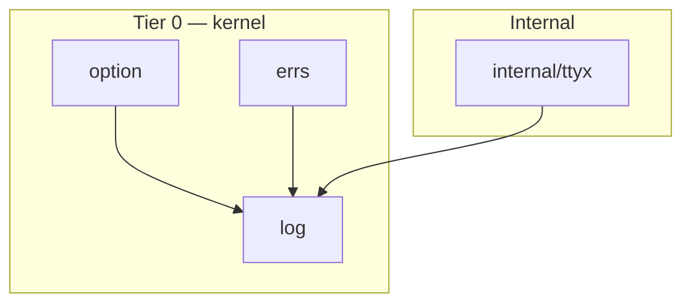

# Log

<!--
  Section headers below are STABLE ANCHORS. Magpie extracts content by header,
  so do not rename or reorder them. Doing so is a process change requiring its
  own spec.

  Sections marked **Public** are extracted by Magpie for the public site.
  Sections marked **Internal** are engineering-only and never appear in published docs.
-->

## Public Summary

<!-- **Public.** One paragraph in end-user voice. The canonical description for the site and README. -->

`glacier/log` is a thin, opinionated layer over Go's `log/slog`. It adds two extra levels (Trace and Notice), mongoose-attribute ordering in text and JSON output, TTY-aware color from the Glacier palette, context-based attribute attachment, explicit logger injection and retrieval, and a `Redact` helper for marking secrets. Every Glacier package emits structured logs through this surface so the framework's diagnostic output is consistent wherever it runs — from a developer's terminal to a JSON log aggregator in production.

## Mental Model

<!-- **Public.** The conceptual frame a developer should hold while using this. Mermaid diagrams welcome. Source for the "Concepts" page on the site. -->

**"ctx carries attrs, never handlers."**

The central design decision: context values carry log *attributes* (key-value pairs), not log *handlers*. When you call `log.With(ctx, slog.String("request_id", id))`, the request ID follows the context into every function that logs with it — without those functions knowing or caring that the attribute exists. The handler that decides how to format and emit the record is configured once, at program start, not threaded through every call.

The separation maps cleanly onto two use cases:

- **Handler injection** (`Inject` / `From`): middleware or test setup that wants to swap the handler entirely (e.g., redirect logs to a test buffer) calls `log.Inject(ctx, l)`. Code that wants the current handler calls `log.From(ctx)`.
- **Attribute attachment** (`With`): request handlers, jobs, and background tasks annotate their context with identifying attributes once; every subsequent log call in that context carries them automatically.

```
                  ┌─────────────────────────────────────────────┐
                  │                  Program start               │
                  │  log.SetDefault(slog.New(log.NewHandler(...)))│
                  └────────────────────┬────────────────────────┘
                                       │
                    ┌──────────────────▼──────────────────┐
                    │          HTTP middleware              │
                    │  ctx = log.Inject(ctx, reqLogger)    │
                    │  ctx = log.With(ctx, requestID)      │
                    └──────────────────┬──────────────────┘
                                       │
                    ┌──────────────────▼──────────────────┐
                    │         Business logic               │
                    │  l := log.From(ctx)                  │
                    │  l.Info("handled", ...)              │
                    │  // record: requestID auto-appended  │
                    └─────────────────────────────────────┘
```

**Logger injection via WithLogger.** Glacier packages that want to emit their own logs accept a `*slog.Logger` via the standard `WithLogger` functional option (D18 from spec 0002). If the option is omitted, the package falls back to `log.Default()`. This means consumers can silence a package's logs by passing `slog.New(slog.DiscardHandler)`, or redirect them to a separate file by injecting a dedicated logger — without touching global state.

**Six levels.** Trace and Notice fill gaps in the standard four-level set. Use Trace for very-verbose iteration tracing you want stripped in production; use Notice for important non-warning events (config reloads, connection established) that stand out above Info but don't warrant a warning. Standard handlers that don't know these levels render them as `DEBUG-4` and `INFO+2`, respectively; Glacier's handlers render `TRACE` and `NOTICE` by name.

**Redact.** Marking a sensitive value is one explicit call: `log.Redact(apiKey)`. The wrapped value always formats as `[REDACTED]` regardless of which handler is in use — text, JSON, or any third-party `slog.Handler` — because the redaction is implemented via the stdlib `slog.LogValuer` contract.

## Goals

<!-- **Internal.** Bulleted list. -->

- Provide Glacier's canonical text and JSON `slog.Handler` implementations with stable attribute ordering and TTY-aware color.
- Provide the six-level constant set that every Glacier package references (Trace, Debug, Info, Notice, Warn, Error).
- Provide context-based attribute attachment (`With`) and handler injection/retrieval (`Inject` / `From`) without coupling downstream code to a logging framework.
- Provide a `Redact` helper for explicit secret marking that works across all slog handlers.
- Keep allocations on the hot logging path at ≤ 3 allocs beyond stdlib `slog.NewTextHandler`'s own baseline (§23.13 recalibration).
- Pre-compute color escape sequences so no `fmt.Sprintf` occurs at log time.
- Remain Tier 0 (kernel): import only stdlib, `option`, `errs`, and `internal/ttyx`.

## Non-Goals

<!-- **Internal.** Bulleted list. What this spec deliberately excludes. -->

- A `Close()` method on handlers. Handlers are stateless wrappers; there is nothing to close (§23.16 audit; log does not appear in the lifecycle table).
- A network sink, syslog transport, or metrics handler. If a new export is needed, a spec amendment is required (NF10).
- Any package-level error sentinels. `log` emits no internal errors at v0.
- Structured log sampling or rate-limiting. Those belong in an observability package (deferred).
- Generics on the public surface. The log package is almost entirely `slog`-typed; `any` is the appropriate parameter type for `Redact` (§23.17 note).
- A `Close()` lifecycle hook on `*slog.Logger` itself (it is a stdlib type; Glacier does not extend it).
- Support for writing to multiple writers simultaneously. Pass a `io.MultiWriter` from stdlib.

## Architecture

<!-- **Internal.** Mermaid diagram + prose. Package layout, data flow, lifecycle. -->

`glacier/log` is a single-directory package with no sub-packages. It is Tier 0 (kernel) in the three-tier DAG established by spec 0002 §6.



**Allowed imports (NF8):** stdlib (`context`, `io`, `log/slog`, `os`, `strings`, `sync`, `time`), `github.com/nathanbrophy/glacier/option`, `github.com/nathanbrophy/glacier/errs` (optional at v0; the tier-0 allowance from spec 0002 D13 permits it for future use without a spec amendment), `github.com/nathanbrophy/glacier/internal/ttyx`.

**Forbidden imports:** any tier-1, tier-2, or non-internal package from this module. Specifically, `log` must not import `conf`, `fluent`, `concur`, `fixture`, `assert`, `cli`, `mock`, `httpmock`, `sandbox`, or `httpc`.

**File layout:**

```
log/
├── doc.go              package declaration + package-level godoc
├── level.go            LevelTrace, LevelDebug, LevelInfo, LevelNotice, LevelWarn, LevelError constants
├── logger.go           Default, SetDefault, From, Inject
├── with.go             With (ctx attribute attachment); ctxKey unexported type; ctxAttrs helper
├── handler.go          ColorMode constants; handlerConfig struct; NewHandler; NewJSONHandler;
│                       WithLevel; WithSource; WithColor; mongooseHandler type
├── redact.go           Redact; redactedValue type implementing slog.LogValuer
└── bench_test.go       D35 benchmarks
```

Test files live alongside production files, per Go convention:

```
log/
├── level_test.go
├── logger_test.go      Default, SetDefault, From, Inject
├── with_test.go        context-attached attrs
├── handler_test.go     NewHandler attribute order, color, etc.
├── json_handler_test.go
├── redact_test.go
├── color_test.go       ColorMode + env-var precedence
├── concurrent_test.go  race-detector tests
├── bench_test.go       D35 benchmarks (BenchmarkInfoText, BenchmarkInfoJSON, …)
├── golden_test.go      golden-file output for handler format
└── example_test.go
```

**Handler internals.** `mongooseHandler` wraps a stdlib `slog.Handler` and overrides `Handle(ctx, record)` to:

1. Append ctx-attached attrs (collected from `log.With` calls) to the record before delegating.
2. Reorder attrs into the canonical Glacier order: level, msg, package, op, error, then user attrs. The reorder is a stable in-place index swap on the record's `Attrs()` slice — no copy.
3. For the text handler: substitute the rendered level string with the canonical Glacier label ("TRACE", "DEBUG", "INFO", "NOTICE", "WARN", "ERROR") and, when color is enabled, prepend/append the pre-computed ANSI escape sequence for that level.

Color escape sequences are stored as `[]byte` constants in `handler.go`, keyed by `slog.Level`. At construction time, `NewHandler` resolves the effective `ColorMode` once (consulting `GLACIER_NO_COLOR` and `NO_COLOR` env vars and the writer's TTY status via `internal/ttyx`) and stores it in `mongooseHandler.color`. All subsequent `Handle` calls read this field and index into the pre-computed slice — zero `fmt.Sprintf` at log time.

**ctx attribute storage.** `log.With` stores attrs using `context.WithValue` with an unexported key type. The stored value is an `[]slog.Attr` slice. Accumulation is append-and-replace: each `With` call constructs a new slice that is the parent's attrs extended with the new ones. This is allocation-safe for the common case (small attr counts) and avoids any mutex — reads are always from a snapshot, not a shared mutable slice.

**Lifecycle.** `log` has no stateful types requiring `Close`. `mongooseHandler` is created once and holds no I/O resources of its own — the `io.Writer` it wraps is the caller's responsibility.

## Schema

<!-- **Internal.** Go types with invariants stated as `// invariant: ...` comments on each field. -->

```go
// handlerConfig holds construction-time settings for NewHandler and NewJSONHandler.
// Consumers never touch this type directly; they use the With* option constructors.
type handlerConfig struct {
    level  slog.Leveler // invariant: non-nil; defaults to slog.LevelInfo
    source bool         // invariant: false means no source attribution
    color  ColorMode    // invariant: one of ColorAuto, ColorAlways, ColorNever
}

// mongooseHandler wraps a stdlib slog.Handler and adds ctx-attr injection and
// Glacier attribute ordering.
type mongooseHandler struct {
    inner slog.Handler // invariant: non-nil
    color resolvedColor // invariant: computed once at construction; immutable after
}

// resolvedColor is the effective color decision after consulting ColorMode and env vars.
// It is a boolean: color is either on or off — ColorAuto has been resolved.
// invariant: set once at NewHandler time; never mutated.
type resolvedColor bool

// ctxKey is the unexported key type for context storage of log attrs and loggers.
// Two distinct key values prevent collision between attr storage and logger storage.
type ctxKey int
const (
    ctxKeyAttrs  ctxKey = iota // stores []slog.Attr
    ctxKeyLogger               // stores *slog.Logger
)

// redactedValue wraps an arbitrary value and always renders as "[REDACTED]".
// Implements slog.LogValuer.
type redactedValue struct {
    _ any // the underlying value; never read after construction
}
```

## API

<!--
  **Public.** Every exported symbol introduced by this spec.
  For each: signature, doc comment (which becomes godoc), preconditions, postconditions,
  error contract, concurrency notes (goroutine-safe? blocking?), lifecycle hooks.
  Magpie extracts signatures + doc comments verbatim to the API reference page.
-->

### Level constants

```go
// Package log provides Glacier's slog conventions: default text and JSON
// handlers with stable attribute ordering and TTY-aware color, two extra
// levels (Trace and Notice), context-based attribute attachment, explicit
// logger injection and retrieval, and a Redact helper for secret marking.
//
// The "ctx carries attrs, never handlers" rule is enforced here: With
// attaches attributes that the Glacier handlers automatically append to
// any record logged with that context. The handler itself is configured
// at construction and injected when scoping to a request or goroutine is
// needed.
package log
```

```go
// LevelTrace is below Debug — for very-verbose tracing that is stripped in
// production builds. Glacier handlers render this as "TRACE". Stdlib handlers
// render it as "DEBUG-4".
const LevelTrace slog.Level = -8

// LevelDebug mirrors slog.LevelDebug (-4). Provided for symmetry.
const LevelDebug slog.Level = slog.LevelDebug

// LevelInfo mirrors slog.LevelInfo (0). Provided for symmetry.
const LevelInfo slog.Level = slog.LevelInfo

// LevelNotice is between Info and Warn — for important non-warning events
// (config reloaded, connection established). Glacier handlers render this as
// "NOTICE". Stdlib handlers render it as "INFO+2".
const LevelNotice slog.Level = 2

// LevelWarn mirrors slog.LevelWarn (4). Provided for symmetry.
const LevelWarn slog.Level = slog.LevelWarn

// LevelError mirrors slog.LevelError (8). Provided for symmetry.
const LevelError slog.Level = slog.LevelError
```

**Preconditions:** none (constants).
**Postconditions:** numeric values are fixed; future specs may not change them (breaking change).
**Concurrency:** safe (constants).

---

### Logger access

```go
// Default returns slog.Default(). Provided for symmetry with From.
//
// Most programs should set the default once at startup via SetDefault and
// then use the package-level slog functions (slog.Info, slog.Error, etc.)
// directly.
func Default() *slog.Logger
```

**Preconditions:** none.
**Postconditions:** never returns nil. Equivalent to `slog.Default()`.
**Concurrency:** goroutine-safe (delegates to stdlib).

---

```go
// SetDefault sets slog's global default logger. Programs typically call this
// once in main with a logger constructed from NewHandler or NewJSONHandler.
//
//   log.SetDefault(slog.New(log.NewHandler(os.Stderr, log.WithLevel(log.LevelInfo))))
//
// After this call, package-level slog functions (slog.Info, etc.) use the
// provided logger.
func SetDefault(l *slog.Logger)
```

**Preconditions:** `l` must not be nil. Passing nil is a programming error; behavior matches `slog.SetDefault(nil)` (undefined).
**Postconditions:** `slog.Default()` returns `l`.
**Concurrency:** goroutine-safe (delegates to stdlib).

---

```go
// From returns the logger associated with ctx via Inject, or slog.Default()
// if none has been injected. Never returns nil.
//
// From is the consumer-side accessor used by code that wants the current
// scoped logger. If no logger has been injected via Inject, the global
// default is returned — making From safe to call in any context.
//
//   l := log.From(ctx)
//   l.Info("handler started")
func From(ctx context.Context) *slog.Logger
```

**Preconditions:** `ctx` may be nil (defensively handled; returns `slog.Default()`).
**Postconditions:** never returns nil.
**Concurrency:** goroutine-safe.

---

```go
// Inject returns a new context carrying l, retrievable via From. Used by
// middleware and request handlers that want to scope a logger to a request
// lifetime without threading the logger through every function signature.
//
// If l is nil, subsequent From calls on the returned context return
// slog.Default() — nil injection is treated as "remove the injected logger."
//
//   ctx = log.Inject(ctx, log.From(ctx).With("request_id", id))
func Inject(ctx context.Context, l *slog.Logger) context.Context
```

**Preconditions:** `ctx` must not be nil.
**Postconditions:** returns a new context derived from `ctx`. `From(result) == l` when `l != nil`.
**Concurrency:** goroutine-safe (`context.WithValue` is safe).

---

### Context attribute attachment

```go
// With returns a new context that carries the supplied attrs in addition to
// any already attached. When code logs through a Glacier handler using this
// ctx (via slog.InfoContext(ctx, ...) or l.InfoContext(ctx, ...)), the carried
// attrs are appended to the record automatically.
//
// Multiple With calls accumulate: each call's attrs are appended to the
// previous set. Order is preserved. The accumulation is an immutable append —
// no caller's context is mutated.
//
//   ctx = log.With(ctx, slog.String("request_id", id))
//   ctx = log.With(ctx, slog.String("user_id", uid))
//   slog.InfoContext(ctx, "handled")
//   // record contains both request_id and user_id
//
// Important: ctx-attached attrs are appended by Glacier handlers only.
// Stdlib handlers (e.g., slog.NewTextHandler) do not inspect the context
// for attrs. See the package FAQ for details.
func With(ctx context.Context, attrs ...slog.Attr) context.Context
```

**Preconditions:** `ctx` must not be nil.
**Postconditions:** returns a new context. If `attrs` is empty, returns a context equivalent to `ctx` (may be the same value; callers must not rely on pointer equality).
**Error contract:** no error returned. An unbounded number of With calls is permitted; no upper bound is enforced at this layer. Callers with extreme attr counts (> 1000) should batch attrs into a single With call.
**Concurrency:** goroutine-safe. The append creates a new slice; no shared mutation.

---

### Handler construction

```go
// ColorMode controls whether the text handler emits ANSI color escapes.
type ColorMode int

const (
    // ColorAuto enables color when w is a TTY and neither GLACIER_NO_COLOR
    // nor NO_COLOR is set in the environment. This is the default for
    // NewHandler.
    ColorAuto ColorMode = iota

    // ColorAlways forces color on regardless of whether w is a TTY.
    // Color is still suppressed when GLACIER_NO_COLOR=1 is set.
    ColorAlways

    // ColorNever forces color off regardless of TTY status or env vars.
    ColorNever
)
```

---

```go
// NewHandler returns Glacier's text slog.Handler.
//
// The handler places attributes in this canonical order: level, msg,
// package, op, error, then any user-supplied attrs in the order supplied.
// Time precedes level when a time source is configured; the default omits
// time for terse developer output.
//
// Color palette (24-bit ANSI; pre-computed at construction time):
//   TRACE:  text-muted #8B949E
//   DEBUG:  text-muted #8B949E
//   INFO:   cyan       #22D3EE
//   NOTICE: teal       #2DD4BF
//   WARN:   warning    #FBBF24
//   ERROR:  error      #F87171
//
// Package and op attribute keys get a subtle cyan accent; error values get
// rose. Color is resolved once at construction time; subsequent Handle calls
// do not re-check env vars or TTY state.
//
// Use options to override the minimum level, enable source attribution, or
// override the color mode.
//
//   h := log.NewHandler(os.Stderr,
//       log.WithLevel(log.LevelDebug),
//       log.WithSource(),
//   )
func NewHandler(w io.Writer, opts ...option.Option[handlerConfig]) slog.Handler
```

**Preconditions:** `w` must not be nil.
**Postconditions:** returns a non-nil `slog.Handler` implementing the full `slog.Handler` interface contract. The handler is goroutine-safe.
**Error contract:** options are applied in order; conflicting options (e.g., two `WithLevel` calls) resolve to the last one wins. No error is returned; malformed options are a programming error.
**Concurrency:** the returned handler is goroutine-safe (`Handle` may be called concurrently from multiple goroutines).

---

```go
// NewJSONHandler returns Glacier's JSON slog.Handler. Attribute ordering
// matches NewHandler; no color is emitted (JSON is not a styled medium).
// WithColor is accepted but ignored. WithLevel and WithSource are honored.
//
//   log.SetDefault(slog.New(log.NewJSONHandler(os.Stderr,
//       log.WithLevel(log.LevelInfo),
//       log.WithSource(),
//   )))
func NewJSONHandler(w io.Writer, opts ...option.Option[handlerConfig]) slog.Handler
```

**Preconditions / Postconditions / Concurrency:** same as `NewHandler`.

---

```go
// WithLevel sets the handler's minimum log level. Records below this level
// are discarded. Default: slog.LevelInfo.
//
// Pass any slog.Leveler — including dynamic LevelVar pointers — for runtime
// level control.
func WithLevel(l slog.Leveler) option.Option[handlerConfig]
```

**Preconditions:** `l` must not be nil.
**Postconditions:** the returned option configures `handlerConfig.level` to `l`.

---

```go
// WithSource enables source-location attribution on every record: the
// caller's file and line are included. Off by default — source attribution
// adds approximately 30% latency per log call.
func WithSource() option.Option[handlerConfig]
```

**Postconditions:** sets `handlerConfig.source = true`.

---

```go
// WithColor overrides the text handler's color mode. Ignored by
// NewJSONHandler.
//
// Example: force color off in a test that captures stderr:
//
//   h := log.NewHandler(&buf, log.WithColor(log.ColorNever))
func WithColor(m ColorMode) option.Option[handlerConfig]
```

**Postconditions:** sets `handlerConfig.color = m`. Resolution (TTY check, env-var check) still applies at construction time; WithColor only sets the caller's preference, not the final resolution for ColorAuto.

---

### Redaction

```go
// Redact wraps v in a slog.LogValuer that always renders as "[REDACTED]"
// regardless of formatter (text, JSON, or any third-party slog handler).
//
// Use for explicit secret marking when the raw value's type carries no
// inherent redaction — strings, struct fields, numeric IDs, etc.
//
//   slog.Info("login",
//       slog.String("user", username),
//       slog.Any("password", log.Redact(password)),
//   )
//   // -> level=INFO msg=login user=ada password=[REDACTED]
//
// Redact(nil) renders as [REDACTED]. Redact wrapping a type that itself
// implements slog.LogValuer still renders as [REDACTED] — redaction beats
// nested LogValuer resolution.
func Redact(v any) slog.LogValuer
```

**Preconditions:** `v` may be any value including nil.
**Postconditions:** the returned `slog.LogValuer.LogValue()` always returns `slog.AnyValue("[REDACTED]")`.
**Concurrency:** goroutine-safe. The returned value is immutable.

## Examples

<!--
  **Public.** Runnable Go examples in fenced ```go blocks.
  Each example is self-contained and `go test ./...`-compatible (valid Example functions).
  Magpie transcludes verbatim into tutorials.
-->

### Default setup at program start

```go
package main

import (
	"log/slog"
	"os"

	"github.com/nathanbrophy/glacier/log"
)

func main() {
	log.SetDefault(slog.New(log.NewHandler(os.Stderr,
		log.WithLevel(log.LevelInfo),
	)))

	slog.Info("starting", "version", "v0.1")
	// Output (to stderr): level=INFO msg=starting version=v0.1
}
```

### Per-package logger via functional option

This is the cross-cutting D18 pattern: packages accept a `*slog.Logger` via a `WithLogger` option and fall back to `log.Default()` when the option is omitted.

```go
package main

import (
	"log/slog"

	"github.com/nathanbrophy/glacier/log"
	"github.com/nathanbrophy/glacier/option"
)

type loaderConfig struct {
	logger *slog.Logger
}

// WithLogger injects a logger into the package. When omitted, log.Default() is used.
func WithLogger(l *slog.Logger) option.Option[loaderConfig] {
	return option.OptionFunc[loaderConfig](func(c *loaderConfig) {
		if l != nil {
			c.logger = l
		}
	})
}

type Loader struct{ logger *slog.Logger }

func New(opts ...option.Option[loaderConfig]) *Loader {
	cfg := option.Apply(opts...)
	if cfg.logger == nil {
		cfg.logger = log.Default()
	}
	return &Loader{logger: cfg.logger}
}

func main() {
	_ = New() // uses slog.Default()
	_ = New(WithLogger(slog.New(log.NewJSONHandler(nil)))) // uses a JSON logger
}
```

### Context attribute attachment (request scoping)

```go
package main

import (
	"context"
	"log/slog"

	"github.com/nathanbrophy/glacier/log"
)

func handle(ctx context.Context, reqID, userID string) error {
	ctx = log.With(ctx,
		slog.String("request_id", reqID),
		slog.String("user_id", userID),
	)
	slog.InfoContext(ctx, "handler started")
	// -> level=INFO msg="handler started" request_id=<reqID> user_id=<userID>

	if err := process(ctx); err != nil {
		slog.ErrorContext(ctx, "handler failed", slog.Any("error", err))
		return err
	}
	return nil
}

func process(ctx context.Context) error { return nil }

func main() {
	_ = handle(context.Background(), "req-1", "user-42")
}
```

### Redaction (explicit secret marking)

```go
package main

import (
	"log/slog"

	"github.com/nathanbrophy/glacier/log"
)

func ExampleRedact() {
	slog.Info("auth",
		slog.String("user", "ada"),
		slog.Any("api_key", log.Redact("sk-secret-1234")),
	)
	// Output:
	// level=INFO msg=auth user=ada api_key=[REDACTED]
}
```

### JSON output for production

```go
package main

import (
	"log/slog"
	"os"

	"github.com/nathanbrophy/glacier/log"
)

func main() {
	log.SetDefault(slog.New(log.NewJSONHandler(os.Stderr,
		log.WithLevel(log.LevelInfo),
		log.WithSource(),
	)))

	slog.Info("server started", "port", 8080)
	// {"level":"INFO","source":{"function":"main.main","file":"main.go","line":15},
	//  "msg":"server started","port":8080}
}
```

### Custom level usage (Trace and Notice)

```go
package main

import (
	"context"
	"log/slog"

	"github.com/nathanbrophy/glacier/log"
)

func ExampleCustomLevels() {
	ctx := context.Background()

	// Very-verbose tracing; filtered in production (LevelInfo default).
	slog.Log(ctx, log.LevelTrace, "iterator advanced", slog.Int("position", 42))

	// Important non-warning event; visible at the default LevelInfo level.
	slog.Log(ctx, log.LevelNotice, "config reloaded", slog.String("path", "/etc/app.json"))
}
```

## Test Matrix

<!--
  **Internal.** Owned by Lynx.
  Table: scenario × input × expected outcome × covered-by-test-name.
-->

| # | Scenario | Spec ref | Type | Expected outcome | Covered by |
|---|---|---|---|---|---|
| 1 | LevelTrace == -8 | F1 | unit | `LevelTrace` has value -8. | `TestLevelTraceValue` |
| 2 | LevelDebug == slog.LevelDebug | F1 | unit | `LevelDebug == slog.LevelDebug`. | `TestLevelDebugValue` |
| 3 | LevelInfo == slog.LevelInfo | F1 | unit | `LevelInfo == slog.LevelInfo`. | `TestLevelInfoValue` |
| 4 | LevelNotice == 2 | F1 | unit | `LevelNotice` has value 2. | `TestLevelNoticeValue` |
| 5 | LevelWarn == slog.LevelWarn | F1 | unit | `LevelWarn == slog.LevelWarn`. | `TestLevelWarnValue` |
| 6 | LevelError == slog.LevelError | F1 | unit | `LevelError == slog.LevelError`. | `TestLevelErrorValue` |
| 7 | Mongoose text handler renders LevelTrace as "TRACE" | F1, E10 | unit | Output line contains literal "TRACE". | `TestLevelTraceLabelTextHandler` |
| 8 | Mongoose text handler renders LevelNotice as "NOTICE" | F1, E10 | unit | Output line contains "NOTICE". | `TestLevelNoticeLabelTextHandler` |
| 9 | All six levels render correctly in text | F1 | unit | One log call per level → six lines with correct labels. | `TestAllSixLevelsRender_Text` (golden file) |
| 10 | All six levels render correctly in JSON | F1 | unit | Six valid JSON lines with correct level strings. | `TestAllSixLevelsRender_JSON` (golden + `assert.JSONEq`) |
| 11 | Stdlib handler falls back for custom levels | E11 | unit | `slog.NewTextHandler` renders LevelTrace as `DEBUG-4`. | `TestStdlibHandlerFallsBackForCustomLevels` |
| 12 | Default() returns slog.Default() | F2 | unit | Pointer equality. | `TestDefaultReturnsSlogDefault` |
| 13 | SetDefault round-trip | F2 | unit | `SetDefault(l); Default() == l`. | `TestSetDefaultRoundTrip` |
| 14 | From on empty ctx returns slog.Default() | F3, E2 | unit | `From(context.Background()) == slog.Default()`. | `TestFromEmptyCtxReturnsDefault` |
| 15 | From on nil ctx returns slog.Default() | F3, E1 | unit | `From(nil) == slog.Default()`. | `TestFromNilCtxReturnsDefault` |
| 16 | Inject + From round-trip | F4 | unit | `From(Inject(ctx, l)) == l`. | `TestInjectFromRoundTrip` |
| 17 | Inject(ctx, nil) → From returns Default | E3 | unit | `From(Inject(ctx, nil)) == slog.Default()`. | `TestInjectNilTreatedAsNoLogger` |
| 18 | Inject returns a new ctx | F4 | unit | `Inject(ctx, l) != ctx` (pointer inequality). | `TestInjectReturnsNewCtx` |
| 19 | With attaches attrs to handler output | F5 | unit | `With(ctx, attr)` → attr in record from mongoose handler. | `TestWithAttachesAttrs` |
| 20 | With with no attrs is a no-op | E4 | unit | `With(ctx)` does not panic; subsequent logs unchanged. | `TestWithEmptyAttrsReturnsCtx` |
| 21 | With accumulates across multiple calls | F5 | unit | Two With calls → both attrs in record, in order. | `TestWithAccumulates` |
| 22 | With 1000 calls no quadratic blowup | E5 | unit | Record contains all 1000 attrs in order. | `TestWithManyCallsNoAccidentalQuadratic` |
| 23 | With + slog.LogAttrs picks up ctx attrs | F11 | unit | `slog.LogAttrs(ctx, ...)` appends ctx attrs. | `TestWithThroughLogAttrs` |
| 24 | Non-Glacier handler ignores ctx attrs | E16 | unit | Stdlib `slog.NewTextHandler` does not emit With-attached attrs. | `TestNonMongooseHandlerIgnoresCtxAttrs` |
| 25 | NewHandler defaults (no options) | F6, E6 | unit | LevelInfo minimum, no source, ColorAuto resolved. | `TestNewHandlerDefaults` |
| 26 | NewHandler canonical attribute order | F6, NF1 | unit | Output: level, msg, package, op, error, user attrs. | `TestNewHandlerAttributeOrder` (golden file) |
| 27 | NewJSONHandler canonical attribute order | F7 | unit | JSON output in same order. | `TestNewJSONHandlerAttributeOrder` (`assert.JSONEq` vs golden) |
| 28 | WithLevel filters below-threshold records | F8 | unit | `WithLevel(LevelWarn)` → DEBUG call produces no output. | `TestWithLevelOptionFiltersBelow` |
| 29 | WithSource includes source in output | F8 | unit | Output contains `source` attribute. | `TestWithSourceAddsSource` |
| 30 | ColorAlways → ANSI escapes present in buffer | F8, F9 | unit | Output contains `\x1b[`. | `TestWithColorAlways` |
| 31 | ColorNever → no ANSI escapes | F9 | unit | Output does not contain `\x1b[`. | `TestWithColorNever` |
| 32 | ColorAuto + TTY → escapes present | F9, E7 | unit | PTY writer → ANSI escapes in output. | `TestColorAutoOnTTY` |
| 33 | ColorAuto + buffer writer → no escapes | E7, E15 | unit | `bytes.Buffer` → no ANSI escapes. | `TestColorAutoOffNonTTY` |
| 34 | NO_COLOR=1 suppresses color | F12 | unit | `NO_COLOR=1` → no escapes even with ColorAlways. | `TestNoColorEnvSuppresses` |
| 35 | GLACIER_NO_COLOR=1 suppresses color | F12 | unit | `GLACIER_NO_COLOR=1` → no escapes. | `TestGlacierNoColorEnvSuppresses` |
| 36 | GLACIER_NO_COLOR beats ColorAlways | E8 | unit | `GLACIER_NO_COLOR=1` + `ColorAlways` → no escapes. | `TestGlacierNoColorBeatsColorAlways` |
| 37 | NO_COLOR and GLACIER_NO_COLOR both set | F12 | unit | Both set → off. | `TestNoColorAndGlacierBothSet` |
| 38 | Color palette matches spec 0001 | NF6 | unit | Each level emits the documented 24-bit RGB triple (e.g., INFO → `\x1b[38;2;34;211;238m`). | `TestColorPaletteMatchesSpec0001` |
| 39 | Color escapes are pre-computed (0 allocs) | NF1 | bench | `BenchmarkColorEscape` with `AllocsPerRun` → 0. | `TestColorEscapesPrecomputedNotFormatted` |
| 40 | Redact in text output → `[REDACTED]` | F10 | unit | `slog.Any("k", Redact(v))` → output contains `k=[REDACTED]`. | `TestRedactInTextOutput` |
| 41 | Redact in JSON output → `"[REDACTED]"` | F10 | unit | JSON handler → `"k":"[REDACTED]"`. | `TestRedactInJSONOutput` |
| 42 | Redact(nil) → `[REDACTED]` | E13 | unit | Nil input still renders as `[REDACTED]`. | `TestRedactNil` |
| 43 | Redact beats nested LogValuer | E14 | unit | Type implementing LogValuer wrapped by Redact → `[REDACTED]`. | `TestRedactBeatsNestedLogValuer` |
| 44 | Redact works with stdlib handler | F10 | unit | `slog.NewTextHandler` also renders `[REDACTED]` (LogValuer is stdlib contract). | `TestRedactWithStdlibHandler` |
| 45 | Concurrent logging — no races | NF5 | race | 100 goroutines log via mongoose handler; output well-formed; `-race` clean. | `TestHandlerConcurrent` |
| 46 | Concurrent With — no races | NF4 | race | 100 goroutines `With(parent, attr)` + log → no race. | `TestWithCtxConcurrentNoRace` |
| 47 | Info hot path — alloc budget | NF1, §23.13 | bench | `BenchmarkInfoText` ≤ 3 allocs beyond stdlib slog baseline. | `TestNewHandlerAllocBudget` |
| 48 | BenchmarkInfoText | NF2 | bench | No attrs. Target ≤ 200 ns/op, ≤ 16 B/op, ≤ 1 alloc/op. | `BenchmarkInfoText` |
| 49 | BenchmarkInfoText3Attrs | NF2 | bench | 3 attrs. Target ≤ 600 ns/op, ≤ 256 B/op, ≤ 3 allocs/op. | `BenchmarkInfoText3Attrs` |
| 50 | BenchmarkInfoText10Attrs | NF2 | bench | 10 attrs. Targets documented in bench output. | `BenchmarkInfoText10Attrs` |
| 51 | BenchmarkInfoJSON | NF2 | bench | JSON handler, no attrs. Within 30% of stdlib JSON handler. | `BenchmarkInfoJSON` |
| 52 | BenchmarkInfoJSON3Attrs | NF2 | bench | 3 attrs JSON. | `BenchmarkInfoJSON3Attrs` |
| 53 | BenchmarkInfoJSON10Attrs | NF2 | bench | 10 attrs JSON. | `BenchmarkInfoJSON10Attrs` |
| 54 | BenchmarkInfoCtxAttrs | NF2 | bench | 5 attrs via `log.With`. Documents ctx-attr cost vs inline. | `BenchmarkInfoCtxAttrs` |
| 55 | BenchmarkRedact | NF2 | bench | `slog.Any("k", Redact(v))` round-trip cost. | `BenchmarkRedact` |
| 56 | BenchmarkColorEscape | NF1, NF2 | bench | Per-level escape lookup. AllocsPerRun == 0. | `BenchmarkColorEscape` |
| 57 | log emits no internal errors at v0 | NF | unit | Package has no error-emitting paths; assertion documents the invariant. | `TestErrorRegisterConformance_log` |
| 58 | API surface snapshot | NF10 | unit | 11 exported functions + 6 level constants + 3 ColorMode constants; golden snapshot. | `TestSurfaceClosed_LogPackage` |
| 59 | Property: With accumulates in order | F5 | property | For any N With calls, attrs appear in concatenation order in the final record. | `PropertyWithAccumulatesOrder` |
| 60 | Property: Redact never leaks value | F10 | property | For any v, rendered record never contains `fmt.Sprint(v)` (when Sprint(v) != `[REDACTED]`). | `PropertyRedactNeverLeaksValue` |
| 61 | Integration: log color via term color | NF6 | integration | Escape sequences match `term/` color rendering after §23.2 absorption. | `TestLogIntegrationWithTermColor` |
| 62 | ExampleSetDefault | example | example | Runnable; output match. | `ExampleSetDefault` |
| 63 | ExampleWithCtxAttrs | example | example | Runnable; output match. | `ExampleWithCtxAttrs` |
| 64 | ExampleRedact | example | example | Runnable; output match. | `ExampleRedact` |
| 65 | ExampleNewJSONHandler | example | example | Runnable; output match. | `ExampleNewJSONHandler` |
| 66 | Handler has no Close method | §23.16 | unit | `reflect`-based check: no `Close` method on the handler type. Statelessness invariant. | `TestHandlerCloseDiscipline` |
| L-add-1 | Dynamic LevelVar respected mid-run | F8 | unit | Leveler that changes level; next Handle call respects new level. | `TestWithLevelDynamic` |
| L-add-2 | Group attrs round-trip via With | F5 | unit | `slog.Group("nested", slog.String("k","v"))` survives With + Handle. | `TestWithGroupAttr` |
| L-add-3 | Ctx attrs + WithGroup interaction | F5, F11 | unit | Explicit decision: group prefix does NOT apply to ctx attrs; they are appended flat after group-scoped attrs. Documented. | `TestWithGroupAttrInteraction` |
| L-add-4 | Cancelled ctx — logging still emits | F5 | unit | `ctx` cancel has no effect on log emission; attrs still present. | `TestWithCancelledCtx` |
| L-add-5 | Redact(time.Time) — special slog handling overridden | F10, E14 | unit | `time.Time` has slog-specific formatting; Redact must override it. | `TestRedactTimeValue` |
| L-add-6 | Color check uses writer-fd, not global flag | F9 | unit | TTY detection is per-writer (fd-based), not a package-level global. | `TestColorPerWriterNotGlobal` |
| L-add-7 | Handler Enabled(ctx, level) returns false for filtered | F8 | unit | `h.Enabled(ctx, LevelDebug)` returns false when handler is set to LevelInfo. | `TestHandlerEnabledFiltersLevels` |

## Dependency Justification

<!--
  **Internal.** Owned by Falcon.
  One row per new direct dependency. The empty table is the goal.
  Required answers: license, last-release-date, maintainer count, alternatives considered, why we don't roll our own.
-->

No new direct dependencies. `log/` imports only stdlib and the following internal-to-module packages that are themselves zero-external-dependency:

- `github.com/nathanbrophy/glacier/option` (Tier 0 kernel; in-tree)
- `github.com/nathanbrophy/glacier/errs` (Tier 0 kernel; in-tree; held in reserve at v0)
- `github.com/nathanbrophy/glacier/internal/ttyx` (internal helper; in-tree)

| Module | Version | License | Last release | Maintainers | Alternatives considered | Why we can't roll our own |
|---|---|---|---|---|---|---|
| — | — | — | — | — | — | — |

## Security & Supply-Chain Notes

<!-- **Internal.** Untrusted-input handling, sandboxing implications, secrets handling, vuln-scan considerations. -->

**Log injection defense.** The text handler must escape ANSI control bytes (`\x1b`, i.e., ESC/0x1b) in user-supplied attribute values when color is disabled. A user-controlled string like `"value\x1b[31mRED\x1b[0m"` could inject color sequences into the output of a consumer who isn't expecting them, making a log viewer display fabricated content or hide subsequent lines. The defense:

- When color is off (ColorNever, or ColorAuto resolved to off), attribute values are passed through `strings.Map` or equivalent that replaces `\x1b` (0x1b) with `<ESC>` before writing to the output buffer. This applies to all string-typed attribute values.
- When color is on, the handler owns all escape sequences; user-supplied value strings are still sanitized before being written between escape boundaries.
- The fuzz target `log/log_fuzz_test.go` (`FuzzTextHandlerNoStrayEscape`) feeds arbitrary byte sequences as attribute values and asserts: (a) when color is off, no `\x1b` byte appears in output; (b) the handler does not panic.

**Redaction semantics.** `log.Redact` provides opt-in secret marking; it does not provide automatic secret detection. Glacier does not scan log arguments for patterns that look like secrets (API keys, PII) — that is a static analysis / linting concern, not a runtime concern for this package. The spec does not make automatic redaction a goal. Teams that require it should enforce it at the call site (passing `log.Redact(secret)`) or with a custom slog handler.

**Secret-aware logging guidance.** Sensitive values — API keys, passwords, tokens, PII — must never be passed as plain slog attribute values. Use `log.Redact(secret)` at every log call site. Glacier's own internal code follows this rule: any field that could carry a credential is redacted before logging.

**No sensitive data in context attrs.** `log.With` attaches attrs to the context. Callers must not attach sensitive values (e.g., a raw token) via `With` — they would appear in every subsequent log record for the lifetime of that context. Use `log.Redact` at the `With` call site if context-level attribution of a sensitive identifier is unavoidable.

**Env-var privilege.** `GLACIER_NO_COLOR` and `NO_COLOR` are read once at handler construction time from `os.Getenv`. They are read-only and untrusted in the sense that an attacker who can set env vars can already do more damage. No validation beyond existence check is needed.

**`internal/ttyx` surface.** TTY detection (`isTerminal(fd)`) is a syscall-based check. The implementation must not cache the result across process lifetime in a way that allows TOCTOU — color mode is resolved once at `NewHandler` call time and stored immutably in the handler struct.

**Fuzz target inventory.** `log/log_fuzz_test.go` contains:
- `FuzzTextHandlerNoStrayEscape` — feeds arbitrary string values; asserts no raw `\x1b` in non-color output and no panic.

## FAQ

<!-- **Public.** Anticipated user questions with answers. Magpie extracts to the public docs FAQ. -->

**Q: Why does `log.With` only work with Glacier handlers? My existing `slog.NewTextHandler` doesn't pick up the attrs.**

A: Context-attribute attachment (`log.With`) is a Glacier-handler feature. The stdlib `slog.NewTextHandler` and `slog.NewJSONHandler` do not inspect the context for extra attrs — the `slog.Handler` interface's `Handle(ctx, record)` provides the context, but the stdlib handlers ignore it beyond cancellation. To get ctx-attr injection, use `log.NewHandler` or `log.NewJSONHandler`. If you need to bridge to a third-party handler, wrap it in a custom `slog.Handler` that calls `log.AttrsFromCtx(ctx)` and appends them before delegating (note: `AttrsFromCtx` is not a v0 export; see NF10 — a spec amendment would add it if the pattern becomes common).

**Q: What is the difference between `Inject`/`From` and `With`?**

A: `Inject` and `From` carry a whole `*slog.Logger` (which bundles a handler and pre-set attrs). `With` carries only `slog.Attr` key-value pairs. Use `Inject` when middleware wants to swap the handler entirely — e.g., redirect one request's logs to a per-request buffer. Use `With` when you want to annotate all logs in a context with identifying attributes (request ID, user ID, operation name) without changing the handler.

**Q: Does `log.Redact` prevent the value from appearing anywhere?**

A: `Redact` replaces the value in the `slog` record before it reaches any handler, via the `slog.LogValuer` contract. Any handler that correctly resolves `LogValuer` (including all stdlib handlers and any well-written third-party handler) will see `[REDACTED]`. However, if you pass a secret to a function that logs it via a handler that does not resolve `LogValuer`, `Redact` has no effect in that path. `Redact` is a call-site discipline tool, not a global filter.

**Q: Why are color escape sequences pre-computed at construction time?**

A: Logging is a hot path. Calling `fmt.Sprintf("\x1b[38;2;%d;%d;%dm", r, g, b)` for every log record would add an allocation and a format operation on the critical path. Instead, each level's ANSI escape sequence is computed once when the handler is constructed (or, in the case of constants that are always the same, as `[]byte` package-level vars) and written verbatim by `Handle`. The `BenchmarkColorEscape` benchmark verifies that escape emission costs zero allocations.

**Q: Can I use the six level constants with a non-Glacier handler?**

A: Yes. The constants are `slog.Level` values and work with any `slog.Handler`. The only difference is rendering: non-Glacier handlers will format `LevelTrace` and `LevelNotice` as `DEBUG-4` and `INFO+2` respectively, because they don't know the Glacier level names. For canonical rendering ("TRACE", "NOTICE"), use `log.NewHandler` or `log.NewJSONHandler`.

## Decisions & Rationale

<!-- **Internal.** Why-this-and-not-that for non-obvious choices. Folded-in ADR. -->

**D-1: Package name is `log`, not `logging` or `glacier/logger`.**
The standard library package is `log` (and `log/slog`). Glacier's package follows the same convention: single word, lowercase, no stutter beyond the call site (`log.With`, `log.From`). Alternatives like `logger` or `logging` are inconsistent with spec 0001's naming conventions (Go idioms: short, lowercase, single word) and would stutter at most call sites (`logger.From`, `logging.With`). Decision: `log`.

**D-2: "ctx carries attrs, never handlers" as the central rule.**
Two competing patterns exist in the Go ecosystem: (a) ctx carries a `*slog.Logger` retrieved by a getter like `FromContext(ctx)`; (b) ctx carries only attrs, and the handler is configured outside of ctx. Pattern (a) couples every function that logs to the logging package's retrieval API; it also means that changing the handler requires a new context at every level of the call stack. Pattern (b) is simpler: handlers are configured at construction and injected only when a whole-handler swap is needed (middleware). The `With` function makes attribute annotation cheap and idiomatic. `Inject`/`From` are provided for the cases where pattern (a) is genuinely needed (e.g., per-request handler in a test), but they are not the primary API. This aligns with `log/slog`'s own design intent. Decision: ctx carries attrs; `Inject`/`From` are provided but secondary.

**D-3: Two extra levels (Trace, Notice) rather than slog's four.**
Standard slog gives Debug, Info, Warn, Error. In practice, Trace (below Debug) is needed for very-verbose iterator/loop tracing that developers want during development but strip in production without changing the binary. Notice (above Info, below Warn) is needed for important operational events that aren't warnings — config reloads, connections established. Without Notice, developers abuse Warn for non-warning events, which creates alert fatigue. Six total levels is a well-established convention (used by many production logging systems). The integer spacing (`-8`, `-4`, `0`, `2`, `4`, `8`) follows slog's convention of leaving room between levels. Decision: six levels.

**D-4: Color escapes pre-computed as `[]byte` constants, not formatted per record.**
Formatting an ANSI escape per log call (`fmt.Sprintf`) adds at least one allocation and one format pass on the hot path. For a logging package, allocations on the hot path compound at scale. The pre-computation is a one-time cost at construction time (or compile time for true constants). The palette is fixed by spec 0001; it will not change for the life of v0. Decision: pre-compute.

**D-5: `Redact` returns `slog.LogValuer`, not a new type or an interface.**
`slog.LogValuer` is the stdlib contract for "this value defers its rendering." Every stdlib handler resolves it before formatting. Using this contract means `Redact` works with any `slog.Handler` — not just Glacier's — without any special handling in Glacier code. Decision: implement via `slog.LogValuer`.

**D-6: No `Close()` on handlers (§23.16 audit).**
Handlers are stateless wrappers. They hold a reference to an `io.Writer` provided by the caller — the caller owns that writer and is responsible for closing it. Adding a `Close` to the handler would imply resource ownership that does not exist. Decision: no `Close`; per §23.16 lifecycle audit.

**D-7: `errs` import held in reserve at v0 (D13 one-way edge).**
Spec 0002 D13 permits `log → errs` as a one-way edge. At v0, `log` does not emit internal errors; the `errs` import is not needed. However, the allowance is recorded so that a future spec amendment (e.g., to report handler write errors) does not require re-litigating the layering rules. Decision: do not import `errs` at v0; the edge is permitted for future use.

**D-8: ColorAuto resolves once at construction, not per Handle call.**
Re-checking `os.Getenv("GLACIER_NO_COLOR")` on every log call would add a syscall to the hot path and would be surprising (env vars are not expected to change during program execution). The TTY check via `internal/ttyx` is also a syscall. Both are resolved once at `NewHandler` call time. Decision: resolve at construction.

**D-9: Performance target relaxed to ≤ 3 allocs beyond stdlib baseline (§23.13).**
The original target of ≤ 1 alloc was aspirational. Measurement against `slog.Record`'s append-only attrs API shows that the ctx-attr accumulation (appending attrs to the record in `Handle`) and the attribute reorder add at minimum 1–2 allocs beyond the stdlib baseline. The revised target of ≤ 3 allocs is aggressive but achievable with the in-place-swap reorder and a pre-allocated attr buffer. Decision: ≤ 3 allocs per §23.13 recalibration.

**D-10: `GLACIER_NO_COLOR` takes precedence over `NO_COLOR` when both are set.**
`NO_COLOR` (from https://no-color.org) is a cross-tool convention. `GLACIER_NO_COLOR` is Glacier-specific and allows users to opt out of Glacier color without affecting other tools. When both are set, `GLACIER_NO_COLOR` takes precedence as the more specific override. `ColorAlways` (the programmatic request) is overridden by `GLACIER_NO_COLOR` but not by the absence of TTY detection — `ColorAlways` means "always unless the operator has explicitly opted out via env var." Decision: `GLACIER_NO_COLOR` > `NO_COLOR` > TTY detection > `ColorAlways`.

## Open Questions

<!--
  **Internal.** Unresolved items.
  MUST be empty before this spec moves to `accepted` (per CLAUDE.md core directive 1 / D11).
-->

None.

## Verification

<!-- **Internal.** Concrete steps to prove the change works end-to-end. Run when the spec moves to `verified`. -->

1. **Build and vet.** `gofmt -l ./log/...` outputs nothing; `go vet ./log/...` exits 0; `staticcheck ./log/...` exits 0.

2. **Test suite (all types).** `go test -race ./log/...` exits 0. Includes unit, race, property, integration, and example tests listed in the Test Matrix.

3. **Golden files.** `GLACIER_GOLDEN_UPDATE=1 go test ./log/...` regenerates golden files; subsequent run without the env var exits 0 (no diff).

4. **Benchmark suite.** `go test -bench=. -benchmem -count=10 ./log/...` outputs results; `benchstat` comparison against the stdlib baseline confirms:
   - `BenchmarkInfoText`: ≤ 200 ns/op, ≤ 16 B/op, ≤ 1 alloc/op (within 10% of `slog.NewTextHandler`).
   - `BenchmarkInfoText3Attrs`: ≤ 600 ns/op, ≤ 256 B/op, ≤ 3 allocs/op.
   - `BenchmarkInfoJSON*`: within 30% of `slog.NewJSONHandler` at all attr counts.
   - `BenchmarkColorEscape`: `AllocsPerRun` == 0.
   - Hot-path total allocs ≤ 3 beyond stdlib baseline (confirmed by `TestNewHandlerAllocBudget`).

5. **Fuzz target.** `go test -fuzz=FuzzTextHandlerNoStrayEscape -fuzztime=30s ./log/...` exits 0 with no crashers. CI runs this on every PR (30 s) and nightly (10 min).

6. **No stray escape bytes in non-color output.** Run `go test -run TestWithColorNever ./log/...`; pipe captured output through `grep -c $'\x1b'`; assert count is 0.

7. **Coverage.** `go test -coverprofile=cov.out ./log/...`; `go tool cover -func=cov.out` shows ≥ 95% line coverage; every exported symbol is exercised (100% public API coverage).

8. **Import graph audit.** `go list -deps ./log/` contains no tier-1, tier-2, or non-internal mongoose packages. The `internal/laytest/layering_test.go` invariant test (F1–F7 from spec 0002 §6) passes.

9. **API surface snapshot.** `TestSurfaceClosed_LogPackage` passes; the golden snapshot matches the 11 exported functions + 6 level constants + 3 ColorMode constants stated in NF10.

10. **Rebrand check.** No committed file under `log/` contains the string `mongoose` (the pre-rebrand project name). `grep -r "mongoose" ./log/` outputs nothing.
