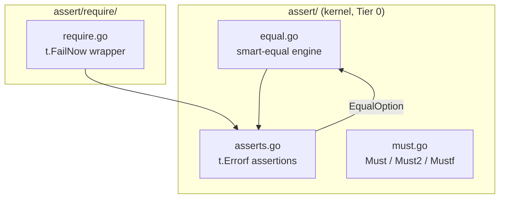

# Assert

<!--
  Section headers below are STABLE ANCHORS. Magpie extracts content by header,
  so do not rename or reorder them. Doing so is a process change requiring its
  own spec.

  Sections marked **Public** are extracted by Magpie for the public site.
  Sections marked **Internal** are engineering-only and never appear in published docs.
-->

## Public Summary

<!-- **Public.** One paragraph in end-user voice. The canonical description for the site and README. -->

`assert` is Glacier's test-assertion and runtime-invariant package — two distinct faces in one kernel package, separated by file. The test face provides assertion functions that report failures via `t.Errorf` and return `bool`, so a test can stack multiple assertions and see every failure in a single run. The runtime face provides `Must`, `Must2`, and `Mustf` helpers that panic at initialization time when an invariant is violated — for `init()` setup and program startup, never for library hot paths. The companion sub-package `assert/require` mirrors every test assertion with `t.FailNow` semantics: import `assert` for "continue on failure," import `require` for "halt on failure." At the heart of both is a smart deep-equality comparator that goes well beyond `reflect.DeepEqual` — pointer-aware, map-order-insensitive, optionally slice-order-insensitive, case-fold-capable, field-selective, float-tolerant, cycle-safe — giving every test a single coherent equality primitive it can trust.

## Mental Model

<!-- **Public.** The conceptual frame a developer should hold while using this. Mermaid diagrams welcome. Source for the "Concepts" page on the site. -->

The package has three conceptually distinct residents that share an import path:

```
assert/
├── asserts.go      — test assertions  (t.Errorf, return bool, never halt)
├── equal.go        — smart-equal engine (fast path + slow path)
├── match.go        — glob / regex matching
├── ordering.go     — Greater, Less, GreaterOrEqual, LessOrEqual, InDelta
├── jsoneq.go       — JSONEq, BytesEq, Subset
├── diff.go         — struct-walking diff for failure messages
└── must.go         — runtime Must helpers (panic on violation)

assert/require/
└── require.go      — thin t.FailNow wrapper around every assert.X
```

**Test assertions** (`asserts.go`, `equal.go`, `match.go`, `ordering.go`, `jsoneq.go`) accept a `TB` interface compatible with `*testing.T`, `*testing.B`, and `*testing.F`. Every assertion calls `t.Helper()`, calls `t.Errorf` on failure, and returns `bool`. Returning `bool` is the key design: a test function can stack ten assertions and see all ten failures rather than stopping at the first. When stopping early is correct — for example, when a nil return would crash the next assertion — the author imports `require` instead.

**Smart equality** is the engine that powers `Equal`, `NotEqual`, `Contains`, `JSONEq`, `Subset`, and the diff renderer. It operates in two tiers:

- *Primitive fast path*: when `T` is `comparable` and `got == want` by the `==` operator, equality is confirmed in ≤ 50 ns/op with zero allocations. No reflection, no recursion.
- *Smart-equal slow path*: for all other cases, the engine walks the value graph via `reflect`. It dereferences pointers, folds map iteration order, optionally treats slices as multisets, applies case folding, tolerates float deltas, skips named fields, invokes custom `Equal(any) bool` methods, and detects pointer cycles via a per-call visited-set. Target: ≤ 200 ns/op for small structs; documented O(n) multiset algorithm for slices.

**`EqualOption`** values configure the slow path. They use the universal `option.Option[T]` pattern — constructed by the five constructor functions (`IgnoreOrder`, `IgnoreCase`, `IgnoreWhitespace`, `WithDelta`, `IgnoreFields`) — and are passed as trailing variadic arguments to `Equal`, `NotEqual`, `JSONEq`, `Contains`, and `Subset`.

**Runtime Must helpers** (`must.go`) are semantically distinct: they do not interact with `testing.TB` at all. They panic on violation. The doc comments on every `Must` variant state: initialization-time invariants only — `package init`, `main()` setup, test harness setup. Never in library hot paths (CLAUDE.md directive 4 prohibits library panics).

**`assert/require`** is a thin sub-package: one file, one import (`assert`), one pattern — call the corresponding `assert.X`, and if it returned `false`, call `t.FailNow()`. The `require` package exports no types of its own and declares no sentinels. Its only purpose is the `FailNow` semantic.



## Goals

<!-- **Internal.** Bulleted list. -->

- Provide a complete, idiomatic Go test-assertion library with no external dependencies.
- Provide a smart deep-equality comparator that covers pointer deref, map ordering, optional slice ordering, case folding, float tolerance, field exclusion, custom `Equal` methods, and cycle detection.
- Provide `assert/require` as a thin halt-on-failure mirror, matching the testify split familiar to most Go contributors.
- Provide `Must`, `Must2`, `Mustf` for initialization-time invariants in non-test code.
- Deliver a primitive fast path that bypasses reflection for comparable types matched by `==`, achieving ≤ 50 ns/op zero allocations.
- Dogfood: Glacier's own packages use `assert` and `assert/require` in every test — never `testify`, never bare `if got != want`.
- Keep total production LOC ≤ 1100 and test LOC ≤ 1500, the largest kernel package by surface area.

## Non-Goals

<!-- **Internal.** Bulleted list. What this spec deliberately excludes. -->

- Test suite runner, test lifecycle management, or test-doubling beyond assertions. Those live in `mock`, `httpmock`, and `fixture`.
- Code generation for assertion helpers. Every assertion is a hand-written function.
- Extending the surface with new assertions after v0 without a spec amendment. The surface is closed.
- HTTP-level assertions (`StatusCode`, `JSONBody` matchers). Those belong in `httpmock`.
- Approximate matching beyond `InDelta` and `WithDelta`. Statistical assertions are out of scope.
- Diffing of binary data beyond `BytesEq`. Richer diffs are a future spec.
- Parallel test orchestration. That is a property of `testing.T`, not of this package.

## Architecture

<!-- **Internal.** Mermaid diagram + prose. Package layout, data flow, lifecycle. -->

### Package layout

```
assert/
├── doc.go                  — package declaration + package-level doc comment
├── tb.go                   — TB interface declaration
├── equal.go                — Equal[T], NotEqual[T]; smart-equal engine; EqualOption types
├── asserts.go              — True, False, Nil, NotNil, NoError, Error, ErrorIs, ErrorAs,
│                             Contains, Len, Eventually, Halt
├── match.go                — Match; MatchOption types (MatchRegex, MatchIgnoreCase)
├── ordering.go             — Greater[T], Less[T], GreaterOrEqual[T], LessOrEqual[T],
│                             InDelta[T]
├── jsoneq.go               — JSONEq, BytesEq, Subset[T]
├── diff.go                 — failure-message renderer; struct-walking diff with +/-/~ markers;
│                             TTY-aware color via term package
├── must.go                 — Must[T], Must2[A,B], Mustf
├── asserts_test.go         — assertion unit tests (uses bootstrap subset for Equal itself)
├── equal_test.go           — smart-equal exhaustive tests
├── equal_options_test.go   — IgnoreOrder, IgnoreCase, IgnoreWhitespace, WithDelta, IgnoreFields
├── match_test.go           — glob, regex, ignore-case
├── ordering_test.go        — Greater, Less, GreaterOrEqual, LessOrEqual
├── indelta_test.go         — InDelta
├── jsoneq_test.go          — JSONEq
├── bytes_test.go           — BytesEq
├── subset_test.go          — Subset
├── contains_test.go        — Contains
├── len_test.go             — Len
├── eventually_test.go      — Eventually
├── error_test.go           — Error, NoError, ErrorIs, ErrorAs
├── nil_test.go             — Nil, NotNil
├── bool_test.go            — True, False
├── halt_test.go            — Halt
├── must_test.go            — Must, Must2, Mustf
├── diff_test.go            — failure-message diff output
├── concurrent_test.go      — race-detector tests
├── bench_test.go           — D35 + §23.13 fast-path benchmarks
├── fuzz_test.go            — FuzzMatchGlob, FuzzMatchRegex
├── property_test.go        — reflexivity, symmetry, transitivity
└── example_test.go         — runnable godoc examples

assert/require/
├── doc.go                  — package declaration
├── require.go              — one mirror function per assert.X; calls assert.X then t.FailNow
├── require_test.go         — halt-on-failure verification for every mirror
└── example_test.go         — runnable godoc examples
```

### Smart-equal algorithm

The engine lives in `equal.go`. Every `Equal[T any](t TB, got, want T, opts ...EqualOption)` call proceeds as follows:

```
Equal(got, want, cfg):
  1. Primitive fast path:
       if T is comparable AND got == want (by ==): return true immediately.
       (Zero allocations; no reflection. ≤ 50 ns/op target.)

  2. Nil guard:
       if got == nil AND want == nil: return true
       if exactly one is nil: return false

  3. Type check:
       if reflect.TypeOf(got) != reflect.TypeOf(want): return false

  4. Custom method:
       if got implements interface{ Equal(any) bool }: use got.Equal(want)

  5. Reflect kind switch:
       Pointer    → deref both, recurse on pointee (with cycle detection)
       Map        → all want keys present in got (IgnoreCase folds keys);
                    recurse on values
       Slice/Array→ if cfg.ignoreOrder: multiset compare (O(n) hash bucket);
                    else: len-check then elementwise recurse
       Struct     → for each exported field not in cfg.ignoreFields, recurse;
                    respect cfg.delta for float32/float64 fields
       String     → if cfg.ignoreCase: strings.EqualFold;
                    if cfg.ignoreWhitespace: normalize then compare;
                    else: direct ==
       Float32/64 → if cfg.deltaSet: |got - want| <= cfg.delta; else ==
       Interface  → unwrap dynamic value, recurse
       Chan/Func  → pointer identity (no deeper semantics)
       default    → reflect.DeepEqual fallback
```

Cycle detection uses a `map[[2]uintptr]bool` keyed by the ordered pair of pointer addresses, scoped per top-level `Equal` call and freed when `Equal` returns. On a repeated encounter, the algorithm returns `true` (back-edge treated as equal — the cycle has the same structure on both sides).

### Dependency edges

`assert/` imports:
- stdlib: `bytes`, `cmp`, `encoding/json`, `errors`, `fmt`, `reflect`, `regexp`, `slices`, `strings`, `time`, `unicode`
- `github.com/nathanbrophy/glacier/option` (kernel — for `EqualOption` / `MatchOption` construction pattern)
- `github.com/nathanbrophy/glacier/term` (kernel — for TTY detection and color in diff output; F3b in spec 0002 §6)

`assert/require/` imports:
- `github.com/nathanbrophy/glacier/assert` (parent package only; nothing else from the module)

No tier-1 or tier-2 packages. No direct external dependencies. Tier-0 DAG edges respected per spec 0002 D12–D13.

### Statelessness

`assert/` is fully stateless. There is no package-level mutable state. Every exported function is goroutine-safe by construction: all state is either immutable (the `EqualOption` and `MatchOption` values), per-call stack-allocated (the cycle-detection visited-set), or owned by the caller's `TB`. Concurrent assertions from different goroutines against different `TB` instances are safe by design; `t.Errorf` itself is documented goroutine-safe.

## Schema

<!-- **Internal.** Go types with invariants stated as `// invariant: ...` comments on each field. -->

```go
// TB is the testing-target interface satisfied by *testing.T, *testing.B,
// and *testing.F. All assertion functions accept TB, never a concrete type.
type TB interface {
    Helper()
    Errorf(format string, args ...any)
    Fatalf(format string, args ...any)
    FailNow()
    Cleanup(fn func())
    Name() string
}

// equalConfig holds the resolved configuration for a single Equal call.
// Constructed by applying EqualOption values; zero value is the default
// (order-sensitive, case-sensitive, no delta, no ignored fields).
type equalConfig struct {
    ignoreOrder      bool
    ignoreCase       bool
    ignoreWhitespace bool
    deltaSet         bool
    // invariant: delta >= 0; negative values rejected by WithDelta constructor.
    delta            float64
    // invariant: ignoreFields entries are non-empty field names; duplicates
    // are silently collapsed (field is ignored once regardless of count).
    ignoreFields     map[string]bool
}

// matchConfig holds the resolved configuration for a single Match call.
// Zero value is glob mode, case-sensitive.
type matchConfig struct {
    useRegex   bool
    ignoreCase bool
}

// visited is the per-Equal-call cycle-detection set.
// keyed by (got pointer address, want pointer address).
// invariant: only allocated for pointer and interface kinds; nil otherwise.
type visited map[[2]uintptr]bool
```

`EqualOption` and `MatchOption` use the `option.Option[T]` pattern from the `option/` package. They are unexported function types satisfying the respective interfaces; callers never construct them directly.

```go
// EqualOption configures smart-equal semantics for Equal, NotEqual,
// Contains, JSONEq, and Subset. Options compose; conflicting options
// (e.g., IgnoreCase on a struct with no string fields) are silently
// no-ops for the irrelevant fields.
type EqualOption interface{ applyEqual(*equalConfig) }

// MatchOption configures Match semantics.
type MatchOption interface{ applyMatch(*matchConfig) }
```

## API

<!--
  **Public.** Every exported symbol introduced by this spec.
  Magpie extracts signatures + doc comments verbatim to the API reference page.
-->

### Package `assert`

```go
// Package assert provides Glacier's test assertions and runtime Must
// helpers. Test assertions report failures via t.Errorf and return bool,
// allowing callers to stack assertions and see all failures in one run.
// For halt-on-failure semantics use the sister package
// github.com/nathanbrophy/glacier/assert/require.
//
// Equal goes beyond reflect.DeepEqual: pointer-aware, map-order-insensitive,
// optionally slice-order-insensitive via IgnoreOrder, case-insensitive via
// IgnoreCase, float-tolerant via WithDelta, and field-selective via
// IgnoreFields. Custom types that implement Equal(any) bool participate via
// that method. A primitive fast path bypasses reflection entirely when T is
// comparable and got == want by ==.
package assert
```

#### TB interface

```go
// TB is the testing-target interface satisfied by *testing.T, *testing.B,
// and *testing.F. All assertion functions accept TB rather than a concrete
// testing type so they are usable in benchmarks and fuzz tests without
// casting.
type TB interface {
    Helper()
    Errorf(format string, args ...any)
    Fatalf(format string, args ...any)
    FailNow()
    Cleanup(fn func())
    Name() string
}
```

#### EqualOption constructors

```go
// IgnoreOrder returns an EqualOption that compares slices and arrays as
// multisets: every element in want must appear in got with the same count,
// regardless of position. Maps are always order-insensitive; this option
// does not affect them. Does not affect struct field order.
//
// Preconditions: none.
// Concurrency: option values are immutable; safe to share across goroutines.
func IgnoreOrder() EqualOption

// IgnoreCase returns an EqualOption that compares strings using
// strings.EqualFold (Unicode-aware case folding). Applied to string values,
// map keys of type string, and struct fields of type string, recursively.
//
// Preconditions: none.
// Concurrency: immutable; goroutine-safe.
func IgnoreCase() EqualOption

// IgnoreWhitespace returns an EqualOption that normalizes strings before
// comparison: leading and trailing whitespace trimmed, internal runs of
// whitespace collapsed to a single space. Applied recursively to all string
// values in the comparison graph.
//
// Preconditions: none.
// Concurrency: immutable; goroutine-safe.
func IgnoreWhitespace() EqualOption

// WithDelta returns an EqualOption that compares float32 and float64 values
// using absolute tolerance: |got - want| <= d. Applied to float fields inside
// structs and to slice elements. NaN values are never equal regardless of
// delta (Go semantics: NaN != NaN).
//
// Preconditions: d >= 0. Negative d is rejected; Equal reports a test error
// and returns false without comparing values.
// Concurrency: immutable; goroutine-safe.
func WithDelta(d float64) EqualOption

// IgnoreFields returns an EqualOption that skips the named struct fields
// during comparison. Names match exported struct field names exactly
// (case-sensitive). Fields that do not exist on the compared type are
// silently ignored. Applied recursively: a field named "Created" is skipped
// at every nesting level where it appears.
//
// Preconditions: names must be non-empty. An empty name string is silently
// skipped (not an error).
// Concurrency: immutable; goroutine-safe.
func IgnoreFields(names ...string) EqualOption
```

#### MatchOption constructors

```go
// MatchRegex returns a MatchOption that switches Match from glob to
// regexp syntax. The pattern is compiled once via regexp.Compile; a
// compilation failure is reported via t.Errorf and Match returns false.
//
// Concurrency: immutable; goroutine-safe.
func MatchRegex() MatchOption

// MatchIgnoreCase returns a MatchOption that makes the pattern match
// case-insensitively. For glob mode, both pattern and input are folded to
// lowercase before matching. For regex mode, the (?i) flag is prepended to
// the pattern.
//
// Concurrency: immutable; goroutine-safe.
func MatchIgnoreCase() MatchOption
```

#### Core assertions

```go
// Equal reports whether got equals want using Glacier's smart-equal
// algorithm. T is constrained to any, providing compile-time type match:
// Equal(t, 5, "5") is a compile error.
//
// The primitive fast path: when T is comparable and got == want by ==,
// Equal returns true immediately with zero allocations (≤ 50 ns/op).
// The slow path handles pointers, slices, maps, structs, and interfaces via
// reflect, optionally guided by opts.
//
// On failure, Equal calls t.Helper, then t.Errorf with a structured diff.
// It returns false so callers can chain: if !assert.Equal(t, ...) { return }.
//
// Preconditions: t is non-nil. opts may be nil or empty.
// Postconditions: t.Errorf called at most once per Equal call.
// Concurrency: goroutine-safe; no shared mutable state.
func Equal[T any](t TB, got, want T, opts ...EqualOption) bool

// NotEqual reports whether got does not equal want. Uses the same
// smart-equal engine as Equal. On failure (got equals want), reports via
// t.Errorf. Returns true when values differ.
//
// Preconditions: t is non-nil.
// Concurrency: goroutine-safe.
func NotEqual[T any](t TB, got, want T, opts ...EqualOption) bool

// True reports whether cond is true. On failure reports via t.Errorf.
// msg is optional context appended to the failure message.
//
// Concurrency: goroutine-safe.
func True(t TB, cond bool, msg ...any) bool

// False reports whether cond is false. On failure reports via t.Errorf.
//
// Concurrency: goroutine-safe.
func False(t TB, cond bool, msg ...any) bool

// Nil reports whether v is nil, including typed-nil pointers and interfaces
// whose value is nil. The check is reflect-aware: a (*T)(nil) value passed
// as any is detected as nil. On failure reports via t.Errorf.
//
// Concurrency: goroutine-safe.
func Nil(t TB, v any, msg ...any) bool

// NotNil reports whether v is non-nil. Typed-nil-aware (see Nil). On
// failure reports via t.Errorf.
//
// Concurrency: goroutine-safe.
func NotNil(t TB, v any, msg ...any) bool

// NoError reports whether err is nil. On failure reports the error value
// via t.Errorf. Preferred over Nil(t, err) because the failure message
// includes err.Error().
//
// Concurrency: goroutine-safe.
func NoError(t TB, err error, msg ...any) bool

// Error reports whether err is non-nil. On failure (err == nil) reports
// via t.Errorf.
//
// Concurrency: goroutine-safe.
func Error(t TB, err error, msg ...any) bool

// ErrorIs reports whether errors.Is(err, target) is true. On failure
// reports the full error chain via t.Errorf.
//
// Preconditions: target is non-nil.
// Concurrency: goroutine-safe.
func ErrorIs(t TB, err, target error, msg ...any) bool

// ErrorAs reports whether errors.As(err, target) is true. target must be
// a non-nil pointer to either a type that implements error, or to any
// interface type. On failure reports via t.Errorf.
//
// Preconditions: target is a non-nil pointer per errors.As contract.
// Concurrency: goroutine-safe.
func ErrorAs(t TB, err error, target any, msg ...any) bool

// Contains reports whether haystack contains needle. haystack may be a
// string, []T, or map[K]V; needle is matched against elements or keys using
// the smart-equal engine (and any supplied opts). On failure reports via
// t.Errorf.
//
// Supported types for haystack:
//   - string: needle must be a string; reports strings.Contains.
//   - []T: needle is an element; smart-equal comparison.
//   - map[K]V: needle is a key K; smart-equal key lookup.
//
// On unsupported haystack type, reports via t.Errorf and returns false.
//
// Preconditions: t is non-nil.
// Concurrency: goroutine-safe.
func Contains(t TB, haystack, needle any, opts ...EqualOption) bool

// Len reports whether the length of container equals want. container may be
// a slice, array, map, string, or channel. On failure reports the actual
// length via t.Errorf. On unsupported type, reports a type error and returns
// false.
//
// Len is non-generic: it accepts any and uses reflect to determine the
// length, so it works uniformly across slices, maps, strings, and channels
// without requiring the caller to specify a type parameter.
//
// Preconditions: t is non-nil; want >= 0.
// Concurrency: goroutine-safe.
func Len(t TB, container any, want int, msg ...any) bool

// Eventually polls fn at interval until it returns true or timeout elapses.
// On success returns true. On timeout reports via t.Errorf and returns false.
// The failure message includes the configured timeout.
//
// Preconditions: fn is non-nil; timeout > 0; interval > 0; interval <= timeout.
// Postconditions: fn is called at least once.
// Concurrency: goroutine-safe. fn is called from the same goroutine as the
// caller.
func Eventually(t TB, fn func() bool, timeout, interval time.Duration, msg ...any) bool
```

#### Pattern matching

```go
// Match reports whether got matches pattern. Default mode is glob: * matches
// any run of characters, ? matches a single character, pattern is anchored
// at both ends. MatchRegex() switches to regexp.Compile semantics.
// MatchIgnoreCase() makes the match case-insensitive.
//
// On failure reports the pattern, mode, and input via t.Errorf. On regex
// compilation failure, reports the compile error and returns false.
//
// Preconditions: t is non-nil; pattern is non-empty (empty pattern never
// matches any non-empty string; does match an empty string in glob mode).
// Concurrency: goroutine-safe. Compiled regexps are not cached globally;
// callers with hot-path regex matches should compile and reuse themselves.
func Match(t TB, got, pattern string, opts ...MatchOption) bool
```

#### Ordering and tolerance

```go
// Greater reports whether got > threshold. T is constrained to cmp.Ordered
// (integers, floats, strings). On failure reports both values via t.Errorf.
//
// Preconditions: t is non-nil.
// Concurrency: goroutine-safe.
func Greater[T cmp.Ordered](t TB, got, threshold T, msg ...any) bool

// Less reports whether got < threshold.
//
// Concurrency: goroutine-safe.
func Less[T cmp.Ordered](t TB, got, threshold T, msg ...any) bool

// GreaterOrEqual reports whether got >= threshold.
//
// Concurrency: goroutine-safe.
func GreaterOrEqual[T cmp.Ordered](t TB, got, threshold T, msg ...any) bool

// LessOrEqual reports whether got <= threshold.
//
// Concurrency: goroutine-safe.
func LessOrEqual[T cmp.Ordered](t TB, got, threshold T, msg ...any) bool

// InDelta reports whether |got - want| <= delta. T is constrained to
// ~float32 | ~float64, including user-defined float types. NaN values are
// never within any delta (NaN != NaN per Go semantics).
//
// Preconditions: delta >= 0. Negative delta: reports via t.Errorf and
// returns false.
// Concurrency: goroutine-safe.
func InDelta[T ~float32 | ~float64](t TB, got, want, delta T, msg ...any) bool
```

#### Specialized equality

```go
// JSONEq parses got and want as JSON and reports deep equality of the
// resulting values. JSON object key order is always ignored (maps are
// unordered). IgnoreOrder() additionally ignores JSON array element order.
// IgnoreCase() applies case folding to string values and object keys.
//
// On JSON parse failure, reports the parse error via t.Errorf and returns
// false without comparing.
//
// Preconditions: t is non-nil; got and want are valid JSON bytes (nil is
// treated as the JSON null).
// Concurrency: goroutine-safe.
func JSONEq(t TB, got, want []byte, opts ...EqualOption) bool

// BytesEq reports whether got and want are byte-for-byte equal via
// bytes.Equal. nil and empty slices are considered equal (Go semantics for
// bytes.Equal). On failure reports lengths and a hex diff prefix via
// t.Errorf.
//
// Concurrency: goroutine-safe.
func BytesEq(t TB, got, want []byte, msg ...any) bool

// Subset reports whether every element of want appears in got using the
// smart-equal engine. T is constrained to any, giving compile-time type
// match. An empty want slice always returns true.
//
// Preconditions: t is non-nil.
// Concurrency: goroutine-safe.
func Subset[T any](t TB, got, want []T, opts ...EqualOption) bool
```

#### Halt helper

```go
// Halt calls t.FailNow, halting the current test goroutine immediately.
// Use as a named alternative to an inline t.FailNow() call, typically
// after a block of assertions:
//
//   if !assert.Equal(t, got, want) {
//       assert.Halt(t)  // stop here; next assertion would panic on nil
//   }
//
// Preconditions: t is non-nil.
func Halt(t TB)
```

#### Runtime Must helpers

```go
// Must returns v if err is nil. If err is non-nil, Must panics with a
// value that wraps err. Use only for initialization-time invariants:
// package init, main() setup, test harness setup. Never use in library
// hot paths — library code must not panic (CLAUDE.md directive 4).
//
// Example:
//   var rePhone = assert.Must(regexp.Compile(`^\+?[0-9 -]+$`))
//
// Concurrency: safe if v and err are already goroutine-safe; Must itself
// introduces no shared state.
func Must[T any](v T, err error) T

// Must2 is Must for two-value-plus-error returns. Returns (a, b) if err
// is nil; panics with err otherwise. Same usage rules as Must.
//
// Example:
//   n, buf := assert.Must2(io.ReadFull(r, p))
func Must2[A, B any](a A, b B, err error) (A, B)

// Mustf panics with a formatted message if cond is false. The panic value
// is a plain string of the form fmt.Sprintf(format, args...). If cond is
// true, Mustf returns without effect.
//
// Same usage rules as Must: initialization-time invariants only.
//
// Example:
//   assert.Mustf(len(os.Args) > 1, "usage: %s <config>", os.Args[0])
func Mustf(cond bool, format string, args ...any)
```

### Package `assert/require`

```go
// Package require provides assertion functions that halt the test goroutine
// on failure via t.FailNow. Every function mirrors a corresponding
// assert.X. Import require when a failing assertion should stop the test
// immediately — for example, when a nil return from the previous assertion
// would cause a nil-pointer dereference in the next line.
//
// require functions call the corresponding assert.X first (which invokes
// t.Errorf on failure), then call t.FailNow if the assertion failed. This
// means the failure message is always recorded before the goroutine halts.
package require
```

Every assertion in `assert` is mirrored in `require` with an identical signature, including generic functions (generic-for-generic per §23.17). The runtime Must helpers (`Must`, `Must2`, `Mustf`) are not mirrored — they are not testing functions and do not take a `TB`.

```go
func Equal[T any](t assert.TB, got, want T, opts ...assert.EqualOption) bool
func NotEqual[T any](t assert.TB, got, want T, opts ...assert.EqualOption) bool
func True(t assert.TB, cond bool, msg ...any) bool
func False(t assert.TB, cond bool, msg ...any) bool
func Nil(t assert.TB, v any, msg ...any) bool
func NotNil(t assert.TB, v any, msg ...any) bool
func NoError(t assert.TB, err error, msg ...any) bool
func Error(t assert.TB, err error, msg ...any) bool
func ErrorIs(t assert.TB, err, target error, msg ...any) bool
func ErrorAs(t assert.TB, err error, target any, msg ...any) bool
func Contains(t assert.TB, haystack, needle any, opts ...assert.EqualOption) bool
func Len(t assert.TB, container any, want int, msg ...any) bool
func Eventually(t assert.TB, fn func() bool, timeout, interval time.Duration, msg ...any) bool
func Match(t assert.TB, got, pattern string, opts ...assert.MatchOption) bool
func Greater[T cmp.Ordered](t assert.TB, got, threshold T, msg ...any) bool
func Less[T cmp.Ordered](t assert.TB, got, threshold T, msg ...any) bool
func GreaterOrEqual[T cmp.Ordered](t assert.TB, got, threshold T, msg ...any) bool
func LessOrEqual[T cmp.Ordered](t assert.TB, got, threshold T, msg ...any) bool
func InDelta[T ~float32 | ~float64](t assert.TB, got, want, delta T, msg ...any) bool
func JSONEq(t assert.TB, got, want []byte, opts ...assert.EqualOption) bool
func BytesEq(t assert.TB, got, want []byte, msg ...any) bool
func Subset[T any](t assert.TB, got, want []T, opts ...assert.EqualOption) bool
```

Each `require.X` is implemented as:

```go
func X(t assert.TB, ...) bool {
    t.Helper()
    ok := assert.X(t, ...)
    if !ok {
        t.FailNow()
    }
    return ok
}
```

## Examples

<!--
  **Public.** Runnable Go examples in fenced ```go blocks.
  Each example is self-contained and `go test ./...`-compatible.
-->

### Smart equality — slice ordering

```go
func ExampleEqual_ignoreOrder() {
    // Pretend t is a *testing.T from your test function.
    var t *testing.T

    got := []int{3, 1, 2}
    want := []int{1, 2, 3}

    assert.Equal(t, got, want)                       // false: order matters by default
    assert.Equal(t, got, want, assert.IgnoreOrder()) // true: multiset comparison
}
```

### Smart equality — struct field exclusion

```go
func ExampleEqual_ignoreFields() {
    var t *testing.T

    type User struct {
        ID      string
        Name    string
        Created time.Time
    }
    got := User{ID: "u-42", Name: "Ada", Created: time.Now()}
    want := User{ID: "u-42", Name: "Ada"} // Created is zero

    // Without IgnoreFields: false, because Created differs.
    // With IgnoreFields: true, because Created is excluded.
    assert.Equal(t, got, want, assert.IgnoreFields("Created")) // true
}
```

### Smart equality — map case-insensitive keys

```go
func ExampleEqual_ignoreCase() {
    var t *testing.T

    got := map[string]int{"FOO": 1, "Bar": 2}
    want := map[string]int{"foo": 1, "bar": 2}
    assert.Equal(t, got, want, assert.IgnoreCase()) // true
}
```

### Smart equality — float tolerance via Equal

```go
func ExampleEqual_withDelta() {
    var t *testing.T

    type Point struct{ X, Y float64 }
    got := Point{1.0001, 2.0001}
    want := Point{1.0, 2.0}
    assert.Equal(t, got, want, assert.WithDelta(0.001)) // true
}
```

### Wildcard and regex matching

```go
func ExampleMatch() {
    var t *testing.T

    // Glob (default): * matches any run of characters.
    assert.Match(t, "user-12345", "user-*")                              // true
    assert.Match(t, "USER-12345", "user-*", assert.MatchIgnoreCase())    // true

    // Regex: anchoring is part of the pattern.
    assert.Match(t, "user-abc", `^user-[0-9]+$`, assert.MatchRegex())   // false
    assert.Match(t, "user-123", `^user-[0-9]+$`, assert.MatchRegex())   // true
}
```

### JSON equivalence

```go
func ExampleJSONEq() {
    var t *testing.T

    got := []byte(`{"name":"Ada","age":36,"tags":["math","logic"]}`)
    want := []byte(`{"age":36,"name":"Ada","tags":["logic","math"]}`)

    // Object key order is always ignored.
    // IgnoreOrder also ignores array element order.
    assert.JSONEq(t, got, want, assert.IgnoreOrder()) // true
}
```

### Stacking assertions — see all failures in one run

```go
func ExampleEqual_stacked() {
    var t *testing.T

    u, err := loadUser("u-42") // hypothetical
    assert.NoError(t, err)
    assert.NotNil(t, u)
    assert.Equal(t, u.ID, "u-42")
    assert.Greater(t, u.LastSeen.Unix(), int64(0))
    assert.Match(t, u.Email, `^[^@]+@[^@]+\.[^@]+$`, assert.MatchRegex())
    // All five are evaluated; all failures reported in one test run.
}
```

### Halt-on-failure with require

```go
func ExampleRequire() {
    var t *testing.T

    pipeline, err := newPipeline() // hypothetical
    require.NoError(t, err) // halt here if construction failed; next line would panic

    out, err := pipeline.Run(context.Background(), []byte("input"))
    assert.NoError(t, err)       // continue past this failure
    assert.NotNil(t, out)        // and this one
    assert.Equal(t, out.Status, "ok")
}
```

### Runtime Must at initialization time

```go
func ExampleMust() {
    // In a package init or main():
    var rePhone *regexp.Regexp
    rePhone = assert.Must(regexp.Compile(`^\+?[0-9 -]+$`))
    // If Compile returns an error, Must panics with it.
    _ = rePhone
}
```

## Test Matrix

<!-- **Internal.** Owned by Lynx. -->

Full matrices drawn from `specs/test-matrices/kernel.md` §§ "Package: assert/" and "Package: assert/require/". The rows below are verbatim from that document; Gopher implements them as the listed test function names in the listed files.

### Package: `assert/`

#### Test files

- `assert/equal_test.go` — Equal across all type kinds (~30 cases; bootstrap-tested with bare-`if`)
- `assert/equal_options_test.go` — IgnoreOrder, IgnoreCase, IgnoreWhitespace, WithDelta, IgnoreFields
- `assert/match_test.go` — glob, regex, ignore-case
- `assert/ordering_test.go` — Greater, Less, GreaterOrEqual, LessOrEqual
- `assert/indelta_test.go`
- `assert/jsoneq_test.go`
- `assert/bytes_test.go`
- `assert/subset_test.go`
- `assert/contains_test.go`
- `assert/len_test.go`
- `assert/eventually_test.go`
- `assert/error_test.go` — Error, NoError, ErrorIs, ErrorAs
- `assert/nil_test.go` — Nil, NotNil
- `assert/bool_test.go` — True, False
- `assert/halt_test.go`
- `assert/must_test.go`
- `assert/diff_test.go` — failure-message diffs
- `assert/concurrent_test.go`
- `assert/bench_test.go` — D35 + §23.13 fast-path benchmarks
- `assert/fuzz_test.go` — FuzzMatchGlob, FuzzMatchRegex
- `assert/property_test.go` — reflexivity, symmetry
- `assert/example_test.go`

#### Test matrix

| #   | Name | Spec ref | Type | Description | Test helpers used |
|-----|------|----------|------|-------------|-------------------|
| **Equal — bootstrap subset (uses bare-`if`)** |||||
| 1   | TestEqual_Bootstrap_PrimitiveInt | §21.4 F2, F11; §23.5 | unit (bootstrap) | `Equal(t, 5, 5)` returns true; mockTB.errors == 0. Bare-`if` only. | mockTB recording, bare `if` |
| 2   | TestEqual_Bootstrap_PrimitiveString | §21.4 F2; §23.5 | unit (bootstrap) | `Equal(t, "a", "a") == true`. | mockTB, bare `if` |
| 3   | TestEqual_Bootstrap_NilNil | §21.4 E1 | unit (bootstrap) | `Equal(t, nil, nil) == true`. | bare `if` |
| 4   | TestEqual_Bootstrap_TypedNilNil | §21.4 E2 | unit (bootstrap) | `var a, b *T; Equal(t, a, b) == true`. | bare `if` |
| 5   | TestEqual_Bootstrap_Mismatch | §21.4 F2 | unit (bootstrap) | `Equal(t, 5, 4) == false`; mockTB.errors == 1. | bare `if` |
| 6   | TestEqual_Bootstrap_TypeMismatchAtTop | §21.4 E3 | unit (bootstrap; via `any`) | `Equal[any](t, (*A)(nil), (*B)(nil)) == false`. | bare `if` |
| 7   | TestPrimitiveFastPathBypass | §23.5, §23.13, §23.17 | bench | `BenchmarkEqualPrimitiveFastPath`: 50 ns/op, 0 allocs/op. Uses `testing.AllocsPerRun` to prove primitives bypass smart-equal. | `testing.AllocsPerRun == 0`, `testing.B.ReportAllocs` |
| 8   | TestPrimitiveFastPathTypeNotComparable | §23.5 | unit | If T is not comparable (e.g., `[]int`), the fast path is NOT taken; slow path exercised. | mockTB; instrumentation hook (test-only) |
| **Equal — composition tests (use `assert` itself)** |||||
| 9   | TestEqualPointerDeref | §21.4 F11, E4, E5 | unit | `Equal(t, &T{x:1}, &T{x:1}) == true`; `&T{x:1}, &T{x:2} == false`. | `assert.True`, `assert.False`, mockTB |
| 10  | TestEqualSliceOrdered | §21.4 E6 | unit | `[]int{1,2,3}` vs `[]int{3,2,1}` → false default. | mockTB |
| 11  | TestEqualSliceIgnoreOrder | §21.4 F12, E6 | unit | Same with `IgnoreOrder()` → true. | mockTB |
| 12  | TestEqualSliceIgnoreOrderMultisetCount | §21.4 E7 | unit | `[]int{1,2,3}` vs `[]int{1,2,3,3}` w/ IgnoreOrder → false (multiset count). | mockTB |
| 13  | TestEqualMapDefault | §21.4 E8 | unit | Maps order-insensitive without options. | mockTB |
| 14  | TestEqualMapIgnoreCaseKeys | §21.4 F13, E9 | unit | Map keys differ in case; `IgnoreCase()` → true. | mockTB |
| 15  | TestEqualStructWithDelta | §21.4 F15, E12 | unit | Float fields tolerated within delta. | mockTB |
| 16  | TestEqualStructIgnoreFields | §21.4 F16 | unit | Field excluded from compare. | mockTB |
| 17  | TestEqualStructIgnoreFieldsRecursive | §21.4 F16 | unit | Nested struct's named field ignored at every level. | mockTB |
| 18  | TestEqualCyclic | §21.4 NF2, E10 | unit | Cycle detection: a→b→a vs identical → true; no stack overflow. | mockTB |
| 19  | TestEqualCustomMethod | §21.4 F11, E11 | unit | Type with `Equal(any) bool` method invoked; returns true → assert true. | mockTB |
| 20  | TestEqualCustomMethodReturnsFalse | §21.4 E11 | unit | Custom method returns false → assert false. | mockTB |
| 21  | TestEqualCustomMethodIgnoresStructFields | §21.4 E11 | unit | If custom method says equal, struct field comparison skipped. | mockTB |
| 22  | TestEqualNilVsNonNilDifferentTypes | §21.4 E1, E2, E3 | unit | Various nil-typed vs nil-untyped permutations. | table, mockTB |
| 23  | TestEqualInterfaceUnwrapping | §21.4 F11 | unit | `var a any = 5; var b any = 5; Equal == true`. | mockTB |
| 24  | TestEqualInterfaceWrappedDifferentDynamicTypes | §21.4 F11 | unit | `any(int(5))` vs `any(int64(5))` → false (types differ). | mockTB |
| 25  | TestEqualNaNVsNaN | §21.4 E13 | unit | NaN != NaN (Go semantics; documented). | mockTB |
| 26  | TestEqualWithDeltaNaNHandling | §21.4 E13 | unit | `WithDelta(0.1)` + NaN → still false (delta arithmetic on NaN is NaN). | mockTB |
| 27  | TestEqualIgnoreWhitespace | §21.4 F14 | unit | "hello\nworld" vs "hello   world" → true with IgnoreWhitespace. | mockTB |
| 28  | TestEqualChannelByIdentity | §21.4 F11 | unit | Same channel → true; different channels → false. | mockTB |
| 29  | TestEqualFuncByIdentity | §21.4 F11 | unit | Same func value → true; different → false. | mockTB |
| 30  | TestEqualLargeRecursive | §21.4 NF3 | unit | 1000-deep nested struct tree → no allocation beyond visited-set. | mockTB, `testing.AllocsPerRun` |
| 31  | TestNotEqualBasic | §21.4 F2 | unit | `NotEqual(t, 1, 2) == true`; `NotEqual(t, 1, 1) == false` and reports. | mockTB |
| **Bool + Nil + NotNil** |||||
| 32  | TestTrue / TestFalse | §21.4 F3 | unit | Pass + fail paths. | mockTB |
| 33  | TestNilUntyped | §21.4 F3 | unit | `Nil(t, nil) == true`. | mockTB |
| 34  | TestNilTypedNil | §21.4 F3 | unit | `var p *T; Nil(t, p) == true` (typed-nil-aware). | mockTB |
| 35  | TestNotNil | §21.4 F3 | unit | `NotNil(t, &T{})` → true; `NotNil(t, nil)` → false. | mockTB |
| **Error family** |||||
| 36  | TestNoError | §21.4 F3 | unit | `NoError(t, nil) == true`; `NoError(t, e) == false`. | mockTB |
| 37  | TestError | §21.4 F3 | unit | `Error(t, e) == true`; `Error(t, nil) == false`. | mockTB |
| 38  | TestErrorIs | §21.4 F3 | unit | Walks chain like `errors.Is`. | mockTB |
| 39  | TestErrorAs | §21.4 F3 | unit | Walks chain like `errors.As`. | mockTB |
| **Contains + Len** |||||
| 40  | TestContainsString | §21.4 F3 | unit | `Contains(t, "hello world", "world") == true`. | mockTB |
| 41  | TestContainsSliceWithSmartEqual | §21.4 F3, F11 | unit | Slice contains element via smart-equal (struct member match). | mockTB |
| 42  | TestContainsMapKey | §21.4 F3 | unit | Map contains key. | mockTB |
| 43  | TestContainsWithIgnoreCaseOption | §21.4 F3, F13 | unit | `Contains(t, "ABC", "b", IgnoreCase()) == true`. | mockTB |
| 44  | TestLenSlice | §21.4 F3, §23.17 | unit | `Len(t, []int{1,2,3}, 3) == true`. (Non-generic per §23.17.) | mockTB |
| 45  | TestLenMap | §21.4 F3 | unit | Map length. | mockTB |
| 46  | TestLenString | §21.4 F3 | unit | String byte length. | mockTB |
| 47  | TestLenChan | §21.4 F3 | unit | Channel buffered length. | mockTB |
| 48  | TestLenNonContainer | §21.4 F3 | unit | `Len(t, 42, 3)` → reports type error. | mockTB |
| **Eventually** |||||
| 49  | TestEventuallyPassesEarly | §21.4 E20 | unit | fn returns true on first poll → returns true quickly. | mockTB, `fixture.NewClock` |
| 50  | TestEventuallyTimeout | §21.4 E20 | unit | fn never returns true → reports "condition not met within X". | mockTB, `fixture.NewClock` |
| 51  | TestEventuallyHonorsInterval | §21.4 F3 | unit | fn polled at exact interval; deterministic via fake clock. | `fixture.NewClock` |
| **Match (glob/regex)** |||||
| 52  | TestMatchGlob | §21.4 F4, E14 | unit | "hello world" matches "hello *". | mockTB |
| 53  | TestMatchGlobAnchors | §21.4 F4 | unit | Glob `*` anchored at full string; "abc" does NOT match "a" without `*`. | mockTB |
| 54  | TestMatchGlobSingleChar | §21.4 F4 | unit | "abc" matches "a?c". | mockTB |
| 55  | TestMatchRegex | §21.4 F4, E16 | unit | "abc" matches `^[a-c]+$` with `MatchRegex()`. | mockTB |
| 56  | TestMatchIgnoreCase | §21.4 F4, E15 | unit | "Hello" matches "hello" with `MatchIgnoreCase()`. | mockTB |
| 57  | TestMatchInvalidRegex | §21.4 F4 | unit | `MatchRegex()` with malformed pattern → reports compile error. | mockTB |
| 58  | TestMatchSpecialCharsEscapedInGlob | §21.4 F4 | unit | "a.b" does NOT match "a.b" as glob (`.` is literal). | mockTB |
| 59  | FuzzMatchGlob | §21.4 F4 | fuzz | Random pattern + input pairs; never panics, returns deterministic bool. | `testing.F` |
| 60  | FuzzMatchRegex | §21.4 F4 | fuzz | Random regex + input; if compile fails, reports cleanly; never panics. | `testing.F` |
| **Ordering + Tolerance** |||||
| 61  | TestGreater | §21.4 F5 | unit | `Greater[int](t, 5, 4) == true`. | mockTB |
| 62  | TestLess | §21.4 F5 | unit | Mirror. | mockTB |
| 63  | TestGreaterOrEqual | §21.4 F5 | unit | Both sides of equality. | mockTB |
| 64  | TestLessOrEqual | §21.4 F5 | unit | Mirror. | mockTB |
| 65  | TestOrderingOnString | §21.4 F5 | unit | Lexicographic. | mockTB |
| 66  | TestOrderingOnFloat | §21.4 F5 | unit | NaN behavior documented. | mockTB |
| 67  | TestInDeltaFloat64 | §21.4 F6 | unit | `InDelta(t, 1.0001, 1.0, 0.001) == true`. | mockTB |
| 68  | TestInDeltaFloat32 | §21.4 F6 | unit | `~float32` works via type-set constraint. | mockTB |
| 69  | TestInDeltaCustomFloat | §21.4 F6 | unit | A `type MyFloat float64` instance works (`~float64` constraint). | mockTB |
| 70  | TestInDeltaNaN | §21.4 E13 | unit | NaN with delta → false. | mockTB |
| **JSONEq + BytesEq + Subset** |||||
| 71  | TestJSONEqIdentical | §21.4 F7, E17 | unit | Same JSON → true. | mockTB |
| 72  | TestJSONEqKeyOrderInvariant | §21.4 F7, E17 | unit | Different key order → true. | mockTB |
| 73  | TestJSONEqArrayOrderMatters | §21.4 F7 | unit | Array order matters by default. | mockTB |
| 74  | TestJSONEqArrayIgnoreOrder | §21.4 F7 | unit | With `IgnoreOrder()` → true. | mockTB |
| 75  | TestJSONEqIgnoreCaseValues | §21.4 F7 | unit | Strings with `IgnoreCase()` → true. | mockTB |
| 76  | TestJSONEqMalformedGot | §21.4 E18 | unit | Got is not JSON → reports parse error, returns false. | mockTB |
| 77  | TestJSONEqMalformedWant | §21.4 E18 | unit | Want is not JSON → reports. | mockTB |
| 78  | TestBytesEqIdentical | §21.4 F8 | unit | Identical bytes. | mockTB |
| 79  | TestBytesEqDifferent | §21.4 F8 | unit | Different bytes. | mockTB |
| 80  | TestBytesEqEmpty | §21.4 F8 | unit | `BytesEq(t, []byte{}, []byte{}) == true`. | mockTB |
| 81  | TestBytesEqNilVsEmpty | §21.4 F8 | unit | nil and empty bytes are equal (bytes.Equal semantics). | mockTB |
| 82  | TestSubset | §21.4 F9, E19 | unit | `Subset(t, [1,2,3,4], [2,3]) == true`. | mockTB |
| 83  | TestSubsetMissingElement | §21.4 F9 | unit | `Subset([1,2], [3]) == false`. | mockTB |
| 84  | TestSubsetSmartEqual | §21.4 F9 | unit | Subset of struct slices uses smart-equal. | mockTB |
| 85  | TestSubsetEmptyWantAlwaysTrue | §21.4 F9 | unit | `Subset(got, [])` → true. | mockTB |
| **Halt + Must** |||||
| 86  | TestHaltCallsFailNow | §21.4 F10, E23 | unit | `Halt(t)` invokes `t.FailNow`. | mockTB; spy on FailNow |
| 87  | TestMustReturnsValue | §21.4 F19, E21 | unit | `Must[T](v, nil) == v`. | `assert.Equal` |
| 88  | TestMustPanicsOnError | §21.4 F19, E22 | unit | `Must(v, err)` panics with err embedded. | `assert.Panics`, `assert.ErrorIs` (in recover) |
| 89  | TestMust2BothValuesReturned | §21.4 F20 | unit | `Must2[A,B](a, b, nil) == (a, b)`. | `assert.Equal` |
| 90  | TestMust2PanicsOnError | §21.4 F20 | unit | `Must2(_, _, err)` panics. | `assert.Panics` |
| 91  | TestMustfFalseCondPanics | §21.4 F21, E22 | unit | `Mustf(false, "fmt %d", 5)` panics with formatted msg. | `assert.PanicsWithMessage` |
| 92  | TestMustfTrueCondNoPanic | §21.4 F21 | unit | `Mustf(true, ...)` no panic. | `assert.NotPanics` |
| **Failure messages + diff** |||||
| 93  | TestDiffPrimitive | §21.4 F18, NF5 | unit | "Equal failed: got=42 want=41." (CLI register). | mockTB recording errMsg, `assert.Equal` |
| 94  | TestDiffSlices | §21.4 F18, T21 | unit | Diff has `+`/`-`/`~` line markers. | golden via `fixture/golden` |
| 95  | TestDiffMaps | §21.4 F18 | unit | Map diff per-key. | golden |
| 96  | TestDiffStructs | §21.4 F18, T22 | unit | Struct diff per-field. | golden |
| 97  | TestDiffTTYColor | §21.4 F18, T23 | unit | When TTY: cyan add, rose remove ANSI escapes present. | `fixture.NewPTY`, `assert.Contains "\x1b["` |
| 98  | TestDiffNonTTYNoColor | §21.4 F18 | unit | Buffer writer → no escapes. | `assert.NotContains "\x1b["` |
| 99  | TestErrorMessageInCliRegister | §21.4 NF5 | unit | All assert failure messages capitalized, period-terminated. | regex `^[A-Z][^:]+:.+\.$` |
| **Concurrency + benchmarks** |||||
| 100 | TestConcurrentAssertions | §21.4 NF4, T27, §23.14 | race | 100 goroutines each call `assert.Equal(t, ...)` against own mockTB; runs under `-race`. | stdlib `sync.WaitGroup` |
| 101 | TestTBConcurrentErrorf | §23.14 | race | Real `*testing.T`'s `Errorf` is goroutine-safe; verify assert doesn't introduce races. | sub-test running parallel goroutines |
| 102 | BenchmarkEqualPrimitive | §21.4 NF1, §23.5, §23.13 | bench | Primitive int Equal: 50 ns/op zero alloc (fast path). | `testing.B`, `testing.AllocsPerRun` |
| 103 | BenchmarkEqualSmallStruct | §21.4 NF1 | bench | Struct with 5 fields. | `testing.B` |
| 104 | BenchmarkEqualLargeSlice | §21.4 NF1, §23.13 | bench | 1000 ints; ≤ 200 µs/op for IgnoreOrder. | `testing.B` |
| 105 | BenchmarkEqualLargeMap | §21.4 NF1 | bench | 1000-entry map. | `testing.B` |
| 106 | BenchmarkMatchGlob | §21.4 NF1 | bench | Glob match. | `testing.B` |
| 107 | BenchmarkMatchRegex | §21.4 NF1 | bench | Regex match (with cache). | `testing.B` |
| 108 | BenchmarkContainsSlice | §21.4 NF1 | bench | Slice contains 100 elements. | `testing.B` |
| 109 | BenchmarkContainsString | §21.4 NF1 | bench | String contains. | `testing.B` |
| 110 | BenchmarkJSONEq | §21.4 NF1 | bench | 1 KB JSON. | `testing.B` |
| 111 | BenchmarkSmartEqualSlowPath | §23.13 | bench | Non-fast-path: ≤ 200 ns/op. | `testing.B` |
| **Property-based** |||||
| 112 | PropertyEqualReflexive | §21.4 F2 | property | For any x: `Equal(t, x, x) == true`. | random gen |
| 113 | PropertyEqualSymmetric | §21.4 F2 | property | `Equal(t, x, y) == Equal(t, y, x)`. | random gen |
| 114 | PropertyEqualTransitiveOnPrimitives | §21.4 F2 | property | If `Equal(a,b) && Equal(b,c)` then `Equal(a,c)`. | random gen |
| 115 | PropertyMatchEmptyPatternNeverMatches | §21.4 F4 | property | `Match(t, anyNonEmptyString, "")` returns false; pin behavior. | random strings |
| 116 | PropertySubsetReflexive | §21.4 F9 | property | `Subset(t, x, x) == true`. | random gen |
| 117 | PropertyJSONEqEqualToReorderedSerialization | §21.4 F7 | property | Marshal a struct twice; reorder keys; `JSONEq == true`. | random struct gen |
| 118 | TestSurfaceClosed_AssertPackage | §21.4 NF11 | unit | API snapshot via `fixture/golden`. | `fixture/golden` |
| 119 | ExampleEqualSmart | §21.4 example | example | Runnable. | output match |
| 120 | ExampleIgnoreOrder | §21.4 example | example | Runnable. | output match |
| 121 | ExampleIgnoreFields | §21.4 example | example | Runnable. | output match |
| 122 | ExampleMatchRegex | §21.4 example | example | Runnable. | output match |
| 123 | ExampleJSONEq | §21.4 example | example | Runnable. | output match |
| 124 | ExampleMust | §21.4 example | example | Runnable. | output match |

#### Bootstrap subset

Testing assert with assert is the chicken-and-egg problem. Resolution (per `specs/test-matrices/kernel.md` §25.7):

1. **Bootstrap subset** uses bare-`if` plus a hand-rolled `mockTB` struct: tests #1–#6 above. These prove that `Equal` correctly returns true/false and calls `mockTB.Errorf` on mismatch.

   ```go
   func TestEqual_Bootstrap_PrimitiveInt(t *testing.T) {
       mt := &mockTB{}
       got := Equal(mt, 5, 5)
       if !got { t.Fatalf("Equal(5,5) = false, want true") }
       if mt.errorfCalls != 0 { t.Fatalf("Errorf called %d times, want 0", mt.errorfCalls) }
   }
   ```

2. `mockTB` is declared in `assert/internal_test.go` and is itself bare-`if`-tested (round-trip recording of `Errorf`/`FailNow`).

3. All tests after #6 may use `assert.Equal` to inspect `mockTB.errorfCalls`, `mockTB.lastMessage`, etc.

4. `require` tests use `assert.Equal` freely (require is built on assert, and assert is bootstrap-tested).

5. `Must`/`Must2`/`Mustf` tests use bare `defer recover()` for panic detection in the bootstrap layer. `assert.Panics` (once written and bootstrap-tested) is available for the non-bootstrap cases.

6. Every test in `assert/` carries a spec-traceability comment in the form `// §21.4 F<n>; §23.<n>` per §25.4.

#### Coverage target

- **Line coverage:** 100% — the package is the test-helper kernel; gaps are unacceptable.
- **Branch coverage:** ≥98% — some unreachable defensive branches in the smart-equal kind switch are documented and excluded by name.
- **Public-API coverage:** 100% — verified by the reflection-based surface snapshot test (#118).
- **Smart-equal kind coverage:** every `reflect.Kind` reachable from a typed value has at least one test: Pointer, Map, Slice, Array, Struct, String, Float32, Float64, Int*, Uint*, Bool, Interface, Chan, Func.

#### Edge cases to test (not in spec requirements, locked by Lynx)

- **L-add-1:** `Equal` on `unsafe.Pointer` — document and test behavior (spec is silent).
- **L-add-2:** `Equal` on a struct with unexported fields — `reflect.DeepEqual` rules apply; document.
- **L-add-3:** `Equal` on a map with NaN keys — document panic / no-panic behavior.
- **L-add-4:** Smart equal on a slice of `*T` where pointers differ but values are equal — dereferences correctly.
- **L-add-5:** `IgnoreFields` with a field name that does not exist on the struct — spec gap resolved as: silently ignored (no error). Test it.
- **L-add-6:** `WithDelta(d)` where `d < 0` — reports via t.Errorf and returns false. Test it.
- **L-add-7:** `Eventually` where `fn` panics — propagated (not treated as condition-false). Test it.
- **L-add-8:** `Match(t, "", "")` — empty pattern matches empty string in glob mode. Pin and test.
- **L-add-9:** Concurrent `assert.Equal(t, ...)` from goroutines on the SAME `*testing.T` — t.Errorf is goroutine-safe; verify our wrapper introduces no additional races (#101).
- **L-add-10:** `Must` with a wrapped error — `errors.Is(recover(), originalErr)` returns true. Test.
- **L-add-11:** `Must2[int, int]` — same type for A and B compiles and works.
- **L-add-12:** `assert.Len(t, (chan int)(nil), 0)` — nil channel; len returns 0; no panic.
- **L-add-13:** `assert.JSONEq` with embedded `null` values vs missing keys — pin the distinction.

### Package: `assert/require/`

#### Test files

- `assert/require/require_test.go` — every mirror function halts on failure (generic-for-generic per §23.17)
- `assert/require/example_test.go`

#### Test matrix

| #  | Name | Spec ref | Type | Description | Test helpers used |
|----|------|----------|------|-------------|-------------------|
| R1 | TestRequireEqualHaltsOnFailure | §21.4 F22, E24, T20 | unit | `require.Equal(mockTB, 1, 2)` calls `mockTB.Errorf` then `mockTB.FailNow`. Subsequent code in the test goroutine does not run. | mockTB; spy on FailNow + sub-goroutine to verify halt |
| R2 | TestRequireEqualPassNoHalt | §21.4 F22 | unit | `require.Equal(t, 1, 1)` returns true; no FailNow called. | mockTB |
| R3 | TestRequireForEveryAssertMirror | §21.4 F22, §23.17 | unit | Reflection-based table: for each assert.X there is a require.X with identical signature; both behave equivalently on pass; require halts on fail. | reflection over package symbols |
| R4 | TestRequireEqualGenericMirror | §23.17 | unit | `require.Equal[int]`, `require.Equal[string]` — verify generic-for-generic mirror. | composition |
| R5 | TestRequireGreater | §21.4 F22 | unit | Mirror. | mockTB |
| R6 | TestRequireMatch | §21.4 F22 | unit | Mirror. | mockTB |
| R7 | TestRequireJSONEq | §21.4 F22 | unit | Mirror. | mockTB |
| R8 | TestRequireImportSurface | §21.4 NF8 | unit | `require` imports only `assert`; verified via `go/packages` introspection. | `fixture/golden` import-list |
| R9 | TestRequireSurfaceClosed | §21.4 NF11 | unit | API snapshot mirrors assert exactly (minus runtime helpers). | golden |

#### Coverage target

- **Line coverage:** 100% — the require package is ~80 LOC; every line is a mirror call.
- **Public-API coverage:** 100% — enforced by #R3 reflection table.

## Dependency Justification

<!-- **Internal.** Owned by Falcon. -->

| Module | Version | License | Last release | Maintainers | Alternatives considered | Why we can't roll our own |
|--------|---------|---------|-------------|-------------|------------------------|--------------------------|

No new direct dependencies. `assert/` imports only stdlib and two in-module packages (`option`, `term`). `assert/require/` imports only `assert`. The empty table is the intended state.

## Security & Supply-Chain Notes

<!-- **Internal.** -->

### Failure-message information disclosure

Every assertion failure message may include argument values as formatted strings (e.g., "Equal failed: got=<got> want=<want>"). This is intentional — test output is for developers, not end users — but carries a risk when test code logs or transmits assertion failures to external systems.

**Documented guidance (in package doc comment and godoc for `Equal`):** Arguments that may contain secrets (tokens, passwords, private keys) should be wrapped with `log.RedactValue` before passing to assertions, or the assertion should be guarded with a sanitized representation. The `assert` package itself does not scrub values.

**`slog.LogValuer`-aware rendering:** When an argument implements `slog.LogValuer` (for example, a value wrapped with `log.RedactValue`), the diff renderer calls `LogValue()` to obtain the display representation rather than using `fmt.Sprint` directly. This means `log.RedactValue(secret)` passed to `Equal` renders as `[REDACTED]` in failure messages, not as the secret value.

### Smart-equal and untrusted data

`assert/` is a testing and initialization-time package. It is never called on untrusted input in production code paths. The smart-equal engine uses `reflect` and traverses arbitrary value graphs — if called on data from an untrusted source (which the package prohibits by design), a deeply nested structure could cause long traversal times. The cycle-detection visited-set bounds O(∞) cycles; depth is bounded by the Go stack. No size cap is required because the package is test-only.

### No file I/O, no network, no subprocess

`assert/` and `assert/require/` perform no I/O, no network access, and no subprocess execution. The attack surface is limited to the values passed by the caller. No untrusted-input register row is required.

## FAQ

<!-- **Public.** -->

**Why two faces in one package?**
Test assertions and runtime `Must` helpers express the same idea — "this invariant must hold" — but with different failure semantics. Keeping them in one package means a developer imports one path (`glacier/assert`) and gets both. Splitting them into `glacier/assert` and `glacier/must` would be over-engineering for what amounts to three small functions. The separation by file (`asserts.go` vs `must.go`) keeps the doc surface clean without requiring a second import.

**Why is `Equal` generic but `Len` is not?**
`Equal[T any]` carries a compile-time type constraint: `Equal(t, 5, "5")` is a compile error, catching a class of test bugs at build time. `Len`, by contrast, must work on slices, maps, strings, and channels — four incompatible type families with no common constraint in the Go type system short of `any`. Making `Len` generic would require the caller to spell a type parameter for every invocation, defeating ergonomics. `Len` uses `reflect` internally and is non-generic; the trade-off is explicit and intentional (§23.17).

**Why both `assert` and `assert/require`?**
They serve different test-authoring intentions. `assert` is for "report and continue" — the test sees all assertion failures in one run, which is more informative. `require` is for "report and stop" — necessary when a nil or invalid value from a prior assertion would cause a nil-pointer dereference or misleading cascading failures in the next line. The split mirrors the testify convention familiar to most Go contributors, minimizing the learning curve.

**How does smart-equal handle cycles?**
Smart-equal maintains a `map[[2]uintptr]bool` per top-level call, keyed by the ordered pair of pointer addresses. When the engine encounters a pair it has seen before (a back-edge in the value graph), it returns `true` — the cycle has the same structure on both sides. The visited-set is freed when `Equal` returns; there is no global state. A 1000-deep nesting test (`TestEqualLargeRecursive`) verifies there is no stack overflow and no unexpected allocation growth.

**Why is slice ordering opt-in rather than the default?**
Unordered equality is a surprising default for sequences. A `[]string{"a", "b"}` and `[]string{"b", "a"}` look like different data to most readers; treating them as equal by default would mask bugs where the callee produces elements in the wrong order. `IgnoreOrder()` is an explicit declaration: "I know the order is non-deterministic and I only care about membership." Making it opt-in keeps `Equal` predictable and avoids silent test passes on order-dependent bugs.

**Why does `Must` panic instead of returning an error?**
`Must` is for initialization-time invariants in non-test code — `package init`, `main()` setup, global `var` declarations. In those contexts there is no caller to return an error to, and a failed invariant is unrecoverable. A panic is the correct Go idiom for an unrecoverable startup condition. The doc comment and this FAQ both state: "Never use `Must` in library hot paths" — per CLAUDE.md directive 4, library code must not panic.

**How is the primitive fast path verified?**
`BenchmarkEqualPrimitiveFastPath` uses `testing.AllocsPerRun` to prove zero allocations. A companion unit test (`TestPrimitiveFastPathBypass`) instruments the slow-path entry point with a counter and verifies it is NOT incremented for comparable types equal by `==`. Both tests are required CI gates per D35.

## Decisions & Rationale

<!-- **Internal.** -->

**Dual-face package (§21.4 charter).** Test assertions and runtime `Must` helpers share an import path. Rationale: the package's mental model is "express invariants" — the two faces are the testing flavour and the runtime flavour of the same idea. The file split (`asserts.go` / `must.go`) keeps godoc clean; the shared import is the ergonomic win.

**`Equal[T any]` — generic shell, reflective body (§23.5).** `Equal` is constrained to `any` (not `comparable`) so it accepts slices, maps, and structs without requiring the caller to cast. The generic shell provides compile-time type match; the body uses reflect for the slow path. The primitive fast path short-circuits before reflect when `T` is `comparable` and `got == want`. This design was locked in §23.5 after the alternative (`Equal[T comparable]` with a separate `DeepEqual` variant) was rejected as surface duplication.

**Primitive fast path ≤ 50 ns/op zero allocs (§23.13).** The performance target was recalibrated to 50 ns/op (up from an earlier 30 ns/op) to account for the overhead of the generics wrapper and the nil guard. The slow path target of ≤ 200 ns/op for a simple struct is achievable without a caching layer. Benchmarks are CI-gated.

**`Len` is non-generic (§23.17).** Reverted from an earlier generic `Len[T any]` design because Go's type system cannot express a constraint that covers slices, maps, strings, and channels uniformly. A generic `Len` would work only for slices, forcing separate functions for other container types. The non-generic `any`-based form is the pragmatic choice.

**`require` mirrors generic-for-generic (§23.17).** Every generic function in `assert` (`Equal[T any]`, `NotEqual[T any]`, `Greater[T cmp.Ordered]`, etc.) has a corresponding generic function in `require` with the same type constraint. An earlier draft mirrored generics as `any`-typed functions, losing compile-time type safety in the require case. §23.17 locked the correct design.

**No `Close` on `assert` (§23.16).** The lifecycle audit confirmed that `assert` has no stateful types and therefore no `Close` method. The visited-set is per-call stack-allocated and freed automatically. No cleanup registration is needed.

**`EqualOption` / `MatchOption` use `option.Option[T]` pattern (F17).** Consistent with D14: every package configurable at call time uses the functional-options pattern. `EqualOption` and `MatchOption` are separate interfaces (not `option.Option[equalConfig]` and `option.Option[matchConfig]` directly) because `assert` calls need the interface for method dispatch, not for `option.Apply`. The internal constructors return opaque values satisfying the respective interfaces.

**Failure messages use the CLI register (NF5).** Test output is user-facing; it follows the CLI register (capitalized, period-terminated) rather than the library register (lowercase, no period). This is intentional: `Error()` strings from sentinels and typed errors follow the library register; assertion failure messages emitted by `t.Errorf` follow the CLI register. The distinction is stated in spec 0001 §11.

**TTY-aware color in diff output (F18, F3b from spec 0002).** The diff renderer in `diff.go` calls `term.Capability(os.Stderr)` to detect TTY support, then uses `term` color constants (cyan for additions, rose for removals) when available. This imports `term` from the kernel tier, which is allowed by the F3b edge added in spec 0002 §6. On non-TTY output (CI, piped), the diff is plain text.

**Security: `LogValuer`-aware rendering.** The failure message renderer calls `v.LogValue()` before formatting if the value implements `slog.LogValuer`. This means `log.RedactValue(secret)` passed to `Equal` renders as `[REDACTED]` in test output. The recommendation to wrap secrets is documented in the package-level doc comment and in `## Security & Supply-Chain Notes`.

## Open Questions

<!--
  **Internal.** MUST be empty before this spec moves to `accepted`.
-->

_None. This spec is ready for reviewer sign-off._

## Verification

<!-- **Internal.** Concrete steps to prove the change works end-to-end. -->

Run when the spec moves to `verified` (after implementation and Gopher's implementing commit is recorded):

1. `go test ./assert/... -count=1 -race` exits 0. All 124 unit/property/example rows pass. No races detected.
2. `go test ./assert/require/... -count=1 -race` exits 0. All 9 require rows pass.
3. `go test ./assert/... -run TestPrimitiveFastPathBypass` confirms the fast path is taken for comparable equal types and not taken for non-comparable types.
4. `go test ./assert/... -bench=BenchmarkEqualPrimitive -benchmem -count=10` reports ≤ 50 ns/op and 0 allocs/op on the median run.
5. `go test ./assert/... -bench=BenchmarkSmartEqualSlowPath -benchmem -count=10` reports ≤ 200 ns/op on the median run.
6. `go test -fuzz=FuzzMatchGlob -fuzztime=30s ./assert/...` exits 0 (no crashes, no panics).
7. `go test -fuzz=FuzzMatchRegex -fuzztime=30s ./assert/...` exits 0.
8. `go vet ./assert/... ./assert/require/...` exits 0.
9. `gofmt -l ./assert/... ./assert/require/...` produces no output.
10. `staticcheck ./assert/... ./assert/require/...` exits 0 at default check set.
11. `go test ./assert/... -run TestSurfaceClosed_AssertPackage` passes (API snapshot matches golden).
12. `go test ./assert/require/... -run TestRequireSurfaceClosed` passes.
13. `go test ./assert/require/... -run TestRequireImportSurface` confirms `require` imports only `assert` (no other module package).
14. `go test ./assert/... -coverprofile=cover.out && go tool cover -func=cover.out` shows 100% line coverage on production files.
15. Layering test (`internal/laytest/layering_test.go`) passes: `assert` does not import any tier-1 or tier-2 package; `require` imports only `assert`.
