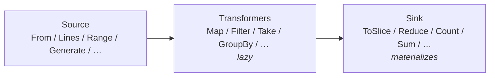

# Fluent

<!--
  Section headers below are STABLE ANCHORS. Magpie extracts content by header,
  so do not rename or reorder them. Doing so is a process change requiring its
  own spec.

  Sections marked **Public** are extracted by Magpie for the public site.
  Sections marked **Internal** are engineering-only and never appear in published docs.
-->

## Public Summary

<!-- **Public.** One paragraph in end-user voice. The canonical description for the site and README. -->

`fluent` is Glacier's answer to LINQ: a suite of chainable, lazy, composable operators over Go 1.23+ iterators (`iter.Seq[T]` and `iter.Seq2[K, V]`). Write your logic as top-level function calls — source builders like `From`, `Lines`, and `Generate`; transformers like `Map`, `Filter`, `Take`, `Window`, and `GroupBy`; set operations like `Union`, `Intersect`, and `Except`; joins, sorting, fallible mapping, and a full set of aggregation sinks — and Glacier's pipeline evaluates lazily, allocating only what the terminal sink requires. No method-chaining wrappers, no generated code, no external dependencies. Pure idiomatic Go with generics.

## Mental Model

<!-- **Public.** The conceptual frame a developer should hold while using this. Mermaid diagrams welcome. Source for the "Concepts" page on the site. -->

A `fluent` pipeline has three stages:

```
Source → Transformers → Sink
```

**Sources** produce an `iter.Seq[T]` or `iter.Seq2[K, V]`. They do no work until iterated. Examples: `From(slice)`, `Lines(reader)`, `Range(0, 100, 1)`, `Generate(fn)`.

**Transformers** wrap a source and return a new sequence. They are lazy: no element passes through until the sink pulls. Examples: `Map`, `Filter`, `Take`, `Drop`, `Window`, `Chunk`, `Distinct`, `GroupBy`, `Join`, `LeftJoin`, `Union`, `Intersect`, `Except`, `Zip`. Seq2 transformers: `Map2`, `Filter2`, `KeysOf`, `ValuesOf`, `Entries`. Sorting transformers (`Sort`, `SortBy`, `SortStable`, `SortDesc`) are eager — they materialize the sequence into a slice once, sort it, then yield lazily.

**Sinks** consume the sequence and return a concrete value. They trigger all upstream work. Examples: `ToSlice`, `ToMap`, `Reduce`, `Count`, `First`, `Last`, `Any`, `All`, `Sum`, `Avg`, `Min`, `Max`, `MinBy`, `MaxBy`.



**Key invariants:**

- Pipelines built from transformers do no work before iteration.
- Each element flows through the pipeline exactly once (single-pass).
- The sort family is the only eager transformer family; it materializes its input once.
- Stateful operators (`Distinct`, `GroupBy`, `Join`, `Union`, `Intersect`, `Except`) allocate a hash set or map on first iteration; their allocation profile is O(unique elements).
- `MapErr` / `FilterErr` surface per-element errors as `iter.Seq2[U, error]`; the caller decides whether to short-circuit or collect all errors.
- Every source, transformer, and sink is a top-level function. Go generics do not compose method chains cleanly across `T → U` transitions, and top-level functions survive `go doc` without ceremony.

## Goals

<!-- **Internal.** Bulleted list. -->

- Provide the full LINQ-equivalent function set over `iter.Seq[T]` and `iter.Seq2[K, V]` as specified by F1–F51 of plan §21.6.
- Lazy by default; sinks materialize.
- Zero per-element allocation on simple transform pipelines using non-capturing functions in pre-composed form (§23.13 qualification; see Decisions & Rationale).
- Export `KV[K, V]` and `Number` as first-class types; consumers reuse them without re-inventing.
- Zero direct dependencies beyond stdlib.
- Full fuzz coverage on `Lines` and `Words` (Falcon §1.12 untrusted-input register rows 14–15).
- Provide example tests for every major usage pattern (Magpie extraction target).

## Non-Goals

<!-- **Internal.** Bulleted list. What this spec deliberately excludes. -->

- Parallel operators (`ParMap`, `ParFilter`): deferred to a v0.x follow-up spec. The concurrency model must be designed with real workloads.
- JSON-aware lazy decoders (e.g., a `JSONLines` source that auto-decodes): deferred. Adding a JSON decoder to `fluent` would accidentally import an untrusted-input boundary (Falcon §1.10 ruling from plan §21.6 Non-Goals).
- Method-chaining DSL: excluded by design (Go generics do not compose `T → U` transitions cleanly; top-level functions are honest and idiomatic).
- A `Close` method on any type in this package: `fluent` is stateless with respect to lifecycle; there are no resources to release (§23.16 audit: no fluent type has Close).
- Ordered `FromMap` (insertion-order map iteration): Go maps are unordered; `FromMap` makes no ordering promise.

## Architecture

<!-- **Internal.** Mermaid diagram + prose. Package layout, data flow, lifecycle. -->

### Tier placement

`fluent` is Tier 1 (mid). It may import `option`, `errs`, `log`, and `internal/*` from Glacier; it may not import any other Glacier package. In practice, `fluent` imports no Glacier packages at v0 — only stdlib — which is explicitly allowed (Glacier's forbidden-edge rules permit mid packages to be stdlib-only; the rule prohibits mid→mid imports, not mid→nothing).

### DAG edges

- `fluent` ← `internal/reflectx` (one-way, for type-checking helpers if needed; see note below)
- `fluent` ← nothing from Glacier at v0
- `httpmock` → `fluent` (leaf may import mid; fluent is used for request-matching pipelines in httpmock)

Note: the plan DAG shows `reflectx → fluent`. At v0, `fluent` does not itself import `reflectx`; the arrow was intended to permit it. This spec establishes the allowance without mandating the import.

### File layout

```
fluent/
├── doc.go           package declaration and doc comment
├── source.go        From, FromMap, FromChan, Range, Repeat, Generate, Lines, Words, Split, Pairs
├── transform.go     Map, Filter, Take, Drop, Window, Chunk, Distinct, Zip, GroupBy,
│                    Join, LeftJoin, Union, Intersect, Except
├── transform2.go    Map2, Filter2, KeysOf, ValuesOf, Entries
├── sort.go          Sort, SortBy, SortStable, SortDesc
├── fallible.go      MapErr, FilterErr
├── sink.go          Reduce, ToSlice, ToMap, Count, First, Last, Any, All,
│                    Sum, Avg, Min, Max, MinBy, MaxBy
└── types.go         KV[K, V], Number
```

Tests mirror the source split:

```
fluent/
├── sources_test.go        F1–F10 source builders
├── transformers_test.go   F11–F24 Seq transformers
├── transformers2_test.go  F25–F29 Seq2 transformers
├── sort_test.go           F30–F33 sort family
├── fallible_test.go       F34–F35 MapErr/FilterErr
├── sinks_test.go          F36–F49 sinks
├── properties_test.go     algebraic identity properties
├── lines_fuzz_test.go     FuzzLines (D31 fuzz gate)
├── words_fuzz_test.go     FuzzWords (D31 fuzz gate)
├── race_test.go           concurrent consumption
├── bench_test.go          D35 + §23.13 performance gates
└── example_test.go        godoc examples (Magpie extraction target)
```

### Data flow

```
iter.Seq[T]  ──(transformer)──►  iter.Seq[U]  ──(sink)──►  concrete value
iter.Seq2[K,V]  ──(transformer2)──►  iter.Seq2[K2,V2]  ──(sink)──►  map[K]V
```

Every transformer is implemented as a closure returned by the transformer function. No goroutines are spawned by any operator. `FromChan` is the only source where the caller's goroutine blocks on a channel receive; the caller drives iteration, not `fluent`.

## Schema

<!-- **Internal.** Go types with invariants stated as `// invariant: ...` comments on each field. -->

```go
// KV is a key/value pair. Used by Pairs (to convert a Seq[KV] into a Seq2)
// and Entries (to convert a Seq2 into a Seq[KV]).
//
// invariant: K and V may be any types; KV itself carries no comparable constraint.
// invariant: zero value is valid (K: zero, V: zero); nil pointers in K or V are the caller's concern.
type KV[K, V any] struct {
    K K
    V V
}

// Number is the exported type constraint for numeric kinds used by Sum and Avg.
//
// invariant: every type listed satisfies the constraint via its underlying kind.
// invariant: complex types are excluded; complex arithmetic is not part of fluent's scope.
// invariant: this constraint is exported so callers can declare their own Number-constrained functions
//            that compose with Sum/Avg without duplicating the constraint.
type Number interface {
    ~int | ~int8 | ~int16 | ~int32 | ~int64 |
        ~uint | ~uint8 | ~uint16 | ~uint32 | ~uint64 |
        ~float32 | ~float64
}
```

No other exported types. All operator state (hash sets for Distinct, maps for GroupBy/Join) is heap-allocated inside the closure and freed when iteration ends or is short-circuited.

## API

<!--
  **Public.** Every exported symbol introduced by this spec.
  For each: signature, doc comment (which becomes godoc), preconditions, postconditions,
  error contract, concurrency notes (goroutine-safe? blocking?), lifecycle hooks.
  Magpie extracts signatures + doc comments verbatim to the API reference page.
-->

All functions are **goroutine-safe by value**: each call returns a new closure; sharing the returned `iter.Seq` between goroutines is the caller's responsibility. `FromChan` blocks the iterating goroutine until the channel closes; all other sources and transformers are non-blocking during construction.

No function in this package panics in library code except for documented programming-error cases (`Range` step=0, `Window`/`Chunk` size≤0, `Split` empty separator). These panics are declared in the precondition of each function.

---

### types.go

```go
// KV is a key/value pair used by Pairs and Entries to bridge between
// Seq[KV[K, V]] and Seq2[K, V].
type KV[K, V any] struct {
    K K
    V V
}

// Number is the type constraint for numeric types supported by Sum and Avg.
// It covers all integer and floating-point kinds via their underlying types.
// Exported so callers can declare their own Number-constrained generic functions
// that compose naturally with Sum and Avg.
type Number interface {
    ~int | ~int8 | ~int16 | ~int32 | ~int64 |
        ~uint | ~uint8 | ~uint16 | ~uint32 | ~uint64 |
        ~float32 | ~float64
}
```

---

### source.go

```go
// From returns an iterator that yields the elements of s in order.
//
// Preconditions: none. From(nil) yields nothing.
// Concurrency: safe; each call creates an independent closure over the slice header.
func From[T any](s []T) iter.Seq[T]

// FromMap returns an iterator that yields every key/value pair in m.
// Iteration order is undefined (Go map semantics).
//
// Preconditions: none. FromMap(nil) yields nothing.
// Concurrency: safe for concurrent calls; callers must not modify m during iteration.
func FromMap[K comparable, V any](m map[K]V) iter.Seq2[K, V]

// FromChan returns an iterator that yields values received from ch until ch
// is closed. The iterating goroutine blocks on each receive.
//
// Preconditions: ch must eventually be closed; otherwise the iterator never terminates.
// Concurrency: each call returns an independent iterator; two goroutines must not
//   share the same iterator value. Multiple goroutines may each call FromChan on the
//   same channel (they will race for values; this is channel semantics, not fluent's).
func FromChan[T any](ch <-chan T) iter.Seq[T]

// Range returns a lazy half-open arithmetic sequence [start, stop) with the given
// step. The sequence is empty when start == stop, or when step direction mismatches
// (e.g., start < stop with step < 0).
//
// Preconditions: step must not be zero; Range panics with
//   "fluent: Range: step must be non-zero" if step == 0.
// Concurrency: safe.
func Range(start, stop, step int) iter.Seq[int]

// Repeat returns an iterator that yields v exactly n times.
//
// Preconditions: n >= 0. Repeat(v, 0) yields nothing; Repeat(v, n) for n < 0 yields nothing.
// Concurrency: safe.
func Repeat[T any](v T, n int) iter.Seq[T]

// Generate returns a lazy iterator driven by fn. On each pull, fn is called; if fn
// returns (v, true), v is yielded. If fn returns (_, false), iteration ends.
//
// Generate(fn) can produce an infinite sequence if fn never returns false; callers
// must use Take or break to bound iteration.
//
// Preconditions: fn must not be nil.
// Concurrency: safe if fn is goroutine-safe; Generate does not add synchronization.
func Generate[T any](fn func() (T, bool)) iter.Seq[T]

// Lines returns a lazy iterator that yields newline-delimited lines from r.
// Each yielded string has the trailing newline (and any \r) stripped.
// Lines uses bufio.Scanner internally; lines exceeding bufio.MaxScanTokenSize
// (64 KiB by default) cause the iterator to stop and the error to be silently
// discarded. Callers that need to detect scan errors should wrap r.
//
// Security: Lines does not enforce an overall reader size cap. Callers reading
// from untrusted sources must wrap r with io.LimitReader before calling Lines
// (see Glacier's untrusted-input register, row 14).
//
// Preconditions: r must not be nil.
// Concurrency: safe; the iterating goroutine owns r during iteration.
func Lines(r io.Reader) iter.Seq[string]

// Words returns a lazy iterator that yields whitespace-separated tokens from r.
// Uses bufio.Scanner with ScanWords.
//
// Security: same size-cap note as Lines (untrusted-input register row 15).
//
// Preconditions: r must not be nil.
// Concurrency: safe.
func Words(r io.Reader) iter.Seq[string]

// Split returns a lazy iterator that yields the parts of s split on sep via
// successive strings.Index walks. No intermediate slice is allocated.
//
// Split("a,b,c", ",") yields "a", "b", "c".
// Split("abc", ",") yields "abc".
// Split("", ",") yields one empty string.
//
// Preconditions: sep must not be empty; Split panics with
//   "fluent: Split: separator must not be empty" if sep == "".
// Concurrency: safe.
func Split(s, sep string) iter.Seq[string]

// Pairs converts a Seq[KV[K, V]] into a Seq2[K, V].
//
// Pairs is the inverse of Entries: Entries(Pairs(seq)) round-trips.
//
// Preconditions: none.
// Concurrency: safe.
func Pairs[K, V any](s iter.Seq[KV[K, V]]) iter.Seq2[K, V]
```

---

### transform.go

```go
// Map applies f to each element of src and returns a lazy Seq of the results.
//
// Preconditions: f must not be nil.
// Concurrency: safe if f is goroutine-safe.
func Map[T, U any](src iter.Seq[T], f func(T) U) iter.Seq[U]

// Filter returns a lazy Seq of elements from src for which pred returns true.
//
// Preconditions: pred must not be nil.
// Concurrency: safe if pred is goroutine-safe.
func Filter[T any](src iter.Seq[T], pred func(T) bool) iter.Seq[T]

// Take returns a lazy Seq of at most n elements from src. If n <= 0, Take
// yields nothing. If src has fewer than n elements, Take yields all of them.
//
// Concurrency: safe.
func Take[T any](src iter.Seq[T], n int) iter.Seq[T]

// Drop returns a lazy Seq that skips the first n elements of src, then yields
// the remainder. If n is greater than or equal to the length of src, Drop
// yields nothing. If n <= 0, Drop yields all elements.
//
// Concurrency: safe.
func Drop[T any](src iter.Seq[T], n int) iter.Seq[T]

// Window returns a lazy Seq of sliding sub-slices of length size over src.
// Each yielded slice is a fresh copy; mutation by the caller does not affect
// subsequent windows.
//
// Window([1,2,3,4], 3) yields [1,2,3] then [2,3,4].
// If src has fewer than size elements, Window yields nothing.
//
// Preconditions: size must be > 0; Window panics with
//   "fluent: Window: size must be positive" if size <= 0.
// Concurrency: safe.
func Window[T any](src iter.Seq[T], size int) iter.Seq[[]T]

// Chunk returns a lazy Seq of non-overlapping sub-slices of at most size elements.
// The last chunk may be shorter than size if src length is not a multiple of size.
//
// Chunk([1..6], 2) yields [1,2],[3,4],[5,6].
// Chunk([1..5], 2) yields [1,2],[3,4],[5].
//
// Preconditions: size must be > 0; Chunk panics with
//   "fluent: Chunk: size must be positive" if size <= 0.
// Concurrency: safe.
func Chunk[T any](src iter.Seq[T], size int) iter.Seq[[]T]

// Distinct returns a lazy Seq that yields each element of src at most once,
// in first-occurrence order. Equality is determined by the comparable constraint.
//
// Allocates a map[T]struct{} on first iteration, sized to unique elements seen.
//
// Concurrency: safe.
func Distinct[T comparable](src iter.Seq[T]) iter.Seq[T]

// Zip pairs elements from a and b by position, yielding until either source
// is exhausted. The shorter source determines the output length.
//
// Concurrency: safe.
func Zip[A, B any](a iter.Seq[A], b iter.Seq[B]) iter.Seq2[A, B]

// GroupBy returns a lazy Seq2 that yields (key, []T) pairs, one per unique key.
// Elements from src are grouped in encounter order; the slice for each key
// preserves relative order. All elements are accumulated before the first pair
// is yielded (GroupBy is internally eager; output is lazy).
//
// Allocates a map[K][]T.
//
// Preconditions: key must not be nil.
// Concurrency: safe if key is goroutine-safe.
func GroupBy[T any, K comparable](src iter.Seq[T], key func(T) K) iter.Seq2[K, []T]

// Join returns a lazy Seq2 of (A, B) inner-join pairs: for each a in src a,
// all b in src b whose keyB(b) == keyA(a) are paired with a. b is fully
// materialized to a map[K][]B on the first iteration pull; a is streamed.
//
// Allocates map[K][]B from src b.
//
// Preconditions: keyA and keyB must not be nil.
// Concurrency: safe if key functions are goroutine-safe.
func Join[A, B any, K comparable](
    a iter.Seq[A], b iter.Seq[B],
    keyA func(A) K, keyB func(B) K,
) iter.Seq2[A, B]

// LeftJoin is like Join but every element of a is yielded. When no matching
// element exists in b, the B value is the zero value of B.
//
// Allocates map[K][]B from src b.
//
// Preconditions: keyA and keyB must not be nil.
// Concurrency: safe if key functions are goroutine-safe.
func LeftJoin[A, B any, K comparable](
    a iter.Seq[A], b iter.Seq[B],
    keyA func(A) K, keyB func(B) K,
) iter.Seq2[A, B]

// Union returns a lazy Seq of distinct elements drawn first from a, then from b.
// Elements are yielded in encounter order; duplicates across both sources are
// suppressed. Allocates a map[T]struct{}.
//
// Concurrency: safe.
func Union[T comparable](a, b iter.Seq[T]) iter.Seq[T]

// Intersect returns a lazy Seq of distinct elements that appear in both a and b.
// b is materialized to a map[T]struct{} on first pull; a is streamed.
// Allocates map[T]struct{} from b.
//
// Concurrency: safe.
func Intersect[T comparable](a, b iter.Seq[T]) iter.Seq[T]

// Except returns a lazy Seq of distinct elements from a that are not present in b.
// b is materialized to a map[T]struct{} on first pull; a is streamed.
// Allocates map[T]struct{} from b.
//
// Concurrency: safe.
func Except[T comparable](a, b iter.Seq[T]) iter.Seq[T]
```

---

### transform2.go

```go
// Map2 applies f to each (k, v) pair of src and returns a lazy Seq2 of (k2, v2).
//
// Preconditions: f must not be nil.
// Concurrency: safe if f is goroutine-safe.
func Map2[K, V, K2, V2 any](src iter.Seq2[K, V], f func(K, V) (K2, V2)) iter.Seq2[K2, V2]

// Filter2 returns a lazy Seq2 of pairs from src for which pred returns true.
//
// Preconditions: pred must not be nil.
// Concurrency: safe if pred is goroutine-safe.
func Filter2[K, V any](src iter.Seq2[K, V], pred func(K, V) bool) iter.Seq2[K, V]

// KeysOf returns a lazy Seq of the keys of src, in iteration order.
//
// Concurrency: safe.
func KeysOf[K, V any](src iter.Seq2[K, V]) iter.Seq[K]

// ValuesOf returns a lazy Seq of the values of src, in iteration order.
//
// Concurrency: safe.
func ValuesOf[K, V any](src iter.Seq2[K, V]) iter.Seq[V]

// Entries converts a Seq2[K, V] to a Seq[KV[K, V]]. Each (k, v) pair from
// src becomes a KV{K: k, V: v} element.
//
// Entries is the inverse of Pairs: Entries(Pairs(seq)) round-trips for any
// Seq[KV] whose elements have stable keys.
//
// Concurrency: safe.
func Entries[K, V any](src iter.Seq2[K, V]) iter.Seq[KV[K, V]]
```

---

### sort.go

The sort family is the only eager transformer group. Each function materializes its input
into a slice (one allocation of O(n) elements), sorts it, then returns a lazy Seq over the
sorted slice. The original source is consumed exactly once.

```go
// Sort materializes src, sorts the elements in ascending order using cmp.Compare,
// and returns a lazy Seq over the sorted result.
//
// Allocates one []T of length n (where n is the source length).
// Does not mutate any original slice; Sort(From(s)) leaves s unchanged.
//
// Concurrency: safe.
func Sort[T cmp.Ordered](src iter.Seq[T]) iter.Seq[T]

// SortBy materializes src, sorts by the value of key(element) in ascending order,
// and returns a lazy Seq over the sorted result.
//
// Preconditions: key must not be nil.
// Allocates one []T of length n.
// Concurrency: safe if key is goroutine-safe.
func SortBy[T any, K cmp.Ordered](src iter.Seq[T], key func(T) K) iter.Seq[T]

// SortStable materializes src, applies slices.SortStableFunc with the given less
// comparator, and returns a lazy Seq. Relative order of elements comparing equal
// under less is preserved.
//
// Preconditions: less must not be nil.
// Allocates one []T of length n.
// Concurrency: safe if less is goroutine-safe.
func SortStable[T any](src iter.Seq[T], less func(a, b T) int) iter.Seq[T]

// SortDesc materializes src, sorts the elements in descending order, and returns
// a lazy Seq.
//
// Allocates one []T of length n.
// Concurrency: safe.
func SortDesc[T cmp.Ordered](src iter.Seq[T]) iter.Seq[T]
```

---

### fallible.go

Fallible operators surface per-element errors from mapping or filtering functions that can
fail. The caller controls error handling at the iteration site.

```go
// MapErr applies f to each element of src. On success, it yields (value, nil).
// On failure, it yields (zero, err). The caller decides how to handle errors at
// the range site: break on first error (short-circuit) or collect all results
// (continue past errors).
//
// Iteration stops when the caller's range body returns false (i.e., breaks).
//
// Preconditions: f must not be nil.
// Concurrency: safe if f is goroutine-safe.
func MapErr[T, U any](src iter.Seq[T], f func(T) (U, error)) iter.Seq2[U, error]

// FilterErr applies pred to each element of src. For each element:
//   - if pred returns (true, nil):   the element is yielded with a nil error.
//   - if pred returns (false, nil):  the element is dropped (not yielded).
//   - if pred returns (_, err!=nil): (element, err) is yielded.
//
// The caller breaks to short-circuit on error or continues to collect all results.
//
// Preconditions: pred must not be nil.
// Concurrency: safe if pred is goroutine-safe.
func FilterErr[T any](src iter.Seq[T], pred func(T) (bool, error)) iter.Seq2[T, error]
```

---

### sink.go

Sinks consume a sequence and return a concrete value. They trigger all upstream work.

```go
// Reduce folds src into a single value starting from zero, applying f(acc, elem)
// for each element. Returns zero if src is empty.
//
// Preconditions: f must not be nil.
// Concurrency: safe if f is goroutine-safe.
func Reduce[T, R any](src iter.Seq[T], zero R, f func(R, T) R) R

// ToSlice collects all elements of src into a slice, in iteration order.
// Returns a non-nil empty slice if src is empty.
//
// Concurrency: safe.
func ToSlice[T any](src iter.Seq[T]) []T

// ToMap collects all pairs from src into a map. On duplicate keys, the last
// value wins (iteration order determines the winner). Returns a non-nil empty
// map if src is empty.
//
// Concurrency: safe.
func ToMap[K comparable, V any](src iter.Seq2[K, V]) map[K]V

// Count returns the number of elements in src. Equivalent to
// len(ToSlice(src)) but allocates no slice.
//
// Concurrency: safe.
func Count[T any](src iter.Seq[T]) int

// First returns the first element of src and true. If src is empty, First
// returns the zero value of T and false.
//
// First short-circuits: it stops iteration after the first element.
//
// Concurrency: safe.
func First[T any](src iter.Seq[T]) (T, bool)

// Last returns the last element of src and true. If src is empty, Last returns
// the zero value of T and false.
//
// Last must consume all of src to find the final element.
//
// Concurrency: safe.
func Last[T any](src iter.Seq[T]) (T, bool)

// Any returns true if pred returns true for at least one element of src.
// Short-circuits on the first match.
//
// Preconditions: pred must not be nil.
// Concurrency: safe if pred is goroutine-safe.
func Any[T any](src iter.Seq[T], pred func(T) bool) bool

// All returns true if pred returns true for every element of src. Returns
// true for empty src (vacuous truth). Short-circuits on the first false.
//
// Preconditions: pred must not be nil.
// Concurrency: safe if pred is goroutine-safe.
func All[T any](src iter.Seq[T], pred func(T) bool) bool

// Sum returns the sum of all elements in src. Returns the zero value of T
// if src is empty.
//
// Concurrency: safe.
func Sum[T Number](src iter.Seq[T]) T

// Avg returns the arithmetic mean of all elements in src as float64.
// Returns math.NaN() if src is empty (0/0 floating-point semantics).
// Uses a float64 accumulator internally to avoid integer overflow on large
// sequences; precision loss is possible for very large integer values.
//
// Concurrency: safe.
func Avg[T Number](src iter.Seq[T]) float64

// Min returns the minimum element of src and true. Returns the zero value
// and false if src is empty.
//
// Concurrency: safe.
func Min[T cmp.Ordered](src iter.Seq[T]) (T, bool)

// Max returns the maximum element of src and true. Returns the zero value
// and false if src is empty.
//
// Concurrency: safe.
func Max[T cmp.Ordered](src iter.Seq[T]) (T, bool)

// MinBy returns the element of src with the smallest key(element) value, and
// true. Returns the zero value and false if src is empty.
//
// Preconditions: key must not be nil.
// Concurrency: safe if key is goroutine-safe.
func MinBy[T any, K cmp.Ordered](src iter.Seq[T], key func(T) K) (T, bool)

// MaxBy returns the element of src with the largest key(element) value, and
// true. Returns the zero value and false if src is empty.
//
// Preconditions: key must not be nil.
// Concurrency: safe if key is goroutine-safe.
func MaxBy[T any, K cmp.Ordered](src iter.Seq[T], key func(T) K) (T, bool)
```

## Examples

<!--
  **Public.** Runnable Go examples in fenced ```go blocks.
  Each example is self-contained and `go test ./...`-compatible (valid Example functions).
  Magpie transcludes verbatim into tutorials.
-->

### Pipeline composition

```go
func ExampleGroupBy_top3PerDept() {
    type User struct {
        Name  string
        Dept  string
        Score int
        Active bool
    }
    users := []User{
        {"Alice", "eng", 90, true},
        {"Bob",   "eng", 70, true},
        {"Carol", "eng", 85, true},
        {"Dave",  "mkt", 60, true},
        {"Eve",   "mkt", 95, true},
        {"Frank", "eng", 50, false},
    }

    // named-step form — readable in isolation
    active  := fluent.Filter(fluent.From(users), func(u User) bool { return u.Active })
    byDept  := fluent.GroupBy(active, func(u User) string { return u.Dept })
    top3    := fluent.Map2(byDept, func(dept string, members []User) (string, []User) {
        sorted := fluent.ToSlice(
            fluent.Take(
                fluent.SortBy(fluent.From(members), func(u User) int { return -u.Score }),
                3,
            ),
        )
        return dept, sorted
    })
    result := fluent.ToMap(top3)

    fmt.Println(len(result["eng"]))   // 3
    fmt.Println(result["eng"][0].Name) // Alice (score 90)
    // Output:
    // 3
    // Alice
}
```

### Aggregations

```go
func ExampleSum() {
    total := fluent.Sum(fluent.From([]int{1, 2, 3, 4, 5}))
    fmt.Println(total)
    // Output:
    // 15
}

func ExampleAvg() {
    mean := fluent.Avg(fluent.From([]float64{1, 2, 3}))
    fmt.Println(mean)
    // Output:
    // 2
}

func ExampleMaxBy() {
    type Item struct{ Name string; Weight int }
    items := []Item{{"feather", 1}, {"rock", 50}, {"pebble", 10}}
    heaviest, ok := fluent.MaxBy(fluent.From(items), func(i Item) int { return i.Weight })
    fmt.Println(ok, heaviest.Name)
    // Output:
    // true rock
}
```

### Set operations

```go
func ExampleDistinct() {
    result := fluent.ToSlice(fluent.Distinct(fluent.From([]int{1, 2, 2, 3, 3, 3})))
    fmt.Println(result)
    // Output:
    // [1 2 3]
}

func ExampleIntersect() {
    a := fluent.From([]int{1, 2, 3, 4})
    b := fluent.From([]int{2, 4, 6})
    result := fluent.ToSlice(fluent.Intersect(a, b))
    fmt.Println(result)
    // Output:
    // [2 4]
}

func ExampleExcept() {
    a := fluent.From([]int{1, 2, 3, 4})
    b := fluent.From([]int{2, 4})
    result := fluent.ToSlice(fluent.Except(a, b))
    fmt.Println(result)
    // Output:
    // [1 3]
}
```

### Joins

```go
func ExampleLeftJoin() {
    type User  struct{ ID, Name string }
    type Order struct{ ID, UserID string }

    users  := []User{{"u1", "Alice"}, {"u2", "Bob"}}
    orders := []Order{{"o1", "u1"}}

    pairs := fluent.LeftJoin(
        fluent.From(users),
        fluent.From(orders),
        func(u User) string  { return u.ID },
        func(o Order) string { return o.UserID },
    )
    for u, o := range pairs {
        if o == (Order{}) {
            fmt.Printf("%s has no orders\n", u.Name)
        } else {
            fmt.Printf("%s has order %s\n", u.Name, o.ID)
        }
    }
    // Output:
    // Alice has order o1
    // Bob has no orders
}
```

### String pipeline

```go
func ExampleLines() {
    r := strings.NewReader("ERROR: disk full\nINFO: all good\nERROR: oom\n")
    first5errors := fluent.ToSlice(
        fluent.Take(
            fluent.Filter(fluent.Lines(r),
                func(s string) bool { return strings.HasPrefix(s, "ERROR") }),
            5,
        ),
    )
    fmt.Println(first5errors)
    // Output:
    // [ERROR: disk full ERROR: oom]
}
```

### Fallible mapping

```go
func ExampleMapErr() {
    raw := []string{"1", "two", "3"}
    parsed := fluent.MapErr(fluent.From(raw), func(s string) (int, error) {
        return strconv.Atoi(s)
    })
    for v, err := range parsed {
        if err != nil {
            fmt.Printf("skip bad value: %v\n", err)
            continue
        }
        fmt.Println(v)
    }
    // Output:
    // 1
    // skip bad value: strconv.Atoi: parsing "two": invalid syntax
    // 3
}
```

### Seq2 operators

```go
func ExampleEntries_pairsRoundTrip() {
    m := map[string]int{"a": 1, "b": 2}
    seq2  := fluent.FromMap(m)
    kvSeq := fluent.Entries(seq2)
    back  := fluent.ToMap(fluent.Pairs(kvSeq))
    fmt.Println(reflect.DeepEqual(m, back))
    // Output:
    // true
}
```

### Generator and Range

```go
func ExampleGenerate() {
    n := 0
    first5even := fluent.ToSlice(
        fluent.Take(
            fluent.Generate(func() (int, bool) { n += 2; return n, true }),
            5,
        ),
    )
    fmt.Println(first5even)
    // Output:
    // [2 4 6 8 10]
}

func ExampleRange() {
    result := fluent.ToSlice(fluent.Range(0, 10, 2))
    fmt.Println(result)
    // Output:
    // [0 2 4 6 8]
}
```

## Test Matrix

<!--
  **Internal.** Owned by Lynx.
  Table: scenario × input × expected outcome × covered-by-test-name.
-->

Full matrix is authored by Lynx; the rows below are drawn from `specs/test-matrices/mid.md § Package: fluent/`.

| # | Name | Spec ref | Type | Description | Test helpers used |
|---|---|---|---|---|---|
| 1 | TestFromSlice | F1 | Unit (positive) | Slice → Seq → ToSlice round-trip preserves order and contents. | `assert.Equal` |
| 2 | TestFromNil | E1 | Unit (edge) | `From(nil)` yields nothing. | `fluent.Count`, `assert.Equal` |
| 3 | TestFromMapKeysComplete | F2 | Unit (positive) | FromMap yields every (k,v) exactly once (order undefined). | `fluent.ToMap`, `assert.Equal` |
| 4 | TestFromChanDrainsUntilClose | F3, E2 | Unit (positive) | FromChan over closed channel yields buffered then ends. | `assert.Equal`, `concur.WaitGroup` |
| 5 | TestRangePositiveStep | F4 | Unit (positive) | Range(0,5,1) yields 0,1,2,3,4. | `assert.Equal` |
| 6 | TestRangeNegativeStep | F4 | Unit (positive) | Range(5,0,-1) yields 5,4,3,2,1. | `assert.Equal` |
| 7 | TestRangeEmptyEqualEnds | E3 | Unit (edge) | Range(0,0,1) yields nothing. | `fluent.Count`, `assert.Equal` |
| 8 | TestRangeStepDirectionMismatch | E4 | Unit (edge) | Range(0,5,-1) yields nothing. | `assert.Equal` |
| 9 | TestRangeZeroStepPanics | E5 | Unit (negative) | Range(0,5,0) panics with `"fluent: Range: step must be non-zero"`. | `assert.PanicsWithMessage` |
| 10 | TestRepeatNZero | F5 | Unit (edge) | Repeat(v,0) yields nothing. | `fluent.Count` |
| 11 | TestRepeatN | F5 | Unit (positive) | Repeat(v,5) yields v exactly 5 times. | `assert.Equal` |
| 12 | TestGenerateStops | F6, E15 | Unit (positive) | Generate fn returning (v,true) k times then (z,false) yields k items. | `fluent.Count`, `assert.Equal` |
| 13 | TestLinesNoTrailingNewline | F7 | Unit (positive) | Lines yields strings without trailing `\n`. | `assert.Equal` |
| 14 | TestLinesEmpty | F7 | Unit (edge) | Lines over empty reader yields nothing. | `fluent.Count` |
| 15 | TestLinesCRLF | F7 | Unit (edge) | Lines handles `\r\n` line endings (drops both). | `assert.Equal` |
| 16 | TestLinesGiantLine | F7 untrusted-input | Unit (negative) | Line > internal bufio cap returns scanner error per library register. | `assert.ErrorContains` |
| 17 | FuzzLines | F7 (D31 fuzz gate) | Fuzz | Random byte streams over Lines: never panics; total bytes consumed ≤ input bytes. | `testing.F` |
| 18 | TestWordsWhitespaceSeparation | F8 | Unit (positive) | Words yields tokens split on Unicode whitespace. | `assert.Equal` |
| 19 | TestWordsEmpty | F8 | Unit (edge) | Words over empty input yields nothing. | `fluent.Count` |
| 20 | FuzzWords | F8 | Fuzz | Random byte streams: never panics; output count ≤ input length. | `testing.F` |
| 21 | TestSplitOnSep | F9 | Unit (positive) | Split("a,b,c", ",") yields a,b,c. | `assert.Equal` |
| 22 | TestSplitNoMatch | F9 | Unit (edge) | Split("abc", ",") yields ["abc"]. | `assert.Equal` |
| 23 | TestSplitEmptyString | F9 | Unit (edge) | Split("", ",") yields one empty element. | `assert.Equal` |
| 24 | TestSplitEmptySeparatorPanics | F9 | Unit (negative) | Split(s, "") panics with library register message. | `assert.Panics` |
| 25 | TestPairsToSeq2RoundTrip | F10 | Unit (positive) | Pairs(…) then Entries returns input. | `assert.Equal` |
| 26 | TestMapBasic | F11 | Unit (positive) | Map(From([1,2,3]), x*2) yields 2,4,6. | `assert.Equal` |
| 27 | TestMapZeroAllocPipeline | NF2, §23.13 | Bench/Test | `Reduce(Map(Filter(From(s)), pred), 0, sum)` zero allocs/element for non-capturing fns in pre-composed pipelines. | `testing.AllocsPerRun` |
| 28 | TestFilterBasic | F12 | Unit (positive) | Filter(From([1,2,3,4]), even) yields 2,4. | `assert.Equal` |
| 29 | TestFilterAllExclude | F12 | Unit (edge) | Predicate always false → empty. | `fluent.Count` |
| 30 | TestTakeBasic | F13 | Unit (positive) | Take(seq, 2) yields first 2. | `assert.Equal` |
| 31 | TestTakeNegative | E6 | Unit (edge) | Take(seq, -1) yields nothing. | `fluent.Count` |
| 32 | TestTakeMoreThanAvailable | F13 | Unit (edge) | Take(seq, 100) over 3-element seq yields 3. | `assert.Equal` |
| 33 | TestDropBasic | F14 | Unit (positive) | Drop(seq, 2) yields all but first 2. | `assert.Equal` |
| 34 | TestDropMoreThanLen | E7 | Unit (edge) | Drop more than length → empty. | `fluent.Count` |
| 35 | TestWindowBasic | F15 | Unit (positive) | Window([1,2,3,4], 3) yields [1,2,3],[2,3,4]. | `assert.Equal` |
| 36 | TestWindowSizeZeroPanics | E8 | Unit (negative) | Window(_, 0) panics with `"fluent: Window: size must be positive"`. | `assert.PanicsWithMessage` |
| 37 | TestWindowSeqShorterThanSize | E9 | Unit (edge) | Window([1,2], 3) yields nothing. | `fluent.Count` |
| 38 | TestChunkBasic | F16 | Unit (positive) | Chunk([1..6], 2) yields [1,2],[3,4],[5,6]. | `assert.Equal` |
| 39 | TestChunkSizeZeroPanics | E8 | Unit (negative) | Chunk(_, 0) panics. | `assert.Panics` |
| 40 | TestChunkPartialLast | E10 | Unit (edge) | Chunk([1..5], 2) yields [1,2],[3,4],[5]. | `assert.Equal` |
| 41 | TestDistinctComparable | F17 | Unit (positive) | Distinct preserves first occurrence; dedups. | `assert.Equal` |
| 42 | TestDistinctEmpty | F17 | Unit (edge) | Distinct over empty yields nothing. | `fluent.Count` |
| 43 | TestZipUnequalLengths | E11, F18 | Unit (positive) | Zip yields min(len(a), len(b)). | `assert.Equal` |
| 44 | TestGroupByBasic | F19 | Unit (positive) | GroupBy partitions by key fn. | `assert.Equal` |
| 45 | TestGroupByEmpty | E12 | Unit (edge) | GroupBy over empty yields no groups. | `fluent.Count` |
| 46 | TestJoinInner | F20 | Unit (positive) | Join yields only matching pairs; b materialized once. | `assert.Equal` |
| 47 | TestJoinNoMatches | F20 | Unit (edge) | Disjoint keys → no pairs. | `fluent.Count` |
| 48 | TestLeftJoinIncludesUnmatched | F21 | Unit (positive) | LeftJoin: every a yielded; b is zero on no-match. | `assert.Equal` |
| 49 | TestUnionDistinct | F22 | Unit (positive) | Union(a,b) yields distinct elements from a, then b. | `assert.Equal` |
| 50 | TestIntersect | F23 | Unit (positive) | Intersect distinct elements present in both. | `assert.Equal` |
| 51 | TestExcept | F24 | Unit (positive) | Except: distinct in a not in b. | `assert.Equal` |
| 52 | TestMap2 | F25 | Unit (positive) | Map2 transforms (k,v) → (k2,v2). | `assert.Equal` |
| 53 | TestFilter2 | F26 | Unit (positive) | Filter2 retains pairs satisfying pred. | `assert.Equal` |
| 54 | TestKeysOf | F27 | Unit (positive) | KeysOf yields keys in order. | `assert.Equal` |
| 55 | TestValuesOf | F28 | Unit (positive) | ValuesOf yields values in order. | `assert.Equal` |
| 56 | TestEntries | F29 | Unit (positive) | Entries yields KV{k,v}. | `assert.Equal` |
| 57 | TestPairsEntriesRoundTrip | F50 | Unit (property-lite) | `Entries(Pairs(seq))` == `seq`. | `assert.Equal` |
| 58 | TestSortAscending | F30 | Unit (positive) | Sort yields ascending order via slices.Sort. | `assert.Equal` |
| 59 | TestSortByKey | F31 | Unit (positive) | SortBy(seq, keyFn) ordered by key. | `assert.Equal` |
| 60 | TestSortStableLess | F32 | Unit (positive) | Stable sort preserves relative order of equal-key elements. | `assert.Equal` |
| 61 | TestSortDescending | F33 | Unit (positive) | SortDesc reverse order. | `assert.Equal` |
| 62 | TestSortDoesNotMutateInput | E13 | Unit (positive) | Original slice unchanged after Sort(From(s)). | `assert.Equal` |
| 63 | TestMapErrAllSuccess | F34 | Unit (positive) | All (v,nil); caller gets every value, no errors. | `assert.NoError` (per yield) |
| 64 | TestMapErrShortCircuit | F34 | Unit (positive) | Caller breaks on first non-nil error; iteration stops. | `assert.ErrorIs` |
| 65 | TestMapErrContinuePastErrors | E14 | Unit (positive) | Caller continues; gets every (zero,err) pair. | `assert.Equal`, `fluent.Count` |
| 66 | TestFilterErrShortCircuit | F35 | Unit (positive) | Same shape as MapErr. | `assert.ErrorIs` |
| 67 | TestReduceBasic | F36 | Unit (positive) | Reduce sums correctly. | `assert.Equal` |
| 68 | TestReduceEmpty | F36 | Unit (edge) | Reduce over empty returns zero. | `assert.Equal` |
| 69 | TestToSlice | F37 | Unit (positive) | ToSlice round-trips From. | `assert.Equal` |
| 70 | TestToMap | F38 | Unit (positive) | ToMap from Seq2 produces map. | `assert.Equal` |
| 71 | TestToMapDuplicateKeyLastWins | F38 | Unit (edge) | Documented behavior on duplicate keys. | `assert.Equal` |
| 72 | TestCount | F39 | Unit (positive) | Count == ToSlice length. | `assert.Equal` |
| 73 | TestFirstNonEmpty | F40 | Unit (positive) | First yields first elem, true. | `assert.Equal`, `assert.True` |
| 74 | TestFirstEmpty | E16 | Unit (edge) | First on empty → (zero, false). | `assert.False` |
| 75 | TestLastNonEmpty | F41 | Unit (positive) | Last yields final elem. | `assert.Equal` |
| 76 | TestLastEmpty | E16 | Unit (edge) | Last on empty → (zero, false). | `assert.False` |
| 77 | TestAnyTrue | F42 | Unit (positive) | Any short-circuits on first match. | `assert.True` |
| 78 | TestAllTrue | F43 | Unit (positive) | All true when every element matches. | `assert.True` |
| 79 | TestAllFalseShortCircuits | F43 | Unit (positive) | All short-circuits on first false. | `assert.False` |
| 80 | TestSumIntegers | F44 | Unit (positive) | Sum over `[]int` returns int total. | `assert.Equal` |
| 81 | TestSumEmpty | E17 | Unit (edge) | Sum over empty returns zero T. | `assert.Equal` |
| 82 | TestAvgFloat | F45 | Unit (positive) | Avg returns float64 mean. | `assert.InDelta` |
| 83 | TestAvgEmptyNaN | E17 | Unit (edge) | Avg over empty returns NaN. | `assert.True(math.IsNaN(...))` |
| 84 | TestAvgIntegerOverflowAvoided | E18 | Unit (positive) | Internal accumulator is float64; result correct within precision. | `assert.InDelta` |
| 85 | TestMin | F46 | Unit (positive) | Min returns smallest. | `assert.Equal` |
| 86 | TestMinEmpty | E16 | Unit (edge) | Min over empty → (zero, false). | `assert.False` |
| 87 | TestMax | F47 | Unit (positive) | Max returns largest. | `assert.Equal` |
| 88 | TestMinByKey | F48 | Unit (positive) | MinBy returns elem with smallest key. | `assert.Equal` |
| 89 | TestMaxByKey | F49 | Unit (positive) | MaxBy returns elem with largest key. | `assert.Equal` |
| 90 | TestKVStructFields | F50 | Unit (positive) | KV[K,V]{K, V} round-trips. | `assert.Equal` |
| 91 | TestNumberConstraintAccepted | F51 | Unit (compile-time) | All numeric kinds satisfy Number; non-numeric does not (negative-compile via build constraint). | compile-only |
| 92 | TestLazyNoSideEffectsBeforeIteration | NF1 | Unit (positive) | Build pipeline; never iterate; assert side-effecting predicate call count == 0. | `assert.Equal` (counter) |
| 93 | TestSortMaterializesOnce | NF3 | Unit (positive) | Sort consumes seq exactly once (count source pulls). | `assert.Equal` |
| 94 | TestDistinctAllocatesHashSet | NF4 | Unit (alloc-aware) | Distinct allocates O(unique) — bench captures number. | `testing.AllocsPerRun` |
| 95 | TestSortPanicsOnNonOrdered | E19 | Unit (compile-time) | Sort over `[]struct{}` is a compile error (constraint violation). | compile-only |
| 96 | PropertyMapFilterDistributivity | algebra | Property | `fluent.Map(Filter(s, p), f)` consistent with filter-then-map semantics for invertible f; randomized inputs. | `assert.Equal`, randomized generator |
| 97 | PropertyMapFilterReducibleEqual | algebra | Property | `Reduce(Map(s, f), zero, ⊕)` produces consistent result for associative ⊕. | `assert.Equal` |
| 98 | PropertyReduceInvertibleRoundTrip | algebra | Property | Reduce followed by reverse op reconstructs sequence for invertible f. | `assert.Equal` |
| 99 | TestConcurrentConsumptionDistinctSeqs | NF5 (race) | Race | Each of 100 goroutines consumes its own freshly-built seq; race-clean. | `-race`, `concur.WaitGroup`, `fixture.GuardLeaks` |
| 100 | TestSharedSeqConsumedTwiceBehavior | NF1 | Unit (documented behavior) | Documents whether iter.Seq consumed twice is safe (chan: empty 2nd time; slice: full again). | `assert.Equal` |
| 101 | BenchmarkMapFilterReduce | NF2, §23.13 | Benchmark | Per-element zero allocs for non-capturing functions in pre-composed pipelines. | `testing.AllocsPerRun` |
| 102 | BenchmarkSortFamily | NF3 | Benchmark | Sort/SortBy/SortStable/SortDesc tracked vs `slices.Sort`. | `testing.B` |
| 103 | BenchmarkDistinctLargeCardinality | NF4 | Benchmark | Allocation profile for hash-set-backed Distinct. | `testing.B` |
| 104 | BenchmarkLinesLargeFile | F7 | Benchmark | Lines streaming from 1 MiB reader. | `testing.B` |
| 105 | BenchmarkJoinMaterialization | E20 | Benchmark | Documents the `map[K][]B` materialization cost for Join. | `testing.B` |

### Coverage targets

- 100% line on every public symbol F1–F51.
- ≥ 95% branch coverage on transformer chains; the rare I/O error path of `Lines`/`Words` is fuzz-covered.

### Edge cases not in spec (Lynx adds)

- **EX1**: `Map(seq, f)` where `f` panics — panic propagates at iteration time (no recovery).
- **EX2**: `Window` with overlapping windows — each window is a fresh slice copy; mutations do not bleed.
- **EX3**: `Chunk` on infinite `Generate` seq with `Take` — lazy composition produces finite result.
- **EX4**: `Distinct` over NaN floats — NaN != NaN, so each NaN is yielded (Go map equality semantics).
- **EX5**: `Zip` where one source panics mid-iteration — panic propagates; other source is not consumed further.
- **EX6**: `MapErr` where caller `continue`s after error — off-by-one impossibility guaranteed by range semantics.
- **EX7**: `ToMap` on Seq2 with zero elements — returns non-nil empty map.

## Dependency Justification

<!--
  **Internal.** Owned by Falcon.
  One row per new direct dependency. The empty table is the goal.
-->

| Module | Version | License | Last release | Maintainers | Alternatives considered | Why we can't roll our own |
|---|---|---|---|---|---|---|

No new direct dependencies. `fluent` imports only stdlib: `bufio`, `cmp`, `io`, `iter`, `math`, `slices`, `strings`. Zero supply-chain additions.

## Security & Supply-Chain Notes

<!-- **Internal.** Untrusted-input handling, sandboxing implications, secrets handling, vuln-scan considerations. -->

### Untrusted-input register rows

`fluent` appears in the Glacier untrusted-input register (spec 0002 §Security) at two rows:

| Row | Input source | Parser / decoder | Size cap | Validation rule |
|---|---|---|---|---|
| 14 | `Lines(r io.Reader)` | `bufio.Scanner` (ScanLines) | None — caller must wrap r with `io.LimitReader` when reading from untrusted sources | No line-length enforcement beyond bufio.MaxScanTokenSize (64 KiB); callers are responsible for bounding the reader |
| 15 | `Words(r io.Reader)` | `bufio.Scanner` (ScanWords) | Same — caller wraps | Same |

The `Lines` and `Words` functions deliberately do not enforce an overall size cap. They are general-purpose streaming operators; imposing an arbitrary global limit would break legitimate use cases (e.g., streaming a large log file). Callers reading from untrusted network input, user-supplied files, or CLI stdin **must** wrap the reader with `io.LimitReader` before passing it to `Lines` or `Words`. This requirement is documented in the godoc for each function and must be re-stated in any Glacier documentation that mentions these operators in an untrusted-input context.

The fuzz targets `FuzzLines` and `FuzzWords` are part of the CI fuzz gate (D31) and verify that neither function panics on arbitrary byte input. They use the D31 30s/PR gate.

### Supply-chain posture

Zero direct dependencies. `fluent` is a stdlib-only package. No CVE surface beyond Go stdlib itself, which is covered by the framework-wide `govulncheck` CI gate.

### Sandboxing implications

None. `fluent` performs no I/O other than what callers route through `Lines`/`Words`. It spawns no goroutines and uses no OS resources directly.

## FAQ

<!-- **Public.** Anticipated user questions with answers. Magpie extracts to the public docs FAQ. -->

**Why no method-chaining DSL? Every other language's LINQ equivalent does `seq.Filter(...).Map(...).ToSlice()`.**

Go generics do not compose method chains cleanly across `T → U` transitions. A method `Filter` on a `Seq[T]` can return `Seq[T]`, but a method `Map` that changes the element type would need to return `Seq[U]` — and Go does not allow methods to introduce new type parameters beyond those on the receiver. The workaround (wrapper types, interface{}) produces ugly call sites and breaks `go doc`. Top-level functions are honest: they show the full signature, compose naturally, and survive `go doc` without ceremony. The named-step pattern (`active := Filter(From(users), pred); result := ToSlice(Map(active, f))`) is readable and explicit about data flow.

**Why is `Number` exported? Isn't it an implementation detail?**

`Number` is exported because it is a reusable contract. Consumers who write their own numeric aggregation functions over `iter.Seq[T]` can declare `func MyAgg[T fluent.Number](src iter.Seq[T]) T` without duplicating the constraint. Exporting it once is less code and more composition. This follows D36 (generics-first ergonomics).

**Why does `MapErr` return `iter.Seq2[U, error]` instead of `(iter.Seq[U], error)`?**

Returning `(iter.Seq[U], error)` would force a design choice: either surface the first error immediately (before iteration begins, which is wrong for a lazy stream) or buffer the entire sequence and return the first error only after materializing everything (which defeats laziness). `iter.Seq2[U, error]` lets the caller see each error at the point where it occurs and decide — short-circuit, log-and-continue, collect-all — at the range site. This is idiomatic Go: errors as values, caller in control.

**What is the allocation profile of a `Map(Filter(From(s)), f)` pipeline?**

The pipeline is constructed with two closure allocations (one per transformer call). Once constructed, iterating through the pipeline in a `for v := range` loop has zero per-element allocations, provided the predicate and mapping functions do not escape variables to the heap (§23.13 qualification). The `BenchmarkMapFilterReduce` benchmark verifies this with `testing.AllocsPerRun` using top-level non-capturing functions. If your functions close over loop variables or allocate internally, those allocations are yours, not `fluent`'s.

**Why does `Sort` have to be eager? Can't it be lazy?**

No. Sorting requires seeing all elements before yielding any. The sort family materializes the sequence into a `[]T`, sorts it in place, and returns a lazy Seq over the sorted slice. The O(n) allocation is unavoidable and documented. If you only want the smallest or largest element without sorting everything, use `Min`, `Max`, `MinBy`, or `MaxBy` instead — they stream in O(1) space.

## Decisions & Rationale

<!-- **Internal.** Why-this-and-not-that for non-obvious choices. Folded-in ADR. -->

### D1 — Top-level functions, not methods

Go generics do not allow methods to introduce new type parameters (e.g., `(Seq[T]).Map[U](f func(T) U) Seq[U]` is not legal Go). Any method-chaining approach requires wrapper types or `any`, both of which produce worse call sites and worse `go doc` output. Top-level functions with type parameters (`Map[T, U any](src, f)`) are idiomatic, composable, and understood by `go doc`. This decision is locked by spec 0002 §21.6 naming rationale.

### D2 — `Number` constraint exported (per D36 generics-first)

The `Number` constraint is exported as `fluent.Number` so consumers can write their own generic numeric functions that compose with `Sum` and `Avg` without duplicating the constraint. Keeping it unexported would force every downstream library to either duplicate the constraint or cast through `any`. Exporting it costs nothing and follows the generics-first ergonomics commitment (D36, plan §3).

### D3 — `MapErr` / `FilterErr` use `iter.Seq2[U, error]` (not a callback or Result type)

The alternatives were: (a) a callback `func(U, error)` per element; (b) a `Result[U]` generic type; (c) `iter.Seq2[U, error]`. The `for k, v := range seq2` form is the natural Go 1.23+ idiom for two-valued sequences. It composes with `break` (short-circuit) and `continue` (skip error) naturally. A `Result[U]` type would require Go callers to pattern-match, which is not idiomatic. A callback prevents the caller from breaking early. `iter.Seq2[U, error]` is the idiomatic choice.

### D4 — `Lines` and `Words` do not impose a size cap

Imposing an arbitrary global limit would break legitimate use cases (streaming a 2 GB log file line-by-line is valid). The untrusted-input discipline (register rows 14–15) places the cap responsibility on callers who are consuming untrusted input. This is consistent with the Glacier principle that library code does not make policy decisions for callers.

### D5 — Sort family is eager, not lazy

Sort requires a total order over all elements. An element at position n may need to be yielded before an element at position n+1, or vice versa, based on their values — you cannot know until you have seen all of them. The sort family materializes, sorts, and returns a lazy Seq over the result slice. The one O(n) allocation is disclosed in doc comments and the NF section.

### D6 — §23.13 zero-alloc qualification

Plan §23.13 (Major A perf recalibration) qualifies the zero-alloc claim as: "for non-capturing functions in pre-composed pipelines." This is not a weakening — it is an accurate description. A pipeline composed before iteration (`f := Map(Filter(From(s), pred), fn); ToSlice(f)`) allocates its closures once at composition time. Once composed, iterating through the pipeline in a tight loop has zero per-element allocations when `pred` and `fn` are top-level non-capturing functions. Closures that capture loop variables or heap-allocate values inside the body add those allocations; `fluent` cannot prevent that. The benchmark `BenchmarkMapFilterReduce` is the gate test that enforces this claim using top-level functions.

### D7 — No `Close` on any type

Per the §23.16 lifecycle audit: `fluent` is stateless. Source builders return closures; transformers wrap closures; sinks consume them. No goroutines are spawned, no file handles are opened by `fluent` itself (`Lines`/`Words` receive an already-opened `io.Reader` from the caller). There are no resources to release. Adding `Close` would be misleading. The audit result is: `fluent` has no types that carry `Close`.

### D8 — Zero internal Glacier dependencies at v0

`fluent` imports only stdlib (`bufio`, `cmp`, `io`, `iter`, `math`, `slices`, `strings`). The plan DAG allows `internal/reflectx → fluent` as a permitted import in the other direction; at v0, `fluent` itself has no reason to import any Glacier package. This is explicitly allowed by the tier rules — a mid-tier package is permitted to be stdlib-only. Zero Glacier imports is the strictest possible interpretation of the supply-chain minimalism principle.

## Open Questions

<!--
  **Internal.** Unresolved items.
  MUST be empty before this spec moves to `accepted` (per CLAUDE.md core directive 1 / D11).
-->

None. All questions raised during the §21.6 interview and subsequent §23 amendments are resolved in the Functional Requirements, Non-Functional Requirements, Edge Cases, and Decisions & Rationale sections above.

## Verification

<!-- **Internal.** Concrete steps to prove the change works end-to-end. Run when the spec moves to `verified`. -->

The spec is verified when **all** of the following hold:

1. `go build ./fluent/...` succeeds with zero errors and zero warnings from `go vet ./fluent/...`.
2. `gofmt -l ./fluent/` produces no output.
3. `staticcheck ./fluent/...` produces no findings.
4. `go test -race ./fluent/...` passes on Linux, macOS, and Windows (three CI matrix rows).
5. `go test -run FuzzLines -fuzz FuzzLines -fuzztime 30s ./fluent/...` terminates without panic on the CI fuzz-gate run.
6. `go test -run FuzzWords -fuzz FuzzWords -fuzztime 30s ./fluent/...` terminates without panic.
7. `go test -bench=BenchmarkMapFilterReduce -benchmem -count=10 ./fluent/...` produces zero `allocs/op` on a pipeline of `Reduce(Map(Filter(From(s)), pred), 0, sum)` where `pred` and `sum` are top-level non-capturing functions.
8. `go test -bench=. -benchmem -count=10 ./fluent/...` compared against the `main` branch baseline via `benchstat` shows no regression > 5% on any benchmark (CI benchstat gate per D35).
9. Every function in F1–F51 appears in at least one row of the test matrix with a concrete test name.
10. `go doc github.com/nathanbrophy/glacier/fluent` shows a doc comment for every exported symbol (A+ bar per CLAUDE.md).
11. `go test -run Example ./fluent/...` passes (all example tests in `example_test.go` compile and produce correct output).
12. The layering test (`internal/laytest/layering_test.go`) passes: `fluent` imports no Glacier package other than those permitted by the tier rules (zero Glacier imports at v0).
13. `govulncheck -mode=source ./fluent/...` reports no findings.
14. `go-licenses check ./fluent/...` passes (stdlib only; no additional licenses to check).
