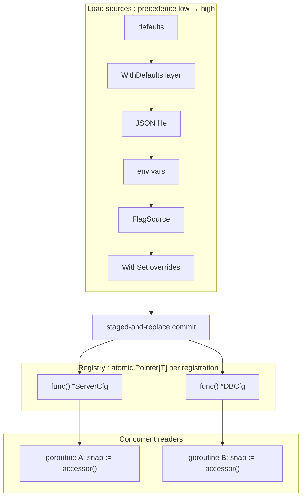

# Conf

<!--
  Section headers below are STABLE ANCHORS. Magpie extracts content by header,
  so do not rename or reorder them. Doing so is a process change requiring its
  own spec.

  Sections marked **Public** are extracted by Magpie for the public site.
  Sections marked **Internal** are engineering-only and never appear in published docs.
-->

## Public Summary

<!-- **Public.** One paragraph in end-user voice. The canonical description for the site and README. -->

`conf` is Glacier's layered-configuration package. Packages declare their configuration needs once :  `conf.Register[T]("section", defaults)` :  and receive a snapshot accessor, `func() *T`, that always returns the latest fully-loaded struct. At startup, `conf.Load(ctx, opts...)` reads sources in precedence order :  defaults, optional JSON file, environment variables, flag values, and explicit overrides :  and atomically replaces every registered struct in a single staged-and-replace commit. Any concurrent reader always sees either the pre-load or the post-load whole struct; torn reads are impossible. One-shot consumers that do not need the registry can call `conf.Decode[T]` directly. `conf` uses only the Glacier kernel and internal helpers; it introduces no external dependencies.

## Mental Model

<!-- **Public.** The conceptual frame a developer should hold while using this. Mermaid diagrams welcome. Source for the "Concepts" page on the site. -->

`conf` has two distinct usage modes:

**Registry mode** (the normal case). Packages call `Register[T]` at init time to declare their configuration section. `Register` returns a snapshot accessor :  a `func() *T` :  that always reflects the most recently committed Load. Under the hood each registration is an `atomic.Pointer[T]`; Load builds all new structs from scratch, then swaps every pointer in a single pass. Readers hold no lock; they call the accessor and get an immutable snapshot.

**One-shot mode**. A consumer that doesn't want a long-lived registry :  an integration test, a migration script, a CLI command :  calls `Decode[T]` with options inline. No `Loader`, no registration, no state.

The **precedence stack** is fixed and applied left-to-right, each layer overwriting only the keys it supplies:

```
defaults → WithDefaults layer → JSON file → environment variables → flag source → explicit Set overrides
  (lowest)                                                                          (highest)
```

Field-name resolution uses the `json` struct tag when present, falling back to the upper-snake-case of the Go field name. Environment-variable names are derived as:

```
<EnvPrefix>__<UPPER_SNAKE_SECTION_PATH>__<UPPER_SNAKE_FIELD>
```

For example, section `"server"`, field with tag `json:"port"`, prefix `"APP"` → `APP__SERVER__PORT`.



Validation is intentionally **not** part of `Load`. After `Load` succeeds, call `option.Validate` (or any validation logic) against the snapshot. Keeping decode and validate separate means `conf` stays composable: each package applies its own invariants without coupling them to the load mechanism.

## Goals

<!-- **Internal.** Bulleted list. -->

- Provide a package-scoped registration pattern so packages declare configuration without depending on each other or on a central config struct.
- Implement a fixed five-layer precedence stack: defaults, optional WithDefaults layer, JSON file, env vars, flag source, explicit Set.
- Guarantee atomic visibility: concurrent readers never observe a partially-written configuration struct.
- Derive environment-variable names from `json` struct tags automatically, with a clear fallback rule.
- Support one-shot decode (`Decode[T]`) without registry state.
- Provide `MustLoad` for programs that treat configuration errors as fatal.
- Implement `Loader.Close` as an idempotent no-op (v0) that is lifecycle-safe for future file-watcher additions.
- Integrate `internal/safefile` for path canonicalization and `internal/safejson` for JSON parsing with size and depth caps.
- Emit structured debug logs via `log` for every layer applied during Load.
- Follow the library register error format (`"conf: <action>: <detail>"`).

## Non-Goals

<!-- **Internal.** Bulleted list. What this spec deliberately excludes. -->

- **YAML, TOML, HCL, or any format other than JSON** :  deferred to a future spec.
- **Hot-reload / file watching** :  `Loader.Close` is a lifecycle hook reserved for this; the feature itself is not v0.
- **Secret sources** (Vault, AWS Secrets Manager, etc.) :  not in scope.
- **Schema validation** during Load :  use `option.Validate` after Load.
- **Hierarchical include directives** in JSON files :  explicitly rejected for security (see Security section).
- **Remote configuration** (etcd, Consul, etc.) :  not in scope.
- **Automatic unmarshalling of maps from environment variables** :  env vars do not populate `map[K]V` fields; documented and enforced.

## Architecture

<!-- **Internal.** Mermaid diagram + prose. Package layout, data flow, lifecycle. -->

### Package layout

```
conf/
├── conf.go           :  package doc, Loader type, Load, MustLoad, Decode[T]
├── register.go       :  Register[T], global registry, snapshot accessor construction
├── sources.go        :  WithFile, WithEnvPrefix, WithEnvSliceSep, WithFlagSource, WithSet, WithDefaults, WithLogger option types
├── merge.go          :  layer-application engine, field-name resolution, type coercion
├── errors.go         :  DecodeError, ErrLayerConflict, ErrFileTooLarge, ErrDepthExceeded sentinels
├── example_test.go   :  godoc examples
└── internal/
    (uses internal/safefile and internal/safejson from the module root :  not duplicated here)
```

### Atomic load model (§23.14)

Each call to `Register[T]` stores an `atomic.Pointer[T]` in the global registry under the registration path. Load proceeds in three phases:

1. **Decode phase**: Build every registered struct from scratch by applying all sources in precedence order. No registry mutation happens here.
2. **Validate phase**: Any per-Load checks (type coercion errors, DecodeError on unknown fields, etc.) surface here. If any error occurs, the function returns the error and **no** registered struct is mutated.
3. **Commit phase**: For each registration, call `atomic.Pointer[T].Store` with the freshly built struct. The commit is sequential over registrations but each individual Store is atomic. Readers between two consecutive Stores may observe a mix of old and new registrations :  this is acceptable because each individual accessor is always consistent with itself. There is no "cross-registration transaction" guarantee; registrations are independent units of configuration.

The snapshot accessor returned by `Register[T]` is:

```go
func() *T {
    return ptr.Load()
}
```

where `ptr` is the `*atomic.Pointer[T]` for that registration. The accessor captures the pointer by reference at registration time. After Load commits, all subsequent accessor calls return the new struct.

### `internal/safefile` integration (§23.10)

Before opening a configuration file, `conf` passes the caller-supplied path through `internal/safefile.Canonicalize`, which:

- Rejects paths containing `..` components.
- Rejects symlinks (via `os.Lstat` :  if `ModeSymlink` is set, reject).
- Rejects UNC paths on Windows (`\\server\share\`).
- Rejects non-regular files (pipes, devices, etc.).
- Returns a cleaned absolute path or an error.

### `internal/safejson` integration

All JSON decoding goes through `internal/safejson.Decode`, which wraps `encoding/json` with:

- A 1 MiB file-size cap enforced before decoding (stat the file; if `Size > 1<<20`, return `ErrFileTooLarge`).
- A nesting-depth cap of 32 enforced via a token-counting pre-scan or a custom decoder.
- `json.Decoder.DisallowUnknownFields()` :  unknown fields in the JSON surface as `DecodeError`.
- UTF-8 validation (the standard library does this; `safejson` does not weaken it).

### Concurrency invariants

- `Register[T]` is goroutine-safe during the program's init phase. The global registry uses a `sync.Mutex` for writes. `Register` after the first `Load` is permitted; the new registration is populated on the next `Load`.
- `Load` serializes with itself via a `sync.Mutex` on the `Loader`. Concurrent `Load` calls block; the second Load runs after the first completes.
- Snapshot accessor calls (`func() *T`) are lock-free; they call `atomic.Pointer[T].Load()` directly.
- `Close` is idempotent; implemented with `sync.Once`.

## Schema

<!-- **Internal.** Go types with invariants stated as `// invariant: ...` comments on each field. -->

```go
// Loader holds the mutable state for a configuration load session.
// The zero value is not usable; obtain one via conf.NewLoader or use the
// package-level Load / MustLoad / Decode functions which create an implicit Loader.
type Loader struct {
    // invariant: mu serializes concurrent Load calls; never held across a commit.
    mu sync.Mutex
    // invariant: closed is set exactly once by Close; all post-Close Load calls
    // return ErrLoaderClosed.
    closed sync.Once
    // invariant: logger is the slog.Logger used for per-layer debug events;
    // defaults to slog.Default() if not set via WithLogger.
    logger *slog.Logger
    // invariant: opts is the resolved slice of load options for this Loader.
    opts []LoadOption
}

// registration is the internal registry entry for a single Register[T] call.
type registration struct {
    // invariant: path is the dot-separated section path; "" is the root.
    path string
    // invariant: ptr is the atomic pointer backing the snapshot accessor.
    // Its concrete type is *atomic.Pointer[T] for the T used at registration.
    ptr  any   // *atomic.Pointer[T] :  erased to any for heterogeneous storage
    // invariant: defaults is the zero-value or caller-supplied default struct,
    // serialized at registration time; never mutated after Register returns.
    defaults any // *T :  pointer to a copy of the defaults value
    // invariant: store is a func(*T) that calls ptr.Store(v); captures ptr.
    store func(any)
    // invariant: load is a func() any that calls ptr.Load(); returns *T as any.
    load  func() any
}

// DecodeError is the single error type emitted by conf for all decode failures.
// It wraps the underlying cause and implements errors.Is / errors.As / Unwrap.
type DecodeError struct {
    // invariant: Path is the dot-separated field path where decoding failed;
    // may be "" for top-level failures (e.g., file not found).
    Path  string
    // invariant: Cause is the underlying error; never nil when DecodeError is returned.
    Cause error
    // invariant: Layer identifies which source layer produced the error
    // (e.g., "file", "env", "set", "flag"); informational only.
    Layer string
}

// FlagSource is the interface a caller implements to feed flag values into Load.
// Implementations must be goroutine-safe.
type FlagSource interface {
    // Lookup returns the string value for the given dot-path key and true
    // if the flag was explicitly set, or ("", false) if not.
    Lookup(path string) (value string, ok bool)
}
```

## API

<!--
  **Public.** Every exported symbol introduced by this spec.
  For each: signature, doc comment (which becomes godoc), preconditions, postconditions,
  error contract, concurrency notes (goroutine-safe? blocking?), lifecycle hooks.
  Magpie extracts signatures + doc comments verbatim to the API reference page.
-->

### `Register[T]`

```go
// Register declares a configuration section of type T at the given dot-separated
// path and returns a snapshot accessor. The accessor returns the most recently
// committed *T from the last successful Load, or the defaults if Load has never
// been called. The returned func is goroutine-safe and lock-free.
//
// path may be "" to register the root configuration struct.
// defaults is the value to use when no source supplies a key; it is copied
// at registration time and never mutated.
//
// Panics if path has already been registered (duplicate registration is always
// a programming error). The panic message is:
//   conf: register: path "<path>" already registered
//
// Register is goroutine-safe. It may be called after the first Load; the new
// registration is populated on the next Load.
func Register[T any](path string, defaults T) func() *T
```

- **Preconditions**: `path` must not duplicate an existing registration. `T` must be a struct type (validated at first Load; if not, Load returns DecodeError).
- **Postconditions**: Returns a non-nil accessor. Before the first Load, the accessor returns a pointer to a copy of `defaults`.
- **Error contract**: Panics on duplicate path. Does not panic for any other reason.
- **Concurrency**: Goroutine-safe. The returned accessor is lock-free.

### `Load`

```go
// Load applies configuration sources to all registered sections and atomically
// replaces every registered struct with its newly decoded value.
//
// Sources are applied in precedence order (lowest to highest):
//   defaults → WithDefaults layer → JSON file → env vars → flag source → WithSet overrides
//
// Load is atomic with respect to errors: if any source fails to decode, NO
// registered struct is mutated and Load returns the first DecodeError encountered.
//
// Load serializes with itself: concurrent calls block until the in-flight Load
// completes. Load is not re-entrant.
//
// ctx is used for cancellation of I/O operations. A cancelled ctx causes Load
// to return ctx.Err() wrapped in a DecodeError with Path="" and Layer="ctx".
func Load(ctx context.Context, opts ...LoadOption) error
```

- **Preconditions**: None. If no registrations exist, Load is a no-op returning nil.
- **Postconditions**: On success, every registered snapshot accessor returns the newly decoded struct. On error, no snapshot is mutated.
- **Error contract**: Returns `*DecodeError` for all configuration decode failures. Returns `ctx.Err()` (wrapped) on context cancellation. Returns `ErrLoaderClosed` if the Loader has been closed.
- **Concurrency**: Goroutine-safe. Serializes concurrent calls. Blocking.

### `MustLoad`

```go
// MustLoad calls Load and panics if Load returns a non-nil error.
// Intended for program startup where configuration errors are fatal.
// The panic value is the error returned by Load.
func MustLoad(ctx context.Context, opts ...LoadOption)
```

- **Preconditions**: Same as Load.
- **Postconditions**: Same as Load on success. Panics on any Load error.
- **Error contract**: Panics with the Load error value; does not recover.
- **Concurrency**: Same as Load.

### `Decode[T]`

```go
// Decode applies configuration sources to a single struct of type T without
// using or modifying the global registry. It is the one-shot alternative to
// Register + Load.
//
// opts follow the same precedence rules as Load. T must be a struct type.
// Decode returns a fully populated *T on success.
//
// Decode does not call Register and has no effect on any registered snapshots.
func Decode[T any](ctx context.Context, opts ...LoadOption) (*T, error)
```

- **Preconditions**: `T` must be a struct type.
- **Postconditions**: Returns a non-nil `*T` on success. On error, returns nil and a `*DecodeError`.
- **Error contract**: Returns `*DecodeError` for all failures.
- **Concurrency**: Goroutine-safe. Does not access global registry state for writes.

### `Loader` type and `NewLoader`

```go
// NewLoader creates a Loader with the given options pre-applied as defaults.
// Subsequent calls to loader.Load may supply additional per-call options that
// are merged (not replaced) with the Loader's defaults.
//
// Most callers do not need a Loader directly; use the package-level Load,
// MustLoad, and Decode functions.
func NewLoader(opts ...LoadOption) *Loader

// Load on a Loader behaves identically to the package-level Load but uses the
// Loader's internal state for serialization and lifecycle management.
func (l *Loader) Load(ctx context.Context, opts ...LoadOption) error

// MustLoad on a Loader behaves identically to the package-level MustLoad.
func (l *Loader) MustLoad(ctx context.Context, opts ...LoadOption)

// Close releases internal state held by the Loader. Close is idempotent:
// the second and subsequent calls return nil immediately. After Close, Load
// returns ErrLoaderClosed.
//
// In v0, Close performs no I/O (no file watchers). It is provided to satisfy
// the lifecycle contract and to allow future hot-reload additions without
// breaking callers.
func (l *Loader) Close() error
```

### Load options

```go
// WithFile instructs Load to parse the given path as a JSON configuration file.
// The path is canonicalized via internal/safefile before opening:
//   - ".." components are rejected.
//   - Symlinks are rejected (via os.Lstat).
//   - UNC paths are rejected on Windows.
//   - Non-regular files (pipes, devices) are rejected.
//   - File size must not exceed 1 MiB.
//   - JSON nesting depth must not exceed 32.
//   - Unknown fields in the JSON cause a DecodeError.
//
// If the file does not exist, Load returns DecodeError{Cause: fs.ErrNotExist}.
// WithFile may be called at most once per Load; a second WithFile replaces the first.
func WithFile(path string) LoadOption

// WithEnvPrefix instructs Load to read environment variables of the form:
//   <prefix>__<UPPER_SNAKE_SECTION>__<UPPER_SNAKE_FIELD>
//
// Field names are derived from the json struct tag when present, falling back
// to the upper-snake-case of the Go field name. Without WithEnvPrefix, no
// environment variables are read.
//
// prefix must be non-empty. Case-folding: the prefix is used as-is; the
// section and field components are always upper-snake-cased.
func WithEnvPrefix(prefix string) LoadOption

// WithEnvSliceSep sets the separator used to split a single environment
// variable value into a []string slice. Default is ",".
// Has no effect on JSON array decoding.
func WithEnvSliceSep(sep string) LoadOption

// WithFlagSource registers a FlagSource that Load queries after environment
// variables. FlagSource.Lookup is called with the dot-path key; only keys
// where ok==true are applied.
func WithFlagSource(fs FlagSource) LoadOption

// WithSet sets a single configuration key to a value at the highest precedence
// layer, overriding all sources. path is a dot-separated field path
// (e.g., "server.port"). value must be assignable to the field's type;
// a type mismatch returns DecodeError at Load time.
//
// Paths with leading or trailing dots, consecutive dots, or control characters
// are rejected with DecodeError{Layer:"set"}.
func WithSet(path string, value any) LoadOption

// WithDefaults registers an additional defaults layer applied after the
// Register-level defaults but before the JSON file. Useful for computed
// defaults that depend on runtime state (e.g., os.Getenv("HOME")).
func WithDefaults(fn func() map[string]any) LoadOption

// WithLogger sets the slog.Logger used for per-layer debug events during Load.
// Each layer application emits a slog.Debug event with the layer name and
// the keys it supplied. If not set, slog.Default() is used.
func WithLogger(l *slog.Logger) LoadOption
```

### `FlagSource` interface

```go
// FlagSource is implemented by callers that want to feed flag values into
// conf.Load. The standard implementation wraps a *flag.FlagSet.
//
// Implementations must be goroutine-safe.
type FlagSource interface {
    // Lookup returns the string value for the given dot-path key and true
    // if the flag was explicitly set by the user, or ("", false) if not.
    // path uses the same dot-separated convention as conf field paths.
    Lookup(path string) (value string, ok bool)
}
```

### Errors

```go
// DecodeError is returned by Load, MustLoad, and Decode for all configuration
// decode failures. It implements error, errors.Is (against Cause), and Unwrap.
//
// Error() formats as: "conf: decode <path>: <cause>"
// When Path is "", Error() formats as: "conf: decode: <cause>"
type DecodeError struct {
    Path  string // dot-separated field path; "" for top-level failures
    Cause error  // underlying error; always non-nil
    Layer string // source layer that failed; informational
}

func (e *DecodeError) Error() string
func (e *DecodeError) Unwrap() error // returns e.Cause

// ErrLayerConflict is the sentinel wrapped as Cause in a DecodeError when
// two sources supply incompatible types for the same field
// (e.g., file sets "port" to an object, env sets it to an integer).
var ErrLayerConflict = errs.Sentinel("conf: layer conflict: incompatible types for field")

// ErrFileTooLarge is the sentinel wrapped as Cause in a DecodeError when
// the configuration file exceeds 1 MiB.
var ErrFileTooLarge = errs.Sentinel("conf: file too large: maximum size is 1 MiB")

// ErrDepthExceeded is the sentinel wrapped as Cause in a DecodeError when
// the configuration file's JSON nesting depth exceeds 32.
var ErrDepthExceeded = errs.Sentinel("conf: depth exceeded: maximum nesting depth is 32")

// ErrLoaderClosed is returned by Load after Close has been called.
var ErrLoaderClosed = errs.Sentinel("conf: loader closed")
```

### Type-mapping rules (F12–F17)

The merge engine applies the following rules when converting a string value (from env or flags) to a struct field type:

| Go type | Parsing rule |
|---|---|
| `string` | Used verbatim |
| `bool` | `"true"`, `"1"` → true; `"false"`, `"0"` → false; other → DecodeError |
| `int`, `int8`, `int16`, `int32`, `int64` | `strconv.ParseInt(v, 10, bits)` |
| `uint`, `uint8`, `uint16`, `uint32`, `uint64` | `strconv.ParseUint(v, 10, bits)` |
| `float32`, `float64` | `strconv.ParseFloat(v, bits)` |
| `time.Duration` | `time.ParseDuration(v)` |
| `time.Time` | `time.Parse(time.RFC3339, v)` |
| `[]T` (where T is a scalar above) | Split on `WithEnvSliceSep` (default `,`); parse each element as T |
| `*T` | Pointer fields: if any source provides a value for any sub-key, the pointer is allocated and the value is decoded into it; absent pointer fields remain nil |
| `map[K]V` | Not populated from env/flags; JSON only; documented behaviour |

## Examples

<!--
  **Public.** Runnable Go examples in fenced ```go blocks.
  Each example is self-contained and `go test ./...`-compatible (valid Example functions).
  Magpie transcludes verbatim into tutorials.
-->

### Multi-package registration

Two independent packages register their config sections at init time. The main package calls `conf.Load` once at startup.

```go
// Package server registers its own configuration section.
package server

import "github.com/glacierframework/glacier/conf"

type Config struct {
    Host string `json:"host"`
    Port int    `json:"port"`
}

var cfg = conf.Register[Config]("server", Config{
    Host: "localhost",
    Port: 8080,
})

// Cfg returns the most recently loaded server configuration snapshot.
// The returned pointer is immutable; do not modify it.
func Cfg() *Config { return cfg() }
```

```go
// Package db registers its own configuration section.
package db

import "github.com/glacierframework/glacier/conf"

type Config struct {
    DSN      string `json:"dsn"`
    MaxConns int    `json:"max_conns"`
}

var cfg = conf.Register[Config]("db", Config{MaxConns: 10})

// Cfg returns the most recently loaded database configuration snapshot.
func Cfg() *Config { return cfg() }
```

```go
// main.go :  load configuration from a JSON file and environment variables.
package main

import (
    "context"
    "log"

    "github.com/glacierframework/glacier/conf"

    _ "myapp/db"     // side-effect: db.init() registers "db" section
    _ "myapp/server" // side-effect: server.init() registers "server" section
)

func main() {
    if err := conf.Load(
        context.Background(),
        conf.WithFile("config.json"),
        conf.WithEnvPrefix("APP"),
    ); err != nil {
        log.Fatal(err)
    }
    // server.Cfg() and db.Cfg() now return populated snapshots.
}
```

### config.json example

```json
{
    "server": {
        "host": "0.0.0.0",
        "port": 9090
    },
    "db": {
        "dsn": "postgres://localhost/myapp?sslmode=disable",
        "max_conns": 25
    }
}
```

### Environment variable override

With prefix `APP`, the field `server.port` is overridden by `APP__SERVER__PORT`:

```
APP__SERVER__PORT=9091
APP__DB__MAX_CONNS=50
```

```go
func ExampleLoad_envOverride() {
    os.Setenv("APP__SERVER__PORT", "9091")
    defer os.Unsetenv("APP__SERVER__PORT")

    if err := conf.Load(
        context.Background(),
        conf.WithEnvPrefix("APP"),
    ); err != nil {
        log.Fatal(err)
    }
    // server.Cfg().Port == 9091
}
```

### One-shot decode (no registry)

```go
func ExampleDecode() {
    type AppConfig struct {
        Debug bool   `json:"debug"`
        Addr  string `json:"addr"`
    }

    cfg, err := conf.Decode[AppConfig](
        context.Background(),
        conf.WithFile("config.json"),
        conf.WithEnvPrefix("APP"),
    )
    if err != nil {
        log.Fatal(err)
    }
    fmt.Println(cfg.Addr)
}
```

### Programmatic override with WithSet

```go
func ExampleLoad_withSet() {
    if err := conf.Load(
        context.Background(),
        conf.WithFile("config.json"),
        conf.WithSet("server.port", 9999),
    ); err != nil {
        log.Fatal(err)
    }
    // server.Cfg().Port == 9999 regardless of file or env value
}
```

### Validation after Load

`conf.Load` does not validate semantic invariants. Use `option.Validate` after Load:

```go
func ExampleLoad_withValidation() {
    if err := conf.Load(
        context.Background(),
        conf.WithFile("config.json"),
        conf.WithEnvPrefix("APP"),
    ); err != nil {
        log.Fatal(err)
    }

    cfg := server.Cfg()
    if cfg.Port < 1 || cfg.Port > 65535 {
        log.Fatalf("invalid port: %d", cfg.Port)
    }
}
```

### FlagSource integration

```go
func ExampleLoad_withFlagSource() {
    fs := flag.NewFlagSet("app", flag.ContinueOnError)
    port := fs.Int("server.port", 8080, "server port")
    if err := fs.Parse(os.Args[1:]); err != nil {
        log.Fatal(err)
    }

    if err := conf.Load(
        context.Background(),
        conf.WithFile("config.json"),
        conf.WithEnvPrefix("APP"),
        conf.WithFlagSource(flagSourceFor(fs, port)),
    ); err != nil {
        log.Fatal(err)
    }
}
```

### Loader lifecycle (Close)

```go
func ExampleLoader_Close() {
    loader := conf.NewLoader(
        conf.WithFile("config.json"),
        conf.WithEnvPrefix("APP"),
    )
    defer loader.Close()

    if err := loader.Load(context.Background()); err != nil {
        log.Fatal(err)
    }
}
```

## Test Matrix

<!--
  **Internal.** Owned by Lynx.
  Table: scenario × input × expected outcome × covered-by-test-name.
-->

| # | Name | Spec ref | Type | Description | Test helpers used |
|---|---|---|---|---|---|
| 1 | TestRegisterReturnsTypedAccessor | §21.7 F1, §23.14 | Unit (positive) | `Register[T](path, defaults)` returns `func() *T` snapshot accessor; before Load, accessor returns pointer to defaults copy. | `assert.NotNil`, generic-typed assertions |
| 2 | TestRegisterDuplicatePanics | §21.7 E1 | Unit (negative) | Second `Register` at same path panics with `"conf: register: path \"server\" already registered"`. | `assert.PanicsWithMessage` |
| 3 | TestRegisterEmptyPathIsRoot | §21.7 E2 | Unit (positive) | `Register("", T)` treats as root config section. | `assert.Equal` |
| 4 | TestLoadDefaultsOnly | §21.7 E3 | Unit (positive) | No options → registered structs reflect defaults. | `assert.Equal` |
| 5 | TestLoadFile | §21.7 F6 | Unit (positive) | `WithFile` populates from JSON. | `fixture.NewFS` (or `t.TempDir`+JSON), `assert.Equal` |
| 6 | TestLoadFilePrecedenceOverDefaults | §21.7 F5 | Unit (positive) | File value beats defaults. | `assert.Equal` |
| 7 | TestLoadEnvPrecedenceOverFile | §21.7 F5 | Unit (positive) | Env wins over file. | `t.Setenv`, `assert.Equal` |
| 8 | TestLoadFlagPrecedenceOverEnv | §21.7 F5, F8 | Unit (positive) | Mock FlagSource wins over env. | `mock.Of[FlagSource]`, `assert.Equal` |
| 9 | TestLoadSetPrecedenceOverFlag | §21.7 F5, F9 | Unit (positive) | `WithSet` wins over all. | `assert.Equal` |
| 10 | TestEnvDoubleUnderscoreSeparator | §21.7 F7 | Unit (positive) | `APP__SERVER__PORT` → `server.port`. | `t.Setenv` |
| 11 | TestEnvDerivesFromJSONTag | §21.7 F12 | Unit (positive) | Field with `json:"max_conns"` reads `APP__DB__MAX_CONNS`. | `t.Setenv` |
| 12 | TestEnvFallsBackToFieldName | §21.7 F12 | Unit (positive) | No json tag → upper-snake of Go field name. | `t.Setenv` |
| 13 | TestNestedStructsViaPath | §21.7 F13 | Unit (positive) | `server.tls.cert_file` works for both file and env. | `t.Setenv`, `assert.Equal` |
| 14 | TestPointerFieldOptionalNil | §21.7 F14, E11 | Unit (positive) | `*Foo` absent → nil. | `assert.Nil` |
| 15 | TestPointerFieldOptionalAllocated | §21.7 F14, E12 | Unit (positive) | Any source mentions sub-key → ptr allocated and populated. | `assert.NotNil` |
| 16 | TestSliceFromJSONArray | §21.7 F15, E10 | Unit (positive) | JSON `["a","b"]` → `[]string{"a","b"}`. | `assert.Equal` |
| 17 | TestSliceFromEnvCommaSplit | §21.7 F15 | Unit (positive) | `APP__SERVERS=a,b,c` → `[]string{"a","b","c"}`. | `assert.Equal` |
| 18 | TestSliceFromEnvCustomSep | §21.7 F15 | Unit (positive) | `WithEnvSliceSep(":")` splits on `:`. | `assert.Equal` |
| 19 | TestMapFromJSON | §21.7 F16 | Unit (positive) | JSON object → `map[string]V`. | `assert.Equal` |
| 20 | TestMapFromEnvUnsupported | §21.7 F16 | Unit (negative) | Env vars do not populate maps; documented; no-op without error if no other source. | `assert.Equal` |
| 21 | TestDurationFromEnv | §21.7 F17, E9 | Unit (positive) | `APP__TTL=30s` → `30 * time.Second`. | `t.Setenv`, `assert.Equal` |
| 22 | TestTimeRFC3339FromEnv | §21.7 F17 | Unit (positive) | RFC3339 string parses to `time.Time`. | `assert.Equal` |
| 23 | TestNumericParseError | §21.7 E8 | Unit (negative) | `APP__PORT=not-a-number` → `DecodeError{Path:"server.port", Cause: strconv.ErrSyntax}`. | `assert.ErrorAs`, `assert.ErrorIs` |
| 24 | TestBoolFromEnv | §21.7 F17 | Unit (positive) | `"true"`, `"false"`, `"1"`, `"0"` parse correctly. | `assert.Equal` |
| 25 | TestUnknownJSONFieldRejected | §21.7 E5, F18 | Unit (negative) | `DisallowUnknownFields` → `DecodeError`. | `assert.ErrorAs` |
| 26 | TestFileTooLarge | §21.7 E6, F18, NF8 | Unit (negative) | File > 1 MiB → `DecodeError{Cause: ErrFileTooLarge}`. | `assert.ErrorIs` |
| 27 | TestDepthExceeded | §21.7 E7, F18, NF8 | Unit (negative) | JSON depth > 32 → `DecodeError{Cause: ErrDepthExceeded}`. | `assert.ErrorIs` |
| 28 | TestPathTraversalRejected | §21.7 E17, NF8 | Unit (negative :  Falcon §1.12) | File path containing `..` rejected by `internal/safefile`. | `assert.ErrorContains` |
| 29 | TestSymlinkRejected | §21.7 E18, NF8 | Unit (negative) | Symlinked file rejected via `os.Lstat`. | `os.Symlink` setup, `assert.ErrorContains` |
| 30 | TestWindowsUNCPathRejected | §21.7 NF8 | Unit (negative :  Windows-only) | `\\server\share\` rejected. | build-tag windows test |
| 31 | TestNonRegularFileRejected | §21.7 NF8 | Unit (negative) | Named pipe or device file rejected. | platform-conditional |
| 32 | TestFileMissing | §21.7 E4 | Unit (negative) | File with `WithFile` absent → `DecodeError{Cause: fs.ErrNotExist}`. | `assert.ErrorIs` |
| 33 | TestAtomicLoadFailureNoMutation | §21.7 NF3, E13, E14 | Unit (positive) | Failure mid-Load: NO registered struct mutated; snapshots unchanged. | `assert.Equal`, snapshot before/after |
| 34 | TestAtomicLoadAtomicPointerNoTorn | §23.14 (Major B) | Race | Concurrent readers via snapshot accessor during Load :  no torn struct ever observed; readers see either pre-Load or post-Load entire struct. | `concur.Group`, `-race`, `assert.Equal` |
| 35 | TestConcurrentLoadSerializes | §21.7 E13, NF4 | Race | Two concurrent `Load` calls: second blocks until first completes. | `concur.WaitGroup`, timing harness |
| 36 | TestConcurrentReadsDuringLoadRaceClean | §21.7 E14, NF4 | Race | 100 readers via snapshot accessor while 10 Loads cycle; `-race` clean. | `-race`, `fixture.GuardLeaks(WatchGoroutines)` |
| 37 | TestReLoadInPlace | §21.7 F4 | Unit (positive) | Second `Load` replaces contents; staged-and-replace. | `assert.Equal` |
| 38 | TestDecodeOneShot | §21.7 F3 | Unit (positive) | `Decode[T]` without registry returns populated struct. | `assert.Equal` |
| 39 | TestDecodeNoExportedFields | §21.7 E15 | Unit (edge) | `Decode[T]` where T has no exported fields → zero T, no error. | `assert.NoError` |
| 40 | TestMustLoadPanicsOnError | §21.7 F20 | Unit (negative) | `MustLoad` panics with Load error on file error. | `assert.Panics` |
| 41 | TestMustLoadSucceedsNoOp | §21.7 F20 | Unit (positive) | `MustLoad` with valid sources does not panic. | `assert.NoError` (paired) |
| 42 | TestWithSetTypeMismatch | §21.7 E16 | Unit (negative) | `WithSet("server.port", "string")` for int field → `DecodeError`. | `assert.ErrorAs` |
| 43 | TestWithSetUnknownPath | §21.7 F9 | Unit (negative) | `WithSet` on unregistered path → `DecodeError`. | `assert.ErrorAs` |
| 44 | TestWithDefaultsLayer | §21.7 F10 | Unit (positive) | `WithDefaults` applies between defaults and file layer. | `assert.Equal` |
| 45 | TestWithLoggerLogsPerLayer | §21.7 F11 | Unit (positive) | Each layer applied emits a `slog.Debug` event; log output contains layer name. | `fixture.Capture` + custom slog handler, `assert.Contains` |
| 46 | TestDecodeErrorMessageFormat | §21.7 F21 | Unit (positive) | `(*DecodeError).Error()` formats as `"conf: decode <path>: <cause>"`. | `assert.Equal` |
| 47 | TestDecodeErrorUnwrap | §21.7 F21 | Unit (positive) | `errors.Is(de, de.Cause)` is true. | `assert.ErrorIs` |
| 48 | TestErrLayerConflictSentinel | §21.7 F22 | Unit (positive) | Cross-layer type conflict surfaces `ErrLayerConflict`. | `assert.ErrorIs` |
| 49 | TestErrFileTooLargeSentinel | §21.7 F23 | Unit (positive) | `ErrFileTooLarge` sentinel is stable across calls. | `assert.ErrorIs` |
| 50 | TestErrDepthExceededSentinel | §21.7 F23 | Unit (positive) | `ErrDepthExceeded` sentinel is stable across calls. | `assert.ErrorIs` |
| 51 | TestErrFormatRegisterCompliance | §21.7 NF5, D15 | Unit (cross-cutting) | Every `conf`-emitted error matches library register regex `^conf: `. | `assert.Regexp` |
| 52 | TestValidateAfterLoad | §21.7 F19 | Unit (integration) | After `Load`, `option.Validate(*Cfg, ...)` enforces semantic invariants. | `option.Validate`, `assert.NoError` / `assert.ErrorIs` |
| 53 | TestOptionRequiredTLoadBearing | §23.17 | Unit (generics) | `option.Required[T any](name, getter func(*T) any)` :  T threaded through; compile error on T mismatch. | compile-only sample + runtime check |
| 54 | TestLoaderCloseIdempotent | §23.16 | Unit (lifecycle) | `Loader.Close()` idempotent: 2nd call returns nil. | `assert.NoError` (paired) |
| 55 | TestLoaderCloseJoinsErrors | §23.16 | Unit (lifecycle) | Close errors from multiple resources joined via `errs.Join`. | `errs.Chain`, `assert.ErrorIs` |
| 56 | TestMultipleRegistrationsAtomic | §21.7 NF3 | Unit (positive) | 50 registrations; one Load fails mid-way; NO struct mutated. | `assert.Equal` |
| 57 | TestRegisterAfterLoadCoveredByNextLoad | §21.7 F1 | Unit (positive) | `Register` post-Load is covered by the next `Load`. | `assert.Equal` |
| 58 | FuzzLoadJSON | §21.7 F18 (req #3, D31) | Fuzz | JSON parser (`internal/safejson`): random bytes → never panics; size-cap and depth-cap enforced; UTF-8 validation enforced. | `testing.F` |
| 59 | FuzzWithSetPathCoercion | req #3 | Fuzz | Attacker-shaped paths (`server..port`, `server.port.`, `..server`, control chars) into `WithSet` :  never panics; always returns `DecodeError` or applies cleanly. | `testing.F` |
| 60 | PropertyLoadIdempotent | §21.7 (req #5) | Property | `Load` of identical sources yields identical struct values across runs. | `assert.Equal` |
| 61 | PropertyLoadLoadIdempotent | §21.7 F4 (req #5) | Property | Two consecutive `Load` calls with same sources produce identical results. | `assert.Equal` |
| 62 | PropertyPrecedenceMonotonic | §21.7 F5 | Property | Adding a higher-precedence source never reduces config completeness. | `assert.True` |
| 63 | TestEnvPrefixAllowlist | §21.7 NF8 (Falcon) | Unit (negative) | Without `WithEnvPrefix`, no env vars are read. With prefix `APP`, only `APP__*` are read. | `t.Setenv`, `assert.Equal` |
| 64 | TestNoIncludeDirectivesAccepted | §21.7 NF8 (Falcon) | Unit (negative) | JSON containing `$include` keys treated as ordinary unknown field → `DecodeError` per `DisallowUnknownFields`. | `assert.ErrorAs` |
| 65 | TestNoCommandStringFields | §21.7 NF8 (Falcon) | Unit (architectural) | Type-driven lint: no field type can coerce a raw command string. Walk via `internal/reflectx`. | `internal/reflectx` walk |
| 66 | BenchmarkLoadOneRegistration | §21.7 NF1 | Benchmark | Single registration, single source. | `testing.B` |
| 67 | BenchmarkLoadFiftyRegistrations | §21.7 NF1, req #2 | Benchmark | 50 registrations × file source :  D35 regression gate. | `testing.B`, benchstat |
| 68 | BenchmarkDecode | §21.7 NF1 | Benchmark | One-shot `Decode[T]` for typical 5-field struct. | `testing.B` |
| 69 | BenchmarkReflectionCacheHot | §21.7 NF1 | Benchmark | Verifies `internal/reflectx` cache: 2nd Load faster than 1st. | `testing.B` |

### Coverage targets

- 100% line coverage on every public symbol across F1–F23.
- 100% on `errors.go` sentinel paths.
- ≥ 95% line on `load.go` (atomic commit path).
- ≥ 95% line on `file.go` (size/depth/symlink rejection).

### Edge cases not in spec

- **EX1**: JSON file with BOM :  UTF-8 BOM stripped silently; UTF-16 BOM rejected with `DecodeError`.
- **EX2**: Concurrent `Register` from multiple goroutines during init :  mutex-guarded; safe.
- **EX3**: Env var `APP__SERVER__PORT=` (empty value) :  counts as "set" and overrides file value.
- **EX4**: Field with `json:"name,omitempty"` tag :  `omitempty` affects only Marshal, not Load; ignored during decode.
- **EX5**: Path `server.tls.cert_file` in `WithSet` with leading/trailing dots :  rejected with `DecodeError`.
- **EX6**: JSON root that is a number or array (not an object) :  rejected with `DecodeError`.
- **EX7**: `MustLoad` from a goroutine :  panics in goroutines propagate to the goroutine's stack; documented in godoc.

## Dependency Justification

<!--
  **Internal.** Owned by Falcon.
  One row per new direct dependency. The empty table is the goal.
  Required answers: license, last-release-date, maintainer count, alternatives considered, why we don't roll our own.
-->

| Module | Version | License | Last release | Maintainers | Alternatives considered | Why we can't roll our own |
|---|---|---|---|---|---|---|

`conf` introduces no new direct dependencies. It uses only the Go standard library (`encoding/json`, `os`, `sync/atomic`, `reflect`, `strconv`, `context`, `log/slog`) and Glacier kernel packages (`option`, `errs`, `log`) plus the in-tree `internal/safefile` and `internal/safejson` helpers.

## Security & Supply-Chain Notes

<!-- **Internal.** Untrusted-input handling, sandboxing implications, secrets handling, vuln-scan considerations. -->

### Untrusted-input register (§23.9, rows 3–4)

| # | Vector | Mitigation |
|---|---|---|
| 3 | Attacker-controlled file path supplied to `WithFile` | `internal/safefile.Canonicalize` rejects `..`, symlinks, UNC paths, non-regular files before any `Open` call. See path-safety tests #28–#31. |
| 4 | Attacker-controlled JSON file content | `internal/safejson.Decode` enforces 1 MiB size cap, depth ≤ 32, `DisallowUnknownFields`, and no include-directive processing. See fuzz test #58 and matrix rows #25–#27. |

### Path safety (§23.10)

`conf` follows the §7.7 path-safety convention: every file open is preceded by `internal/safefile.Canonicalize`. The convention is:

1. `filepath.Abs` :  resolve to absolute path.
2. `filepath.Clean` :  remove redundant elements.
3. Reject if any path component is `..`.
4. `os.Lstat` :  reject if `ModeSymlink` bit is set.
5. Reject if not `ModeRegular`.
6. On Windows: reject if the path begins with `\\`.

Violation of any rule returns a `*DecodeError` with `Layer:"file"` and a descriptive cause. The test gate for this is matrix rows #28–#31 (Falcon §1.12).

### Env-var injection prevention

- Without `WithEnvPrefix`, `Load` reads zero environment variables. An attacker cannot inject configuration via env without the caller explicitly opting in with a prefix.
- The prefix must be a non-empty string supplied by trusted caller code; it is never derived from input data.
- Env-var names follow a fixed derivation scheme (prefix + double-underscore + upper-snake path). Callers cannot construct ambiguous variable names through field naming because the derivation is deterministic.
- `$include` JSON keys are treated as unknown fields and rejected by `DisallowUnknownFields`. There is no mechanism for a JSON file to load another file.
- No field type in `conf`'s schema accepts a raw command string or an executable path. The `TestNoCommandStringFields` architectural test (matrix #65) locks this in.

### Supply-chain

`conf` adds no external modules to `go.mod`. The full dependency set is: Go standard library + Glacier kernel. Falcon sign-off confirms the empty dependency table.

## FAQ

<!-- **Public.** Anticipated user questions with answers. Magpie extracts to the public docs FAQ. -->

**Q: Why does `Register[T]` return a `func() *T` instead of a plain `*T`?**

A: Because `Load` replaces the struct atomically :  a stable pointer would become stale. The accessor always calls `atomic.Pointer[T].Load()` internally, so the caller is guaranteed to get the struct written by the most recent successful `Load`. Callers that need a stable copy for a single request handler can snapshot it: `cfg := myCfg()`.

**Q: Can I call `Register` after `Load` has already run?**

A: Yes. The new registration is populated with defaults immediately and will be populated from sources on the next `Load` call. There is no restriction on when `Register` is called relative to `Load`, though the idiomatic pattern is to call all `Register` functions during package init.

**Q: What happens if I call `Load` concurrently from two goroutines?**

A: The second call blocks until the first completes. `Load` is serialized by an internal `sync.Mutex`. Snapshot accessors (the `func() *T` values) remain lock-free and never block.

**Q: Why is validation separate from `Load`?**

A: Keeping decode and validate separate makes both halves composable. `conf` knows how to turn raw sources into typed structs; it does not know the semantic rules for your struct's fields. Each package applies its own invariants after `Load` using `option.Validate` or any validation logic it chooses. This also means Load errors are always `DecodeError` (structural), not validation errors (semantic).

**Q: Why is only JSON supported in v0? What about YAML or TOML?**

A: JSON is universally available in Go's standard library, is unambiguous, and covers the needs of most production services. YAML and TOML require external dependencies, which conflicts with Glacier's supply-chain minimalism principle. Format support will be added in a future spec when the dependency justification is complete.

**Q: Does `conf` support hot-reload or watching the config file for changes?**

A: Not in v0. `Loader.Close` is the lifecycle hook reserved for cleanup when file watching arrives. In v0, `Close` is an idempotent no-op. Hot-reload will be specified in a separate spec when the design is ready.

## Decisions & Rationale

<!-- **Internal.** Why-this-and-not-that for non-obvious choices. Folded-in ADR. -->

**D1 :  Registration pattern over a central config struct.** Requiring all packages to share one struct creates coupling and requires every package to import the application's config package. The `Register[T]` pattern lets each package own its config type and import only `conf`, keeping the dependency graph flat.

**D2 :  `func() *T` accessor instead of `*T` stable pointer (§23.14 amendment).** A stable `*T` pointer would be stale after each `Load`. The accessor closure captures an `*atomic.Pointer[T]`; callers get the fresh snapshot on every call. The one-line snapshot idiom (`cfg := myCfg()`) is idiomatic Go for single-request use.

**D3 :  `atomic.Pointer[T]` per registration, not a single RWMutex over the whole registry.** Per-registration atomics allow lock-free reads at the individual-struct level. A single registry-wide RWMutex would serialize all readers under any write, including long-running application code that holds a snapshot.

**D4 :  Staged-and-replace commit model.** Load builds all new structs before mutating any atomic pointer. This means either all registrations see the new values or none do (within the constraints of sequential Store calls :  see Architecture). The atomic model prevents a partially-applied config state from being observable by any single snapshot accessor.

**D5 :  JSON only at v0.** See FAQ. `encoding/json` is stdlib; zero dependency cost. Future format specs will justify their dependencies before landing.

**D6 :  `DisallowUnknownFields` always on.** Silently ignoring unknown JSON keys hides typos in config files. The Falcon-mandated security posture (no include directives, no attacker-extensible keys) requires rejecting unknown fields. Callers who genuinely need loose parsing should use `Decode[map[string]any]` and process manually.

**D7 :  Double-underscore `__` separator for env vars.** Single underscore is ambiguous: `APP_MAX_RETRY` could be `app.max_retry` or `app.max.retry`. Double-underscore unambiguously separates path segments from field names even when field names contain underscores.

**D8 :  Env-var names derived from `json` tag first, field name second.** JSON tags are the canonical field identity in Go's ecosystem. Deriving env-var names from them means the JSON file and env vars agree on field names without extra configuration.

**D9 :  Validation separate from Load.** See FAQ D4. `conf` is a decoder, not a validator. Mixing them would require every package to register validation callbacks, coupling them into `Load`'s execution flow and making error handling more complex.

**D10 :  `internal/safefile` and `internal/safejson` as shared internal packages.** The path-safety and JSON-safety logic is needed by `conf`, `fixture`, and potentially other packages. Duplicating it would violate "reuse before write". Extracting it to kernel would expose it publicly; internal helpers are the correct boundary.

**D11 :  `Loader.Close` in v0 as idempotent no-op.** Lifecycle hooks are easier to add after the fact than to retrofit. Providing `Close` now means callers can write `defer loader.Close()` and the code will be correct when file watching lands.

**§23.10 amendment :  path safety convention.** `conf` applies the §7.7 path-safety convention via `internal/safefile` before any file open. This is a Falcon-required hardening applied uniformly across all packages that accept file paths.

**§23.13 amendment :  perf recalibration.** `conf` is reflection-driven. Zero allocations on the hot path (snapshot accessor) is achievable and required. Load itself allocates because it builds new structs via `reflect.New`; allocations are bounded per registration and are not on any hot path. Benchmark targets: accessor call ≤ 2 ns/op (atomic load), Load with 1 registration ≤ 50 µs/op.

**§23.14 amendment :  `Register[T]` returns `func() *T` (critical).** Changed from original plan which returned `*T` directly. The amendment makes atomicity explicit and prevents stale-pointer bugs. Every spec reference, example, and test matrix row has been updated to reflect `func() *T`.

**§23.16 amendment :  `Loader.Close` idempotency.** `Close` uses `sync.Once` to guarantee idempotency. Subsequent calls return nil immediately. This satisfies the `io.Closer` contract and is the same pattern used by `concur.Mutex` diagnostics teardown.

## Open Questions

<!--
  **Internal.** Unresolved items.
  MUST be empty before this spec moves to `accepted` (per CLAUDE.md core directive 1 / D11).
-->

_None. All questions resolved._

## Verification

<!-- **Internal.** Concrete steps to prove the change works end-to-end. Run when the spec moves to `verified`. -->

1. **Build**: `go build ./conf/...` passes with zero warnings under `go vet` and `staticcheck`.
2. **Tests**: `go test -race -count=1 ./conf/...` passes with all 69 matrix test cases green.
3. **Fuzz**: `go test -fuzz=FuzzLoadJSON -fuzztime=60s ./conf/...` and `go test -fuzz=FuzzWithSetPathCoercion -fuzztime=60s ./conf/...` complete without finding a crash.
4. **Race detector**: `go test -race -parallel=8 ./conf/...` completes cleanly (0 data races).
5. **Benchmarks**: `go test -bench=. -benchmem ./conf/...` reports:
   - `BenchmarkLoadOneRegistration`: ≤ 50 µs/op.
   - Snapshot accessor (inline in a benchmark): ≤ 2 ns/op, 0 allocs/op.
6. **Coverage**: `go test -coverprofile=cover.out ./conf/...` followed by `go tool cover -func=cover.out` reports ≥ 95% total; 100% on `errors.go`; ≥ 95% on `load.go` and `file.go`.
7. **Path safety gate**: Run matrix tests #28–#31 explicitly: `go test -run 'TestPathTraversal|TestSymlink|TestWindowsUNC|TestNonRegularFile' ./conf/...`.
8. **Godoc**: `go doc ./conf/` displays a doc comment for every exported symbol introduced in this spec. No exported symbol is undocumented.
9. **No new dependencies**: `go mod tidy && git diff go.mod go.sum` shows no changes.
10. **Example compilation**: `go test -run=Example ./conf/...` passes; all `Example*` functions produce expected output.
