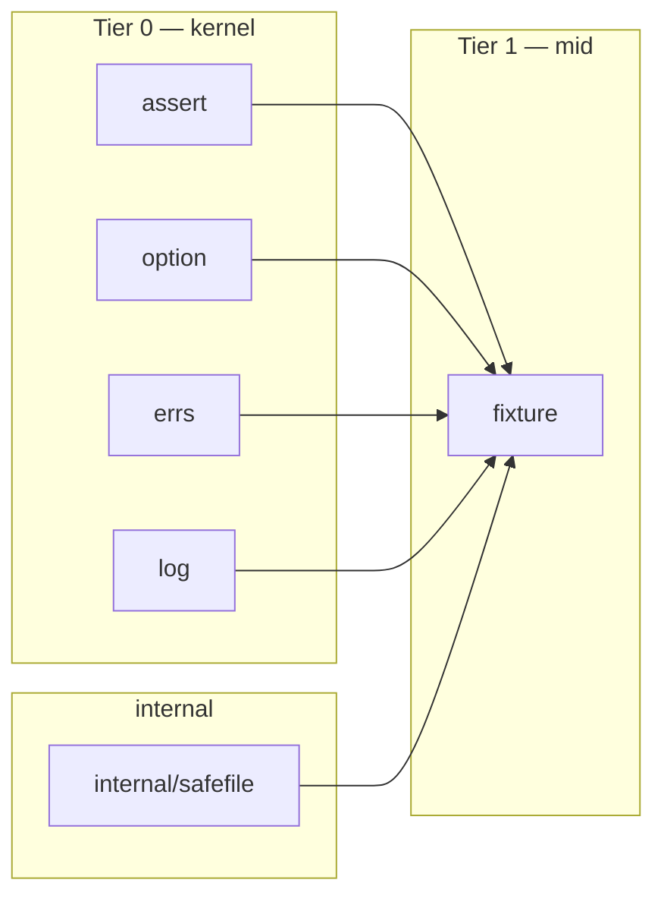

# Fixture

<!--
  Section headers below are STABLE ANCHORS. Magpie extracts content by header,
  so do not rename or reorder them. Doing so is a process change requiring its
  own spec.

  Sections marked **Public** are extracted by Magpie for the public site.
  Sections marked **Internal** are engineering-only and never appear in published docs.
-->

## Public Summary

<!-- **Public.** One paragraph in end-user voice. The canonical description for the site and README. -->

`fixture` is Glacier's test-resource management package. It gives your tests golden-file assertions with auto-update support, typed snapshot comparisons that survive struct refactors, in-memory filesystem stubs, deterministic fake clocks with timer delivery, process-level output capture, and a lifecycle guard that fails any test that leaks goroutines, temp directories, environment variables, or file descriptors. Every helper registers its cleanup with `t.Cleanup`; your tests stay linear and readable. `fixture` sits at Tier 1 (mid) and is intentionally distinct from `assert`: `assert` checks values; `fixture` manages test resources and test environment.

## Mental Model

<!-- **Public.** The conceptual frame a developer should hold while using this. Mermaid diagrams welcome. Source for the "Concepts" page on the site. -->

`fixture` organizes into three responsibility groups:

```
┌──────────────────────────────────────────────────────────────────────────────┐
│  Persistent test data                                                         │
│  ─────────────────                                                            │
│  Golden  — compare raw bytes against a file in testdata/; auto-update via    │
│            GLACIER_GOLDEN_UPDATE=1                                           │
│  Snapshot[T] — pretty-print a typed value, compare against stored snapshot;  │
│                delegates equality to assert.Equal[T]                         │
│  Load    — read arbitrary bytes from testdata/ into memory                   │
│  LoadJSON[T] — read + unmarshal JSON from testdata/                          │
└──────────────────────────────────────────────────────────────────────────────┘
┌──────────────────────────────────────────────────────────────────────────────┐
│  Test environment                                                             │
│  ────────────────                                                             │
│  Clock / FakeClock — injectable clock interface; FakeClock.Advance drives    │
│                      timers deterministically without wall-clock sleeping     │
│  NewFS  — in-memory fs.FS from a map[string][]byte; read-only                │
│  Capture — redirect os.Stdout and os.Stderr to string buffers for a fn call  │
└──────────────────────────────────────────────────────────────────────────────┘
┌──────────────────────────────────────────────────────────────────────────────┐
│  Lifecycle invariants                                                         │
│  ────────────────────                                                         │
│  GuardLeaks — registers a t.Cleanup that diffs state before/after the test   │
│               for goroutines, temp dirs, env vars, and file descriptors       │
└──────────────────────────────────────────────────────────────────────────────┘
```



The `fixture` package imports `assert` (for `TB` and `EqualOption`) but does NOT import any other mid-tier package. `fixture` may not import `concur`, `fluent`, `conf`, or `obs` — that would create a forbidden F4 tier-1 cycle.

## Goals

<!-- **Internal.** Bulleted list. -->

- Provide golden-file assertions (F1, F5) with `GLACIER_GOLDEN_UPDATE=1` auto-write mode (§23.18).
- Provide typed snapshot comparison for any `T` (F2) reusing `assert.EqualOption` options.
- Provide ergonomic testdata loading without `os.ReadFile` boilerplate (F3, F4).
- Provide a deterministic clock interface injectable into production code (F7–F10) so time-sensitive code is testable without sleeps.
- Provide a read-only in-memory `fs.FS` for code that accepts an `fs.FS` interface (F11).
- Provide process-wide stdout/stderr capture with a serialization lock (F12, NF7).
- Provide a lifecycle invariant guard covering goroutine leaks (F15), temp-dir leaks (F14), env-var leaks (F16), and file-descriptor leaks (F17, with Windows no-op).
- All file-path operations route through `internal/safefile` to prevent path traversal (§23.10 / NF6).
- All cleanup registers via `t.Cleanup`, never requiring explicit defer or Close calls from callers.
- Hot-path benchmarks — Golden compare, Snapshot format, Capture lock — are baselined and gated in CI (D35 / §23.13).

## Non-Goals

<!-- **Internal.** Bulleted list. What this spec deliberately excludes. -->

- Providing HTTP-specific test helpers. That is `httpmock` (spec 0013).
- Providing mock objects for interfaces. That is `mock` (spec 0012).
- Providing value assertions. That is `assert` / `assert/require` (spec 0006).
- A writable in-memory filesystem. `NewFS` is read-only by design; test setup uses the map literal.
- Snapshot diffing beyond what `assert.Equal[T]` already provides.
- Fuzz corpus management or test-data generation. Out of scope for v0.
- Supporting context-cancellation inside `Capture`. The fn is synchronous; goroutine-safety is handled via the process-wide lock (NF7).
- Recording or replaying HTTP interactions. That is `httpmock`.

## Architecture

<!-- **Internal.** Mermaid diagram + prose. Package layout, data flow, lifecycle. -->

### File layout

```
fixture/
├── doc.go            package declaration + one-paragraph charter
├── golden.go         Golden, Load, LoadJSON[T], GoldenOption, WithRoot
├── snapshot.go       Snapshot[T]
├── load.go           Load, LoadJSON[T]  (helpers shared with golden.go)
├── clock.go          Clock, FakeClock, Real, NewClock
├── mockfs.go         NewFS
├── capture.go        Capture, process-wide lock
├── guardleaks.go     GuardLeaks, WatchTempDirs, WatchGoroutines, WatchEnv,
│                     WatchFDs, WatchAll, StrictLeaks, WithDrainTimeout,
│                     LeakOption, leakConfig
└── fixture_test.go   (split into per-facility test files — see Test Matrix)
    golden_test.go
    snapshot_test.go
    load_test.go
    clock_test.go
    mockfs_test.go
    capture_test.go
    guardleaks_test.go
    path_safety_test.go
    concurrency_test.go
    properties_test.go
    lifecycle_test.go
    bench_test.go
    example_test.go
    testdata/           golden + snapshot fixture files committed to repo
```

### golden.go — persistent byte comparison

`Golden(t, name, got, opts...)` resolves `name` relative to `testdata/` (or a WithRoot override) through `internal/safefile`. On match: returns true silently. On mismatch: calls `t.Errorf` with a line-by-line diff for text content or a hex header for binary, returns false. If the file is missing and `GLACIER_GOLDEN_UPDATE=1` is set, the file is created and true is returned; otherwise `t.Errorf` is called with a hint message. On `GLACIER_GOLDEN_UPDATE=1` and the file exists but differs, the file is overwritten via `safefile`'s rename-into-place strategy.

Textual vs binary detection: `utf8.Valid(got)` determines the rendering path. All textual diffs are produced by `assert`'s diff engine (reusing the same colored output).

### snapshot.go — typed pretty-print comparison

`Snapshot[T](t, name, got, opts...)` serializes `got` into a deterministic human-readable text representation (see NF3 invariants below), then delegates to `Golden` for file comparison. The `opts` are `assert.EqualOption` values forwarded to `assert.Equal[T]` during re-deserialization comparison. Map keys are sorted. Struct fields are printed in declaration order. `time.Time` values are formatted as RFC 3339 dates only (no sub-second clock component) to avoid drift across runs.

### load.go — testdata I/O

`Load(t, name)` reads and returns raw bytes from `testdata/<name>`, using `internal/safefile`. Registers `t.Helper()`. Calls `t.Fatal` on error. `LoadJSON[T](t, name)` additionally unmarshals via the stdlib `encoding/json` decoder (no `internal/safejson` depth-cap needed here — these are developer-committed files, not untrusted input; see row 14 in the untrusted-input register).

### clock.go — injectable time

`Clock` is the production interface. `FakeClock` extends it with control methods. `Real()` returns a live-clock implementation backed by `time.Now`, `time.Sleep`, and `time.After`. `NewClock(t, start)` returns a `FakeClock` that is frozen at `start` and only advances when `Advance` or `SetTime` is called. Timer channels created via `After` fire synchronously on the next `Advance` call that crosses their deadline. `NewClock` registers a `t.Cleanup` that asserts no pending timer channels exist (to catch test setup mistakes). Goroutine-safe: internal state protected by a `sync.Mutex` (not `concur.Mutex` — fixture must not import concur per F4).

### mockfs.go — in-memory fs.FS

`NewFS(files map[string][]byte)` builds and returns an `fs.FS` that satisfies `fs.ReadFileFS` and `fs.ReadDirFS`. The FS is constructed once, is immutable, and panics at construction time if the provided paths conflict (a file and a directory occupy the same path). Paths are processed through `filepath.ToSlash` + `path.Clean` at construction; the FS serves all reads through `path`-based lookups (not OS-filesystem). No write methods are exposed.

### capture.go — process-wide output capture

`Capture(t, fn)` holds a process-wide mutex (a `sync.Mutex` package-level variable) for the duration of `fn`, redirecting `os.Stdout` and `os.Stderr` to `bytes.Buffer` pipes via `os.Pipe`. After `fn` returns (or panics — the restore runs in a deferred call), the original file descriptors are restored and the captured text is returned as `(stdout, stderr string)`. The process-wide lock is explicit and documented: tests using `Capture` cannot run in parallel within the same process. `t.Cleanup` is NOT used for Capture — the restore is deferred inside `Capture` itself, completing before the function returns, so the caller always gets both values.

### guardleaks.go — lifecycle invariant guard

`GuardLeaks(t, opts...)` records baseline state for every enabled watcher and registers a `t.Cleanup` that diffs the baseline against state after the test. Watchers:

- **WatchTempDirs**: lists `os.TempDir()` entries matching the `glacier-` prefix before and after. Any new directories reported as leaked.
- **WatchGoroutines**: records goroutine stack dump via `runtime.Stack` before the test. After the test (with optional drain timeout), diffs for new goroutines not in the baseline. Goroutines matching well-known false-positive patterns (runtime GC, signal handler, finalizer, `runtime/cgo`, Go standard test infrastructure, the cleanup goroutine itself) are filtered.
- **WatchEnv**: records `os.Environ()` before the test. Any env vars added (or changed) during the test are reported. Env vars present before `GuardLeaks` is called are always silently ignored.
- **WatchFDs**: on Linux and macOS, reads `/proc/self/fd` (Linux) or `lsof`-via-`/dev/fd` (macOS) to count open file descriptors. On Windows, this watcher is a documented no-op that emits a debug log message.

`StrictLeaks()` causes any detected leak to call `t.Fatalf` (halt-on-failure) instead of `t.Errorf`. Default is `t.Errorf` (non-strict). `WithDrainTimeout(d)` sets the goroutine drain window for `WatchGoroutines`; default is 100 ms.

## Schema

<!-- **Internal.** Go types with invariants stated as `// invariant: ...` comments on each field. -->

```go
package fixture

import (
    "fs"
    "time"

    "github.com/nathanbrophy/glacier/assert"
    "github.com/nathanbrophy/glacier/option"
)

// ── Golden options ────────────────────────────────────────────────────────────

// GoldenOption configures Golden, Load, and LoadJSON behaviour.
// Construct via WithRoot.
type GoldenOption interface{ applyGolden(*goldenConfig) error }

type goldenConfig struct {
    // invariant: root is a non-empty path after safefile canonicalization,
    // OR the zero value "", which means "testdata/" relative to the caller's
    // test file directory (resolved via runtime.Caller at call time).
    root string
}

// WithRoot redirects golden/snapshot file resolution to path instead of
// the default testdata/ directory adjacent to the calling test file.
// path must be a relative path; absolute paths are rejected by safefile.
func WithRoot(path string) GoldenOption { ... }

// ── Clock ─────────────────────────────────────────────────────────────────────

// Clock is the injectable time interface for production code.
// Implementations must be goroutine-safe.
type Clock interface {
    // Now returns the current time.
    Now() time.Time
    // Sleep blocks until d has elapsed (real) or Advance is called (fake).
    Sleep(d time.Duration)
    // After returns a channel that receives the time after d has elapsed.
    After(d time.Duration) <-chan time.Time
}

// FakeClock extends Clock with deterministic control methods.
// Returned by NewClock. Goroutine-safe.
type FakeClock interface {
    Clock
    // Advance moves the fake clock forward by d, firing all timers whose
    // deadline falls within [now, now+d] in chronological order.
    Advance(d time.Duration)
    // SetTime moves the fake clock to t (may be before current time).
    // Timers whose deadline has passed after the jump fire immediately.
    SetTime(t time.Time)
}

// ── Leak options ──────────────────────────────────────────────────────────────

// LeakOption configures GuardLeaks behaviour.
type LeakOption interface{ applyLeak(*leakConfig) error }

type leakConfig struct {
    // invariant: at least one of the watch* fields is true, or the
    // constructor defaults all four to false (WatchAll sets all to true).
    watchTempDirs   bool
    watchGoroutines bool
    watchEnv        bool
    watchFDs        bool
    // invariant: strict == false means t.Errorf; strict == true means t.Fatalf.
    strict bool
    // invariant: drainTimeout >= 0; zero means "use default (100 ms)".
    drainTimeout time.Duration
}
```

## API

<!--
  **Public.** Every exported symbol introduced by this spec.
  For each: signature, doc comment, preconditions, postconditions,
  error contract, concurrency notes, lifecycle hooks.
-->

### Persistent test data

---

#### `Golden`

```go
// Golden compares got against the golden file at testdata/<name> (or the root
// set by WithRoot). If the file is missing and GLACIER_GOLDEN_UPDATE=1, the
// file is created and true is returned. If the file is missing without the env
// var, t.Errorf is called with a "re-run with GLACIER_GOLDEN_UPDATE=1" hint
// and false is returned. On content mismatch, t.Errorf is called with a
// line-by-line diff (text) or hex header (binary) and false is returned.
// On match, true is returned with no output.
//
// name must be a relative path; ".." components are rejected by safefile.
// Golden calls t.Helper before any failure message.
func Golden(t assert.TB, name string, got []byte, opts ...GoldenOption) bool
```

- Preconditions: `t` is non-nil; `name` is non-empty and free of `..` components.
- Postconditions: returns true iff `got` matches the golden file content; golden file is created/updated when `GLACIER_GOLDEN_UPDATE=1`.
- Error contract: on file-system errors other than `os.ErrNotExist`, calls `t.Errorf` and returns false.
- Concurrency: goroutine-safe; each call is independent (no shared mutable state beyond the filesystem).
- Lifecycle: no `t.Cleanup` registered; file writes happen synchronously during the call.

---

#### `Snapshot[T]`

```go
// Snapshot[T] serializes got to a deterministic human-readable text
// representation and compares it against the snapshot file at
// testdata/snapshots/<name>.snap. The comparison is delegated to
// assert.Equal[T] via re-deserialization, honoring the opts (IgnoreFields,
// IgnoreOrder, WithDelta, etc.). GLACIER_GOLDEN_UPDATE=1 creates or updates
// the snapshot file. Returns true on match, false on mismatch (with t.Errorf).
//
// The formatter guarantees: map keys are sorted, struct fields in declaration
// order, time.Time values in RFC 3339 date-only format, LF line endings.
func Snapshot[T any](t assert.TB, name string, got T, opts ...assert.EqualOption) bool
```

- Preconditions: `t` non-nil; `name` non-empty, no `..` components; `T` must be JSON-representable (no chan, func, unsafe.Pointer).
- Postconditions: snapshot file created/updated on `GLACIER_GOLDEN_UPDATE=1`.
- Error contract: non-representable types call `t.Errorf` and return false.
- Concurrency: goroutine-safe.
- Lifecycle: no `t.Cleanup`; writes are synchronous.

---

#### `Load`

```go
// Load reads testdata/<name> and returns its bytes. Calls t.Fatal on any
// error (file not found, permission denied, safefile rejection). Registers
// t.Helper.
func Load(t assert.TB, name string) []byte
```

- Preconditions: `t` non-nil; `name` non-empty, no `..` components.
- Error contract: any error is fatal (`t.Fatal`); Load never returns on error.
- Concurrency: goroutine-safe.
- Lifecycle: no cleanup.

---

#### `LoadJSON[T]`

```go
// LoadJSON[T] reads testdata/<name> and unmarshals it as JSON into T.
// Calls t.Fatal on read or unmarshal error. Registers t.Helper.
func LoadJSON[T any](t assert.TB, name string) T
```

- Preconditions: `t` non-nil; `name` non-empty, no `..` components; file must be valid JSON for T.
- Error contract: fatal on read or unmarshal error.
- Concurrency: goroutine-safe.
- Lifecycle: no cleanup.

---

#### `WithRoot`

```go
// WithRoot redirects file operations to path instead of the default testdata/
// directory. path must be relative; absolute paths are rejected.
func WithRoot(path string) GoldenOption
```

---

### Test environment

---

#### `Clock` (interface)

```go
type Clock interface {
    Now() time.Time
    Sleep(d time.Duration)
    After(d time.Duration) <-chan time.Time
}
```

Production code that needs testable time accepts `Clock`. The interface is deliberately minimal: no Ticker constructor (callers compose via `After` loops or inject a `FakeClock` for fine-grained control).

---

#### `FakeClock` (interface)

```go
type FakeClock interface {
    Clock
    Advance(d time.Duration)
    SetTime(t time.Time)
}
```

---

#### `Real`

```go
// Real returns a Clock backed by the real wall clock (time.Now, time.Sleep,
// time.After). Suitable for production use and for tests that do not need
// deterministic time.
func Real() Clock
```

- Concurrency: goroutine-safe (delegates to stdlib).
- Lifecycle: no cleanup.

---

#### `NewClock`

```go
// NewClock returns a FakeClock frozen at start. The clock only advances when
// Advance or SetTime is called. Timer channels created via After fire on the
// next Advance that crosses their deadline. NewClock registers a t.Cleanup
// that asserts no pending timer channels remain (to catch misconfigured tests).
func NewClock(t assert.TB, start time.Time) FakeClock
```

- Preconditions: `t` non-nil; `start` non-zero (zero time is accepted but unusual).
- Postconditions: returned FakeClock is frozen at `start`.
- Error contract: cleanup calls `t.Errorf` if pending timers remain; it does not advance them.
- Concurrency: goroutine-safe; internal state protected by a `sync.Mutex`.
- Lifecycle: `t.Cleanup` registered for pending-timer assertion.

---

#### `NewFS`

```go
// NewFS constructs a read-only in-memory fs.FS from files. Keys are path
// strings (forward-slash separated); values are file contents. NewFS panics
// at construction if any two paths conflict (a path is simultaneously claimed
// as a file and as a directory).
//
// The returned FS satisfies fs.ReadFileFS and fs.ReadDirFS.
func NewFS(files map[string][]byte) fs.FS
```

- Preconditions: `files` may be nil or empty (produces an empty FS); all keys must be valid `fs.ValidPath` strings.
- Postconditions: returned FS is immutable; no write methods.
- Error contract: panics on path conflicts at construction time; Read errors return `fs.ErrNotExist` for missing paths.
- Concurrency: goroutine-safe after construction (immutable state).
- Lifecycle: no cleanup.

---

#### `Capture`

```go
// Capture calls fn while redirecting os.Stdout and os.Stderr to in-memory
// buffers, then returns the captured output as (stdout, stderr string).
// os.Stdout and os.Stderr are restored before Capture returns, even if fn
// panics. Capture holds a process-wide mutex for the duration of fn, so two
// concurrent Capture calls will serialize. Tests using Capture must not call
// t.Parallel.
func Capture(t assert.TB, fn func()) (stdout, stderr string)
```

- Preconditions: `t` non-nil; `fn` non-nil; caller must not run in parallel with another Capture call (documented; enforced via lock, not compiler).
- Postconditions: `os.Stdout` and `os.Stderr` are identical to their pre-call values; returned strings are `fn`'s complete output.
- Error contract: if `fn` panics, streams are restored and the panic re-propagates after closing the pipe.
- Concurrency: serialized via process-wide mutex; callers must NOT call `t.Parallel`.
- Lifecycle: no `t.Cleanup`; restore is deferred inside Capture.

---

### Lifecycle invariants

---

#### `GuardLeaks`

```go
// GuardLeaks records baseline state for each enabled watcher and registers a
// t.Cleanup that reports any new leaks detected after the test completes.
// With no options, GuardLeaks is a no-op (all watchers disabled by default;
// use WatchAll() or specific Watch* options). With StrictLeaks(), leaks call
// t.Fatalf instead of t.Errorf.
func GuardLeaks(t assert.TB, opts ...LeakOption)
```

- Preconditions: `t` non-nil; `opts` determine which watchers are active.
- Postconditions: a `t.Cleanup` is registered; no immediate side effects.
- Error contract: leak detection calls `t.Errorf` (default) or `t.Fatalf` (StrictLeaks).
- Concurrency: goroutine-safe; each `t` has its own independent state.
- Lifecycle: `t.Cleanup` registered; runs after the test body and any other `t.Cleanup` functions registered before this call (LIFO order per `testing.T`).

---

#### `WatchTempDirs`

```go
// WatchTempDirs enables monitoring of os.TempDir() for directories matching
// the "glacier-" prefix created during the test. Any such directory present
// after the test but not before is reported as a leak.
func WatchTempDirs() LeakOption
```

---

#### `WatchGoroutines`

```go
// WatchGoroutines enables goroutine-count monitoring. Goroutines present after
// the test that were not present before (excluding well-known runtime
// goroutines: GC, finalizer, signal handler, runtime/cgo, test infrastructure)
// are reported with their stack traces.
func WatchGoroutines() LeakOption
```

---

#### `WatchEnv`

```go
// WatchEnv enables environment-variable monitoring. Any env var added or
// changed during the test (after GuardLeaks is called) is reported as a leak.
// Env vars that existed before GuardLeaks was called are always ignored.
func WatchEnv() LeakOption
```

---

#### `WatchFDs`

```go
// WatchFDs enables file-descriptor monitoring. On Linux and macOS, file
// descriptors open after the test but not before are reported. On Windows,
// WatchFDs is a no-op that emits a debug log message via log.From(ctx) at
// slog.LevelDebug; no failure is reported.
func WatchFDs() LeakOption
```

---

#### `WatchAll`

```go
// WatchAll enables all four watchers: WatchTempDirs, WatchGoroutines,
// WatchEnv, and WatchFDs.
func WatchAll() LeakOption
```

---

#### `StrictLeaks`

```go
// StrictLeaks causes GuardLeaks to call t.Fatalf instead of t.Errorf when a
// leak is detected. Default is t.Errorf (non-halt).
func StrictLeaks() LeakOption
```

Note: the canonical exported name is `StrictLeaks` (per D50 / §23.15 naming disambiguation). There is no separate `Strict()` function in `fixture`; that name is reserved for `option.Strict()` in the kernel.

---

#### `WithDrainTimeout`

```go
// WithDrainTimeout sets the window that WatchGoroutines waits for transient
// goroutines (e.g., goroutines finishing async work) to terminate before
// declaring a leak. Default is 100 ms. d must be positive.
func WithDrainTimeout(d time.Duration) LeakOption
```

---

## Examples

<!-- **Public.** Runnable Go examples in fenced go blocks. -->

### Golden file for an HTTP response body

```go
package fixture_test

import (
    "net/http"
    "net/http/httptest"
    "testing"

    "github.com/nathanbrophy/glacier/fixture"
)

func TestHTTPResponseGolden(t *testing.T) {
    // Arrange: a handler that returns a JSON response.
    handler := http.HandlerFunc(func(w http.ResponseWriter, r *http.Request) {
        w.Header().Set("Content-Type", "application/json")
        w.WriteHeader(http.StatusOK)
        w.Write([]byte(`{"status":"ok","version":"1.2.3"}`))
    })
    rec := httptest.NewRecorder()
    req := httptest.NewRequest(http.MethodGet, "/health", nil)

    handler.ServeHTTP(rec, req)

    // Assert: compare response body against golden file at
    // testdata/health_response.json. Run with GLACIER_GOLDEN_UPDATE=1 to create.
    fixture.Golden(t, "health_response.json", rec.Body.Bytes())
}
```

### Snapshot for a struct shape

```go
package fixture_test

import (
    "testing"
    "time"

    "github.com/nathanbrophy/glacier/assert"
    "github.com/nathanbrophy/glacier/fixture"
)

type UserProfile struct {
    ID        int
    Name      string
    Email     string
    CreatedAt time.Time
}

func TestUserProfileSnapshot(t *testing.T) {
    got := UserProfile{
        ID:        42,
        Name:      "Alice",
        Email:     "alice@example.com",
        CreatedAt: time.Now(), // will be truncated to date in snapshot
    }

    // Snapshot persists to testdata/snapshots/user_profile.snap.
    // IgnoreFields("CreatedAt") excludes the volatile field from comparison.
    fixture.Snapshot(t, "user_profile", got, assert.IgnoreFields("CreatedAt"))
}
```

### Deterministic time in a deadline-aware function

```go
package fixture_test

import (
    "context"
    "testing"
    "time"

    "github.com/nathanbrophy/glacier/assert"
    "github.com/nathanbrophy/glacier/fixture"
)

// retryUntil calls fn until it returns true or the clock says the deadline has passed.
func retryUntil(clk fixture.Clock, deadline time.Time, fn func() bool) bool {
    for clk.Now().Before(deadline) {
        if fn() {
            return true
        }
        clk.Sleep(100 * time.Millisecond)
    }
    return false
}

func TestRetryUntilSucceedsBeforeDeadline(t *testing.T) {
    start := time.Date(2026, 1, 1, 0, 0, 0, 0, time.UTC)
    clk := fixture.NewClock(t, start)
    deadline := start.Add(5 * time.Second)

    calls := 0
    result := retryUntil(clk, deadline, func() bool {
        calls++
        // Advance the fake clock on each Sleep call to make progress.
        clk.Advance(100 * time.Millisecond)
        return calls >= 3 // succeeds on 3rd attempt
    })

    assert.True(t, result)
    assert.Equal(t, calls, 3)
}
```

### In-memory FS for a config loader

```go
package fixture_test

import (
    "io/fs"
    "testing"

    "github.com/nathanbrophy/glacier/assert"
    "github.com/nathanbrophy/glacier/fixture"
)

// parseConfig reads config.json from an fs.FS.
func parseConfig(fsys fs.FS) (map[string]string, error) {
    data, err := fs.ReadFile(fsys, "config.json")
    if err != nil {
        return nil, err
    }
    _ = data // unmarshal elided for brevity
    return map[string]string{"env": "test"}, nil
}

func TestParseConfigFromMemory(t *testing.T) {
    fsys := fixture.NewFS(map[string][]byte{
        "config.json": []byte(`{"env":"test"}`),
    })

    cfg, err := parseConfig(fsys)
    assert.NoError(t, err)
    assert.Equal(t, cfg["env"], "test")
}
```

### Capturing CLI output

```go
package fixture_test

import (
    "fmt"
    "os"
    "testing"

    "github.com/nathanbrophy/glacier/assert"
    "github.com/nathanbrophy/glacier/fixture"
)

func printBanner() {
    fmt.Fprintln(os.Stdout, "Glacier v0.1.0")
    fmt.Fprintln(os.Stderr, "debug: banner rendered")
}

func TestCaptureBanner(t *testing.T) {
    // NOTE: do not call t.Parallel() in tests that use Capture.
    stdout, stderr := fixture.Capture(t, printBanner)

    assert.Contains(t, stdout, "Glacier v0.1.0")
    assert.Contains(t, stderr, "debug: banner rendered")
}
```

### Lifecycle invariants — guard against goroutine and env leaks

```go
package fixture_test

import (
    "os"
    "testing"

    "github.com/nathanbrophy/glacier/fixture"
)

func ExampleGuardLeaks() {
    // (In a real test t is *testing.T from the test runner.)
    var t *testing.T // placeholder

    // Guard goroutine, temp-dir, and env-var leaks; fail immediately on any.
    fixture.GuardLeaks(t,
        fixture.WatchGoroutines(),
        fixture.WatchTempDirs(),
        fixture.WatchEnv(),
        fixture.StrictLeaks(),
        fixture.WithDrainTimeout(200*fixture.Millisecond),
    )
    _ = os.Setenv("EXAMPLE_LEAK", "1") // will be caught by WatchEnv at cleanup
}
```

## Test Matrix

<!-- **Internal.** Owned by Lynx. -->

Source: `specs/test-matrices/mid.md` `## Package: fixture/`. The full rows are reproduced here for single-document completeness.

| # | Name | Spec ref | Type | Description | Test helpers used |
|---|---|---|---|---|---|
| 1 | TestGoldenCreateOnMissing | §21.8 E1 | Unit (positive, env-driven) | `GLACIER_GOLDEN_UPDATE=1` + missing file → file created with bytes; returns true. | `t.Setenv("GLACIER_GOLDEN_UPDATE","1")`, `assert.True` |
| 2 | TestGoldenMissingNoUpdateErrors | §21.8 E2 | Unit (negative) | Missing file + no env → t.Errorf with hint message; returns false. | mock TB recorder, `assert.Contains` |
| 3 | TestGoldenMatchPassesSilently | §21.8 F1 | Unit (positive) | Matching bytes → no error, returns true. | mock TB recorder |
| 4 | TestGoldenMismatchReportsDiff | §21.8 E3 | Unit (negative) | Mismatch → t.Errorf with line-by-line diff for textual; hex header for binary. | mock TB recorder, `assert.Contains` |
| 5 | TestGoldenWithRoot | §21.8 F5 | Unit (positive) | WithRoot redirects to alternate testdata dir. | `t.TempDir`, `assert.True` |
| 6 | TestSnapshotDeterministicAcrossRuns | §21.8 F2, NF3 | Unit (positive) | Two invocations produce byte-identical pretty-printed output. | `assert.Equal` |
| 7 | TestSnapshotIgnoreFields | §21.8 E16, F2 | Unit (positive) | `assert.IgnoreFields("CreatedAt")` excludes from comparison and from persisted snapshot. | `assert.IgnoreFields` |
| 8 | TestSnapshotIgnoreOrder | §21.8 F2 | Unit (positive) | `assert.IgnoreOrder` honored for slice fields. | `assert.IgnoreOrder` |
| 9 | TestSnapshotIgnoreCase | §21.8 F2 | Unit (positive) | IgnoreCase for string fields. | `assert.IgnoreCase` |
| 10 | TestSnapshotWithDelta | §21.8 F2 | Unit (positive) | WithDelta for floats. | `assert.WithDelta` |
| 11 | TestSnapshotMissingCreates | §21.8 F2 | Unit (positive) | `GLACIER_GOLDEN_UPDATE=1` + missing snapshot → created. | `t.Setenv` |
| 12 | TestSnapshotPrettyPrintStableMapKeys | §21.8 NF3 | Unit (positive) | Map keys sorted in pretty-printed output. | `assert.Equal` |
| 13 | TestSnapshotPrettyPrintLineEndingsLF | §21.8 NF3 | Unit (positive) | Output uses `\n` regardless of platform. | `assert.NotContains(out, "\r\n")` |
| 14 | TestLoadFile | §21.8 F3 | Unit (positive) | Load returns correct bytes from testdata/. | `assert.Equal` |
| 15 | TestLoadFileMissingFatals | §21.8 E5 | Unit (negative) | Load on missing file calls t.Fatal. | mock TB tracker |
| 16 | TestLoadJSONUnmarshals | §21.8 F4 | Unit (positive) | LoadJSON[T] returns correctly populated struct. | `assert.Equal` |
| 17 | TestLoadJSONBadJSONFatals | §21.8 E6 | Unit (negative) | LoadJSON on malformed JSON calls t.Fatal. | mock TB tracker |
| 18 | TestLoadJSONWrongTypeFatals | §21.8 E7 | Unit (negative) | LoadJSON[T] on mismatched schema calls t.Fatal. | mock TB tracker |
| 19 | TestPathTraversalRejectedGolden | §21.8 NF6 | Unit (negative) | Golden refuses `..` paths. | mock TB |
| 20 | TestPathTraversalRejectedSnapshot | §21.8 NF6 | Unit (negative) | Snapshot refuses `..` paths. | mock TB |
| 21 | TestPathTraversalRejectedLoad | §21.8 NF6 | Unit (negative) | Load refuses `..` paths. | mock TB |
| 22 | TestPathTraversalRejectedWithRoot | §21.8 NF6 | Unit (negative) | WithRoot refuses `..` root paths. | mock TB |
| 23 | TestAbsolutePathRejected | §21.8 NF6 | Unit (negative) | Golden refuses absolute paths. | mock TB |
| 24 | TestGoldenUpdateOverwritesExisting | §21.8 E1 | Unit (positive) | `GLACIER_GOLDEN_UPDATE=1` + changed got → file overwritten; returns true. | `t.Setenv`, `assert.True` |
| 25 | TestRealClockNow | §21.8 F7 | Unit (positive) | Real().Now() returns current wall time (within 1s tolerance). | `assert.True` |
| 26 | TestRealClockSleep | §21.8 F8 | Unit (positive) | Real().Sleep blocks for approximately d (within 10% tolerance). | wall-clock timing |
| 27 | TestRealClockAfter | §21.8 F9 | Unit (positive) | Real().After(d) fires after d. | `assert.True` |
| 28 | TestNewClockFrozen | §21.8 F7 | Unit (positive) | Newly created FakeClock.Now() == start. | `assert.Equal` |
| 29 | TestNewClockAdvance | §21.8 F7 | Unit (positive) | After Advance(d), Now() == start+d. | `assert.Equal` |
| 30 | TestNewClockSetTime | §21.8 F10 | Unit (positive) | SetTime(t) sets Now() == t regardless of previous state. | `assert.Equal` |
| 31 | TestNewClockTimerFiresOnAdvance | §21.8 F9 | Unit (positive) | After(d) channel receives when Advance crosses deadline. | channel receive, `assert.Equal` |
| 32 | TestNewClockTimerDoesNotFireBeforeDeadline | §21.8 F9 | Unit (positive) | After(d) channel is not readable before deadline reached. | select default, `assert.True` |
| 33 | TestNewClockMultipleTimersOrdered | §21.8 F9 | Unit (positive) | Three After timers with distinct deadlines fire in chronological order on Advance. | channel sequence |
| 34 | TestNewClockCleanupPendingTimers | §21.8 E8 | Unit (negative) | Cleanup asserts pending timers → t.Errorf. | mock TB |
| 35 | TestNewClockCleanupClean | §21.8 F7 | Unit (positive) | No pending timers at cleanup → silent pass. | mock TB |
| 36 | TestNewClockAdvanceWhileTimersFireRace | concurrency | Race | 100 timers + concurrent Advance from another goroutine → -race clean; correct delivery count. | `-race`, `concur.WaitGroup`, `fixture.GuardLeaks` |
| 37 | TestNewClockSleepBlocksUntilAdvance | §21.8 F8 | Unit (positive) | Sleep in goroutine blocks; Advance unblocks it. | goroutine + channel sync |
| 38 | TestMockFSRead | §21.8 F11 | Unit (positive) | NewFS({"a":bytes}); fs.ReadFile("a") returns bytes. | `assert.Equal` |
| 39 | TestMockFSReadDir | §21.8 F11 | Unit (positive) | ReadDir lists entries. | `assert.Equal` |
| 40 | TestMockFSReadFileInterface | §21.8 F11 | Unit (positive) | Returned FS satisfies `fs.ReadFileFS` AND `fs.ReadDirFS`. | type assertion + `assert.True` |
| 41 | TestMockFSConflictPanics | §21.8 E10 | Unit (negative) | NewFS with both `/foo` and `/foo/bar` (file vs dir conflict) panics with `"fixture: NewFS: conflict at path \"/foo\": both file and directory"`. | `assert.PanicsWithMessage` |
| 42 | TestMockFSNestedPaths | §21.8 F11 | Unit (positive) | Path `a/b/c.txt` accessible. | `assert.Equal` |
| 43 | TestMockFSReadOnly | §21.8 F11 | Unit (positive) | No write methods on returned FS. | reflection check |
| 44 | TestMockFSMissingFile | §21.8 E10 | Unit (negative) | ReadFile on missing path returns fs.ErrNotExist. | `assert.ErrorIs` |
| 45 | TestMockFSStat | §21.8 F11 | Unit (positive) | Stat on a directory entry reports IsDir() == true. | `assert.True` |
| 46 | TestCaptureRoundTrip | §21.8 F12 | Unit (positive) | Capture(t, fn) returns fn's stdout/stderr. | `assert.Equal` |
| 47 | TestCaptureRestoresStreams | §21.8 NF4 | Unit (positive) | After Capture returns, os.Stdout / os.Stderr restored. | identity check, `assert.Equal` |
| 48 | TestCaptureProcessWideLockSerializes | §21.8 NF7, E11 | Race | Two parallel `Capture` calls — they serialize; no interleaving. | `concur.WaitGroup`, `-race`, `fixture.GuardLeaks` |
| 49 | TestCaptureFromGoroutine | §21.8 E11 | Unit (documented) | Capture lock holds even when fn writes from goroutine; ALL stdout goes to buffer. | `concur.WaitGroup`, `assert.Contains` |
| 50 | TestCapturePanicRestoresStreams | §21.8 NF4 | Unit (negative) | If fn panics, os.Stdout and os.Stderr are still restored before re-panic. | deferred identity check |
| 51 | TestGuardLeaksTempDirCatchesLeak | §21.8 F14 | Unit (negative) | Test creates `glacier-XXXXX` dir without removing → cleanup reports. | mock TB tracker |
| 52 | TestGuardLeaksTempDirIgnoresUnrelated | §21.8 E14 | Unit (positive) | Non-glacier-prefix temp dirs do NOT trigger. | mock TB tracker |
| 53 | TestGuardLeaksGoroutineCatchesLeak | §21.8 F15 | Unit (negative) | Test spawns goroutine that doesn't terminate → cleanup reports with stack. | `concur.WaitGroup` (deliberately unfinished) |
| 54 | TestGuardLeaksGoroutineDrainTimeout | §21.8 F15, E12 | Unit (positive) | WithDrainTimeout extends wait; allows legitimate-async cleanup. | `assert.Eventually` |
| 55 | TestGuardLeaksGoroutineFiltersFalsePositives | §21.8 F15 | Unit (positive) | Network resolver / GC sweepers / cleanup goroutine itself filtered. | mock TB |
| 56 | TestGuardLeaksEnvCatchesLeak | §21.8 F16 | Unit (negative) | Test sets env var without unsetting → cleanup reports. | mock TB |
| 57 | TestGuardLeaksEnvIgnoresUnrelated | §21.8 F16 | Unit (positive) | Env vars set BEFORE GuardLeaks ignored. | mock TB |
| 58 | TestGuardLeaksFDsCatchesLeak | §21.8 F17 | Unit (negative — Linux/macOS) | Open file without close → cleanup reports leaked FD. | platform-conditional |
| 59 | TestGuardLeaksFDsNoOpOnWindows | §21.8 E13 | Unit (positive — Windows) | No-op with debug log on Windows. | `fixture.Capture`, `assert.Contains` |
| 60 | TestGuardLeaksWatchAll | §21.8 F18 | Unit (positive) | WatchAll == all four Watches. | introspection |
| 61 | TestGuardLeaksStrictHaltsTest | §21.8 F19 | Unit (negative) | StrictLeaks() makes leaks call t.Fatalf. | mock TB tracker |
| 62 | TestGuardLeaksStrictRenamed | §23.15 | Unit (positive) | The exported name is `StrictLeaks` (not `Strict`); verify via reflection. | reflection |
| 63 | TestGuardLeaksParallelSubtest | §21.8 E15 | Unit (positive) | Subtest with own GuardLeaks has own baseline. | `t.Run`, mock TB |
| 64 | TestGuardLeaksBaselineCleanupRace | concurrency | Race | Baseline recorded synchronously; no race with subsequent ops. | `-race` |
| 65 | TestSnapshotRoundTripProperty | property | Property | `Snapshot[T](v)`: Load of the snapshot file produces representation equal to `v` modulo IgnoreFields. Random struct generator. | property generator, `assert.Equal` |
| 66 | TestEnvVarRenameToGlacier | §22, §23.18 | Unit (positive) | `GLACIER_GOLDEN_UPDATE=1` activates update mode. (`MONGOOSE_GOLDEN_UPDATE` does not exist.) | `t.Setenv`, `assert.True` |
| 67 | TestSnapshotFormatterDeterministicWithMaps | §21.8 NF3 | Unit (positive) | Map with 100 keys produces identical output across 100 runs. | `concur.Group`, `assert.Equal` |
| 68 | TestSnapshotFormatterUnicodeStable | §21.8 NF3 | Unit (positive) | UTF-8 strings preserve byte identity. | `assert.Equal` |
| 69 | TestSnapshotPathRejectsTraversal | §21.8 NF6 | Unit (negative) | Snapshot name `../oops` rejected. | mock TB |
| 70 | BenchmarkGoldenBytes | §21.8 NF1, §23.13 | Benchmark | Compare-and-pass path for 4 KiB goldens; zero allocs on match. | `testing.B`, `testing.AllocsPerRun` |
| 71 | BenchmarkSnapshotStruct | §21.8 NF1, §23.13 | Benchmark | Snapshot of 50-field struct — pretty-print is the cost; baselined. | `testing.B`, `testing.AllocsPerRun` |
| 72 | BenchmarkSnapshotMap100Keys | §21.8 NF3, §23.13 | Benchmark | Deterministic-formatter perf with 100-key map (sort cost). | `testing.B` |
| 73 | BenchmarkCaptureSmallOutput | §21.8 NF1, §23.13 | Benchmark | Capture of small fn cost (lock + redirect). | `testing.B` |

### Edge cases locked by annotation

- **EX1**: `Snapshot[T]` of a value containing `time.Time` — the formatter must NOT include time-of-day; verify by snapshotting a struct with `time.Time` set to `time.Now()` and checking determinism after sleeping 1 s.
- **EX2**: `Capture` with fn that panics — streams MUST still be restored; verify via deferred restore check.
- **EX3**: `GuardLeaks` ordering with multiple Watch* options — ordering does not matter (lock to: no).
- **EX4**: `MockFS` `Stat` on a directory — reports `IsDir()` correctly.
- **EX5**: `Golden` with empty `got` byte slice — distinct from missing file; matched against empty golden file.

## Dependency Justification

<!-- **Internal.** Owned by Falcon. -->

| Module | Version | License | Last release | Maintainers | Alternatives considered | Why we can't roll our own |
|---|---|---|---|---|---|---|
| (none) | — | — | — | — | — | — |

`fixture` has zero direct external dependencies. All capabilities are built on the Go standard library (`testing`, `os`, `runtime`, `io/fs`, `encoding/json`, `sync`, `bytes`, `path`, `path/filepath`, `unicode/utf8`) and the Glacier kernel packages (`option`, `errs`, `log`, `assert`). Goroutine-leak detection uses `runtime.Stack`; no third-party leak detector library is introduced.

## Security & Supply-Chain Notes

<!-- **Internal.** -->

### Path safety (§23.10 / §7.7)

All file operations in `golden.go`, `snapshot.go`, and `load.go` route through `internal/safefile`:

- `filepath.Clean` canonicalization applied to every name argument before any filesystem call.
- Any post-clean path component equal to `..` is rejected with `t.Errorf` (not `t.Fatal` — to allow the test to collect all failures).
- Absolute paths are rejected unless an explicit `safefile.AllowAbsolute()` option is passed (none of `fixture`'s callers pass this option).
- Windows UNC paths (`\\server\share` and `\\?\`) are rejected.
- Files are opened with `safefile.Open` (open-then-fstat, never stat-then-open).
- Golden file writes use rename-into-place (`O_EXCL` on temp file, then `os.Rename`) under the configured root; the target directory must be within the resolved root.

Untrusted-input register rows for `fixture` (from the framework-wide register in spec 0002 §Schema):

| Row | Input | Mechanism | Size cap | Constraint |
|---|---|---|---|---|
| 13 | Test fixture file paths (golden/snapshot/load) | `internal/safefile` | ≤ 4 KiB | reject `..`, Windows UNC, absolute paths; resolved under `testdata/` |
| 14 | Test fixture file content | byte-for-byte; not parsed | 16 MiB cap | developer-committed; no untrusted-parse required |

### Capture and process-level side effects

`Capture` replaces `os.Stdout` and `os.Stderr` (process-wide file descriptors) for the duration of `fn`. This is the only fixture operation with a process-wide side effect. The side effect is:

- Bounded: always restored in a deferred call inside `Capture`, even on panic.
- Serialized: the process-wide mutex prevents concurrent `Capture` invocations from interfering.
- Documented: the doc comment explicitly prohibits calling `t.Parallel()` in tests that use `Capture`.

No sensitive data (secrets, PII) should be passed through `Capture` in tests targeting production systems; the captured strings are held in memory for the duration of the test.

### WatchFDs on Windows

`WatchFDs` is a no-op on Windows. The FD-counting mechanism relies on `/proc/self/fd` (Linux) and `/dev/fd` (macOS). On Windows, neither pseudo-filesystem exists. The option is accepted silently (no panic) and emits a single `slog.LevelDebug` log via `log.From(ctx)` to aid in diagnosing unexpected platform behavior. No test failure is produced.

### Supply-chain posture

Zero new direct external dependencies. The existing approved kernel deps (`option`, `errs`, `log`, `assert`) plus the Go standard library are sufficient. Falcon sign-off is required before any dependency is added.

## FAQ

<!-- **Public.** -->

**Q: When should I use `Snapshot[T]` instead of `assert.Equal[T]`?**
A: Use `assert.Equal[T]` when the expected value is small and readable inline. Use `Snapshot[T]` when the expected value is large, struct-shaped, or should survive future refactors without the test author manually updating expected values — the snapshot file becomes self-documenting test data. Both use the same equality semantics under the hood.

**Q: Can I run `Capture` in a parallel subtest?**
A: No. `Capture` holds a process-wide mutex that serializes all `Capture` calls in the same process. Calling `t.Parallel()` in a test that uses `Capture` will cause that test to block indefinitely (or until the `-timeout` fires). This is a documented constraint, not a bug. If you need parallel isolation of output, structure your code to accept an `io.Writer` and test via that interface instead.

**Q: How do I update golden files after an intentional output change?**
A: Re-run your test suite with `GLACIER_GOLDEN_UPDATE=1`. All golden and snapshot files whose content differs from the current output will be overwritten. Review the diff in version control before committing. The old name `MONGOOSE_GOLDEN_UPDATE` does not exist; only `GLACIER_GOLDEN_UPDATE` is recognized.

**Q: Does `GuardLeaks` catch leaks introduced by the test framework itself (e.g., the goroutine that runs `t.Cleanup`)?**
A: No. `WatchGoroutines` filters well-known runtime goroutines including the test cleanup goroutine, GC worker, finalizer, signal handler, and `runtime/cgo` goroutines. False positives from the test infrastructure are aggressively filtered to keep the signal-to-noise ratio high.

**Q: What is the difference between `StrictLeaks()` and the default GuardLeaks behavior?**
A: By default (`t.Errorf`), a leak is reported but the test continues to run and may pass overall if it was the only failing check. With `StrictLeaks()` (which calls `t.Fatalf`), the test halts immediately when a leak is found — useful for integration tests where a leaked goroutine would pollute the next test's baseline.

## Decisions & Rationale

<!-- **Internal.** -->

### D1 — `fixture` is distinct from `assert` (not a sub-package)

Test-resource management (files, clocks, FS, capture, lifecycle guards) is a fundamentally different concern from value assertion. Merging them into `assert` would create a package that imports `os`, `runtime`, and `io/fs` — dependencies that belong at mid-tier, not kernel. Keeping `fixture` at Tier 1 allows the `assert` kernel to remain small and dependency-free.

### D2 — `Golden` and `Snapshot[T]` are top-level functions, not methods on a struct

Every call site is `fixture.Golden(t, "name", got)`, which is idiomatic and readable. There is no global state to initialize. A struct-based design would require callers to construct a `*fixture.Suite` or similar, adding ceremony that adds no value when `t` already serves as the lifecycle anchor.

### D3 — `Snapshot[T]` delegates comparison to `assert.Equal[T]`

Re-implementing smart-equal in `fixture` would duplicate logic from `assert`. Instead, `Snapshot[T]` serializes `got` to a text representation, compares the file, and on mismatch re-runs `assert.Equal[T]` with the caller's `EqualOption` values to produce the same colored diff output that `assert` produces. This means callers get `IgnoreFields`, `IgnoreOrder`, and `WithDelta` for free.

### D4 — `FakeClock` fires timers synchronously in `Advance`

Asynchronous timer delivery (a background goroutine that fires timers) would require `WatchGoroutines` to filter out the FakeClock's own goroutine, and would make timer delivery order non-deterministic. Synchronous delivery in `Advance` gives callers precise control: they know exactly which timers have fired after each `Advance` call. The tradeoff is that `Sleep` in a goroutine requires the test to `Advance` from another goroutine — an explicit design.

### D5 — `NewFS` panics on construction-time path conflicts instead of returning an error

`NewFS` is called from test setup code, not production code. A panic at construction time gives an immediate, loud failure pointing to the broken test setup. An error return would require callers to check it, adding boilerplate to every test that uses `NewFS`. Construction-time panics are acceptable in test helpers (consistent with `testing.TB.Helper`, `assert.Must`, etc.).

### D6 — `Capture` uses a process-wide mutex, not goroutine-local capture

Goroutine-local stdout capture is not possible in Go without `unsafe` or runtime patches. `os.Stdout` is a process-wide file descriptor. The only safe, `unsafe`-free approach is to replace the descriptor for the entire process and serialize all captures. The constraint (no `t.Parallel`) is acceptable: tests that need output isolation should depend on `io.Writer` injection, not `os.Stdout`.

### D7 — `GuardLeaks` default is no watchers; all must be opt-in

Defaulting all four watchers on would make `GuardLeaks()` a footgun in existing test suites: WatchFDs is a no-op on Windows and WatchGoroutines would catch runtime goroutines the filter hasn't been tuned for yet. Making every watcher explicit preserves the principle of least surprise. `WatchAll()` exists for callers who want everything.

### D8 — `StrictLeaks` not `Strict` (§23.15 naming)

The name `Strict()` is already used by `option.Strict()` in the kernel. Using `Strict()` in `fixture` would require callers to import-qualify every time they mix `option` and `fixture` in the same test file. `StrictLeaks()` is unambiguous and self-documenting.

### D9 — `GLACIER_GOLDEN_UPDATE`, not `MONGOOSE_GOLDEN_UPDATE` (§23.18)

The project was renamed from Mongoose to Glacier on 2026-05-01. All env vars use the `GLACIER_` prefix. There is no fallback to the old name — this is a clean rebrand, not a compatibility shim. Test #66 in the matrix locks this.

### D10 — `fixture` does not import `concur` (F4 enforcement)

The tier-1 no-cross-import rule (F4 from spec 0002) prohibits `fixture` from importing `concur`. The internal sync needs of `fixture` (FakeClock's mutex, Capture's process lock) are satisfied by `sync.Mutex` from the standard library, which is always available.

### §23 Amendments applied to this spec

- **§23.10 (path safety)**: All file-touching operations in `fixture` route through `internal/safefile`. Documented in Security section and Test Matrix rows 19–23.
- **§23.13 (performance)**: Benchmarks #70–#73 are required CI gates; `testing.AllocsPerRun` assertions enforce zero-alloc on the Golden match path.
- **§23.15 (naming disambiguation)**: `StrictLeaks()` is the canonical exported name (not `Strict()`). Locked by test #62.
- **§23.16 (Close audit)**: `fixture` types use `t.Cleanup` rather than `Close`. The lifecycle audit table in spec 0002 §7.4 does not include any `fixture` type — this is correct. `NewClock`'s cleanup is documented in its API entry. `GuardLeaks`'s cleanup is documented in its API entry.
- **§23.18 (Glacier rebrand)**: `GLACIER_GOLDEN_UPDATE` is the only recognized env var. `MONGOOSE_GOLDEN_UPDATE` does not exist. Locked by test #66.

## Open Questions

<!--
  **Internal.** MUST be empty before this spec moves to `accepted`.
-->

*(none)*

## Verification

<!-- **Internal.** Concrete steps to prove the change works end-to-end. -->

1. `go build ./fixture/...` exits 0 with no warnings.
2. `go test ./fixture/...` exits 0 on Linux, macOS, and Windows.
3. `go test -race ./fixture/...` exits 0; tests #36, #48, #64 exercise the race-detector paths.
4. `go test -run TestPathTraversal ./fixture/...` exits 0; all four traversal-rejection tests (#19–#22) and the absolute-path test (#23) pass on all platforms.
5. `go test -run BenchmarkGolden ./fixture/... -bench=. -benchmem` reports 0 allocs/op on the match path.
6. `GLACIER_GOLDEN_UPDATE=1 go test ./fixture/...` creates/updates golden and snapshot files; a subsequent run without the env var passes with no file writes.
7. `grep -r "MONGOOSE_GOLDEN_UPDATE" ./fixture/` returns zero matches.
8. `grep -r "github.com/stretchr/testify" ./fixture/` returns zero matches (no testify import).
9. `go vet ./fixture/...` exits 0; `staticcheck ./fixture/...` exits 0.
10. CI lifecycle-audit check (per §23.16): `fixture.NewClock` registers cleanup (verified by test #35); `fixture.GuardLeaks` registers cleanup (verified by test #51); no `fixture` type appears in the `Close`-audit table (correct — these are t.Cleanup-based types, not io.Closer types).
11. Cross-package layering test (`internal/laytest/layering_test.go`): `fixture` imports only `option`, `errs`, `log`, `assert`, and `internal/safefile` from the Glacier module; no import of `concur`, `fluent`, `conf`, or `obs`.
12. Property test #65 (`TestSnapshotRoundTripProperty`) runs 1000 generated cases and exits 0.
