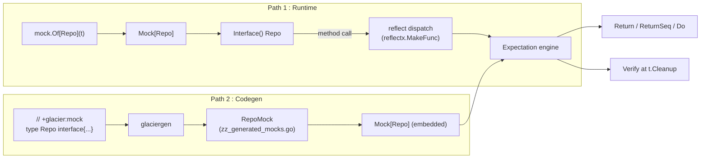

# Mock

<!--
  Section headers below are STABLE ANCHORS. Magpie extracts content by header,
  so do not rename or reorder them. Doing so is a process change requiring its
  own spec.

  Sections marked **Public** are extracted by Magpie for the public site.
  Sections marked **Internal** are engineering-only and never appear in published docs.
-->

## Public Summary

<!-- **Public.** One paragraph in end-user voice. The canonical description for the site and README. -->

`mock` is Glacier's interface-mocking package. Pass any interface type parameter to `mock.Of[T]` and get back a fully-functional mock whose expectations you set with a fluent builder: record which method should be called, how many times, with what arguments, and what to return. All argument matching is type-safe :  `Eq[string]("alice")` will not compile against an `int` parameter. When the test ends, the mock's `Verify` runs automatically (via `t.Cleanup`) and reports every unmet expectation in one structured message. For teams that want richer IDE support, the `+glacier:mock` source marker triggers `glaciergen` to emit a typed wrapper in `zz_generated_mocks.go` :  same semantics, zero reflection at call-time.

## Mental Model

<!-- **Public.** The conceptual frame a developer should hold while using this. Mermaid diagrams welcome. Source for the "Concepts" page on the site. -->

There are two paths through the `mock` package. Both deliver the same programming model; they differ only in where the type machinery lives.

**Path 1 :  Runtime reflect (no codegen required)**

`mock.Of[Repo](t)` uses `reflect.MakeFunc` to synthesize a value that satisfies `Repo` at runtime. When one of its methods is called, the dispatch engine matches the arguments against registered expectations in order, invokes any `Do` function, then returns the configured values. The synthetic value lives only in memory; nothing is written to disk.

**Path 2 :  Codegen typed wrappers (optional, richer IDE support)**

Add `// +glacier:mock` above an interface declaration. Running `glaciergen` (or `go generate`) emits a `RepoMock` struct in `zz_generated_mocks.go`. That struct wraps a `Mock[Repo]` internally and exposes `OnGet(...)`, `OnCreate(...)`, etc. :  one typed method per interface method. Argument matchers are checked at compile time; there is no reflection on the hot path.

Both paths share the same `Matcher[T]`, `Expectation`, and `Call` types. A test may freely mix runtime and codegen mocks.



**Expectation lifecycle:**

1. `OnCall("Method").With(matchers...).Return(vals...)` :  registers an expectation.
2. Each inbound call locks the mock, scans expectations top-to-bottom, finds the first whose matchers all pass and whose call count is not yet exhausted.
3. Within the same critical section: the call counter increments and return values are captured. This prevents a TOCTOU race when `Times(1)` is set and multiple goroutines race to be the one match.
4. `Verify` (called automatically at cleanup, or manually) checks that every expectation's call count falls within its stated bounds.

**Strict vs. lenient:**

The default mode is **strict**: any call with no matching expectation immediately calls `t.Errorf` (reporting method name, received args, and the list of registered expectations) and returns zero values so the test can continue. `mock.StrictFatal` upgrades to `t.Fatalf`. `mock.LenientMode` silently records unmatched calls in `UnmatchedCalls()` for the test to inspect later.

## Goals

<!-- **Internal.** Bulleted list. -->

- Provide a reflect-based runtime mock that works for any exported interface with zero boilerplate :  no codegen required.
- Provide an optional codegen path (`+glacier:mock` marker + `glaciergen`) that emits typed wrappers with per-method expectation builders for full IDE autocomplete.
- Offer a type-safe matcher algebra (`Matcher[T any]`) so argument checks are verified at compile time, not runtime.
- Default to strict mode (unmatched calls fail the test); make lenient an explicit opt-in.
- Guarantee that `Times(1)` under concurrent load matches exactly once (single critical section per §23.14).
- Expose `Close() error` as an alias for `Verify`, enabling use in `defer` chains alongside other `io.Closer`-shaped resources.
- Integrate into the Glacier dogfooding story: the `mock` package is used by `cli`, `httpmock`, and `httpc` test suites.
- Render failure messages through a `slog.LogValuer`-aware formatter so secrets wrapped in `log.Redact` are never exposed in test output.

## Non-Goals

<!-- **Internal.** Bulleted list. What this spec deliberately excludes. -->

- **Mocking concrete types or functions.** `mock.Of[T]` requires `T` to be an interface. Mocking unexported methods is out of scope.
- **Recording call behavior on real implementations (spy pattern).** This package is a pure mock, not a spy/stub wrapper around a real value.
- **Codegen for non-interface types.** The `+glacier:mock` marker is only valid on `interface` declarations.
- **Persistence of mock state across processes.** Mock state is purely in-memory and process-local.
- **A standalone CLI for codegen.** Codegen runs through `glaciergen` (spec 0011), which is the single codegen entry point for all Glacier markers.
- **Argument capture / side-channel injection beyond `Do`.** The `Do` function receives a copy of args and may inspect or mutate referenced values; anything more complex is user code in `Do`.
- **Mocking generic interfaces with variable arity type parameters at runtime.** The reflect path works for generic interfaces only when the concrete type parameter is fully resolved at the `Of[T]` call site.

## Architecture

<!-- **Internal.** Mermaid diagram + prose. Package layout, data flow, lifecycle. -->

### File layout

```
mock/
├── mock.go              :  Of[T], Mock[T], Expectation, Call, option types
├── matchers.go          :  Matcher[T any], Eq, Any, Pred, Ref, Nil, NotNil, MatchFn
├── dispatch.go          :  reflect-based MakeFunc dispatch, critical section
├── verify.go            :  Verify, Close, UnmatchedCalls, failure message formatting
├── options.go           :  StrictDefault, StrictFatal, LenientMode option constructors
├── seq.go               :  ReturnSeq, SeqCycle, SeqExhaust
├── doc.go               :  package doc comment + example
├── example_test.go      :  godoc example (ExampleOf_Repo)
└── internal/
    └── reflectx/        :  shared with framework-shape; MakeFunc helpers, type cache
```

`reflectx` is the internal package shared across Glacier that provides the `reflect.MakeFunc` dispatch primitives and the type-info cache. It is not part of the `mock` public API. The `mock` package is the only leaf-tier package that imports `reflectx` directly.

### Reflect-based dispatch

`Of[T](t assert.TB, opts ...Option) Mock[T]` calls `reflect.TypeOf((*T)(nil)).Elem()` to obtain the interface's `reflect.Type`, then builds one `reflect.Value` per method using `reflect.MakeFunc`. Each synthesized function:

1. Acquires `Mock.mu` (sync.RWMutex, write lock for the whole call).
2. Iterates `Mock.expectations` in registration order.
3. For each expectation: evaluates every `Matcher[T]` against the corresponding argument. If all match and the expectation is not exhausted, increments the call counter, captures return values, and releases the lock before invoking any `Do` function and returning.
4. If no expectation matched: executes the configured unmatched-call policy (strict / strict-fatal / lenient).

The type-info cache lives in `reflectx` and is keyed by `reflect.Type`. It is a `sync.Map`; each entry is written once (the first time `Of[T]` is called for that `T`) and read-only thereafter. A `resetTypeCacheForTest()` function is build-tagged `testing` to allow test isolation.

### Codegen integration

The codegen path is driven by `glaciergen` (spec 0011, `cli/gen` package). When `glaciergen` encounters `// +glacier:mock` above an interface declaration, it emits a `<Interface>Mock` struct in `zz_generated_mocks.go` in the same package. The generated struct:

- Embeds `*mock.Mock[Interface]` (so all base methods :  `Verify`, `Close`, `CallsTo`, `UnmatchedCalls` :  are promoted).
- For each interface method `Foo(a ArgType) ReturnType`, emits:
  - `OnFoo(m mock.Matcher[ArgType], ...) *<Interface>MockExpectation_Foo` :  the typed expectation builder.
  - `<Interface>MockExpectation_Foo` wraps `*mock.Expectation` and re-exposes `Return(ReturnType)`, `ReturnSeq([]ReturnType)`, `Do(func(ArgType))`, `Times(n)`, `AtLeast(n)`, `AtMost(n)`, `AnyTimes()`, `Never()`.
- The struct has no unexported state beyond the embedded `*mock.Mock[Interface]`. All call routing goes through the same reflect dispatch engine; codegen only provides type-safe entry points on top.

This means codegen wrappers add zero runtime overhead for argument matching (matchers are still evaluated in the dispatch loop) but eliminate the string method name lookup from the call site and provide typed `Return` / `Do` signatures that the compiler can check.

### Layering constraints

`mock` is a Tier 2 (leaf) package. It may import:

- Kernel: `option`, `errs`, `log`, `assert`, `term`
- Internal: `internal/reflectx`

It must not import: `cli`, `httpmock`, `httpc`, or any other leaf package.

## Schema

<!-- **Internal.** Go types with invariants stated as `// invariant: ...` comments on each field. -->

```go
// Mock is the central handle returned by Of[T]. It holds all registered
// expectations, the call log, and the configuration for one mock instance.
//
// invariant: T must be an interface type; Of[T] panics at runtime otherwise.
// invariant: mu is held (write-locked) for the entire duration of every method call
//            so that match, increment, and return happen atomically (§23.14).
// invariant: once Verify has run, closed is true; subsequent Close calls are no-ops.
// invariant: expectations is append-only after construction; no reordering at runtime.
type Mock[T any] struct {
    mu           sync.RWMutex       // protects all mutable fields
    tb           assert.TB          // invariant: non-nil; set once at construction
    iface        reflect.Value      // invariant: Kind() == reflect.Interface; the synthesized value
    expectations []*Expectation     // invariant: ordered by registration; first match wins
    calls        []*Call            // invariant: append-only; all recorded calls in arrival order
    unmatched    []*Call            // invariant: subset of calls where no expectation matched
    mode         strictMode         // invariant: set once at construction via options; not mutated
    closed       bool               // invariant: transitions false→true exactly once
}

// Expectation captures a single registered expectation for one method.
//
// invariant: method is a valid exported identifier matching ^[A-Z][A-Za-z0-9_]*$
//            and ≤64 bytes (§23.9 row 20); validated at OnCall time.
// invariant: matchers length == number of method parameters or zero (match-any shorthand).
// invariant: count is only mutated while Mock.mu is write-locked (§23.14).
// invariant: retFn, retSeq, and doFn are mutually exclusive; at most one is non-nil.
//            Validation happens at Return/ReturnSeq/Do call time (panics).
// invariant: minCalls <= maxCalls unless maxCalls == -1 (AnyTimes sentinel).
type Expectation struct {
    method   string          // invariant: validated identifier
    matchers []anyMatcher    // invariant: may be nil (match any args)
    count    int             // invariant: guarded by Mock.mu
    minCalls int             // invariant: >= 0
    maxCalls int             // invariant: >= minCalls, or -1 for AnyTimes
    retFn    func([]any) []any  // invariant: nil unless Return was called
    retSeq   *returnSeq      // invariant: nil unless ReturnSeq was called
    doFn     reflect.Value   // invariant: zero unless Do was called
    seqMode  seqExhaustion   // SeqCycle | SeqExhaust (only meaningful when retSeq != nil)
}

// Call records one invocation of a mocked method.
//
// invariant: Args is a snapshot; mutations by the caller after the call do not
//            affect the recorded slice.
// invariant: At is set once at call time and never mutated.
// invariant: Matched is true iff an Expectation was found for this call.
type Call struct {
    Method  string        // invariant: same validated identifier as Expectation.method
    Args    []any         // invariant: defensive copy of arguments at call time
    At      time.Time     // invariant: set once; monotonic clock
    Matched bool
}

// Matcher[T] is a type-safe predicate over values of type T.
// It is the unit of argument matching in the expectation builder.
//
// invariant: Match is never nil.
// invariant: String() returns a stable, human-readable description.
type Matcher[T any] struct {
    match  func(T) bool   // invariant: non-nil
    desc   string         // invariant: stable across calls
}

// anyMatcher is the internal untyped interface used within Expectation.
// Matcher[T] implements anyMatcher; the type assertion is checked at registration.
type anyMatcher interface {
    matchAny(v any) bool
    String() string
}

// returnSeq holds values for ReturnSeq.
//
// invariant: values is non-empty; validated at ReturnSeq call time.
// invariant: pos is only mutated under Mock.mu.
type returnSeq struct {
    values [][]any  // invariant: len >= 1
    pos    int      // invariant: 0 <= pos <= len(values)
    mode   seqExhaustion
}

// seqExhaustion controls behavior when a ReturnSeq is exhausted.
type seqExhaustion int

const (
    SeqCycle   seqExhaustion = iota // default; wraps pos back to 0
    SeqExhaust                      // calls t.Errorf and returns zero values
)

// strictMode controls the unmatched-call policy.
type strictMode int

const (
    strictErrorf strictMode = iota // default; t.Errorf, continue
    strictFatalf                   // t.Fatalf, stop test
    lenient                        // record in unmatched, continue silently
)
```

## API

<!--
  **Public.** Every exported symbol introduced by this spec.
  For each: signature, doc comment (which becomes godoc), preconditions, postconditions,
  error contract, concurrency notes (goroutine-safe? blocking?), lifecycle hooks.
  Magpie extracts signatures + doc comments verbatim to the API reference page.
-->

### Constructor

```go
// Of returns a new Mock[T] for the interface type T and registers a
// t.Cleanup hook that calls Verify when the test ends.
//
// T must be an interface type. Of panics if T is a concrete type or if T is
// the predeclared any type (which is not satisfiably mockable).
//
// Preconditions:
//   - T is an interface type with at least one exported method.
//   - t is non-nil.
//
// Postconditions:
//   - The returned Mock[T].Interface() value satisfies T.
//   - t.Cleanup is registered; Verify runs automatically when t ends.
//
// Concurrency: Of itself is not called concurrently (it is a setup call).
// The returned Mock[T] is safe for concurrent use once constructed.
//
// Panics if T is not an interface type. The panic message is in library-register
// format: "mock.Of[T]: T must be an interface type, got <kind>".
func Of[T any](t assert.TB, opts ...Option) Mock[T]
```

### Mock[T] methods

```go
// Interface returns the synthesized value that satisfies T.
// All method calls on the returned value route through the expectation engine.
//
// Concurrency: safe to call from multiple goroutines. Calls on the returned
// value are individually atomic (each call acquires Mock.mu for its duration).
func (m *Mock[T]) Interface() T

// OnCall starts building an expectation for the method named by method.
//
// Preconditions:
//   - method is a valid exported Go identifier: matches ^[A-Z][A-Za-z0-9_]*$ and is ≤64 bytes (§23.9 row 20).
//   - method names a method in the interface T.
//
// Panics if either precondition is violated; the panic message is in
// library-register format.
//
// Concurrency: OnCall is a setup call; call it before the code under test runs.
// Concurrent OnCall and method dispatch is not supported.
func (m *Mock[T]) OnCall(method string) *Expectation

// CallsTo returns all recorded calls to the named method in arrival order.
// Returns nil if no calls were recorded for that method.
//
// Concurrency: safe to call after the code under test has finished.
func (m *Mock[T]) CallsTo(method string) []*Call

// UnmatchedCalls returns all calls for which no expectation matched,
// in arrival order. Always empty in strict modes (those calls fail the test
// instead of being recorded here).
//
// Concurrency: safe to call after the code under test has finished.
func (m *Mock[T]) UnmatchedCalls() []*Call

// Verify checks that every registered expectation's call count falls within
// its stated bounds. It reports all violations in a single t.Errorf call.
// Verify is idempotent: subsequent calls after the first are no-ops.
//
// Verify is called automatically at t.Cleanup. Call it manually for
// mid-test checkpoints.
//
// Concurrency: safe to call from any goroutine.
func (m *Mock[T]) Verify()

// Close is an alias for Verify that satisfies the io.Closer contract.
// It is idempotent: the second and subsequent calls are no-ops.
// Always returns nil.
//
// Use Close when wiring mock teardown alongside other io.Closer-shaped
// resources in a defer or errs.Join chain.
//
// Concurrency: safe to call from any goroutine.
func (m *Mock[T]) Close() error
```

### Expectation builder

All builder methods return `*Expectation` for chaining. Each method panics in library-register format if a precondition is violated; validation happens at registration time, not at call dispatch time.

```go
// With sets the argument matchers for this expectation. The number of matchers
// must equal the number of parameters of the method, or With may be omitted to
// match any arguments.
//
// The Matcher[T] type parameter must correspond to the parameter type at the
// same position in the method signature; a mismatch causes a panic at
// registration time (library-register format).
//
// With returns the expectation for chaining.
func (e *Expectation) With(matchers ...anyMatcher) *Expectation

// Return sets the fixed return values for this expectation.
// The number and types of values must match the method's return signature.
//
// Return, ReturnSeq, and Do are mutually exclusive; calling more than one
// panics (library-register format).
//
// Return returns the expectation for chaining.
func (e *Expectation) Return(vals ...any) *Expectation

// ReturnSeq sets a sequence of return value sets. On the first call the first
// set is used, on the second the second, and so on.
//
// The default exhaustion mode is SeqCycle: after the last set, the sequence
// wraps back to the first. Pass SeqExhaust to fail the test instead.
//
// vals must be non-empty; each inner slice must match the method's return
// signature in length and type.
//
// Return, ReturnSeq, and Do are mutually exclusive.
// ReturnSeq returns the expectation for chaining.
func (e *Expectation) ReturnSeq(vals [][]any, mode ...seqExhaustion) *Expectation

// Do sets a function to call when this expectation matches.
// fn must be a function whose parameter types match the method's parameter
// types and whose return types match the method's return types.
// A signature mismatch panics at registration time (library-register format).
//
// Return, ReturnSeq, and Do are mutually exclusive.
// Do returns the expectation for chaining.
func (e *Expectation) Do(fn any) *Expectation

// Times requires the method to be called exactly n times.
// n must be >= 1.
//
// Times returns the expectation for chaining.
func (e *Expectation) Times(n int) *Expectation

// AtLeast requires the method to be called at least n times.
// n must be >= 1.
//
// AtLeast returns the expectation for chaining.
func (e *Expectation) AtLeast(n int) *Expectation

// AtMost requires the method to be called at most n times.
// n must be >= 0. AtMost(0) is equivalent to Never.
//
// AtMost returns the expectation for chaining.
func (e *Expectation) AtMost(n int) *Expectation

// AnyTimes allows the method to be called zero or more times.
// This expectation never causes a Verify failure regardless of call count.
//
// AnyTimes returns the expectation for chaining.
func (e *Expectation) AnyTimes() *Expectation

// Never asserts the method is never called with matching arguments.
// If the method is called and matches, Verify reports a violation.
//
// Never returns the expectation for chaining.
func (e *Expectation) Never() *Expectation
```

### Matcher constructors

All constructors return `Matcher[T]`, which implements `anyMatcher`. The type parameter T must correspond to the method parameter type at the matching position.

```go
// Eq returns a Matcher[T] that passes only when the argument is deeply equal
// to want (using reflect.DeepEqual).
//
// Example: Eq[string]("alice") matches only the string "alice".
func Eq[T any](want T) Matcher[T]

// Any returns a Matcher[T] that passes for every value of type T.
//
// Example: Any[int]() matches any int argument.
func Any[T any]() Matcher[T]

// Pred returns a Matcher[T] backed by a custom predicate function.
// fn must be non-nil; Pred panics (library-register format) otherwise.
//
// Example: Pred[User](func(u User) bool { return u.ID > 0 })
func Pred[T any](fn func(T) bool) Matcher[T]

// Ref returns a Matcher[T] that compares the argument to want using
// assert.Equal's smart-equal algorithm, which supports functional options
// such as assert.IgnoreFields and assert.IgnoreOrder.
//
// opts are passed verbatim to assert.Equal. Ref panics (library-register)
// if want is nil for a non-pointer T.
//
// Example: Ref[[]int]([]int{1, 2, 3}, assert.IgnoreOrder())
func Ref[T any](want T, opts ...assert.EqualOption) Matcher[T]

// Nil returns a Matcher[any] that passes only when the argument is nil
// (interface nil, pointer nil, or nil slice/map/channel/func).
// Use this for untyped nil checks; for typed nil use Eq[*T](nil).
func Nil() Matcher[any]

// NotNil returns a Matcher[any] that passes only when the argument is
// non-nil.
func NotNil() Matcher[any]

// MatchFn returns an untyped matcher backed by fn. Use this as an escape
// hatch when a typed matcher is inconvenient.
//
// fn must be non-nil; MatchFn panics (library-register) otherwise.
func MatchFn(fn func(any) bool) Matcher[any]
```

### Option constructors

```go
// StrictDefault returns an Option that sets the mock to strict mode.
// In strict mode, any call with no matching expectation calls t.Errorf
// (reporting method name, received arguments, and the full list of
// registered expectations) and returns zero values.
//
// Strict is the default; this option exists for explicit documentation.
func StrictDefault() Option

// StrictFatal returns an Option that upgrades strict mode to t.Fatalf,
// halting the test goroutine immediately on an unmatched call.
func StrictFatal() Option

// LenientMode returns an Option that suppresses failure on unmatched calls.
// Unmatched calls are recorded in UnmatchedCalls() for the test to inspect.
//
// Example use: testing "at most once" by asserting len(m.UnmatchedCalls()) == 0
// after the code under test runs.
func LenientMode() Option
```

### Call accessors

```go
// Call.Method returns the name of the called method.
// Call.Args returns a defensive copy of the arguments (any mutations by the
// caller after dispatch do not affect this slice).
// Call.At returns the time the call was recorded.
// Call.Matched reports whether an Expectation was found for this call.
```

### Package-level type

```go
// Option is a functional option for Mock[T] construction.
// Options are applied in the order they are passed to Of[T].
type Option interface{ applyMock(*mockOptions) }
```

## Examples

<!--
  **Public.** Runnable Go examples in fenced ```go blocks.
  Each example is self-contained and `go test ./...`-compatible (valid Example functions).
  Magpie transcludes verbatim into tutorials.
-->

### Example 1 :  runtime mock, basic usage

```go
// ExampleOf_Repo demonstrates creating a runtime mock for Repo and
// verifying expectations at test cleanup.
func ExampleOf_Repo() {
    // In a real test, t comes from testing.T.
    // Here we use a no-op stand-in for the godoc example.
    t := &testing.T{}

    type Repo interface {
        FindUser(ctx context.Context, id string) (User, error)
        SaveUser(ctx context.Context, u User) error
    }

    m := mock.Of[Repo](t)

    // Expect FindUser("u-42") to be called once and return a user.
    m.OnCall("FindUser").
        With(mock.Any[context.Context](), mock.Eq[string]("u-42")).
        Return(User{ID: "u-42", Name: "Alice"}, nil).
        Times(1)

    // Expect SaveUser to never be called.
    m.OnCall("SaveUser").Never()

    // Pass the mock to code under test.
    repo := m.Interface()
    got, err := repo.FindUser(context.Background(), "u-42")
    fmt.Println(got.Name, err)
    // Output: Alice <nil>
}
```

### Example 2 :  typed matchers with compile-time safety

```go
func ExampleEq_typed() {
    t := &testing.T{}

    type Greeter interface {
        Greet(name string) string
    }

    m := mock.Of[Greeter](t)

    // Eq[string] is checked at compile time; Eq[int] here would not compile.
    m.OnCall("Greet").
        With(mock.Eq[string]("world")).
        Return("hello, world").
        AnyTimes()

    g := m.Interface()
    fmt.Println(g.Greet("world"))
    // Output: hello, world
}
```

### Example 3 :  ReturnSeq with SeqExhaust

```go
func ExampleExpectation_ReturnSeq() {
    t := &testing.T{}

    type Queue interface {
        Pop() (int, bool)
    }

    m := mock.Of[Queue](t)

    // Return 1, then 2, then fail if called a third time.
    m.OnCall("Pop").
        ReturnSeq([][]any{
            {1, true},
            {2, true},
        }, mock.SeqExhaust).
        AnyTimes()

    q := m.Interface()
    v, ok := q.Pop()
    fmt.Println(v, ok) // 1 true
    v, ok = q.Pop()
    fmt.Println(v, ok) // 2 true
    // Output:
    // 1 true
    // 2 true
}
```

### Example 4 :  codegen path with `+glacier:mock`

```go
// +glacier:mock
type Repo interface {
    FindUser(ctx context.Context, id string) (User, error)
    SaveUser(ctx context.Context, u User) error
}

// After running `go generate ./...`, a RepoMock struct is emitted in
// zz_generated_mocks.go. Use it in tests like this:

func TestServiceFindsUser(t *testing.T) {
    rm := &RepoMock{Mock: mock.Of[Repo](t)}

    rm.OnFindUser(mock.Any[context.Context](), mock.Eq[string]("u-42")).
        Return(User{ID: "u-42", Name: "Alice"}, nil).
        Times(1)

    svc := NewUserService(rm.Interface())
    got, err := svc.GetUser(context.Background(), "u-42")
    if err != nil {
        t.Fatal(err)
    }
    if got.Name != "Alice" {
        t.Errorf("got %q, want %q", got.Name, "Alice")
    }
    // Verify is called automatically at t.Cleanup.
}
```

### Example 5 :  mixing runtime and codegen mocks

```go
func TestMixedMocks(t *testing.T) {
    // Runtime mock for an external interface (no codegen marker).
    cacheM := mock.Of[cache.Cache](t)
    cacheM.OnCall("Get").With(mock.Eq[string]("key")).Return([]byte("val"), nil).Times(1)

    // Codegen mock for an in-repo interface (marker applied).
    repoM := &RepoMock{Mock: mock.Of[Repo](t)}
    repoM.OnFindUser(mock.Any[context.Context](), mock.Eq[string]("u-1")).
        Return(User{ID: "u-1"}, nil).
        AnyTimes()

    svc := NewService(repoM.Interface(), cacheM.Interface())
    _, _ = svc.Handle(context.Background(), "u-1")
    // Both mocks' Verify calls run at t.Cleanup.
}
```

### Example 6 :  Close in a defer chain

```go
func TestWithClose(t *testing.T) {
    m := mock.Of[io.ReadCloser](t)
    m.OnCall("Read").Return(0, io.EOF).AnyTimes()
    m.OnCall("Close").Return(nil).Times(1)

    rc := m.Interface()
    defer func() {
        if err := errs.Join(rc.Close(), m.Close()); err != nil {
            t.Error(err)
        }
    }()

    buf := make([]byte, 4)
    rc.Read(buf)
}
```

## Test Matrix

<!--
  **Internal.** Owned by Lynx.
  Table: scenario × input × expected outcome × covered-by-test-name.
-->

### Test files

- `mock/of_test.go` :  `Of[T]`, panics on non-interface, type caching
- `mock/mock_test.go` :  `Mock[T]` methods, `Interface()`, `Close` (alias for Verify per §23.16)
- `mock/expect_test.go` :  Expectation builder fluent chain
- `mock/matchers_test.go` :  every Matcher constructor (`Matcher[T]` per §23.17)
- `mock/return_test.go` :  `Return` / `ReturnSeq` / `Do`
- `mock/times_test.go` :  `Times` / `AtLeast` / `AtMost` / `AnyTimes` / `Never`
- `mock/strict_test.go` :  `StrictDefault` / `StrictFatal` / `LenientMode` (per §23.15 naming)
- `mock/concurrency_test.go` :  concurrent calls (`-race`), `Times(1)` race per §23.14
- `mock/lifecycle_test.go` :  Cleanup auto-Verify, `Close` idempotency
- `mock/dispatch_test.go` :  reflect-based `MakeFunc` dispatch correctness
- `mock/bench_test.go` :  benchmarks
- `mock/property_test.go` :  property tests
- `mock/example_test.go` :  godoc examples
- `mock/safety_test.go` :  no `unsafe` audit, no on-disk emission audit
- `mock/codegen_integration_test.go` :  uses `cli/gen` test harness for `+glacier:mock` markers (or links to `cli/gen/testdata` mock golden cases)

### Test matrix

| # | Name | Spec ref | Type | Description | Helpers |
|---|---|---|---|---|---|
| 1 | TestOfBasic | §21.10 F1 | unit | `Of[Iface]` returns mock satisfying interface | assert |
| 2 | TestOfNonInterfacePanics | §21.10 E1 | unit | `Of[ConcreteType]` panics with structured message | assert.Panics |
| 3 | TestOfRegistersCleanup | §21.10 F1 | unit | Mock auto-registers t.Cleanup → Verify runs | assert, fixture |
| 4 | TestOfTypeCacheReused | §21.10 NF1 | unit | Second `Of[T]` reuses cached `reflect.Type` | testing.AllocsPerRun |
| 5 | TestInterfaceReturnsSatisfyingValue | §21.10 F2 | unit | `m.Interface()` value satisfies T | assert |
| 6 | TestInterfaceMethodsRoutedToMock | §21.10 F2 | unit | Calls on `Interface()` reach the expectation engine | assert |
| 7 | TestOnCallReturnSimple | §21.10 F3/F9 | unit | `OnCall("Get").Return(v, nil)` → call returns those | assert |
| 8 | TestOnCallMethodNotInInterface | §21.10 F3 | unit | `OnCall("NoSuchMethod")` panics at registration | assert.Panics |
| 9 | TestOnCallMethodNameRegex | §23.9 row 20 | unit | Method name matches `^[A-Z][A-Za-z0-9_]*$`; control chars rejected | assert.Panics |
| 10 | TestOnCallMethodNameOversize | §23.9 row 20 | unit | 65-byte method name rejected | assert.Panics |
| 11 | TestCallsToReturnsRecordedCalls | §21.10 F4 | unit | `CallsTo("Get")` returns timestamped Calls | assert |
| 12 | TestCallsToOrderingPreserved | §21.10 F4 | unit | Calls returned in arrival order | assert |
| 13 | TestUnmatchedCallsLenient | §21.10 F5/E4 | unit | Lenient mode records unmatched | assert |
| 14 | TestUnmatchedCallsStrictAlwaysEmpty | §21.10 F5 | unit | Strict mode → UnmatchedCalls empty (call failed test) | assert |
| 15 | TestVerifyAutoInvokedAtCleanup | §21.10 F6 | unit | Cleanup runs Verify; failure surfaces in t.Errorf | mock(TB) |
| 16 | TestVerifyMidTestCheckpoint | §21.10 F6 | unit | Manual `Verify()` mid-test reports current state | assert |
| 17 | TestStrictDefault | §21.10 F7/§23.15 | unit | Default options are Strict (`mock.StrictDefault` per §23.15) | assert |
| 18 | TestStrictUnmatched_TErrorf | §21.10 E2 | unit | Unmatched call → t.Errorf with method, args, expected list | mock(TB) |
| 19 | TestStrictFatalHalts | §21.10 E3 | unit | StrictFatal → t.Fatalf | mock(TB), goroutine-recover harness |
| 20 | TestLenientMode | §21.10/§23.15 | unit | Lenient records unmatched silently; consumer asserts | assert |
| 21 | TestStrictUnmatchedReturnsZeroValues | §21.10 E2 | unit | Unmatched in strict still returns zero T to consumer (test continues) | assert |
| 22 | TestExpectationWithMatchersGeneric | §23.17 | unit | `With(Eq[string]("u"))` typed; mismatch type-args is compile error | assert + compile-only check |
| 23 | TestEqTyped | §21.10 F13 | unit | `Eq[string]("u-42")` matches "u-42", not "u-43" | assert |
| 24 | TestEqMismatchType | §21.10 E8 | unit | Eq[string] vs runtime int → no match (lenient) / fail (strict) | assert |
| 25 | TestAnyMatchesAnyT | §21.10 F14 | unit | `Any[T]()` matches any value | assert |
| 26 | TestPredCustomPredicate | §21.10 F15 | unit | `Pred[User](func(u User) bool { ... })` → typed predicate | assert |
| 27 | TestNilMatcher | §21.10 F16 | unit | `Nil()` matches nil value | assert |
| 28 | TestNotNilMatcher | §21.10 F16 | unit | `NotNil()` matches non-nil | assert |
| 29 | TestMatchFnUntypedFallback | §21.10 F17 | unit | `MatchFn(func(any) bool)` works as escape hatch | assert |
| 30 | TestRefSmartEqual | §21.10 F18 | unit | `Ref[T](v, IgnoreOrder())` uses assert.Equal smart-equal | assert |
| 31 | TestRefIgnoreFields | §21.10 F18 | unit | `Ref` honors `assert.IgnoreFields` option | assert |
| 32 | TestExpectationReturnArityMismatch | §21.10 E5 | unit | `Return(x)` for method returning (T, error) → panic at registration | assert.Panics |
| 33 | TestExpectationReturnTypeMismatch | §21.10 E6 | unit | Wrong-type Return value → panic | assert.Panics |
| 34 | TestExpectationDoFn | §21.10 F11 | unit | `Do(fn)` invoked with recorded args; returns used | assert |
| 35 | TestExpectationDoFnWrongSignature | §21.10 E7 | unit | Wrong fn signature → panic at registration | assert.Panics |
| 36 | TestExpectationReturnSeq | §21.10 F10 | unit | Sequence advances per call | assert |
| 37 | TestReturnSeqCycleDefault | §21.10 E12 | unit | After exhaustion, cycles to start | assert |
| 38 | TestReturnSeqExhaustMode | §21.10 E13 | unit | After exhaustion in SeqExhaust → t.Errorf | mock(TB) |
| 39 | TestExpectationTimes_Exact | §21.10 F12 | unit | Times(2): 2 calls → Verify pass; 1 → fail; 3 → unmatched(strict) | assert |
| 40 | TestExpectationAtLeast | §21.10 F12 | unit | AtLeast(3): 3 ok, 4 ok, 2 fail | assert |
| 41 | TestExpectationAtMost | §21.10 F12 | unit | AtMost(2): 0/1/2 ok, 3 fail at 3rd call | assert |
| 42 | TestExpectationAnyTimes | §21.10 F12 | unit | AnyTimes always passes | assert |
| 43 | TestExpectationNever | §21.10 F12/E11 | unit | Never violated → Verify reports unexpected | mock(TB) |
| 44 | TestFirstRegisteredMatchWins | §21.10 E9 | unit | Two matching expectations: first wins | assert |
| 45 | TestVerifyReportsAllUnmetInOneError | §21.10 NF6 | unit | One t.Errorf consolidates all unmet expectations with structured diff | mock(TB), assert.Contains |
| 46 | TestConcurrentCallsRecordedCorrectly | §21.10 E14/NF7 | concurrency | 1000 goroutines call mocked method; all recorded | -race |
| 47 | TestTimes1RaceFix | §23.14 | concurrency | match-AND-increment-AND-respond is single critical section; Times(1) under contention → exactly one match | -race |
| 48 | TestNoUnsafeImports | §21.10 NF3 | audit | `mock` package source contains no `unsafe.Pointer` or `reflect.Value.UnsafeAddr` | go-list-deps + grep |
| 49 | TestNoOnDiskEmissionAtRuntime | §21.10 NF4 | audit | Runtime path opens no files for write | fixture.WatchFiles |
| 50 | TestReflectMakeFuncDispatch | §21.10 NF1 | unit | Synthesized methods invoke through MakeFunc correctly | assert |
| 51 | TestMockInBenchmarkB | §21.10 E16 | unit | `*testing.B` satisfies `assert.TB`; Verify runs at b.Cleanup | assert |
| 52 | TestThirdPartyInterfaceMockable | §21.10 E15 | unit | Mock of `io.Reader` works at runtime | assert |
| 53 | TestMockClose_AliasForVerify | §23.16 | lifecycle | `Mock[T].Close()` runs Verify exactly once | assert |
| 54 | TestMockCloseIdempotent | §23.16 | lifecycle | Calling Close twice → no double-Verify; second is no-op | assert |
| 55 | TestMockClose_BeforeCleanup | §23.16 | lifecycle | Manual Close pre-empts t.Cleanup; Cleanup is no-op | assert, fixture |
| 56 | TestSlogLogValuerHonoredInFailureMessage | §23.11 | unit | Failure message renders `slog.LogValuer`-redacted args as `[REDACTED]` | mock(TB), log.Redact |
| 57 | TestFailureMessageRegisterCLI | §21.10 NF8 | unit | t.Errorf output is capitalized, period-terminated | assert.Regex |
| 58 | TestInternalPanicRegisterLibrary | §21.10 NF8 | unit | Wrong-arity panic message is library-register format | assert.Regex |
| 59 | TestRuntimeAndCodegenMix | §21.10 | integration | Same test uses both runtime `Of[Iface]` and codegen `IfaceMock` | assert |
| 60 | PropertyTimes_n_Calls_Verifies | §21.10 F12 | property | For random n in [0,20], n calls → Verify pass; n+1 → fail | rapid |
| 61 | PropertyExpectationOrderingMatters | §21.10 E9 | property | First-registered-wins holds across N=100 random orderings | rapid |
| 62 | PropertyMatcherStringIsStable | §21.10 NF8 | property | `Matcher.String()` deterministic for same matcher | property |
| 63 | TestMockUsesAssertHelpersInTests | dogfooding | meta | `mock_test` package imports `assert` (dogfooding invariant) | go-list-deps |
| 64 | BenchmarkMockCallNoArgs | §21.10 NF1/§23.13 | bench | ≤ 6 allocs/op (relaxed per §23.13) | testing.B |
| 65 | BenchmarkMockCall3Args | §21.10 NF1 | bench | ≤ 6 allocs/op | testing.B |
| 66 | BenchmarkMockCallWithMatchers | §21.10 NF1 | bench | matcher iteration cost bounded | testing.B |
| 67 | BenchmarkMockOf | §21.10 NF1 | bench | Cache hot path | testing.B |
| 68 | BenchmarkCodegenPathAllocs | §23.13 | bench | Codegen path ≤ 2 allocs/op (tighter than reflect) | testing.B |
| 69 | ExampleOf_Repo | §21.10 examples | doc-test | Headline example | godoc |

### Coverage target

- **Line coverage:** 92% minimum. The reflect dispatch path and all mock mode branches must be covered exhaustively.
- **Public API coverage:** 100% :  every exported symbol including all matcher constructors, all option constructors, and all expectation builder methods.

### Edge cases not in spec (Lynx register)

The following scenarios are not gated by the test matrix above but are recommended for implementation-level coverage:

- `TestOfGenericInterface` :  `Repo[string]` as T; should work when type param is resolved at `Of` call site.
- `TestNamedReturns` :  method with named return values; verify reflect sees them correctly.
- `TestVariadicMethod` :  `func(args ...string) error`; verify variadic arg matching.
- `TestReturnFunctionType` :  Return value is itself a function type.
- `TestRegisterDuringDispatchPanics` :  concurrent `OnCall` and dispatch should panic (mirrors `sync.WaitGroup.Add`-after-`Wait`).
- `TestOfAnyType` :  `Of[any]()` should panic; `any` is not satisfiably mockable.

### Special concerns

- **§23.14 race lock-in:** the `Times(1)` race fix (test 47) is an explicit guard. The entire match-increment-respond sequence must execute under a single write lock acquisition. Any refactor that splits this into multiple lock acquisitions will break test 47 under `-race`.
- **§23.13 alloc target:** relaxed to ≤ 6 allocs/op for the reflect path. The codegen path targets ≤ 2 allocs/op. Tests must not regress to the pre-relaxation 2-alloc target for the reflect path.
- **Reflect type cache isolation:** `mock.resetTypeCacheForTest()` is a build-tagged testing helper. Tests must call it in `t.Cleanup` to prevent cache state from leaking between parallel tests.

## Dependency Justification

<!--
  **Internal.** Owned by Falcon.
  One row per new direct dependency. The empty table is the goal.
-->

The `mock` package introduces no new direct module dependencies beyond those already declared by Glacier kernel packages and `golang.org/x/tools/go/packages`.

The `golang.org/x/tools/go/packages` dependency required by the `+glacier:mock` codegen path is already justified and declared in spec 0011 (CLI / cli/gen). The `mock` package's codegen integration runs through the same `glaciergen` binary; `mock` itself does not import `golang.org/x/tools` at runtime. No separate dependency justification row is required here.

| Module | Version | License | Last release | Maintainers | Alternatives considered | Why we can't roll our own |
|---|---|---|---|---|---|---|
| *(none :  codegen dep covered by spec 0011)* | :  | :  | :  | :  | :  | :  |

## Security & Supply-Chain Notes

<!-- **Internal.** Untrusted-input handling, sandboxing implications, secrets handling, vuln-scan considerations. -->

### Untrusted-input boundary (§23.9 row 20)

The only untrusted string the `mock` package accepts at runtime is the method name passed to `OnCall`. This string is validated before any further processing:

- **Allowed pattern:** `^[A-Z][A-Za-z0-9_]*$`
- **Maximum length:** 64 bytes
- **Rejection behavior:** immediate panic in library-register format :  `"mock.OnCall: method name %q is invalid"`. No input is stored or reflected before validation passes.

This prevents injection of control characters, null bytes, or pathologically long strings into the reflect lookup path.

### Falcon §1.2 hard rules

The following invariants are enforced and tested (test 48, `TestNoUnsafeImports`):

1. **No `unsafe` package.** `mock` and `internal/reflectx` must not import `unsafe` or call `reflect.Value.UnsafeAddr`, `reflect.Value.UnsafePointer`, or `reflect.NewAt`. The audit test uses `go list -deps` plus grep on source.
2. **No on-disk emission at runtime.** The runtime reflect path opens no files for write. All type synthesis is in-memory via `reflect.MakeFunc`. Codegen (file emission) happens only in `glaciergen` (spec 0011), never in the `mock` package itself at test runtime. Test 49 (`TestNoOnDiskEmissionAtRuntime`) verifies this with `fixture.WatchFiles`.
3. **Type info from generic parameter only.** The `reflect.Type` for `T` is obtained exclusively from `reflect.TypeOf((*T)(nil)).Elem()`. No string-based type lookup, no `interface{}` casting that could widen type information.

### Info-disclosure defaults (§23.11)

Mock failure messages are rendered through a `slog.LogValuer`-aware formatter. When an argument implements `slog.LogValuer`, the formatter calls `LogValue()` and uses the returned `slog.Value` for display. This means arguments wrapped in `log.Redact(secret)` appear as `[REDACTED]` in all `t.Errorf` and `t.Fatalf` output produced by the mock engine.

**Developer guidance:** wrap secret arguments (tokens, passwords, PII) in `log.Redact` at the call site in your interface, not in the mock. The mock formatter will honour the `LogValuer` contract transparently.

Example:
```go
// In your interface implementation, wrap secrets:
repo.FindUser(ctx, log.Redact(apiKey)) // apiKey rendered as [REDACTED] in mock output
```

Failure message format contract:
- Sentence-case, period-terminated (`"Unexpected call to Repo.FindUser."`)
- Structured diff: method name, received args (LogValuer-aware), list of registered expectations with their remaining call counts.
- All violations from a single `Verify` call are consolidated into one `t.Errorf` call (test 45, `TestVerifyReportsAllUnmetInOneError`).

### Supply-chain

`mock` imports only Go standard library packages (`reflect`, `sync`, `time`, `fmt`) and Glacier kernel packages (`option`, `errs`, `log`, `assert`). The supply chain is fully in-tree; there are no third-party runtime dependencies to scan.

## FAQ

<!-- **Public.** Anticipated user questions with answers. Magpie extracts to the public docs FAQ. -->

**Q: Do I need to run `go generate` before my tests work?**

No. The reflect-based runtime mock (`mock.Of[T]`) requires no codegen. You get a fully functional mock immediately. Codegen (`+glacier:mock`) is optional and adds typed `OnFoo(...)` builder methods for better IDE autocomplete. Your tests pass either way.

**Q: What happens if I forget to call `Verify`?**

Nothing bad. `Of[T]` registers a `t.Cleanup` hook that calls `Verify` automatically when the test ends. If you want a mid-test checkpoint (e.g., after a specific code path), call `Verify()` manually :  it is safe to call multiple times; only the first invocation performs the check.

**Q: Can I mock interfaces from third-party packages I don't own?**

Yes, for the runtime path. `mock.Of[io.Reader](t)` works fine. For the codegen path, you cannot add `+glacier:mock` to a type you don't own, but you can wrap it with your own interface and mark that.

**Q: My test has a secret token in a method argument. Will it appear in failure output?**

Not if you wrap it with `log.Redact`. The mock failure formatter is `slog.LogValuer`-aware: any argument that implements `slog.LogValuer` is rendered via its `LogValue()` result, so `log.Redact(token)` prints `[REDACTED]`. This is the Glacier-wide convention for sensitive values.

**Q: Is the mock safe for use in parallel tests?**

Yes. All `Mock[T]` state is protected by a `sync.RWMutex`. Calls through `Interface()` are goroutine-safe. The `Times(1)` critical section (§23.14) ensures that under concurrent load, exactly one call matches a single-use expectation :  no double-match, no miss. `OnCall` is a setup call and must not be called concurrently with method dispatch.

## Decisions & Rationale

<!-- **Internal.** Why-this-and-not-that for non-obvious choices. Folded-in ADR. -->

### D1 :  `reflect.MakeFunc` over code generation as the primary runtime path

The reflect path requires zero toolchain steps and works for any interface, including third-party ones. Codegen provides a better developer experience (typed `OnFoo` builders, IDE autocomplete) but is optional and slower to set up. Starting with reflect as the primary path keeps the zero-friction on-ramp and reserves codegen as an enhancement.

### D2 :  Generic `Matcher[T any]` with compile-time type checking (§23.17)

Early design used `Matcher` as a plain interface with `Match(any) bool`. This forced developers to write type assertions inside custom matchers and produced confusing "matched wrong type" errors at runtime. The generic `Matcher[T]` moves type checking to the compiler: `Eq[string]("x")` cannot be passed where an `int` argument is expected. The `anyMatcher` internal interface bridges to the untyped dispatch loop.

### D3 :  Single critical section for match-AND-increment-AND-respond (§23.14)

An early two-lock design held a read lock to find the matching expectation, released it, then re-acquired a write lock to increment the counter. This created a TOCTOU window: two goroutines could both read-match the same `Times(1)` expectation, then both increment, causing one to return valid values and the other to falsely match. Collapsing to a single write lock acquisition for the entire find-increment-return sequence eliminates the race at the cost of slightly reduced concurrency. Given that mocks live in tests (not production hot paths), this is the right trade.

### D4 :  `StrictDefault` / `StrictFatal` / `LenientMode` naming (§23.15)

Original names were `Strict()` and `Lenient()`. The renamed constructors communicate intent more precisely: `StrictDefault` makes explicit that strict mode is the default and the constructor exists only for documentation purposes; `LenientMode` is the only opt-in deviation. `StrictFatal` is a distinct escalation level, not an option on `Strict`.

### D5 :  `Close() error` as alias for `Verify` (§23.16)

Mocks often coexist with other resources (HTTP transports, database connections) that are torn down via `defer rc.Close()` or `errs.Join`. Giving `Mock[T]` a `Close() error` method lets it participate in the same teardown pattern without a separate `Verify` call. `Close` is idempotent and always returns nil (any Verify failures are reported through `t.Errorf`, not through the error return).

### D6 :  Alloc target relaxed to ≤ 6 allocs/op for reflect path (§23.13)

The original target of ≤ 2 allocs/op assumed a zero-copy arg-slice reuse strategy that conflicts with the defensive-copy invariant on `Call.Args`. Reflect dispatch intrinsically allocates: a `[]reflect.Value` in, a `[]reflect.Value` out, plus boxing for each interface-typed argument. Six allocs is achievable with slice pooling and avoids the complexity of a custom arena. The codegen path bypasses reflect dispatch entirely and retains the ≤ 2 allocs/op target.

### D7 :  Failure messages consolidated in a single `t.Errorf` call

Spreading failures across multiple `t.Errorf` calls (one per unmet expectation) makes test output hard to read and duplicates the preamble. Consolidating into one structured block :  sorted by method name, then registration order :  makes it trivial to see the full picture at a glance and simplifies the test-output-checking tests (test 45, test 57).

### D8 :  Codegen shares `glaciergen` / `cli/gen` toolchain (spec 0011)

Rather than a separate `mock-gen` binary, the `+glacier:mock` marker is processed by the same `glaciergen` binary that handles `+glacier:cmd`, `+glacier:flag`, and other markers. This keeps the supply chain small (one binary, one `golang.org/x/tools` dep), and the marker scanning code lives in `cli/gen` where it is already tested. The `mock` runtime package has no dependency on the codegen toolchain.

## Open Questions

<!--
  **Internal.** Unresolved items.
  MUST be empty before this spec moves to `accepted`.
-->

*(none)*

## Verification

<!-- **Internal.** Concrete steps to prove the change works end-to-end. Run when the spec moves to `verified`. -->

Run the following steps on Linux, macOS, and Windows CI runners. All must pass before the status advances to `verified`.

1. **Unit and race tests pass:**
   ```
   go test -race ./mock/... -count=1 -timeout 120s
   ```
   Expected: all 69 test rows green; zero data race reports.

2. **Coverage thresholds met:**
   ```
   go test -race ./mock/... -coverprofile=mock.cov -covermode=atomic
   go tool cover -func=mock.cov | grep total
   ```
   Expected: total line coverage ≥ 92%. Every exported symbol appears in the coverage report.

3. **Benchmark alloc targets met (reflect path ≤ 6, codegen path ≤ 2):**
   ```
   go test -bench=BenchmarkMockCall -benchmem -count=6 ./mock/...
   go test -bench=BenchmarkCodegenPathAllocs -benchmem -count=6 ./mock/...
   ```
   Use `benchstat` to produce a stable median. The reflect path must not exceed 6 allocs/op; the codegen path must not exceed 2 allocs/op.

4. **Times(1) race fix verified:**
   ```
   go test -race -run TestTimes1RaceFix -count=100 ./mock/...
   ```
   Expected: 100 runs, zero race reports, exactly 1 matched call per run.

5. **No `unsafe` imports:**
   ```
   go list -deps ./mock/... | xargs -I{} go list -f '{{.ImportPath}}: {{.GoFiles}}' {} | grep -v "^unsafe"
   ```
   Plus: grep source for `unsafe.Pointer` and `UnsafeAddr` :  both must return zero matches.

6. **Codegen integration: `+glacier:mock` marker produces correct output:**
   ```
   cd cli/gen/testdata/<mock-marker-module>
   go generate ./...
   diff zz_generated_mocks.go ../golden/zz_generated_mocks.go
   ```
   Expected: zero diff. Verify that the generated `RepoMock` struct compiles (`go build ./...`).

7. **Codegen drift check:**
   ```
   glaciergen --check ./...
   ```
   Expected: exit 0 on a clean tree. Expected: non-zero exit when `zz_generated_mocks.go` is stale (verify by deleting one generated file and re-running).

8. **Info-disclosure: LogValuer-aware formatting:**
   Run `TestSlogLogValuerHonoredInFailureMessage`. The captured `t.Errorf` output must contain the literal string `[REDACTED]` and must not contain the raw secret value.

9. **Cross-leaf composition (`I7` integration test):**
   ```
   go test -race ./tests/integration/leaves/... -run TestRuntimeAndCodegenMocksCoexist
   ```
   Expected: pass.

10. **Dogfooding audit:**
    ```
    go list -deps -test ./mock/... | grep -q "glacier/assert"
    ```
    Expected: `glacier/assert` is present. Also run `TestMockUsesAssertHelpersInTests` (test 63).
