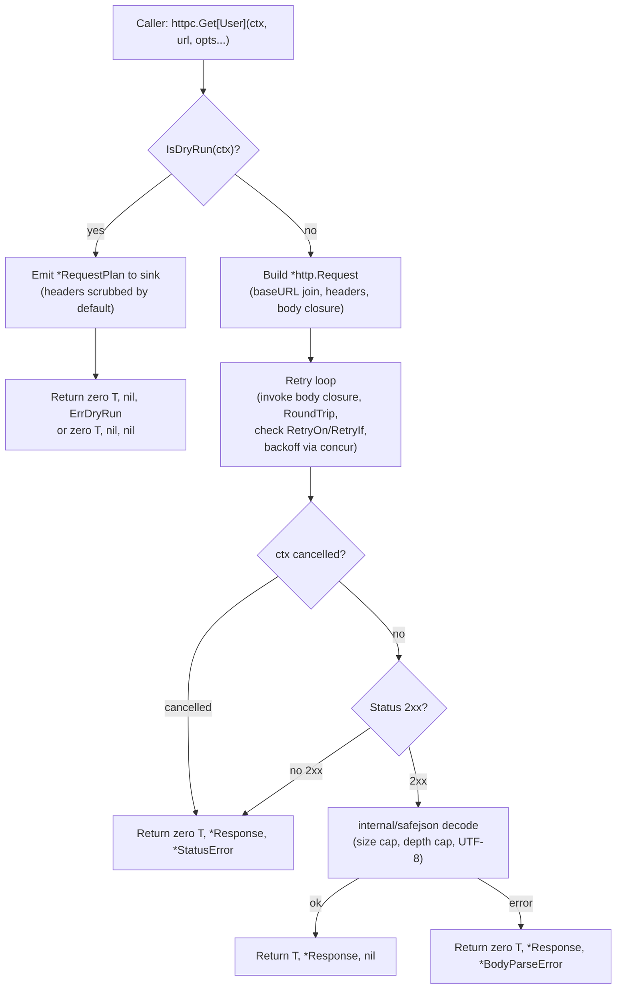

# HTTPC

<!--
  Section headers below are STABLE ANCHORS. Magpie extracts content by header,
  so do not rename or reorder them. Doing so is a process change requiring its
  own spec.

  Sections marked **Public** are extracted by Magpie for the public site.
  Sections marked **Internal** are engineering-only and never appear in published docs.
-->

## Public Summary

<!-- **Public.** One paragraph in end-user voice. The canonical description for the site and README. -->

`httpc` is Glacier's typed, retry-aware, dry-run-capable HTTP client. Write `user, resp, err := httpc.Get[User](ctx, url)` and the framework reads the response body, JSON-unmarshals it into your type, and hands it back — no boilerplate read-all-unmarshal loop. Mutating methods take closure-generated bodies so retry is safe even for large or streamed payloads: each attempt gets a fresh body from your closure, no seeking required. Retry policies compose declaratively — `MaxAttempts`, `ExponentialBackoff`, `Jittered`, `RetryOn`, `RetryIf` — and a CLI's `--dry-run` flag propagates through `context.Context` so every `httpc` call inside becomes plan-only without a single conditional at the call site. The package wraps stdlib `net/http`, carries no third-party dependencies, and composes directly with `httpmock` for hermetic, network-free tests.

## Mental Model

<!-- **Public.** The conceptual frame a developer should hold while using this. Mermaid diagrams welcome. Source for the "Concepts" page on the site. -->

Three ideas hold `httpc` together.

**Typed methods auto-unmarshal.** `Get[T]`, `Post[T]`, `Put[T]`, `Patch[T]`, and `Delete[T]` are generic functions. The type parameter `T` names the Go type you want back. The framework reads and decodes the response body for you. When `T` is `[]byte`, the raw body is returned unchanged. When `T` is anything else, the body is decoded via `internal/safejson` — a depth-capped, size-limited, UTF-8-validating wrapper around `encoding/json`. You get back the decoded value alongside a `*Response` wrapper that exposes the original `*http.Response`, the body bytes, and the elapsed duration.

**Closure-generated bodies make retry correct.** Retry requires re-sending the same body on every attempt. HTTP bodies are `io.Reader` — one-shot, not rewindable. `httpc` solves this by requiring callers to provide a _closure_ that produces the body, not the body itself. `JSONBody[T](func() T)` is called once per attempt. `MultipartBody(func(*multipart.Writer) error)` gets a fresh `multipart.Writer` per attempt. The previous attempt's `StreamBody` `ReadCloser` is closed before the closure is invoked again. Your closure is called serially — never concurrently for the same request.

**Dry-run propagates through `context.Context`.** Attaching dry-run to a context with `httpc.WithDryRun(ctx, httpc.WithPlanSink(fn))` makes every `httpc` call inside that context skip the network and emit a structured `*RequestPlan` to your sink function instead. There is no conditional code at call sites — the caller's code is unchanged. A CLI command's `--dry-run` flag sets the context attribute once; every downstream `httpc` call is automatically audit-only. The plan's rendered headers are scrubbed of sensitive values by default; opt into raw header values with `httpc.WithPlanIncludeSecrets()`.

```
Client.Get[T](ctx, url, opts...)
        │
        ├─ dry-run? ──yes──► emit *RequestPlan to sink ──► return zero T, nil, nil (or ErrDryRun)
        │
        ├─ build *http.Request (apply base URL, headers, body closure)
        │
        ├─ retry loop ──────────────────────────────────────────────┐
        │       invoke body closure (fresh per attempt)             │
        │       RoundTrip(req) via configured transport             │
        │       check RetryOn / RetryIf                             │
        │       ctx cancelled? ──yes──► short-circuit, stop loop    │
        │       backoff sleep ◄──────────────────────────────────────┘
        │
        ├─ status non-2xx? ──► return zero T, *Response, *StatusError
        │
        ├─ decode body via internal/safejson (size cap, depth cap, UTF-8)
        │
        └─ return T, *Response, nil
```

**Relationship to `httpmock`.** `httpc` is production HTTP client code. `httpmock` is the testing transport. They are both Tier 2 leaf packages and must not import each other. Consumers wire them together at the test level: `httpc.New(httpc.WithTransport(httpmock.NewWithT(t)))`. This is the idiomatic Glacier composition pattern.

## Goals

<!-- **Internal.** Bulleted list. -->

- Provide typed generic HTTP methods (`Get[T]`, `Post[T]`, `Put[T]`, `Patch[T]`, `Delete[T]`, `Head`, `Do`) that eliminate read-body-unmarshal boilerplate.
- Support closure-generated request bodies (`JSONBody[T]`, `MultipartBody`, `RawBody`, `StreamBody`, `FormBody`) that are retry-correct by design.
- Provide declarative retry policies: `MaxAttempts`, `ExponentialBackoff`, `LinearBackoff`, `Jittered`, `RetryOn`, `RetryIf`, `MaxElapsed`.
- Propagate dry-run through `context.Context` so callers receive a plan instead of a network call, without conditional code at the call site.
- Apply Falcon-mandated response-body safety: 32 MiB default cap, JSON depth cap 32, UTF-8 validation, gzip pre- and post-decompression caps.
- Redact sensitive headers in `*RequestPlan` by default; surface body bytes in error types via fields, not `.Error()` strings.
- Implement `Client.Close() error` that closes the underlying transport if it was created internally.
- Compose with `httpmock` for hermetic, network-free tests.
- Stay within the LOC budget: ≤ 700 lines of production code, ≤ 1100 lines of tests.
- Import only stdlib, `option`, `errs`, `log`, and `concur` (no third-party dependencies).

## Non-Goals

<!-- **Internal.** Bulleted list. What this spec deliberately excludes. -->

- **WebSocket, SSE, and gRPC clients.** Streaming protocols have different framing semantics. Deferred to `0025-httpc-streams.md`.
- **OAuth token management.** Token refresh, multi-step auth flows, credential rotation. Deferred to `0026-httpc-oauth.md`.
- **HTTP recording / replay.** `httpmock` is replay-only. Recording of real traffic is deferred to `0024-httpmock-record.md`.
- **Cookie jar management.** Callers attach cookies via `WithHeaders`; jar-based session tracking is out of scope.
- **HTTP/2 push, server-sent events.** Transport-level details; `httpc` is agnostic to HTTP version.
- **Integration with `httpmock` at the package level.** Both are Tier 2 leaves; they must not import each other.
- **Metrics or tracing hooks in this spec.** `httpc.WithTracing()` and `httpc.WithMetrics()` are deferred to the observability spec.

## Architecture

<!-- **Internal.** Mermaid diagram + prose. Package layout, data flow, lifecycle. -->

`httpc/` is a Tier 2 leaf package. It imports Tier 0 kernel packages (`option`, `errs`, `log`) and the Tier 1 mid-tier package `concur` (for ctx-aware backoff sleeping in the retry loop). It must not import `cli`, `mock`, `httpmock`, or any other Tier 2 package.

### File layout

```
httpc/
├── doc.go          package doc comment; sentinel errors; package-level Default var
├── client.go       Client struct; New(); clientConfig; Close(); goroutine-safety doc
├── methods.go      Get[T], Post[T], Put[T], Patch[T], Delete[T], Head, Do
├── body.go         JSONBody[T], MultipartBody, RawBody, StreamBody, FormBody, WithRequestHeaders
├── retry.go        retryConfig; MaxAttempts, ExponentialBackoff, LinearBackoff, Jittered, RetryOn, RetryIf, MaxElapsed; retry loop
├── dryrun.go       dryRunConfig; WithDryRun, WithPlanSink, WithDryRunErrors, IsDryRun; RequestPlan; header scrubber
├── response.go     Response struct; Drain()
└── internal/
    └── (no sub-packages; safejson lives in internal/safejson at the module root)
```

### Data flow



### Internal/safejson integration

Every JSON decode in `httpc` routes through `internal/safejson.Decode[T](r io.Reader, maxBytes int64) (T, error)`, which applies:

1. `io.LimitReader` capping at `maxBytes` (default 32 MiB).
2. `json.Decoder` with `DisallowUnknownFields` where T is a struct.
3. Depth cap of 32 using a recursive-descent counter.
4. UTF-8 validation of the decoded string values when `Content-Type` is `application/json` or `text/*`.

For gzip-encoded responses, both the compressed byte count (pre-decompression) and the decompressed byte count (post-decompression) are capped at `maxBytes`. This closes the zip-bomb attack surface.

### Lifecycle

`Client` wraps a `*http.Client`. When `New()` constructs the underlying transport internally (i.e., no `WithTransport` option is provided), `Client.Close()` closes that transport. When `WithTransport(rt)` is used, the caller owns the transport and `Client.Close()` does not close it. `Close()` is idempotent; calling it twice is safe. Multiple closed resources are collected via `errs.Join`.

## Schema

<!-- **Internal.** Go types with invariants stated as `// invariant: ...` comments on each field. -->

```go
// clientConfig holds the mutable configuration built by option.Option[clientConfig] functions.
type clientConfig struct {
    // invariant: transport is never nil after New(); defaults to http.DefaultTransport
    transport  http.RoundTripper
    // invariant: timeout == 0 means no per-request timeout (stdlib behavior)
    timeout    time.Duration
    // invariant: baseURL is either empty or a valid absolute URL with no path component after Join
    baseURL    string
    // invariant: headers is never nil after New(); may be empty
    headers    http.Header
    // invariant: retryConfig is the client-level default; per-call WithRetry merges on top
    retry      retryConfig
    // invariant: logger is never nil after New(); defaults to slog.Default()
    logger     *slog.Logger
    // invariant: ownsTransport is true only when New() constructs the transport itself
    ownsTransport bool
}

// retryConfig holds the accumulated retry policy for one request attempt sequence.
type retryConfig struct {
    // invariant: maxAttempts >= 1; value 1 means no retry (single attempt)
    maxAttempts int
    // invariant: exactly one of exponentialBase or linearDelay is non-zero, or neither (no backoff)
    exponentialBase time.Duration
    linearDelay     time.Duration
    // invariant: jittered applies ±25% to the computed backoff duration
    jittered        bool
    // invariant: retryStatuses is nil or a non-empty set; nil uses the default [500,502,503,504,429]
    retryStatuses   []int
    // invariant: retryIf combines with retryStatuses: either condition triggers retry
    retryIf         func(*Response, error) bool
    // invariant: maxElapsed == 0 means no overall timeout on the retry loop
    maxElapsed      time.Duration
}

// dryRunConfig carries the options set by WithDryRun.
type dryRunConfig struct {
    // invariant: sink is never nil; defaults to a slog debug-level emitter
    sink        func(*RequestPlan)
    // invariant: returnErrors == true causes ErrDryRun to be returned instead of nil
    returnErrors bool
    // invariant: includeSecrets == false causes header scrubber to redact sensitive values
    includeSecrets bool
}

// requestConfig holds per-call options accumulated from RequestOption values.
type requestConfig struct {
    // invariant: bodyFn is nil when no body builder is provided (e.g., GET)
    bodyFn      func() (io.ReadCloser, string, error)
    // invariant: headers is merged on top of client-level headers; nil means no additions
    headers     http.Header
    // invariant: retry overrides or merges with the client-level retryConfig
    retry       *retryConfig
}

// Response wraps *http.Response with httpc-specific metadata.
type Response struct {
    // invariant: Response is never nil
    *http.Response
    // invariant: Body holds the bytes read and buffered by typed methods; nil for Head/Do
    Body    []byte
    // invariant: Elapsed is the wall-clock time from request send to body-read completion
    Elapsed time.Duration
}

// RequestPlan is the audit record emitted during dry-run.
type RequestPlan struct {
    // invariant: Request is the fully-prepared *http.Request (URL joined, headers applied)
    // invariant: header values are scrubbed by default (see §23.11); raw opt-in via WithPlanIncludeSecrets
    Request *http.Request
    // invariant: Body holds the bytes the body closure would have produced; nil for HEAD/GET
    Body    []byte
    // invariant: Retry is a copy of the effective retry policy for this request
    Retry   retryConfig
    // invariant: Timeout is the effective per-request timeout (0 means none)
    Timeout time.Duration
}

// StatusError is returned when the server responds with a non-2xx status code.
type StatusError struct {
    // invariant: Status is the HTTP status code (e.g., 404, 503)
    Status int
    // invariant: Body holds the raw response body bytes for inspection; NOT included in Error() string
    Body   []byte
    // invariant: Cause wraps the underlying error if present (e.g., transport error); may be nil
    Cause  error
}

// BodyParseError is returned when the response body cannot be decoded into T.
// Named BodyParseError (not ParseError) to avoid collision with cli.FlagParseError (§23.15).
type BodyParseError struct {
    // invariant: Cause is the underlying decode error (never nil)
    Cause       error
    // invariant: Body holds the first 1 KiB of the response body for debugging; NOT in Error() string
    Body        []byte
    // invariant: ContentType is the response Content-Type header value
    ContentType string
}
```

## API

<!--
  **Public.** Every exported symbol introduced by this spec.
  For each: signature, doc comment (which becomes godoc), preconditions, postconditions,
  error contract, concurrency notes (goroutine-safe? blocking?), lifecycle hooks.
  Magpie extracts signatures + doc comments verbatim to the API reference page.
-->

### Package declaration and sentinel errors

```go
// Package httpc provides a typed, retry-aware, dry-run-capable HTTP client
// built on stdlib net/http. Typed methods (Get, Post, Put, Patch, Delete)
// auto-unmarshal response bodies into the caller's type T via generics.
// Mutating methods accept closure-generated bodies for retry correctness.
// Dry-run propagates through context.Context: one WithDryRun call makes
// every httpc call in that context emit a *RequestPlan instead of hitting
// the network.
package httpc

import (
    "context"
    "io"
    "mime/multipart"
    "net/http"
    "net/url"
    "time"
    "log/slog"

    "github.com/nathanbrophy/glacier/errs"
    "github.com/nathanbrophy/glacier/option"
)

var (
    // ErrDryRun is returned by typed methods when WithDryRunErrors() is set and
    // the context carries a dry-run attribute. Callers check with errors.Is.
    ErrDryRun = errs.Sentinel("httpc: dry run")

    // ErrMaxAttempts is returned when the retry loop exhausts its attempt budget.
    // The final response error is wrapped via errs.Wrap.
    ErrMaxAttempts = errs.Sentinel("httpc: max attempts")

    // ErrMaxElapsed is returned when the retry loop exceeds its overall time budget.
    // The final response error is wrapped via errs.Wrap.
    ErrMaxElapsed = errs.Sentinel("httpc: max elapsed")
)
```

### Client

```go
// Client is a configured HTTP client. The zero value is not usable; construct
// via New. A single Client is goroutine-safe: concurrent calls share the
// underlying transport.
type Client struct { /* unexported */ }

// Default is the package-level shared Client, equivalent to New() with all
// defaults. Package-level functions (Get, Post, etc.) delegate to Default.
// Replace Default in tests by setting httpc.Default = httpc.New(httpc.WithTransport(rt)).
var Default = New()

// New constructs a Client from the given options. If no WithTransport option
// is provided, New uses http.DefaultTransport and owns the transport for
// Close purposes. All options are applied in order; later options override
// earlier ones for scalar fields.
//
// Preconditions: none.
// Postconditions: returned *Client is non-nil and safe to use immediately.
// Error contract: panics if an option returns an error (programming error).
func New(opts ...option.Option[clientConfig]) *Client

// Close releases resources held by the client. If the client owns its
// transport (i.e., no WithTransport option was provided to New), Close closes
// that transport. If the transport was supplied externally, the caller retains
// ownership and Close does not close it.
//
// Close is idempotent: calling it more than once is safe and returns nil after
// the first call. Multiple sub-resources are released via errs.Join.
//
// Concurrency: safe to call from any goroutine, but concurrent in-flight
// requests may observe an error after Close returns.
func (c *Client) Close() error
```

### Client options

```go
// WithTransport sets the HTTP transport for the client. Use httpmock.NewWithT(t)
// in tests to intercept all requests. When WithTransport is used, the caller
// owns the transport; Client.Close does not close it.
func WithTransport(rt http.RoundTripper) option.Option[clientConfig]

// WithTimeout sets the per-request deadline, applied via context.WithTimeout
// before each attempt. A value of 0 means no deadline (default).
func WithTimeout(d time.Duration) option.Option[clientConfig]

// WithBaseURL sets a base URL prepended to relative URLs in method calls via
// url.Parse and URL.ResolveReference. Absolute URLs at the call site override
// the base. The joined URL must be ≤ 8 KiB and must not contain userinfo
// (user:password@host); both constraints are checked at request build time
// (§23.9 row 16).
func WithBaseURL(rawURL string) option.Option[clientConfig]

// WithHeaders sets headers sent on every request. Per-call WithRequestHeaders
// are merged on top. Header values are not validated at construction; invalid
// values will be rejected by the transport at send time.
func WithHeaders(h http.Header) option.Option[clientConfig]

// WithRetry sets the default retry policy applied to every method call.
// Per-call WithRetry options merge with (and override) the client-level policy.
func WithRetry(opts ...RetryOption) option.Option[clientConfig]

// WithLogger sets the structured logger for lifecycle events (request start,
// retry attempts, dry-run plan emission). Defaults to slog.Default().
func WithLogger(l *slog.Logger) option.Option[clientConfig]
```

### Typed methods (package-level and on *Client)

The package-level functions delegate to `Default`. The same methods exist on `*Client` for explicit-client use. Signatures below show the package-level form; `(c *Client)` receiver versions are identical in shape.

```go
// Get sends an HTTP GET request to url and decodes the response body into T.
// When T is []byte, the raw body bytes are returned without decoding.
// When T is any other type, the body is decoded via internal/safejson (size
// cap, depth cap ≤ 32, UTF-8 validation on JSON and text/* content types).
//
// Preconditions: ctx must be non-nil; url must be a valid HTTP/HTTPS URL (or
// a relative reference when WithBaseURL is configured).
// Postconditions: on nil error, T is the decoded body and *Response is non-nil.
// On non-nil error, T is the zero value.
// Error contract:
//   - *StatusError: non-2xx response status.
//   - *BodyParseError: body cannot be decoded into T.
//   - ErrMaxAttempts: retry exhausted; wraps the last request error.
//   - ErrMaxElapsed: overall retry timeout exceeded.
//   - ErrDryRun: dry-run mode with WithDryRunErrors set.
//   - context.Canceled / context.DeadlineExceeded: context cancelled.
// Concurrency: goroutine-safe; each call is an independent request.
func Get[T any](ctx context.Context, url string, opts ...RequestOption) (T, *Response, error)

// Head sends an HTTP HEAD request. No body is read or returned. Retry,
// dry-run, and other client options apply.
//
// Error contract: same as Get, except *BodyParseError is never returned.
func Head(ctx context.Context, url string, opts ...RequestOption) (*Response, error)

// Post sends an HTTP POST request. Body is provided via opts (e.g., JSONBody,
// MultipartBody). Response body is decoded into T as in Get.
func Post[T any](ctx context.Context, url string, opts ...RequestOption) (T, *Response, error)

// Put sends an HTTP PUT request. Same body and decode semantics as Post.
func Put[T any](ctx context.Context, url string, opts ...RequestOption) (T, *Response, error)

// Patch sends an HTTP PATCH request. Same body and decode semantics as Post.
func Patch[T any](ctx context.Context, url string, opts ...RequestOption) (T, *Response, error)

// Delete sends an HTTP DELETE request. Same body and decode semantics as Post.
func Delete[T any](ctx context.Context, url string, opts ...RequestOption) (T, *Response, error)

// Do sends a raw *http.Request. No body is auto-read or decoded. Retry,
// dry-run, base URL joining, and client headers do NOT apply; this is the
// escape hatch for callers who construct the full request themselves.
// The caller is responsible for closing resp.Body.
//
// Error contract: transport-level errors only; no StatusError or BodyParseError.
func Do(ctx context.Context, req *http.Request) (*Response, error)
```

### Response

```go
// Response wraps *http.Response with httpc-specific metadata.
type Response struct {
    *http.Response
    // Body holds the bytes read and buffered by typed methods (Get, Post, etc.).
    // Nil for Head and Do; the caller owns the body via http.Response.Body in
    // those cases.
    Body    []byte
    // Elapsed is the wall-clock time from the first byte sent to the last byte
    // of the body read.
    Elapsed time.Duration
}

// Drain discards and closes any unread response body. Call Drain when you
// have a *Response but do not intend to read the body, to release the
// underlying TCP connection. Safe to call when Body is already fully read.
//
// Concurrency: not goroutine-safe; do not call Drain concurrently with body reads.
func (r *Response) Drain() error
```

### Body builders

All body builders return a `RequestOption`. The closure they encapsulate is invoked once per retry attempt, serially, never concurrently for the same request.

```go
// RequestOption modifies a per-call request configuration.
// Implementations are sealed within the httpc package.
type RequestOption interface{ applyRequest(*requestConfig) error }

// JSONBody returns a RequestOption that sets Content-Type: application/json
// and produces the request body by calling gen() on each attempt and
// json-marshaling the result. The type parameter T allows compile-time
// verification that the closure return type is consistent.
//
// gen must be idempotent: it may be called multiple times during retry.
// gen is called once per attempt, serially; never concurrently.
func JSONBody[T any](gen func() T) RequestOption

// MultipartBody returns a RequestOption that sets Content-Type:
// multipart/form-data with a fresh boundary per attempt. gen receives a new
// *multipart.Writer for each attempt and writes parts to it.
//
// gen must be idempotent: it may be called multiple times during retry.
func MultipartBody(gen func(*multipart.Writer) error) RequestOption

// RawBody returns a RequestOption whose closure returns the body bytes,
// content-type string, and an error. On closure error, the request is not
// sent and the error is returned to the caller.
func RawBody(gen func() ([]byte, string, error)) RequestOption

// StreamBody returns a RequestOption for very large bodies. gen returns a
// fresh io.ReadCloser, content-type, and error per attempt. The ReadCloser
// from the previous attempt is closed before the closure is invoked again.
// On closure error, the request is not sent.
func StreamBody(gen func() (io.ReadCloser, string, error)) RequestOption

// FormBody returns a RequestOption that sets Content-Type:
// application/x-www-form-urlencoded. gen is called per attempt.
func FormBody(gen func() url.Values) RequestOption

// WithRequestHeaders returns a RequestOption that merges h on top of the
// client-level headers for this call only. Repeated WithRequestHeaders
// options accumulate.
func WithRequestHeaders(h http.Header) RequestOption

// WithRetry returns a RequestOption that attaches a per-call retry policy.
// The per-call policy merges with the client-level default: per-call values
// take precedence for scalar fields (MaxAttempts, MaxElapsed, backoff base).
func WithRetry(opts ...RetryOption) RequestOption

// WithMaxResponseBytes returns a RequestOption that overrides the default
// 32 MiB response-body cap for this call. A value of 0 is invalid; use
// WithUnboundedResponse to remove the cap entirely.
func WithMaxResponseBytes(n int64) RequestOption

// WithUnboundedResponse returns a RequestOption that removes the default
// response-body size cap. Use only when the caller has an independent
// bound (e.g., a known Content-Length from a trusted source).
// Falcon sign-off required at call sites within the framework.
func WithUnboundedResponse() RequestOption
```

### Retry options

```go
// RetryOption modifies a retry policy.
// Implementations are sealed within the httpc package.
type RetryOption interface{ applyRetry(*retryConfig) error }

// MaxAttempts caps the total number of request attempts (including the first).
// MaxAttempts(1) means one attempt, no retry (the default).
// MaxAttempts(0) is treated identically to MaxAttempts(1).
// Negative values panic (programming error).
func MaxAttempts(n int) RetryOption

// ExponentialBackoff sets the backoff strategy to base * 2^attempt, where
// attempt is zero-indexed (first retry sleeps base, second sleeps 2*base, ...).
// Combine with Jittered for production use.
func ExponentialBackoff(base time.Duration) RetryOption

// LinearBackoff sets a fixed delay between attempts.
func LinearBackoff(d time.Duration) RetryOption

// Jittered adds ±25% uniform random jitter to the computed backoff duration.
// Apply after ExponentialBackoff or LinearBackoff.
func Jittered() RetryOption

// RetryOn specifies HTTP status codes that trigger a retry. Default for
// retry-enabled requests: [500, 502, 503, 504, 429].
// Providing statuses replaces the default (does not append).
func RetryOn(statuses ...int) RetryOption

// RetryIf registers a custom predicate. Either RetryOn or RetryIf may trigger
// a retry; both are checked. RetryIf receives the *Response (may be nil on
// transport error) and the error.
func RetryIf(fn func(*Response, error) bool) RetryOption

// MaxElapsed sets an overall wall-clock budget for the retry loop, including
// all attempt durations and backoff sleeps. When the budget is exceeded, the
// loop is terminated and ErrMaxElapsed is returned.
func MaxElapsed(d time.Duration) RetryOption
```

### Dry-run

```go
// DryRunOption modifies the dry-run configuration.
// Implementations are sealed within the httpc package.
type DryRunOption interface{ applyDryRun(*dryRunConfig) error }

// WithDryRun derives a context that makes every subsequent httpc call in that
// context skip the network. Instead of sending a request, the call emits a
// *RequestPlan to the configured sink and returns immediately.
//
// By default (no WithDryRunErrors), typed methods return the zero value of T,
// nil *Response, and nil error. WithDryRunErrors changes the error return to
// ErrDryRun.
//
// By default, headers in *RequestPlan are scrubbed of sensitive values (see
// §23.11). Use WithPlanIncludeSecrets to opt into raw header values.
func WithDryRun(ctx context.Context, opts ...DryRunOption) context.Context

// WithPlanSink registers a function that receives every *RequestPlan emitted
// during dry-run. The default sink emits a slog debug event with the
// structured plan fields. Providing WithPlanSink replaces the default.
//
// The sink is called synchronously in the same goroutine as the httpc call;
// it must not block indefinitely.
func WithPlanSink(fn func(*RequestPlan)) DryRunOption

// WithDryRunErrors causes typed methods in dry-run mode to return ErrDryRun
// instead of nil error. Callers check with errors.Is(err, httpc.ErrDryRun).
func WithDryRunErrors() DryRunOption

// WithPlanIncludeSecrets opts into raw header values in the *RequestPlan.
// By default, headers matching the redaction list are replaced with
// "[REDACTED]". This option disables redaction for the derived context.
// Intended for debugging only; do not use in production log sinks.
func WithPlanIncludeSecrets() DryRunOption

// IsDryRun reports whether ctx carries a dry-run attribute.
func IsDryRun(ctx context.Context) bool

// RequestPlan is the audit record produced during dry-run mode. It reflects
// exactly what would have been sent: the prepared *http.Request, the body
// bytes the closure would have produced, the effective retry policy, and the
// timeout.
//
// Header values in Request are scrubbed by default. The following headers are
// always redacted unless WithPlanIncludeSecrets is set:
//   - Authorization
//   - Cookie
//   - Set-Cookie
//   - X-Api-Key
//   - X-Auth-Token
//   - Proxy-Authorization
//   - Any header name matching the regex (?i)auth|key|token|cookie|secret
//
// Scrubbing replaces the header value slice with []string{"[REDACTED]"}.
type RequestPlan struct {
    // Request is the fully-prepared *http.Request (URL joined, headers applied,
    // body not attached — body bytes are in the Body field below).
    // Header values are scrubbed unless WithPlanIncludeSecrets is set.
    Request *http.Request
    // Body holds the bytes the body closure would have produced. Nil for HEAD/GET.
    Body    []byte
    // Retry is a copy of the effective retry policy for this request.
    Retry   retryConfig
    // Timeout is the effective per-request timeout (0 means none).
    Timeout time.Duration
}
```

### Error types

```go
// StatusError is returned by typed methods when the server responds with a
// non-2xx status code and the retry policy (if any) is exhausted.
type StatusError struct {
    // Status is the HTTP status code (e.g., 404, 500).
    Status int
    // Body holds the raw response body bytes. Accessible for explicit inspection;
    // NOT included in the Error() string (§23.11 information-disclosure default).
    Body   []byte
    // Cause wraps an underlying error, if present.
    Cause  error
}

// Error implements the error interface. The string includes the status code
// but never includes body bytes.
func (e *StatusError) Error() string
// Unwrap enables errors.Is / errors.As chaining on Cause.
func (e *StatusError) Unwrap() error

// BodyParseError is returned by typed methods when the response body cannot
// be decoded into T (e.g., malformed JSON, depth exceeded, UTF-8 violation).
// Named BodyParseError (not ParseError) to avoid collision with
// cli.FlagParseError (§23.15).
type BodyParseError struct {
    // Cause is the underlying decode error. Never nil.
    Cause       error
    // Body holds the first 1 KiB of the response body for debugging.
    // NOT included in the Error() string (§23.11 information-disclosure default).
    Body        []byte
    // ContentType is the response Content-Type header value.
    ContentType string
}

// Error implements the error interface. The string includes the ContentType
// and Cause message but never includes Body bytes.
func (e *BodyParseError) Error() string
// Unwrap enables errors.Is / errors.As chaining on Cause.
func (e *BodyParseError) Unwrap() error
```

## Examples

<!--
  **Public.** Runnable Go examples in fenced ```go blocks.
  Each example is self-contained and `go test ./...`-compatible (valid Example functions).
  Magpie transcludes verbatim into tutorials.
-->

### Example: typed GET

```go
// ExampleGet demonstrates a typed GET that decodes the response body into a
// User struct. On non-2xx status, err is *httpc.StatusError. On decode
// failure, err is *httpc.BodyParseError.
func ExampleGet() {
    type User struct {
        ID   int    `json:"id"`
        Name string `json:"name"`
    }

    ctx := context.Background()
    user, resp, err := httpc.Get[User](ctx, "https://api.example.com/users/42")
    if err != nil {
        log.Fatal(err)
    }
    defer resp.Drain()

    fmt.Printf("%s (status %s)\n", user.Name, resp.Status)
    // Output: Ada Lovelace (status 200 OK)
}
```

### Example: POST with closure body and retry

```go
// ExamplePost_JSONBody demonstrates a POST with a JSONBody closure. The
// closure is called once per retry attempt, so the body is always fresh.
func ExamplePost_JSONBody() {
    type NewUser struct {
        Name string `json:"name"`
        Age  int    `json:"age"`
    }
    type User struct {
        ID   int    `json:"id"`
        Name string `json:"name"`
    }

    ctx := context.Background()
    created, _, err := httpc.Post[User](ctx, "https://api.example.com/users",
        httpc.JSONBody(func() NewUser {
            return NewUser{Name: "Ada", Age: 36}
        }),
        httpc.WithRetry(
            httpc.MaxAttempts(3),
            httpc.ExponentialBackoff(100*time.Millisecond),
            httpc.Jittered(),
            httpc.RetryOn(500, 502, 503),
        ),
    )
    if err != nil {
        log.Fatal(err)
    }
    fmt.Printf("created user %d\n", created.ID)
}
```

### Example: multipart upload with retry

```go
// ExamplePost_MultipartBody demonstrates a multipart upload whose closure
// regenerates the multipart writer for each retry attempt.
func ExamplePost_MultipartBody() {
    type Receipt struct {
        UploadID string `json:"upload_id"`
    }

    payload := []byte("binary data")
    checksum := "abc123"

    ctx := context.Background()
    receipt, _, err := httpc.Post[Receipt](ctx, "https://api.example.com/upload",
        httpc.MultipartBody(func(w *multipart.Writer) error {
            if err := w.WriteField("checksum", checksum); err != nil {
                return err
            }
            part, err := w.CreateFormFile("file", "data.bin")
            if err != nil {
                return err
            }
            _, err = part.Write(payload)
            return err
        }),
        httpc.WithRetry(httpc.MaxAttempts(2)),
    )
    if err != nil {
        log.Fatal(err)
    }
    fmt.Printf("upload id: %s\n", receipt.UploadID)
}
```

### Example: CLI dry-run flag propagation

```go
// ExampleWithDryRun demonstrates how a CLI command's --dry-run flag propagates
// through context to all httpc calls. No conditional code is needed at call sites.
func ExampleWithDryRun() {
    type DeployCmd struct {
        DryRun bool `json:"dry_run"` // +glacier:default false
    }

    func (d *DeployCmd) Run(ctx context.Context) error {
        if d.DryRun {
            var plans []*httpc.RequestPlan
            ctx = httpc.WithDryRun(ctx, httpc.WithPlanSink(func(p *httpc.RequestPlan) {
                plans = append(plans, p)
            }))
            defer func() {
                for _, p := range plans {
                    fmt.Printf("[dry-run] would %s %s\n", p.Request.Method, p.Request.URL)
                }
            }()
        }
        return runDeployPipeline(ctx) // every httpc call inside respects dry-run
    }
}
```

### Example: composition with httpmock for tests

```go
// ExampleNew_withHttpmock demonstrates wiring httpmock as the transport for
// hermetic, network-free testing.
func ExampleNew_withHttpmock() {
    // In a real test: t *testing.T
    rt := httpmock.NewWithT(t)
    rt.OnRequest().Method("GET").Path("/users/42").
        Respond(httpmock.JSON(200, User{ID: 42, Name: "Ada"}))

    client := httpc.New(httpc.WithTransport(rt))

    user, _, err := client.Get[User](ctx, "https://api.example.com/users/42")
    assert.NoError(t, err)
    assert.Equal(t, "Ada", user.Name)
}
```

## Test Matrix

<!--
  **Internal.** Owned by Lynx.
  Full matrix sourced from specs/test-matrices/leaves.md §httpc.
-->

### Test files

- `httpc/client_test.go` — New, Default, Client options
- `httpc/methods_test.go` — Get/Post/Put/Patch/Delete/Head/Do (all generic)
- `httpc/body_test.go` — JSONBody[T] / MultipartBody / RawBody / StreamBody / FormBody / WithRequestHeaders
- `httpc/retry_test.go` — every retry option, MaxAttempts, MaxElapsed, RetryOn, RetryIf
- `httpc/dryrun_test.go` — WithDryRun, WithPlanSink, WithDryRunErrors, IsDryRun
- `httpc/response_test.go` — Response wrapper, Body, Elapsed, Drain
- `httpc/errors_test.go` — StatusError, BodyParseError (§23.15 rename), ErrDryRun, ErrMaxAttempts, ErrMaxElapsed
- `httpc/limits_test.go` — WithMaxResponseBytes / WithUnboundedResponse (§23.7)
- `httpc/redaction_test.go` — header redaction in plan, body omission in errors (§23.11)
- `httpc/concurrency_test.go` — concurrent Get/Post (-race)
- `httpc/lifecycle_test.go` — Client.Close (§23.16)
- `httpc/property_test.go` — property tests
- `httpc/fuzz_test.go` — FuzzResponseBody
- `httpc/bench_test.go` — benchmarks
- `httpc/example_test.go` — godoc examples
- `httpc/testdata/` — golden plans, attacker-shaped JSON, oversized bodies

### Matrix

| # | Name | Spec ref | Type | Description | Helpers |
|---|---|---|---|---|---|
| 1 | TestNewDefaultClient | §21.13 F1 | unit | New() returns valid client | assert |
| 2 | TestDefaultPackageVar | §21.13 F2 | unit | `httpc.Default` is non-nil | assert |
| 3 | TestWithTransport | §21.13 F3 | unit | Custom transport used (compose with httpmock) | httpmock |
| 4 | TestWithTimeout | §21.13 F3 | unit | Per-request default timeout applied | httpmock, fixture.NewClock |
| 5 | TestWithBaseURL | §21.13 F3 | unit | Relative URL prepended with base | httpmock |
| 6 | TestWithBaseURLJoinSafety | §23.9 row 16 | unit | After-join URL >8 KiB → typed error | assert |
| 7 | TestWithBaseURLRejectsUserinfo | §23.9 row 16 | unit | URL with `user:pass@` rejected | assert |
| 8 | TestWithHeaders | §21.13 F3 | unit | Headers sent on every request | httpmock |
| 9 | TestWithRetry | §21.13 F3/F15 | unit | Default retry policy applied client-wide | httpmock |
| 10 | TestWithLogger | §21.13 F3 | unit | Logger receives request lifecycle events | mock(slog handler) |
| 11 | TestGetTyped | §21.13 F4 | unit | `Get[User](ctx, url)` round-trip | httpmock, assert |
| 12 | TestGetTypedTypeInference | §23.17 | unit | Compile-only: `httpc.Get[User]` is the only T mention | compile-only |
| 13 | TestGetByteSliceSpecialCase | §21.13 E3 | unit | `Get[[]byte]` returns raw body | httpmock |
| 14 | TestHead | §21.13 F5 | unit | HEAD returns response with no body | httpmock |
| 15 | TestPostTyped | §21.13 F6 | unit | `Post[T]` with JSONBody | httpmock |
| 16 | TestPutTyped | §21.13 F7 | unit | Put round-trip | httpmock |
| 17 | TestPatchTyped | §21.13 F7 | unit | Patch round-trip | httpmock |
| 18 | TestDeleteTyped | §21.13 F7 | unit | Delete round-trip | httpmock |
| 19 | TestDoEscapeHatch | §21.13 F8 | unit | `Do(ctx, req)` for raw round-trip | httpmock |
| 20 | TestStatusErrorOnNon2xx | §21.13 E1 | unit | `Get[T]` 500 → StatusError; ErrorAs works | httpmock, assert.ErrorAs |
| 21 | TestStatusErrorContains | §21.13 F31 | unit | StatusError fields populated (Status, Body, Cause) | assert |
| 22 | TestStatusErrorErrorOmitsBody | §23.11 | redaction | `StatusError.Error()` does not include body bytes; field accessible | assert |
| 23 | TestBodyParseErrorOnBadJSON | §21.13 E2 / §23.15 | unit | Bad JSON → `*BodyParseError` (renamed from ParseError) | assert.ErrorAs |
| 24 | TestBodyParseErrorBodySnippet | §21.13 F32 | unit | Body field carries first 1 KiB | assert |
| 25 | TestBodyParseErrorErrorOmitsBody | §23.11 | redaction | `BodyParseError.Error()` does not include body | assert |
| 26 | TestResponseWrapperFields | §21.13 F9 | unit | Response.Body, Elapsed, http.Response present | assert |
| 27 | TestResponseDrain | §21.13 F9 | unit | Drain() closes unread body | assert |
| 28 | TestJSONBodyTyped | §23.17 | unit | `JSONBody[T any](gen func() T)` typed; compile-time arg type | compile-only |
| 29 | TestJSONBodyClosurePerAttempt | §21.13 NF3 | unit | Closure invoked exactly N times for N attempts | httpmock |
| 30 | TestMultipartBody | §21.13 F11 | unit | Multipart body construction works | httpmock |
| 31 | TestMultipartBodyClosurePerAttempt | §21.13 F11 | unit | Multipart closure called per attempt | httpmock |
| 32 | TestRawBody | §21.13 F12 | unit | Bytes + content type | httpmock |
| 33 | TestStreamBody | §21.13 F13 | unit | Fresh ReadCloser per attempt | httpmock |
| 34 | TestStreamBodyCloserClosed | §21.13 E11 | unit | Previous attempt's ReadCloser closed before retry | mock(io.Closer) |
| 35 | TestFormBody | §21.13 F14 | unit | `application/x-www-form-urlencoded` | httpmock |
| 36 | TestBodyClosureReturnsError | §21.13 E6 | unit | Closure returns error → request never sent; error returned | httpmock |
| 37 | TestWithRequestHeaders | §21.13 F-req-opt | unit | Per-request headers added | httpmock |
| 38 | TestMaxAttemptsDefaultOne | §21.13 F16 | unit | Default no retry | httpmock |
| 39 | TestMaxAttemptsRetries | §21.13 F16 | unit | n-1 retries on 503; final returns `errors.Is(ErrMaxAttempts)` | httpmock, assert.ErrorIs |
| 40 | TestExponentialBackoff | §21.13 F17 | unit | Sleeps grow as base * 2^attempt | fixture.NewClock |
| 41 | TestLinearBackoff | §21.13 F18 | unit | Fixed delay | fixture.NewClock |
| 42 | TestJittered | §21.13 F19 | property | ±25% jitter; mean over 100 runs ≈ base | rapid, fixture.NewClock |
| 43 | TestRetryOnDefault | §21.13 F20 | unit | Default retry on 500/502/503/504/429 | httpmock |
| 44 | TestRetryOnCustom | §21.13 F20 | unit | `RetryOn(503)` only retries 503 | httpmock |
| 45 | TestRetryIf | §21.13 F21 | unit | Custom predicate triggers retry | httpmock |
| 46 | TestRetryIfAndRetryOnCombine | §21.13 F21 | unit | Either condition triggers retry | httpmock |
| 47 | TestMaxElapsedFires | §21.13 F22 / E5 | unit | Total time exceeds → ErrMaxElapsed wrapped | fixture.NewClock |
| 48 | TestMaxElapsedDuringBackoff | §21.13 F22 | unit | Backoff itself exceeds → ErrMaxElapsed | fixture.NewClock |
| 49 | TestRetryClosureCallCountExact | §21.13 NF3 | property | For random 1≤N≤10, body closure invoked exactly N times | rapid |
| 50 | TestRetryRespectsCtxCancel | §21.13 NF3 | unit | Ctx cancel mid-backoff → short-circuit; body closure NOT called after cancel | fixture |
| 51 | TestRetryShortCircuitsOnCtxCancel | §23.14 | unit | Body closure is not called after ctx cancellation, even if backoff hasn't elapsed | fixture, mock(closure counter) |
| 52 | TestDryRunCapturesPlan | §21.13 F23/F24 | unit | `WithPlanSink` receives plan; no network call | mock(plan sink) |
| 53 | TestDryRunReturnsZeroT | §21.13 E9 | unit | Default mode: zero T, nil response, nil error | assert |
| 54 | TestDryRunErrorsMode | §21.13 E8 | unit | `WithDryRunErrors()` → ErrDryRun returned | assert.ErrorIs |
| 55 | TestIsDryRun | §21.13 F27 | unit | Reflects ctx state | assert |
| 56 | TestRequestPlanShape | §21.13 F26 | unit | Plan carries Request, Body bytes, retry, timeout | assert |
| 57 | TestRequestPlanWithBaseURLApplied | §21.13 F26 | unit | Plan reflects base URL join | assert |
| 58 | TestRequestPlanRedactsAuthorization | §23.11 | redaction | Plan render scrubs `Authorization` header | assert |
| 59 | TestRequestPlanRedactsCookie | §23.11 | redaction | `Cookie` redacted | assert |
| 60 | TestRequestPlanRedactsSetCookie | §23.11 | redaction | `Set-Cookie` redacted | assert |
| 61 | TestRequestPlanRedactsXApiKey | §23.11 | redaction | `X-Api-Key` redacted | assert |
| 62 | TestRequestPlanRedactsXAuthToken | §23.11 | redaction | `X-Auth-Token` redacted | assert |
| 63 | TestRequestPlanRedactsProxyAuthorization | §23.11 | redaction | `Proxy-Authorization` redacted | assert |
| 64 | TestRequestPlanRedactsByRegex | §23.11 | redaction | Custom header `X-Auth-Foo` matches `(?i)auth` regex → redacted | assert |
| 65 | TestWithPlanIncludeSecrets | §23.11 | redaction | Opt-in re-includes raw values | assert |
| 66 | TestMaxResponseBytesDefault32MiB | §23.7 | unit | 33 MiB response → ErrBodyTooLarge | httpmock (oversize stream) |
| 67 | TestMaxResponseBytesCustom | §23.7 | unit | `WithMaxResponseBytes(1MiB)` enforced | httpmock |
| 68 | TestWithUnboundedResponse | §23.7 | unit | Opt-out allows >32 MiB | httpmock |
| 69 | TestJSONDepthCap32 | §23.7 / §23.9 row 14 | unit | JSON depth >32 → BodyParseError | httpmock |
| 70 | TestUTF8ValidationOnJSONContentType | §23.7 | unit | Malformed UTF-8 in JSON → BodyParseError | httpmock |
| 71 | TestUTF8ValidationOnTextStar | §23.7 | unit | Malformed UTF-8 in text/* → BodyParseError | httpmock |
| 72 | TestGzipDecompressionPreCap | §23.7 | unit | gzip compressed body cap pre-decompression | httpmock |
| 73 | TestGzipDecompressionPostCap | §23.7 | unit | post-decompression cap (zip-bomb defense) | httpmock |
| 74 | TestResponseHeaderTotalCap8KiB | §23.9 row 15 | unit | Total response header bytes >8 KiB → typed error | httpmock |
| 75 | TestResponseHeaderNULRejected | §23.9 row 15 | unit | Header value with NUL → typed error | httpmock |
| 76 | TestResponseHeaderCRLFInjectionRejected | §23.9 row 15 | unit | CRLF in header value → typed error | httpmock |
| 77 | TestErrDryRunSentinel | §21.13 F28 | unit | `errors.Is(err, httpc.ErrDryRun)` works | assert |
| 78 | TestErrMaxAttemptsSentinel | §21.13 F29 | unit | sentinel comparable | assert |
| 79 | TestErrMaxElapsedSentinel | §21.13 F30 | unit | sentinel comparable | assert |
| 80 | TestComposeWithHttpmock | §21.13 | integration | `New(WithTransport(httpmock.New()))` works end-to-end | httpmock |
| 81 | TestConcurrentGet | §21.13 NF5 / E12 | concurrency | 100 goroutines Get simultaneously; client safe | -race |
| 82 | TestConcurrentPostBodyClosures | §21.13 NF3/NF5 | concurrency | Concurrent Posts; closures not invoked concurrently for same request | -race, atomic counter |
| 83 | TestClientCloseIdempotent | §23.16 | lifecycle | Client.Close() twice; errs.Join | assert |
| 84 | TestClientCloseClosesOwnedTransport | §23.16 | lifecycle | When transport built internally, Close closes it; not closed when WithTransport supplied externally | mock(io.Closer) |
| 85 | TestImportSurfaceNoThirdParty | §21.13 NF8 | audit | Stdlib + framework kernel only | go-list |
| 86 | TestTLSVerificationDefault_Linux | §21.13 X-platform | integration | TLS verification on Linux | build-tag |
| 87 | TestTLSVerificationDefault_Darwin | §21.13 X-platform | integration | TLS verification on macOS | build-tag |
| 88 | TestTLSVerificationDefault_Windows | §21.13 X-platform | integration | TLS verification on Windows | build-tag |
| 89 | PropertyGetThenPostEquivalentServerState | §21.13 | property | `httpc.Get[T]` then `Post[T]` with same body returns equivalent server-state via httpmock | rapid + httpmock |
| 90 | FuzzResponseBody | §23.10 | fuzz | Deep nesting, huge strings, malformed UTF-8 attacker JSON | testing.F |
| 91 | TestStaticDryRunHelperOnClient | §21.13 F23 | unit | `client.Get(ctx, ...)` honors ctx-level dry-run | mock(plan sink) |
| 92 | TestSlogLogValuerInRedactionContext | §23.11 | redaction | Headers wrapped in log.Redact render `[REDACTED]` regardless of plan-sink config | log.Redact |
| 93 | BenchmarkGetTyped_With_Httpmock | §23.13 | bench | ≤ 50 µs/op qualified "with httpmock transport" | httpmock |
| 94 | BenchmarkPostJSONBody | §21.13 NF1 | bench | Post w/ JSONBody | httpmock |
| 95 | BenchmarkRetry5xx | §21.13 NF1 | bench | Retry overhead bounded | httpmock, fixture.NewClock |
| 96 | BenchmarkDryRun | §21.13 NF1 | bench | Dry-run path overhead | mock |
| 97 | ExampleGet | §21.13 examples | doc-test | Headline typed Get | godoc |
| 98 | ExamplePost_JSONBody | §21.13 examples | doc-test | Closure-body retry-safe | godoc |
| 99 | ExampleWithDryRun | §21.13 examples | doc-test | Dry-run flag propagation | godoc |

### Additional edge-case tests (Lynx-identified)

| Name | Description |
|---|---|
| TestGetPointerT | `Get[*User]` — pointer type T works |
| TestGetAnyT | `Get[any]` unmarshal as map[string]any |
| TestRetryOnTransportError | RetryIf can detect transport-level errors; RetryOn is status-only |
| TestMaxAttemptsZero | `MaxAttempts(0)` treated as `MaxAttempts(1)` (no retry) |
| TestMaxAttemptsNegative | `MaxAttempts(-1)` panics |
| TestAbsoluteURLOverridesBase | Absolute URL in call overrides WithBaseURL |
| TestDryRunSkipsRetryLoop | Dry-run emits plan once; retry loop not entered |
| TestMultipartBodyClosureError | Multipart closure returns error; not sent |
| TestStreamingResponseCapped | Chunked response capped at MaxResponseBytes; ErrBodyTooLarge |
| TestEmptyBody200ParseError | `Get[User]` on empty 200 body → BodyParseError |

### Coverage targets

- **Line coverage:** 92% minimum.
- **Public API coverage:** 100% — every Get/Head/Post/Put/Patch/Delete/Do, every body builder, every retry option, every dry-run helper, every error type, every Client option.
- **Fuzz gate:** `FuzzResponseBody` accumulates ≥ 1 hour CI fuzz time without crash before tag.

### Test-helper dogfooding requirements

Every `httpc` test file must:

- Import `assert` and/or `assert/require` — never raw `t.Errorf` / `t.Fatal`.
- Use `httpmock` as the transport for every non-trivial method test (never real `http.DefaultTransport`).
- Use `fixture.NewClock` for every retry-timing test (never real `time.Sleep`).
- Use `mock` for plan sinks, slog handlers, and `io.Closer` dependencies.
- Use `fixture.WatchGoroutines` for goroutine-leak guards in concurrency tests.

Audit test: `tests/dogfood/leaves_dogfood_test.go` verifies these constraints via `go list -deps -test`.

## Dependency Justification

<!--
  **Internal.** Owned by Falcon.
  One row per new direct dependency. The empty table is the goal.
-->

| Module | Version | License | Last release | Maintainers | Alternatives considered | Why we can't roll our own |
|---|---|---|---|---|---|---|

No new direct dependencies. `httpc` imports only stdlib and framework-internal packages: `option`, `errs`, `log`, `concur`, and `internal/safejson`. All six Falcon dependency-justification questions are trivially satisfied because there are no new external imports.

## Security & Supply-Chain Notes

<!-- **Internal.** Untrusted-input handling, sandboxing implications, secrets handling, vuln-scan considerations. -->

### Untrusted-input register (§23.9 rows 14–16)

| Row | Input source | Component | Parser / decoder | Size cap | Validation rule |
|---|---|---|---|---|---|
| 14 | HTTP response body | httpc | `internal/safejson` (limit-reader + depth ≤ 32 + UTF-8) | 32 MiB default (opt-out via WithUnboundedResponse) | Content-type-aware; gzip pre- and post-decompression capped |
| 15 | HTTP response headers | httpc | n/a (header iteration) | 8 KiB total header bytes | Reject NUL; CRLF injection check per header value |
| 16 | HTTP request URL after WithBaseURL join | httpc | `net/url.Parse` | 8 KiB | Reject userinfo (user:pass@host) in joined URL |

### Response body cap (§23.7)

The default body cap is 32 MiB (`WithMaxResponseBytes(32 * 1024 * 1024)`). This cap applies before any JSON parsing. For gzip-encoded responses, the cap is applied twice:

1. **Pre-decompression:** the compressed byte stream is limited to `maxBytes`.
2. **Post-decompression:** the decompressed output is limited to `maxBytes`.

This closes the zip-bomb attack surface: a 32 MiB compressed response that expands to several GiB is rejected at the pre-decompression stage. Callers who need to handle large responses opt out with `WithUnboundedResponse()` — this option requires Falcon sign-off at framework call sites. Consumer code may use it freely.

### JSON safety (§23.7 / §23.9 row 14)

Every JSON decode routes through `internal/safejson.Decode[T]`, which applies:

- Size limit via `io.LimitReader` before the decoder reads anything.
- Depth cap of 32 levels. Deeply nested JSON (e.g., `{"a":{"a":{"a":...}}}`) exceeding this limit is rejected with `*BodyParseError`.
- UTF-8 validation on all string values when `Content-Type` is `application/json` or `text/*`.

The JSON depth cap and UTF-8 validation are unconditional — they cannot be disabled by any `RequestOption` or `WithUnboundedResponse`.

### Information-disclosure defaults (§23.11)

**Request plan header scrubbing.** `*RequestPlan` renders headers with sensitive values replaced by `"[REDACTED]"`. The redaction list covers:

- Exact matches (case-insensitive): `Authorization`, `Cookie`, `Set-Cookie`, `X-Api-Key`, `X-Auth-Token`, `Proxy-Authorization`.
- Regex: any header name matching `(?i)auth|key|token|cookie|secret`.

Opt into raw header values with `httpc.WithPlanIncludeSecrets()`. This option is documented as "for debugging only; do not use in production log sinks."

**Error string safety.** `StatusError.Error()` includes the status code and a short description but never the body bytes. `BodyParseError.Error()` includes the content type and the underlying decode error message but never the body bytes. Body bytes are accessible as struct fields for explicit inclusion by the caller.

**slog.LogValuer integration.** When headers are wrapped in `log.Redact` (a Glacier kernel utility), the wrapped value renders as `[REDACTED]` for any `slog.Handler` that honors `LogValue()`. The package does not guarantee protection against handlers that reflectively bypass `LogValue()`; this is documented.

### Path safety (§23.10 / §7.7)

URL construction after `WithBaseURL` join applies:

- `net/url.Parse` and `URL.ResolveReference` for joining.
- Reject joined URL with `Userinfo` set (credentials in URL).
- Reject joined URL longer than 8 KiB.

The package does not perform file-path operations and does not call `internal/safefile`.

### Supply-chain posture

`httpc` imports no third-party packages. The import graph is auditable via `TestImportSurfaceNoThirdParty`, which runs `go list -deps` and asserts that every dependency is either stdlib or `github.com/nathanbrophy/glacier/*`.

## FAQ

<!-- **Public.** Anticipated user questions with answers. Magpie extracts to the public docs FAQ. -->

**Why is there a default 32 MiB response-body cap?**

Unbounded response body reads are a class of denial-of-service: a malicious or misconfigured server can stream gigabytes of data until the process runs out of memory. The default cap of 32 MiB covers the vast majority of REST API responses. Callers that genuinely need larger responses — binary downloads, streaming endpoints — opt out with `WithUnboundedResponse()` and accept the responsibility. The cap is implemented as an `io.LimitReader` applied before any JSON parsing, so it is unconditionally enforced and cannot be bypassed by content-encoding tricks. gzip responses are capped both before and after decompression to prevent zip-bomb attacks.

**How does dry-run propagate? Do I need to change my handler code?**

No. `httpc.WithDryRun` attaches a flag to the `context.Context` value. Every `httpc` call that receives a context carrying that flag checks it at the start of the request dispatch path and emits a `*RequestPlan` to the configured sink instead of making a network call. Your handler code never needs a `if dryRun { ... }` conditional — it calls the same `httpc.Get[T](ctx, url)` it always does. This is the key ergonomic property: a CLI command's `--dry-run` flag flips one context attribute and the entire call pipeline becomes audit-only.

**Why closure-generated bodies instead of accepting `io.Reader` directly?**

`io.Reader` is one-shot. If an HTTP request fails and the client retries, the original reader is exhausted and cannot be replayed. By requiring a _closure_ that returns a fresh body on each call, `httpc` guarantees that every retry attempt gets the same body regardless of how many attempts have occurred. The closure also lets callers use stateful body construction (generating a new multipart boundary, computing a fresh HMAC signature) that would be impossible to replay from a fixed reader.

**How do I test code that uses httpc?**

Inject `httpmock.NewWithT(t)` as the transport: `client := httpc.New(httpc.WithTransport(httpmock.NewWithT(t)))`. Register stubs on the transport for each expected request. Use `httpmock.JSON[T](statusCode, value)` for typed JSON responses. The mock transport fails the test immediately on any unexpected request, so gaps in your stub setup surface loudly. Alternatively, use `httpc.WithDryRun` in tests that want to assert what _would_ have been sent without needing to mock the response shape.

**What happens when my body closure returns an error?**

The request is never sent. `httpc` calls the body closure as the first step of request construction. If the closure returns an error, the error is returned directly to the caller and no `RoundTrip` is attempted. The retry loop does not start — a closure failure is treated as a construction error, not a transient failure. This behavior is verified by `TestBodyClosureReturnsError`.

**Can I use a package-level function like `httpc.Get[T]` and also have a test-configured client?**

Yes, but they are separate. `httpc.Get[T](ctx, url)` delegates to `httpc.Default`. In tests, you can replace `Default`: `httpc.Default = httpc.New(httpc.WithTransport(rt))` and restore it after the test. For cleaner isolation, prefer constructing an explicit `*Client` and threading it through your code — the explicit client approach is more testable and avoids mutating shared package state.

**Why is the error type named `BodyParseError` instead of `ParseError`?**

`cli.FlagParseError` and `httpc.BodyParseError` were both originally named `ParseError`, causing an ambiguity when consumers import both packages and call `errors.As`. The renaming (§23.15) gives each type a distinct, self-documenting name. Magpie enforces this in the public docs to ensure the distinction is clear in API references.

## Decisions & Rationale

<!-- **Internal.** Why-this-and-not-that for non-obvious choices. Folded-in ADR. -->

**D1 — Typed methods over a generic `Do[T]`.** The five named methods (`Get[T]`, `Post[T]`, `Put[T]`, `Patch[T]`, `Delete[T]`) are more discoverable than a single `Do[T any](method, url string, ...)` and match the mental model of HTTP. The raw `Do(ctx, *http.Request)` escape hatch exists for cases that don't fit.

**D2 — Closure bodies, not `io.Reader`.** See FAQ above. The closure design also enables dry-run to capture what would have been sent — the plan records `Body []byte` produced by calling the closure once, which would be impossible with a plain `io.Reader` passed once at call time.

**D3 — ctx-propagated dry-run over a method parameter.** Adding a `dryRun bool` parameter to every method signature would litter call sites and couple callers to the dry-run concept. ctx is the conventional Go mechanism for request-scoped options. The `IsDryRun` helper exposes the ctx state for callers who need to short-circuit their own logic, covering the "I need to know before calling httpc" use case.

**D4 — Header scrubbing in plan by default (§23.11).** Dry-run plans are often emitted to logs (the default sink is a `slog.Debug` call). Logging `Authorization: Bearer eyJ...` by default would be an information-disclosure regression. The opt-in is `WithPlanIncludeSecrets`, explicitly named to signal developer intent. The regex `(?i)auth|key|token|cookie|secret` catches common non-standard header names that contain sensitive values.

**D5 — `BodyParseError.Error()` excludes body bytes.** Including body bytes in the error string makes them appear in log lines wherever the error is logged. The body may contain PII or large payloads. The struct field is the explicit inclusion mechanism; callers who want the body in their log line write it explicitly. This aligns with `StatusError` for consistency.

**D6 — 32 MiB default cap, not configurable at construction.** The cap is a safety invariant, not a configuration preference. Making it a `New()` option would let callers inadvertently remove it. Per-call override is possible (`WithMaxResponseBytes`, `WithUnboundedResponse`) so callers with genuine large-response needs are unblocked. The explicit per-call override makes large-response acceptance visible in code review.

**D7 — JSON depth cap 32 is unconditional.** Legitimate API responses virtually never exceed 32 levels of nesting. If they do, the spec-0002 plan calls for a structured BodyParseError with context sufficient for the caller to re-issue with different decode logic. The depth cap is implemented inside `internal/safejson` and cannot be bypassed by any `RequestOption`.

**D8 — `Client.Close()` only closes the transport it owns (§23.16).** When callers supply their own transport (`httpmock.NewWithT(t)` in tests, or a shared enterprise transport), they own the lifecycle. Automatically closing an externally-supplied transport would cause unexpected failures in callers who share the transport across multiple clients. The `ownsTransport` boolean in `clientConfig` tracks this.

**D9 — Retry short-circuits on ctx cancellation mid-retry (§23.14).** The body closure is not called after ctx cancellation, even if a backoff sleep is scheduled. This prevents wasted work (invoking a potentially expensive closure) when the caller has already signaled intent to abort. The retry loop checks `ctx.Err()` after each backoff sleep before invoking the next closure.

**D10 — `JSONBody[T any](gen func() T)` typed (§23.17).** The original `JSONBody(func() any)` accepted any type but lost the compile-time connection between the return type of the closure and T in the surrounding `Post[T]` call. Making the closure generic (`func() T`) causes the compiler to verify the closure return type is assignable to the expected body type, catching mismatches at compile time rather than at JSON-marshal time.

**D11 — `retryConfig` is a value type, not a pointer.** The retry configuration is small, copied once when building a request, and never mutated after construction. Value semantics prevent subtle aliasing bugs between the client-level default and per-call overrides.

**D12 — Package-level `Default` var (§21.13 F2).** Mirrors `http.DefaultClient`. Most simple programs need one client; the package-level convenience (`httpc.Get[T](ctx, url)`) avoids boilerplate. Advanced consumers construct explicit clients for isolation. Replacing `Default` in tests is documented but discouraged in favor of explicit clients.

### §23 Amendment rationale

**§23.7 — Response body cap.** Added after Falcon identified unbounded response-body reads as a Tier 1 security risk. The 32 MiB value matches common practice (AWS SDK, Google API client) and the gzip dual-cap closes the zip-bomb vector that single-cap implementations leave open.

**§23.11 — Header scrubber in plan.** Added after Magpie flagged that the default dry-run sink (slog.Debug) would log full headers including `Authorization` to any configured log handler. The allowlist + regex approach (rather than a denylist) was chosen because it is extensible — new header conventions like `X-My-Secret` are covered by the regex without spec changes.

**§23.13 — 50 µs target qualified.** The original target was ≤ 50 µs/op "excluding network." After Lynx reviewed benchmark design, "httpmock transport" was specified as the qualification — it is more reproducible and honest than "excluding network" (which implies real transport overhead is simply subtracted). The httpmock transport adds ~1–2 µs of in-process overhead; the target absorbs this.

**§23.14 — Body closure not called after ctx cancel.** Added after a code review identified that the original retry loop could invoke the closure during a backoff window even after `ctx.Done()` closed. The fix is a `select { case <-ctx.Done(): return ...; default: }` check immediately before each closure call.

**§23.15 — BodyParseError rename.** See D5 above and FAQ.

**§23.16 — Client.Close().** Added as part of the framework-wide Close audit. The audit table in §23.16 identified httpc as missing a Close method. Transport lifecycle management is non-trivial without it.

**§23.17 — JSONBody[T any].** See D10 above.

## Open Questions

<!--
  **Internal.** Unresolved items.
  MUST be empty before this spec moves to `accepted` (per CLAUDE.md core directive 1 / D11).
-->

None. All questions were resolved in the §21.13 interview and §23 amendment sessions.

## Verification

<!-- **Internal.** Concrete steps to prove the change works end-to-end. Run when the spec moves to `verified`. -->

The following checks must all pass before this spec moves to `verified`:

1. **Typed Get round-trip.** Run `TestGetTyped` against an httpmock transport that serves a 1 KiB JSON User response. Assert: returned User fields match, Response.Status is 200, Response.Elapsed > 0.

2. **Retry correctness under `-race`.** Run `go test -race -count=3 ./httpc/...`. Assert zero race detector reports. Specifically: `TestConcurrentGet`, `TestConcurrentPostBodyClosures`, `TestRetryClosureCallCountExact`.

3. **Dry-run plan scrubber.** Run `TestRequestPlanRedactsAuthorization` through `TestRequestPlanRedactsByRegex` (rows 58–64). Assert that plan.Request.Header for each sensitive header contains only `[REDACTED]`. Run `TestWithPlanIncludeSecrets` (row 65). Assert raw values are present.

4. **Body cap fuzz.** Run `go test -fuzz=FuzzResponseBody -fuzztime=30s ./httpc/`. Assert no crash, no panic, no hang within 30 seconds. (Full 1-hour CI fuzz run is part of the release gate.)

5. **BodyParseError rename verified.** Run `TestBodyParseErrorOnBadJSON` (row 23). Assert `errors.As(err, &*BodyParseError{})` succeeds and `errors.As(err, &*ParseError{})` does not compile (compile-only check in `tests/compile/generics_check.go`).

6. **Benchmark target met.** Run `go test -bench=BenchmarkGetTyped_With_Httpmock -count=10 ./httpc/`. Assert median ≤ 50 µs/op. Record result in `security/bench-baselines/httpc.txt` using `benchstat`.

7. **Close audit.** Run `TestClientCloseIdempotent` and `TestClientCloseClosesOwnedTransport` (rows 83–84). Assert Close is idempotent and only closes internally-owned transports.

8. **Import surface audit.** Run `TestImportSurfaceNoThirdParty` (row 85). Assert `go list -deps ./httpc` contains no packages outside stdlib and `github.com/nathanbrophy/glacier/*`.

9. **Cross-leaf integration.** Run `TestHttpcWithHttpmockComposition` (cross-leaf I1). Assert a full request cycle through `httpc.New(httpc.WithTransport(httpmock.NewWithT(t)))` with retry and dry-run succeeds.

10. **Coverage gate.** Run `go test -coverprofile=httpc.out ./httpc/`. Assert line coverage ≥ 92% and every exported symbol is exercised at least once.
