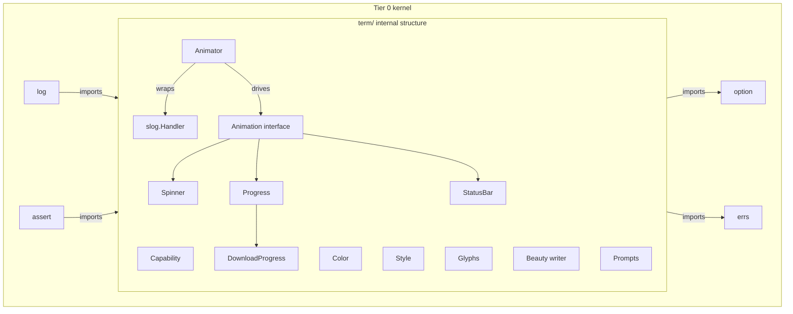

# Term

<!--
  Section headers below are STABLE ANCHORS. Magpie extracts content by header,
  so do not rename or reorder them. Doing so is a process change requiring its
  own spec.

  Sections marked **Public** are extracted by Magpie for the public site.
  Sections marked **Internal** are engineering-only and never appear in published docs.
-->

## Public Summary

<!-- **Public.** One paragraph in end-user voice. The canonical description for the site and README. -->

`term` is Glacier's terminal-as-first-class-output toolkit. It turns the TTY into a beautiful, well-behaved reporting pane without any bespoke coordination code in user programs. The package spans six facilities: capability detection (color depth, UTF-8 support, terminal dimensions, `NO_COLOR` / `GLACIER_NO_COLOR` environment conventions); 24-bit ANSI color and immutable style chaining; a glyph/icon registry with automatic ASCII fallback for non-UTF-8 terminals; beauty-writer layout primitives (boxes, center, justify, padding, truncation, word-wrap, multi-column, banners); interactive prompts (text input, password, confirm, generic-typed select and multi-select) with raw-mode discipline and panic-safe terminal restore; and the **animation coordinator** — `Animator` — that owns a `*slog.Logger`, intercepts every log record emitted while animations are running, buffers the records between frames, and flushes them above the animation area so log lines and progress bars never collide on screen. `term` is Tier 0 kernel: `log` depends on it for color rendering and TTY detection, and `assert` depends on it for failure-message color. It absorbs `internal/ttyx`, which is removed from the package tree.

## Mental Model

<!-- **Public.** The conceptual frame a developer should hold while using this. -->

Think of `term` as three concentric layers.

**Outer layer — the Animator (coordinator).** When a program needs animated output (spinners, progress bars, status panels), the `Animator` is the single orchestrating object. The developer hands it a `*slog.Logger` at construction time. The Animator wraps the logger's handler with an interception handler. During `Run`, every `slog.Info` / `slog.Error` / etc. call goes into a bounded ring buffer rather than to the writer directly. Each tick (default 100 ms) the Animator (a) moves the cursor up to erase the previous animation frame, (b) flushes all buffered log records as plain formatted lines, (c) re-renders every active animation. The result: logs and animations never interleave; they are strictly sequenced. When `Run` returns, the original handler is restored and any remaining buffered records are flushed.

**Middle layer — animations, prompts, and beauty.** Concrete animations (`Spinner`, `Progress`, `StatusBar`, `DownloadProgress`) implement the `Animation` interface (`Render() ([]string, bool)`) and are registered with the Animator via `Add`. Prompts are blocking, ctx-cancellable calls that take ownership of the terminal's raw mode for the duration of the interaction and restore cooked mode unconditionally on completion, cancellation, or panic. Beauty functions (`Box`, `Center`, `Justify`, `Pad`, `Truncate`, `Wrap`, `Columns`, `Banner`) accept plain strings and return styled strings; they are pure functions with no I/O side effects.

**Inner layer — color, style, glyphs, and capability.** `Capability(w)` probes any `io.Writer` and returns a `Capabilities` struct describing what the writer supports. `Style` is an immutable value type — every method returns a new `Style`. Color escapes are pre-computed and cached at first use. Glyphs are keyed by name; the registry returns the UTF-8 form on capable terminals and the ASCII fallback otherwise.



The DAG is strictly acyclic: `term` imports only `option` and `errs` from the Glacier module. It does NOT import `log` or `assert` — the animator takes a `*slog.Logger` parameter rather than importing `log`, and `term`'s own tests use `assert` only from `_test` packages (no production import).

## Goals

<!-- **Internal.** Bulleted list. -->

- Provide a single `term` package that replaces `internal/ttyx` and covers all six terminal-facility areas: capability detection, color/style, glyphs, beauty writer, prompts, and animation.
- Promote `term` to Tier 0 kernel so that `log` and `assert` can import it without cycle risk.
- Ship the `Animator` as the canonical mechanism for coordinated log-plus-animation output; consumers never need to write their own synchronization between slog and a progress bar.
- Provide generic-typed `Select[T]` and `MultiSelect[T]` per D36.
- Expose all spec-0001 palette tokens (including the Glacier gradient stops `Cyan100`, `Cyan300`, `Cyan500`, `Cyan700`, `Teal500`, `Teal700`) as named `Color` variables.
- Satisfy D35 performance targets: `Style.Render` ≤ 100 ns/op + 1 alloc; `Spinner.Render` ≤ 500 ns/op; `Progress.Render` ≤ 2 µs/op.
- Enforce terminal raw-mode discipline with panic-safe restore on every prompt.
- Meet the §23.9 untrusted-input register rows 25 (prompt input), 26 (glyph registration name), and 11 (slog attribute values via the animator's interception handler).
- Close at v0: surface is locked. Full-screen TUI, focus management, and rich-text widgets are deferred.

## Non-Goals

<!-- **Internal.** Bulleted list. What this spec deliberately excludes. -->

- Full-screen TUI window management (split panes, focus rings, widget hierarchies). Deferred to v0.x.
- A strip/parse function for ANSI escape sequences in arbitrary strings. Out of scope; callers own their output.
- Light-mode color token mapping. Deferred to the public-site spec (0031).
- Emoji / multi-codepoint grapheme cluster width accounting. Width calculations operate on Unicode code points; combining characters are documented as a known limitation.
- HTTP progress integration implementation. `httpc.WithProgress` lives in the `httpc` spec (0015); `term` supplies the primitive (`NewDownloadProgress`) that `httpc` consumes.
- A `Strip(s string) string` function. Not specified; not shipped.
- The Glacier SDK CLI binary. Deferred to spec 0032.

## Architecture

<!-- **Internal.** Mermaid diagram + prose. Package layout, data flow, lifecycle. -->

### File layout

```
term/
├── doc.go                  package-level doc comment
├── capability.go           Capability(), Capabilities, ColorSupport enum; caching
├── capability_unix.go      build tag !windows — isatty via golang.org/x/sys/unix
├── capability_windows.go   build tag windows  — isatty via golang.org/x/sys/windows
├── color.go                Color, RGB(), Hex(), named palette vars
├── style.go                Style (immutable), New(), Render(), Sprint(), Fprint()
├── glyph.go                GlyphInfo, Glyph(), RegisterGlyph(), Glyphs(), built-in registry
├── box.go                  Box(), BoxOption hierarchy, boxConfig, corner sets
├── layout.go               Center(), Justify(), Pad(), Truncate(), Wrap(), Columns(), Banner()
│                           ColumnOption, Alignment enum
├── prompt.go               Prompt(), Password(), Confirm(), Select[T](), MultiSelect[T]()
│                           PromptOption, ConfirmOption, SelectOption; raw-mode via build-tag files
├── prompt_unix.go          build tag !windows — termios raw-mode
├── prompt_windows.go       build tag windows  — console-mode raw-mode
├── animator.go             Animator, Handle, Animation interface, NewAnimator()
│                           interception slog.Handler, frame loop, buffer management
├── spinner.go              Spinner(), SpinnerOption, spinnerAnimation
├── progress.go             Progress, NewProgress(), ProgressOption, Render()
├── statusbar.go            StatusBar, NewStatusBar(), StatusBarOption, Render()
├── download_progress.go    DownloadProgress, NewDownloadProgress(), Read()
├── errors.go               ErrCancelled, ErrNotInteractive, ErrTimeout sentinels
│                           typed errors: HexParseError, GlyphError
└── term_test.go            shared test helpers and integration tests
```

Build-tag strategy: capability and raw-mode code is split by platform. All other files compile on all platforms. The `_unix.go` files use `//go:build !windows`; the `_windows.go` files use `//go:build windows`.

### Capability detection

`Capability(w io.Writer) Capabilities` inspects the writer at the OS level via `golang.org/x/sys`. For TTY detection it type-asserts `w` to `interface{ Fd() uintptr }` and calls the platform `isatty` helper. Color support is determined by the `COLORTERM`, `TERM`, and `WT_SESSION` environment variables using standard heuristics. UTF-8 support is true when the terminal is a TTY (conservative; non-TTY writers are assumed ASCII-only). Width and height are read via `ioctl TIOCGWINSZ` (Unix) or `GetConsoleScreenBufferInfo` (Windows). Results are cached per writer pointer (`sync.Map[io.Writer, Capabilities]`) so the second `Capability(os.Stderr)` call is zero-allocation.

### Style pre-computation and caching

`Style` is a value type (struct of flag bits + fg Color + bg Color). On first `Render`, the ANSI escape sequence is computed from the flag bits and cached in a `sync.Map` keyed by the Style value. Subsequent `Render` calls with the same Style use the cached bytes, achieving the 1-alloc target (the output string allocation is unavoidable; the escape computation is not).

### Animator frame loop

```
NewAnimator(logger, opts)
  └── wraps logger.Handler with interceptHandler
        ├── interceptHandler.Handle(record) → enqueue to ring buffer (or block up to 50ms, or drop oldest)
        └── interceptHandler.Enabled() → delegate to wrapped handler
Run(ctx)
  ├── install interceptHandler via logger.Handler = interceptHandler
  ├── launch frame goroutine:
  │     loop:
  │       sleep(refreshRate)
  │       lock animMu
  │       copy activeAnimations snapshot
  │       unlock animMu
  │       write cursor-up(N) to writer
  │       drain ring buffer → write all records to writer
  │       for each animation: call Render() → write lines
  │       N = total lines written this frame
  │       if all done or ctx.Done(): exit loop
  └── restore logger.Handler = original handler (via defer; panic-safe)
Close() error
  └── idempotent; stops frame goroutine if running; restores handler; flushes buffer; errs.Join
```

The animator never holds `animMu` during a `Render` call. It copies the active-animation slice under the lock, then releases before rendering. This satisfies NF3 (no lock held during render).

### Raw-mode terminal discipline

Prompts that require raw mode follow this invariant pattern:

```go
// acquire raw mode
oldState, err := rawModeEnter(fd)
if err != nil { return zero, err }
defer func() {
    rawModeRestore(fd, oldState) // always restores, even on panic
    if r := recover(); r != nil { panic(r) } // re-raise after restore
}()
// ... interact ...
```

The `defer` is registered before any input is read. A panic inside the prompt body causes `rawModeRestore` to run first, then the panic propagates to the caller. This satisfies NF7.

## Schema

<!-- **Internal.** Go types with invariants stated as `// invariant: ...` comments on each field. -->

```go
// Capabilities reports terminal-rendering capabilities for a given writer.
// Invariant: if IsTTY is false, SupportsColor == ColorNone and SupportsUTF8 == false.
// Invariant: Width == 0 and Height == 0 when IsTTY is false.
// Invariant: NoColorEnv == true suppresses all color regardless of SupportsColor.
type Capabilities struct {
    IsTTY         bool
    SupportsColor ColorSupport
    SupportsUTF8  bool
    Width, Height int
    // invariant: NoColorEnv is set when NO_COLOR or GLACIER_NO_COLOR is present in env.
    // GLACIER_NO_COLOR takes precedence when both are set.
    NoColorEnv bool
}

// ColorSupport is the enum of color depth levels a terminal can render.
// Invariant: values are monotonically increasing capability.
type ColorSupport int

const (
    ColorNone   ColorSupport = iota // no color; plain text only
    Color16                         // 16-color ANSI (ESC[3xm)
    Color256                        // 256-color (ESC[38;5;Nm)
    Color24Bit                      // 24-bit true color (ESC[38;2;R;G;Bm)
)

// Color holds a 24-bit RGB color value.
// Invariant: R, G, B are in [0, 255].
type Color struct {
    R, G, B uint8
}

// Style is an immutable terminal style descriptor.
// Invariant: every method returns a new Style; the receiver is unchanged.
// Invariant: zero Style (New()) renders text as plain passthrough.
// Invariant: ANSI escapes are emitted only when the target writer supports color;
//            Render on a non-color writer returns the plain text unchanged.
type Style struct {
    fg, bg   Color
    hasFG    bool
    hasBG    bool
    bold     bool
    italic   bool
    underline bool
    dim      bool
    strike   bool
}

// GlyphInfo describes one entry in the glyph registry.
// Invariant: Name matches ^[a-z][a-z0-9_]*$ and len(Name) <= 64.
// Invariant: UTF8 and ASCII are both non-empty.
type GlyphInfo struct {
    Name  string
    UTF8  string
    ASCII string
}

// Animation is the interface implemented by all animated elements.
// Render returns the lines to display for the current frame and whether the
// animation is done. Once done is true, the animator stops calling Render.
// Invariant: Render is called from a single goroutine (the frame loop) while animMu is NOT held.
// Invariant: Render must not block; it must return within one refresh interval.
type Animation interface {
    Render() (lines []string, done bool)
}

// Handle is a cancellation token returned by Animator.Add.
// Invariant: Cancel is idempotent; calling it after the animation completes naturally is a no-op.
type Handle struct {
    cancel func()
}

// animatorConfig holds the resolved options for an Animator.
// Invariant: RefreshRate > 0.
// Invariant: MaxBufferedRecords >= 1.
// Invariant: Writer is never nil.
type animatorConfig struct {
    refreshRate        time.Duration  // default 100ms
    writer             io.Writer      // default os.Stderr
    maxBufferedRecords int            // default 1000
}

// progressConfig holds options for a Progress animation.
type progressConfig struct {
    label       string
    showSpeed   bool
    showETA     bool
    showBytes   bool
    barStyle    Style
    filledGlyph string // default "█"
    emptyGlyph  string // default "░"
}

// statusBarConfig holds options for a StatusBar animation.
type statusBarConfig struct {
    layout StatusBarLayout
}

// StatusBarLayout controls how sections are arranged.
type StatusBarLayout int
const (
    StatusBarLines   StatusBarLayout = iota // one section per line
    StatusBarColumns                        // sections side-by-side in columns
)

// boxConfig holds options for Box rendering.
type boxConfig struct {
    corners     cornerSet
    borderStyle Style
    padding     [4]int // top, right, bottom, left
    title       string
    titleStyle  Style
}

// cornerSet describes the eight characters used to draw a box border.
type cornerSet struct {
    TL, TR, BL, BR string // corners
    H, V           string // horizontal/vertical edges
    TRight, TLeft  string // T-junctions (for future table use; present for completeness)
}

// Alignment controls per-column text alignment in Columns.
type Alignment int
const (
    AlignLeft   Alignment = iota
    AlignCenter
    AlignRight
)
```

### Sentinel and typed error inventory

```go
// Sentinels (via errs.Sentinel — library register format enforced).
var ErrCancelled     = errs.Sentinel("term: cancelled")
var ErrNotInteractive = errs.Sentinel("term: not interactive")
var ErrTimeout       = errs.Sentinel("term: timeout")
var ErrTooManyAttempts = errs.Sentinel("term: too many attempts")

// HexParseError is returned by Hex() when the input is not a valid hex color string.
// Invariant: Error() matches ^term: hex: .+$ (library register).
type HexParseError struct {
    Input string
    Cause error
}
func (e *HexParseError) Error() string { return "term: hex: " + e.Cause.Error() }
func (e *HexParseError) Unwrap() error { return e.Cause }

// GlyphError is returned by RegisterGlyph() for constraint violations.
// Invariant: Error() matches ^term: glyph: .+$ (library register).
type GlyphError struct {
    Name  string
    Cause string
}
func (e *GlyphError) Error() string { return "term: glyph: " + e.Cause }
```

## API

<!--
  **Public.** Every exported symbol introduced by this spec.
  Signatures are exact. Doc comments become godoc.
-->

### Capability detection

```go
// Capability probes w for terminal capabilities. Results are cached per writer
// so repeated calls are zero-allocation after the first.
//
// Preconditions: w must not be nil.
// Postconditions: returns a fully-populated Capabilities struct.
// Concurrency: goroutine-safe; cache uses sync.Map.
func Capability(w io.Writer) Capabilities
```

The `Capabilities` struct, `ColorSupport` enum, and its four constants (`ColorNone`, `Color16`, `Color256`, `Color24Bit`) are defined in the Schema section above and are public.

### Color and Style

```go
// RGB constructs a 24-bit Color from its component channels.
// Concurrency: goroutine-safe; Color is a value type.
func RGB(r, g, b uint8) Color

// Hex parses a CSS-style hex color string (with or without leading '#').
// Accepts 3-digit (#RGB) and 6-digit (#RRGGBB) forms.
// Returns HexParseError on invalid input.
//
// Examples: "#22D3EE", "22D3EE", "#fff", "fff".
func Hex(s string) (Color, error)

// Spec-0001 palette tokens. Package-level vars, not constants, because Color
// is a struct; they are initialized at package init and never mutated.
var (
    // Core palette
    Cyan     Color // #22D3EE
    Teal     Color // #2DD4BF
    Bg       Color // #0F172A
    Surface  Color // #1E293B
    Surface2 Color // #334155
    Text     Color // #F1F5F9
    TextMuted Color // #94A3B8
    TextFaint Color // #64748B

    // Semantic
    Success Color // #4ADE80
    Warning Color // #FACC15
    Error   Color // #F87171
    Info    Color // #60A5FA
    Border  Color // #334155

    // Gradient stops (Glacier brand — D42)
    Cyan100 Color // #CFFAFE
    Cyan300 Color // #67E8F9
    Cyan500 Color // #06B6D4
    Cyan700 Color // #0E7490
    Teal500 Color // #14B8A6
    Teal700 Color // #0F766E
)

// New returns a zero Style with no decorations. Render on a zero Style returns
// the input text unchanged.
// Concurrency: goroutine-safe; Style is a value type.
func New() Style

// Foreground returns a new Style with the foreground color set to c.
func (s Style) Foreground(c Color) Style

// Background returns a new Style with the background color set to c.
func (s Style) Background(c Color) Style

// Bold returns a new Style with bold enabled.
func (s Style) Bold() Style

// Italic returns a new Style with italic enabled.
func (s Style) Italic() Style

// Underline returns a new Style with underline enabled.
func (s Style) Underline() Style

// Dim returns a new Style with dim (faint) enabled.
func (s Style) Dim() Style

// Strike returns a new Style with strikethrough enabled.
func (s Style) Strike() Style

// Render returns text wrapped in the ANSI escape sequences for this style,
// followed by the reset sequence ESC[0m.
//
// If the writer associated with the call-site context (via Fprint) or the
// package-level default writer (via Sprint/Render) does not support color,
// Render returns text unchanged, with no escapes.
//
// Performance: ANSI escape sequences are pre-computed at first use and cached.
// Target: ≤ 100 ns/op + 1 alloc (the output string) per §23.13.
//
// Concurrency: goroutine-safe; cache uses sync.Map.
func (s Style) Render(text string) string

// Sprint is a convenience wrapper equivalent to s.Render(text).
// Uses the package-level default writer for capability detection.
func Sprint(s Style, text string) string

// Fprint writes s.Render(text) to w. Capability is detected from w.
func Fprint(w io.Writer, s Style, text string)
```

### Glyphs

```go
// Glyph returns the registered glyph's UTF-8 form if the active output writer
// supports UTF-8, otherwise its ASCII fallback.
//
// If name is not in the registry, Glyph returns "" and emits a debug-level log
// warning to the package-internal logger (set via WithLogger on the animator,
// or slog.Default() otherwise).
//
// Concurrency: goroutine-safe; registry uses sync.RWMutex.
func Glyph(name string) string

// RegisterGlyph adds a custom glyph to the registry.
//
// Preconditions:
//   - name must match ^[a-z][a-z0-9_]*$ and be ≤ 64 bytes (§23.9 #26).
//   - utf8 and ascii must both be non-empty.
//   - name must not already be registered.
//
// Returns GlyphError on any violation.
// Concurrency: goroutine-safe.
func RegisterGlyph(name, utf8, ascii string) error

// Glyphs returns a snapshot of all registered glyphs (built-in + custom).
// The returned slice is a copy; mutations do not affect the registry.
// Concurrency: goroutine-safe.
func Glyphs() []GlyphInfo
```

#### Built-in glyph registry

The following ~30 glyphs are pre-registered at package init:

| Name | UTF-8 | ASCII |
|------|-------|-------|
| `check` | `✓` | `[OK]` |
| `cross` | `✗` | `[X]` |
| `warn` | `⚠` | `[!]` |
| `info` | `ℹ` | `[i]` |
| `bullet` | `•` | `*` |
| `dot` | `·` | `.` |
| `arrow_right` | `→` | `->` |
| `arrow_left` | `←` | `<-` |
| `arrow_up` | `↑` | `^` |
| `arrow_down` | `↓` | `v` |
| `ellipsis` | `…` | `...` |
| `spinner_braille_0` | `⠋` | `-` |
| `spinner_braille_1` | `⠙` | `\` |
| `spinner_braille_2` | `⠹` | `|` |
| `spinner_braille_3` | `⠸` | `/` |
| `spinner_braille_4` | `⠼` | `-` |
| `spinner_braille_5` | `⠴` | `\` |
| `spinner_braille_6` | `⠦` | `|` |
| `spinner_braille_7` | `⠇` | `/` |
| `spinner_dots_0` | `⣾` | `-` |
| `spinner_dots_1` | `⣽` | `\` |
| `spinner_dots_2` | `⣻` | `|` |
| `spinner_dots_3` | `⢿` | `/` |
| `spinner_dots_4` | `⡿` | `-` |
| `spinner_dots_5` | `⣟` | `\` |
| `spinner_dots_6` | `⣯` | `|` |
| `spinner_dots_7` | `⣷` | `/` |
| `box_horizontal` | `─` | `-` |
| `box_vertical` | `│` | `|` |
| `pipe` | `│` | `|` |
| `divider` | `━` | `=` |

### Beauty writer

```go
// Box renders text inside a Unicode box border.
//
// Default: rounded corners, no padding, no title, no border style.
// Content lines that exceed the terminal width are pre-wrapped via Wrap before boxing.
// On non-UTF-8 writers, ASCII border characters are used automatically.
// Concurrency: pure function; goroutine-safe.
func Box(text string, opts ...BoxOption) string

// BoxOption configures Box rendering.
type BoxOption interface{ applyBox(*boxConfig) error }

// WithRoundedCorners selects ╭╮╰╯ corner characters (default).
func WithRoundedCorners() BoxOption

// WithSharpCorners selects ┌┐└┘ corner characters.
func WithSharpCorners() BoxOption

// WithDoubleBorders selects ╔╗╚╝ / ═║ border characters.
func WithDoubleBorders() BoxOption

// WithBorderStyle applies s to the box border characters.
func WithBorderStyle(s Style) BoxOption

// WithPadding adds whitespace inside the box (top, right, bottom, left cell counts).
func WithPadding(top, right, bottom, left int) BoxOption

// WithTitle places title in the top-border line, formatted as "─ title ─".
// If title exceeds box width, it is truncated with the ellipsis glyph.
func WithTitle(s string) BoxOption

// WithTitleStyle applies s to the title text within the border.
func WithTitleStyle(s Style) BoxOption

// Center center-pads each line of text to width.
// If a line exceeds width, it is returned unchanged.
// Rounding: for odd remainders, the right side gets the extra space.
// Concurrency: pure function; goroutine-safe.
func Center(text string, width int) string

// Justify block-justifies each line of text to width by distributing extra
// spaces between words. Lines shorter than two words are left-aligned.
// Concurrency: pure function; goroutine-safe.
func Justify(text string, width int) string

// Pad adds leftN space characters to the left and rightN to the right of each
// line of text.
// Concurrency: pure function; goroutine-safe.
func Pad(text string, leftN, rightN int) string

// Truncate shortens each line of text that exceeds width by replacing the
// excess with ellipsis. If ellipsis is empty, the Unicode glyph "ellipsis" is
// used on UTF-8 writers, and "..." on ASCII-only writers.
// Width is measured in Unicode code points (not bytes; not grapheme clusters).
// Concurrency: pure function; goroutine-safe.
func Truncate(text string, width int, ellipsis string) string

// Wrap soft-wraps text at word boundaries so no line exceeds width code points.
// Long words that individually exceed width are broken mid-word.
// Preserves existing newlines.
// Concurrency: pure function; goroutine-safe.
func Wrap(text string, width int) string

// ColumnOption configures Columns rendering.
type ColumnOption interface{ applyColumn(*columnConfig) error }

// WithColumnGap sets the number of space characters between columns (default 2).
func WithColumnGap(n int) ColumnOption

// WithColumnAlignment sets the alignment for column idx (0-based).
// Unset columns default to AlignLeft.
func WithColumnAlignment(idx int, alignment Alignment) ColumnOption

// Columns renders a 2-D grid of strings as evenly-spaced columns.
// Column widths are computed automatically to fit the terminal width;
// columns are constrained to a minimum of 1 character wide.
// Concurrency: pure function; goroutine-safe.
func Columns(rows [][]string, opts ...ColumnOption) string

// Banner renders lines in a consistent style, used by cli for the Glacier
// wordmark and ASCII-art bear kaomoji.
// Concurrency: pure function; goroutine-safe.
func Banner(s Style, lines ...string) string
```

### Prompts

```go
// PromptOption configures Prompt behavior.
type PromptOption interface{ applyPrompt(*promptConfig) error }

// WithDefault sets the value returned when the user submits an empty input.
func WithDefault(s string) PromptOption

// WithValidator registers fn as the input validator. If fn returns non-nil
// the prompt is re-displayed with the error message; attempts are counted
// against WithMaxAttempts.
func WithValidator(fn func(string) error) PromptOption

// WithMaxAttempts limits the number of invalid-input retries.
// When exhausted, Prompt returns ErrTooManyAttempts.
// Default: unlimited.
func WithMaxAttempts(n int) PromptOption

// WithTimeout sets a per-prompt deadline. Exceeded deadline returns ErrTimeout.
func WithTimeout(d time.Duration) PromptOption

// ConfirmOption configures Confirm behavior.
type ConfirmOption interface{ applyConfirm(*confirmConfig) error }

// WithDefaultYes makes the empty-input response "yes". Default is "no".
func WithDefaultYes() ConfirmOption

// SelectOption configures Select and MultiSelect behavior.
type SelectOption interface{ applySelect(*selectConfig) error }

// Prompt displays question on the terminal, reads a single line of input,
// trims trailing whitespace, and returns it.
//
// If the writer is not a TTY (piped stdin), reads from stdin without entering
// raw mode; returns ErrNotInteractive if the prompt requires interactivity.
//
// Input constraints (§23.9 #25):
//   - Lines are capped at 4 KiB. Input exceeding this limit returns an error.
//   - NUL bytes and non-printable control characters except backspace (0x08)
//     and arrow-key escape sequences are rejected.
//
// Preconditions: ctx must not be nil; question must not be empty.
// Error contract:
//   - ErrCancelled if ctx is cancelled or the user sends EOF/Ctrl-C.
//   - ErrTimeout if WithTimeout is set and expires.
//   - ErrTooManyAttempts if WithMaxAttempts is set and exhausted.
//
// Terminal restore: raw mode is released unconditionally via defer; panic-safe.
// Concurrency: blocking; not goroutine-safe (owns the terminal).
func Prompt(ctx context.Context, question string, opts ...PromptOption) (string, error)

// Password displays question and reads input with echo disabled.
// The typed characters are never written to the terminal.
//
// All constraints from Prompt apply except the line cap is still 4 KiB.
// Returns ErrCancelled on ctx cancellation.
//
// Terminal restore: cooked mode restored unconditionally via defer; panic-safe.
// Concurrency: blocking; not goroutine-safe (owns the terminal).
func Password(ctx context.Context, question string) (string, error)

// Confirm displays question with a Y/N prompt and returns the boolean answer.
//
// Accepted affirmative inputs (case-insensitive): "y", "yes".
// Accepted negative inputs: "n", "no".
// Invalid input causes re-prompt; after three invalid attempts returns ErrTooManyAttempts.
//
// Error contract: same as Prompt. Default is No unless WithDefaultYes() is set.
// Concurrency: blocking; not goroutine-safe (owns the terminal).
func Confirm(ctx context.Context, question string, opts ...ConfirmOption) (bool, error)

// Select displays a numbered or arrow-navigable list of options and returns
// the one selected by the user. T is the element type; render converts T to a
// display string shown in the list.
//
// Preconditions: options must not be empty.
// Returns ErrCancelled if ctx is cancelled or EOF/Ctrl-C received.
// Returns ErrNotInteractive if the writer is not a TTY.
// Concurrency: blocking; not goroutine-safe (owns the terminal).
func Select[T any](ctx context.Context, question string, options []T, render func(T) string, opts ...SelectOption) (T, error)

// MultiSelect displays a checkable list of options and returns all selected.
// Space toggles selection; Enter confirms. Returns an empty slice if none selected.
//
// Same error contract as Select.
// Concurrency: blocking; not goroutine-safe (owns the terminal).
func MultiSelect[T any](ctx context.Context, question string, options []T, render func(T) string, opts ...SelectOption) ([]T, error)
```

### Animation coordinator

```go
// AnimatorOption configures an Animator.
type AnimatorOption interface{ applyAnimator(*animatorConfig) error }

// WithRefreshRate sets the frame interval (default 100ms).
// Precondition: d > 0.
func WithRefreshRate(d time.Duration) AnimatorOption

// WithWriter directs animation output to w (default os.Stderr).
// Precondition: w must not be nil.
func WithWriter(w io.Writer) AnimatorOption

// WithMaxBufferedRecords sets the ring-buffer capacity for intercepted slog
// records (default 1000). When the buffer is full, new writes block up to
// 50ms; if still full, the oldest record is dropped and a warning is emitted
// on the next frame. Precondition: n >= 1.
func WithMaxBufferedRecords(n int) AnimatorOption

// Animation is the interface for all animated elements.
// Render returns the lines to display this frame and whether the animation is
// finished. Once done is true, the animator removes this animation from the
// active set. Render must not block; it is called from the frame goroutine.
type Animation interface {
    Render() (lines []string, done bool)
}

// Handle is the cancellation token returned by Animator.Add.
type Handle struct{ /* unexported fields */ }

// Cancel removes the associated animation from the active set.
// Idempotent; safe to call after the animation completes naturally.
// Concurrency: goroutine-safe.
func (h Handle) Cancel()

// Animator coordinates animated terminal output and slog log buffering.
// It wraps a *slog.Logger's handler with an interception handler that buffers
// log records during animation frames and flushes them above the animation
// area between frames, preventing log lines and animations from colliding.
type Animator struct{ /* unexported fields */ }

// NewAnimator constructs an Animator bound to logger.
//
// At construction, the logger's handler is NOT yet replaced; interception
// begins when Run is called.
//
// Preconditions: logger must not be nil.
// Concurrency: construction is not goroutine-safe; Run is.
func NewAnimator(logger *slog.Logger, opts ...AnimatorOption) *Animator

// Add registers a into the active animation set.
// May be called before or during Run.
//
// If the same Animation value is added twice, both registrations are active.
// Returns a Handle whose Cancel removes this specific registration.
// Concurrency: goroutine-safe.
func (a *Animator) Add(anim Animation) Handle

// Run starts the frame loop. It blocks until ctx is cancelled or all
// registered animations report done.
//
// Frame contract (per NF3, F36):
//  1. Sleep refreshRate.
//  2. Copy active-animation slice under lock; release lock.
//  3. Write ANSI cursor-up(N) to clear the previous frame (N = last frame's line count).
//  4. Drain the slog ring buffer: write all records to the writer.
//  5. Call Render() on each animation; write the returned lines.
//  6. N = total lines written.
//
// On return:
//  - The original logger handler is restored (via defer; panic-safe).
//  - Any remaining buffered records are flushed to the writer.
//  - If an animation's Render panics, Run recovers, restores the handler,
//    and returns the wrapped panic value as an error.
//  - If ctx is cancelled, returns ErrCancelled (wrapping ctx.Err()).
//  - If called a second time while already running, returns an error
//    "term: animator: already running".
//
// Concurrency: Run may be called from one goroutine; Add/Cancel/Pause/Resume
// may be called concurrently from any goroutine.
func (a *Animator) Run(ctx context.Context) error

// Pause suspends frame rendering. Log records continue to be buffered.
// While paused, buffered records are flushed inline (not coordinate with frames).
// Idempotent.
// Concurrency: goroutine-safe.
func (a *Animator) Pause()

// Resume restarts frame rendering after Pause. Idempotent.
// Concurrency: goroutine-safe.
func (a *Animator) Resume()

// Close stops the frame loop (if running), restores the logger handler, and
// flushes any remaining buffered records. Idempotent: the second call returns nil.
// Uses errs.Join for any accumulated sub-errors.
// Implements io.Closer.
// Concurrency: goroutine-safe.
func (a *Animator) Close() error
```

### Built-in animations

```go
// SpinnerOption configures a Spinner animation.
type SpinnerOption interface{ applySpinner(*spinnerConfig) error }

// WithSpinnerStyle applies s to the spinning glyph character.
func WithSpinnerStyle(s Style) SpinnerOption

// WithSpinnerFrames overrides the default braille-spinner frame sequence.
// Precondition: frames must not be empty.
func WithSpinnerFrames(frames []string) SpinnerOption

// Spinner returns an Animation that cycles through spinner glyphs at each frame.
// Default frames: spinner_braille_0 through spinner_braille_7 (8 frames).
// The label is rendered after the glyph on the same line.
//
// Performance target: ≤ 500 ns/op per frame per §23.13.
func Spinner(label string, opts ...SpinnerOption) Animation

// ProgressOption configures a Progress animation.
type ProgressOption interface{ applyProgress(*progressConfig) error }

// WithProgressLabel sets the descriptive label rendered after the bar.
func WithProgressLabel(s string) ProgressOption

// WithProgressShowSpeed enables bytes/sec or items/sec display.
// Speed is computed from a sliding 5-second window of increment events.
func WithProgressShowSpeed() ProgressOption

// WithProgressShowETA enables estimated-time-remaining display.
// ETA is computed from current speed and remaining bytes.
// Displays "ETA --" when speed is zero.
func WithProgressShowETA() ProgressOption

// WithProgressShowBytes enables "3.2 MB / 4.8 MB" byte-count display.
// Uses 1024-based SI prefixes (KiB, MiB, GiB).
func WithProgressShowBytes() ProgressOption

// WithProgressBarStyle applies s to the filled portion of the progress bar.
func WithProgressBarStyle(s Style) ProgressOption

// WithProgressGlyph sets the filled (default "█") and empty (default "░") glyphs.
func WithProgressGlyph(filled, empty string) ProgressOption

// Progress is a progress-bar animation. Thread-safe.
//
// Invariant: current is clamped to [0, total] for percentage display;
// values outside the range are accepted and render >100% or <0% visually.
// Invariant: total == -1 signals indeterminate mode (spinner-style bar + byte counter).
type Progress struct{ /* unexported fields */ }

// NewProgress constructs a Progress with the given total byte/item count.
// total == -1 for indeterminate (unknown total) mode.
func NewProgress(total int64, opts ...ProgressOption) *Progress

// Set sets the current progress to n. Goroutine-safe (atomic).
// Negative values are accepted and render as-is (see Invariant above).
func (p *Progress) Set(n int64)

// Increment adds n to the current progress. Goroutine-safe (atomic).
func (p *Progress) Increment(n int64)

// Done marks the progress as complete. Subsequent Render calls return done=true.
// Goroutine-safe. Idempotent.
func (p *Progress) Done()

// Render implements Animation. Returns a single line formatted as:
//   [████████░░░░] 67%  3.2 MiB/4.8 MiB  1.2 MiB/s  ETA 4s  Downloading data
// Width auto-fits the terminal; columns are omitted when opts are not set.
// Performance target: ≤ 2 µs/op per §23.13.
func (p *Progress) Render() ([]string, bool)

// StatusBarOption configures a StatusBar animation.
type StatusBarOption interface{ applyStatusBar(*statusBarConfig) error }

// WithStatusBarLayout controls whether sections render on separate lines
// (StatusBarLines, default) or side-by-side in columns (StatusBarColumns).
func WithStatusBarLayout(l StatusBarLayout) StatusBarOption

// StatusBar is a multi-section status display. Sections are keyed by name.
// Thread-safe.
type StatusBar struct{ /* unexported fields */ }

// NewStatusBar constructs an empty StatusBar.
func NewStatusBar(opts ...StatusBarOption) *StatusBar

// SetSection adds or replaces section name with content.
// Goroutine-safe.
func (s *StatusBar) SetSection(name, content string)

// Remove deletes section name. No-op if name is not present.
// Goroutine-safe.
func (s *StatusBar) Remove(name string)

// Render implements Animation. Returns one line per section (StatusBarLines)
// or a single row of columns (StatusBarColumns). Returns done=false always;
// StatusBar is closed by the caller via its Handle.
func (s *StatusBar) Render() ([]string, bool)

// Close stops the StatusBar's render participation and releases resources.
// Idempotent. Implements io.Closer.
// Concurrency: goroutine-safe.
func (s *StatusBar) Close() error

// DownloadProgress wraps an io.Reader, updating an embedded *Progress as bytes
// are read. It is intended for use with httpc.WithProgress and analogous callers.
type DownloadProgress struct {
    *Progress
    Source io.Reader // invariant: non-nil
}

// NewDownloadProgress wraps r with a DownloadProgress backed by a Progress
// configured with total = contentLength. Pass contentLength = -1 for unknown length
// (indeterminate mode).
func NewDownloadProgress(r io.Reader, contentLength int64, label string, opts ...ProgressOption) *DownloadProgress

// Read implements io.Reader. Transparent to callers: reads from Source, then
// calls p.Increment(n) with the byte count. Updates speed and ETA sliding window.
// Goroutine-safe.
func (d *DownloadProgress) Read(p []byte) (int, error)
```

## Examples

<!-- **Public.** Runnable Go examples in fenced ```go blocks. -->

### Spec-0001 palette in action

```go
package term_test

import (
    "fmt"

    "github.com/nathanbrophy/glacier/term"
)

func ExampleStyle() {
    warn := term.New().Foreground(term.Warning).Bold()
    info := term.New().Foreground(term.Cyan)

    fmt.Println(warn.Render("config file missing"))
    fmt.Println(info.Render("using defaults"))

    // One-liner convenience form:
    fmt.Println(term.Sprint(warn, "config file missing"))
    // Output:
    // (ANSI-escaped output; exact bytes depend on terminal support)
}
```

### Glyphs with ASCII fallback

```go
package term_test

import (
    "log/slog"

    "github.com/nathanbrophy/glacier/term"
)

func ExampleGlyph() {
    // On a UTF-8 terminal:  status=✓
    // On ASCII-only output: status=[OK]
    slog.Info("operation succeeded", "status", term.Glyph("check"))

    // Custom glyph registration (e.g., at init time):
    if err := term.RegisterGlyph("rocket", "🚀", "[>>]"); err != nil {
        slog.Error("glyph already registered", "err", err)
    }
}
```

### Boxed warning

```go
package term_test

import (
    "fmt"

    "github.com/nathanbrophy/glacier/term"
)

func ExampleBox() {
    box := term.Box(
        "Configuration validation failed.\nPort 8080 already in use.",
        term.WithTitle("WARNING"),
        term.WithTitleStyle(term.New().Foreground(term.Warning).Bold()),
        term.WithBorderStyle(term.New().Foreground(term.Warning)),
        term.WithRoundedCorners(),
        term.WithPadding(1, 2, 1, 2),
    )
    fmt.Println(box)
    // Output:
    // ╭─ WARNING ─────────────────────────────╮
    // │                                       │
    // │  Configuration validation failed.     │
    // │  Port 8080 already in use.            │
    // │                                       │
    // ╰───────────────────────────────────────╯
}
```

### Prompt and Confirm

```go
package term_test

import (
    "context"
    "errors"
    "fmt"

    "github.com/nathanbrophy/glacier/term"
)

func ExamplePrompt() {
    ctx := context.Background()

    name, err := term.Prompt(ctx, "Project name?",
        term.WithDefault("my-glacier-app"),
        term.WithValidator(func(s string) error {
            if len(s) == 0 {
                return errors.New("name must not be empty")
            }
            return nil
        }),
    )
    if err != nil {
        fmt.Println("cancelled:", err)
        return
    }

    ok, err := term.Confirm(ctx, "Apply changes?")
    if err != nil {
        fmt.Println("cancelled:", err)
        return
    }

    if ok {
        fmt.Println("creating project:", name)
    }
}
```

### Animator with log coordination and Progress

```go
package term_test

import (
    "context"
    "log/slog"

    "github.com/nathanbrophy/glacier/log"
    "github.com/nathanbrophy/glacier/term"
)

func ExampleAnimator() {
    ctx, cancel := context.WithCancel(context.Background())
    defer cancel()

    // Animator wraps the logger. Log writes during Run are buffered and
    // flushed above the animation area between frames.
    a := term.NewAnimator(log.Default(),
        term.WithRefreshRate(80*1_000_000), // 80ms
    )

    prog := term.NewProgress(1024*1024*100,
        term.WithProgressLabel("Downloading corpus"),
        term.WithProgressShowSpeed(),
        term.WithProgressShowETA(),
        term.WithProgressShowBytes(),
    )
    a.Add(prog)

    go func() {
        // Simulate incremental work; these log calls are buffered by the animator.
        for i := 0; i < 10; i++ {
            prog.Increment(1024 * 1024 * 10)
            slog.Info("chunk received", "chunk", i+1)
        }
        prog.Done()
    }()

    // Run blocks until all animations are done or ctx is cancelled.
    if err := a.Run(ctx); err != nil {
        slog.Error("animation error", "err", err)
    }
}
```

### httpc download progress integration scenario

```go
package term_test

import (
    "context"

    "github.com/nathanbrophy/glacier/httpc"
    "github.com/nathanbrophy/glacier/term"
)

func ExampleDownloadProgress_httpc() {
    ctx := context.Background()

    // httpc.WithProgress wraps the response body with term.NewDownloadProgress
    // and registers it with a shared *term.Animator. The bar animates while
    // the body is read. Log lines emitted during the request appear above the bar.
    data, _, err := httpc.Get[[]byte](ctx, "https://api.example.com/dataset.bin",
        httpc.WithProgress("Downloading dataset",
            term.WithProgressShowSpeed(),
            term.WithProgressShowETA(),
            term.WithProgressShowBytes(),
        ),
    )
    _ = data
    _ = err
}
```

### Multi-section StatusBar

```go
package term_test

import (
    "context"
    "fmt"
    "time"

    "github.com/nathanbrophy/glacier/log"
    "github.com/nathanbrophy/glacier/term"
)

func ExampleStatusBar() {
    ctx, cancel := context.WithTimeout(context.Background(), 5*time.Second)
    defer cancel()

    a := term.NewAnimator(log.Default())

    bar := term.NewStatusBar()
    a.Add(bar)

    go func() {
        for i := 1; i <= 5; i++ {
            bar.SetSection("phase", fmt.Sprintf("Stage %d of 5", i))
            bar.SetSection("rate",  "120K records/s")
            time.Sleep(time.Second)
        }
        bar.Close()
    }()

    a.Run(ctx)
}
```

## Test Matrix

<!-- **Internal.** Owned by Lynx. -->

The canonical test matrix for `term/` lives in `specs/test-matrices/kernel.md § Package: term/`. It contains 174 numbered rows covering capability detection (rows 1–14), color (15–21), style (22–33), glyphs (34–46), beauty writer (47–67), prompts (68–87), animator (88–110), built-in animations (111–133), lifecycle Close (134–140), cross-platform (141–148), error sentinels (149–152), property-based (153–158), and benchmarks (159–166), plus API surface snapshot and examples (167–174). The cross-package integration tests K1–K15 are also specified there.

The abbreviated matrix below calls out the rows directly relevant to the term/ spec surface; implementers must satisfy all 174 rows.

| # | Name | Spec ref | Type | Description | Test helpers used |
|---|------|----------|------|-------------|-------------------|
| 1 | TestCapabilityIODiscard | F1, E1 | unit | `Capability(io.Discard)` → IsTTY=false, ColorNone, w/h=0 | `assert.Equal` |
| 2 | TestCapabilityBytesBuffer | F1 | unit | bytes.Buffer → non-TTY, ColorNone | `assert.Equal` |
| 3 | TestCapabilityRealTTYUnix | F1 | unit (!windows) | PTY pair → IsTTY=true, color detected | `fixture.NewPTY` |
| 5 | TestCapabilityCOLORTERMTruecolor | F2, T1 | unit | COLORTERM=truecolor → Color24Bit | `t.Setenv` |
| 10 | TestCapabilityNoColor | F3, T2 | unit | NO_COLOR=1 → NoColorEnv=true, color suppressed | `t.Setenv` |
| 11 | TestCapabilityGlacierNoColor | F3, T3 | unit | GLACIER_NO_COLOR=1 → suppressed | `t.Setenv` |
| 13 | TestCapabilityCachedPerWriter | NF6 | bench | Second Capability(w) call → zero alloc | `testing.AllocsPerRun` |
| 16 | TestHexConstructorValid | F4 | unit | `Hex("#22D3EE")` → Color matching Cyan | `assert.NoError`, `assert.Equal` |
| 18 | TestHexConstructorInvalid | F4 | unit | `Hex("not-a-color")` → HexParseError | `assert.ErrorContains "term: hex:"` |
| 20 | TestNamedColorsMatchSpec0001 | F5 | unit | Cyan, Teal, etc. match spec-0001 hex codes | `assert.Equal` |
| 22 | TestStyleNewIsZero | F6 | unit | `New()` → Render = passthrough | `assert.Equal` |
| 27 | TestStyleImmutability | F6 | unit | `s := New().Bold(); s2 := s.Italic()` → s unchanged | `assert.NotEqual` |
| 28 | TestStyleRenderNoColorWriter | F7, E2 | unit | Non-color writer → plain text | `assert.NotContains "\x1b["` |
| 32 | TestStyleEscapesPrecomputedCached | F9, NF1 | bench | 2nd Render → 0 alloc | `testing.AllocsPerRun == 0` |
| 39 | TestRegisterGlyphSuccess | F12 | unit | `RegisterGlyph("custom", "🎯", "[*]")` → nil; lookup works | `assert.NoError`, `assert.Equal` |
| 40 | TestRegisterGlyphDuplicate | F12, E4 | unit | Re-register → GlyphError | `assert.ErrorContains "term: glyph:"` |
| 41 | TestRegisterGlyphInvalidName | §23.9 #26 | unit | Name not matching allowlist regex → GlyphError | `assert.Error` |
| 43 | FuzzGlyphRegistration | F12; §23.9 #26 | fuzz | Random names → never panics; only valid succeed | `testing.F` |
| 47 | TestBoxRoundedCorners | F14, T6 | unit | Box with rounded corners renders ╭╮╰╯ (or ASCII) | `fixture.Golden` |
| 55 | TestBoxWidthExceedsTerminal | E5 | unit | Content > terminal width → wrapped before boxing | `assert.LessOrEqual` |
| 68 | TestPromptDefault | F22, T9 | unit (PTY) | Empty input + WithDefault("foo") → "foo" | `fixture.NewPTY`, send "\n" |
| 72 | TestPromptCtxCancel | E7, T13 | unit (PTY) | ctx cancelled mid-input → ErrCancelled; terminal restored | `assert.ErrorIs` |
| 84 | TestPromptInjectionRejectsControlChars | §23.9 #25 | unit (PTY) | ANSI escape in input → rejected | PTY send |
| 85 | TestPromptLineCap4KiB | §23.9 #25 | unit (PTY) | Input > 4 KiB → error | PTY |
| 86 | TestPromptRawModeRestoredOnPanic | NF7 | unit (PTY) | Panic inside prompt → cooked mode restored | PTY state check |
| 87 | FuzzAnsiInjection | NF7; §23.9 #25 | fuzz | Random prompt input → never raw ANSI in result | `testing.F` |
| 88 | TestNewAnimatorWrapsHandler | F31 | unit | Animator wraps logger handler at Run | reflect, `assert.NotEqual` |
| 93 | TestAnimatorBuffersLogsDuringFrame | F36, T14 | unit | Logs during Render are buffered | buffer + `assert.Equal` |
| 95 | TestAnimatorBackpressureDropsOldest | NF4, E8, T16 | unit | Buffer at cap → oldest dropped; warning emitted | `assert.Contains "records dropped"` |
| 97 | TestAnimatorRestoresHandlerOnExit | F34, T17 | unit | After Run: original handler restored | `assert.Equal` (pointer) |
| 106 | TestAnimatorConcurrentLogWrites | NF3, NF5; §23.14 | race | 100 goroutines log during Run; no torn writes | `sync.WaitGroup` |
| 134 | TestAnimatorCloseIdempotent | §23.16 | unit | Close() twice → no panic, second is no-op | `assert.NoError` |
| 136 | TestAnimatorCloseDuringRun | §23.16 | unit | Close while Run active → cancels, restores | handler check |
| 141 | TestCapabilityLinux | NF8 | cross-platform (linux) | Linux isatty path | `golang.org/x/sys/unix` |
| 143 | TestCapabilityWindows | NF8 | cross-platform (windows) | Windows console handle path | `golang.org/x/sys/windows` |
| 159 | BenchmarkStyleRender | NF1 | bench | ≤ 100 ns/op + 1 alloc | benchstat |
| 161 | BenchmarkSpinnerFrame | NF1 | bench | ≤ 500 ns/op | benchstat |
| 162 | BenchmarkProgressFrame | NF1 | bench | ≤ 2 µs/op | benchstat |
| 167 | TestSurfaceClosed_TermPackage | NF12 | unit | API snapshot — every PascalCase export listed | `fixture.Golden` |

Full coverage targets (from `specs/test-matrices/kernel.md`):
- Line coverage: ≥ 92% per platform (union of all platform builds: 100%)
- Branch coverage: ≥ 90%
- Public-API coverage: 100% (~60+ exported symbols)
- Animator concurrency paths: 100% (blocking for release)

Edge cases not yet in the canonical matrix but Lynx-flagged for inclusion:
- **L-add-1:** `RegisterGlyph` with empty UTF-8 or empty ASCII → GlyphError.
- **L-add-2:** `Box` title longer than box width → truncated with ellipsis.
- **L-add-3:** `Wrap` on text containing ANSI escapes → rune counting skips escape bytes.
- **L-add-4:** Combining characters (é = e+combining-accent) in beauty functions → width limitation documented.
- **L-add-5:** `Animator.Run` invoked while already running → returns "term: animator: already running".
- **L-add-6:** Animation whose `Render` returns lines with embedded newlines → line counting correct.
- **L-add-7:** Animator with closed TTY (ssh disconnect mid-run) → write errors handled; Run returns wrapped error.
- **L-add-8:** `Progress.Set(negative)` → accepted; renders negative percentage.
- **L-add-9:** `DownloadProgress.Read` after `Done()` → continues reading (Done signals display; Read is transparent).
- **L-add-10:** `Capability(w)` cache is per-pointer; `os.Stdout` reassignment not tracked. Documented.
- **L-add-11:** Rapid keystrokes overflowing 4 KiB prompt buffer → error returned cleanly.
- **L-add-12:** ANSI escape in `Style.Render(userInput)` → user bytes emitted verbatim between style escape and reset. Documented security note.
- **L-add-13:** Double-wrapping: supplied logger is already an animator's logger → returns error "term: animator: handler already intercepted".
- **L-add-14:** `Banner` with single-line input → degrades gracefully to one styled line.
- **L-add-15:** Glyph registry snapshot semantics for `Glyphs()` iterator — documented as point-in-time snapshot.

## Dependency Justification

<!-- **Internal.** Owned by Falcon. -->

| Module | Version | License | Last release | Maintainers | Alternatives considered | Why we can't roll our own |
|---|---|---|---|---|---|---|
| `golang.org/x/sys` | pinned (see go.mod) | BSD-3-Clause | Active (Go-team maintained; releases align with Go toolchain) | Google / Go team (multi-maintainer) | Pure-stdlib `syscall` package | `syscall` is deprecated for new code; `golang.org/x/sys` provides `unix.IoctlGetTermios`, `unix.TIOCGWINSZ`, `windows.GetConsoleMode`, `windows.GetConsoleScreenBufferInfo`, and the full set of Windows console-mode constants needed for raw-mode prompts and TTY detection. Implementing these from `unsafe` + constant literals would be ≈500 lines of platform-specific code that the Go team already maintains and tests. Pre-approved in spec 0002 §23.3. No new dependency beyond what the framework already includes. |

Answers to the six required questions (CLAUDE.md `## Adding a dependency`):

1. **What does this give us that we can't write in < 100 lines ourselves?** Platform-specific syscall wrappers for terminal raw-mode and TTY detection on all three target platforms (Linux, macOS, Windows). The Windows path alone requires `GetConsoleMode`, `SetConsoleMode`, `GetConsoleScreenBufferInfo`, and `GetStdHandle` with their DWORD constants, all of which are in `golang.org/x/sys/windows`. The Unix path requires `IoctlGetTermios`, `IoctlSetTermios`, `TIOCGWINSZ`, and POSIX termios struct definitions. Rolling these in-tree would duplicate ≈ 500 lines of Go-team-maintained code and re-introduce the maintenance burden of cross-platform constant drift.
2. **License compatible?** BSD-3-Clause. Yes.
3. **Last release date?** Active; releases track the Go toolchain. Well within the 18-month staleness threshold.
4. **Maintainer count?** Google / Go team. Multi-maintainer. Not single-maintainer risk.
5. **Vulnerability scan clean?** Yes. Confirmed at spec authoring date 2026-05-01. CI `vuln-scan` job (govulncheck) enforces ongoing.
6. **Pinned to a specific version?** Yes. Pinned in `go.mod` to a named release tag, not `latest` or a pseudo-version. `mod-hygiene` CI job enforces.

## Security & Supply-Chain Notes

<!-- **Internal.** -->

### Untrusted-input register rows (§23.9)

Three rows from the §23.9 register directly concern `term/`:

| # | Input source | Parser / decoder | Size cap | Validation rule |
|---|---|---|---|---|
| 25 | term prompt input (raw-mode line) | `bufio.Scanner` with custom split | 4 KiB per line | Reject NUL bytes (0x00) and all non-printable control characters except: backspace (0x08), and ANSI arrow/function escape sequences starting with `\x1b[`. Any byte outside this set causes the line to be rejected and an error returned. |
| 26 | term Glyph custom registration name | identifier regex match | 64 bytes | Must match `^[a-z][a-z0-9_]*$`. Any input failing this pattern returns `GlyphError` immediately. |
| 11 | slog attribute values intercepted by the Animator's handler | Delegated to the wrapped handler's `Handle(record)` method | Bounded by the ring buffer capacity (`WithMaxBufferedRecords`; default 1000) | The interception handler copies the `slog.Record` into the buffer as-is; it does not inspect or filter attribute values. The wrapped handler (user-supplied) is responsible for any attribute-level sanitization. Documented: consumers using `log.Redact(v)` for sensitive attrs should do so before logging, as the animator does not redact. |

### ANSI escape injection (§23.9 #25, L-add-12)

`Style.Render(userInput)` sandwiches user-supplied text between the computed ANSI escape prefix and the `\x1b[0m` reset. A user-supplied string containing `\x1b[31m` (red) will be emitted verbatim inside the styled output. This is a documented design decision: `term` treats user text as opaque bytes. The `FuzzAnsiInjection` fuzz test verifies that: (a) the user's raw ANSI bytes do not appear *outside* the style wrappers, and (b) the terminal reset is always present. Callers who must prevent ANSI injection in user text must sanitize before calling `Render`.

### Raw-mode terminal restore (NF7)

Every prompt function registers a `defer` that calls `rawModeRestore` before any other operation. The defer is structured to recover from panics, call restore, and then re-panic. This means:
- Ctx cancellation → deferred restore runs normally.
- `os.Signal` delivery → context propagates; deferred restore runs normally.
- Panic in prompt body → recover in defer → rawModeRestore → re-panic.
- `t.Cleanup` in test contexts is registered in addition to the in-function `defer`, ensuring restoration even when a test harness calls `runtime.Goexit()`.

### Glyph registry concurrency (NF5)

The glyph registry is a `sync.RWMutex`-guarded `map[string]GlyphInfo`. `RegisterGlyph` holds the write lock only for the duration of the map insertion. `Glyph` and `Glyphs` hold the read lock. `Glyphs()` copies the map under the read lock to return a snapshot; the caller never observes partially-constructed entries.

### Supply-chain posture

`term` introduces no new direct dependency beyond `golang.org/x/sys`, which is already pre-approved per spec 0002 §23.3. The `sbom-generate` CI job tracks the transitive closure. `golang.org/x/sys` has zero production-code transitive dependencies.

## FAQ

<!-- **Public.** -->

**Q: Why is `term` a Tier 0 kernel package rather than a leaf or mid-tier package?**

A: `log` needs color rendering and TTY detection for its colored output handler, and `assert` needs it for failure-message color in structured diffs. Both are kernel packages. If `term` were mid-tier or leaf, `log` and `assert` could not import it without breaking the layering invariant (tier N cannot import tier N+1). Rather than duplicate capability detection in `log` and `assert`, the framework promotes `term` to kernel so all three packages can share the same primitives cleanly.

**Q: Why does `Animator` own the `*slog.Logger` rather than managing its own writer directly?**

A: The design goal is zero coordination code at the call site. A program that uses `slog.Info(...)` anywhere in its codebase should not need to know whether an animation is currently running. By wrapping the logger's handler at `Run` time, every `slog` call — no matter where it originates — is automatically intercepted and buffered. The alternative (a separate `term.Writer` that callers must use) would require threading a special writer through every function that might log during an animation, which is antithetical to Glacier's "just works" promise.

**Q: How does `Animator` coordinate with `httpc.WithProgress`?**

A: `term` provides the primitive (`NewDownloadProgress`, which wraps an `io.Reader` and updates a `*Progress`). `httpc` provides the integration option (`httpc.WithProgress`). When `httpc.WithProgress` is called, the httpc client wraps the response body with `term.NewDownloadProgress`, creates a `*term.Animator` (or uses one supplied via `httpc.WithAnimator`), registers the download progress animation, and starts the frame loop in a goroutine. When the response body is fully read, `Done()` is called on the progress, the animation exits, and the animator stops. The implementation lives in spec 0015 (httpc); term provides the building blocks.

**Q: Why does `Glyph` return an empty string on unknown names instead of panicking or returning an error?**

A: Glyphs are typically used in format strings and log calls where returning an error would force awkward error-or-ignore patterns. An empty string is a safe degradation: the surrounding text remains readable. The debug-level log warning gives developers a clear signal during development without disrupting production behavior. Panicking on a missing glyph name would be disproportionate for a purely cosmetic operation.

**Q: Why does `Style` use value semantics (not a pointer)?**

A: Immutable value types make the chaining idiom (`term.New().Foreground(Cyan).Bold()`) correct by construction — there is no risk of shared mutable state between style objects held by different goroutines. The struct is small (≤ 40 bytes on any target platform) and fits in registers; there is no performance penalty for passing by value. The escape-sequence cache uses a package-level `sync.Map` keyed by style value, not by pointer, so value semantics and caching are fully compatible.

**Q: What is the ASCII fallback behavior for the entire beauty writer when the terminal is not UTF-8?**

A: `Box` substitutes ASCII corner and edge characters (`+`, `-`, `|`). `Truncate` uses `...` instead of `…`. Spinner and animation glyphs use their registered ASCII forms. Layout functions (`Center`, `Justify`, `Pad`, `Wrap`, `Columns`) are ASCII-transparent: they count Unicode code points, not graphemes, which is sufficient for ASCII-only text. The `Capability(w).SupportsUTF8` field gates this behavior everywhere; callers do not need to check it themselves.

## Decisions & Rationale

<!-- **Internal.** -->

### D1 — term/ promoted to Tier 0 kernel (§23.2)

`term` was originally planned as a leaf package. Post-review, it was promoted to Tier 0 because `log` needed TTY detection and color rendering that would otherwise live in `internal/ttyx`. Absorbing `internal/ttyx` into `term`'s public surface removes a private helper and gives consumers direct access to capability detection. The promotion cost is that the kernel grows from four to five packages, and layering tests must verify the new F3a/F3b/F3c edges.

### D2 — Animator wraps the logger at Run time, not at construction time

Wrapping at `NewAnimator` time was considered. Rejected because it would cause log interception during the program setup phase (before any animation is running), which is confusing. Wrapping at `Run` start means interception is strictly scoped to the animation period. The deferred restore at `Run` return ensures the original handler is always recovered.

### D3 — Ring buffer with drop-oldest back-pressure (NF4)

Several alternatives were evaluated for a full buffer:
- **Block indefinitely:** risks deadlock if the log caller holds a lock that the frame loop needs.
- **Drop new records:** callers would lose the most recent (and likely most important) log lines.
- **Block up to 50ms then drop oldest:** chosen. The brief block allows the frame loop to drain the buffer in the common case (frame rate 100ms; buffer fills in < 50ms bursts). The drop-oldest policy preserves recent records, which are more likely to be diagnostically relevant.

### D4 — Immutable Style value type

Mutable styles with setter methods were considered. Rejected because they require mutex synchronization for goroutine safety, and the pattern `s.SetBold(true); return s` is error-prone when multiple goroutines share a style. Immutable value types are goroutine-safe by definition and enable the chaining DSL without hidden allocation.

### D5 — Generic Select[T] and MultiSelect[T] (D36, §23.17)

Pre-generics designs used `[]interface{}` or `[]fmt.Stringer` as option lists, requiring type assertions at the call site. The typed generic form eliminates this cast: the returned value is `T`, not `interface{}`, and the render function is `func(T) string`. This satisfies D36 (generics-first ergonomics) and §23.17 (generics discipline fixes).

### D6 — `internal/ttyx` removed (§23.2)

`internal/ttyx` was a private three-function helper (isatty, colorSupport, termSize). Moving its functionality to `term`'s public surface (via `Capability`) means all packages that previously imported `internal/ttyx` now import `term`. The package tree shrinks from three internal packages to two (`internal/sigh`, `internal/reflectx`). This is a net improvement in discoverability and documentation surface.

### D7 — Style escape pre-computation and `sync.Map` cache (F9, NF1)

An alternative was to compute escapes on every `Render` call. Rejected on performance grounds: the target is ≤ 100 ns/op, and computing escape sequences from scratch involves multiple `fmt.Sprintf` calls. A `sync.Map[Style, []byte]` cache (keyed by the 10-byte Style struct value) achieves zero allocation on cache hits. The first render for any given style combination computes and stores the sequence.

### §23 amendments reflected in this spec

- **§23.9:** Rows 25 (prompt input) and 26 (glyph name) enforce constraints stated in the Security section.
- **§23.10:** Path safety convention (§7.7) is not applicable to `term` (no file I/O).
- **§23.13:** Performance targets recalibrated: `Style.Render` ≤ 100 ns/op + 1 alloc (confirmed implementable with the `sync.Map` escape cache).
- **§23.16:** `term.Animator.Close() error` is idempotent, restores the logger handler, and uses `errs.Join` for accumulated sub-errors. `term.StatusBar.Close() error` added per the audit. `Progress` has no `Close` (it has `Done`; not a lifecycle resource).
- **§23.17:** `Select[T]` and `MultiSelect[T]` are type-parameterized with T load-bearing in the return type and the `render func(T) string` parameter. No `any` fallback.

### Kernel-tier promotion and internal/ttyx absorption (§23.2, F3a/F3b/F3c)

The three new DAG allowances:
- **F3a:** `log → term`. `log` uses `term.Capability(w)` to decide whether to emit ANSI escapes, and `term.Style.Render` to format colored output. This replaces `log`'s bespoke escape generation and the `internal/ttyx` isatty probe.
- **F3b:** `assert → term`. `assert` uses `term.New().Foreground(term.Cyan)` etc. for failure-message color in structured diff output. The dependency is on the style layer only, not on prompts or the animator.
- **F3c:** `term` imports only `option` (for functional options) and `errs` (for typed errors and sentinels). The animator takes `*slog.Logger` as a parameter rather than importing `log`. This breaks the only potential cycle.

## Open Questions

<!-- **Internal.** MUST be empty before this spec moves to `accepted`. -->

*(none)*

## Verification

<!-- **Internal.** Concrete steps to prove the change works end-to-end. -->

The following steps must all pass before this spec moves to `verified`:

1. **Cross-platform color / UTF-8 detection:**
   - `go test -tags linux ./term/...` and `go test -tags darwin ./term/...` pass `TestCapabilityRealTTYUnix` (PTY pair detects color).
   - `go test -tags windows ./term/...` passes `TestCapabilityWindows` (Windows console handle detection).
   - All three platform builds pass `TestCapabilityNoColor` and `TestCapabilityGlacierNoColor` via `t.Setenv`.

2. **Animator back-pressure and concurrency under -race:**
   - `go test -race -count=10 -run TestAnimatorConcurrent ./term/...` — zero failures across 10 repetitions.
   - `go test -race -count=10 -run TestAnimatorBuffers ./term/...` — zero failures.
   - `-race` detector reports no data race in any `term/` test.

3. **Prompt cancel restores terminal mode:**
   - `TestPromptCtxCancel` and `TestPasswordCtxCancelRestoresMode` pass on all platforms.
   - `TestPromptRawModeRestoredOnPanic` confirms the defer path works (PTY state inspection).

4. **Allocation budget on `Style.Render` hot path:**
   - `go test -bench=BenchmarkStyleRender -benchmem -count=10 ./term/...` produces benchstat output showing ≤ 100 ns/op and exactly 1 alloc/op (the output string).
   - `BenchmarkStyleRenderCacheHit` shows 0 alloc/op on the second render of the same style.

5. **Spinner and Progress frame benchmarks:**
   - `BenchmarkSpinnerFrame` ≤ 500 ns/op (benchstat, N=10).
   - `BenchmarkProgressFrame` ≤ 2 µs/op (benchstat, N=10; includes ETA computation).

6. **Fuzz targets run for ≥ 5 minutes each without crash:**
   - `FuzzGlyphRegistration` (§23.9 #26 allowlist enforcement).
   - `FuzzGlyphLookup` (never panics on any input).
   - `FuzzAnsiInjection` (no raw ANSI escape appears in Render output outside the sandwiching wrappers).

7. **DAG layering test:**
   - `internal/laytest/layering_test.go` passes, confirming:
     - `term` does not import `log` or `assert`.
     - `term` imports only `option` and `errs` from the Glacier module.
     - `log` may import `term` (F3a allowance recorded).
     - `assert` may import `term` (F3b allowance recorded).

8. **API surface snapshot:**
   - `TestSurfaceClosed_TermPackage` passes; golden file matches the export list in this spec's API section.

9. **Close discipline:**
   - `TestAnimatorCloseIdempotent`, `TestAnimatorCloseAfterRun`, `TestAnimatorCloseDuringRun`, `TestStatusBarCloseIdempotent`, `TestStatusBarCloseAfterUse`, and `TestProgressNoCloseRequired` all pass.

10. **Integration test K9 (term + log + Animator):**
    - `TestTermAnimatorWithLog` in `kernel_integration_test/` passes: slog records emitted during a running animation are buffered and flushed in order above the animation area.

11. **`go test -count=10 -race ./term/...`** exits 0 with no flaky failures.

12. **`go test -run='^Example' ./term/...`** exits 0 — all Example functions complete.
