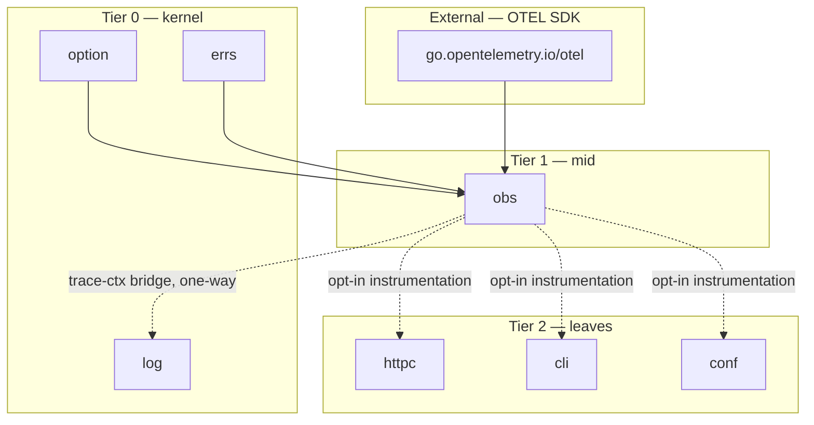

# Obs

<!--
  Section headers below are STABLE ANCHORS. Magpie extracts content by header,
  so do not rename or reorder them. Doing so is a process change requiring its
  own spec.

  Sections marked **Public** are extracted by Magpie for the public site.
  Sections marked **Internal** are engineering-only and never appear in published docs.
-->

## Public Summary

<!-- **Public.** One paragraph in end-user voice. The canonical description for the site and README. -->

`obs` is Glacier's OpenTelemetry-based observability package — metrics and traces for your Go service, with none of the ceremony. Call `obs.Init` once at startup to configure a `MeterProvider` and `TracerProvider` backed by an OTLP gRPC exporter, then instrument the rest of your stack one package at a time via opt-in options (`httpc.WithTracing()`, `httpc.WithMetrics()`, `cli.WithMetrics()`, `conf.WithMetrics()`). Add your own spans and counters in exactly three lines. When a span is active, `log.With(ctx, ...)` automatically appends `trace_id` and `span_id` to every log record — no manual correlation. When instrumentation is disabled, overhead is exactly zero: no allocation, no latency. Structured logs stay in `log/`; `obs/` handles the signals and the traces.

## Mental Model

<!-- **Public.** The conceptual frame a developer should hold while using this. Mermaid diagrams welcome. Source for the "Concepts" page on the site. -->

`obs` has three responsibilities: provider lifecycle, typed instruments, and span management.

```
┌──────────────────────────────────────────────────────────────────────────────┐
│  Provider lifecycle                                                           │
│  ──────────────────                                                           │
│  Init(opts...)   — build MeterProvider + TracerProvider, set obs.Default,   │
│                    wire OTLP gRPC exporter (or no-op if env unset)           │
│  Provider.Shutdown(ctx) error — flush pending spans/metrics; idempotent      │
│  obs.Default     — package-level shared provider; convenience entry point    │
└──────────────────────────────────────────────────────────────────────────────┘
┌──────────────────────────────────────────────────────────────────────────────┐
│  Typed instruments (generic over NumericType ≡ ~int64 | ~float64)           │
│  ──────────────────────────────────────────────────────────────────          │
│  Counter[T]    — monotonically increasing count; .Add(ctx, v, attrs...)      │
│  Histogram[T]  — distribution of values; .Record(ctx, v, attrs...)          │
│  Gauge[T]      — point-in-time measurement; .Set(ctx, v, attrs...)          │
└──────────────────────────────────────────────────────────────────────────────┘
┌──────────────────────────────────────────────────────────────────────────────┐
│  Span management                                                              │
│  ───────────────                                                              │
│  StartSpan(ctx, name, opts...) — begin a span; returns derived ctx + *Span  │
│  *Span methods  — End, RecordError, SetStatus, AddEvent, SetAttribute       │
│  SpanFromContext / TraceIDFromContext / SpanIDFromContext                    │
└──────────────────────────────────────────────────────────────────────────────┘
```

The integration story between `obs/` and `log/` is one-directional: `log/` optionally imports `obs/` to read trace context from the active span in ctx (rule F3d), then appends `trace_id` and `span_id` slog attributes to every log record. `obs/` never imports `log/`; it uses its own injected `*slog.Logger` (via `WithLogger`) for internal operational events.



Dashed edges represent the per-package opt-in instrumentation contracts (F15–F18): the other packages gain their `WithTracing()` / `WithMetrics()` options only when `obs` is in the module graph; they remain zero-cost no-ops when it is not.

Per-package instrumentation follows the **zero-overhead opt-in** pattern: each consuming package stores a nil interface reference for its tracer/meter by default. When the corresponding `With*` option is applied at construction time, the live provider is captured into that reference. Hot-path code checks the interface reference; a nil check costs a single pointer comparison and no allocation.

## Goals

<!-- **Internal.** Bulleted list. -->

- Wrap the OpenTelemetry Go SDK with Glacier-flavored ergonomics: typed generic instruments, a single `Init` entry point, standard resource attributes from `runtime/debug.ReadBuildInfo`, and OTLP gRPC as the default exporter.
- Provide typed metric constructors (`Counter[T]`, `Histogram[T]`, `Gauge[T]`) over the `NumericType` constraint (`~int64 | ~float64`).
- Provide span helpers (`StartSpan`, `SpanFromContext`, `TraceIDFromContext`, `SpanIDFromContext`) and a `*Span` with full OTEL semantics.
- Define per-package instrumentation contracts (`httpc.WithTracing()`, `httpc.WithMetrics()`, `cli.WithMetrics()`, `conf.WithMetrics()`) that are zero-overhead when not enabled.
- Deliver trace-correlated logging by bridging `log.With(ctx, ...)` to the active span's trace ID and span ID (one-way: `log/` → `obs/`, never reversed).
- Define standard attribute key constants aligned with OTEL semantic conventions for HTTP, CLI, and conf paths.
- Meet the §23.13 performance targets: span start ≤ 1 µs; counter Add ≤ 200 ns; zero overhead when instrumentation is disabled.
- Implement a secure untrusted-input posture for span names (§23.9 row 27), attribute keys (row 28), the OTLP endpoint URL (row 29), and OTLP responses from the collector (row 30).
- Satisfy the lifecycle discipline of §23.16: `Provider.Shutdown(ctx)` is idempotent and joins errors via `errs.Join`.

## Non-Goals

<!-- **Internal.** Bulleted list. What this spec deliberately excludes. -->

- **Logs do not live here.** Structured logging stays in `log/`. `obs/` handles metrics and traces only.
- **No HTTP exporter at v0.** The default exporter is OTLP gRPC. A stdout exporter for development convenience and an HTTP exporter for constrained environments are deferred to a follow-up spec.
- **No auto-instrumentation.** `obs/` does not monkey-patch the standard library or automatically instrument HTTP servers. Opt-in per package is the only supported model.
- **No OpenMetrics / Prometheus push gateway.** OTLP gRPC is the sole export path at v0; alternative backends connect via an OTEL collector.
- **No distributed context propagation configuration.** W3C Trace Context is used as-is by the OTEL SDK. Custom propagators are not exposed in v0.
- **No log-to-trace bridging via slog handler.** The bridge is strictly `log.With(ctx, ...)` appending trace context attrs; it is not a full structured-log-to-span pipeline.
- **No exemplar support.** Histogram exemplars are deferred.

## Architecture

<!-- **Internal.** Mermaid diagram + prose. Package layout, data flow, lifecycle. -->

### File layout

```
obs/
├── doc.go            package doc; one-paragraph charter + godoc example
├── init.go           Init, Provider, Default, initConfig, WithExporter, WithSampler,
│                     WithResourceAttribute, WithMetricsInterval, WithLogger
├── provider.go       Provider.Shutdown; internal providerState; init-once guard
├── metrics.go        NumericType, CounterImpl[T], HistogramImpl[T], GaugeImpl[T],
│                     Counter[T], Histogram[T], Gauge[T], metricConfig,
│                     WithDescription, WithUnit
├── traces.go         Span, SpanKind, Status, StartSpan, SpanFromContext,
│                     TraceIDFromContext, SpanIDFromContext, spanConfig,
│                     WithSpanKind, WithAttributes, TraceID, SpanID
├── attributes.go     Attribute, String, Int, Float, Bool, StringSlice,
│                     standard key constants (KeyHTTPMethod, KeyHTTPStatusCode, …)
├── log_bridge.go     bridge helpers consumed by log/ for trace-context extraction;
│                     exported as obs.TraceAttrsFromContext(ctx) ([]slog.Attr, bool)
├── obs_test.go       package-level integration; init lifecycle; import-audit assertions
├── init_test.go      §F1–F3; Init defaults, options, no-op fallback, double-init
├── metrics_test.go   §F4–F8; typed counter/histogram/gauge, NumericType constraint
├── traces_test.go    §F9–F13; span lifecycle, ctx propagation, kind/status/events
├── attributes_test.go        §F20–F21; constructors, key constant values, OTEL conformance
├── log_bridge_test.go        §F14; log.With(ctx) appends trace_id/span_id
├── per_package_instrumentation_test.go  §F15–F18; httpc/cli/conf integration (build:integration)
├── otlp_fake_collector_test.go          OTLP round-trip via httpmock
├── url_parse_fuzz_test.go    FuzzOTLPEndpointURLParse (§23.9 row 29)
├── concurrency_test.go       §EO15; 100 goroutines concurrent StartSpan/End + Counter.Add
├── lifecycle_test.go         §23.16 Shutdown idempotency + error joining
├── properties_test.go        §F14 property; trace ID propagation through log.With
├── bench_test.go             BenchmarkSpanStartEnd ≤ 1 µs; BenchmarkCounterAdd ≤ 200 ns
└── example_test.go           runnable godoc examples
```

### Framework-attribute naming convention

Standard attribute keys follow the OTEL semantic convention namespace (`http.*`, `rpc.*`, etc.) for protocol-level attributes, and the `glacier.*` namespace for framework-specific attributes:

| Key constant | Value string | OTEL semantic? |
|---|---|---|
| `KeyHTTPMethod` | `"http.method"` | Yes |
| `KeyHTTPStatusCode` | `"http.status_code"` | Yes |
| `KeyHTTPURL` | `"http.url"` | Yes |
| `KeyHTTPResponseSize` | `"http.response.size"` | Yes |
| `KeyCLICommand` | `"glacier.cli.command"` | No — Glacier-specific |
| `KeyCLIExitCode` | `"glacier.cli.exit_code"` | No |
| `KeyConfPath` | `"glacier.conf.path"` | No |
| `KeyRetryAttempt` | `"glacier.retry_attempt"` | No |

### Per-package instrumentation pattern

Each consuming package (httpc, cli, conf) follows the same pattern:

1. The package's unexported `config` struct gains an optional `tracer trace.Tracer` and/or `meter metric.Meter` field, defaulting to nil.
2. `WithTracing()` and `WithMetrics()` options capture the live tracer/meter from `obs.Default` at the moment the option is applied (construction time).
3. Hot paths gate on a nil check: `if c.tracer != nil { ctx, span = c.tracer.Start(ctx, name) }`.
4. When the option is not applied, the nil check is the only overhead — one pointer comparison, zero allocations.

This pattern enforces the zero-overhead-when-off guarantee (NF1 / §23.13) without requiring the consuming package to import `obs/` unconditionally. The consuming package may declare its option in terms of the OTEL `trace.Tracer` and `metric.Meter` interfaces, which `obs/` provides at setup time.

### Lifecycle

```
Init(opts...) ─────────────► providerState.once.Do(setup)
                                  ├── build OTEL resource
                                  ├── build MeterProvider  ─────► Start background exporter
                                  ├── build TracerProvider ─────► Start background exporter
                                  └── set obs.Default
                                         │
                              Consumer uses Default (Counter.Add, StartSpan, ...)
                                         │
Provider.Shutdown(ctx) ─────► providerState.once-shutdown.Do(flush)
                                  ├── MeterProvider.Shutdown(ctx)
                                  ├── TracerProvider.Shutdown(ctx)
                                  └── join errors via errs.Join
                              Second Shutdown ──► returns nil (idempotent)
```

## Schema

<!-- **Internal.** Go types with invariants stated as `// invariant: ...` comments on each field. -->

```go
// initConfig holds the configuration applied by Init.
type initConfig struct {
    exporter        Exporter           // invariant: nil means use env-based OTLP or no-op
    sampler         Sampler            // invariant: nil means ParentBased(TraceIDRatioBased(0.1))
    resourceAttrs   []attribute.KeyValue // invariant: appended to runtime/debug build info attrs
    metricsInterval time.Duration      // invariant: 0 means default SDK interval (60s)
    logger          *slog.Logger       // invariant: nil means slog.Default()
}

// providerState guards single initialization and shutdown.
type providerState struct {
    once         sync.Once           // invariant: guards setup
    shutdownOnce sync.Once           // invariant: guards flush; second call skips body
    meter        metric.MeterProvider
    tracer       trace.TracerProvider
    shutdown     func(ctx context.Context) error // composed shutdown of both providers
}

// Provider wraps the configured OTEL providers and exposes Shutdown.
// invariant: non-nil only after Init succeeds.
type Provider struct {
    state *providerState
}

// Default is the package-level shared provider set by Init.
// invariant: nil before Init; consumers must guard with a nil check or call Init.
var Default *Provider

// NumericType constrains the type parameter for metric instruments.
// Matches the two concrete types the OTEL SDK metric instruments accept.
type NumericType interface{ ~int64 | ~float64 }

// CounterImpl[T] wraps an OTEL Int64Counter or Float64Counter.
// invariant: instrument is non-nil after construction from a non-nil Default.
// invariant: instrument is a no-op if Default is nil at construction time.
type CounterImpl[T NumericType] struct {
    instrument any // concrete: metric.Int64Counter | metric.Float64Counter
}

// HistogramImpl[T] wraps an OTEL Int64Histogram or Float64Histogram.
// invariant: same as CounterImpl[T].
type HistogramImpl[T NumericType] struct {
    instrument any
}

// GaugeImpl[T] wraps an OTEL Int64Gauge or Float64Gauge.
// invariant: same as CounterImpl[T].
type GaugeImpl[T NumericType] struct {
    instrument any
}

// metricConfig holds per-instrument construction options.
type metricConfig struct {
    description string // invariant: empty means no description
    unit        string // invariant: empty means dimensionless
}

// Span wraps an OTEL trace.Span with Glacier-flavored helpers.
// invariant: inner span is always non-nil (may be a no-op span from a no-op tracer).
// invariant: End is idempotent; the endOnce guard ensures one call to inner.End().
type Span struct {
    inner   trace.Span
    endOnce sync.Once
}

// SpanKind maps to OTEL trace.SpanKind.
type SpanKind int

const (
    SpanKindInternal SpanKind = iota // invariant: 0 value matches OTEL SpanKindInternal
    SpanKindServer
    SpanKindClient
    SpanKindProducer
    SpanKindConsumer
)

// Status maps to OTEL codes.Code.
type Status int

const (
    StatusUnset Status = iota // invariant: 0 value; OTEL default
    StatusOk
    StatusError
)

// spanConfig holds per-span construction options.
type spanConfig struct {
    kind  trace.SpanKind    // invariant: default SpanKindInternal
    attrs []attribute.KeyValue
}

// Attribute is a typed wrapper over OTEL attribute.KeyValue.
// Constructors validate the key per §23.9 row 28 before wrapping.
type Attribute struct {
    kv attribute.KeyValue
}

// TraceID is a 16-byte OTEL trace identifier.
type TraceID = trace.TraceID

// SpanID is an 8-byte OTEL span identifier.
type SpanID = trace.SpanID

// Exporter is the interface for metric + trace exporters consumed by Init.
// Both OTLP gRPC and the no-op exporter satisfy this interface.
type Exporter interface {
    metric.Exporter // for metric pipeline
    // Satisfying both pipelines is done by the concrete implementation;
    // Init accepts them separately if needed.
}

// Sampler wraps trace.Sampler for Init.
type Sampler = trace.Sampler
```

## API

<!--
  **Public.** Every exported symbol introduced by this spec.
  For each: signature, doc comment (which becomes godoc), preconditions, postconditions,
  error contract, concurrency notes (goroutine-safe? blocking?), lifecycle hooks.
  Magpie extracts signatures + doc comments verbatim to the API reference page.
-->

### Init and Provider

```go
// Init initializes the Glacier observability stack. It builds a MeterProvider
// and a TracerProvider from the supplied options, sets the package-level Default,
// and starts the background OTLP gRPC exporter (or a no-op exporter when
// OTEL_EXPORTER_OTLP_ENDPOINT is unset and no WithExporter option is supplied).
//
// Init may only be called once per process. A second call returns
// ErrAlreadyInitialized; Default remains unchanged.
//
// Resource attributes are seeded from runtime/debug.ReadBuildInfo (module path,
// version, Go version) and extended with any WithResourceAttribute options.
//
// Preconditions: none (Init is safe to call before any other obs function).
// Postconditions: on success, Default is non-nil; background exporter is running.
// Error contract: returns *InitError wrapping the root cause on any setup failure.
// Concurrency: goroutine-safe; concurrent calls serialize via sync.Once and all
// but one receive ErrAlreadyInitialized.
// Blocking: Init does NOT block waiting for the exporter to connect; export is async.
func Init(opts ...option.Option[initConfig]) (*Provider, error)

// ErrAlreadyInitialized is returned by a second call to Init.
var ErrAlreadyInitialized = errs.Sentinel("obs: init: already initialized")

// InitError is the typed error returned when Init cannot build a provider.
type InitError struct {
    Cause error // invariant: non-nil
}
func (e *InitError) Error() string { return "obs: init: " + e.Cause.Error() }
func (e *InitError) Unwrap() error { return e.Cause }

// ErrCancelled is returned by Provider.Shutdown when ctx is already cancelled
// before the flush completes. Wraps ctx.Err().
var ErrCancelled = errs.Sentinel("obs: cancelled")

// Shutdown flushes all pending spans and metric data points through the configured
// exporter and releases exporter resources. Safe to call multiple times; the second
// and subsequent calls return nil immediately (idempotent per §23.16).
//
// If ctx is cancelled before the flush completes, Shutdown returns ErrCancelled
// wrapping ctx.Err() after a best-effort flush. Errors from the MeterProvider and
// TracerProvider shutdowns are joined via errs.Join.
//
// Preconditions: p is non-nil (guaranteed by Init postcondition).
// Postconditions: all buffered telemetry has been handed to the exporter network layer.
// Concurrency: goroutine-safe. First caller flushes; subsequent callers return nil.
// Blocking: blocks until flush completes or ctx expires.
func (p *Provider) Shutdown(ctx context.Context) error

// Default is the package-level shared Provider set by a successful Init call.
// Package-level metric constructors (Counter, Histogram, Gauge) and span helpers
// (StartSpan) operate on Default.
// invariant: nil before Init; users must call Init before using package-level helpers,
// or pass a *Provider directly.
var Default *Provider
```

### Init options

```go
// WithExporter supplies a custom OTLP metric exporter and trace exporter.
// When supplied, the env-based OTLP gRPC exporter is not constructed.
// The exporter is used for both the metric and trace pipelines.
//
// Preconditions: e must be non-nil.
func WithExporter(e Exporter) option.Option[initConfig]

// WithSampler supplies a custom trace sampler.
// Default: ParentBased(TraceIDRatioBased(0.1)).
//
// Preconditions: s must be non-nil.
func WithSampler(s Sampler) option.Option[initConfig]

// WithResourceAttribute appends a string resource attribute to every emitted
// span and metric data point. Common uses: "service.name", "service.version".
//
// Preconditions: k must be a valid OTEL attribute key (non-empty, ≤ 256 bytes,
// no NUL or control characters per §23.9 row 28).
func WithResourceAttribute(k, v string) option.Option[initConfig]

// WithMetricsInterval sets the periodic-reader flush interval for the metric
// pipeline. Default is the OTEL SDK default (60 s).
//
// Preconditions: d > 0.
func WithMetricsInterval(d time.Duration) option.Option[initConfig]

// WithLogger injects a *slog.Logger for obs/ internal operational events
// (exporter connection failures, double-Init warning, etc.).
// Default: slog.Default().
//
// Preconditions: l must be non-nil.
func WithLogger(l *slog.Logger) option.Option[initConfig]
```

### Sampler constructors (convenience wrappers)

```go
// ParentBased returns an OTEL ParentBased sampler wrapping root.
// Equivalent to sdktrace.ParentBased(root).
func ParentBased(root Sampler) Sampler

// TraceIDRatioBased returns an OTEL TraceIDRatioBased sampler.
// fraction must be in [0.0, 1.0].
func TraceIDRatioBased(fraction float64) Sampler

// AlwaysSample is the OTEL sdktrace.AlwaysSample sampler.
var AlwaysSample Sampler = sdktrace.AlwaysSample()

// NeverSample is the OTEL sdktrace.NeverSample sampler.
var NeverSample Sampler = sdktrace.NeverSample()
```

### Typed metric instruments

```go
// NumericType constrains the type parameter for all metric instruments.
// The two concrete types are int64 and float64, matching the OTEL SDK.
type NumericType interface{ ~int64 | ~float64 }

// Counter constructs a typed monotonically-increasing counter bound to the
// Default provider. If Default is nil at call time, the returned CounterImpl
// is a no-op (Add is a safe no-op per EO6).
//
// name follows OTEL instrument naming conventions (dot-separated, lowercase).
// Concurrency: goroutine-safe after construction.
func Counter[T NumericType](name string, opts ...MetricOption) *CounterImpl[T]

// Histogram constructs a typed histogram bound to the Default provider.
// No-op when Default is nil.
func Histogram[T NumericType](name string, opts ...MetricOption) *HistogramImpl[T]

// Gauge constructs a typed gauge (last-value) bound to the Default provider.
// No-op when Default is nil.
func Gauge[T NumericType](name string, opts ...MetricOption) *GaugeImpl[T]

// Add records a delta increment on the counter.
// attrs are converted to OTEL attribute.KeyValue values.
// Goroutine-safe. Non-blocking. ≤ 200 ns/op per §23.13.
func (c *CounterImpl[T]) Add(ctx context.Context, v T, attrs ...Attribute)

// Record observes value v on the histogram.
// Goroutine-safe. Non-blocking. Same performance envelope as Counter.Add.
func (h *HistogramImpl[T]) Record(ctx context.Context, v T, attrs ...Attribute)

// Set records a point-in-time measurement on the gauge.
// Goroutine-safe. Non-blocking.
func (g *GaugeImpl[T]) Set(ctx context.Context, v T, attrs ...Attribute)

// MetricOption configures a metric instrument at construction time.
type MetricOption interface{ applyMetric(*metricConfig) }

// WithDescription sets the instrument description that appears in OTLP metadata.
func WithDescription(s string) MetricOption

// WithUnit sets the instrument unit string (e.g., "ms", "bytes", "req").
// obs does not validate semantic coherence between unit and recorded values;
// that is the caller's responsibility (per EO13).
func WithUnit(s string) MetricOption
```

### Span management

```go
// StartSpan starts a new OTEL span as a child of any span already in ctx.
// It returns a derived context carrying the new span, and a *Span handle.
// The caller MUST call span.End() when the work unit is complete — typically
// via defer.
//
// name must be non-empty and ≤ 256 bytes with no NUL or control characters
// (§23.9 row 27). An empty name is replaced with "<unnamed>" and logged at
// warn via the injected logger.
//
// Preconditions: ctx is non-nil.
// Postconditions: returned ctx carries the new span; the returned *Span is non-nil.
// Concurrency: goroutine-safe. ≤ 1 µs/op per §23.13.
func StartSpan(ctx context.Context, name string, opts ...SpanOption) (context.Context, *Span)

// End completes the span, exporting it to the configured exporter.
// Idempotent: a second call to End is a no-op (per §23.16 / EO8).
// Goroutine-safe.
func (s *Span) End()

// RecordError attaches an exception event to the span, including the error
// message and stack trace. A nil err is a no-op (EO9).
// Goroutine-safe.
func (s *Span) RecordError(err error)

// SetStatus sets the span's final status. Last write wins (OTEL semantics,
// per EO22). Goroutine-safe.
func (s *Span) SetStatus(status Status, description string)

// AddEvent adds a named event with optional attributes to the span timeline.
// Goroutine-safe.
func (s *Span) AddEvent(name string, attrs ...Attribute)

// SetAttribute sets a single attribute on the span. Key is validated per
// §23.9 row 28 (≤ 256 bytes, no NUL/control chars). Goroutine-safe.
func (s *Span) SetAttribute(k string, v any)

// SpanFromContext retrieves the *Span associated with ctx. If no active span
// is present, returns a non-nil no-op Span (all methods are safe no-ops),
// consistent with OTEL's no-op tracer semantics (EO10).
// Goroutine-safe.
func SpanFromContext(ctx context.Context) *Span

// TraceIDFromContext extracts the TraceID of the active span in ctx.
// Returns (zero, false) when no active recording span is present (EO11).
// Goroutine-safe.
func TraceIDFromContext(ctx context.Context) (TraceID, bool)

// SpanIDFromContext extracts the SpanID of the active span in ctx.
// Returns (zero, false) when no active recording span is present.
// Goroutine-safe.
func SpanIDFromContext(ctx context.Context) (SpanID, bool)

// SpanOption configures a span at StartSpan time.
type SpanOption interface{ applySpan(*spanConfig) }

// WithSpanKind sets the span kind. Default: SpanKindInternal.
func WithSpanKind(k SpanKind) SpanOption

// WithAttributes attaches initial attributes to the span at start time.
// Keys are validated per §23.9 row 28.
func WithAttributes(attrs ...Attribute) SpanOption
```

### Span kind and status constants

```go
// SpanKind indicates the relationship between the span and its parent/children.
type SpanKind int

const (
    SpanKindInternal SpanKind = iota // default; intra-service work
    SpanKindServer                   // incoming synchronous RPC
    SpanKindClient                   // outgoing synchronous RPC
    SpanKindProducer                 // outgoing async message
    SpanKindConsumer                 // incoming async message
)

// Status indicates the outcome of the span.
type Status int

const (
    StatusUnset Status = iota // default; outcome not set
    StatusOk                  // explicitly successful
    StatusError               // explicitly failed
)
```

### Attribute constructors

```go
// Attribute is a typed key-value pair for span and metric attributes.
// Construct via the typed helpers below; do not use the zero value directly.
type Attribute struct{ kv attribute.KeyValue }

// String constructs a string-typed Attribute.
// Preconditions: k must be a valid OTEL key (non-empty, ≤ 256 bytes, no NUL/control chars).
func String(k, v string) Attribute

// Int constructs an int64-typed Attribute.
func Int(k string, v int64) Attribute

// Float constructs a float64-typed Attribute.
func Float(k string, v float64) Attribute

// Bool constructs a bool-typed Attribute.
func Bool(k string, v bool) Attribute

// StringSlice constructs a []string-typed Attribute.
func StringSlice(k string, v []string) Attribute
```

### Standard attribute key constants

```go
// Standard HTTP attribute keys — aligned with OTEL semantic conventions.
const (
    KeyHTTPMethod       = "http.method"       // HTTP request method (GET, POST, …)
    KeyHTTPStatusCode   = "http.status_code"  // HTTP response status code
    KeyHTTPURL          = "http.url"          // Full request URL
    KeyHTTPResponseSize = "http.response.size" // Response body size in bytes
)

// Glacier-namespaced attribute keys for framework-specific metadata.
const (
    KeyCLICommand   = "glacier.cli.command"   // CLI command name (subcommand path)
    KeyCLIExitCode  = "glacier.cli.exit_code" // Process exit code
    KeyConfPath     = "glacier.conf.path"     // Config file path
    KeyRetryAttempt = "glacier.retry_attempt" // Zero-based retry count on httpc
)
```

### Log-bridge helper

```go
// TraceAttrsFromContext extracts slog.Attr values for trace_id and span_id
// from the active span in ctx. Returns (nil, false) when no recording span
// is active. This function is consumed by log/ to implement F14; user code
// should use log.With(ctx, ...) instead of calling this directly.
//
// Goroutine-safe. Zero allocations on the false path.
func TraceAttrsFromContext(ctx context.Context) ([]slog.Attr, bool)
```

### Per-package instrumentation contracts

The following options are defined in their respective packages (`httpc/`, `cli/`, `conf/`) but are specified here because they are part of the obs/ contract. The signatures use each package's `config` type as the type parameter.

**`httpc/` (spec 0015)**

```go
// WithTracing enables OpenTelemetry tracing on the httpc.Client.
// Each request emits a span of kind SpanKindClient.
// Span name format: "HTTP <METHOD> <PATH>" (e.g., "HTTP GET /users").
// Span attributes: KeyHTTPMethod, KeyHTTPURL, KeyHTTPStatusCode,
//                  KeyHTTPResponseSize, KeyRetryAttempt.
// Zero overhead when not applied (nil tracer check at hot path).
// Requires obs.Default to be non-nil at client construction time.
func WithTracing() option.Option[clientConfig]

// WithMetrics enables OpenTelemetry metrics on the httpc.Client.
// Instruments emitted per request:
//   - Counter[int64]  "glacier.httpc.requests"         (attrs: method, status_code)
//   - Histogram[float64] "glacier.httpc.duration_ms"   (attrs: method)
//   - Histogram[int64]   "glacier.httpc.response_size_bytes"
// Zero overhead when not applied.
// Requires obs.Default to be non-nil at client construction time.
func WithMetrics() option.Option[clientConfig]
```

**`cli/` (spec 0011)**

```go
// WithMetrics enables OpenTelemetry metrics on the cli.App.
// Instruments emitted per command invocation:
//   - Counter[int64]     "glacier.cli.invocations" (attrs: command, exit_code)
//   - Histogram[float64] "glacier.cli.duration_ms" (attrs: command)
// Zero overhead when not applied.
func WithMetrics() option.Option[appConfig]
```

**`conf/` (spec 0009)**

```go
// WithMetrics enables OpenTelemetry metrics on the conf.Loader.
// Instruments emitted:
//   - Counter[int64]     "glacier.conf.loads"
//   - Histogram[float64] "glacier.conf.load_duration_ms"
//   - Gauge[int64]       "glacier.conf.registered_paths"
// Zero overhead when not applied.
func WithMetrics() option.Option[loaderConfig]
```

## Examples

<!--
  **Public.** Runnable Go examples in fenced ```go blocks.
  Each example is self-contained and `go test ./...`-compatible (valid Example functions).
  Magpie transcludes verbatim into tutorials.
-->

```go
// ExampleInit demonstrates initializing obs at program start.
func ExampleInit() {
    ctx := context.Background()

    prov, err := obs.Init(
        obs.WithResourceAttribute("service.name", "my-service"),
        obs.WithResourceAttribute("service.version", "v1.2.3"),
        obs.WithSampler(obs.ParentBased(obs.TraceIDRatioBased(0.1))),
    )
    if err != nil {
        log.Fatal(err)
    }
    defer prov.Shutdown(ctx)

    // obs.Default is now set; use package-level helpers throughout the program.
}
```

```go
// ExampleStartSpan demonstrates manual instrumentation of a handler function.
func ExampleStartSpan() {
    ctx := context.Background()

    ctx, span := obs.StartSpan(ctx, "handle.request",
        obs.WithSpanKind(obs.SpanKindServer),
        obs.WithAttributes(obs.String("user.id", "u-123")),
    )
    defer span.End()

    // Simulate work.
    if err := doWork(ctx); err != nil {
        span.RecordError(err)
        span.SetStatus(obs.StatusError, err.Error())
        return
    }
    span.SetStatus(obs.StatusOk, "")
}

func doWork(_ context.Context) error { return nil }
```

```go
// ExampleCounter demonstrates declaring and incrementing a typed counter.
func ExampleCounter() {
    // Declare at package level (before Init is fine; Add is a no-op until Init).
    var requestCount = obs.Counter[int64]("http.requests",
        obs.WithDescription("Total HTTP requests served"),
        obs.WithUnit("req"),
    )

    ctx := context.Background()

    // In a handler:
    requestCount.Add(ctx, 1,
        obs.String(obs.KeyHTTPMethod, "GET"),
        obs.Int(obs.KeyHTTPStatusCode, 200),
    )
}
```

```go
// ExampleWithTracing demonstrates per-package opt-in instrumentation on an httpc.Client.
func ExampleWithTracing() {
    ctx := context.Background()

    // Init must be called before construction for WithTracing to capture a live tracer.
    prov, _ := obs.Init(obs.WithResourceAttribute("service.name", "svc"))
    defer prov.Shutdown(ctx)

    client, _ := httpc.New(
        httpc.WithTracing(),   // emits a span per request
        httpc.WithMetrics(),   // emits counter + histogram per request
    )
    _ = client
    // Every client.Get/Post/Put now automatically emits OTEL spans and metrics.
}
```

```go
// ExampleTraceCorrelatedLog demonstrates automatic trace/span ID injection into logs.
func ExampleTraceCorrelatedLog() {
    ctx := context.Background()

    prov, _ := obs.Init(obs.WithResourceAttribute("service.name", "svc"))
    defer prov.Shutdown(ctx)

    ctx, span := obs.StartSpan(ctx, "handle")
    defer span.End()

    // log.With picks up trace_id and span_id automatically from the active span in ctx.
    slog.InfoContext(ctx, "processing request")
    // → structured log record carries trace_id and span_id attributes.
}
```

## Test Matrix

<!--
  **Internal.** Owned by Lynx.
  Table: scenario × input × expected outcome × covered-by-test-name.
-->

Source: `specs/test-matrices/mid.md` §Package: `obs/` plus §23 amendment tests.

### Test files

| File | Spec coverage |
|---|---|
| `obs/init_test.go` | F1–F3; Init defaults, options, no-op fallback, double-init, EO1–EO4 |
| `obs/metrics_test.go` | F4–F8; typed counter/histogram/gauge, NumericType, EO6, EO12, EO13, EO21 |
| `obs/traces_test.go` | F9–F13; span lifecycle, kind, status, events, attributes; EO7–EO11, EO15, EO16, EO22 |
| `obs/attributes_test.go` | F20–F21; constructors, key constant values, OTEL-conformance regex |
| `obs/log_bridge_test.go` | F14; TraceAttrsFromContext; log.With(ctx) adds trace_id/span_id |
| `obs/per_package_instrumentation_test.go` | F15–F19; httpc/cli/conf integration (build tag: integration) |
| `obs/otlp_fake_collector_test.go` | OTLP round-trip via httpmock fake collector |
| `obs/url_parse_fuzz_test.go` | FuzzOTLPEndpointURLParse (§23.9 row 29) |
| `obs/concurrency_test.go` | EO15; 100 goroutines concurrent StartSpan/End + Counter.Add |
| `obs/lifecycle_test.go` | §23.16; Shutdown idempotency, error joining, cancelled-ctx path |
| `obs/properties_test.go` | PropertyTraceSpanIDPropagation; random ctx-tree depths |
| `obs/bench_test.go` | §23.13; BenchmarkSpanStartEnd ≤ 1 µs; BenchmarkCounterAdd ≤ 200 ns |
| `obs/example_test.go` | Runnable godoc examples for all public symbols |
| `obs/obs_test.go` | Package-level import-audit (no obs → log import edge) |

### Test matrix rows

| # | Name | Spec ref | Type | Description | Test helpers used |
|---|---|---|---|---|---|
| 1 | TestInitDefaults | §21.15 F1 | Unit (positive) | Init with no opts sets Default; resource attrs include build-info fields. | `assert.NotNil`, `assert.Equal` |
| 2 | TestInitTwiceErrors | EO1 | Unit (negative) | Second Init returns ErrAlreadyInitialized; Default unchanged. | `assert.ErrorIs` |
| 3 | TestInitNoEndpointFallsBackToNoOp | EO2 | Unit (positive) | No env + no WithExporter → no-op exporter; Init returns nil error. | `t.Setenv("OTEL_EXPORTER_OTLP_ENDPOINT","")`, `assert.NoError` |
| 4 | TestInitMalformedEndpoint | EO3 | Unit (negative) | Bad URL in env → `*InitError`; Unwrap yields url.Error. | `t.Setenv`, `assert.ErrorAs` |
| 5 | TestWithExporterOption | §21.15 F2 | Unit (positive) | Custom exporter accepted; spans reach it after StartSpan+End. | fake exporter, `assert.Equal` |
| 6 | TestWithSamplerOption | §21.15 F2 | Unit (positive) | Always-reject sampler → spans not recorded; metrics still record. | `obs.NeverSample`, `assert.Equal` |
| 7 | TestWithResourceAttribute | §21.15 F2 | Unit (positive) | Resource attr appears on every exported span. | fake exporter, `assert.Contains` |
| 8 | TestWithMetricsInterval | §21.15 F2 | Unit (positive) | Metrics flushed at custom interval via fake clock. | `fixture.NewClock`, fake exporter |
| 9 | TestWithLoggerInternal | §21.15 F2 | Unit (positive) | Internal events (double-Init warning) log via custom logger. | `fixture.Capture`, `assert.Contains` |
| 10 | TestDefaultPackageVarSet | §21.15 F3 | Unit (positive) | After Init, `obs.Default` is non-nil. | `assert.NotNil` |
| 11 | TestPackageLevelCounterUsesDefault | §21.15 F3 | Unit (positive) | `obs.Counter[int64]("x").Add(ctx, 1)` records on Default. | fake exporter, `assert.Equal` |
| 12 | TestCounterInt64Add | §21.15 F4 | Unit (positive) | int64 counter Add increments observed count by 1. | fake exporter |
| 13 | TestCounterFloat64Add | §21.15 F4 | Unit (positive) | float64 counter Add increments by 1.5. | fake exporter |
| 14 | TestCounterAddBeforeInitNoOp | EO6 | Unit (positive) | Counter constructed when Default is nil; Add does not panic. | `assert.NoError` (no panic) |
| 15 | TestCounterDuplicateNameDifferentType | EO12 | Unit | Counter[int64]("x") and Counter[float64]("x") — last-registration wins per OTEL semantics; documented. | assert locked semantics |
| 16 | TestHistogramRecord | §21.15 F5 | Unit (positive) | Histogram[float64].Record observed at fake exporter. | fake exporter |
| 17 | TestGaugeSet | §21.15 F6 | Unit (positive) | Gauge.Set updates point-in-time value; second Set replaces. | fake exporter |
| 18 | TestMetricWithDescription | §21.15 F7 | Unit (positive) | Description appears in instrument metadata at fake exporter. | fake exporter |
| 19 | TestMetricWithUnit | §21.15 F7 | Unit (positive) | Unit string propagated to instrument metadata. | fake exporter |
| 20 | TestNumericTypeConstraintCompiles | §21.15 F8 | Compile-time | int64 and float64 satisfy NumericType; string does not (compile-only assertion). | compile-only |
| 21 | TestStartSpanReturnsCtx | §21.15 F9 | Unit (positive) | StartSpan returns derived ctx; SpanFromContext(ctx) is non-nil. | `obs.SpanFromContext`, `assert.NotNil` |
| 22 | TestSpanEnd | §21.15 F10 | Unit (positive) | End() exports span through configured exporter. | fake exporter, `assert.Equal` |
| 23 | TestSpanEndIdempotent | EO8 | Unit (positive) | End() twice: exporter sees span exactly once. | fake exporter, `assert.Equal(count==1)` |
| 24 | TestSpanRecordError | §21.15 F10 | Unit (positive) | RecordError adds an exception event with message and stack. | fake exporter, `assert.Contains` |
| 25 | TestSpanRecordErrorNilNoOp | EO9 | Unit (positive) | RecordError(nil) adds no events. | fake exporter, count == 0 |
| 26 | TestSpanSetStatusOk | §21.15 F10 | Unit (positive) | SetStatus(StatusOk, "") exported correctly. | fake exporter |
| 27 | TestSpanSetStatusError | §21.15 F10 | Unit (positive) | SetStatus(StatusError, "msg") exported with description. | fake exporter |
| 28 | TestSpanSetStatusOkAfterError | EO22 | Unit (positive) | Last write wins per OTEL semantics; final status is Ok. | fake exporter |
| 29 | TestSpanAddEvent | §21.15 F10 | Unit (positive) | Event appears with expected name and attrs in exported span. | fake exporter, `assert.Contains` |
| 30 | TestSpanSetAttribute | §21.15 F10 | Unit (positive) | Attribute visible on exported span. | fake exporter |
| 31 | TestSpanWithSpanKindServer | §21.15 F11 | Unit (positive) | Span kind SpanKindServer exported correctly. | fake exporter, `assert.Equal` |
| 32 | TestSpanWithAttributesOption | §21.15 F11 | Unit (positive) | Initial attrs from WithAttributes appear on exported span. | fake exporter |
| 33 | TestSpanFromContextNonNil | §21.15 F12 | Unit (positive) | SpanFromContext returns same span after StartSpan. | identity check, `assert.Equal` |
| 34 | TestSpanFromContextNoActiveReturnsNoOp | EO10 | Unit (positive) | No span in ctx → non-nil no-op span; all methods safe. | `assert.NotNil`, no-panic |
| 35 | TestTraceIDFromContext | §21.15 F13 | Unit (positive) | After StartSpan, TraceIDFromContext returns non-zero, true. | `assert.True` |
| 36 | TestTraceIDFromContextNoSpan | EO11 | Unit (positive) | No span → (zero TraceID, false). | `assert.False` |
| 37 | TestSpanIDFromContext | §21.15 F13 | Unit (positive) | After StartSpan, SpanIDFromContext returns non-zero, true. | `assert.True` |
| 38 | TestEmptySpanNameBecomesUnnamed | EO7 | Unit (positive) | Empty name → span named `"<unnamed>"`; warn logged. | `fixture.Capture`, `assert.Contains` |
| 39 | TestLogBridgeAddsTraceIDSpanID | §21.15 F14 | Unit (positive) | `log.With(ctx, ...)` after StartSpan appends `trace_id` and `span_id` slog attrs to records. | `fixture.Capture` + slog handler, `assert.Contains` |
| 40 | TestLogBridgeNoSpanNoAttrs | EO17 | Unit (positive) | `log.With(ctx, ...)` with no active span does not append trace attrs. | `fixture.Capture`, `assert.NotContains` |
| 41 | PropertyTraceSpanIDPropagation | §21.15 F14, req #5 | Property | For random ctx-derivation depths and span-nesting depths, active span IDs match what `log.With` exposes. | property generator, 1000 cases |
| 42 | TestHttpcWithTracingEmitsClientSpan | §21.15 F15 | Integration | httpc client with WithTracing → each request emits SpanKindClient span with KeyHTTPMethod, KeyHTTPURL, KeyHTTPStatusCode, KeyHTTPResponseSize, KeyRetryAttempt; name "HTTP GET /path". | `httpmock`, fake OTLP exporter, `assert.Equal` |
| 43 | TestHttpcWithMetricsEmitsCounterAndHistograms | §21.15 F16 | Integration | Counter "glacier.httpc.requests", histograms "glacier.httpc.duration_ms" and "glacier.httpc.response_size_bytes" emitted. | fake exporter, `assert.Contains` |
| 44 | TestCliWithMetricsEmitsInvocationCounter | §21.15 F17 | Integration | Counter "glacier.cli.invocations", histogram "glacier.cli.duration_ms" emitted per command run. | fake exporter |
| 45 | TestConfWithMetricsEmitsLoadInstruments | §21.15 F18 | Integration | Counter "glacier.conf.loads", histogram "glacier.conf.load_duration_ms", gauge "glacier.conf.registered_paths" emitted. | fake exporter |
| 46 | TestZeroOverheadWhenInstrumentationOff | §21.15 NF1, §23.13 | Bench | httpc without WithTracing/WithMetrics: zero allocs/op per request path. | `testing.AllocsPerRun` |
| 47 | TestAttributeStringConstructor | §21.15 F20 | Unit (positive) | String(k,v) produces Attribute with expected kv. | `assert.Equal` |
| 48 | TestAttributeIntConstructor | §21.15 F20 | Unit (positive) | Int(k,v) int64 typed. | `assert.Equal` |
| 49 | TestAttributeFloatConstructor | §21.15 F20 | Unit (positive) | Float(k,v) float64 typed. | `assert.Equal` |
| 50 | TestAttributeBoolConstructor | §21.15 F20 | Unit (positive) | Bool(k,v). | `assert.Equal` |
| 51 | TestAttributeStringSliceConstructor | §21.15 F20 | Unit (positive) | StringSlice(k,v). | `assert.Equal` |
| 52 | TestStandardKeyConstantsStable | §21.15 F21 | Unit (positive) | KeyHTTPMethod == "http.method", etc. — frozen string values. | `assert.Equal` per constant |
| 53 | TestStandardKeyConstantsOTELConformant | §21.15 F21 | Unit (positive) | http.* keys follow OTEL semconv; glacier.* consistently namespaced. | regex check |
| 54 | TestProviderShutdownFlushes | §23.16 | Unit (lifecycle) | Shutdown flushes pending spans and metrics before returning. | fake exporter, `assert.Equal` |
| 55 | TestProviderShutdownIdempotent | §23.16, EO5 | Unit (lifecycle) | Two Shutdown calls: second returns nil. | `assert.NoError` (both calls) |
| 56 | TestProviderShutdownJoinsErrors | §23.16, EO23 | Unit (lifecycle) | Shutdown joins MeterProvider + TracerProvider errors via errs.Join. | `errs.Chain`, `assert.ErrorIs` |
| 57 | TestProviderShutdownCancelledCtx | EO4 | Unit (negative) | Pre-cancelled ctx → ErrCancelled-class error; ErrCancelled.Unwrap → ctx.Err(). | `assert.ErrorIs` |
| 58 | TestConcurrentSpanStartEnd | EO15 | Race | 100 goroutines StartSpan+End simultaneously — race-clean; all spans exported. | `concur.Group`, `-race`, `fixture.GuardLeaks` |
| 59 | TestConcurrentCounterAdd | req #4 | Race | 100 goroutines Counter[int64].Add(ctx, 1) — final count == 100, no race. | `concur.Group`, `-race`, `assert.Equal` |
| 60 | TestSpanLeftUnEndedNoGoroutineLeak | EO16 | Unit (lifecycle) | Span goes out of scope un-Ended; no goroutine leak reported by GuardLeaks. | `fixture.GuardLeaks` |
| 61 | FuzzOTLPEndpointURLParse | §23.9 row 29 | Fuzz | Random byte URLs in OTEL_EXPORTER_OTLP_ENDPOINT: never panic; either parse or return InitError. | `testing.F`, seed corpus |
| 62 | TestOTLPExporterRoundTripViaFakeCollector | req obs OTEL | Integration | Fake OTLP collector via httpmock; counter/histogram/gauge round-trip; spans exported with correct attributes. | `httpmock`, fake collector, `assert.Equal` |
| 63 | TestSpansEmitOTELConformantAttributeKeys | req obs OTEL | Integration | Emitted span attribute keys validated against OTEL semantic conventions. | OTEL conformance checker |
| 64 | TestUntrustedRemoteEndpointDocumented | EO19, §23.9 row 29 | Unit (positive) | Non-localhost endpoint accepted; logged at info; documented. | `fixture.Capture`, `assert.Contains` |
| 65 | TestErrFormatRegisterCompliance | §21.15 NF3 | Unit (cross-cutting) | Errors from obs use register format "obs: <action>: <cause>". | `assert.Regexp` |
| 66 | BenchmarkSpanStartEnd | §21.15 NF1, §23.13 | Benchmark | StartSpan + End ≤ 1 µs/op under recording sampler. | `testing.B` |
| 67 | BenchmarkCounterAdd | §21.15 NF1, §23.13 | Benchmark | Counter[int64].Add ≤ 200 ns/op. | `testing.B` |
| 68 | BenchmarkHistogramRecord | §21.15 NF1 | Benchmark | Histogram[float64].Record — same performance envelope, documented. | `testing.B` |
| 69 | BenchmarkGaugeSet | §21.15 NF1 | Benchmark | Gauge[int64].Set — same performance envelope, documented. | `testing.B` |
| 70 | BenchmarkPerPackageDisabledOverhead | §21.15 NF1 | Benchmark | WithTracing not set → 0 allocs/op in httpc request path. | `testing.AllocsPerRun` |

### Edge cases

| # | Edge case | Behavior |
|---|---|---|
| EO1 | `Init` called twice | Second Init returns `ErrAlreadyInitialized`; Default unchanged. |
| EO2 | `Init` with no exporter and `OTEL_EXPORTER_OTLP_ENDPOINT` unset | Falls back to no-op exporter; not an error; logs at info. |
| EO3 | `Init` with malformed OTLP endpoint URL | Returns `*InitError{Cause: url.Error}`. |
| EO4 | `Provider.Shutdown(ctx)` with already-cancelled ctx | Best-effort flush; returns `ErrCancelled` wrapping `ctx.Err()`. |
| EO5 | `Shutdown` called twice | Second call returns nil (idempotent per §23.16). |
| EO6 | `Counter[int64]("name").Add(ctx, 1)` before Init | No-op; Default is nil; Add is a safe early return. |
| EO7 | `StartSpan(ctx, "")` empty name | Span created with name `"<unnamed>"`; logged at warn. |
| EO8 | `(*Span).End()` called twice | Second End is a no-op. |
| EO9 | `(*Span).RecordError(nil)` | No-op; no exception event added. |
| EO10 | `SpanFromContext(ctx)` with no active span | Returns a non-nil no-op span; all methods are safe no-ops. |
| EO11 | `TraceIDFromContext(ctx)` with no span | Returns (zero TraceID, false). |
| EO12 | `Counter[int64]` and `Counter[float64]` with same name | Last registration wins per OTEL semantics; behavior locked in test #15. |
| EO13 | `WithUnit("ms")` paired with histogram recording bytes | No unit/value coherence validation; caller responsibility; documented. |
| EO14 | `Attribute` with control characters in key | Key rejected via §23.9 row 28 validation; constructor returns error-Attribute that emits a zero kv. |
| EO15 | Concurrent `StartSpan` from 100 goroutines | Race-clean; each gets an independent span. |
| EO16 | Span left un-Ended at goroutine exit | Garbage-collected; no goroutine leak; no panic. |
| EO17 | `log.With(ctx, ...)` when ctx has no span | `trace_id`/`span_id` NOT appended (absence, not zero). |
| EO18 | `Init` with always-reject sampler | All spans are no-op; metrics still record. |
| EO19 | `OTEL_EXPORTER_OTLP_ENDPOINT` with non-localhost value | Allowed (OTEL semantics); logged at info; documented per §23.9 row 29. |
| EO20 | OTLP exporter unable to connect at startup | Init does NOT block; export is async; failures are logged. |
| EO21 | Counter.Add with attrs containing nil string | Coerced to empty string by OTEL SDK. |
| EO22 | SetStatus(StatusOk, "") after SetStatus(StatusError, …) | Last write wins per OTEL semantics. |
| EO23 | `Provider.Shutdown` with errors from both MeterProvider and TracerProvider | Both errors joined via `errs.Join`. |

### Coverage targets

- 100% line coverage on every public symbol per F1–F21.
- 100% on `Provider.Shutdown` flush + idempotency paths (§23.16).
- ≥ 90% line overall; some OTEL-SDK-internal error paths are wrapper-only and not exercisable without SDK internals exposure; the fuzz target (row 61) covers the URL-parsing boundary.

## Dependency Justification

<!--
  **Internal.** Owned by Falcon.
  One row per new direct dependency. The empty table is the goal.
  Required answers: license, last-release-date, maintainer count, alternatives considered, why we don't roll our own.
-->

All OTEL dependencies are pre-approved per §23.3 (D4-amended). Falcon's six-question checklist is answered per dependency below. All versions must be pinned to a specific named release in `go.mod`; no pseudo-versions.

| Module | Version | License | Last release | Maintainers | Alternatives considered | Why we can't roll our own |
|---|---|---|---|---|---|---|
| `go.opentelemetry.io/otel` | pinned (e.g. v1.35.0) | Apache-2.0 | Active (monthly cadence) | CNCF / multi-org (Google, Microsoft, Datadog, Lightstep) | OpenCensus (archived), custom in-tree metrics | The OTEL data model alone is ~3000 lines of well-tested spec-faithful code; we would be building an incomplete, non-conformant subset. The vendored SDK is the wire-compatible reference. User-explicitly allowlisted in §23.3. |
| `go.opentelemetry.io/otel/metric` | same as above | Apache-2.0 | Active | Same multi-org pool | n/a (submodule of above) | Instrument types (Counter, Histogram, Gauge, ObservableGauge) require SDK-level implementation. |
| `go.opentelemetry.io/otel/trace` | same | Apache-2.0 | Active | Same | n/a | Span, SpanContext, TraceID, SpanID, propagation all defined here; re-implementing breaks wire compatibility. |
| `go.opentelemetry.io/otel/sdk` | same | Apache-2.0 | Active | Same | n/a | Core SDK: resource, processor, sampler, exporter pipeline. ~5000 lines of tested implementation. |
| `go.opentelemetry.io/otel/sdk/metric` | same | Apache-2.0 | Active | Same | n/a | Periodic reader, delta/cumulative temporality, exemplar pipeline. |
| `go.opentelemetry.io/otel/sdk/trace` | same | Apache-2.0 | Active | Same | n/a | Span processor, batch exporter, sampler wiring. |
| `go.opentelemetry.io/otel/exporters/otlp/otlpmetric/otlpmetricgrpc` | same | Apache-2.0 | Active | Same | stdout exporter (dev only, deferred) | gRPC OTLP is the default production-ready export path; interoperable with every OTEL collector. |
| `go.opentelemetry.io/otel/exporters/otlp/otlptrace/otlptracegrpc` | same | Apache-2.0 | Active | Same | Same as above | Same rationale. |
| `google.golang.org/grpc` | pinned (e.g. v1.71.0) | Apache-2.0 | Active (monthly cadence) | Google, multi-maintainer | HTTP/2 raw; twirp | gRPC is the OTLP transport; building an OTLP-over-gRPC transport in <100 lines is impossible. Google-maintained. Pre-approved per §23.3. |
| `google.golang.org/protobuf` | pinned (e.g. v1.36.5) | BSD-3-Clause | Active | Google, multi-maintainer | encoding/json | protobuf is the OTLP serialization format; no alternative without re-implementing the full proto runtime. BSD-3-Clause compatible. Pre-approved per §23.3. |

**Vulnerability scan:** `govulncheck -mode=source ./obs/...` must return zero findings of severity > LOW against the pinned versions above. CI enforces this on every PR (D31).

**License scan:** `go-licenses` against the allowlist (MIT, BSD-2-Clause, BSD-3-Clause, Apache-2.0, ISC, plus Go stdlib) must return clean for all transitives pulled by the obs/ dep set. CI enforces on every PR (D31).

**`golang.org/x/net` and `golang.org/x/text`** are transitive via gRPC. License: BSD-3-Clause. Go-team-maintained. No direct usage in obs/; tracked via SBOM (D31 §23.12).

## Security & Supply-Chain Notes

<!-- **Internal.** Untrusted-input handling, sandboxing implications, secrets handling, vuln-scan considerations. -->

### Untrusted-input register (§23.9 rows 27–30)

| Row | Input source | Parser / decoder | Size cap | Validation rule |
|---|---|---|---|---|
| 27 | `obs` span name (user-supplied string to `StartSpan` and `AddEvent`) | Length check in `obs/traces.go` before passing to OTEL | 256 bytes | Reject NUL (`\x00`) and ASCII control characters (code points < 0x20 except tab). Violation: empty name replaced with `"<unnamed>"`; logged at warn. |
| 28 | `obs` attribute key (user-supplied string to `String`, `Int`, `Float`, `Bool`, `StringSlice`, `SetAttribute`) | OTEL-conformant key validation in `obs/attributes.go` | 256 bytes | Matches OTEL key regex `^[a-z][a-z0-9_.\-/]*$`; reject keys with NUL, control chars, or exceeding length. On violation, the `Attribute` constructor returns a zero-value `Attribute` (no-op at recording time) and logs at warn. |
| 29 | OTLP exporter endpoint URL (`OTEL_EXPORTER_OTLP_ENDPOINT` env var or `WithExporter` URL arg) | `net/url.Parse` in `obs/init.go` | 4 KiB | Scheme allowlist: `grpc`, `grpcs`, `https`. Reject all other schemes. `file://`, `javascript:`, bare-hostname-without-scheme rejected. Malformed → `*InitError{Cause: url.Error}`. |
| 30 | OTLP response from collector (acknowledgement / error detail) | gRPC + protobuf handled by the OTEL SDK's own exporter | Bounded by gRPC deadline and max-receive-message-size configured by OTEL SDK | OTEL SDK handles parsing; obs/ does not decode collector responses directly. Exporter errors are surfaced as-is via the SDK's error path; obs/ wraps them with `"obs: export: "` prefix. |

### Secrets in spans and attributes

`obs/` does not enforce secrets redaction on user-supplied attribute values. This is the consumer's responsibility. Guidance: use `log.Redact(v)` (from `log/`) on any value that wraps a secret before passing it as a `Attribute` value, or simply omit the attribute. The `obs/` package documentation states this explicitly.

### Supply-chain risk posture

The OTEL dep set is the largest supply-chain footprint in the framework (~10 direct modules, ~30+ transitive). Mitigations:

- All deps pinned to specific named versions in `go.mod` (no `latest`, no pseudo-versions).
- `go mod verify` run in CI `mod-hygiene` job (§23.12).
- `govulncheck` gate (D31) applies to the full transitive close.
- `go-licenses` gate (D31) verifies every transitive license.
- `cyclonedx-gomod` SBOM generated per CI `sbom-generate` job (§23.12); SBOM committed to `security/sbom.json`.

### CGO

`obs/` and all its deps must be `CGO_ENABLED=0` compatible. The OTEL gRPC exporter and protobuf runtime have no cgo dependency. CI runs builds under `CGO_ENABLED=0` to enforce this (D32).

## FAQ

<!-- **Public.** Anticipated user questions with answers. Magpie extracts to the public docs FAQ. -->

**Why is obs/ built on the OpenTelemetry SDK instead of a lighter custom implementation?**

The OpenTelemetry data model — TraceID, SpanContext, W3C Trace Context propagation, OTLP wire format — is a specification, not just a convention. A custom implementation that deviates from the spec is not observable by standard backends (Jaeger, Tempo, Datadog, etc.). The OTEL Go SDK is Apache-2.0, multi-org maintained, and is the only wire-compatible reference implementation. Rolling our own would produce something slower, less correct, and incompatible with the ecosystem.

**Why is obs/ a mid-tier package and not a kernel or leaf package?**

`obs/` sits at Tier 1 (mid) because it has the right dependency profile for that tier: it imports kernel packages (`option`, `errs`) and the external OTEL SDK, but it does not import any Glacier leaf package (`cli`, `mock`, `httpmock`, `httpc`). Leaf packages import `obs/` when they need per-package instrumentation. Placing `obs/` at kernel tier would drag the OTEL dep set into every Glacier consumer, even those with no observability requirement. Placing it at leaf tier would make the per-package instrumentation contracts circular. Mid-tier is the only correct position.

**Why are `WithTracing()` and `WithMetrics()` options opt-in per package instead of automatic?**

Automatic instrumentation would mean every `httpc.Client` always imports `obs/` and always allocates tracer/meter resources, even in binaries that never call `obs.Init`. The opt-in model keeps the zero-overhead guarantee (NF1): when you do not pass `WithTracing()` to your `httpc.New(...)` call, the hot path does exactly one nil pointer check and nothing else. Auto-instrumentation is deferred to a follow-up spec where the right design (build tags, init hooks, or a separate auto-instrumentation package) can be decided with real consumer data.

**How does log/ know about trace IDs without importing obs/?**

The integration is one-directional. `obs/` exports `TraceAttrsFromContext(ctx) ([]slog.Attr, bool)` — a single, zero-allocation helper that reads the OTEL span context from the context value and returns slog attrs. `log/` optionally imports `obs/` (permitted by rule F3d) to call this helper inside `log.With(ctx, ...)`. `obs/` never imports `log/`; it uses its own `*slog.Logger` (set via `WithLogger`) for internal events. This one-way edge avoids the cycle and keeps the kernel `log/` package's dependency on the OTEL SDK explicit and conditional.

**How does this relate to `httpc.WithTracing()` and `httpc.WithMetrics()`? Do I need to import obs/ in my code that uses httpc?**

The `WithTracing()` and `WithMetrics()` options live in the `httpc/` package. You only need to import `obs/` when you want to call `obs.Init`, use typed metric instruments, or start spans manually. If you use `httpc.WithTracing()` and `httpc.WithMetrics()`, those options capture a live tracer/meter from `obs.Default` at client construction time — you just need to have called `obs.Init` first. For programs that do not call `obs.Init`, the options resolve to no-ops.

**When does `obs.Init` need to be called relative to everything else?**

`obs.Init` must be called before any component that uses `WithTracing()` or `WithMetrics()` is constructed. The standard pattern is to call `Init` at the beginning of `main` (or your `cli.App` run function), before constructing any `httpc.Client`, `cli.App`, or `conf.Loader` that has instrumentation options. `Counter`, `Histogram`, and `Gauge` instruments may be declared at package-level (before `Init`) — their `Add`/`Record`/`Set` methods are safe no-ops until `Init` has run. `defer prov.Shutdown(ctx)` should be the next statement after `Init`.

## Decisions & Rationale

<!-- **Internal.** Why-this-and-not-that for non-obvious choices. Folded-in ADR. -->

**D-OBS-1: Typed generic instruments over OTEL's interface-based API.**
The OTEL Go SDK exposes `metric.Int64Counter`, `metric.Float64Counter`, etc. as distinct types. Glacier wraps them behind `CounterImpl[T NumericType]` so user code writes `obs.Counter[int64]("name")` once and gets a compile-time guarantee on the type of values passed to `Add`. This is consistent with the framework's generics-first posture (D36) and eliminates the `int64` vs `float64` disambiguation at every call site.

**D-OBS-2: `NumericType` as `~int64 | ~float64` exactly.**
The OTEL SDK's instrument methods accept exactly `int64` and `float64`. Allowing `~int64 | ~float64` lets users define named types (`type Milliseconds int64`) that satisfy the constraint. Widening to all integer/float types would require runtime coercion and could silently lose precision on narrow types.

**D-OBS-3: `Span.End` is idempotent; guarded by `sync.Once`.**
OTEL's own `trace.Span.End` documentation notes that calling End more than once is implementation-specific. Glacier's wrapper makes it unconditionally idempotent via `sync.Once`, matching the lifecycle discipline of every other stateful type in the framework (§23.16). The cost is one `sync.Once` per span — negligible relative to the span start/end budget of ≤ 1 µs.

**D-OBS-4: Attribute key validation in Glacier wrappers, not pushed to OTEL SDK.**
The OTEL SDK accepts any string as an attribute key and silently drops invalid ones at export time. Glacier validates keys at the `Attribute` constructor (§23.9 row 28) so the user sees a logged warning at the point of mistake, not a silent data loss. This aligns with Glacier's principle that errors should be observable at their origin.

**D-OBS-5: OTLP gRPC as the only v0 exporter (no stdout, no HTTP).**
A stdout exporter is useful for development but adds an export-path code path. An HTTP OTLP exporter is useful for environments that block gRPC. Both are deferred to a follow-up spec to keep v0 scope bounded. The OTEL collector (open-source) can translate gRPC OTLP to any backend, making gRPC the most universally useful single choice.

**D-OBS-6: Init does not block on exporter connection.**
Blocking `Init` on a live connection to the OTLP endpoint would make programs fail to start when the collector is unavailable. The OTEL SDK's batch span/metric processors queue data and retry the connection asynchronously. `Init` returns as soon as the providers are configured; export failures are logged. This is standard OTEL SDK behavior and is the correct default for a library.

**D-OBS-7: No secrets enforcement in obs/; documented as consumer responsibility.**
`obs/` cannot reliably detect secrets in attribute values — secrets can appear as tokens, IDs, or any opaque string. Attempting to scrub them in the library would produce false negatives and false positives. Instead, the package documentation and the Falcon supply-chain notes explicitly state that consumers must not pass secret material as attribute values, and may use `log.Redact(v)` as a reminder pattern if they want the value excluded by convention.

**§23.3 amendment — OTEL dep allowlist (D4-amended).**
The full OTEL SDK dep set (8 direct modules + gRPC + protobuf transitively) is user-explicitly allowlisted per the §23.3 decision. Falcon's six-question checklist is answered in the Dependency Justification table above. The pre-approval is specific to these modules and does not extend the dep allowlist for any other package.

**§23.13 performance targets for obs/.**
Span start ≤ 1 µs; counter Add ≤ 200 ns when instrumented; zero overhead when not enabled. These are measured by `BenchmarkSpanStartEnd` and `BenchmarkCounterAdd` in `obs/bench_test.go` and gated by benchstat (D35) on every PR.

**§23.16 — `Provider.Shutdown` is idempotent and joins errors.**
Consistent with the lifecycle audit table in spec 0002 §23.16. `Provider.Shutdown` uses a `sync.Once`-guarded shutdown body that joins `MeterProvider.Shutdown` and `TracerProvider.Shutdown` errors via `errs.Join`. A second call skips the body and returns nil.

## Open Questions

<!--
  **Internal.** Unresolved items.
  MUST be empty before this spec moves to `accepted` (per CLAUDE.md core directive 1 / D11).
-->

None.

## Verification

<!-- **Internal.** Concrete steps to prove the change works end-to-end. Run when the spec moves to `verified`. -->

1. **Zero-overhead when off.** Run `go test -run TestZeroOverheadWhenInstrumentationOff -v ./obs/...` and `go test -run BenchmarkPerPackageDisabledOverhead -bench=. -benchmem ./obs/...`. The benchmark must report `0 allocs/op` on the httpc request path when `WithTracing`/`WithMetrics` are not set.

2. **Performance targets met.** Run `go test -bench=BenchmarkSpanStartEnd,BenchmarkCounterAdd -benchmem -count=10 ./obs/...`. `benchstat` comparison against main: BenchmarkSpanStartEnd ≤ 1 µs/op; BenchmarkCounterAdd ≤ 200 ns/op. No regression > 5%.

3. **Provider.Shutdown idempotent.** Run `go test -run TestProviderShutdownIdempotent ./obs/...`. Both calls return nil.

4. **Log-bridge attaches trace IDs.** Run `go test -run TestLogBridgeAddsTraceIDSpanID ./obs/...`. The captured slog output contains `trace_id` and `span_id` keys when a span is active; they are absent (not zero) when no span is active (`TestLogBridgeNoSpanNoAttrs`).

5. **OTLP round-trip.** Run `go test -run TestOTLPExporterRoundTripViaFakeCollector -tags integration ./obs/...`. Counter, histogram, and gauge values arrive at the fake OTLP collector endpoint with correct instrument names and attribute values.

6. **Fuzz target clean.** Run `go test -fuzz=FuzzOTLPEndpointURLParse -fuzztime=30s ./obs/...`. Zero crashes, zero unrecovered panics.

7. **Race-clean concurrency.** Run `go test -race -run TestConcurrentSpanStartEnd,TestConcurrentCounterAdd -count=10 ./obs/...`. All runs pass, no data-race report.

8. **Import audit.** Run `go test -run TestImportAuditNoObsToLog ./obs/...`. Verifies that no file under `obs/` imports `github.com/nathanbrophy/glacier/log`.

9. **Vuln scan.** Run `govulncheck -mode=source ./obs/...`. Zero findings of severity > LOW against pinned dep versions.

10. **License scan.** Run `go-licenses check ./obs/...` against the allowlist (Apache-2.0, BSD-3-Clause, MIT, BSD-2-Clause, ISC). Zero violations.

11. **Coverage thresholds.** Run `go test -coverprofile=obs.out ./obs/...` and `go tool cover -func=obs.out`. Every exported symbol has ≥ 1 covering test; package overall ≥ 90%.

12. **Cross-package integration.** Run `go test -tags integration -run TestObsSpanWrapsConcurGroupGo,TestTraceCorrelatedLogsThroughLogPackage,TestGuardLeaksCatchesObsExporterGoroutine ./internal/integration_test/midtier/...`. All pass.

13. **OTEL semantic-convention conformance.** Run `go test -tags integration -run TestSpansEmitOTELConformantAttributeKeys ./obs/...`. All http.* attribute keys match OTEL semantic conventions; glacier.* keys consistently namespaced.
