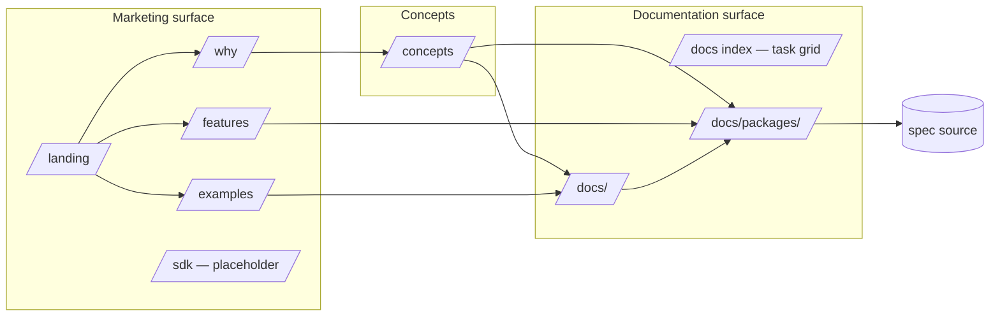

# Public Site

<!--
  Section headers below are STABLE ANCHORS. Magpie extracts content by header,
  so do not rename or reorder them. Doing so is a process change requiring its
  own spec.

  Sections marked **Public** are extracted by Magpie for the public site.
  Sections marked **Internal** are engineering-only and never appear in published docs.
-->

## Public Summary

<!-- **Public.** One paragraph in end-user voice. The canonical description for the site and README. -->

The Glacier public site at `https://nathanbrophy.github.io/glacier/` is a static site built with VitePress that combines a marketing surface and a reference documentation surface. It reuses the canonical brand identity from spec 0001 — polar-bear mascot, ANSI Shadow wordmark with the 6-stop ice gradient, "Less plumbing. More Go." tagline — and presents the framework shape from spec 0002 as a navigable, dev-first experience. Marketing pages explain what Glacier is, why a Go developer would reach for it, and how the 14-package suite interlocks. Documentation pages walk concrete tasks ("Build a CLI", "Write tests", "Mock HTTP", etc.) and resolve to per-package reference pages whose content is anchored to the accepted spec for that package via a content-extraction contract.

## Mental Model

<!-- **Public.** The conceptual frame a developer should hold while using this. Mermaid diagrams welcome. Source for the "Concepts" page on the site. -->

The site has two surfaces sharing one chrome:



A visitor who arrives via the landing page can scroll the marketing density (hero → install → 4 pillars → Promise → 14-package grid → before/after code → mini-FAQ → footer) without ever leaving `/`. A visitor looking for reference lands on `/docs` (the task grid), picks a task page, and threads through to the relevant package page; from there the spec source for that package is one click away. `/concepts` introduces the kernel/mid/leaves mental model from spec 0002 *before* a visitor encounters a "Tier 0" badge with no priors. The same nav and the same chrome serve both audiences.

The site is dark-only by design — Glacier's brand is dark-first per spec 0001 D6. Light-mode tokens are deferred until a future spec amendment.

## Goals

<!-- **Internal.** Bulleted list. -->

- Stand up the public face of Glacier on GitHub Pages with a build that succeeds locally and in CI.
- Reuse the canonical brand assets from spec 0001 (banner, wordmark, mascot, palette, tagline, voice) — the site does not redefine them.
- Present the framework shape from spec 0002 (14 packages, three tiers) as a navigable suite, with `/concepts` introducing the mental model.
- Surface spec 0001's four-statement Promise on the site so it is testable per spec 0001 §Test Matrix row "Promise satisfaction."
- Author the content extraction contract that lets Magpie generate per-package reference pages from accepted spec sections (`Public Summary`, `Mental Model`, `API`, `Examples`, `FAQ`) without hand-duplication, with a SHA-256 checksum mechanism for drift detection.
- Lock the multi-page IA, dense-but-disciplined landing, task-organized docs (only for workflows composing 2+ packages), dark-first dark-only theme, aurora atmospheric backdrop, SVG wordmark with embedded ice gradient, kaomoji-canonical mascot with a small illustrated companion sprite.
- Lock the deploy pipeline (GitHub Actions → official Pages action, SHA-pinned, scoped tokens, `pull_request`-only PR-checks) and the test matrix Lynx signs off on.
- Amend spec 0001 to admit a single new asset class — the small illustrated companion sprite — under tightly scoped, enumerated placement and size constraints.
- Justify each direct site dependency. Per project rule (memory: supply-chain minimalism scope is Go-only), npm dependency *minimization* is not a goal; license/lockfile/SHA/no-CDN/no-telemetry guarantees are.

## Non-Goals

<!-- **Internal.** Bulleted list. What this spec deliberately excludes. -->

- A custom domain (`glacier.dev` or similar). v1 ships on `nathanbrophy.github.io/glacier`.
- Light-mode theme tokens. A future spec amendment.
- A blog, changelog, or release-notes surface.
- Versioned docs. v1 publishes a single `latest`.
- Internationalization.
- `/install` as a standalone page. Install instructions live in the landing hero and the README; a dedicated `/install` page would split the install story across two surfaces with no reader benefit.
- `/contributing` as a standalone page. Contributor guidance lives in repo-root `CONTRIBUTING.md` and is linked from the footer; that is the GitHub-native discovery path.
- `/security` as a standalone page. Vulnerability reporting lives in repo-root `SECURITY.md` per GitHub conventions and is linked from the footer.
- `/glossary` as a standalone page. Concepts the site uses are defined in `/concepts` and within the spec they cite.
- Dynamic content (search-as-a-service, comments, analytics dashboards). VitePress local-search is the only search; analytics ship only with explicit user opt-in via a future amendment.
- Full content for `/sdk`. The dogfooded Glacier SDK CLI binary is deferred to spec 0032; v1's `/sdk` is a framed placeholder.
- Auto-generation tooling for per-package reference pages. v1 hand-writes each package page in the shape the contract describes, with a checksum guard to detect drift; auto-extraction is a follow-up tooling spec.
- A npm-published theme. The VitePress theme overrides live inside `/site/.vitepress/theme/` and are not extracted.
- Hosting any user-submitted content (forms, comments, telemetry).
- URL stability before Glacier reaches v1.0.0. See `## API` route-stability rule.

## Architecture

<!-- **Internal.** Mermaid diagram + prose. Package layout, data flow, lifecycle. -->

### Information architecture

| URL | File | Surface | Role |
|---|---|---|---|
| `/` | `site/index.md` | Marketing | Landing — hero, install, 4 pillars, Promise (with `#promise` anchor), 14-package grid, code-compare, mini-FAQ, footer |
| `/why` | `site/why.md` | Marketing | Each of the four pillars exploded into a section with diagrams and Go snippets |
| `/features` | `site/features.md` | Marketing | The 14-package suite as a feature index, one card per package, headline + teaser snippet |
| `/examples` | `site/examples.md` | Marketing | 6–8 marquee recipes; each card links to a `/docs/<task>` page |
| `/sdk` | `site/sdk.md` | Marketing | Framed placeholder for the dogfooded Glacier SDK CLI binary (deferred to spec 0032) |
| `/concepts` | `site/concepts.md` | Concepts | Introduces the kernel/mid/leaves mental model from spec 0002 §Mental Model; tier diagram; the cross-cutting conventions; entry point cited by every package page's tier badge |
| `/docs/` | `site/docs/index.md` | Reference | Task grid landing |
| `/docs/building-a-cli` | `site/docs/building-a-cli.md` | Reference | Task page composing `cli` + kernel |
| `/docs/writing-tests` | `site/docs/writing-tests.md` | Reference | Task page composing `assert` + `fixture` + `mock` |
| `/docs/mocking-http` | `site/docs/mocking-http.md` | Reference | Task page composing `httpmock` + `httpc` |
| `/docs/loading-config` | `site/docs/loading-config.md` | Reference | Task page composing `conf` + kernel |
| `/docs/structured-logging` | `site/docs/structured-logging.md` | Reference | Task page composing `log` + `errs` + `obs` |
| `/docs/observability` | `site/docs/observability.md` | Reference | Task page composing `obs` + `log` + `httpc` |
| `/docs/concurrency` | `site/docs/concurrency.md` | Reference | Task page composing `concur` + `errs` |
| `/docs/packages/<name>` | `site/docs/packages/<name>.md` | Reference | One page per Glacier package; 14 pages total. Cross-reference from task pages. Tier badge linking back to `/concepts`. |

**Task page rule (binding for v1):** a task page exists only for a workflow that composes **two or more** packages. Workflows that map to a single package live on the package page only. This eliminates duplicate surfaces (e.g. `/docs/functional-options` would have paraphrased `/docs/packages/option`). Adding a single-package task page is forbidden without a spec amendment lifting this rule.

**Sidebar grouping** — task pages live under "Tasks" (capability-ordered: build → test → integrate → run); package pages live under "Packages" with three tier sub-groups (Kernel / Mid / Leaves) that mirror spec 0002.

**Sidebar cross-reference shape (binding):**
- Every task page renders a "**Packages used:**" badge row immediately under its title, listing each linked package by name with its tier color.
- Every package page renders a "**Used in tasks:**" badge row immediately under its title (or "Used in tasks: none" if no current task page composes it), listing each linked task page.
- Every package page renders a "**Tier:**" badge that links to the `/concepts#tier-<tier>` anchor.

The top nav holds: `Why`, `Features`, `Examples`, `Concepts`, `Docs`, `SDK`, GitHub icon link.

**Responsive design.** The site is responsive. Breakpoints follow VitePress defaults: mobile ≤ 640px, tablet 641–768px, desktop ≥ 769px. The hero terminal demo collapses below the kaomoji on narrow viewports (the side-by-side layout requires ≥ 768px). The aurora backdrop renders on all viewports; reduced-motion still applies. The sidebar collapses into a hamburger control at ≤ 768px.

### Repo layout

```
/site/
├── package.json
├── package-lock.json               # committed; npm ci frozen
├── .npmrc                          # registry=https://registry.npmjs.org/; ignore-scripts=true
├── README.md                       # short pointer to this spec
├── .vitepress/
│   ├── config.ts                   # nav, sidebar, head meta, base: '/glacier/', sitemap config
│   ├── theme/
│   │   ├── index.ts                # extends DefaultTheme
│   │   ├── Layout.vue              # wraps DefaultTheme.Layout with AuroraBackdrop
│   │   ├── components/
│   │   │   ├── HeroTerminal.vue    # animated terminal demo with aria-live region
│   │   │   ├── MascotKaomoji.vue   # state-shifting kaomoji at hero scale; aria-label per state
│   │   │   ├── MascotSprite.vue    # small illustrated companion (footer/404/empty/scroll-top)
│   │   │   ├── WordmarkSVG.vue     # the ANSI-Shadow wordmark with embedded ice gradient
│   │   │   ├── AuroraBackdrop.vue  # 30s drifting gradient field; reduced-motion safe
│   │   │   ├── PillarCard.vue      # "why" pillar block
│   │   │   ├── PromiseSection.vue  # renders the four Promise statements from spec 0001
│   │   │   ├── PackageGrid.vue     # 14-package grid (3 tiers, color-tagged)
│   │   │   ├── PackagesUsedBadges.vue  # task-page header badge row
│   │   │   ├── UsedInTasksBadges.vue   # package-page header badge row
│   │   │   ├── TierBadge.vue           # links to /concepts#tier-<tier>
│   │   │   └── CodeCompare.vue     # before/after Go snippet pair
│   │   └── styles/
│   │       ├── tokens.css          # palette + type tokens from spec 0001
│   │       └── prose.css           # documentation prose styling
│   └── data/
│       ├── packages.ts             # 14-package manifest (name, slug, tier, teaser)
│       └── sidebar.ts              # task→packages and package→tasks cross-reference table
├── public/                         # VitePress public assets root (sibling of index.md, NOT inside .vitepress/)
│   ├── wordmark.svg                # generated from spec 0001 D40 source
│   ├── mascot/
│   │   ├── companion-idle.svg
│   │   ├── companion-wave.svg
│   │   └── companion-thinking.svg
│   ├── fonts/
│   │   ├── Inter-{400,500,600}.woff2 + OFL.txt
│   │   ├── SpaceGrotesk-{500,700}.woff2 + OFL.txt
│   │   └── JetBrainsMono-{400,700}.woff2 + OFL.txt
│   └── og-card.png                 # social preview card
├── tests/
│   ├── e2e/                        # Playwright
│   │   ├── 404.spec.ts
│   │   ├── og-meta.spec.ts
│   │   ├── reduced-motion.spec.ts
│   │   ├── scroll-to-top.spec.ts
│   │   ├── sidebar.spec.ts
│   │   ├── routes.spec.ts          # nav + base path + console-error gate
│   │   ├── a11y.spec.ts            # axe-core sweep across all routes
│   │   └── mobile.spec.ts          # 375x667 viewport assertions
│   ├── unit/                       # Vitest
│   │   ├── packages-manifest.spec.ts
│   │   ├── wordmark-svg.spec.ts    # path count + gradient stops
│   │   ├── mascot-kaomoji.spec.ts  # aria-label per state, raw kaomoji aria-hidden
│   │   └── hero-terminal.spec.ts   # aria-live, output accumulation
│   └── fixtures/
│       └── hero-script.fixture.ts  # canonical TerminalLine[] shared by component+e2e
├── scripts/
│   ├── check-site.sh               # orchestrator: runs all check-* below in order
│   ├── check-sprite-budget.sh
│   ├── check-sprite-placement.sh
│   ├── check-voice.sh              # banned-superlative grep across site/**
│   ├── check-action-pins.sh        # asserts SHA pin + zero @v tag survival
│   ├── check-base-path.sh
│   ├── check-no-cdn.sh             # all known CDN origins, not just google
│   ├── check-no-telemetry.sh       # tracker-script regression guard
│   ├── check-svg-safety.sh         # <script>, <foreignObject>, external href
│   ├── check-spec-links.sh
│   └── check-extraction-directives.sh   # presence + source-checksum mismatch
├── index.md
├── why.md                          # contains #promise anchor
├── features.md
├── examples.md
├── sdk.md
├── concepts.md
└── docs/
    ├── index.md
    ├── <task>.md (×7)
    └── packages/
        └── <name>.md (×14)
```

### Visual system

- **Theme:** dark-only. No light-mode toggle. Tokens come from spec 0001's palette table; `tokens.css` exposes them as CSS custom properties (`--mg-bg`, `--mg-surface`, `--mg-text`, `--mg-cyan`, etc.). Gradient stops (`--mg-cyan-100`, `--mg-cyan-700`, `--mg-teal-700`) are used only inside the wordmark SVG and the aurora backdrop.
- **Typography:** Inter (body), Space Grotesk (display), JetBrains Mono (code). All three vendored as WOFF2 from `/site/.vitepress/public/fonts/`. Each font's `OFL.txt` is committed alongside the WOFF2 file *and* the build copies the OFL texts into `dist/fonts/` so the SIL OFL 1.1 license travels with every distributed font binary. `@font-face` rules use `font-display: swap` so users see fallback text immediately rather than FOIT.
- **Wordmark rendering:** the block-character wordmark from spec 0001 D40 is rendered as SVG. Each block character maps to a vector `<path>`; the gradient lives once in `<defs><linearGradient id="ice">` with the six stops from spec 0001 D41. The plain-text source in `assets/logo/wordmark.txt` remains the canonical bytes per spec 0001 — the SVG is a render derivative, not a replacement.
- **Mascot:**
  - **Kaomoji-canonical** at hero scale (≈`clamp(64px, 8vw, 120px)` font-size, monospace). State shifts driven by an event prop, mapped one-to-one to spec 0001 D45: `calm → confident → thinking → alarmed → error`. Component sets a per-state `aria-label` (e.g. `aria-label="Glacier mascot, calm"`) and marks the raw kaomoji span `aria-hidden="true"` so screen readers announce the human label rather than mangle the kaomoji codepoints.
  - **Companion sprite** (small, illustrated, three states: `idle`, `wave`, `thinking`) used **only** in: (1) page footer, (2) 404 page, (3) docs sidebar empty states, (4) the scroll-to-top button. Never replaces the kaomoji at hero scale. Each SVG ≤ 4 KB gzipped. See `Migration & Compatibility` for the spec 0001 amendment that admits this asset class. Each companion SVG sets `aria-label` and `role="img"`.
- **Atmospheric backdrop:** `AuroraBackdrop.vue` layers two radial gradients drifting on a 30-second CSS keyframe loop. Opacity caps at 0.18; honors `@media (prefers-reduced-motion: reduce)` by freezing the animation with `animation: none`. Renders behind the hero only; not behind body content.
- **Voice:** spec 0001 D11 holds (the superlative ban). One landing-only "bolder" hero phrase is allowed (see Decisions D-S4) provided it contains zero banned words and is reviewed by Magpie + Otter. The voice grep audit (spec 0001 §Verification step 5) is expanded by Amendment B in §Migration & Compatibility.

### Content extraction contract

Per `## API` below, package reference pages do not duplicate spec content; they alias it. Each `/docs/packages/<name>` page consists of:

1. A page header: package name, the `<TierBadge>`, `<UsedInTasksBadges>` row, and a "View source spec →" link to the spec ID.
2. Five `<!-- magpie:extract source=specs/<NNNN-name>.md section=<id> source-checksum=<sha256> -->` directive blocks — one for each section in `docs-extract`. The `source-checksum` is the SHA-256 of the source spec section's contents at extraction time. v1 hand-authors the content inside each directive block; future tooling (Magpie auto-gen) replaces the contents mechanically by reading the source spec.
3. The CI script `check-extraction-directives.sh` recomputes the SHA-256 of each cited source section and fails the build on mismatch, surfacing drift between hand-authored copy and the spec. Reviewer-checklist drift detection is human and rots; the checksum is mechanical and doesn't.

**`docs-extract` enforcement:** any spec referenced by a `/docs/packages/<name>` page MUST list all five sections (`public-summary`, `mental-model`, `api`, `examples`, `faq`) in its `docs-extract` frontmatter array. `check-extraction-directives.sh` enforces this. If a section is genuinely empty in source (e.g. `## API` for a no-API spec like 0001), the spec must contain the section with a one-line placeholder ("N/A — this spec introduces no Go API."); the package page then renders the section with a "section not yet documented" stub linking to the source spec.

### Build & deploy

- VitePress builds `/site/` to `/site/.vitepress/dist/`.
- Vite config sets `base: '/glacier/'` so relative URLs resolve under the GitHub Pages subpath.
- VitePress sitemap plugin emits `dist/sitemap.xml` covering every route.
- A `.npmrc` at `/site/.npmrc` pins `registry=https://registry.npmjs.org/` and `ignore-scripts=true` to defend against dependency-confusion attacks and post-install script execution.
- Deploy: `.github/workflows/site-deploy.yml` triggers on `push` to `main` when paths under `site/**`, `specs/**`, or the workflow file itself change. Steps:
  1. `actions/checkout@<40-char-SHA>` (every action SHA-pinned per Falcon's hardening rules; tag pins forbidden).
  2. `actions/setup-node@<SHA>` with Node 20 LTS, npm cache.
  3. `npm ci --ignore-scripts` inside `/site` (frozen lockfile; no post-install scripts execute).
  4. `npm run build` inside `/site`.
  5. `actions/upload-pages-artifact@<SHA>` on `site/.vitepress/dist`.
  6. `actions/deploy-pages@<SHA>` to the `github-pages` environment.
  - `permissions:` block scopes only `id-token: write` and `pages: write`; no `contents: write`, no `repo`-wide token.
- PR checks: `.github/workflows/site-pr-checks.yml` runs on `pull_request` (NOT `pull_request_target` — that variant grants fork PRs access to repo secrets and is forbidden here). The PR-checks workflow's `permissions:` block is `contents: read` only, and no secrets are passed to PR-check jobs. Steps: `npm ci --ignore-scripts && npm run build`, then `linkinator` link check on built HTML, `axe-core` accessibility scan via Playwright across every route, and `lighthouse-ci` with thresholds asserted. After install/build, the orchestrator `bash scripts/check-site.sh` runs every static check (sprite budget, sprite placement, voice, action pins, base path, no-CDN, no-telemetry, SVG safety, spec links, extraction directives + checksums) and fails the build on any non-zero exit.

### Lifecycle

- **Local dev:** `cd site && npm install && npm run dev` boots VitePress at `http://localhost:5173/glacier/` with HMR.
- **Local static preview:** `npm run build && npx serve site/.vitepress/dist` — serves the deployed artifact identically to GH Pages.
- **CI preview:** PR-checks workflow uploads the artifact; reviewers download and `serve` locally for visual sign-off.
- **Production:** push to `main` → workflow → `https://nathanbrophy.github.io/glacier/` within ~3 minutes.

## Schema

<!-- **Internal.** Go types with invariants stated as `// invariant: ...` comments on each field. -->

This spec introduces no Go types. The site introduces a small TypeScript schema for the theme component contract and the package manifest:

```ts
// site/.vitepress/types.ts
export type MascotState = 'calm' | 'confident' | 'thinking' | 'alarmed' | 'error'
// invariant: every value maps one-to-one to spec 0001 D45.

export type CompanionState = 'idle' | 'wave' | 'thinking'
// invariant: enumerated by spec 0031 §Architecture / Visual system / Mascot.

export type Tier = 'kernel' | 'mid' | 'leaf'
// invariant: matches spec 0002 §Architecture three-tier DAG.

export interface TerminalLine {
  kind: 'cmd' | 'out'
  text: string
  mascotState?: MascotState     // optional; if present, sibling MascotKaomoji shifts state
}

export interface PackageManifestEntry {
  name: string                  // canonical lowercase name (e.g. "option")
  slug: string                  // URL slug; usually equals name
  tier: Tier
  teaser: string                // ≤ 120 char one-line headline
  specId: string                // e.g. "0003"
}

export type PackageManifest = readonly PackageManifestEntry[]
// invariant: length === 14; tier counts {kernel: 5, mid: 5, leaf: 4} per spec 0002.
```

## API

<!-- **Public.** Every exported symbol introduced by this spec. ... -->

The site introduces no Go API. Its public contract has three parts.

### 1. Routes

| Route pattern | Status code | Returns |
|---|---|---|
| `/` | 200 | Landing HTML |
| `/why`, `/features`, `/examples`, `/sdk`, `/concepts` | 200 | Marketing/concepts page HTML |
| `/docs/`, `/docs/<task>`, `/docs/packages/<name>` | 200 | Reference page HTML |
| `/404.html` | 404 | Custom 404 page (companion sprite `wave` + nav back to `/`) |
| any other path | 404 | Same 404 body served by GH Pages |

**Route stability rule:** URLs are NOT stable until Glacier reaches v1.0.0. Pre-v1 site versions may rename or restructure routes; readers should expect link rot in this period and the site does not commit to redirect entries. From v1.0.0 onward, route renames require a redirect entry in `.vitepress/config.ts` (HTML `<meta http-equiv="refresh">` since GH Pages cannot serve 301s) and the rename must be called out in the v1.0.0+ release notes.

### 2. Magpie content-extraction directive

The site authors per-package pages with the directive block syntax below. v1 fills the block by hand; future tooling replaces the block contents mechanically.

```html
<!-- magpie:extract source=specs/<NNNN-name>.md section=<section-id> source-checksum=<sha256-hex> -->
…hand-authored content sits here in v1; future tooling rewrites this region…
<!-- /magpie:extract -->
```

| Attribute | Type | Required | Description |
|---|---|---|---|
| `source` | path | yes | Path to the source spec relative to repo root |
| `section` | enum | yes | One of `public-summary`, `mental-model`, `api`, `examples`, `faq` (matches the `docs-extract` array in spec frontmatter) |
| `source-checksum` | hex | yes | SHA-256 of the source section's bytes (header line through final newline before next `## ` header). Recomputed by `check-extraction-directives.sh` |

`check-extraction-directives.sh` enforces:
- Every `/docs/packages/<name>` page contains directive blocks for all five sections in order.
- Every `source` resolves to an existing file; every `section` is a valid enum value; the source spec's frontmatter `docs-extract` array contains the cited section.
- The recomputed SHA-256 of each source section matches the directive's `source-checksum`. Mismatch fails the build with a diff message ("source spec section has drifted; either update the spec, update the package page, or update the checksum after deliberate review").

### 3. Theme component contract (Vue, internal to `/site/`)

Internal API used by `/site/.vitepress/theme/` and the page Markdown only. Not published, not stable across major site versions.

| Component | Props (TypeScript) | Description |
|---|---|---|
| `<WordmarkSVG />` | `{ size?: 'hero' \| 'nav' }` (default `nav`) | Renders the ANSI-Shadow wordmark SVG with the ice gradient |
| `<MascotKaomoji />` | `{ state: MascotState; scale?: number }` (default `calm`, `1`) | Renders the kaomoji per spec 0001 D45; sets `aria-label="Glacier mascot, <state>"` and `aria-hidden` on the raw kaomoji span |
| `<MascotSprite />` | `{ state: CompanionState; size?: number }` (default `idle`) | Renders the companion sprite SVG; sets `role="img"` and `aria-label` |
| `<HeroTerminal />` | `{ script: TerminalLine[] }` | Animates a typed terminal sequence; an `aria-live="polite"` region accumulates the rendered output text; emits `mascotState` updates to a sibling `<MascotKaomoji>` via injection key |
| `<AuroraBackdrop />` | `{}` | Renders the atmospheric gradient; honors `prefers-reduced-motion` |
| `<PillarCard />` | `{ title: string; headline: string }` + slot=`details` | A single "why" pillar block |
| `<PromiseSection />` | `{}` | Renders the four Promise statements verbatim from spec 0001 §Examples §The Promise |
| `<PackageGrid />` | `{}` | Renders the 14-package grid by reading `data/packages.ts` |
| `<PackagesUsedBadges />` | `{ packageNames: string[] }` | Task-page header badge row |
| `<UsedInTasksBadges />` | `{ taskSlugs: string[] }` | Package-page header badge row (renders "Used in tasks: none" if empty) |
| `<TierBadge />` | `{ tier: Tier }` | Links to `/concepts#tier-<tier>` |
| `<CodeCompare />` | `{ withTitle?: string; withoutTitle?: string }` + slots=`with`,`without` | Side-by-side Go snippets |

## Examples

<!-- **Public.** Runnable Go examples in fenced ```go blocks. ... -->

The site introduces no Go API; "examples" here are concrete content sketches the implementation builds against.

### Landing page wireframe (text mockup)

```text
┌────────────────────────────────────────────────────────────────────────────┐
│ [WordmarkSVG nav]    Why  Features  Examples  Concepts  Docs  SDK  [GH]  │
├────────────────────────────────────────────────────────────────────────────┤
│  ⟨ AuroraBackdrop drifting ⟩                                               │
│                                                                            │
│      ʕ•ᴥ•ʔ          ┌─ glacier ──────────────────────────────────┐         │
│      (kaomoji)      │ $ go get github.com/nathanbrophy/glacier  │         │
│      120px          │ $ go run ./cmd/example                    │         │
│      reacts to ──→  │ ʕ•ᴥ•ʔ glacier: ready                      │         │
│      output below   │ ʕ⌐■-■ʔ serving on :8080                   │         │
│                     │ █                                          │         │
│                     └────────────────────────────────────────────┘         │
│                                                                            │
│         Less plumbing. More Go.                                            │
│         ⟨ one bolder phrase, negotiated, no banned words ⟩                 │
│                                                                            │
│      [ Get started ]   [ Read the docs ]                                   │
├────────────────────────────────────────────────────────────────────────────┤
│  ## Why Glacier                                                            │
│  ┌──────────────┐ ┌──────────────┐ ┌──────────────┐ ┌──────────────┐       │
│  │ Less plumb.  │ │ Curated      │ │ Generics-    │ │ Test-first,  │       │
│  │ More Go.     │ │ suite.       │ │ first.       │ │ dogfooded.   │       │
│  └──────────────┘ └──────────────┘ └──────────────┘ └──────────────┘       │
├────────────────────────────────────────────────────────────────────────────┤
│  ## The Promise                                            ⟨#promise⟩      │
│  • "I'm only writing what's mine."                                         │
│  • "I trust the defaults."                                                 │
│  • "The error tells me what to do next."                                   │
│  • "Tests are easy because the framework helps."                           │
├────────────────────────────────────────────────────────────────────────────┤
│  ## The 14-package suite                                                   │
│  KERNEL  option · errs · log · assert · term                               │
│  MID     concur · fluent · conf · fixture · obs                            │
│  LEAVES  cli · mock · httpmock · httpc                                     │
├────────────────────────────────────────────────────────────────────────────┤
│  ## With Glacier vs. without                                               │
│  ┌─────────── without ───────────┐  ┌──────────── with ─────────────┐      │
│  │ // 60 lines of flag.Parse,   │  │ // 8 lines of struct +        │      │
│  │ // env shimming, signal       │  │ // glacier.Run                │      │
│  │ // wiring, ...                │  │                                │      │
│  └───────────────────────────────┘  └────────────────────────────────┘      │
├────────────────────────────────────────────────────────────────────────────┤
│  ## Mini-FAQ           ## Get started           ## Specs                   │
│                                                                            │
│  [MascotSprite idle]                                                        │
│  Glacier — Apache-2.0  ·  github.com/nathanbrophy/glacier                  │
└────────────────────────────────────────────────────────────────────────────┘
```

### Per-package reference page wireframe (e.g. `/docs/packages/option`)

```text
# option                                              [ KERNEL · Tier 0 ]
                                                      [ View source spec → ]
**Used in tasks:** [ Building a CLI ]  [ Loading config ]  [ Writing tests ]

<!-- magpie:extract source=specs/0003-option.md section=public-summary source-checksum=<sha256> -->
Functional-options kernel. Every Glacier package configurable at construction
takes `option.Option[T]` values. `Apply` composes them; `Validate` rejects
invalid combinations; `Required` fails fast on omission.
<!-- /magpie:extract -->

## Mental model
<!-- magpie:extract source=specs/0003-option.md section=mental-model source-checksum=<sha256> -->
…
<!-- /magpie:extract -->

## API
<!-- magpie:extract source=specs/0003-option.md section=api source-checksum=<sha256> -->
…
<!-- /magpie:extract -->

## Examples
<!-- magpie:extract source=specs/0003-option.md section=examples source-checksum=<sha256> -->
…
<!-- /magpie:extract -->

## FAQ
<!-- magpie:extract source=specs/0003-option.md section=faq source-checksum=<sha256> -->
…
<!-- /magpie:extract -->
```

### Companion sprite — three states (descriptive brief)

| State | Use | Brief |
|---|---|---|
| `idle` | Footer; sidebar empty state | Standing polar bear, three-quarter view, calm expression. Block-character aesthetic — orthogonal SVG paths, no curves. ≤ 4 KB gzipped. |
| `wave` | 404 page | Same bear, one paw raised. ≤ 4 KB gzipped. |
| `thinking` | "Coming soon" placeholders (`/sdk`); scroll-to-top button | Same bear, head tilted, one paw at chin. ≤ 4 KB gzipped. |

### Hero terminal demo script (canonical fixture)

```ts
// site/tests/fixtures/hero-script.fixture.ts
import type { TerminalLine } from '../../.vitepress/types'

export const heroScript: TerminalLine[] = [
  { kind: 'cmd', text: 'go get github.com/nathanbrophy/glacier' },
  { kind: 'out', text: 'go: added github.com/nathanbrophy/glacier' },
  { kind: 'cmd', text: 'go run ./cmd/example' },
  { kind: 'out', text: 'ʕ•ᴥ•ʔ glacier: ready',         mascotState: 'calm' },
  { kind: 'out', text: 'ʕ⌐■-■ʔ serving on :8080',      mascotState: 'confident' },
]
```

The fixture is shared by `tests/unit/hero-terminal.spec.ts` (asserts the live region accumulates correctly) and the e2e tests (asserts the rendered hero matches).

## Test Matrix

<!-- **Internal.** Owned by Lynx. ... -->

Every row's `Covered by` cell names a specific test file, test name, or CI script. No row says "manual".

| Scenario | Input | Expected | Covered by |
|---|---|---|---|
| Production build succeeds | `npm ci --ignore-scripts && npm run build` in `/site` | Exit 0, no warnings, `dist/` populated | `site-deploy.yml` build step + `tests/e2e/routes.spec.ts > build-artifact-present` |
| Static preview parity | `npx serve site/.vitepress/dist` after build | Every nav route loads, identical visual output to dev mode, zero `console.error` events | `tests/e2e/routes.spec.ts > parity-with-dev` (uses `page.on('console')` and asserts errors === 0) |
| Dev server boots | `npm run dev` | Server listens on `:5173/glacier/`, HMR active | `tests/e2e/routes.spec.ts > dev-hmr` |
| Wordmark SVG matches spec topology | Read `site/.vitepress/public/wordmark.svg` | `<path>` count matches reference (78 paths for the 12 glyphs); `<linearGradient id="ice">` has exactly 6 `<stop>` elements with `stop-color` values matching spec 0001 D41 hex stops | `tests/unit/wordmark-svg.spec.ts > path-count`, `> gradient-stops` |
| Kaomoji state shifts on terminal output | Mount `<HeroTerminal>` with `heroScript` fixture; advance fake timers | Sibling `<MascotKaomoji>` cycles `calm → confident` in sync; `aria-label` updates per state | `tests/unit/mascot-kaomoji.spec.ts > state-aria-labels`, `tests/unit/hero-terminal.spec.ts > emits-mascot-state` |
| Kaomoji a11y | Render `<MascotKaomoji state="X">` for every `MascotState` | `aria-label` set to spec 0001 D45 human name (e.g. `"Glacier mascot, calm"`); raw kaomoji span has `aria-hidden="true"` | `tests/unit/mascot-kaomoji.spec.ts > aria-label-per-state`, `> kaomoji-aria-hidden` |
| Terminal demo aria-live | Mount `<HeroTerminal>` with `heroScript` fixture | A region with `aria-live="polite"` exists; rendered output text accumulates inside it as the script advances | `tests/unit/hero-terminal.spec.ts > aria-live-region`, `> output-accumulates` |
| Reduced-motion respected | `page.emulateMedia({ reducedMotion: 'reduce' })`; navigate `/` | `<HeroTerminal>` container has `data-state="complete"` immediately (end-state rendered without animation); aurora element has `getComputedStyle(...).animationName === 'none'` | `tests/e2e/reduced-motion.spec.ts > terminal-end-state`, `> aurora-frozen` |
| 404 page renders | Visit `/glacier/does-not-exist` | HTTP status 404; `<MascotSprite state="wave">` present (queried by `[data-testid="companion-wave"]`); nav link to `/` present | `tests/e2e/404.spec.ts > status-404`, `> wave-sprite-present`, `> nav-link-home` |
| OG card meta tags | Visit `/`, read `<head>` | `<meta property="og:image">` resolves to `/glacier/og-card.png`; `og:title`, `og:description`, `twitter:card="summary_large_image"` all present and non-empty | `tests/e2e/og-meta.spec.ts > all-required-tags` |
| Sitemap.xml present | `GET /glacier/sitemap.xml` after build | Status 200; XML; lists every route from §Architecture IA table | `tests/e2e/routes.spec.ts > sitemap-presence-and-coverage` |
| Companion sprite size budget | `gzip -c site/.vitepress/public/mascot/companion-<state>.svg \| wc -c` for each of 3 states | ≤ 4096 bytes per file | `scripts/check-sprite-budget.sh` |
| Companion sprite placement | Static analysis of `.vue` and `.md` files | `<MascotSprite>` appears only in: footer slot, 404 page, sidebar empty-state slot, scroll-to-top button | `scripts/check-sprite-placement.sh` |
| SVG safety | Read every committed `.svg` under `site/` | Zero matches for `<script`, `<foreignObject`, `xlink:href.*http`, `href="http` | `scripts/check-svg-safety.sh` |
| No-CDN at runtime | Grep built `dist/` for external origins | Zero matches for `googleapis.com`, `gstatic.com`, `unpkg.com`, `jsdelivr.net`, `cdn.jsdelivr.net`, `cdnjs.cloudflare.com`, `fonts.bunny.net`, `polyfill.io` | `scripts/check-no-cdn.sh` |
| No-telemetry regression | Grep built `dist/` for tracker identifiers | Zero matches for `sendBeacon`, `gtag(`, `_gaq`, `_ga(`, `fbq(`, `googletagmanager`, `mixpanel`, `amplitude`, `segment.com`, `hotjar`, `clarity.ms`, `posthog`, `plausible`, `fathom-client`, `cookieStore`, `dataLayer.push` | `scripts/check-no-telemetry.sh` |
| Banned-superlative sweep | `grep -rEi 'blazing\|revolutionary\|best-in-class\|amazing\|seamless'` across `site/**` (`*.md`, `*.vue`, `*.ts`) | Zero matches | `scripts/check-voice.sh` |
| Dead-link sweep | `linkinator dist/` after build | Zero broken internal or external links | `site-pr-checks.yml` (linkinator step) |
| Accessibility (axe) — every route | `axe-core` via Playwright on `/`, `/why`, `/features`, `/examples`, `/sdk`, `/concepts`, `/docs`, every `/docs/<task>`, every `/docs/packages/<name>`, `/404` | Zero `serious` or `critical` violations on any route | `tests/e2e/a11y.spec.ts > sweep-all-routes` |
| Lighthouse thresholds | `lighthouse-ci` against `/`, `/why`, `/concepts`, `/docs`, `/docs/packages/option` | Performance ≥ 95, Accessibility ≥ 95, Best Practices ≥ 95, SEO ≥ 95 | `site-pr-checks.yml` (lighthouse-ci step) |
| WCAG contrast (AAA on text) | Computed contrast for `--mg-text` on `--mg-bg`, `--mg-cyan` on `--mg-bg` | ≥ 7:1 (AAA) | `tests/unit/contrast.spec.ts > aa-and-aaa` (re-verifies spec 0001 contrast claims) |
| Spec traceability | Every `/docs/packages/<name>` page links to `specs/<NNNN-name>.md` | All 14 pages have a `View source spec →` link with the correct spec ID | `scripts/check-spec-links.sh` |
| Magpie extraction directive presence + checksum | Every `/docs/packages/<name>` page has 5 directive blocks (one per `docs-extract` section) with valid `source-checksum` | All directive blocks present; recomputed SHA-256 of cited source section matches the directive's `source-checksum` | `scripts/check-extraction-directives.sh` |
| `docs-extract` exhaustive | Every spec referenced by a `/docs/packages/<name>` page has `docs-extract` containing all 5 section IDs | All 14 referenced specs pass | `scripts/check-extraction-directives.sh > docs-extract-exhaustive` |
| Packages manifest shape | Import `site/.vitepress/data/packages.ts` | Length === 14; tier counts {kernel: 5, mid: 5, leaf: 4}; every name unique; every `specId` resolves to an existing spec file | `tests/unit/packages-manifest.spec.ts > has-14-entries`, `> tier-counts`, `> spec-ids-resolve` |
| Base path correctness | Built `dist/index.html` `<a href>` references | All internal links resolve under `/glacier/`; no bare `/` references | `scripts/check-base-path.sh` |
| Lockfile pinned | `site/package-lock.json` exists and matches `package.json` | `npm ci --ignore-scripts` succeeds with frozen lockfile | `site-deploy.yml` (implicit in `npm ci`) |
| `.npmrc` registry pin | Read `site/.npmrc` | Contains `registry=https://registry.npmjs.org/` and `ignore-scripts=true` | `scripts/check-site.sh > npmrc` |
| No CDN font loads at runtime | grep built `dist/` for `fonts.googleapis.com`, `fonts.gstatic.com` | Zero matches (re-affirms spec 0001 D14) | `scripts/check-no-cdn.sh` (subsumes legacy fonts-only check) |
| Font OFL distribution | Inspect built `dist/fonts/` | Each WOFF2 has a sibling `OFL.txt` (or one per family); attribution traveling with the font binary | `scripts/check-site.sh > ofl-traveled` |
| Font-display: swap | Read built CSS for `@font-face` rules | Every rule has `font-display: swap` | `scripts/check-site.sh > font-display-swap` |
| GitHub Actions pinned by SHA | grep `.github/workflows/site-*.yml` for `uses:` lines | Every action reference uses a 40-char SHA AND zero `@v`-style tag pins survive | `scripts/check-action-pins.sh` |
| PR-checks workflow trigger | grep `.github/workflows/site-pr-checks.yml` | Trigger is `pull_request`; never `pull_request_target`; `permissions:` block is `contents: read` only | `scripts/check-action-pins.sh > pr-trigger-safe` |
| Scroll-to-top button keyboard a11y | `Tab` on `/` until focused; press `Enter` | Button is reachable, focus ring visible (≥ 3:1 contrast against background), `Enter` scrolls to top, accessible name is set | `tests/e2e/scroll-to-top.spec.ts > tab-reach`, `> enter-activates` |
| Sidebar collapse/expand on mobile | 375x667 viewport; tap hamburger; tap link | Sidebar opens on tap; link navigates and closes sidebar; `Esc` closes sidebar | `tests/e2e/sidebar.spec.ts > mobile-toggle`, `> esc-closes` |
| Mobile breakpoint sanity | 375x667 viewport on `/` | Hero terminal stacks below kaomoji; nav collapses to hamburger; no horizontal overflow | `tests/e2e/mobile.spec.ts > hero-stacked`, `> no-horizontal-overflow` |
| Promise surface present | Visit `/why`; query `#promise` | Section exists with the four spec 0001 Promise statements verbatim | `tests/e2e/routes.spec.ts > promise-section-on-why` |
| Concepts page exists | Visit `/concepts` | Page renders with kernel/mid/leaves tier diagram and three `#tier-<name>` anchors | `tests/e2e/routes.spec.ts > concepts-tier-anchors` |

## Dependency Justification

<!-- **Internal.** Owned by Falcon. ... -->

The site introduces three direct npm dependencies plus build-time-only dev dependencies and a vendored font set. All versions pinned to specific named releases (no version ranges, no `latest`). The `package-lock.json` is committed and `npm ci --ignore-scripts` is used in CI. The `/site/.npmrc` pins `registry=https://registry.npmjs.org/` (defense against dependency confusion) and `ignore-scripts=true` (defense against post-install code execution).

Per project rule (memory: supply-chain minimalism scope is Go-only), npm dep minimization is not enforced for `/site/`; license, lockfile, registry-pin, ignore-scripts, vuln, audit, and SHA-pin guarantees are.

| Module | Version | License | Last release | Maintainers | Alternatives considered | Why we can't roll our own |
|---|---|---|---|---|---|---|
| `vitepress` | `1.5.0` | MIT | 2024-12 release line, active multi-monthly cadence | Vue core team (Evan You + maintainers); 100+ contributors | Astro Starlight; Next.js static export; Nuxt static; plain Tailwind + custom MD generator | A docs-site framework with sidebar, nav, search, dark mode, MDX-style Vue-in-MD, and static export is ~10–15k LOC of well-tested infrastructure. VitePress is the closest "drop-in docs site" with active maintenance, MIT license, and Vue authoring (matching user preference per Round 3 decision). |
| `vue` | `3.5.13` | MIT | 2024-12, active monthly cadence | Vue core team; multi-org sponsorship | React; Svelte; Solid | Transitive of VitePress; declared directly because we author custom theme components in Vue SFCs. The reactive UI primitives required for `<HeroTerminal>` and `<MascotKaomoji>` would be ~2–3k LOC of homegrown code. |
| `vite` | `5.4.11` | MIT | 2024-11, active monthly cadence | Vue core team + Vite team; multi-org | Webpack; Parcel; esbuild standalone; Rollup standalone | Transitive of VitePress; used directly via `vite.config.ts` overrides. Build tool with HMR and ESM-native transforms; ~25k LOC. Building a static-site bundler is out of scope. |

**Concrete versions above are the proposed pin set as of spec authorship. Version bumps after acceptance are normal-PR work and do not require a spec amendment provided licenses, vuln scan, and lockfile discipline stay green.**

**DevDependencies (build/test only, never shipped):** `@playwright/test`, `axe-core`, `@axe-core/playwright`, `linkinator`, `@lhci/cli`, `vitest`, `@vue/test-utils`, `typescript`. Each pinned to a concrete version in `package.json` and `package-lock.json`. Each license-checked under the same allowlist as runtime deps.

**Vendored fonts** (not npm dependencies; checked in as WOFF2 under `/site/.vitepress/public/fonts/`):

| Font | Files | License | Source |
|---|---|---|---|
| Inter | 3 weights × 1 style = 3 WOFF2 | SIL OFL 1.1 | rsms.me/inter/ |
| Space Grotesk | 2 weights × 1 style = 2 WOFF2 | SIL OFL 1.1 | floriankarsten.com/spacegrotesk/ |
| JetBrains Mono | 2 weights × 1 style = 2 WOFF2 | SIL OFL 1.1 | jetbrains.com/mono |

Each font's `OFL.txt` is committed alongside the WOFF2 file AND the build copies the OFL texts into `dist/fonts/` so SIL OFL 1.1's "the license must accompany the font in all distributions" requirement is mechanically satisfied. Total vendored font weight ~180 KB; no network requests for fonts at runtime.

**Vulnerability scan:**
- `npm audit --audit-level=high` — covers all dependencies, runtime AND dev. (Earlier draft used `--omit=dev`; that excluded CI tooling like Playwright/lighthouse-ci that runs against built artifacts. A compromised devDep with high-severity RCE in CI is a real threat; auditing dev deps is mandatory.)
- `osv-scanner --lockfile site/package-lock.json` — explicit lockfile target; covers full transitive set including dev deps.
- Both gates fail the build on high-severity findings.

**License scan:** every transitive dep's license must be in the allowlist (MIT, BSD-2-Clause, BSD-3-Clause, Apache-2.0, ISC, SIL OFL 1.1, CC0-1.0). Falcon's `license-checker` runs in CI; non-allowlisted licenses fail the build.

## Security & Supply-Chain Notes

<!-- **Internal.** ... -->

- **Untrusted input:** the site accepts no user input. There are no forms, no comments, no telemetry callbacks, no analytics. Every byte is statically generated at build time from sources committed to the repo.
- **Embedded scripts:** VitePress emits hydration JS for Vue components. No third-party `<script src=...>` ships in built HTML.
- **CDNs at runtime:** none. Fonts vendored. SVGs and images same-origin. `scripts/check-no-cdn.sh` greps the build for `googleapis.com`, `gstatic.com`, `unpkg.com`, `jsdelivr.net`, `cdn.jsdelivr.net`, `cdnjs.cloudflare.com`, `fonts.bunny.net`, `polyfill.io` (the last one notorious for the 2024 supply-chain compromise).
- **Telemetry regression guard:** `scripts/check-no-telemetry.sh` greps for `sendBeacon`, `gtag(`, `_gaq`, `_ga(`, `fbq(`, `googletagmanager`, `mixpanel`, `amplitude`, `segment.com`, `hotjar`, `clarity.ms`, `posthog`, `plausible`, `fathom-client`, `cookieStore`, `dataLayer.push` and fails the build on any match. This catches future contributors slipping in trackers.
- **SVG asset safety:** `scripts/check-svg-safety.sh` greps every committed `.svg` for `<script`, `<foreignObject`, `xlink:href.*http`, `href="http` and fails on any match. Defends against XSS injection through the wordmark or companion sprite SVGs.
- **GitHub Actions hardening:** every `uses:` reference in `.github/workflows/site-*.yml` is pinned by 40-char SHA, never by tag. `scripts/check-action-pins.sh` enforces both the positive (every `uses:` has a SHA) and the negative (zero `@v`-style tag pins survive).
- **Workflow triggers:** `site-deploy.yml` triggers on `push` to `main`. `site-pr-checks.yml` triggers on `pull_request` ONLY — never `pull_request_target`, which grants fork PRs access to repo secrets even with SHA-pinned actions. `scripts/check-action-pins.sh > pr-trigger-safe` enforces.
- **Token scope:** deploy workflow uses `permissions: { id-token: write, pages: write }` only — no `contents: write`, no `repo`-wide token. PR-checks workflow uses `permissions: { contents: read }` only and receives no secrets.
- **Lockfile + registry + scripts discipline:** `package-lock.json` committed; `.npmrc` pins `registry=https://registry.npmjs.org/` and `ignore-scripts=true`; CI runs `npm ci --ignore-scripts`. Defends against (a) lockfile drift, (b) dependency confusion via misresolved registries, (c) post-install script execution by malicious deps.
- **Vulnerability gating:** `npm audit --audit-level=high` AND `osv-scanner --lockfile site/package-lock.json` block PRs on high-severity findings. Both cover full transitive set including dev deps.
- **License gating:** allowlist enforced by `license-checker`; transitive licenses outside the allowlist block the build. SIL OFL 1.1 license texts travel with the font binaries into `dist/fonts/`.
- **No telemetry, no fingerprinting:** the site sets no cookies, makes no `navigator.sendBeacon`, includes no analytics. The mechanical guard above catches regressions.
- **Reduced-motion respect:** all motion (aurora, terminal demo, kaomoji shifts) honors `prefers-reduced-motion: reduce`. Tested in CI.
- **OG card asset:** `og-card.png` is a static PNG generated once from the SVG wordmark + tagline; committed; not regenerated per build.

## Migration & Compatibility

<!-- **Internal.** Only required when this spec changes an accepted spec. ... -->

This spec amends the **verified** spec 0001 (Brand Identity) in two narrow ways. Per spec-process governance, an amendment to a verified spec requires the original owner's sign-off (Magpie) plus the same set of required reviewers as the original (Otter). Both are in this spec's reviewers list.

### Amendment A — admit a "companion sprite" asset class (tightly enumerated)

**Affected sentence in spec 0001 §Non-Goals (line 75):**

> "Branded merchandise, social-media cards, or external assets beyond the repo. Out of scope."

**Amended reading (binding from this spec's `accepted` date):**

> "Branded merchandise, social-media cards, or external assets beyond the repo. Out of scope, with the single exception of the **companion sprite** asset class as enumerated in spec 0031 §Architecture / Visual system / Mascot — three SVG states (`idle`, `wave`, `thinking`), ≤ 4 KB gzipped each, used only in the four placements listed (footer, 404 page, sidebar empty states, scroll-to-top button), committed in-repo at `/site/.vitepress/public/mascot/`, and never replacing the kaomoji at hero scale. Any extension of this asset class — different states, different placements, social-media cards, merchandise — is itself a spec amendment requiring Magpie + Otter sign-off."

The kaomoji forms (D43, D45) and the block-character banner mascot (D44) remain the canonical mascot.

### Amendment B — Voice grep audit scope expansion

**Affected step in spec 0001 §Verification step 5:**

> "Search the repo for forbidden superlatives:
> ```sh
> grep -rEi 'blazing|revolutionary|best-in-class|amazing|seamless' --include='*.md' --include='*.txt' .
> ```
> Expect zero matches in committed prose."

**Amended (binding from this spec's `accepted` date):** the grep also includes `--include='*.vue'` and `--include='*.ts'` and is run from repo root with `site/**` in scope. The CI script `scripts/check-voice.sh` (introduced by this spec) replaces manual execution. No banned words may appear anywhere in committed prose, including the negotiated bolder hero phrase.

### Mechanical follow-up

When this spec moves to `accepted`, Magpie opens a one-line PR amending spec 0001's frontmatter `last-updated` to a date `>= 2026-05-02` and adding a footnote in spec 0001 §Decisions referencing "see spec 0031 amendments A & B." That PR is review-only by Magpie and Otter — no full re-acceptance cycle, since the binding-amendment text lives here in spec 0031, which reviewers cite going forward.

No code or content change in the existing repo is required by these amendments — they only constrain future writing.

## FAQ

<!-- **Public.** ... -->

**Why VitePress and not Astro Starlight?**
VitePress's authoring model is Vue-in-Markdown, which matches the user's expressed preference and lets us write `<HeroTerminal>`, `<MascotKaomoji>`, and `<AuroraBackdrop>` as first-class Vue components. Starlight is excellent — Bun, Astro itself, and Cloudflare use it — but its component model is Astro/MDX, an additional framework to learn for a one-site project.

**Why is the site dark-only?**
Glacier brand is dark-first per spec 0001 D6. A light-mode pass is a separate spec amendment because every token in spec 0001 §Color Palette is bound to a dark-canvas role. Adding light tokens means re-running color theory across the whole palette and re-validating WCAG contrast — that's a spec, not a config flag.

**Why kaomoji *and* an illustrated companion?**
The kaomoji is the canonical mascot — it ships in the CLI binary, in commit messages, in agent prose. It's terminal-native by design. The companion sprite is a small, rich illustration that gives the *web surface* a friendlier secondary motif without supplanting the kaomoji. They live in different surfaces (kaomoji ↔ terminal; companion ↔ web margins) and never compete for the same role.

**How will per-package docs stay in sync with specs?**
v1 hand-authors each package page with `magpie:extract` directive blocks committed in place. Each directive carries a `source-checksum` (SHA-256 of the cited spec section); CI recomputes the checksum and fails the build on drift. Future tooling will replace the inside of each block mechanically; the checksum is also the migration target.

**Why no search?**
VitePress includes local in-page search out of the box, which is enough for v1. Cloud search (Algolia DocSearch / pagefind index) is a follow-up when content crosses ~50 pages.

**What about the dogfooded Glacier SDK CLI binary?**
Deferred to spec 0032. The site has a framed `/sdk` placeholder describing the dogfooding contract. When spec 0032 ships, `/sdk` becomes its public face.

**Will the site host telemetry or analytics?**
No. v1 ships zero telemetry, zero cookies, zero analytics, zero fingerprinting. A privacy-preserving server-log-only analytics pass is conceivable in a future spec, with explicit Falcon review and a visible disclosure.

**Why a 30-second aurora loop instead of a faster animation?**
Slower motion reads as ambient rather than performative. 30 seconds is long enough that a visitor's eye tracks the gradient as a slow drift, not a UI element competing for attention. Reduced-motion freezes it entirely.

**Why doesn't the site have an `/install`, `/contributing`, or `/security` page?**
Install instructions live in the landing hero and the README — splitting them across a second page would dilute discovery. Contributor guidance and vulnerability reporting live in repo-root `CONTRIBUTING.md` and `SECURITY.md` per GitHub conventions and are linked from the footer; that is the path GitHub's UI surfaces directly.

## Decisions & Rationale

<!-- **Internal.** ... -->

This spec is authored from a fully-resolved interview captured in [`~/.claude/plans/i-would-like-to-imperative-lovelace.md`](../.claude/plans/i-would-like-to-imperative-lovelace.md). Each decision is recorded with its rationale.

- **D-S1 — Reference mood: Tailwind/Vercel density + Antigravity atmosphere.** Dev-first, info-rich landing with cinematic ambient backdrop.
- **D-S2 — Dark-first, dark-only.** Single mode, no toggle. Aligns with spec 0001 D6.
- **D-S3 — Hero is an animated terminal demo with the mascot reacting to it.** Reactivity is mediated by the `mascotState` field on each terminal line; the kaomoji state shift is one-to-one with spec 0001 D45.
- **D-S4 — Voice holds spec 0001 D11 line, with one negotiated bolder hero phrase.** The phrase is reviewed by Magpie + Otter at content time, must contain zero banned words, and lives only in the landing hero. (Spec 0001 D11 is the voice/superlative-ban decision; D38 in spec 0001 is the project-name decision and is unrelated to voice.)
- **D-S5 — Multi-page marketing IA.** `/`, `/why`, `/features`, `/examples`, `/sdk`, `/concepts` give each marketing surface its own URL.
- **D-S6 — Dense landing.** Hero → install → 4 pillars → Promise → 14-package grid → before/after → mini-FAQ → footer.
- **D-S7 — All four pillars carry equal weight.** "Less plumbing, more Go" is the headline; "Curated suite," "Generics-first," "Test-first dogfooded helpers" are equal-weight supporting pillars.
- **D-S8 — Docs organized by task with package as secondary cross-reference.** Newcomers find tasks faster; the tier mental model lives on each package page as a `<TierBadge>` linking to `/concepts#tier-<tier>`.
- **D-S9 — Banner is pre-rendered SVG with embedded `<linearGradient>`.** Sharper than `<pre>` text, no per-resize gradient remapping.
- **D-S10 — Mascot is kaomoji-canonical at hero scale plus a small illustrated companion sprite.** The kaomoji rules at the loud surfaces; the companion rules at the quiet ones.
- **D-S11 — Aurora backdrop, 30s loop, reduced-motion safe.** Slow motion = ambient. Reduced motion freezes the field.
- **D-S12 — VitePress.** Vue-in-Markdown matches the user's framework preference; static export is the deploy target.
- **D-S13 — `/site` (top-level) for site source.** No conflict with `/specs`; clean separation.
- **D-S14 — GitHub Actions → `actions/deploy-pages@<SHA>`.** Modern Pages deploy without `gh-pages` branch noise. SHA-pinned per Falcon's hardening rules.
- **D-S15 — `nathanbrophy.github.io/glacier` for v1; custom domain deferred.**
- **D-S16 — Single new spec containing the spec 0001 amendments.** Folding the amendment into this spec's §Migration & Compatibility is cleaner than two parallel specs.
- **D-S17 — Magpie extraction directive committed today, tooling deferred — but with a SHA-256 source-checksum attribute now.** v1 hand-authors content inside the directive blocks; the future tooling is a mechanical replacement. The checksum gives drift detection for the v1 hand-authored period — not a reviewer-checklist promise that rots, a CI script that doesn't.
- **D-S18 — Spec number 0031.** Reserved by spec 0002 §Non-Goals and spec 0016 §Non-Goals as "the public-site spec (0031)."
- **D-S19 — No analytics in v1.** Privacy-preserving analytics is a future spec amendment.
- **D-S20 — `/concepts` page introduces the tier mental model before any package page.** A visitor who lands directly on `/docs/packages/option` should not have to guess what `[KERNEL · Tier 0]` means; the tier badge links to `/concepts#tier-kernel`. The Promise lives at `/why#promise` so spec 0001's "Promise satisfaction" test row has a committed home.
- **D-S21 — Route stability deferred to v1.0.0.** Pre-v1 site versions may rename routes. Promising URL stability before package APIs are stable would be a process trap. From v1.0.0 onward, route renames require a redirect entry and a release-note callout.
- **D-S22 — Task pages exist only for workflows composing 2+ packages.** Single-package "task pages" (`/docs/functional-options`, `/docs/error-stories`, `/docs/lazy-pipelines`, `/docs/terminal-output`) were dropped; their content lives on the package page only. Adding a single-package task page in the future requires lifting this rule via spec amendment.
- **D-S23 — `npm audit` covers full deps including dev.** Earlier draft used `--omit=dev`; that excluded CI tooling that runs against built artifacts. A compromised devDep with high-severity RCE in CI is a real threat; auditing dev deps is mandatory.
- **D-S24 — `.npmrc` pins registry and disables post-install scripts.** Defenses against dependency confusion and post-install code execution; one file, two lines, no runtime cost.
- **D-S25 — PR-checks workflow uses `pull_request`, never `pull_request_target`.** The latter grants fork PRs access to repo secrets even with SHA-pinned actions; `pull_request` runs in a sandboxed context. CI script enforces.
- **D-S26 — SVG safety check is committed as CI, not a one-time review.** `<script>`, `<foreignObject>`, and external `xlink:href`/`href` patterns are forbidden in any committed SVG. A regression after launch is caught mechanically.
- **D-S27 — No-telemetry regression guard is committed as CI.** Same logic as D-S26 — a future contributor slipping a tracker into the build is caught mechanically.
- **D-S28 — Performance threshold raised from 90 to 95.** This is a fully static site with vendored fonts and CSS-only animation; 90 leaves slack with no documented reason. 95 is achievable and forces honesty.
- **D-S29 — `linkinator` over `lychee` for link-checking.** `linkinator` is npm-native; `lychee` requires a Rust toolchain in CI. The site is otherwise a pure npm project; the npm-native tool wins.
- **D-S30 — Wordmark visual regression uses path-count + gradient-stop content checks, not pixel diff.** Pixel diff is viewport/font-rendering/platform-sensitive and flakes on cross-OS CI runners. The SVG is deterministic; assert SVG structure.

## Open Questions

<!-- **Internal.** Unresolved items. MUST be empty before this spec moves to `accepted`. -->

None. Every decision is recorded above.

## Verification

<!-- **Internal.** ... -->

Run, in order:

1. Author the companion sprite SVGs and confirm each gzipped is ≤ 4 KB:
   ```sh
   for s in idle wave thinking; do
     gzip -c site/.vitepress/public/mascot/companion-$s.svg | wc -c
   done
   ```
   Each output line ≤ 4096.
2. `cd site && npm install && npm run dev` — the site loads at `http://localhost:5173/glacier/`. Visit every nav route; the e2e `routes.spec.ts > parity-with-dev` test asserts zero `console.error` events.
3. Hero check — terminal animates, kaomoji shifts state in sync with the typed lines (`calm → confident`), aurora drifts, the negotiated bolder hero phrase contains zero banned words (`scripts/check-voice.sh` confirms).
4. Toggle OS reduced-motion preference. Reload. `tests/e2e/reduced-motion.spec.ts` asserts the terminal renders at end-state without animation and the aurora's `animationName` computed style is `none`.
5. `npm run build` — completes with no warnings.
6. `npx serve site/.vitepress/dist` — open every nav route.
7. Run all CI checks via the orchestrator: `bash scripts/check-site.sh`. Every sub-check exits 0 (sprite budget, sprite placement, voice, action pins + tag-survival, base path, no-CDN, no-telemetry, SVG safety, spec links, extraction directives + checksums, `docs-extract` exhaustive, `.npmrc` pin, OFL traveled, font-display swap, PR-trigger safety).
8. `npm test` runs Vitest unit suites: `mascot-kaomoji.spec.ts`, `hero-terminal.spec.ts`, `wordmark-svg.spec.ts`, `packages-manifest.spec.ts`, `contrast.spec.ts`. All green.
9. `npx playwright test` runs e2e suites: `routes.spec.ts`, `404.spec.ts`, `og-meta.spec.ts`, `reduced-motion.spec.ts`, `scroll-to-top.spec.ts`, `sidebar.spec.ts`, `a11y.spec.ts`, `mobile.spec.ts`. All green.
10. `npx linkinator site/.vitepress/dist` — zero broken links.
11. `npx lhci collect && npx lhci assert` — Performance ≥ 95, Accessibility ≥ 95, Best Practices ≥ 95, SEO ≥ 95 on `/`, `/why`, `/concepts`, `/docs`, `/docs/packages/option`.
12. `npm audit --audit-level=high` — zero high-severity findings.
13. `npx osv-scanner --lockfile site/package-lock.json` — zero high-severity findings.
14. Push to a feature branch; the PR-checks workflow passes; download the artifact and `serve` locally; visual diff matches local dev.
15. Merge to `main`; the deploy workflow ships to `https://nathanbrophy.github.io/glacier/` within 3 minutes.
16. Confirm spec 0001 frontmatter `last-updated` is `>= 2026-05-02` AND a `[^spec0031]` footnote exists in spec 0001 §Decisions referencing this spec's amendments A & B (the mechanical follow-up per §Migration & Compatibility).
17. Confirm Magpie's, Otter's, Falcon's, and Lynx's `signed-off-at` fields in this spec's front matter are non-null and `## Open Questions` is empty.

If any check fails, the spec returns to `in-review` and the issue is fixed before re-acceptance.
