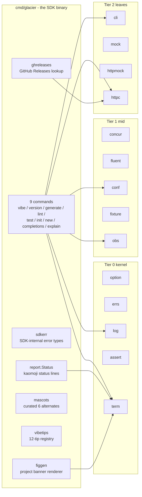

# SDK

<!--
  Section headers below are STABLE ANCHORS. Magpie extracts content by header,
  so do not rename or reorder them. Doing so is a process change requiring its
  own spec.

  Sections marked **Public** are extracted by Magpie for the public site.
  Sections marked **Internal** are engineering-only and never appear in published docs.

  Two new section anchors introduced by this spec, recorded as amendments in
  ## Migration & Compatibility:
    - ## Commands         (PUBLIC, between ## API and ## Examples; nine
                           sub-sections, one per kept command)
    - ## Documentation Surface  (PUBLIC + INTERNAL split, between ## Examples
                                 and ## Test Matrix)
-->

## Public Summary

<!-- **Public.** -->

The Glacier SDK is a CLI binary, `glacier`, built on every Glacier framework package. It is the framework's longest-running integration test, its public face for new developers, and the source of the "batteries included" experience every project scaffolded by `glacier init` inherits. Nine commands cover the developer day: `vibe`, `version`, `generate`, `lint`, `test`, `init`, `new`, `completions`, `explain`. Each is built with the `cli` package and its codegen tool. Animations route through `term.Animator`. HTTP calls route through `httpc`. Configuration loads through `conf`. Logs flow through `log` with kaomoji-prefixed status messages at command boundaries. Telemetry is opt-in only: when `OTEL_EXPORTER_OTLP_ENDPOINT` is set the SDK emits per-command spans and counters via `obs`. The SDK never phones home and never auto-updates. It demonstrates the Glacier promise that every line you do not write is one Glacier handles for you.

## Mental Model

<!-- **Public.** -->

The Glacier SDK is two things at once. To a Glacier developer it is a productivity tool: scaffold a project, generate boilerplate, lint, test, ship. To the framework itself it is a stress test: every package shipped by Glacier is exercised by at least one SDK command, and a Lynx-owned coverage row fails CI if any package falls out of use. The SDK and the framework move in lockstep.



Every command is a `+glacier:command` annotated struct under `cmd/glacier/commands/`. Glaciergen emits `cmd/glacier/zz_generated_cli.go`, which wires the registry, signals, banner, the auto-injected global flags, and the auto-registered `version` and `completions` subcommands. `main.go` is six lines.

A user who runs `glacier init my-app` gets a project with the same wiring out of the box: signal handling, banner rendering, version/completions subcommands, OTEL no-op-when-unset, httpc tracing, cli metrics. Their `main.go` is also six lines.

## Goals

<!-- **Internal.** -->

- Ship a `glacier` binary that builds with no third-party CLI framework and uses every Glacier framework package at least once.
- Define the nine commands' surfaces (D-S8) with locked storyboards and per-command performance budgets.
- Define the auto-injected global flags (D-S33) and auto-registered default subcommands (D-S34) every glaciergen-built CLI inherits.
- Define the batteries-included scaffold (D-S36) so every `glacier init` project starts with signals + banner + version + completions + obs + httpc tracing + cli metrics wired.
- Lock the SDK config (D-S21), cache layout (D-S22, D-S23), telemetry posture (D-S24, D-S25), self-update refusal (D-S26), exit-code table (D-S27).
- Lock the figgen renderer (D-S37) and curated mascot library (D-S38).
- Lock the kaomoji status-line scope (D-S16) and tone choices for success (D-S17), error (D-S18), cancellation (D-S19), progress (D-S20).
- Author the `## Commands`, `## Documentation Surface`, and `## Decisions & Rationale` sections at acceptance grade.
- Provide a Lynx-owned Test Matrix with at least 150 rows covering per-command behavior, cross-cutting concerns, performance, security paths, doc-surface freshness, and the "Glacier everywhere" coverage row.

## Non-Goals

<!-- **Internal.** -->

- Telemetry from the SDK itself. None. Ever. (D-S24)
- Self-update of the binary. (D-S26)
- A `glacier upgrade` command. Rejected permanently. (D-S9)
- A `glacier ask` / `glacier chat` command. Rejected permanently for privacy and dependency-bloat reasons. (D-S9)
- A `glacier check` command (lint + test + vet). Ambiguous failure modes; the idiom is `glacier lint && glacier test`. (D-S9)
- A `glacier sandbox` command. Sandbox is dropped from v0 per spec 0002 D38. Revisit when sandbox lands. (D-S9)
- A `glacier remove` command in v0. Documented; not shipped.
- A `glacier doc` command in v0. Deferred until the public site's typography choices stabilize. (D-S9)
- A `glacier fmt` command. Marker normalization belongs inside `glaciergen --normalize`, not as a separate verb. (D-S9)
- A `glacier bench` top-level verb. Alias-only; the canonical form is `glacier test --bench`. (D-S9)
- A `glacier mock` top-level verb. Folded into `generate --only=mock`. (D-S9)
- A `glacier run` command in v0. Deferred. (D-S9)
- The SDK launch announcement post. Separate spec (provisional `0033-sdk-launch`).
- Versioned docs. Inherited deferral from spec 0031 (single `latest`).
- Light-mode color tokens. Inherited deferral from spec 0001.
- Any new direct dependency. The SDK uses stdlib + Glacier packages only. (D-S28)

## Architecture

<!-- **Internal.** -->

### Package layout

```
cmd/glacier/
├── main.go                       wires cli.Default, calls cli.Default.Main()
├── version.go                    -ldflags-injected version + repo coordinates
├── doc.go                        package doc; refers to spec 0032
├── zz_generated_cli.go           emitted by glaciergen; checked in
├── commands/                     one Go file per kept command
│   ├── vibe.go
│   ├── version.go
│   ├── generate.go
│   ├── lint.go
│   ├── test.go
│   ├── init.go
│   ├── new.go
│   ├── completions.go
│   └── explain.go
├── internal/
│   ├── sdkerr/                   SDK error types and sentinels (D-S7)
│   ├── report/                   kaomoji status-line helper (D-S16)
│   ├── figgen/                   text-to-ANSI-Shadow figlet renderer (D-S37)
│   ├── mascots/                  curated 6 mascot library (D-S38)
│   ├── vibetips/                 12-tip registry, deterministic ordering (D-S59)
│   ├── ghreleases/               GitHub Releases lookup using httpc
│   ├── runner/                   subprocess-with-streaming wrapper for lint/test
│   ├── tplfs/                    embed.FS template registry
│   ├── completions/{bash,zsh,fish,pwsh}/  shell completion script writers
│   ├── explain/                  embed.FS of explainer topic files
│   ├── explaingen/               build-time tool that renders explain topics
│   ├── lockfile/                 advisory flock for cache-write arbitration
│   └── profile/                  --profile global; pprof CPU+heap+goroutine
├── templates/                    embedded template files for `init`
│   ├── library-only/...
│   ├── cli-app/...
│   └── both/...
└── docs/casts/                   asciinema cast scripts (5 commands; D-S Round 12)
    ├── hero.script.sh
    ├── version.script.sh
    ├── generate.script.sh
    ├── test.script.sh
    └── init.script.sh
```

`cmd/glacier/` is a `main` package; nothing imports it. All sub-packages are `internal/` so the SDK's surface stays binary-only and never accidentally becomes a public framework dependency.

### Three-tier compliance

The SDK consumes Glacier packages and never exports new ones. Imports from `cmd/glacier/...` permitted to: kernel (`option`, `errs`, `log`, `assert`, `term`); mid-tier (`concur`, `fluent`, `conf`, `fixture`, `obs`); leaves (`cli`, `mock`, `httpmock`, `httpc`); module-internal helpers (`internal/sigh`, `internal/safefile`, `internal/safejson`). The "Glacier everywhere" coverage row in `## Test Matrix` asserts every Glacier package is imported by at least one file under `cmd/glacier/...`. Drift fails CI.

### Codegen integration (D-S32)

The SDK's command tree is generated by `glaciergen` per spec 0011. The root command lives in `cmd/glacier/commands/root.go` (or equivalently in `main.go`'s package) and is annotated:

```go
// Glacier is the SDK root command.
//
// +glacier:command name=glacier
// +glacier:root
type Glacier struct{}

func (Glacier) Run(_ context.Context) error { return nil }
```

Each kept command is annotated `+glacier:command name=<verb> parent=glacier` plus per-flag `+glacier:short`, `+glacier:env`, `+glacier:choices`, `+glacier:required`, `+glacier:default`, `+glacier:deprecated`, `+glacier:validate` markers per spec 0011. The generated file `cmd/glacier/zz_generated_cli.go` is checked in. CI runs `glacier generate --check` (the SDK dogfoods its own check mode).

### Auto-injected global flags (D-S33)

Glaciergen emits a generic injection that every CLI built on `cli.Default` receives. The injection lives in `cli/gen` and renders these flags into every command's flag set:

| Flag | Short | Description |
|---|---|---|
| `--help` | `-h` | Print help text (every command). |
| `--version` | `-v` | Print version info (root command only, per spec 0011 §API Run). |
| `--quiet` | `-q` | Suppress non-error output and animations |
| `--verbose` | `-V` | Raise log level to debug |
| `--very-verbose` | `-vv` | Raise log level to trace |
| `--no-animate` | | Force plain output even on TTY |
| `--no-banner` | | Suppress banner on this invocation |
| `--profile` | | Write CPU+heap+goroutine profiles |
| `--otel-endpoint` | | Override OTEL_EXPORTER_OTLP_ENDPOINT |

`-v` is reserved for `--version` per spec 0011. The verbose flag uses `-V`; `-vv` is the long-only form for trace.

### Auto-registered default subcommands (D-S34)

Glaciergen also registers two default subcommands every CLI inherits:

- `version` (without `--check`; the SDK's own version command is the only one that opts into `--check`, `--strict`, `--json`)
- `completions <shell>` (walks the registered command tree; emits a printf-friendly script)

User commands with the same name win (last-registration-wins). The auto-registration happens in the same `init()` block as the user's command tree, after the user's commands are registered.

### Cross-cutting concerns

#### Banner (D-S12)

The banner is rendered by `cli`'s banner support per spec 0011 §Architecture / Banner integration. The SDK never constructs banner bytes. Banner display rules:

| Invocation | Banner shown? |
|---|---|
| `glacier` (bare) | yes |
| `glacier --help` | yes (if `banner.show_on_help` is true; default true) |
| `glacier vibe` | yes (continuously, animated) |
| `glacier init` final success screen | yes |
| Any other invocation | no |
| Non-TTY stderr | no |
| `NO_COLOR` or `GLACIER_NO_COLOR` set | no (wordmark plain ASCII; bear renders as kaomoji) |
| `--no-banner` | no |

#### Help system (D-S13, D-S39, D-S40)

`-h` prints the short help: synopsis, args, flags, exit codes. `--help` prints the long help: same plus a Mental Model paragraph and a "see also" block. Top-level `glacier --help` uses format A (D-S39): banner, tagline, kaomoji-prefixed one-liner, USAGE, four grouped command tables (CREATE / DEVELOP / INSPECT / UTILITY), GLOBAL FLAGS table, footer. Per-command `glacier <verb> --help` uses format D-S40: synopsis, optional Mental Model (long only), arguments, flags, global-flags pointer, env vars, exit codes, see also.

Suggestion logic on unknown verb / unknown flag: Levenshtein distance ≤ 2 against the registered command/flag names produces a "did you mean `<verb>`?" hint. Implemented in 30 lines of stdlib Go inside `cli/gen` (so every Glaciergen CLI inherits the suggestion logic). No new dependency.

#### Output destination (D-S14)

Banner and help write to stderr. Version output writes to stdout. Errors always write to stderr. CI piping works correctly: `glacier version --json | jq .latest` reaches stdout-only.

#### Logging style (D-S15)

Log records on TTY use color-only level prefixes (no kaomoji per log line). The `term.NewHandler` writes `LEVEL` (right-padded) in spec-0001 colors: green INFO, yellow NOTICE, neutral DEBUG, yellow-warm WARN, red ERROR. Kaomoji is reserved exclusively for the SDK `report.Status` boundary helper.

#### Kaomoji status-line (D-S16)

The SDK-only helper `cmd/glacier/internal/report/Status(level, msg)` emits one line of the form `<kaomoji> <message>`, colored per spec 0001 D45 mapping:

| Level | Kaomoji | Color |
|---|---|---|
| Calm / start | `ʕ•ᴥ•ʔ` | `term.Cyan` |
| Confident / success | `ʕ⌐■-■ʔ` | `term.Teal` |
| Thinking / progress | `ʕ•_•ʔ` | `term.TextMuted` |
| Alarmed / warning | `ʕ◉_◉ʔ` | `term.Warning` |
| Error / failure | `ʕ× ×ʔ` | `term.Error` |

Used at command boundaries: command entry, milestone, success summary, warning, error, cancellation. Not used per log record.

#### Success / error / cancellation tones (D-S17, D-S18, D-S19)

Success tone is lightly playful: a 10-phrase rotation paired with the confident kaomoji `ʕ⌐■-■ʔ`. Max one playful phrase per command per invocation. Phrases authored by Magpie under spec 0001 D11 (no superlatives):

| # | Phrase | Suits |
|---|---|---|
| 1 | nice. | generate / test (clean run) |
| 2 | all set. | init (project ready) |
| 3 | ready. | init (one-word confirmation) |
| 4 | done and dusted. | lint (no findings) |
| 5 | looking good from here. | version --check (current = latest) |
| 6 | clean run. | generate / test (no failures) |
| 7 | that went well. | test (full green run) |
| 8 | on solid ground. | init / new (after scaffold) |
| 9 | good to go. | generate (no drift) |
| 10 | nothing to complain about. | lint (zero findings) |

Each phrase is lowercase, ends with a period, ≤ 6 words, contains no superlatives. Selection within a command is deterministic given the `--seed` flag; otherwise a per-invocation pseudo-random draw from the suitable subset.

Error tone is calm and actionable: state the failure, show the cause, suggest the next step, link `glacier explain <code>`. Cancellation tone is a calm one-liner with the thinking kaomoji plus a partial-result footer when applicable.

#### Progress feedback (D-S20)

Long-running rows in the status panel show the thinking kaomoji and a rotating spinner glyph. Elapsed time updates per tick. No prose heartbeat; no ETA estimate.

#### Configuration (D-S21)

The SDK registers a `Config` struct via `conf.Register` at startup. Config file path: `<UserConfigDir>/glacier/config.json`. Layered: defaults < file < env (`GLACIER__*`) < flags. Keys:

| Key | Type | Default | Effect |
|---|---|---|---|
| `github.repo` | string | `nathanbrophy/glacier` | Repo for `version --check` |
| `versioncheck.cache_ttl` | duration | `24h` | Latest-release cache TTL |
| `versioncheck.enabled` | bool | `true` | Disable network call entirely |
| `versioncheck.strict` | bool | `false` | Treat offline as exit 68 |
| `banner.show_on_help` | bool | `true` | Banner on `glacier --help` |
| `palette.override` | object | `{}` | Per-token color overrides |

The `telemetry` key is hard-coded to false; setting it has no effect (D-S24).

#### Cache directory (D-S22, D-S23)

Per-OS cache directory derived once via stdlib `os.UserCacheDir`. User cache holds:

| File | Owner | Purpose |
|---|---|---|
| `<UserCacheDir>/glacier/versioncheck.json` | `version` | Latest-release lookup cache |
| `<UserCacheDir>/glacier/versioncheck.lock` | `version` | flock for write arbitration |

Project-local cache (under `<repo>/.glacier/`):

| File | Owner | Purpose |
|---|---|---|
| `<repo>/.glacier/lint-cache.json` | `lint` | Per-file content-hash result cache |
| `<repo>/.glacier/bench-baseline.json` | `test --bench` | benchstat baseline |

`<repo>/.glacier/` is added to the init scaffold's `.gitignore`. All writes route through `internal/safefile` per spec 0002 §7.7.

#### Telemetry refusal + user-opt-in OTEL (D-S24, D-S25)

The SDK never phones home. Zero telemetry from the SDK itself. The `telemetry` config key is hard-coded false. The `glacier vibe` tip registry, the `glacier explain` topic registry, the figgen rendering, every other flow: none send any data to any party.

When `OTEL_EXPORTER_OTLP_ENDPOINT` is set (or `--otel-endpoint=<url>` is passed), the SDK initializes `obs` per spec 0017 and emits per-command spans `glacier.cmd.<verb>` plus counters `glacier.cmd.runs`, `glacier.cmd.duration`, `glacier.cmd.exit_code`. The endpoint is the user's; data flows where the user pointed. obs's no-op-when-unset path keeps overhead at zero when the env var is unset.

#### Self-update refusal (D-S26)

The SDK never modifies its own binary. `version --check` prints a `go install` line. Users upgrade themselves.

#### Exit codes (D-S27)

| Code | Meaning |
|---|---|
| 0 | Success |
| 1 | Generic failure not better classified |
| 2 | Usage error |
| 64 | Generate failed |
| 65 | Lint reported findings ≥ severity threshold |
| 66 | Tests failed (or any benchmark regressed > 5%) |
| 67 | Init or new template / scaffolding failed |
| 68 | Version-check unreachable when `--strict` |
| 69 | Codegen drift detected (`generate --check`) |
| 70 | Subprocess failure (wrapped tool exited non-zero non-test-failure) |
| 130 | SIGINT / Ctrl-C |
| 143 | SIGTERM |

Stable across versions. `glacier explain <code>` prints the row's meaning.

#### Verbosity flags (D-S31)

`-q`/`--quiet` lowers log level to Warn, suppresses animations, keeps the final summary block. `-V`/`--verbose` raises to Debug. `--very-verbose` (long form, no short; the `-vv` short maps to `--very-verbose` via the codegen's repeated-short-flag rule) raises to Trace. `-v` is short for `--version`. Mutual exclusion between `-q` and `-V`/`-vv` is exit 2.

#### Build matrix (D-S29)

linux/amd64, linux/arm64, darwin/amd64, darwin/arm64, windows/amd64. Cross-compile in CI via the existing GOOS/GOARCH matrix. Windows raw-mode uses `golang.org/x/sys/windows` (already approved per spec 0002 D4).

### Batteries-included for scaffolded projects (D-S36, D-S37, D-S38)

`glacier init my-app` produces a project with the same wiring as the SDK: signals + banner + version cmd + completions cmd + obs auto-init (no-op when OTEL endpoint env var is unset; emits to stderr in dev mode when no endpoint configured) + httpc tracing wired on `httpc.Default` + cli metrics wired on `cli.Default`. Zero overhead when OTEL isn't enabled.

The scaffolded `main.go` is six lines:

```go
package main

import "github.com/nathanbrophy/glacier/cli"

func main() {
    cli.Default.Main()
}
```

All wiring comes from glaciergen's emitted `zz_generated_cli.go`.

#### figgen (D-S37)

`cmd/glacier/internal/figgen/` is a stdlib-only ANSI Shadow text-to-block-character renderer (~80 LOC). At `glacier init my-app` it writes `<project>/assets/banner.txt` with the project name rendered. The user's CLI uses `//go:embed` to load. User can edit the file freely; survives glacier upgrades.

Module-name input is sanitized: characters outside `[a-zA-Z0-9 _-]` are stripped before rendering. ANSI escape sequences cannot be injected through the module name. (Falcon test row covers this.)

#### Mascot library (D-S38)

`cmd/glacier/internal/mascots/` hosts six mascots: polar bear, penguin, owl, fox, otter, raccoon. Each has a kaomoji form and a 5-line block-character form, plus a state-shift mapping per spec 0001 D45. Each mascot is ≤ 30 LOC. Brief authoring is Magpie's responsibility per `## Documentation Surface`.

`glacier init` prompts via `term.Select` over the six. The chosen mascot is written to `<project>/assets/mascot.go` as a small Go file the user can edit. Spec 0001 amendment in `## Migration & Compatibility` admits the user-mascot library asset class.

### Profiling (D-S71)

Global `--profile=<file>` writes three pprof files: `<file>.cpu` (`runtime/pprof.StartCPUProfile`), `<file>.heap` (`pprof.WriteHeapProfile`), `<file>.goroutine` (`pprof.Lookup("goroutine").WriteTo`). Implementation in `cmd/glacier/internal/profile/`, ~30 lines stdlib only.

## Schema

<!-- **Internal.** -->

```go
// Config is the top-level SDK configuration registered with conf.
// invariant: every field has a sensible default; conf.Load with no file present
//            yields a usable Config.
type Config struct {
    GitHub       GitHubConfig       `json:"github"`
    VersionCheck VersionCheckConfig `json:"versioncheck"`
    Banner       BannerConfig       `json:"banner"`
    Palette      map[string]string  `json:"palette,omitempty"`

    // invariant: telemetry is hard-coded false; ignored if set in the file or env.
    Telemetry bool `json:"-"`
}

type GitHubConfig struct {
    // invariant: matches ^[a-zA-Z0-9._-]+/[a-zA-Z0-9._-]+$
    Repo string `json:"repo"` // default "nathanbrophy/glacier"
}

type VersionCheckConfig struct {
    // invariant: > 0 when set; conf coerces "24h" via time.ParseDuration.
    CacheTTL time.Duration `json:"cache_ttl"` // default 24h
    Enabled  bool          `json:"enabled"`   // default true
    // invariant: when true, network failure exits 68 instead of 0 with annotation.
    Strict bool `json:"strict"` // default false
}

type BannerConfig struct {
    ShowOnHelp bool `json:"show_on_help"` // default true
}

// ReleaseInfo is the GitHub /releases/latest decode target.
// invariant: TagName matches ^v\d+\.\d+\.\d+(-[a-zA-Z0-9.]+)?$ before display.
// invariant: HTMLURL has prefix "https://github.com/" before display.
type ReleaseInfo struct {
    TagName     string    `json:"tag_name"`
    Name        string    `json:"name"`
    HTMLURL     string    `json:"html_url"`
    PublishedAt time.Time `json:"published_at"`
}

// VersionCacheEntry is the on-disk cache record for the latest-release lookup.
type VersionCacheEntry struct {
    CheckedAt RFC3339Time `json:"checked_at"`
    Latest    ReleaseInfo `json:"latest"`
}

// MascotID enumerates the curated mascot library. (D-S38)
// invariant: values are stable; new entries appended only.
type MascotID string

const (
    MascotPolarBear MascotID = "polar_bear"
    MascotPenguin   MascotID = "penguin"
    MascotOwl       MascotID = "owl"
    MascotFox       MascotID = "fox"
    MascotOtter     MascotID = "otter"
    MascotRaccoon   MascotID = "raccoon"
)

// Mascot is one curated entry in the library.
// invariant: Kaomoji is non-empty; Banner has exactly 5 lines.
type Mascot struct {
    ID      MascotID
    Display string // human-readable display name
    Kaomoji string // single-line kaomoji per spec 0001 D43
    Banner  []string // 5-line block-character art per spec 0001 D44
}

// Tip is one entry in the vibe tip registry. (D-S59)
// invariant: Body matches ^[^\x00-\x1f]{16,200}$ (printable, length-bounded).
type Tip struct {
    Category string // one of: cli, term, log, conf, errs, assert, fixture, mock, httpmock, httpc, option, concur
    Body     string
    SpecRef  string // e.g. "spec 0011 §7.1"
}

// ExitCode wraps the spec's exit-code table. (D-S27)
type ExitCode int

const (
    ExitSuccess          ExitCode = 0
    ExitGeneric          ExitCode = 1
    ExitUsage            ExitCode = 2
    ExitGenerateFailed   ExitCode = 64
    ExitLintFindings     ExitCode = 65
    ExitTestsFailed      ExitCode = 66
    ExitScaffoldFailed   ExitCode = 67
    ExitVersionCheck     ExitCode = 68
    ExitCodegenDrift     ExitCode = 69
    ExitSubprocess       ExitCode = 70
    ExitInterrupted      ExitCode = 130
    ExitTerminated       ExitCode = 143
)
```

The embedded `templates/`, `mascots/`, `vibetips/`, and `explain/` registries are populated at compile time via `embed.FS` and exposed to commands as plain `fs.FS` values. No reflection at runtime. No mutable global state beyond `cli.Default`.

## API

<!-- **Public.** -->

The SDK is a binary; its Go API is binary-internal (under `cmd/glacier/internal/`) and not part of the framework's public surface. Two binary-internal packages are documented here for completeness because they are shaped by this spec.

### `cmd/glacier/internal/sdkerr` (D-S7)

```go
// Package sdkerr collects every error type and sentinel emitted by the SDK
// binary. Errors satisfy the library register format: "sdk: <action>: <cause>".
package sdkerr

// ErrUserCancelled is returned when the user interrupts an interactive prompt
// (Ctrl-C or EOF). Mapped to ExitInterrupted.
var ErrUserCancelled = errs.Sentinel("sdk: user cancelled")

// ErrAlreadyInitialized is returned by `init` when the target directory is
// not empty and --force was not supplied.
type ErrAlreadyInitialized struct {
    Path     string
    Conflict []string // file paths under Path that would be overwritten
}
func (e *ErrAlreadyInitialized) Error() string { /* "sdk: init: ..." */ }

// ErrNoModule is returned by `new` when no go.mod is found in CWD or any
// ancestor.
type ErrNoModule struct{ Cwd string }
func (e *ErrNoModule) Error() string { /* "sdk: new: ..." */ }

// ErrInvalidName is returned by `init` and `new <verb>` when the user-
// supplied name fails the strict validation per D-S41.
type ErrInvalidName struct {
    Kind string // "module" | "package" | "command" | "option"
    Name string
    Why  string
}
func (e *ErrInvalidName) Error() string { /* "sdk: <kind>: ..." */ }

// ErrCodegenDrift is returned by `generate --check` when at least one
// generated file is stale relative to its source. Mapped to ExitCodegenDrift.
type ErrCodegenDrift struct{ StaleFiles []string }
func (e *ErrCodegenDrift) Error() string { /* "sdk: generate: ..." */ }

// ErrTestsFailed is returned by `test` when one or more tests fail or a
// benchmark regresses by more than the configured threshold. Mapped to
// ExitTestsFailed.
type ErrTestsFailed struct {
    Failed       int
    Regressed    int
    FirstFailure string // "<package>.<TestName>"
}
func (e *ErrTestsFailed) Error() string { /* "sdk: test: ..." */ }
```

### `cmd/glacier/internal/report` (D-S16)

```go
// Package report writes kaomoji-prefixed status lines to the user.
// Reserved for command-boundary moments: entry, milestone, success, warn,
// error, cancellation. Not used per log record (those flow through log/).
package report

// Level is the report level; maps one-to-one to spec 0001 D45.
type Level int

const (
    Calm Level = iota // ʕ•ᴥ•ʔ
    Confident         // ʕ⌐■-■ʔ
    Thinking          // ʕ•_•ʔ
    Alarmed           // ʕ◉_◉ʔ
    Error             // ʕ× ×ʔ
)

// Status writes "<kaomoji> <message>" to the configured writer (default os.Stderr).
// Color is applied per the level mapping. Animator-aware: when an Animator is
// active, Status routes through the animator's interception handler so the
// status line lands above the active animation.
//
// Concurrency: goroutine-safe.
func Status(level Level, message string)

// SetWriter sets the output writer for Status. Default os.Stderr.
// Concurrency: goroutine-safe; subsequent Status calls observe the new writer.
func SetWriter(w io.Writer)

// SetAnimator wires the Animator so Status calls during an animation are
// intercepted correctly. Called from each command's setup at startup.
func SetAnimator(a *term.Animator)
```

### Per-command structs (binary-internal)

Each kept command is a struct under `cmd/glacier/commands/` annotated with `+glacier:command` markers. The structs are not part of any package's public API; they exist to be discovered by `glaciergen`. The exact field set per command is enumerated in `## Commands` below.

## Commands

### vibe

**Synopsis.** Run the Glacier vibes animation: dancing polar bear plus wordmark banner. Press any key to exit.

**Mental model.** `vibe` is the SDK's flagship dogfood of `term.Animator`. The animator owns a slog handler, intercepts log records, runs a 10 Hz frame loop. Each frame composes the polar-bear block-character mascot (5 lines, left side) with the ANSI Shadow GLACIER wordmark (right side, gradient applied). The bear's expression cycles every 3 seconds (calm → confident → thinking → calm). The wordmark gradient offsets one line per 100 ms tick, producing a slow vertical shimmer. Below the banner a tip line rotates every 5 seconds from a curated 12-tip registry. Pressing any key (or Ctrl-C, or sending SIGTERM) exits cleanly.

**Argument grammar.**

```go
// VibeCmd plays the Glacier vibes animation.
//
// +glacier:command name=vibe parent=glacier
type VibeCmd struct {
    // Duration bounds the loop. Default 0s means run until key press.
    //
    // +glacier:default 0s
    Duration time.Duration

    // NoTips suppresses the rotating tip line.
    //
    // +glacier:default false
    NoTips bool

    // Seed seeds the tip-rotation order. 0 means time-based.
    //
    // +glacier:default 0
    Seed int64

    // ASCII forces the kaomoji-only fallback even on capable terminals.
    //
    // +glacier:default false
    ASCII bool
}

func (c *VibeCmd) Run(ctx context.Context) error { /* ... */ }
```

**Storyboard (TTY, color, UTF-8; D-S55).**

```
$ glacier vibe
╭─ glacier vibes ─────────────────────────────────────────────────────────────────╮
│                                                                                  │
│     ▟▀▙   ▟▀▙         ██████╗ ██╗      █████╗  ██████╗███████╗███████╗██████╗     │
│    ▟████████████▙       ██╔════╝ ██║     ██╔══██╗██╔════╝╚═██╔══╝██╔════╝██╔══██╗ │
│    █   ●     ●  █      ██║  ███╗██║     ███████║██║       ██║   █████╗  ██████╔╝ │
│    █      ▼     █      ██║   ██║██║     ██╔══██║██║       ██║   ██╔══╝  ██╔══██╗ │
│     ▀▀▀▀▀▀▀▀▀▀▀▀        ╚██████╔╝███████╗██║  ██║╚██████╗███████╗███████╗██║  ██║ │
│                          ╚═════╝ ╚══════╝╚═╝  ╚═╝ ╚═════╝╚══════╝╚══════╝╚═╝  ╚═╝ │
│                                          Less plumbing. More Go.                │
│                                                                                  │
│   ʕ•_•ʔ Did you know? option.Apply is goroutine-safe and zero-allocation        │
│         when no options are passed.                                              │
│                                                                                  │
│   Press any key to exit.                                                         │
╰──────────────────────────────────────────────────────────────────────────────────╯
```

**Error states.**

| Failure mode | Exit | Message structure |
|---|---|---|
| Raw-mode acquire fails | 70 | "Cannot enter raw mode: \<cause\>. Try `--ascii` for the static fallback." |
| Animator setup fails | 1 | "Cannot start animator: \<cause\>." |
| SIGINT during loop | 130 | calm cancellation footer |
| SIGTERM during loop | 143 | calm cancellation footer |

**Quiet and non-TTY behavior.** When stdout is not a TTY, when `NO_COLOR` or `GLACIER_NO_COLOR` is set, or when `--ascii` is passed, vibe degrades to a one-shot static frame: kaomoji bear + plain wordmark + tagline + a single tip + a `(static)` annotation; prints once and exits 0. `--quiet` is treated as a usage error (vibe exists to be visible).

**Signal handling.** Raw mode acquired via spec 0016 §Raw-mode terminal discipline; restored via deferred `rawModeRestore` even on panic. Any key press exits 0; Ctrl-C exits 130; SIGTERM exits 143. Cursor visibility restored on every exit path.

**Performance budget.** Cold start ≤ 30 ms. Steady-state ≤ 200 µs per frame; < 1 alloc per frame after warmup (pinned via `testing.AllocsPerRun`).

**Test matrix entries.** TTY render correctness; NO_COLOR strips ANSI; `--ascii` fallback; raw-mode acquire/restore (including panic-safe); key-press exit; SIGINT exit; SIGTERM exit; `--duration` honored; `--seed` deterministic tip order; alloc budget held.

**Doc hooks.** Magpie extracts this sub-section to `/sdk/commands/vibe/`. The hero asciinema cast `cmd/glacier/docs/casts/hero.script.sh` runs `vibe --seed=0 --duration=10s` and is rendered both as `.cast` and `.svg` to `site/public/casts/`.

### version

**Synopsis.** Print the Glacier SDK version. With `--check`, compare against the latest published release.

**Mental model.** `version` reads its own version (baked at build time via `-ldflags`; falls back to `runtime/debug.ReadBuildInfo` for `go run` builds), the Go toolchain version, and the OS/arch. `--check` adds a GitHub Releases lookup via `httpc`. The lookup is cached in `<UserCacheDir>/glacier/versioncheck.json` with a 24-hour TTL; the cache is written through `internal/safefile` and arbitrated by an advisory flock. Network failures and HTTP 403 (rate-limit) degrade gracefully: stale cache returned with a `(stale)` annotation; no cache available means `latest: unknown (offline)`. Exit 0 unless `--strict` opts into exit 68 on network failure.

**Argument grammar.**

```go
// VersionCmd prints version information.
//
// +glacier:command name=version parent=glacier
type VersionCmd struct {
    // Check contacts GitHub Releases for the latest tag.
    //
    // +glacier:default false
    Check bool

    // Strict makes a network failure during --check exit 68.
    //
    // +glacier:default false
    Strict bool

    // JSON emits a single JSON object instead of human-readable lines.
    //
    // +glacier:default false
    JSON bool
}

func (c *VersionCmd) Run(ctx context.Context) error { /* ... */ }
```

**Storyboard (D-S60).**

```
$ glacier version
ʕ•ᴥ•ʔ glacier v0.1.0
  build: 2026-05-02T14:22:00Z
  go:    go1.26.0
  os:    darwin/arm64

$ glacier version --check
ʕ•ᴥ•ʔ glacier v0.1.0
  build: 2026-05-02T14:22:00Z
  go:    go1.26.0
  os:    darwin/arm64
ʕ⌐■-■ʔ latest: v0.1.2 (released 2026-05-08)
  upgrade: go install github.com/nathanbrophy/glacier/cmd/glacier@latest

$ glacier version --check    # offline, stale cache
ʕ•ᴥ•ʔ glacier v0.1.0
  build: 2026-05-02T14:22:00Z
  go:    go1.26.0
  os:    darwin/arm64
ʕ◉_◉ʔ latest: v0.1.2 (cached 2 days ago, network unreachable)
```

**`--json` schema (D-S63).**

```json
{
  "version": "v0.1.0",
  "build_time": "2026-05-02T14:22:00Z",
  "go_version": "go1.26.0",
  "os": "darwin",
  "arch": "arm64",
  "latest": {
    "tag": "v0.1.2",
    "published_at": "2026-05-08T00:00:00Z",
    "html_url": "https://github.com/nathanbrophy/glacier/releases/tag/v0.1.2",
    "stale": false
  }
}
```

**Error states.**

| Failure mode | Exit | Message structure |
|---|---|---|
| `--check`, network failure, no cache, default | 0 | `latest: unknown (offline). Try --check later or visit <releases-url>.` |
| `--check`, network failure, no cache, `--strict` | 68 | "Cannot reach GitHub: \<cause\>. Try `--check` later." |
| `--check`, HTTP 403 (rate limit), default | 0 | same as offline annotation |
| `--check`, response decode fails | 1 | "Cannot parse release info from \<repo\>." |
| Cache write fails | 0 | warning logged; in-memory result still printed |

**Quiet and non-TTY behavior.** Output to stdout (D-S14). On non-TTY, kaomoji and color suppressed; the layout stays. `--quiet` suppresses any warnings about cache write failure but keeps the version block and any latest annotation.

**Signal handling.** SIGINT during the `httpc` call cancels the request via ctx. Exit 130. The cache is not written on cancellation.

**Performance budget.** Cold start, no `--check`: ≤ 30 ms. With `--check`, fresh cache: ≤ 50 ms. With `--check`, network call on the failure path: ≤ 2.5 s wall (bounded by `httpc.MaxAttempts(3)` + `httpc.MaxElapsed(2s)` + jitter envelope). Successful network call: ≤ 500 ms median on a typical residential link.

**Test matrix entries.** Default output; `--check` with fresh cache; `--check` with stale cache; `--check` with no cache + offline; `--check` with `--strict` + offline; `--check` with HTTP 403; `--check` with 4xx/5xx other than 403; `--json` schema; build-info fallback; ldflags-injected version; cache write through safefile; cache read tolerant of corruption; tag/URL allowlist regex enforced before display.

**Doc hooks.** Magpie extracts to `/sdk/commands/version/`. Cast: `cmd/glacier/docs/casts/version.script.sh` showing default + `--check`.

### generate

**Synopsis.** Run every Glacier code generator (cli, mock, httpmock) over the current module.

**Mental model.** `generate` is the umbrella over Glacier's three v0 generators. The generator registry lives in `cmd/glacier/commands/generate.go` as an explicit list of (`name`, `fn`) pairs; functions are direct references to `cli/gen.Generate`, `mock/gen.Generate`, `httpmock/gen.Generate`. No reflection. Each generator runs in a `concur.Group` slot, owns one row in a `term.StatusBar`, reports progress through a thin channel; the animator coordinates output. `--check` mode swaps the panel for a check-list and emits unified diffs for every stale file. Exit 64 on generator failure; exit 69 on drift detected by `--check`.

**Argument grammar.**

```go
// GenerateCmd runs Glacier code generators.
//
// +glacier:command name=generate parent=glacier
type GenerateCmd struct {
    // Patterns are go/packages patterns (default ./...).
    //
    // +glacier:positional
    Patterns []string

    // Check enables drift-detection mode; no files written; exit 69 on drift.
    //
    // +glacier:default false
    Check bool

    // Only restricts generators by name. Empty means all.
    // Each value must be one of: cli, mock, httpmock.
    //
    // +glacier:validate validateGeneratorList
    Only []string

    // Parallel caps concurrent generators.
    //
    // +glacier:default 0
    Parallel int

    // NoStatus suppresses the live status panel.
    //
    // +glacier:default false
    NoStatus bool
}
```

`--parallel=0` resolves to `min(runtime.NumCPU(), 8)`.

**Storyboard (D-S64).**

```
$ glacier generate
ʕ•ᴥ•ʔ glacier generate
╭─ generators ─────────────────────────────────────────────────────────╮
│ ʕ⌐■-■ʔ cli/gen      ✓ done    12 packages, 12 files written, 0.34s    │
│ ʕ⌐■-■ʔ mock/gen     ✓ done     7 packages,  9 files written, 0.21s    │
│ ʕ•_•ʔ  httpmock/gen ⋯ running  3 packages so far                       │
╰────────────────────────────────────────────────────────────────────────╯
ʕ⌐■-■ʔ nice. 22 files touched, 0.63s wall.

$ glacier generate --check    # with drift
ʕ•ᴥ•ʔ glacier generate --check
╭─ drift check ────────────────────────────────────────────────────────╮
│ ʕ⌐■-■ʔ cli/gen       in sync                                          │
│ ʕ◉_◉ʔ mock/gen      stale (1 file)                                    │
│ ʕ⌐■-■ʔ httpmock/gen  in sync                                          │
╰────────────────────────────────────────────────────────────────────────╯
ʕ◉_◉ʔ stale: ./pkg/store/zz_generated_cli.go
─── diff ─────────────────────────────────────────────────────────────
  cli.WithFlagShort("Port", 'p'),
+ cli.WithFlagEnv("Port", "GLACIER_PORT"),
  cli.WithFlagRequired("Config"),
──────────────────────────────────────────────────────────────────────
ʕ× ×ʔ 1 generated file is stale. Run `glacier generate` to update.
exit 69
```

**Error states.**

| Failure mode | Exit | Message structure |
|---|---|---|
| Any generator returns error | 64 | "\<generator\> failed: \<cause\>. \<actionable hint per generator\>." |
| Drift detected (`--check`) | 69 | summary + diff blocks + "Run `glacier generate` to update." |
| Pattern resolves to zero packages | 2 | "No packages matched \<pattern\>." |
| `--only` names unknown generator | 2 | "Unknown generator \<name\>. Try `glacier explain generate`." |

**Quiet and non-TTY behavior.** `--quiet` and non-TTY both suppress the animator. Final summary lines (one per generator) still print to stderr; the success block to stdout. `--no-status` is the explicit opt-out for the panel even on TTY.

**Signal handling.** SIGINT cancels in-flight generators via ctx propagation; partial-result footer lists which generators completed. Exit 130.

**Performance budget.** Cold start ≤ 50 ms. Per-generator overhead before its work begins ≤ 5 ms. Total wall on the Glacier repo (3 generators, 22 files) ≤ 1 s on M2 Air. Peak alloc count ≤ 5,000.

**Test matrix entries.** Registry walk; all generators; `--only=cli`/`--only=mock`/`--only=httpmock`; `--check` no drift; `--check` with drift; `--parallel` honored; parallel race-free; failed generator does not stop others; summary block formatting; exit codes; doc-gallery byte-equality CI check; marker-list-vs-choices CI check; codegen-stale panel render.

**Doc hooks.** Magpie extracts to `/sdk/commands/generate/`. Cast: `cmd/glacier/docs/casts/generate.script.sh`. The codegen examples gallery (3 exhibits per generator, 9 total) lives at `docs/examples/codegen/<example>/` per `## Documentation Surface § 6.4`.

### lint

**Synopsis.** Run gofmt, go vet, staticcheck, and Glacier-specific lints.

**Mental model.** `lint` runs an in-process suite for the cheap lints (gofmt via `go/format`, go vet via `golang.org/x/tools/go/analysis`, plus the six Glacier-specific lints) and shells out to `staticcheck` if it's on PATH. A content-hash cache at `<repo>/.glacier/lint-cache.json` (sha256 per file) reuses results across runs. Findings are grouped by severity (errors first), then by file. On capable terminals each `file:line` is an OSC-8 hyperlink. `--fix` auto-fixes gofmt + no-em-dash + marker normalization; other lints get a manual-fix hint. Exit 65 on findings ≥ severity threshold; exit 70 on subprocess failure.

**Argument grammar.**

```go
// LintCmd runs the Glacier lint suite.
//
// +glacier:command name=lint parent=glacier
type LintCmd struct {
    // Patterns default to ./...
    //
    // +glacier:positional
    Patterns []string

    // Fix applies auto-fixable lint fixes in place.
    //
    // +glacier:default false
    Fix bool

    // Severity is the minimum severity to report.
    //
    // +glacier:choices error|warning|info
    // +glacier:default warning
    Severity string

    // Format is the output format.
    //
    // +glacier:choices text|json|sarif
    // +glacier:default text
    Format string

    // NoCache ignores the lint result cache.
    //
    // +glacier:default false
    NoCache bool
}
```

**Glacier-specific lints (D-S52).**

| Name | Severity | Description |
|---|---|---|
| `exported-doc-comment` | warning | Every exported symbol has a doc comment starting with the symbol name. |
| `package-example-test` | warning | Every package has at least one `Example*` function. |
| `panic-in-library` | error | No `panic(...)` outside `_test.go` in non-`cmd/` packages. |
| `no-em-dash` | error | No U+2014 in any `.go`, `.md`, `.txt` file. |
| `library-error-register` | error | Every exported `*Error` type's `Error()` matches `^[a-z][^.]*$`. |
| `naked-any` | warning, opt-in | Type-parameter constraint of `any` where a more specific constraint would do. |

**Storyboard (D-S54).**

```
$ glacier lint ./...
ʕ•ᴥ•ʔ glacier lint ./...
ʕ× ×ʔ ERRORS
  cli/app.go:142  panic-in-library     panic in non-test, non-cmd package: panic("unreachable")
  cli/gen/parse.go:67  no-em-dash      em-dash character (U+2014) found

ʕ◉_◉ʔ WARNINGS
  cli/app.go:88   exported-doc-comment  exported func App.Lookup has no doc comment
  conf/conf.go:51 package-example-test  package conf has no Example* function
  fluent/source.go:30  naked-any        type-parameter constraint `any` could be more specific

ʕ•ᴥ•ʔ 5 findings: 2 errors, 3 warnings.
exit 65
```

**Error states.**

| Failure mode | Exit | Message structure |
|---|---|---|
| Findings ≥ severity threshold | 65 | summary line; `glacier explain 65` for context |
| `staticcheck` not on PATH | 0 | warning at start; `staticcheck` lints skipped |
| `staticcheck` subprocess crashes | 70 | "staticcheck failed: \<stderr\>." |
| `--fix` cannot write a file | 70 | "Cannot write \<path\>: \<cause\>." |
| Pattern resolves to zero packages | 2 | "No packages matched \<pattern\>." |

**Quiet and non-TTY behavior.** `--quiet` suppresses the kaomoji severity headers but keeps the findings list and summary. Non-TTY: OSC-8 hyperlinks suppressed; plain `file:line` text. `--format=json` and `--format=sarif` are TTY-agnostic and always emit machine-readable output to stdout.

**Signal handling.** SIGINT during a long lint cancels via ctx; partial findings printed; exit 130.

**Performance budget.** Cold start ≤ 50 ms. Warm cache on Glacier repo ≤ 500 ms. Cold cache (full scan) ≤ 5 s.

**Test matrix entries.** gofmt clean; vet clean; staticcheck via PATH; staticcheck missing skip-warn; each Glacier lint hits a fixture; JSON output schema; SARIF output schema; `--fix` applies; `--fix` not applied without flag; severity threshold; exit codes; cache hit reduces runtime; cache invalidation on file content change.

**Doc hooks.** Magpie extracts to `/sdk/commands/lint/`. Static fenced output block on the page (no cast); a hand-authored sample lint output is committed.

### test

**Synopsis.** Run the Go test suite with a live status panel and an aggregated summary.

**Mental model.** `test` wraps `go test -json` as a subprocess and stream-parses the JSON event stream. Completed packages stream upward in the result block (most recent at the top). Active packages occupy the status panel below (≤ 10 rows). The panel rolls older rows off the top with a `(+N more)` indicator. The summary block at the end gives pass/fail counts, coverage vs threshold, slowest tests, and failure details. `--bench=<re>` runs benchmarks and compares against the per-project baseline at `<repo>/.glacier/bench-baseline.json`; regression > 5% exits 66. `--update-baseline` rewrites the baseline atomically via `internal/safefile`. Output formats: text (default on TTY), JUnit XML, SARIF, JSON.

**Argument grammar.**

```go
// TestCmd runs the test suite.
//
// +glacier:command name=test parent=glacier
type TestCmd struct {
    // Patterns default to ./...
    //
    // +glacier:positional
    Patterns []string

    // Race forwards -race to go test.
    //
    // +glacier:default false
    Race bool

    // Cover forwards -cover and merges coverage across packages.
    //
    // +glacier:default false
    Cover bool

    // Fuzz forwards -fuzz=<re> to go test.
    Fuzz string

    // Bench forwards -bench=<re> and runs benchstat against the baseline.
    Bench string

    // Baseline overrides the default baseline path.
    //
    // +glacier:default ".glacier/bench-baseline.json"
    Baseline string

    // UpdateBaseline writes the current run as the new baseline.
    //
    // +glacier:default false
    UpdateBaseline bool

    // Format is the output format.
    //
    // +glacier:choices text|junit|sarif|json
    // +glacier:default text
    Format string

    // Slowest is the count of slowest-tests entries.
    //
    // +glacier:default 5
    Slowest int

    // NoStatus suppresses the live status panel.
    //
    // +glacier:default false
    NoStatus bool
}
```

**Storyboard (D-S49).**

```
$ glacier test ./...
ʕ•ᴥ•ʔ glacier test ./...

─── results (most recent above) ───────────────────────────────────────
  PASS  cli/                  17 tests, 0.34s
  PASS  cli/gen/              42 tests, 0.62s
  FAIL  conf/    (1 failed)   18 tests, 0.21s
        └ TestLayerConflict_File_vs_Env
─── status panel ───────────────────────────────────────────────────────
  ʕ•_•ʔ mock/        ⢹ 47 tests started, 14s elapsed
  ʕ•_•ʔ httpmock/    ⢻ 23 tests started, 13s elapsed
  ʕ•_•ʔ obs/         ⢿  8 tests started,  6s elapsed
─────────────────────────────────────────────────────────────────────────

# at completion:
╭─ glacier test summary ────────────────────────────────────────────────╮
│ ʕ◉_◉ʔ 14 packages, 312 tests, 311 pass, 1 fail, 0 skip                 │
│ wall: 24.3s   user: 38.1s   coverage: 91.4% (target ≥ 90%)            │
│                                                                        │
│ Slowest tests:                                                         │
│   1. cli/gen.TestCodegenAllMarkers          1.84s                      │
│   2. obs.TestProvider_Shutdown_DrainsBatch  1.52s                      │
│   3. cli.TestRunDispatchesArgs              0.92s                      │
│                                                                        │
│ ʕ× ×ʔ Failures:                                                        │
│   conf.TestLayerConflict_File_vs_Env                                   │
│     conf/conf_test.go:142                                              │
│     expected ErrLayerConflict, got nil                                 │
│                                                                        │
│   Try running the failing test in isolation:                           │
│     glacier test ./conf/ -run TestLayerConflict_File_vs_Env -v         │
│                                                                        │
│   Run `glacier explain 66` for exit-code details.                      │
╰────────────────────────────────────────────────────────────────────────╯
exit 66
```

**`--format=json` event schema (D-S50).** Each line is a `go test -json` event verbatim. The final line is a Glacier-specific aggregate: `{action: "glacier-summary", packages: N, pass: P, fail: F, skip: S, coverage: 0.914, wall_seconds: 24.3, slowest: [...], failures: [...]}`. Tools that already consume `go test -json` work unchanged.

**Error states.**

| Failure mode | Exit | Message structure |
|---|---|---|
| Tests fail | 66 | failure block, suggested isolation invocation |
| Bench regression > 5% | 66 | bench delta block, baseline path |
| `go test` itself fails to start | 70 | "Cannot start `go test`: \<cause\>." |
| Unknown `--format` | 2 | "Unknown format \<value\>." |
| Pattern resolves to zero packages | 2 | "No packages matched \<pattern\>." |

**Quiet and non-TTY behavior.** `--quiet` suppresses the live panel and per-package `PASS/FAIL` lines; the final summary still prints. Non-TTY suppresses the animator panel; results stream chronologically. `--format=junit/sarif/json` writes machine-readable output to stdout regardless of TTY.

**Signal handling.** SIGINT cancels the `go test` subprocess via signal forwarding; partial-result footer lists which packages completed. Animator restores cursor; exit 130.

**Performance budget.** SDK overhead ≤ 100 ms beyond `go test`'s own cost. Live panel render ≤ 1 ms per tick. Baseline cache write ≤ 5 ms.

**Test matrix entries.** Basic invocation; `-race` forwarded; `-cover` merged; `-fuzz=Foo`; `-bench` with baseline; regression > 5% exit 66; `--update-baseline` writes atomically; JUnit output; SARIF output; JSON output (verbatim + aggregate); slowest-tests block; status panel render; log interception during test run; animator handler restore on completion + on panic; ctrl+c interrupts cleanly; summary covers % vs threshold; multi-package coverage merge; partial-package coverage; non-TTY plain stream.

**Doc hooks.** Magpie extracts to `/sdk/commands/test/`. Cast: `cmd/glacier/docs/casts/test.script.sh` showing a focused run with one failing test.

### init

**Synopsis.** Scaffold a new Glacier project in the current directory.

**Mental model.** `init` walks an interactive prompt sequence (module path, template, license, git init), or accepts `--yes` to take all defaults. The chosen template is rendered from `embed.FS` via `text/template`. Each output path is canonicalized through `internal/safefile`. The project banner is generated by figgen using the project name. The chosen mascot is written to `assets/mascot.go`. Existing-files collisions refuse without `--force`; `--force` prompts via `term.Confirm`; `--yes --force` overwrites silently. Existing `.git/` causes git init to be skipped silently.

**Argument grammar.**

```go
// InitCmd scaffolds a new Glacier project.
//
// +glacier:command name=init parent=glacier
type InitCmd struct {
    // Dir is the target directory; default cwd.
    //
    // +glacier:positional
    Dir string

    // Name is the Go module path. Prompted if absent.
    Name string

    // Template selects the layout.
    //
    // +glacier:choices library-only|cli-app|both
    // +glacier:default cli-app
    Template string

    // License is the SPDX identifier.
    //
    // +glacier:choices Apache-2.0|MIT|BSD-3-Clause|none
    // +glacier:default Apache-2.0
    License string

    // Mascot picks a curated alternate.
    //
    // +glacier:choices polar_bear|penguin|owl|fox|otter|raccoon
    // +glacier:default polar_bear
    Mascot string

    // NoGit skips `git init`.
    //
    // +glacier:default false
    NoGit bool

    // Yes accepts all defaults; non-interactive.
    //
    // +glacier:short y
    // +glacier:default false
    Yes bool

    // Force overwrites existing files.
    //
    // +glacier:default false
    Force bool
}
```

**Storyboard (D-S Round 19).**

```
$ glacier init my-app
ʕ•ᴥ•ʔ glacier init

What is the Go module path?
➜ github.com/example/my-app

Pick a template:
  library-only  - importable Go packages
➜ cli-app       - a CLI binary built with glacier/cli (recommended)
  both          - a CLI binary that exports library packages

Pick a mascot:
➜ polar bear   ʕ•ᴥ•ʔ
  penguin      <(•^•)>
  owl          (o,o)
  fox          ^..^
  otter        ʕ•˦•ʔ
  raccoon      (^-ω-^)

Pick a license:
➜ Apache-2.0    - recommended
  MIT
  BSD-3-Clause
  (none)

Initialize a git repo? (Y/n) ➜ Y

ʕ⌐■-■ʔ scaffolding...
  ✓ go.mod
  ✓ LICENSE
  ✓ README.md
  ✓ .gitignore
  ✓ cmd/my-app/main.go
  ✓ cmd/my-app/serve.go
  ✓ cmd/my-app/serve_test.go
  ✓ cmd/my-app/zz_generated_cli.go
  ✓ internal/serve/serve.go
  ✓ assets/banner.txt
  ✓ assets/mascot.go
  ✓ CLAUDE.md
  ✓ git init

╭─ next steps ──────────────────────────────────────╮
│  cd my-app                                         │
│  go mod tidy                                       │
│  go run ./cmd/my-app serve --port 8080             │
╰────────────────────────────────────────────────────╯

ʕ⌐■-■ʔ my-app is ready.
```

**Error states.**

| Failure mode | Exit | Message structure |
|---|---|---|
| Existing files without `--force` | 67 | "Cannot write to \<path\>: \<n\> file(s) exist. Use --force to overwrite." |
| Module name fails Go module rules | 67 | "Module name \<value\> is invalid: \<why\>. Try \<example\>." |
| Target directory cannot be created | 67 | "Cannot create \<path\>: \<cause\>." |
| Template render fails | 67 | "Cannot render \<template\>: \<cause\>." |
| Path safety violation | 67 | "Refusing to write outside target directory: \<path\>." |
| Prompt cancelled | 130 | calm cancellation footer |

**Quiet and non-TTY behavior.** `--yes` is required for non-interactive. With `--yes`, prompts are skipped and defaults applied (D-S41). `--quiet` suppresses the per-file checkmark stream; the success block still prints.

**Signal handling.** Ctrl-C during a prompt aborts cleanly via `term.Prompt`'s ctx-cancellable contract (spec 0016 §Raw-mode terminal discipline). The `init` command installs a deferred `rawModeRestore` on every prompt entry so a panic during scaffolding (e.g. unexpected `embed.FS` corruption) restores cooked mode before the panic propagates. Exit 130 on SIGINT; cursor visibility restored.

**Performance budget.** Cold start ≤ 50 ms. Total wall for cli-app template (excluding `git init`) ≤ 200 ms.

**Test matrix entries.** Interactive happy path; `--yes` happy path; each `--template` variant; each `--license` option; refuse-on-collision; `--force` overwrites; path-traversal attempt rejected; module-name validation; `--no-git` skips; existing `.git/` skipped silently; generated cli-app compiles; generated cli-app passes `go test ./...`; cli-app's `go run` shows banner; templates registry contains exactly the documented files; success screen renders; figgen sanitizes module name.

**Doc hooks.** Magpie extracts to `/sdk/commands/init/`. Cast: `cmd/glacier/docs/casts/init.script.sh` showing the `--yes` form.

### new

**Synopsis.** Add a package, command, or option to an existing Glacier project.

**Mental model.** `new` is the dual to `init`. It walks the current module via `go/packages`, finds the existing command tree, and writes one or more new files plus surgical AST edits to existing files via `go/ast` + `go/format`. After writing, `new command` invokes `cli/gen.Generate` in-process so the user's tree is in a working state. `--dry-run` prints the plan with per-file unified diffs; no file is written. The verb-set covers Glacier's primary extension points: a package, a CLI subcommand, a functional option.

**Argument grammar.**

```go
// NewCmd is the parent for `new <package|command|option>`.
//
// +glacier:command name=new parent=glacier
type NewCmd struct{}

// NewPackageCmd creates a new Go package skeleton.
//
// +glacier:command name=package parent=new
type NewPackageCmd struct {
    // Name is the package name to scaffold.
    //
    // +glacier:positional
    Name string

    // DryRun prints the plan without writing any file.
    //
    // +glacier:default false
    DryRun bool

    // Force overwrites colliding files.
    //
    // +glacier:default false
    Force bool

    // Package disambiguates when multiple packages match.
    Pkg string
}

// NewCommandCmd creates a new +glacier:command struct and re-runs cligen.
//
// +glacier:command name=command parent=new
type NewCommandCmd struct {
    // Name is the command name to scaffold.
    //
    // +glacier:positional
    Name string

    // Parent is the dot-separated parent path; empty means root.
    Parent string

    // DryRun prints the plan without writing any file.
    //
    // +glacier:default false
    DryRun bool

    // Force overwrites colliding files.
    //
    // +glacier:default false
    Force bool
}

// NewOptionCmd appends a functional-option constructor in the chosen package.
//
// +glacier:command name=option parent=new
type NewOptionCmd struct {
    // TypeName is the Go type the option configures (matches an unexported
    // config struct in the target package).
    //
    // +glacier:positional
    TypeName string

    // Package selects the target package by name when ambiguous.
    Pkg string

    // DryRun prints the plan without writing any file.
    //
    // +glacier:default false
    DryRun bool

    // Force overwrites colliding files.
    //
    // +glacier:default false
    Force bool
}
```

**Storyboard (D-S Round 25; `new command --dry-run`).**

```
$ glacier new command pause --dry-run
ʕ•_•ʔ glacier new command pause --dry-run

Plan:
  + cmd/myapp/pause.go                  ( 24 lines)
  ~ cmd/myapp/zz_generated_cli.go       (+1, -0)

─── cmd/myapp/pause.go (new) ───────────────────────────────────────
  // PauseCmd pauses the running server.
  //
  // +glacier:command name=pause parent=myapp
  type PauseCmd struct {
      // Force pauses without graceful shutdown.
      //
      // +glacier:short f
      Force bool
  }
  // […]
─────────────────────────────────────────────────────────────────────

─── cmd/myapp/zz_generated_cli.go (modified) ───────────────────────
@@ -27,6 +27,7 @@
      cli.WithName("deploy"),
+     cli.WithName("pause"),
      cli.WithName("serve"),
─────────────────────────────────────────────────────────────────────

ʕ•ᴥ•ʔ dry run: no files written. Re-run without --dry-run to apply.
```

Apply mode (no `--dry-run`) writes the files via `internal/safefile`, then re-runs cligen, then prints a concise summary in success tone.

**Error states.**

| Failure mode | Exit | Message structure |
|---|---|---|
| No `go.mod` found | 67 | "No Go module found. Run `glacier init` first." |
| File exists without `--force` | 67 | "Cannot write to \<path\>: file exists. Use --force to overwrite." |
| AST parse failure on target file | 67 | "Cannot parse \<path\> at \<line:col\>: \<cause\>." |
| Name fails validation | 67 | "Name \<value\> is invalid: \<why\>." |
| `--package=` ambiguous | 2 | "Multiple packages match: \<list\>. Use --package=<exact>." |
| Path safety violation | 67 | "Refusing to write outside the module: \<path\>." |
| Codegen re-run fails | 64 | "Generated file but codegen failed: \<cause\>. Run `glacier generate`." |

**Quiet and non-TTY behavior.** `--quiet` suppresses the plan kaomoji and the per-file diff blocks but keeps the apply-mode summary. Non-TTY suppresses the kaomoji color; layout unchanged.

**Signal handling.** Ctrl-C during AST scan or codegen cancels via ctx; nothing partial is written (operations stage to memory, write atomically only on success). When `new` enters raw mode (e.g. for a confirmation prompt under `--force`), it installs the same deferred `rawModeRestore` pattern as `vibe` and `init` so a panic restores cooked mode before propagating. Exit 130.

**Performance budget.** Cold start ≤ 50 ms. `new package` ≤ 100 ms total wall. `new command` (with codegen re-run) ≤ 500 ms total wall.

**Test matrix entries.** new package writes the three files; new command updates parent main.go via go/ast; new command re-runs cligen; `--dry-run` writes nothing; new option appends to existing options.go; refusal on collision; `--force` overrides; not-in-module exit 67; AST parse failure surfaces with file:line; generated files compile; generated files pass `go vet`; dry-run diff format; command-tree discovery walks correct paths; `--package=` disambiguates; test files generated alongside source; subcmd surface (package, command, option) only.

**Doc hooks.** Magpie extracts to `/sdk/commands/new/`. Static fenced output block on the page (no cast); a hand-authored `--dry-run` sample is committed.

### completions

**Synopsis.** Print a shell-completion script for the named shell.

**Mental model.** `completions <shell>` walks `cli.Default`'s registered command tree and emits a printf-friendly script for one of the four supported shells. The script is printed to stdout; the user redirects to the appropriate shell-completion location. No animation; no banner; no log records.

**Argument grammar.**

```go
// CompletionsCmd prints shell completions.
//
// +glacier:command name=completions parent=glacier
type CompletionsCmd struct {
    // Shell selects the target shell.
    //
    // +glacier:positional
    // +glacier:choices bash|zsh|fish|pwsh
    // +glacier:required
    Shell string
}
```

**Storyboard.** Output is the completion script verbatim; no SDK chrome.

```
$ glacier completions bash
# bash completion for glacier                    -*- shell-script -*-
_glacier_completions() {
    local cur prev words cword
    _init_completion || return
    case "${prev}" in
        glacier)
            COMPREPLY=( $(compgen -W "vibe version generate lint test init new completions explain" -- "${cur}") )
            return
            ;;
        completions)
            COMPREPLY=( $(compgen -W "bash zsh fish pwsh" -- "${cur}") )
            return
            ;;
        # ...
    esac
}
complete -F _glacier_completions glacier
```

**Error states.**

| Failure mode | Exit | Message structure |
|---|---|---|
| Unknown shell | 2 | "Unknown shell \<value\>. Try one of: bash, zsh, fish, pwsh." |
| Stdout write fails | 1 | "Cannot write completion script: \<cause\>." |

**Quiet and non-TTY behavior.** Output is stdout-only and identical regardless of TTY. `--quiet` is a no-op (there is no chrome to suppress).

**Signal handling.** N/A; the command runs to completion in well under the SIGINT-arrival window. Ctrl-C exits 130 if it arrives before write completes.

**Performance budget.** ≤ 30 ms wall.

**Test matrix entries.** Each shell emits a non-empty script; bash script smoke-runs under bash without syntax errors; zsh script sources cleanly under zsh; fish script renders fish syntax; pwsh script renders Register-ArgumentCompleter; unknown shell exits 2.

**Doc hooks.** Magpie extracts to `/sdk/commands/completions/`. Static fenced block (no cast); the page documents the shell-specific install line for each.

### explain

**Synopsis.** Print an explanation for a marker, exit code, or config key.

**Mental model.** `explain <topic>` reads from an `embed.FS` of pre-rendered topic files at `cmd/glacier/internal/explain/topics/<slug>.md`. The files are generated at build time by `cmd/glacier/internal/explaingen/` from spec sections; CI byte-equality check ensures spec-to-impl freshness. The command renders the topic as a `term.Box` with title, body, and a "see also" rows block. The kaomoji on the title row reflects category (marker, exit code, config key). `--list` prints all topics.

**Argument grammar.**

```go
// ExplainCmd prints an explanation for a topic.
//
// +glacier:command name=explain parent=glacier
type ExplainCmd struct {
    // Topic is one of: a marker name (e.g. "+glacier:command"), an exit code
    // (e.g. "66"), or a config key (e.g. "versioncheck.cache_ttl").
    //
    // +glacier:positional
    Topic string

    // List enumerates all topics and exits.
    //
    // +glacier:default false
    List bool
}
```

**Storyboard (D-S69).**

```
$ glacier explain 66
╭─ ʕ× ×ʔ exit code 66 ─────────────────────────────────────────────────╮
│                                                                       │
│ One or more tests failed, OR a benchmark regressed by more than       │
│ the configured threshold (default 5%).                                │
│                                                                       │
│ Common next steps:                                                    │
│   - Run the failing test in isolation: `glacier test ./<pkg> -run X`  │
│   - Inspect the bench delta: `glacier test --bench=. --baseline=...`  │
│   - Update the baseline if the regression is intended:                │
│     `glacier test --bench=. --update-baseline`                        │
│                                                                       │
│ See also:                                                             │
│   exit code 65 (lint findings)                                        │
│   exit code 70 (subprocess failure)                                   │
│   key test.regression_pct                                             │
╰───────────────────────────────────────────────────────────────────────╯

$ glacier explain --list
Topics:
  Markers:
    +glacier:command, +glacier:root, +glacier:default, +glacier:short,
    +glacier:env, +glacier:required, +glacier:choices, +glacier:deprecated,
    +glacier:validate, +glacier:mock, +glacier:command app=, +glacier:command alias=
  Exit codes:
    0, 1, 2, 64, 65, 66, 67, 68, 69, 70, 130, 143
  Config keys:
    github.repo, versioncheck.cache_ttl, versioncheck.enabled,
    versioncheck.strict, banner.show_on_help, palette.override
```

**Error states.**

| Failure mode | Exit | Message structure |
|---|---|---|
| Unknown topic | 2 | "Unknown topic \<value\>. \<did-you-mean\>" |
| Stdout write fails | 1 | "Cannot write explanation: \<cause\>." |

Did-you-mean uses Levenshtein ≤ 2 against the topic enumeration.

**Quiet and non-TTY behavior.** `--quiet` is a no-op (the box is the answer). Non-TTY suppresses the box border; the body text and "see also" remain.

**Signal handling.** N/A; the command is essentially synchronous. SIGINT exits 130 if it arrives before write.

**Performance budget.** ≤ 30 ms wall.

**Test matrix entries.** Marker form; exit-code form; config-key form; `--list` enumerates all known topics; unknown topic exits 2 with did-you-mean; embed.FS contains every documented topic; topic-vs-spec freshness CI check.

**Doc hooks.** Magpie extracts to `/sdk/commands/explain/`. Static fenced block.

## Examples

<!-- **Public.** -->

### Quickstart: scaffold and run a project

```sh
$ go install github.com/nathanbrophy/glacier/cmd/glacier@latest
$ glacier init my-app --yes
$ cd my-app
$ go mod tidy
$ go run ./cmd/my-app serve --port 8080
```

The scaffolded `cmd/my-app/main.go` is six lines:

```go
package main

import "github.com/nathanbrophy/glacier/cli"

func main() {
    cli.Default.Main()
}
```

All wiring (signals, banner, version, completions, obs init, httpc tracing, cli metrics) lives in the glaciergen-emitted `cmd/my-app/zz_generated_cli.go` (D-S35).

### Add a subcommand

```sh
$ glacier new command pause --dry-run     # preview
$ glacier new command pause               # apply (also re-runs codegen)
$ go run ./cmd/my-app pause --force
```

### Run the suite

```sh
$ glacier lint ./...                       # gofmt + vet + staticcheck + Glacier lints
$ glacier test ./...                       # live status panel + summary
$ glacier test --bench=. --update-baseline # set the bench baseline
$ glacier generate --check                 # codegen drift gate (CI)
```

### Opt into telemetry

```sh
$ export OTEL_EXPORTER_OTLP_ENDPOINT=http://localhost:4317
$ glacier test ./...
# spans glacier.cmd.test and counters glacier.cmd.{runs,duration,exit_code}
# emit to your local collector. Without the env var, obs is a no-op.
```

### Embed Glacier output verbatim

The example test below compiles and runs with `go test ./cmd/glacier/...`:

```go
func ExampleVibeCmd_run() {
    // Demonstrates that vibe degrades to a static frame when stdout is not a TTY.
    cmd := &VibeCmd{Duration: 0, NoTips: true, ASCII: true}
    var buf bytes.Buffer
    ctx := context.Background()
    if err := cmd.RunWithIO(ctx, &buf, &buf); err != nil {
        fmt.Println("error:", err)
    }
    out := buf.String()
    fmt.Println(strings.Contains(out, "Less plumbing. More Go."))
    // Output: true
}
```

## Documentation Surface

<!-- **Public** (overview) **+ Internal** (extraction contract). -->

The SDK is the most-visible Glacier deliverable for new readers; its doc surface is load-bearing. This section enumerates every artifact Magpie produces, where each lives, and how spec drift is detected.

### docs-extract frontmatter

`docs-extract: [public-summary, mental-model, commands, examples, faq]`. The `commands` anchor is new; spec 0031's directive grammar is amended in `## Migration & Compatibility` to support a `subsection=<verb>` attribute so a single anchor feeds nine pages.

### Public-site IA additions

The SDK area extends the existing `/sdk` route on the public site. New routes:

| Route | File | Purpose |
|---|---|---|
| `/sdk/` | `site/sdk/index.md` | Replaces placeholder; SDK landing |
| `/sdk/install/` | `site/sdk/install.md` | Install instructions per OS |
| `/sdk/commands/` | `site/sdk/commands/index.md` | Command index |
| `/sdk/commands/<verb>/` | `site/sdk/commands/<verb>.md` | One per kept command (9 pages) |
| `/sdk/codegen/` | `site/sdk/codegen/index.md` | Codegen examples gallery landing |
| `/sdk/codegen/<example>/` | `site/sdk/codegen/<example>.md` | One per exhibit (9 pages) |
| `/sdk/configuration/` | `site/sdk/configuration.md` | Config keys, env vars, exit codes |

Single-site, single-domain. One VitePress build. One deploy pipeline.

### Per-command page template

Each per-command page follows this exact shape so Magpie's extractor and the source-checksum CI script have stable anchors:

```markdown
# glacier <verb>                                        [ SDK ]
[ View source spec → ](specs/0032-sdk.md#commands-<verb>)
**Other commands:** [ verb1 ][ verb2 ] ...

<!-- magpie:extract source=specs/0032-sdk.md section=commands subsection=<verb> source-checksum=<sha256> -->
…hand-authored content lifted from the spec's per-command sub-section…
<!-- /magpie:extract -->

## Try it

[fenced asciinema cast embed for vibe/version/generate/test/init OR
 fenced static code block for lint/new/completions/explain]

## Related commands

[badges]
```

### Codegen examples gallery

3 exhibits per generator, 9 total in v0:

| Generator | Exhibits |
|---|---|
| cli (cligen) | `simple`, `nested`, `all-markers` |
| mock | `interface-only`, `nested-interfaces`, `with-types-from-other-package` |
| httpmock | `programmable-router`, `recording-disabled`, `with-body-closure` |

Each lives at `docs/examples/codegen/<example>/`:

```
docs/examples/codegen/<example>/
├── README.md           explains what the exhibit demonstrates
├── in.go               input source file with markers
├── out.go              expected generated file
└── go.mod.test         minimal go.mod for the in-tree CI test
```

CI check `tests/codegen-gallery_test.go` (Lynx-owned) runs each generator over `in.go` and asserts byte-equality with `out.go`. Drift fails the build.

The public site renders each exhibit via VitePress `<<< @/path/to/in.go` includes plus a side-by-side `<CodeCompare />` component (per spec 0031 §API).

### README narrative refresh

The repo-root [`README.md`](../README.md) gains a section after "Status" and before "The Promise":

```markdown
## Glacier SDK

The Glacier SDK is a CLI binary, `glacier`, that demonstrates the framework
in production. Nine commands cover the developer day.

### Install

  go install github.com/nathanbrophy/glacier/cmd/glacier@latest

### What ships

  glacier init / new        Scaffold projects and constructs
  glacier generate          Run code generators
  glacier lint              Run lints (gofmt + vet + staticcheck + Glacier-specific)
  glacier test              Live status panel + summary block
  glacier vibe              Glacier vibes animation
  glacier version           Print version (--check compares against latest)
  glacier explain           Explain a marker / exit code / config key
  glacier completions       Shell completions (bash | zsh | fish | pwsh)

### Why dogfood

The SDK is the framework's longest-running integration test. Every framework
feature is exercised; bugs surface immediately.

[ Read the SDK reference → ](https://nathanbrophy.github.io/glacier/sdk/)
```

A CI grep asserts the README's command list matches the registered command tree (Lynx-owned test row).

### Hero animation artifact

Both forms ship at v0:

- Asciinema cast at `site/public/casts/sdk-hero.cast` (10-second loop of `vibe --seed=0 --duration=10s --no-tips=false`)
- Animated SVG at `site/public/casts/sdk-hero.svg` (rendered from the cast via `agg` at site-build time; committed for CI fastness)

Cast script committed at `cmd/glacier/docs/casts/hero.script.sh` for deterministic regeneration.

### Per-command casts

5 casts ship; the other 4 commands use static fenced output blocks on their public pages:

| Command | Artifact | Form |
|---|---|---|
| vibe | `cmd/glacier/docs/casts/hero.script.sh` | cast (also the SDK page hero) |
| version | `cmd/glacier/docs/casts/version.script.sh` | cast |
| generate | `cmd/glacier/docs/casts/generate.script.sh` | cast |
| test | `cmd/glacier/docs/casts/test.script.sh` | cast |
| init | `cmd/glacier/docs/casts/init.script.sh` (--yes form) | cast |
| lint | hand-authored fenced output | static |
| new | hand-authored fenced output (`--dry-run` sample) | static |
| completions | hand-authored fenced output (one shell shown) | static |
| explain | hand-authored fenced output | static |

Each cast and SVG render is committed under `site/public/casts/`.

### Brand-asset uses

- Hero block uses the kaomoji-canonical mascot at hero scale per spec 0031.
- Per-command pages use the small companion sprite (`companion-thinking.svg`).
- Banner ASCII appears only in the asciinema cast and the SDK landing hero.
- Wordmark gradient via the existing `<WordmarkSVG />` component.
- The mascot library amendment in `## Migration & Compatibility` admits the user-mascot library asset class.

### Tip registry (PUBLIC, v0)

The 12 tips below were authored by Magpie under the brand voice and reviewed by Otter for technical accuracy. They ship in this spec under this anchor and are mirrored verbatim by `cmd/glacier/internal/vibetips/tips.go`. CI byte-equality test enforces.

| # | Category | Body | Spec ref |
|---|---|---|---|
| 1 | option | option.Apply is goroutine-safe and produces zero allocations when the option slice is empty. | spec 0003 §API |
| 2 | cli | glaciergen never links cli/gen into your binary. Build it, use it, remove it: the binary still runs. | spec 0011 §Mental Model |
| 3 | term | term.Animator intercepts every slog record while an animation runs so logs and progress bars never collide on screen. | spec 0016 §Public Summary |
| 4 | log | Log records on a TTY show color-only level prefixes. The kaomoji is reserved for command-boundary status lines only. | spec 0001 D45; spec 0005 §API |
| 5 | conf | conf.Load is atomic: concurrent readers always see a complete, consistent struct, never a partial write. | spec 0009 §Mental Model |
| 6 | errs | errs.Sentinel rejects messages that do not match the library register format; a per-package unit test enforces the format at build time. | spec 0004 §API |
| 7 | assert | assert.Equal[T] is order-insensitive for maps and dereferences pointers before comparing, with no reflect.DeepEqual overhead on the fast path. | spec 0006 §API |
| 8 | fixture | fixture.Golden lets you bless expected output once: set GLACIER_GOLDEN_UPDATE=1 and run go test, then commit. | spec 0010 §API |
| 9 | mock | mock.Of[T] is typed at compile time. Runtime reflection is used only during test setup, never in the hot path. | spec 0012 §Mental Model |
| 10 | httpmock | httpmock and httpc share no imports. Wire them together at the test boundary; neither knows about the other. | spec 0013 §Mental Model |
| 11 | httpc | httpc body closures are called once per attempt. Retries are correct by construction: no double-read of a closed body. | spec 0015 §Mental Model |
| 12 | concur | concur.Group's WaitDone returns errs.Join over every goroutine error. No goroutine failure is silently swallowed. | spec 0007 §API |

### Mascot library briefs (PUBLIC)

Six mascots authored by Magpie under spec 0001's brand discipline. Each ships in two forms (kaomoji single-line, 5-line block-character banner) at `cmd/glacier/internal/mascots/<id>.go`. Falcon confirms each block-character render is ≤ 5 lines × ≤ 16 columns and contains no ANSI escapes.

| ID | Display | Kaomoji |
|---|---|---|
| polar_bear | Polar bear | `ʕ•ᴥ•ʔ` |
| penguin | Penguin | `<(•^•)>` |
| owl | Owl | `(o,o)` |
| fox | Fox | `^..^` |
| otter | Otter | `ʕ•˦•ʔ` |
| raccoon | Raccoon | `(^-ω-^)` |

#### polar_bear (Glacier canonical)

"Glacier the Bear" is the Glacier framework's canonical mascot per spec 0001 D44. When you scaffold a project with `glacier init` and pick the polar bear, you carry that same stable, deep, predictable energy into your own project. The wide, friendly block-character form (5 lines, drawn with `▟ ▀ ▙ █ ● ▼`) appears in the Glacier banner and in your project's own generated banner once figgen renders your project name alongside it. Choose the polar bear when you want your project to feel grounded and unhurried: a keeper of its domain.

#### penguin

A cold-weather peer of the polar bear: social, upright, a little formal. Pick the penguin for a project that values protocol and structure, a server or data-pipeline tool where reliability is the main story. The penguin's posture (wings slightly out, head held level) reads as composed and ready. The kaomoji uses ASCII characters only, so it renders cleanly even in terminals that struggle with extended Unicode ranges, making it the practical choice for teams that run across a wide variety of CI environments.

#### owl

Wisdom-coded and minimal. The block-character form is the most spare of the six: two wide eyes, a compact body, a suggestion of wings. Pick the owl for a tooling project where the interface is deliberately quiet and the output is precise: a static analysis tool, a schema validator, a documentation generator. The owl does not perform; it observes and reports. Its kaomoji form is short enough to fit inside tight status-line widths, and its calm expression matches a tool that speaks only when it has something worth saying.

#### fox

Curious, fast, resourceful. The alternate-ears render distinguishes it immediately from the bear family. Pick the fox for a CLI tool with a wide command surface, something that covers many sub-domains, or a project that moves quickly and ships often. The fox's kaomoji uses simple ASCII carets and dots: it renders everywhere and communicates personality with minimum characters. A fox project feels like it has done its homework and is ready to run.

#### otter

A stream-dweller: playful, efficient, at home in flow. Its rounded form and short ears give it a softer silhouette than the bear. Pick the otter for a project built around data pipelines, streaming APIs, or event-driven workflows: anything where continuity and smooth throughput are the main qualities. The otter also nods to Glacier's own Otter agent (the architecture reviewer), which makes it the natural choice for a project that is itself a framework or a developer-facing library.

#### raccoon

A forest peer with a banded mask and a reputation for problem-solving. Pick the raccoon for a project that works in the margins: a utility belt, a migration tool, a script runner, anything that handles awkward cases and adapts to whatever environment it finds itself in. The mask gives a distinct, recognizable shape in block-character form, and the kaomoji reads as gently amused, a good tone for a tool that knows the domain it is working in is messy and does not pretend otherwise.

### Launch announcement

Out of scope for v0 of this spec. Recorded as a Non-Goal. The launch post is provisional spec 0033-sdk-launch.

### Versioned docs

Out of scope for v0. Inherited deferral from spec 0031 (single `latest`).

## Test Matrix

<!-- **Internal.** Owned by Lynx. -->

The SDK ships with at least 150 test rows across the categories below. Lynx authors every row during the implementation phase; this matrix locks the row categories, the minimum coverage shape, and the "Glacier everywhere" gate.

### Per-command rows (≈ 110 total)

#### vibe (10 rows)

| # | Name | Type | Description | Helpers |
|---|---|---|---|---|
| V1 | TestVibeRendersFrame | unit | TTY-emulator frame contains banner + bear + tip + exit hint | term-emulator-fixture, assert |
| V2 | TestVibeNoColorStripsANSI | unit | NO_COLOR / GLACIER_NO_COLOR strips escape sequences | fixture.SetEnv |
| V3 | TestVibeASCIIFallback | unit | `--ascii` produces kaomoji bear + plain wordmark | assert |
| V4 | TestVibeRawModeAcquireRestore | unit | rawModeRestore runs even when handler panics | fixture, assert/require |
| V5 | TestVibeAnyKeyExits | integration | key press releases raw mode and exits 0 | fixture.PtyEmulator |
| V6 | TestVibeSIGINTExits130 | integration | SIGINT during loop exits 130 with calm cancellation | fixture |
| V7 | TestVibeSIGTERMExits143 | integration | SIGTERM exits 143 | fixture |
| V8 | TestVibeDurationHonored | unit | `--duration=200ms` exits at deadline | fixture.NewClock |
| V9 | TestVibeSeedDeterministic | property | given --seed, tip rotation order is identical across N=20 runs | rapid |
| V10 | BenchVibeFrame | bench | < 200 µs/op render; < 1 alloc/frame after warmup | testing.AllocsPerRun |

#### version (12 rows)

| # | Name | Type | Description | Helpers |
|---|---|---|---|---|
| Vr1 | TestVersionDefaultOutput | unit | 4-line layout, kaomoji prefix, build/go/os fields | assert.Contains |
| Vr2 | TestVersionCheckFreshCache | unit | TTL fresh; cache returned without HTTP call | httpmock, assert |
| Vr3 | TestVersionCheckStaleCache | unit | TTL expired; HTTP call made; cache rewritten | httpmock |
| Vr4 | TestVersionCheckOfflineGraceful | unit | network unreachable + no cache; (offline) annotation; exit 0 | httpmock(transport-error) |
| Vr5 | TestVersionCheckOfflineStrict | unit | --strict; offline; exit 68 | httpmock |
| Vr6 | TestVersionCheckRateLimit | unit | HTTP 403 path; same as offline graceful | httpmock |
| Vr7 | TestVersionCheckBadResponse | unit | malformed JSON; exit 1 with parse error | httpmock |
| Vr8 | TestVersionJSONSchema | unit | --json output validates against the schema in §Commands.version | assert.JSONEq |
| Vr9 | TestVersionBuildInfoFallback | unit | when ldflags unset, ReadBuildInfo provides version | assert |
| Vr10 | TestVersionLDFlagsInjection | unit | `-X main.version=...` value reaches the output | fixture.RunGo |
| Vr11 | TestVersionCacheWriteSafefile | unit | cache file write goes through internal/safefile | mock(fs) |
| Vr12 | TestVersionTagAllowlist | unit | a tag value containing ANSI escapes is rejected before display | assert |

#### generate (14 rows)

| # | Name | Type | Description | Helpers |
|---|---|---|---|---|
| G1 | TestGenerateRegistryWalk | unit | All three v0 generators discovered from the explicit registry | assert |
| G2 | TestGenerateAll | integration | All generators run; non-zero files written; exit 0 | fixture.NewFS, assert |
| G3 | TestGenerateOnlyCli | unit | `--only=cli` runs cligen only; mock and httpmock skipped | assert |
| G4 | TestGenerateOnlyMock | unit | `--only=mock` runs only mockgen | assert |
| G5 | TestGenerateOnlyHttpmock | unit | `--only=httpmock` runs only httpmockgen | assert |
| G6 | TestGenerateCheckNoDrift | integration | Generated files in sync; `--check` exits 0 | fixture.GoldenFile |
| G7 | TestGenerateCheckDrift | integration | One stale file; `--check` exits 69 with diff | fixture.GoldenFile |
| G8 | TestGenerateParallelHonored | unit | `--parallel=2` caps in-flight generators at 2 | mock(timer) |
| G9 | TestGenerateParallelRaceFree | concurrency | `-race` clean across N=10 runs | concur, race |
| G10 | TestGenerateFailedDoesNotStopOthers | integration | One generator errors; the other two complete; exit 64 | mock |
| G11 | TestGenerateSummaryFormat | unit | Summary matches the locked storyboard layout | assert.Regex |
| G12 | TestGenerateExitCodes | suite | 0 on success, 64 on failure, 69 on drift | assert |
| G13 | TestGenerateMarkerChoicesMatchesRegistry | suite | The `+glacier:choices` payload on `--only` matches the registry list | assert |
| G14 | TestGenerateStaleRowsRender | unit | Stale-row layout in `--check` panel matches the locked storyboard | assert.Regex |

#### lint (16 rows)

| # | Name | Type | Description | Helpers |
|---|---|---|---|---|
| L1 | TestLintGofmtClean | unit | gofmt passes on a clean fixture | fixture.NewFS |
| L2 | TestLintVetClean | unit | go vet passes on a clean fixture | fixture |
| L3 | TestLintStaticcheckOnPath | integration | staticcheck on PATH runs and reports findings | fixture.SetEnv |
| L4 | TestLintStaticcheckMissingWarn | unit | When staticcheck is missing, warn-and-skip; exit 0 | fixture.SetEnv |
| L5 | TestLintExportedDocComment | unit | Fixture missing exported doc comment triggers warning | fixture |
| L6 | TestLintPackageExampleTest | unit | Fixture missing Example* triggers warning | fixture |
| L7 | TestLintPanicInLibrary | unit | Fixture with `panic(...)` in non-test code triggers error | fixture |
| L8 | TestLintNoEmDash | unit | Fixture with U+2014 in `.go`/`.md`/`.txt` triggers error | fixture |
| L9 | TestLintLibraryErrorRegister | unit | Fixture with capitalized Error() triggers error | fixture |
| L10 | TestLintNakedAnyOptIn | unit | Off by default; on via config triggers warning on naked-any | fixture, conf |
| L11 | TestLintFormatJSON | unit | JSON output matches schema | assert.JSONEq |
| L12 | TestLintFormatSARIF | unit | SARIF 2.1.0 output validates | assert.JSONEq |
| L13 | TestLintFixApplies | integration | `--fix` rewrites gofmt + em-dash + markers | fixture.GoldenFile |
| L14 | TestLintFixDryDoesNotWrite | unit | Without `--fix`, files unchanged | fixture |
| L15 | TestLintSeverityThreshold | unit | `--severity=error` hides warnings | assert |
| L16 | TestLintCacheHit | unit | Second run with same file hashes is faster; cache file written via safefile | fixture.NewClock |

#### test (20 rows)

| # | Name | Type | Description | Helpers |
|---|---|---|---|---|
| T1 | TestTestBasicInvocation | integration | Wraps `go test ./...`; PASS/FAIL streaming above panel | fixture.RunGo |
| T2 | TestTestRaceForwarded | integration | `-race` reaches the spawned go test argv | mock(exec) |
| T3 | TestTestCoverMerged | integration | `-cover` produces a merged coverage profile | fixture.RunGo |
| T4 | TestTestFuzzForwarded | integration | `-fuzz=Foo` reaches go test argv | mock(exec) |
| T5 | TestTestBenchWithBaseline | integration | `-bench=.` runs benchstat against the baseline | fixture.RunGo |
| T6 | TestTestBenchRegressionExits66 | unit | Synthetic regression > 5% exits 66 | fixture |
| T7 | TestTestUpdateBaselineWritesAtomic | unit | `--update-baseline` rewrites via safefile | mock(fs) |
| T8 | TestTestFormatJUnit | unit | JUnit XML output validates | assert |
| T9 | TestTestFormatSARIF | unit | SARIF output validates | assert |
| T10 | TestTestFormatJSON | unit | JSON-line events forwarded; final aggregate event present | assert.JSONEq |
| T11 | TestTestSlowestBlock | unit | Top 5 slowest tests appear in summary | assert.Contains |
| T12 | TestTestStatusPanelRender | unit | Active rows render with thinking kaomoji and spinner | assert.Regex |
| T13 | TestTestLogInterceptionDuringRun | integration | Log records during a test run land above the panel | mock(slog handler) |
| T14 | TestTestAnimatorHandlerRestoreOnComplete | unit | Original handler restored when run completes | mock(slog) |
| T15 | TestTestAnimatorHandlerRestoreOnPanic | unit | Original handler restored when run panics | assert/require |
| T16 | TestTestSIGINTPropagatesAndCleansUp | integration | SIGINT cancels the subprocess; partial summary; exit 130 | fixture |
| T17 | TestTestCoverageVsThreshold | unit | Summary states `(target ≥ 90%)` correctly | assert |
| T18 | TestTestNoCoverWhenFlagAbsent | unit | Coverage row absent when `-cover` not passed | assert |
| T19 | TestTestMultiPackageCoverageMerge | integration | Coverage merged across packages via `go tool cover` | fixture.RunGo |
| T20 | TestTestNonTTYStreamingPlain | unit | Non-TTY suppresses panel; chronological streaming | fixture |

#### init (14 rows)

| # | Name | Type | Description | Helpers |
|---|---|---|---|---|
| I1 | TestInitInteractiveHappyPath | integration | All prompts accepted; expected files written | fixture.PtyEmulator |
| I2 | TestInitYesHappyPath | integration | `--yes` skips prompts; defaults applied | fixture.NewFS |
| I3 | TestInitTemplateLibraryOnly | unit | `--template=library-only` produces library files | fixture.GoldenFile |
| I4 | TestInitTemplateCliApp | unit | `--template=cli-app` produces CLI files | fixture.GoldenFile |
| I5 | TestInitTemplateBoth | unit | `--template=both` produces union | fixture.GoldenFile |
| I6 | TestInitLicenseOptions | suite | Each `--license=` value writes the matching LICENSE | fixture |
| I7 | TestInitRefuseOnCollision | unit | Existing file without `--force` exits 67 | fixture |
| I8 | TestInitForceOverwrites | integration | `--yes --force` overwrites silently | fixture |
| I9 | TestInitPathTraversalRejected | unit | Template entry containing `..` rejected via safefile | fixture, assert |
| I10 | TestInitModuleNameValidation | unit | Invalid module names rejected with did-you-mean hint | assert |
| I11 | TestInitNoGitSkips | unit | `--no-git` skips git init | fixture |
| I12 | TestInitExistingGitSilentSkip | unit | Pre-existing `.git/` skipped silently; no warning | fixture |
| I13 | TestInitGeneratedAppCompiles | integration | Scaffolded cli-app passes `go build`+`go test ./...` | fixture.RunGo |
| I14 | TestInitFiggenSanitizes | unit | Module name with control chars / quotes / ANSI is stripped | fixture, assert |

#### new (16 rows)

| # | Name | Type | Description | Helpers |
|---|---|---|---|---|
| N1 | TestNewPackageWritesThreeFiles | integration | Package creates `<name>.go`, `<name>_test.go`, `doc.go` | fixture.NewFS |
| N2 | TestNewCommandWritesStruct | unit | New command file contains the annotated struct | fixture |
| N3 | TestNewCommandUpdatesParentMain | integration | parent main.go updated via go/ast | fixture, assert |
| N4 | TestNewCommandRerunsCligen | integration | After write, generated cli file is regenerated | fixture |
| N5 | TestNewDryRunWritesNothing | unit | `--dry-run` prints plan; no file changed on disk | fixture |
| N6 | TestNewOptionAppendsExisting | unit | `new option` appends to existing options.go | fixture |
| N7 | TestNewRefuseCollision | unit | Existing file without `--force` exits 67 | fixture |
| N8 | TestNewForceOverrides | integration | `--force` overwrites with confirm | fixture |
| N9 | TestNewNotInModuleExits67 | unit | No go.mod → exit 67 with hint | fixture |
| N10 | TestNewASTParseFailureSurfaces | unit | Malformed target file surfaces with file:line | assert |
| N11 | TestNewGeneratedFilesCompile | integration | Scaffolded files compile via `go build` | fixture.RunGo |
| N12 | TestNewGeneratedFilesPassVet | integration | Scaffolded files pass `go vet` | fixture.RunGo |
| N13 | TestNewDryRunDiffFormat | unit | Diff sections in `--dry-run` match the locked storyboard | assert.Regex |
| N14 | TestNewCommandTreeDiscovery | unit | go/packages walk finds the right command tree | assert |
| N15 | TestNewPackageDisambiguates | unit | `--package=` resolves ambiguous matches | assert |
| N16 | TestNewSubcommandSurface | suite | Only `package`, `command`, `option` are registered | assert |

#### completions (4 rows)

| # | Name | Type | Description | Helpers |
|---|---|---|---|---|
| C1 | TestCompletionsBashSyntax | unit | Generated bash script sources cleanly under bash | fixture.RunBash |
| C2 | TestCompletionsZshSyntax | unit | Generated zsh script sources cleanly under zsh | fixture.RunZsh |
| C3 | TestCompletionsFishSyntax | unit | Generated fish script renders fish syntax | assert.Regex |
| C4 | TestCompletionsPwshSyntax | unit | Generated pwsh script renders Register-ArgumentCompleter | assert.Regex |

#### explain (6 rows)

| # | Name | Type | Description | Helpers |
|---|---|---|---|---|
| E1 | TestExplainMarkerForm | unit | `glacier explain +glacier:command` returns the marker explanation | assert |
| E2 | TestExplainExitCodeForm | unit | `glacier explain 66` returns the locked exit-code prose | assert |
| E3 | TestExplainConfigKeyForm | unit | `glacier explain versioncheck.cache_ttl` returns the config-key prose | assert |
| E4 | TestExplainList | unit | `--list` enumerates every embedded topic | assert |
| E5 | TestExplainUnknownTopicDidYouMean | unit | Unknown topic exits 2 with Levenshtein-based suggestion | assert |
| E6 | TestExplainEmbedFSCovers | suite | embed.FS contains a file for every documented topic | assert |

### Cross-cutting rows (≈ 35 total)

| # | Name | Type | Description |
|---|---|---|---|
| X1 | TestExitCodeStability | suite | one row per exit code in D-S27 (12 rows in this slot) |
| X2 | TestBannerNotShownOnSubcommands | suite | one row per kept command (9 rows) |
| X3 | TestNoColorStripsANSI | unit | every command honors NO_COLOR |
| X4 | TestGlacierNoColorStripsANSI | unit | every command honors GLACIER_NO_COLOR (precedence) |
| X5 | TestNonTTYSuppressesAnimator | unit | piped stdout/stderr suppresses animator panel |
| X6 | TestProfileFlagWritesPprof | integration | `--profile=p` writes p.cpu, p.heap, p.goroutine |
| X7 | TestQuietVerboseMutex | unit | `-q -V` exits 2 |
| X8 | TestVerySerioseTraceLevel | unit | `-vv` raises log to LevelTrace |
| X9 | TestJSONOutputParseable | suite | --json on every supporting command produces parseable JSON |
| X10 | TestConfPrecedence | unit | defaults < file < env < flag for SDK config |
| X11 | TestCacheConcurrentSafe | concurrency | two SDK processes; flock arbitrates |
| X12 | TestRawModePanicSafe | suite | vibe / init / new restore raw mode on panic |
| X13 | TestCrossPlatformRawMode | suite | linux / darwin / windows raw-mode entry+restore (build-tagged) |
| X14 | TestCodegenGalleryByteEquality | suite | each docs/examples/codegen/<name>/in.go reproduces out.go via the named generator |
| X15 | TestREADMENarrativeMatchesCommandTree | suite | parse the README §Glacier SDK command-list lines into a set; parse zz_generated_cli.go registered command names into a set; assert sets are equal |
| X16 | TestSpecExtractionChecksums | suite | every magpie:extract directive's source-checksum matches the cited spec section |
| X17 | TestExplainTopicsFreshness | suite | re-run explaingen in-process and diff its output against the embedded topic files in cmd/glacier/internal/explain/topics/; byte-equality required |
| X18 | TestGlacierEverywhere | suite | every Glacier framework package is imported by at least one file under cmd/glacier/... |
| X19 | TestFiggenSanitizesInput | unit | module names with control chars / ANSI escapes / quotes are stripped |
| X20 | TestMascotLibraryRenderShape | suite | each mascot's banner is exactly 5 lines × ≤ 16 columns and contains no ANSI escapes |
| X21 | TestNoBannedTestHelpers | suite | go/analysis pass over `cmd/glacier/...` _test.go files; fails if any uses raw `t.Errorf` / `t.Fatal` / `t.Setenv` outside of assert/fixture helpers |
| X22 | TestPublicSymbolCoverage | suite | `go test -coverprofile` + `go tool cover -func` on `cmd/glacier/internal/sdkerr` and `cmd/glacier/internal/report`; assert 100% per-symbol coverage |
| X23 | TestRawModeBuildTaggedFiles | suite | platform-specific raw-mode tests live at `cmd/glacier/internal/rawmode/rawmode_{linux,darwin,windows}_test.go` with matching `//go:build` constraints; CI runs each on the matching GOOS |

### Performance bench rows (≈ 12 total)

One bench per command's hot path; budgets pinned per D-S30:

- BenchVibeFrame (≤ 200 µs/op, < 1 alloc/frame)
- BenchVersionColdStart (≤ 30 ms wall on cache hit)
- BenchHelpRender (≤ 50 ms wall with banner)
- BenchGenerateOnGlacierRepo (≤ 1 s wall, ≤ 5,000 alloc; alloc count measured via `runtime.ReadMemStats` snapshots before and after the bench iteration body)
- BenchLintWarmCache (≤ 500 ms on Glacier repo)
- BenchTestSDKOverhead (≤ 100 ms beyond go test)
- BenchInitMinimalCliApp (≤ 200 ms wall)
- BenchNewCommand (≤ 500 ms wall with codegen re-run)
- BenchCompletionsBash (≤ 30 ms)
- BenchExplainTopic (≤ 30 ms)
- BenchReportStatusAlloc (zero allocs/op)
- BenchProfileOverhead (< 100 µs/op when --profile unset)

### "Glacier everywhere" coverage row (TestGlacierEverywhere)

Asserts the import set of `cmd/glacier/...` ⊇ `{option, errs, log, assert, term, concur, fluent, conf, fixture, obs, cli, mock, httpmock, httpc}`. Implementation: the test calls `go list -deps ./cmd/glacier/...`, intersects with the framework's internal package set, fails if any framework package is absent. Drift fails CI. (Mock/httpmock/fixture are test-only; the row treats `cmd/glacier/...` plus `cmd/glacier/.../*_test.go` as the inspection scope.)

### Test helper dogfooding

Every test row uses Glacier helpers: `assert` and `assert/require` for assertions; `fixture` for golden, env, capture, NewClock, NewFS; `mock` for slog-handler and httpc-transport mocks; `httpmock` for GitHub Releases mocks. No raw `t.Errorf` / `t.Fatal` / `t.Setenv`. Per the test-helper-dogfood-refactor directive.

### Coverage targets

- `cmd/glacier/...` (excluding `internal/explain/topics/` and `templates/`): ≥ 90% line coverage; 100% public-symbol coverage of `cmd/glacier/internal/sdkerr` and `cmd/glacier/internal/report`.
- `cmd/glacier/internal/figgen/`: 95% line coverage (small surface; exhaustive).
- `cmd/glacier/internal/explaingen/`: 90% line coverage.

## Dependency Justification

<!-- **Internal.** Owned by Falcon. -->

The SDK introduces zero new direct dependencies. Every line of code uses only the Go standard library or existing Glacier framework packages (option, errs, log, assert, term, concur, fluent, conf, fixture, obs, cli, mock, httpmock, httpc) and module-internal helpers (sigh, safefile, safejson). Transitively the SDK pulls only the deps already approved by spec 0002 D4 (`golang.org/x/tools`, `golang.org/x/sys`, the OTEL set, `golang.org/x/mod`, `golang.org/x/sync`).

| Module | Version | License | Last release | Maintainers | Alternatives considered | Why we can't roll our own |
|---|---|---|---|---|---|---|
|        |         |         |              |             |                         |                           |

### What about figlet, asciinema, agg, staticcheck?

- **figlet**: not added. The SDK ships its own ANSI Shadow renderer at `cmd/glacier/internal/figgen/` (~80 LOC stdlib only). Single font support is sufficient for v0.
- **asciinema**: not a Go runtime dependency. The cast scripts at `cmd/glacier/docs/casts/` are shell scripts driving asciinema (the user's local install). The rendered `.cast` files are committed; the SDK never invokes asciinema at runtime.
- **agg**: not a Go runtime dependency. The site build tooling renders `.svg` from `.cast`; the SDK never invokes agg.
- **staticcheck**: shelled out via PATH; not vendored. If absent, the staticcheck lints are skipped with a one-line warning.
- **golang.org/x/perf/cmd/benchstat**: not a direct dependency. The bench regression code parses `go test -bench` output in-tree (small parser, ~60 LOC stdlib).

## Security & Supply-Chain Notes

<!-- **Internal.** -->

The SDK touches several untrusted-input boundaries. Each is enumerated here for Falcon's review.

### GitHub Releases response (cmd/glacier/internal/ghreleases)

The `version --check` flow decodes a JSON payload from `https://api.github.com/repos/<repo>/releases/latest` via `httpc.Get[ReleaseInfo]`, which routes through `internal/safejson` (size cap 32 MiB, depth cap 32, UTF-8 validation). The `<repo>` segment is interpolated from the `GitHubConfig.Repo` config value, which is invariant-bounded to `^[a-zA-Z0-9._-]+/[a-zA-Z0-9._-]+$` per the Schema definition; this prevents path-injection through the repo segment of the constructed URL. Before the decoded `TagName` and `HTMLURL` are emitted to the user's terminal, two allowlist checks apply:

- `TagName` must match `^v\d+\.\d+\.\d+(-[a-zA-Z0-9.]+)?$`. Mismatches surface as `latest: unknown (unrecognized tag format)`.
- `HTMLURL` must have prefix `https://github.com/`. Mismatches surface as `latest: unknown (unrecognized URL)`.

The cache file at `<UserCacheDir>/glacier/versioncheck.json` stores only the validated values; corrupt cache contents are logged and ignored (treated as cache-miss).

### init/new template paths (cmd/glacier/templates, cmd/glacier/commands/init.go, .../new.go)

Every output path passes through `internal/safefile`, which applies `filepath.Clean`, rejects `..` components, rejects absolute paths absent an explicit allow option, rejects Windows UNC, and writes via O_EXCL-or-rename-into-place. The target directory must resolve under the process's CWD or a user-supplied `--target`. Path traversal attempts (e.g. a template entry named `../etc/passwd`) are rejected at template-render time.

### test/lint subprocess argument sanitization

`glacier test` spawns `go test -json ./<patterns>...` with `exec.Command`'s argument-array form (no shell). Pattern strings are passed to `go test` verbatim; if a pattern fails `go list`'s validation, `go test` rejects it. `glacier lint` shells out to `staticcheck` similarly: argument-array form, no shell.

The wrapped subprocess inherits a clean environment plus `PATH`, `HOME`, `GOPATH`, `GOCACHE`, `GOMODCACHE`, `OTEL_EXPORTER_OTLP_ENDPOINT`, `NO_COLOR`, `GLACIER_NO_COLOR`. Anything else is filtered out to prevent leakage.

### AST surgery in `new`

`new` parses target files via `go/ast` and writes via `go/format` + `internal/safefile`. The parser is read-only on user input; no `eval`, no `unsafe`, no template compilation against user data. Parse failures abort with the parser's own file:line error and exit 67. The SDK never executes user-supplied Go code; surgery is purely textual replacement of an AST node followed by re-formatting.

### figgen input sanitization (D-S37)

The figgen renderer receives the user's project name via `glacier init`. Before rendering, characters outside `[a-zA-Z0-9 _-]` are stripped. Maximum input length is 64 bytes (longer names are truncated with a warning). The renderer never emits ANSI escape sequences, even when the input contains escape-code-shaped substrings; the renderer's output character set is the closed set of Unicode block-drawing characters plus space.

### Cache write arbitration

Both the version-check cache and the lint cache are written through `internal/safefile` plus an advisory `flock` on a sibling `.lock` file. Two SDK processes writing the same cache concurrently produce no torn writes; the second waits, reads the now-fresh cache, and exits cleanly.

### OTEL export

When `OTEL_EXPORTER_OTLP_ENDPOINT` is set, the SDK initializes obs and emits per-command spans/counters to that endpoint. The endpoint URL is the user's; the SDK validates it parses as `grpc://` or `https://` only and rejects every other scheme (in particular `http://`, `file://`, and custom schemes). The allowlist matches spec 0002 §23.9 row 27 verbatim: cleartext HTTP is rejected to prevent telemetry leakage on shared networks. Users who need a local `http://` collector for development run an HTTPS-fronting reverse proxy (e.g. caddy, traefik). No headers, tokens, or auth flow are added by the SDK.

### Telemetry refusal

The SDK never makes any other network call. `glacier vibe` reads only embedded resources. `glacier explain` reads only `embed.FS`. `glacier completions` walks only the in-process command tree. The `version --check` GitHub call is the only outbound network request the SDK ever makes, and it is opt-in via `--check`.

### Falcon's six-question dependency review (D-S28)

| Question | Answer |
|---|---|
| What does this give us that we can't write in <100 lines? | N/A: no new direct dependency added. |
| License compatible? | N/A. |
| Last release date? | N/A. |
| Maintainer count? | N/A. |
| Vulnerability scan clean? | The SDK inherits the framework's existing supply chain; existing vuln-scan CI gate covers it. |
| Pinned to a specific version? | N/A. |

## Migration & Compatibility

<!-- **Internal.** -->

This spec lands four amendments to existing accepted specs. Each is recorded here so reviewers of those specs see the change without having to re-open them.

### Amendment A: spec 0031 (Public Site) directive grammar

Spec 0031 §API documents the `magpie:extract` directive with attributes `source`, `section`, `source-checksum`. This spec adds an optional `subsection` attribute:

| Attribute | Type | Required | Description |
|---|---|---|---|
| subsection | enum (kebab-case ASCII) | no | When `section` resolves to a parent that holds many sub-sections (e.g. `## Commands` with one `### <verb>` per command), `subsection=<verb>` selects exactly one sub-section's bytes. The source-checksum is computed over the sub-section's range (its `### ` line through the byte before the next `### ` or `## ` header). |

The `check-extraction-directives.sh` script in `/site/scripts/` is updated to honor the new attribute. When `subsection` is absent, behavior is unchanged. When present, the script extracts only the named sub-section and computes the checksum over its bytes. Magpie reviews and signs off.

### Amendment B: spec 0001 (Brand Identity) user-mascot library

Spec 0001 lists exactly one mascot ("Glacier the Bear", D44). This spec admits a curated library of six mascots scoped to user projects scaffolded by `glacier init` (D-S38):

- The Glacier identity remains the polar bear. Every framework asset (banner.txt, README, public site hero) continues to use the polar bear.
- The mascot library at `cmd/glacier/internal/mascots/` is a tooling asset class. It exists to let user projects pick a mascot for their own scaffold. It does not expand the brand surface for Glacier itself.
- Each non-polar-bear mascot ships in two forms: kaomoji single-line and 5-line block-character banner-form. Both are authored by Magpie under spec 0001's brand discipline.
- Magpie signs off on each mascot's render under the spec 0001 voice / visual rules.

### Amendment C: spec 0002 (Framework Shape) docs-extract anchor

Spec 0002's `_template.md` reference enumerates section anchors `Public Summary | Mental Model | Goals | Non-Goals | Architecture | Schema | API | Examples | Test Matrix | Dependency Justification | Security & Supply-Chain Notes | Migration & Compatibility | FAQ | Decisions & Rationale | Open Questions | Verification`. This spec adds two new section anchors permitted in component specs going forward:

- `## Commands` (between `## API` and `## Examples`): allowed in any spec that defines a CLI command set.
- `## Documentation Surface` (between `## Examples` and `## Test Matrix`): allowed in any spec that owns a slice of public-facing documentation.

These anchors are optional, not required, in `_template.md`. Existing accepted specs do not need to add them. Magpie's extractor recognizes both as PUBLIC sections by default; the spec's `docs-extract` frontmatter explicitly lists which to extract.

### Amendment D: spec 0011 (CLI) global flag injection

Spec 0011 §API enumerates the App's option constructors and the marker grammar but does not commit to a fixed set of "auto-injected globals" every glaciergen-built CLI inherits. This spec commits to the set in D-S33 plus auto-registered subcommands in D-S34. The implementation lives in `cli/gen` (already shipped). The amendment is non-breaking: existing user CLIs that do not register the same flag/command names continue to work; users who register a name that collides with an auto-injection win via last-registration-wins (also D-S34).

### Amendment E: spec 0011 (CLI) positional marker

Spec 0011 §23.8 defines markers for flag-style fields (default, short, env, required, choices, deprecated, validate) but does not provide a marker for positional arguments. This spec admits the new row in the §23.8 grammar table:

| Marker | Regex | Max length | Notes |
|---|---|---|---|
| `+glacier:positional` | `^$` (presence-only; no payload permitted) | : | Marks a field as a positional argument; does not generate a `--flag` form. The field type must be `string` (single positional) or `[]string` (trailing variadic positional). At most one `[]string` positional may appear in a command, and if present it must be the last positional declared. Position is determined by struct field declaration order across the command's positional fields. The cli/gen emitter writes `cli.WithPositional("FieldName")` per positional field; the runtime `cli` package gains a parallel `App.positionals` map and dispatches argv tokens that do not begin with `-` (and are not flag values) to the positionals in order, with any trailing tokens collected into the variadic field if present. |

Additional grammar refinement from Gopher's review:

- `+glacier:default` for `time.Duration` fields accepts both bare zero (`0`) and any string parseable by `time.ParseDuration` (e.g. `0s`, `100ms`, `2.5s`). The cligen emitter writes `cli.WithFlagDefault("Field", time.Duration(<v>))` where `<v>` is `0` for bare zero and the parsed nanosecond count otherwise.
- `+glacier:choices` is constrained to `string` fields. For `[]string` fields the canonical pattern is a `+glacier:validate <funcName>` referring to a hand-written validator in the same package (per the SDK's own `GenerateCmd.Only []string` example).

Implementation lives in `cli/gen`. The amendment is non-breaking: existing user CLIs that have no positional fields and no `time.Duration` defaults continue to compile and run unchanged. Lynx adds five test rows in spec 0011's test matrix: a single string positional; multiple positional fields; a trailing `[]string` collecting variadic arguments; a `time.Duration` field with `+glacier:default 0`; a `time.Duration` field with `+glacier:default 100ms`.

### Amendment F: untrusted-input register scope

Spec 0002 §23.9 lists the untrusted-input register at the framework-package level (CLI argv handled by `cli`, slog attributes handled by `log`, OTLP endpoint URL handled by `obs`, and so on). This SDK introduces three new untrusted-input surfaces that are SDK-internal (none of them reach a framework package): template render paths in `cmd/glacier/internal/tplfs` and `commands/init.go` / `commands/new.go`; the AST parser input in `commands/new.go`; the figgen module-name input in `cmd/glacier/internal/figgen`. These surfaces are documented in this spec's `## Security & Supply-Chain Notes` and covered by named test rows (I9 path traversal; N10 AST parse failure; X19 figgen sanitization; X14 codegen-gallery byte-equality). They are explicitly out of scope for the framework-level register in spec 0002 §23.9. Falcon signs off on this scoping under the principle that SDK-internal binaries are documented in their own spec rather than promoted to framework-level invariants.

### Amendment G: spec 0016 (Term) public RawMode API

Spec 0016 keeps raw-mode entry/exit unexported (used internally by the prompt family). The SDK's `vibe` command needs a free-running keypress loop that is not a blocking `term.Prompt` call. This spec admits a new public surface in `term`:

```go
// AcquireRaw enters raw mode on the terminal associated with stdin.
// Returns a Restore function and an error. The Restore function is
// idempotent and panic-safe: it is safe to call from a deferred statement
// even when the caller's goroutine panics.
//
// Concurrency: at most one goroutine may hold raw mode at a time; AcquireRaw
// blocks (with the supplied ctx) until any prior holder releases.
//
// Cross-platform: termios on unix; SetConsoleMode + ENABLE_VIRTUAL_TERMINAL_INPUT
// minus ENABLE_LINE_INPUT and ENABLE_ECHO_INPUT on windows.
func AcquireRaw(ctx context.Context) (Restore func(), err error)
```

Implementation lives in `term/rawmode_unix.go` and `term/rawmode_windows.go`, mirroring the existing build-tag split for prompts. The amendment is non-breaking: spec 0016 already contains the implementation under the unexported `rawModeEnter`/`rawModeRestore` names; this amendment exports a public wrapper. Magpie reviews the public name choice (`AcquireRaw` vs alternatives) under spec 0001 §11 naming conventions.

Otter signs off on each amendment per the sign-off matrix in spec 0000. The amendments do not require re-acceptance of the affected specs because they extend (rather than break) existing contracts.

## FAQ

<!-- **Public.** -->

**Where do I get the binary?**
`go install github.com/nathanbrophy/glacier/cmd/glacier@latest`. The SDK ships as a Go module; the binary builds with the same toolchain you use for everything else.

**Why no auto-update?**
By design. The SDK never modifies its own binary. `glacier version --check` tells you when a newer version is published and prints the `go install` line; you upgrade yourself. This keeps the SDK's blast radius bounded and avoids the security/permission complexity of a self-updating tool.

**How do I disable telemetry?**
Telemetry is already disabled. The SDK never phones home; the `telemetry` config key is hard-coded false; setting it has no effect. Per-command spans and counters are emitted only when you set `OTEL_EXPORTER_OTLP_ENDPOINT` to a collector you control.

**Why these nine commands?**
They cover the developer day: `init` and `new` create; `generate`, `lint`, `test` develop; `vibe`, `version`, `explain` inspect; `completions` is shell-utility plumbing. Eleven additional candidates were considered and rejected; reasoning lives in `## Non-Goals`.

**How do I add my own commands?**
You don't need the SDK. You write a `+glacier:command` annotated struct, run `glaciergen` (or use `glacier generate`), and your `main()` is six lines: `cli.Default.Main()`. The SDK's source tree at `cmd/glacier/commands/` is the canonical worked example.

**Will the SDK have a mock/sandbox/upgrade command later?**
- `glacier mock`: no; mock codegen runs through `glacier generate --only=mock`. Adding a top-level verb would split discoverability.
- `glacier sandbox`: not until the sandbox spec lands (deferred from spec 0002).
- `glacier upgrade`: never. Self-update is permanently rejected.

**Why is `vibe` a real command and not a hidden Easter egg?**
Because `vibe` is the SDK's flagship dogfood of `term.Animator`. If the animator doesn't render right, vibe shows it within seconds. The educational value (each tip rotation cites a framework capability) is a bonus.

**My terminal can't render the block-character bear. What do I see?**
The kaomoji `ʕ•ᴥ•ʔ` per spec 0001 D43. `term.Capability` detects UTF-8 support; non-UTF-8 terminals get the kaomoji as the fallback. ASCII-only terminals (rare in 2026) get a `[bear]` placeholder.

**Can I theme the SDK output?**
Yes. Set `palette.override` in `<UserConfigDir>/glacier/config.json` to a map of token name to hex value. Token names are the spec 0001 §Color palette names (e.g. `cyan`, `teal`, `success`). `NO_COLOR` and `GLACIER_NO_COLOR` are honored independently.

**Why kaomoji and not emoji?**
Kaomoji are pure-text Unicode and render identically across every modern terminal without font installation. Emoji rendering varies by terminal/font combination; the brand asset would shift visually across environments. Per spec 0001 D43.

**What happens when GitHub is offline during `version --check`?**
Default behavior is graceful: stale cache is returned with a `(stale)` annotation, or the latest line reads `latest: unknown (offline)`, and exit code is 0. Pass `--strict` to make a network failure exit 68. CI users typically want `--strict`.

## Decisions & Rationale

<!-- **Internal.** -->

This spec was authored from a fully-resolved plan. Every decision below was personally locked by the user across 25 question rounds during the planning phase. Each row carries its plan-round provenance.

### Identity, scope, ownership

- **D-S1: Spec 0032, owner Otter, status proposed.** ID 0032 reserved by specs 0002, 0011, 0016, 0031. Round 1.
- **D-S2: One spec covers binary + commands + doc surface.** No 0033/0034 split. The doc surface is load-bearing for the SDK release; one acceptance gate. Round 1.
- **D-S3: Required reviewers Otter, Lynx, Falcon, Magpie. Optional Octopus, Gopher.** Magpie required because `## Documentation Surface` is load-bearing.
- **D-S4: Magpie upgraded from optional to required.** Same rationale.
- **D-S5: `commands` docs-extract anchor + `subsection=<verb>` directive amendment.** Single anchor feeds 9 pages without anchor explosion. Round 4.

### Binary placement and packaging

- **D-S6: Binary at `cmd/glacier/main.go`, internals under `cmd/glacier/internal/`.** Canonical Go layout; binary-internal scope kept tight.
- **D-S7: SDK errors at `cmd/glacier/internal/sdkerr/`.** Library register format `sdk: <action>: <cause>`. Not exported beyond the binary; no framework public-surface bloat. Round 20.

### Command set

- **D-S8: Nine kept commands.** vibe, version, generate, lint, test, init, new, completions, explain. Round 1.
- **D-S9: Rejected commands.** doc (deferred post-v0), upgrade (refused permanently), fmt (folded into glaciergen), check (ambiguous), bench (alias-only), mock (folded into generate), sandbox (deferred), run (deferred), ask/chat (refused). Round 1, Round 3.

### Cross-cutting cross-platform behavior

- **D-S10: Animation default: auto-on TTY, opt-out via `--no-animate` / NO_COLOR.** Round 1.
- **D-S11: Color and glyph fallback: `term.Capability` detects depth; non-UTF-8 → kaomoji bear.** Round 7.
- **D-S12: Banner shown on bare `glacier`, on `--help` (config), on `init` success screen; never elsewhere.** Round 3, Round 9.
- **D-S13: Help: short on `-h`, long on `--help`.** Round 8.
- **D-S14: Output destination: banner+help → stderr; version → stdout; errors → stderr.** Round 13.
- **D-S15: Log output: color-only level prefix; no kaomoji per log line.** Round 24.
- **D-S16: Kaomoji status-line: SDK-only `report.Status(level, msg)` helper at command boundaries.** Round 14.
- **D-S17: Success tone: lightly playful rotation ('nice', 'all set', 'ready') with confident kaomoji.** Round 24.
- **D-S18: Error tone: calm + actionable (state, cause, next step, explain link).** Round 24.
- **D-S19: Cancellation tone: calm one-liner with thinking kaomoji + partial-result footer.** Round 25.
- **D-S20: Progress feedback: thinking kaomoji + spinner glyph in row.** Round 24.

### Configuration and cache

- **D-S21: SDK config at `<UserConfigDir>/glacier/config.json`; JSON-only at v0.** Round 13.
- **D-S22: User cache at `<UserCacheDir>/glacier/`.** Round 7.
- **D-S23: Lint cache project-local at `<repo>/.glacier/lint-cache.json`; sha256 content hash.** Round 8, Round 13.

### Telemetry and security posture

- **D-S24: Zero telemetry from the SDK itself.** Hard-coded refusal.
- **D-S25: User-opt-in OTEL via `OTEL_EXPORTER_OTLP_ENDPOINT`.** Zero overhead when unset. Round 20.
- **D-S26: Self-update refused.** `version --check` prints `go install`. Round 1, Round 6.

### Exit codes

- **D-S27: Stable exit-code table.** Round 1, Round 11.

### Dependencies and build matrix

- **D-S28: Zero new direct dependencies.**
- **D-S29: Build matrix: linux/amd64, linux/arm64, darwin/amd64, darwin/arm64, windows/amd64.**

### Performance

- **D-S30: Performance budgets (overall and per-command).** Round 7, Round 9.

### Logging

- **D-S31: Verbosity flags: `-q`, `-V`, `-vv`; `-v` reserved for `--version`.** Round 1, Round 21.

### Codegen

- **D-S32: `glacier generate --check` is the canonical drift gate; SDK dogfoods it.** Round 4.
- **D-S33: Auto-injected global flags.** Round 21.
- **D-S34: Auto-registered `version` and `completions` subcommands.** Round 21.
- **D-S35: Scaffolded main.go is six lines.** Round 21.

### Batteries-included

- **D-S36: Maximal batteries: signals + banner + version + completions + obs + httpc tracing + cli metrics auto-wired.** Round 21.
- **D-S37: Auto-generated project banner via in-tree figgen.** Round 22.
- **D-S38: Mascot library: curated 6 (polar bear, penguin, owl, fox, otter, raccoon).** Round 22.

### Help format

- **D-S39: Top-level `glacier --help` format A: banner + 2-column grouped commands + flags table.** Round 23.
- **D-S40: Per-command help: synopsis + (long-only) Mental Model + args + flags + global pointer + env + exit codes + see also.** Round 22.

### init / new

- **D-S41: `init --yes` defaults: cli-app, Apache-2.0, git init on; strict module-name validation.** Round 2, Round 8.
- **D-S42: init template (cli-app) is minimal.** Round 5.
- **D-S43: Collision policy: refuse without --force; --force prompts; --yes --force silent.** Round 10.
- **D-S44: Existing `.git/` skipped silently.** Round 11.
- **D-S45: Scaffolded go.mod pins to host's go version.** Round 13.
- **D-S46: `new` subcommands: package, command, option (drop struct).** Round 5.
- **D-S47: `new command` auto-runs cligen after writing.** Round 3.
- **D-S48: `new` AST surgery via go/ast + go/format + safefile.** Round 5.

### test

- **D-S49: `glacier test` wraps `go test -json` subprocess; stream-parses events.** Round 4.
- **D-S50: `--format=json` forwards events verbatim plus a final aggregate event.** Round 11.
- **D-S51: Bench regression 5%; baseline updates only with --update-baseline; default --slowest=5.** Round 2, Round 7, Round 10.

### lint

- **D-S52: Lint suite: gofmt + vet + staticcheck (PATH) + 6 Glacier-specific lints.** Round 2.
- **D-S53: `--fix` auto-fixes: gofmt + no-em-dash + marker normalization.** Round 5.
- **D-S54: Findings grouped by severity; OSC-8 hyperlinks on capable terminals; kaomoji per severity.** Round 12, Round 25.

### vibe

- **D-S55: Layout: bear left, wordmark right, tip below, framed in term.Box.** Round 15.
- **D-S56: Controls: any-key exit, unlimited loop, `--duration`, `--no-tips`, `--seed`, `--ascii`.** Round 1, Round 6, Round 10.
- **D-S57: Bear expression cycle: every 3s; calm → confident → thinking → calm.** Round 9.
- **D-S58: Wordmark gradient shimmer: 1 line per 100ms tick.** Round 9.
- **D-S59: 12 vibe tips, 5s rotation; Magpie drafts, Otter accuracy reviews; locked in spec.** Round 6, Round 12.

### version

- **D-S60: Layout: plain indented list, kaomoji-prefixed.** Round 16.
- **D-S61: Cache TTL 24h default.** Round 2.
- **D-S62: Offline policy: graceful exit 0 with annotation; --strict opts to 68. HTTP 403 same path.** Round 6, Round 11.
- **D-S63: `--json` schema includes version, build_time, go_version, os, arch, optional latest object.** Round 11.

### generate

- **D-S64: Storyboard: boxed status panel during run; boxed summary; diff blocks for --check.** Round 17.
- **D-S65: Generator registry: explicit init-time list; CI marker-vs-registry consistency check.**
- **D-S66: `--parallel` default min(NumCPU, 8); concur.Group; status panel ≤ 10 rows.** Round 7.

### completions and explain

- **D-S67: Shells: bash + zsh + fish + pwsh.** Round 6.
- **D-S68: Explain: embed.FS of pre-rendered topic files; build-time rendering from spec sections; CI freshness.** Round 4.
- **D-S69: Explain output: boxed title + body + see also; identity-forward kaomoji per category.** Round 25.
- **D-S70: Explain topics: every marker (12), every exit code (12), every config key (6), `--list`. ~30 topics.**

### Profiling

- **D-S71: `--profile=<file>` writes three pprof files: .cpu, .heap, .goroutine. All 9 commands honor.** Round 6, Round 11.

### Test matrix and coverage

- **D-S72: Test matrix ≥ 150 rows, table-driven, cross-cutting + per-command + bench.** Per Lynx's pass.
- **D-S73: "Glacier everywhere" coverage row asserts every framework package is imported by cmd/glacier/...**

### Error string lock

- **D-S74: Error message structure (Problem + Cause + Next step) is locked per command. Exact byte sequences are not locked; Magpie writes them under spec 0001 voice rules.** Round 12.

## Open Questions

None.

## Verification

<!-- **Internal.** -->

The SDK reaches `verified` when every check below passes end-to-end.

1. **Build.** `go build ./cmd/glacier` succeeds on linux/amd64, linux/arm64, darwin/amd64, darwin/arm64, windows/amd64. CI cross-compile matrix covers each.
2. **Smoke.** On each platform, run:
   - `glacier --help` (renders banner + grouped commands + flags table per D-S39)
   - `glacier --version` (prints version block per D-S60)
   - `glacier vibe --duration=1s` (animation cycles cleanly; exit 0)
   - `glacier completions bash`, `glacier completions zsh`, `glacier completions fish`, `glacier completions pwsh` (each prints a non-empty script; exit 0)
   - `glacier explain 66` (renders boxed title + body + see also; exit 0)
3. **Codegen.** `glacier generate --check ./...` over the framework repo exits 0 (no drift).
4. **Self-host.** `glacier lint ./...` over the framework repo passes the 6 Glacier-specific lints (errors only; warnings reported; staticcheck either runs or is gracefully skipped).
5. **Self-host.** `glacier test ./...` over the framework repo passes; coverage ≥ 90%; benchstat regression check exit 0 against the committed `bench-baseline.json`.
6. **Glacier everywhere.** `TestGlacierEverywhere` passes: `cmd/glacier/...` imports every framework package.
7. **Doc surface.** Every `magpie:extract` directive on `/sdk/...` pages has a matching source-checksum. `check-extraction-directives.sh` exits 0.
8. **Doc surface.** Every codegen examples gallery exhibit's generator-output matches `out.go` byte-for-byte (`tests/codegen-gallery_test.go` exits 0).
9. **README narrative.** `TestREADMENarrativeMatchesCommandTree` passes.
10. **Telemetry refusal.** `grep -R 'TelemetryEndpoint' ./cmd/glacier/` returns zero matches. Network-trace audit on a `glacier test ./...` run with `OTEL_EXPORTER_OTLP_ENDPOINT` unset shows zero outbound connections (the only outbound is `glacier version --check`, which is opt-in via flag).
11. **Em-dash audit.** `ripgrep '\xe2\x80\x94' specs/0032-sdk.md` returns zero matches. Same against `cmd/glacier/...` and `site/sdk/...`.
12. **No competitor framing.** A regex audit (per the spec process voice rules) confirms zero occurrences of competitor-targeting language in the spec body.
13. **Reviewer sign-offs.** `reviewers:` block has non-null `signed-off-at` for Otter, Lynx, Falcon, Magpie. `## Open Questions` is the literal line "None.".
14. **Acceptance.** Spec moves to `accepted` when 13 holds. Spec moves to `implemented` when the SDK binary, public-site additions, and CI gates land in commits listed in `implementing-commits`. Spec moves to `verified` when checks 1-13 are run end-to-end and all pass.
